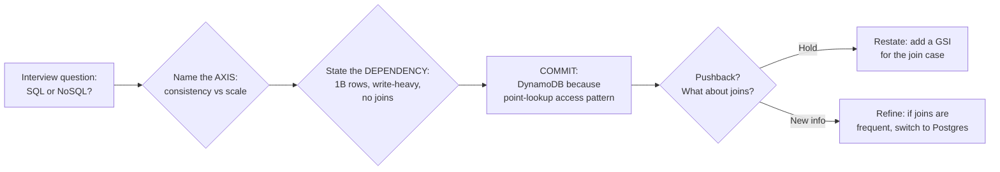
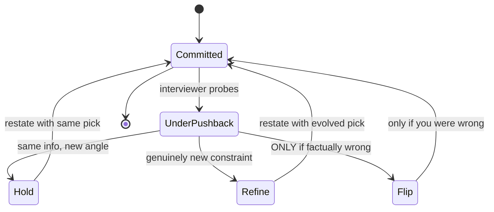

# Trade-off Articulation: Saying "It Depends" Well

> **TL;DR**: "It depends" is the most overused phrase in system design interviews and the least useful when it stands alone. The fix is a three-part sentence: **it depends on X** (the axis), **because Y** (the dependency from the requirements), **so I pick Z** (the commitment). Interviewers do not grade whether you picked Redis or Memcached; they grade whether you named the trade-off, connected it to the requirements, and committed under pressure[^1]. Jeff Bezos's rule: make the call with about 70% of the information you wish you had[^2]. Waiting for 90% is almost always too slow.

## Learning Objectives

After this module, you will be able to:

- [ ] Structure a trade-off answer in three parts: axis, dependency, commitment
- [ ] Name the 10 most common axes (consistency vs availability, latency vs throughput, simplicity vs flexibility, and more)
- [ ] Push back on an interviewer's challenge without flipping your answer
- [ ] Avoid the "option buffet" anti-pattern (naming five options with no choice)
- [ ] Apply the "what would break if we did the opposite?" test to validate a commitment
- [ ] Distinguish essential complexity from accidental complexity when framing a trade-off

## Intuition

You walk into a restaurant and ask the waiter: "What should I order?" The waiter says "it depends." You stare at each other. Nothing happens.

Now imagine a different waiter. You ask the same question. This waiter says: "It depends on whether you want something light or filling. You mentioned you are heading to a concert after dinner, so I would go with the salmon. It is quick to prepare, not too heavy, and pairs well with the house white. If you had more time, I would suggest the short ribs."

Same opening phrase. Completely different signal. The second waiter named the axis (light vs filling), stated the dependency (you have a concert, so time and heaviness matter), and committed (salmon). The first waiter punted.

System design interviews work the same way. When an interviewer asks "SQL or NoSQL?", the worst answer is "well, it depends." The best answer is: "It depends on the access pattern. We have a 1-billion-row write-heavy workload with no joins, so I pick DynamoDB because the access pattern is point-lookup and the write rate exceeds what a single Postgres can sustain. If we needed ad-hoc queries or joins, I would switch to Postgres."

That is the entire chapter in one paragraph. The rest teaches you how to do it reliably, across every axis, under pressure.

## Theory

### The three-part formula

[Trade-off Thinking](../part-1-core-fundamentals/06-trade-off-thinking.md) introduced the six-part articulation template (Context, Options, Chosen, Why, Given up, Reversible?). This chapter compresses it into a verbal shape you can deliver in 15 seconds during an interview:

1. **Axis** - what are we trading? Name the dimension under tension.
2. **Dependency** - what constraint from the requirements determines the call?
3. **Commitment** - what did we pick, stated declaratively?

The formula in speech: "It depends on **[axis]**. Given **[dependency from requirements]**, I pick **[option]** because **[reason]**. If **[dependency changes]**, I would switch to **[alternative]**."

That final "if the dependency changes" sentence is what elevates a senior answer to a staff answer. It shows awareness that the choice is context-dependent, not dogmatic[^3].

*A senior-level trade-off answer is a three-node chain: name the axis, bind it to a dependency from the requirements, commit to an option. Pushback refines but does not flip.*

### The ten axes you will use most

Every system design interview draws from a small set of recurring trade-off dimensions. You do not need to re-derive them each time. Memorize the axis, the two endpoints, and one real-system example at each end.

```mermaid
flowchart TD
    subgraph CAP["Consistency vs Availability"]
        S1["Spanner, etcd<br/>CP"] --- D1["Cassandra AP;<br/>DynamoDB default AP,<br/>opt-in strong reads"]
    end
    subgraph LT["Latency vs Throughput"]
        S2["Online serving<br/>optimize latency"] --- D2["Kafka, Flink<br/>optimize throughput"]
    end
    subgraph RW["Read-heavy vs Write-heavy"]
        S3["Postgres B-tree<br/>read-optimized"] --- D3["Cassandra LSM<br/>write-optimized"]
    end
    subgraph MM["Monolith vs Microservices"]
        S4["Shopify modular monolith<br/>simple, one deploy"] --- D4["Netflix microservices<br/>independent scale"]
    end
    subgraph PP["Push vs Pull"]
        S5["Push fanout<br/>precomputed feed"] --- D5["Pull on read<br/>scatter-gather"]
    end
    subgraph EA["Exactly-once vs At-least-once"]
        S6["Flink 2PC<br/>exactly-once"] --- D6["Kafka 3.0+ default<br/>idempotent producer<br/>(acks=all)"]
    end
```

*Each axis has two canonical real-system endpoints. Memorize the endpoints and the interview-language pattern auto-fills.*

Here is the full cheat sheet with interview language for each:

| Axis | Endpoint A | Endpoint B | Interview sentence |
|------|-----------|-----------|-------------------|
| Consistency vs availability | CP (Spanner, etcd) | AP by default (Cassandra; DynamoDB eventually consistent reads, with opt-in strong reads and ACID transactions) | "Under partition, I sacrifice availability for correctness because this is a payment system." |
| Latency vs throughput | Low-latency serving | High-throughput batch | "Checkout needs p99 under 200 ms, so I use sync RPC, not a queue." |
| Read perf vs write perf | B-tree (Postgres) | LSM-tree (Cassandra, RocksDB) | "100:1 read-to-write ratio, so B-tree indexes pay off." |
| Normalization vs denormalization | Normalized (one source of truth) | Denormalized (fast reads, no joins) | "Feed reads are 10,000x writes, so I denormalize the timeline." |
| Monolith vs microservices | Monolith (simple, transactional) | Microservices (independent scale) | "Three engineers, one service. Monolith until team size forces the split." |
| Sync vs async | Synchronous RPC | Async messaging (Kafka, SQS) | "User-facing write is sync for immediate feedback; fanout is async." |
| Push vs pull | Fan-out-on-write | Fan-out-on-read | "Normal users get push; celebrities get pull at read time." |
| Exactly-once vs at-least-once | Transactional exactly-once (Flink 2PC) | Idempotent at-least-once (Kafka producer defaults to idempotent with acks=all since 3.0; pre-3.0 default was at-least-once) | "Counters need exactly-once; notifications tolerate at-least-once." |
| SQL vs NoSQL | Relational (joins, ACID, flexible queries) | NoSQL (scale, predictable latency, schema-free) | "Access pattern is key-value at 1M QPS. DynamoDB. No joins needed." |
| gRPC vs REST vs GraphQL | gRPC (binary, low-latency internal) | REST (cacheable, universal) / GraphQL (client-shaped) | "Internal service-to-service uses gRPC; public API uses REST for cacheability." |

### The theoretical backbone

These axes are not arbitrary. They trace back to a chain of formal results:

- **CAP (Brewer 2000, Gilbert-Lynch 2002):** In an asynchronous network, consistency and availability are mathematically incompatible during partitions[^4]. [CAP and PACELC Theorems](../part-3-distributed-systems-theory/03-cap-and-pacelc.md) covers this in depth.
- **PACELC (Abadi 2012):** Even without a partition, every distributed write trades consistency for latency[^5]. This is the axis that matters 99.9% of the time, because partitions are rare.
- **Harvest/Yield (Fox and Brewer 1999):** Availability is not binary. You can return partial data (reduced harvest) or serve fewer requests (reduced yield)[^6]. Graceful degradation is a first-class design choice.
- **BASE vs ACID (Pritchett 2008):** Trading strict consistency for availability yields dramatic scalability if the business invariants tolerate it[^7].
- **No Silver Bullet (Brooks 1987):** Essential complexity is inherent to the problem; accidental complexity is inflicted by tools[^8]. Most "trade-offs" are really accidental-vs-accidental. The only real progress comes from reducing accidental complexity.
- **Gall's Law (1975):** A complex system that works evolved from a simple system that worked. A complex system designed from scratch never works[^9]. Start simple, then justify each addition.

### Commitment under uncertainty

Bezos's 2016 shareholder letter formalized "disagree and commit": make the call with about 70% of the information you wish you had, commit once the call is made, course-correct if wrong[^2]. The technical version: Amazon's Dynamo paper exposes (R, W, N) quorum parameters to the application developer so the trade-off is surfaced per-operation, not hidden in the storage layer[^10].

The Staff+ frame from Tanya Reilly's *The Staff Engineer's Path* (2022): the engineer who can name the axis, commit to a direction, and defend it is the one teams will follow[^11]. The test that separates staff from senior: **"What would break if we did the opposite?"** If you cannot answer that question about your own choice, you have not thought hard enough.

### Handling pushback

Interviewers deliberately introduce challenges to see how you respond. A question is often a test of depth, not a redirect[^1]. The correct response to pushback:

*Under pushback, the candidate's options reduce to two: hold with new justification (default) or refine with genuinely new information. Flipping under social pressure alone signals no conviction.*

The pattern: pause, restate the original reason, incorporate the interviewer's point as a refinement. "That is a good point. I still pick DynamoDB because of the write pattern, but for the join case you raised I would add a denormalized GSI."

## Real-World Example

Here is the same interview question answered at three levels. The question: "How would you store messages for a chat application at scale?"

**No-hire answer:**
> "Well, it depends. You could use SQL or NoSQL. Postgres is good for consistency, Cassandra is good for writes, MongoDB is flexible... it really depends on the use case."

The interviewer's notes: "Did not commit. Listed options without picking. No signal on depth."

**Hire answer (senior):**
> "It depends on the write volume and access pattern. We have 500 million messages per day, writes are append-only, reads are by conversation in reverse-chronological order. That is a write-heavy, partition-friendly workload with no joins. I pick Cassandra with a partition key of (conversation_id, bucket) because it handles the write rate and the read pattern is a single-partition scan."

**Strong-hire answer (staff):**
> "It depends on the write volume and consistency model. 500 million messages per day, append-only, partitioned by conversation. I pick Cassandra. The trade-off: I give up strong consistency and ad-hoc queries. I accept eventual consistency because chat messages are immutable after write, so conflicts are impossible. If the interviewer's concern is about read-your-writes for the sender, I would use LOCAL_QUORUM on the write path and LOCAL_ONE on reads, which gives session consistency without cross-region coordination. What would break if I did the opposite? Postgres would struggle to sustain hundreds of millions of daily inserts on a single node (throughput varies widely by hardware and configuration), and horizontal sharding Postgres is operationally expensive for an append-only workload."

The difference: the staff answer names what was given up, addresses the most likely objection preemptively, and answers "what would break if we did the opposite?"

Twitter's timeline architecture is the canonical push-vs-pull case. In its early architecture (pre-2012), timelines were materialized via Redis fanout on write. This broke under celebrity writes (one tweet by a 100M-follower account could theoretically require up to 100M writes). The resolution, adopted around 2012-2013: push for normal users, pull for celebrities, merge at read time[^12]. The honest commit: do not dogmatically pick one model. The celebrity class broke pure push; inactive-follower waste broke pure pull. The hybrid is the senior answer.

## Design decisions

**Answer breadth: how many options to surface.**

| Approach | Pros | Cons | Best when | Our Pick |
|----------|------|------|-----------|----------|
| Name one option, commit | Clear signal, easy to defend; fastest to depth | Interviewer may probe for breadth you did not show | You are confident the constraint forces one answer | Default for most questions |
| Name three options, pick one | Shows breadth and still commits; models staff-level reasoning | Risk of running out of time before the committed option is defended | Staff+ loops that explicitly reward breadth | Use when you have at least 90 seconds to spend on the comparison |

**Pushback response: how to react when the interviewer probes.**

| Stance | Pros | Cons | Best when | Our Pick |
|--------|------|------|-----------|----------|
| Hold with justification | Signals ownership and depth; treats the probe as a question about your reasoning, not a verdict | Risk if you are factually wrong and refuse to update | Interviewer is probing the same decision from a new angle with no new facts | Default posture under pushback |
| Refine with new facts | Incorporates a genuinely new constraint without abandoning the commitment | Requires distinguishing "new information" from "new social pressure" in real time | Interviewer introduces a constraint or scale point you had not considered | When the interviewer surfaces a fact you missed, not when they repeat the question louder |

## Common Pitfalls

> [!WARNING]
> **The option buffet.** Listing five databases (Postgres, MySQL, DynamoDB, Cassandra, MongoDB) and moving on without picking one. The interviewer's notes read "did not commit." Replace "you could use X or Y" with "X because Z; Y would be my second choice if Z changes"[^1].

> [!WARNING]
> **Flip-flopping on pushback.** Candidate picks DynamoDB, interviewer asks "but what about joins?", candidate immediately switches to Postgres, interviewer asks "but what about scale?", candidate switches back. This signals no conviction. Hold your position until genuinely new information arrives, not new questions[^1].

> [!WARNING]
> **False dichotomy.** Framing a decision as SQL-vs-NoSQL when the answer is polyglot: Postgres for core, Redis for cache, Elasticsearch for search, S3 for blobs. When you name an axis, also ask "can I pick both, one per sub-problem?"[^13]

> [!WARNING]
> **Presenting only pros.** Listing five reasons DynamoDB is good without naming a single downside. After naming two pros, force yourself to name two cons in the same breath, framed as "what I give up by picking this." Brewer's 2012 retrospective is a model: it explicitly calls out the "hidden cost of forfeiting consistency" even while endorsing the AP path[^10].

> [!WARNING]
> **Over-engineering against Gall's Law.** Proposing microservices with Kafka, Redis, Elasticsearch, and a service mesh for a problem that fits on one Postgres. Start with the smallest working design, then justify each addition by a specific non-functional requirement[^9].

## Exercise

Take ten past interviews (or mock interviews) where you struggled with trade-offs. Write each decision in the three-part format (axis, dependency, commitment). Share with a peer and ask: which of these would you, as an interviewer, push back on? Practice the pushback exchange; keep each to 90 seconds.

Hint

Focus on the dependency. Most weak answers fail because the axis is named but the dependency is missing. For each decision, ask: "What specific requirement or constraint makes this the right call?" If you cannot name one, the commitment is arbitrary.

Solution

Here is one worked example from the ten:

**Question:** "How would you handle session state?"

**Weak version:** "It depends. You could use sticky sessions, a distributed cache, or store it in the database."

**Three-part version:**

- **Axis:** Latency vs consistency of session data.
- **Dependency:** We have 50K concurrent users, stateless API servers behind a load balancer, and session data is small (under 1 KB per user). The SLO is p99 under 100 ms for authenticated requests.
- **Commitment:** I pick Redis as a centralized session store. It gives sub-millisecond reads for 1 KB values, the data fits in memory, and it decouples session state from any single server. I give up: Redis is an additional failure domain. Mitigation: Redis Sentinel for failover, and sessions are reconstructable from the auth token within 2 seconds if Redis dies.

**Pushback exchange:**

Interviewer: "What if Redis goes down?"

You: "Good question. Sessions are reconstructable from the JWT claims plus a database lookup. The user experiences a one-time 200 ms penalty on the next request while the session rebuilds. I accept that because Redis Sentinel recovers in under 5 seconds, so the window is small. If we needed zero-downtime sessions, I would add a second Redis replica in a different AZ, but that doubles cost for a failure mode that lasts seconds."

The key: you held your pick (Redis), addressed the concern (failover), and named the cost of the alternative (doubled infrastructure).

## Key Takeaways

- "It depends on X because Y, so I pick Z" is the three-part formula. Use it every time.
- Listing options without picking is the single most common interview anti-pattern. Commit.
- Hold your position under pushback if you have a good reason. Flipping looks worse than being wrong with conviction.
- The staff-level test: "What would break if we did the opposite?" If you cannot answer, you have not analyzed the trade-off.
- Memorize the ten axes and their real-system endpoints. The language becomes reflex with practice.
- Brooks's essential-vs-accidental distinction separates real trade-offs from false ones. Most "SQL vs NoSQL" debates are accidental-vs-accidental.
- Gall's Law: start simple, justify each addition. The complex system designed from scratch never works.

## Further Reading

- [CAP Twelve Years Later: How the "Rules" Have Changed](https://www.infoq.com/articles/cap-twelve-years-later-how-the-rules-have-changed/) (Brewer, 2012) - The retrospective that retired "2 of 3" and reframed C and A as continuous dimensions.
- [Consistency Tradeoffs in Modern Distributed Database System Design](https://www.odbms.org/2012/01/consistency-tradeoffs-in-modern-distributed-database-system-design/) (Abadi, 2012) - The PACELC paper that completes CAP with the normal-operation latency trade-off.
- [Life Beyond Distributed Transactions](https://queue.acm.org/detail.cfm?id=3025012) (Helland, 2007/2016) - The case for async messaging over cross-entity transactions at scale.
- [No Silver Bullet](http://sunnyday.mit.edu/16.355/BrooksNoSilverBullet2.html) (Brooks, 1986) - The meta-frame for essential vs accidental complexity; explains why most trade-offs are tool-vs-tool, not problem-vs-problem.
- [2016 Letter to Shareholders](https://www.aboutamazon.com/news/company-news/2016-letter-to-shareholders) (Bezos) - Source of "disagree and commit," the 70% rule, and one-way vs two-way doors.
- [What Your System Design Interviewer Is REALLY Judging You On](https://hellointerview.substack.com/p/what-your-system-design-interviewer) (Hello Interview, 2025) - The silent scorecard: trade-off navigation is the top hidden evaluation dimension.
- [The Staff Engineer's Path](https://www.oreilly.com/library/view/the-staff-engineers/9781098118723/) (Reilly, 2022) - Trade-off articulation as the load-bearing staff-plus skill.
- ["Strong Opinions, Weakly Held" Doesn't Work That Well](https://commoncog.com/blog/strong-opinions-weakly-held-is-bad/) (Chin, 2022) - Why the Saffo mantra is often misused as permission for passive opinion-changing; commitment requires more.

## Flashcards

**Q:** What is the three-part trade-off formula?
**A:** Axis (what are we trading?), Dependency (what constraint determines the call?), Commitment (what did we pick and why?). Delivered as: "It depends on X. Given Y, I pick Z."

**Q:** What is the "option buffet" anti-pattern?
**A:** Listing multiple options (Postgres, MySQL, DynamoDB, Cassandra, MongoDB) without picking one. The interviewer's notes read "did not commit." Always end with a declarative choice.

**Q:** How should you respond to interviewer pushback?
**A:** Pause. Restate the original reason. Incorporate the interviewer's point as a refinement, not a replacement. Hold your pick unless genuinely new information invalidates it.

**Q:** What is the staff-level test for a trade-off commitment?
**A:** "What would break if we did the opposite?" If you cannot answer this about your own choice, you have not analyzed the trade-off deeply enough.

**Q:** What does PACELC add to CAP?
**A:** Even without a partition, every distributed write trades consistency for latency. This is the axis that matters 99.9% of the time because partitions are rare.

**Q:** What is Gall's Law and how does it apply to system design?
**A:** A complex system that works evolved from a simple system that worked. A complex system designed from scratch never works. Start with the smallest working design and justify each addition.

**Q:** What is Brooks's essential vs accidental complexity distinction?
**A:** Essential complexity is inherent to the problem. Accidental complexity is inflicted by tools. Most "trade-offs" are really accidental-vs-accidental (Kafka vs RabbitMQ). Real progress comes from reducing accidental complexity.

**Q:** What is Bezos's 70% rule?
**A:** Make the call with about 70% of the information you wish you had. Waiting for 90% is almost always too slow. Pair with the two-way door test: if reversible, decide fast.

**Q:** Name three common axes in system design trade-offs.
**A:** (1) Consistency vs availability (CAP), (2) Latency vs throughput (batch vs online), (3) Read performance vs write performance (B-tree vs LSM-tree). Each has canonical real-system endpoints.

**Q:** What is the difference between a no-hire and a hire answer on "SQL or NoSQL?"
**A:** No-hire: "It depends, you could use either." Hire: "1B-row write-heavy workload, no joins, point-lookup access pattern, so DynamoDB. I give up ad-hoc queries and strong consistency."

**Q:** When is it acceptable to flip your answer in an interview?
**A:** Only when genuinely new information invalidates your original reasoning. Never flip under social pressure alone. Flipping without new facts signals lack of conviction.

**Q:** What does "disagree and commit" mean in practice?
**A:** State your disagreement, state why, then commit to execute the decision. Once committed, execute as if it were your own idea. Course-correct only when facts change, not when opinions do.

## References

[^1]: Hello Interview. "What Your System Design Interviewer Is REALLY Judging You On". Substack, April 2025. https://hellointerview.substack.com/p/what-your-system-design-interviewer
[^2]: Bezos, J. "2016 Letter to Shareholders". Amazon, April 2017. https://www.aboutamazon.com/news/company-news/2016-letter-to-shareholders
[^3]: King, E. "The System Design Interview: What is Expected at Each Level". Hello Interview blog. https://hellointerview.com/blog/the-system-design-interview-what-is-expected-at-each-level
[^4]: Gilbert, S. and Lynch, N. "Brewer's Conjecture and the Feasibility of Consistent, Available, Partition-Tolerant Web Services". SIGACT News, 2002. https://mwhittaker.github.io/papers/html/gilbert2002brewer.html
[^5]: Abadi, D. "Consistency Tradeoffs in Modern Distributed Database System Design". IEEE Computer, Feb 2012. https://www.odbms.org/2012/01/consistency-tradeoffs-in-modern-distributed-database-system-design/
[^6]: Fox, A. and Brewer, E. "Harvest, Yield and Scalable Tolerant Systems". HotOS 1999. https://paperswelove.org/papers/harvest-yield-and-scalable-tolerant-systems-dd4f89bf/
[^7]: Pritchett, D. "BASE: An ACID Alternative". ACM Queue, 2008. https://web.archive.org/web/20241111141336/https://queue.acm.org/detail.cfm?id=1394128
[^8]: Brooks, F. "No Silver Bullet: Essence and Accidents of Software Engineering". IEEE Computer, April 1987. http://sunnyday.mit.edu/16.355/BrooksNoSilverBullet2.html
[^9]: Gall, J. "Systemantics: How Systems Really Work and How They Fail". 1975. Gall's Law summary: https://www.deviq.com/laws/galls-law/
[^10]: Brewer, E. "CAP Twelve Years Later: How the 'Rules' Have Changed". IEEE Computer, Feb 2012, reproduced at InfoQ. https://www.infoq.com/articles/cap-twelve-years-later-how-the-rules-have-changed/
[^11]: Reilly, T. "The Staff Engineer's Path". O'Reilly, 2022. https://www.oreilly.com/library/view/the-staff-engineers/9781098118723/
[^12]: Kindatechnical. "Designing a Twitter/X News Feed: Fan-Out and Ranking". 2025. https://www.kindatechnical.com/system-design-interview/designing-a-twitter-x-news-feed-fan-out-and-ranking.html
[^13]: Mai, S. "SQL vs NoSQL: How to Answer This Interview Question in 2025". Hello Interview blog. https://hellointerview.com/blog/sql-vs-nosql
