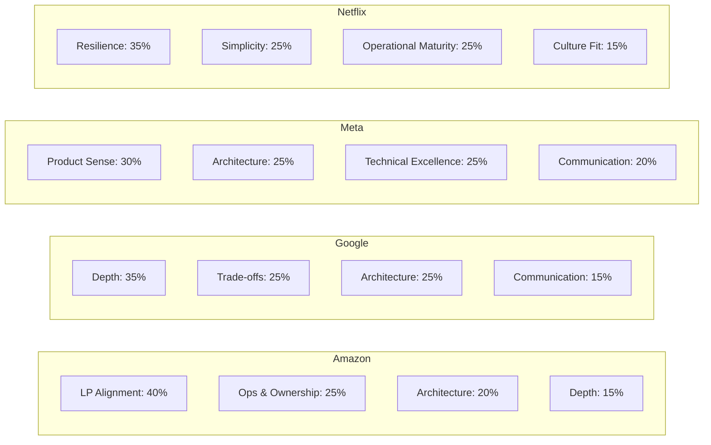
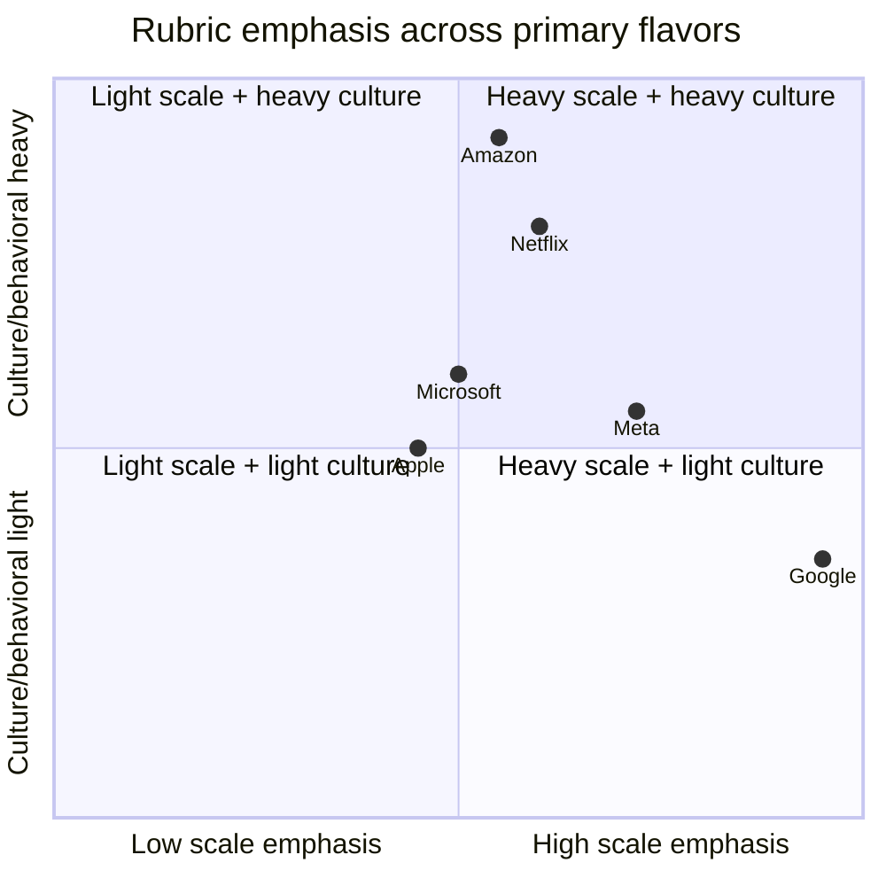

# Company-Specific Interview Flavors

> **TL;DR**: The same "design a shared shopping cart" prompt at four companies produces four different scores, not because your technical content varies, but because each company weights its rubric differently. Amazon scores against 16 Leadership Principles with a Bar Raiser who holds veto power[^1]. Google rewards recursive depth defended to five levels[^2]. Meta expects product reasoning before infrastructure[^3]. Netflix demands staff-level resilience thinking from every candidate[^4]. Your framework stays the same; what changes is emphasis, vocabulary, and where you spend your deep-dive minutes.

## Learning Objectives

After this module, you will be able to:

- [ ] Recognize the four primary interview flavors (Amazon, Google, Meta, Netflix) and their scoring mechanisms
- [ ] Tailor your framework emphasis to each company without sacrificing correctness
- [ ] Use company-aligned language (LPs at Amazon, depth defense at Google, user stories at Meta, blast-radius reasoning at Netflix)
- [ ] Identify the secondary flavors (Microsoft, Apple, Uber/Lyft, Stripe, Databricks, OpenAI/Anthropic) and their distinguishing signals
- [ ] Prepare a one-page "flavor cheat sheet" per target company

## Intuition

Imagine you are a jazz musician auditioning for four different bands. You play the same instrument, the same scales, the same chord progressions. But one band values improvisation over precision. Another wants you to lock into the rhythm section and never overplay. A third cares most about whether you listen to the vocalist. The fourth wants to hear you strip a solo down to three notes and make them count.

You do not learn four different instruments. You learn which three things each band listens for, and you put those three things front and center in your audition. The notes you play are 90% identical across all four auditions. The 10% that differs is emphasis, phrasing, and where you choose to shine.

System design interviews work the same way. The rubric dimensions (requirements, architecture, trade-offs, depth, communication) are universal. But each company's scoring function amplifies different dimensions. A candidate who delivers the identical answer at all four companies will get four different scores. This chapter teaches you the 10% adjustment that turns a "meets bar" into a "strong hire" at your target company.

## Theory

### The universal rubric with company-specific weights

Every major tech company evaluates system design against the same core dimensions: requirements gathering, high-level architecture, trade-off reasoning, deep technical knowledge, and communication. What differs is the weight each dimension carries in the final score.

*Approximate rubric weight distribution across the four primary flavors. These are not published numbers but reflect consistent patterns from interview guides and debrief reports.*

### Amazon: Leadership Principles woven into every round

Amazon evaluates candidates against 16 Leadership Principles that function as explicit scoring dimensions, not background culture[^5]. Each interviewer is pre-assigned 2 to 3 specific LPs, and together the loop covers all 16[^6]. A typical L5 (SDE II) system design "hour" is really 20 to 30 minutes of STAR-format behavioral probing plus 30 minutes of architecture[^6].

The Bar Raiser is the structural differentiator. This is an experienced interviewer from outside the hiring team with veto power over the hire. A single Bar Raiser "no" overrides a hiring manager's "yes."[^1] The program has operated for 25+ years with 10,000+ active Bar Raisers and trainees globally[^1].

**What to emphasize:**

- Frame design decisions using LP language: "I would own this end-to-end" (Ownership), "Let me start with the simplest thing that works" (Bias for Action), "The customer impact of this failure is..." (Customer Obsession).
- Always answer "who is paged at 3 AM?" and "what does the runbook look like?" These map to Dive Deep and Ownership.
- Prepare 10 to 12 STAR stories mapped to 2 to 3 LPs each. Bar Raisers drill a single story for 15 to 20 minutes; shallow examples collapse under follow-ups.

**Leveling:**

- L4 (SDE I): design round usually absent; coding-first.
- L5 (SDE II): one system design round; independent handling of fundamentals (caching, sharding, failure).
- L6 (Senior SDE): organization-wide systems, cost trade-offs, multi-service reliability.
- L7+ (Principal): multi-year architectural bets, cross-org technical direction.

### Google: depth, scale, and hiring-committee calibration

Google's system design round is a single 45-minute session that weighs heavily on level determination[^2]. The final decision is made by a hiring committee that never meets the candidate. Interviewers produce rubric-graded written feedback; committee members debate level based on feedback strength and consistency.

Google specifically prefers candidates who reason about underlying mechanisms rather than reaching for branded products. Saying "I would use Spanner" without explaining external consistency, TrueTime, and Paxos under-scores on the depth dimension[^2].

**What to emphasize:**

- Start with the simplest correct design. Add complexity only when a scale probe forces it.
- When the interviewer asks "why?", have a "why behind the why" ready. Google rewards recursive depth: "Because Paxos requires a majority quorum, which means..." not "Because it is consistent."
- Estimation rigor matters. Numbers must be defensible, not hand-waved.

**Leveling:**

- L3/L4: coding-focused; design round light or absent.
- L5 (Senior): system design is the primary leveling signal; independently own large components.
- L6 (Staff): redesign for 10x to 100x unprompted, anticipate failure modes, reason about multi-team impact[^2].
- L7+ (Senior Staff): public technical influence often expected.

**Googleyness (behavioral round):** Six commonly reported attributes: thriving in ambiguity, valuing feedback, challenging the status quo, putting the user first, doing the right thing, caring about the team[^2].

### Meta: product sense, two design tracks, and tight time boxes

Meta splits design into two interview types at E5+ (Senior): System Design for infrastructure-track engineers and Product Architecture for product-track engineers[^3]. The E6 (Staff) onsite runs five to six rounds: one to two coding, two design, one behavioral, and zero to one Project Retrospective[^7].

Each design round is 40 to 45 minutes. Product Architecture centers on user-facing products (Instagram, Uber, Ticketmaster) with heavier weight on API design, data modeling, and client-server interaction. System Design permits pure-infrastructure prompts explored from a backend-architecture angle[^3].

**What to emphasize:**

- Open with a user story before any diagram: "A returning user expects their feed to load in under 2 seconds with content no older than 30 seconds."
- Manage time aggressively. Spending 15 minutes on requirements in a 40-minute box is a common E6 rejection cause[^7].
- Expect mid-session pivots: "What if input is 10x?" or "What if we need real-time updates?" Meta interviewers modify prompts live and expect you to re-architect on the fly.

**Leveling:**

- E3/E4: coding-weighted; design absent or light.
- E5 (Senior): one design round; direct technical contribution plus project ownership.
- E6 (Staff): two design rounds; cross-team technical leadership plus Project Retrospective.
- E7+ (Senior Staff): org-wide technical direction; influence without authority.

**Five behavioral competencies:** Resolving conflicts, driving results, embracing ambiguity, growing continuously, communicating effectively[^7].

### Netflix: senior-only, resilience-first, longest onsite

Netflix has internal levels (L3 through L7 per public compensation data[^8]) but maintains a uniformly high hiring bar and expects senior-level maturity even at entry levels. The interview loop is the longest in FAANG: roughly 8 interviews, often split over two days[^4]. Netflix is the only FAANG that routinely includes 1 to 2 directors in the onsite, reportedly to reduce bias.

Hiring decisions are binary pass/fail, made in live post-onsite discussions with consensus striving, rather than through a rubric-based committee[^4]. The "Dream Team" round, conducted by a director, functions as a final cultural-fit gate.

**What to emphasize:**

- Justify every component. Extra boxes that are not justified read as "this person will create ops debt."
- Always name failure modes, blast radius, and "what the dashboard looks like when this breaks."
- Know the Netflix OSS vocabulary: Eureka (service discovery), Zuul (edge routing), Spinnaker (deploys), Chaos Monkey (failure injection).
- Prepare for "reverse system design" rounds: describe deeply a real system you have shipped, including trade-offs and regrets[^4].

**The keeper test:** Managers ask "if X wanted to leave, would I fight to keep them?" or "knowing everything I know today, would I hire X again?" If the answer is no, Netflix believes "it's fairer to everyone to part ways quickly"[^9].

### Secondary flavors in brief

**Microsoft (levels 59 to 67+):** Four-round loop with a final "As Appropriate" interviewer who makes the hire/no-hire call. Culture signal: growth mindset, learning from failure, intellectual humility. Cloud-heavy roles probe Azure, Kubernetes, and identity (Entra ID) design.

**Apple (ICT2 to ICT6):** Secrecy is structural. Teams often do not know what other teams build. Loops are org-specific: Apple Silicon focuses on low-level systems; Services (iCloud, Apple Music) looks like traditional backend SDI; ML roles emphasize on-device inference and privacy-preserving design. End-to-end encryption is a first-class design constraint.

**Uber / Lyft:** Real-time systems flavor. Geospatial indexing (H3 hexagonal grid)[^10], real-time matching under tight latency budgets at 40M+ trips per day[^11], GPS stream ingestion at millions of events/sec. Interviewers expect reasoning about driver-state freshness and stale-data handling.

**Stripe / Square / Shopify:** Payment correctness is the organizing principle. Interviews emphasize idempotency keys, exactly-once semantics, immutable double-entry ledgers, state-machine safety under retries and partial failures, and PCI-DSS compliance. Shopify adds a unique one-hour "Life Story" round (non-technical career narrative).

**Databricks / Snowflake:** OLAP and data-lakehouse flavor. Interviews probe query engine internals, separation of storage and compute, columnar formats (Parquet, Iceberg, Delta), and distributed SQL planning.

**OpenAI / Anthropic:** ML infra flavor. Designs are LLM-aware: GPU scheduling under heterogeneous hardware, multi-tenant inference serving with latency/cost trade-offs, safety moderation as a first-class layer, and distributed training coordination across hundreds of nodes.

### Loop structure comparison

The shape of the onsite loop determines where design and behavioral signal live:

```mermaid
flowchart TD
    subgraph Amazon["Amazon L5 (4-5 rounds)"]
        direction LR
        A1["Coding + LP"] --> A2["Coding + LP"] --> A3["System Design + LP"] --> A4["LLD + LP"] --> A5["Bar Raiser"]
    end
    subgraph Google["Google L5 (5 rounds)"]
        direction LR
        G1["Coding"] --> G2["Coding"] --> G3["System Design"] --> G4["RRK"] --> G5["Googleyness"]
    end
    subgraph Meta["Meta E6 (5 rounds)"]
        direction LR
        M1["Coding"] --> M2["Design 1"] --> M3["Design 2"] --> M4["Behavioral"] --> M5["Project Retro"]
    end
    subgraph Netflix["Netflix (~8 rounds)"]
        direction LR
        N1["HM Screen"] --> N2["Tech Phone"] --> N3["SDI x3"] --> N4["Behavioral x2"] --> N5["Dream Team"]
    end
```

*Onsite loop shape for each primary flavor. Amazon weaves behavioral into every round; Google isolates it; Meta doubles down on design; Netflix runs the longest loop with director involvement.*

Notice the structural implications: Amazon gives you only 30 minutes of pure design time per round because LPs consume the rest. Google gives you a clean 45 minutes but evaluates depth ruthlessly. Meta gives you two design shots but each is only 40 minutes. Netflix gives you the most design time overall but expects staff-level maturity in every minute of it.

### Startup vs. big-tech

Startups (Series A through C) typically run shorter loops: one phone screen plus a half-day onsite of 3 to 4 rounds. The design round is often a take-home design doc followed by a live review, or a single 60-minute whiteboard session. The evaluation bias shifts toward pragmatism ("can you ship this in 6 weeks with 3 engineers?") over scale ("can this handle 1B users?").

At big tech, the design round is the leveling decision for senior+ candidates. At startups, the design round is a culture-fit and velocity signal. Both matter; the preparation emphasis differs.

## Real-World Example

Consider the prompt "Design a shared shopping cart for an e-commerce platform" delivered at all four primary companies. The same candidate, same technical knowledge, four different optimal responses:

**At Amazon (30 minutes of design time):** You open with "Customer Obsession drives this: a user who adds items on mobile and checks out on desktop must see a consistent cart within 2 seconds." You frame every decision through an LP: "Frugality means I will use DynamoDB over a custom solution here." You close with "Ownership: I would own the on-call rotation for this service and here is what the runbook looks like when cart-sync fails."

**At Google (45 minutes):** You open with estimation: "500M DAU, 10% add-to-cart daily = 50M writes/day = 580 writes/sec average, 3K peak." When the interviewer asks "why DynamoDB?", you explain the LSM-tree write path, partition key distribution, and why eventual consistency is acceptable for cart reads but not for checkout. You defend to five levels of "why."

**At Meta (40 minutes):** You open with a user story: "A returning user on Instagram Shopping expects their saved items to persist across sessions, load in under 200ms, and reflect real-time price changes." You sketch the API and data model before drawing infrastructure boxes. When the interviewer pivots ("what if we add collaborative carts for group buying?"), you re-architect the data model live.

**At Netflix (staff-level, 60 minutes):** You open with failure modes: "The cart service is on the critical checkout path. If it goes down, revenue stops. I need blast-radius isolation, a circuit breaker on the downstream inventory service, and a degraded mode that serves stale cart data from a local cache." You justify every component and explicitly remove one you initially drew: "I do not need this message queue because the write volume does not justify the operational overhead."

Same prompt. Same candidate. Four different emphasis patterns. Four different scores.

*Where each flavor sits on the scale-versus-culture axes. Amazon weights LPs heavily but accepts mid-scale designs; Google demands depth at extreme scale with lighter culture checks; Netflix expects both staff-level scale reasoning and strong culture fit; Microsoft sits balanced in the middle.*

## Trade-offs

Companies are not substitutable choices a candidate picks between. A candidate's target company is an input, not a trade-off. The genuine decision this chapter supports is how to *weight preparation* once the target is fixed: which rubric axes to over-invest in, which standard framework outputs to cut, and which signals to amplify.

The per-company sections above (Amazon, Google, Meta, Netflix, secondary flavors) already carry the prep guidance in more depth than a table row can hold, and the `quadrantChart` in the Real-World Example plots all six primary flavors on the two axes that actually differentiate them (scale emphasis vs culture/behavioral emphasis). Use them together as the chapter's comparison artifact:

- **Amazon:** weight LPs and ops-ownership stories; expect ~30 minutes of design time after LP-heavy rounds; prepare 10-12 STAR stories mapped to 2-3 LPs each[^6].
- **Google:** weight depth and estimation rigor; practice defending a conventional sharded-MySQL-plus-Redis answer against recursive "why" probes rather than reaching for novel architectures[^2].
- **Meta:** weight product framing and tight time management; draft a one-paragraph user story before any diagram; practice 35-minute timed runs for the 40-minute box[^3].
- **Netflix:** weight simplicity, blast-radius reasoning, and operational maturity; prepare as if every round is staff-level; practice "reverse SDI" on your largest real system[^4][^9].
- **Microsoft:** weight growth-mindset and collaboration stories alongside pragmatic Azure design; expect team-dependent variance across the standard level bands.

The quadrantChart above is the cross-company comparison; the per-company H3 sections are the per-company prep plan. Together they replace what a single companies-as-rows table cannot honestly express.

## Common Pitfalls

> [!WARNING]
> **One-size-fits-all prep.** Delivering the identical framework answer at all four companies and scoring three "meets bar" and one miss. Build a one-page cheat sheet per target company covering three phrases, three values, and three deep-dive topics. Rehearse with the sheet visible in mocks.

> [!WARNING]
> **Ignoring LPs at Amazon.** Treating behavioral questions as throwaway and being blindsided when the Bar Raiser spends an hour exclusively on two LPs with drilling follow-ups. LPs are 50%+ of signal at Amazon; every interviewer owns specific LPs[^6].

> [!WARNING]
> **Missing product sense at Meta.** Designing a pure-backend Instagram (shards, caches, feed ranking) without opening with "why does the user want this?" Draft a one-paragraph user story before any diagram; state non-functional requirements grounded in user experience.

> [!WARNING]
> **Over-indexing on novelty at Google.** Reaching for an exotic architecture when a standard sharded-MySQL-with-Redis answer would score better. Google wants deep understanding of conventional mechanisms, not novel architectures. Start simple; add complexity only when a scale probe forces it.

> [!WARNING]
> **Under-engineering at Netflix.** Delivering an L5-appropriate answer (one database, read replicas, a CDN) at a Netflix onsite that expects blast-radius reasoning, chaos-testing hooks, multi-region failover, and explicit on-call runbook design. Although Netflix has internal levels (L3-L7), the hiring bar is uniformly high; prepare as if every round is staff-level.

## Exercise

Pick three target companies from the list in this chapter. For each company, write a one-page cheat sheet containing:

1. Three phrases that resonate with that company's culture (e.g., "I would own this end-to-end" for Amazon)
2. Three values or LPs to have ready with STAR stories
3. Three deep-dive topics the company tends to push on
4. The time budget adjustment (e.g., "only 30 min of design time at Amazon because LPs consume the rest")

Practice one mock interview with each sheet open. Notice what changes in your delivery.

Hint

For Amazon, your three phrases should map to Ownership, Customer Obsession, and Dive Deep. For Google, prepare to defend "why" at five levels for your chosen database, your chosen consistency model, and your chosen partitioning scheme. For Meta, write the user story before you open the diagramming tool.

Solution

**Amazon cheat sheet example:**

- Phrases: "I would own this end-to-end," "The customer impact of this failure is...," "Let me start with the simplest thing that works and iterate."
- LPs with stories: Ownership (led a migration with no PM), Customer Obsession (reversed a decision based on user data), Dive Deep (debugged a p99 latency spike to a GC pause).
- Deep-dive topics: operational runbooks, cost optimization (DynamoDB capacity modes), failure blast radius.
- Time budget: 30 min design, 20-30 min LP behavioral per round.

**Google cheat sheet example:**

- Phrases: "Because the underlying mechanism requires...," "At 10x scale this breaks because...," "The trade-off is read amplification vs write amplification."
- Values: depth over breadth, mechanism over product name, estimation rigor.
- Deep-dive topics: consensus protocol internals, storage engine trade-offs (LSM vs B-tree), distributed transaction models.
- Time budget: full 45 min for design; separate Googleyness round.

**Meta cheat sheet example:**

- Phrases: "A returning user expects...," "The product metric this optimizes is...," "Let me sketch the API contract first."
- Competencies: driving results (shipped X under ambiguity), resolving conflicts (disagreed with PM, data won), embracing ambiguity (scoped a vague problem into deliverables).
- Deep-dive topics: API design for mobile clients, data model for personalization, real-time update delivery.
- Time budget: 40 min total; spend no more than 8 min on requirements; get to deep dives by minute 25.

The key insight: your technical knowledge is the same across all three sheets. What changes is framing, vocabulary, and time allocation.

## Key Takeaways

- The rubric is universal; the scoring weights are not. Tailor delivery, not content.
- Amazon's 16 Leadership Principles are explicit scoring dimensions, not background culture. A Bar Raiser with veto power enforces them.
- Google rewards recursive depth on one topic more than breadth across ten. Defend to five levels of "why."
- Meta treats product sense as table stakes for senior engineers. A systems-only answer under-performs even on the System Design track.
- Netflix punishes over-engineering. The strongest answer is often the one with the fewest boxes, each justified by a concrete failure mode.
- Secondary flavors (Uber: real-time geo; Stripe: payment correctness; Databricks: OLAP internals; OpenAI: GPU scheduling + safety) require domain-specific vocabulary on top of the universal framework.
- Build a one-page cheat sheet per target company. Three phrases, three values, three deep-dive topics. Practice with it visible until the emphasis becomes automatic.

## Further Reading

- [Amazon Leadership Principles](https://www.aboutamazon.com/about-us/leadership-principles): The canonical list of 16 LPs with one-paragraph descriptions; required reading before any Amazon loop.
- [Amazon Bar Raiser program overview](https://aws.amazon.com/careers/life-at-aws-amazons-bar-raiser-program-hiring-for-long-term-growth-and-innovation/): How Bar Raisers work, what they evaluate, and why the veto matters.
- [Netflix Culture Memo](https://jobs.netflix.com/culture): Dream Team, keeper test, informed captain, disagree-then-commit; Netflix interviewers directly probe these phrases.
- [Hello Interview: Google L5 guide](https://www.hellointerview.com/guides/google/l5): Round-by-round breakdown of Google's senior SWE loop with rubric dimensions and depth expectations.
- [Hello Interview: Meta System Design vs Product Architecture](https://www.hellointerview.com/blog/meta-system-vs-product-design): Former Meta Staff engineer Evan King on how identical prompts are scored differently across the two tracks.
- [Interviewing.io: Netflix interview guide](https://interviewing.io/netflix-interview-questions): Netflix's uniquely long onsite, director inclusion, reverse system design, and Dream Team round.
- [Pragmatic Engineer: comparing interviews at 8 companies](https://blog.pragmaticengineer.com/comparing-interviews-at-8-large-tech-companies/): Data-backed cross-company comparison of loop length, behavioral weight, and decision architecture.
- [Stripe: designing idempotent APIs](https://stripe.com/blog/idempotency): Primary source on the payment-correctness vocabulary expected at fintech interviews.

## Flashcards

**Q:** What structural mechanism makes Amazon's interview unique among FAANG?
**A:** The Bar Raiser: an experienced interviewer from outside the hiring team with veto power over the hire. A single "no" from the Bar Raiser overrides a hiring manager's "yes."

**Q:** How much of a typical Amazon L5 system design round is consumed by Leadership Principle behavioral questions?
**A:** Approximately 20 to 30 minutes out of a 60-minute round, leaving only 30 minutes for architecture.

**Q:** What does Google's hiring committee do, and why does it matter for candidates?
**A:** The committee reviews written interviewer packets without ever meeting the candidate. This reduces single-interviewer bias but means your written signal (how well the interviewer can summarize your answer) matters as much as the live conversation.

**Q:** What are Meta's two design interview tracks at E5+?
**A:** System Design (infrastructure-focused) and Product Architecture (user-facing, API-first). The same prompt can appear in both tracks but is scored on different dimensions.

**Q:** Why is over-engineering a negative signal at Netflix but not at Google?
**A:** Netflix's culture values simplicity and operational maturity. Every unjustified component is future ops debt. Google values depth, so adding complexity is acceptable if you can defend the mechanism to five levels of "why."

**Q:** What is Netflix's "keeper test" and how does it affect hiring?
**A:** Managers ask "if X wanted to leave, would I fight to keep them?" or "knowing everything I know today, would I hire X again?" If the answer is no, Netflix believes "it's fairer to everyone to part ways quickly." The test drives a uniformly high hiring bar across all levels (L3-L7).

**Q:** How long is Netflix's onsite loop compared to other FAANG companies?
**A:** Roughly 8 interviews, often split over two days. This is the longest in FAANG, with 1 to 2 directors included as standard practice.

**Q:** What vocabulary should you use at Stripe/Square interviews that differs from general system design?
**A:** Idempotency keys, exactly-once semantics, immutable double-entry ledgers, state-machine safety under retries, PCI-DSS compliance, and reconciliation.

**Q:** What is the key difference between how Amazon and Google make hiring decisions?
**A:** Amazon uses a Bar Raiser with veto power in a live debrief. Google uses a hiring committee that reviews written packets without meeting the candidate.

**Q:** At Meta E6, how many design rounds are in the onsite, and how long is each?
**A:** Two design rounds, each 40 to 45 minutes. Time management is critical because spending 15+ minutes on requirements is a common rejection cause.

**Q:** What should you prepare for a "reverse system design" round at Netflix?
**A:** A deep description of the largest-scale system you have personally shipped, including architecture decisions, trade-offs accepted, failure modes encountered, and regrets.

**Q:** How do Uber/Lyft interviews differ from general backend system design?
**A:** They emphasize real-time systems: geospatial indexing (H3 hexagonal grid), matching under tight latency budgets, GPS stream ingestion at millions of events/sec, and driver-state freshness.

## References

[^1]: AWS Careers, "Raising the bar: How Amazon hires for long-term growth and innovation" (Bar Raiser 25-year retrospective), 2024. https://aws.amazon.com/careers/life-at-aws-amazons-bar-raiser-program-hiring-for-long-term-growth-and-innovation/
[^2]: Hello Interview, "Google L5 (Senior) Software Engineer Interview Guide". https://www.hellointerview.com/guides/google/l5
[^3]: Evan King, "Understanding the Differences between Meta's SWE Product Architecture and System Design Interviews", Hello Interview. https://www.hellointerview.com/blog/meta-system-vs-product-design
[^4]: Interviewing.io, "A Senior Engineer's Guide to Netflix's Interview Process and Questions". https://interviewing.io/netflix-interview-questions
[^5]: Amazon, "Leadership Principles". https://www.aboutamazon.com/about-us/leadership-principles
[^6]: Hello Interview, "Amazon L5 (SDE II) Software Engineer Interview Guide". https://www.hellointerview.com/guides/amazon/l5
[^7]: Hello Interview, "Meta E6 (Staff) Software Engineer Interview Guide". https://www.hellointerview.com/guides/meta/e6
[^8]: Levels.fyi, "Netflix Software Engineer Salaries" (shows levels L3 through L7), accessed 2026-05-08. https://www.levels.fyi/companies/netflix/salaries/software-engineer
[^9]: Netflix, "Culture Memo". https://jobs.netflix.com/culture
[^10]: Uber Engineering, "H3: Uber's Hexagonal Hierarchical Spatial Index", 2018. https://www.uber.com/blog/h3/
[^11]: Uber, "Uber Announces Results for Fourth Quarter and Full Year 2025" (CEO quote: "more than 40 million trips every day"), February 2026. https://investor.uber.com/news-events/news/press-release-details/2026/Uber-Announces-Results-for-Fourth-Quarter-and-Full-Year-2025/
