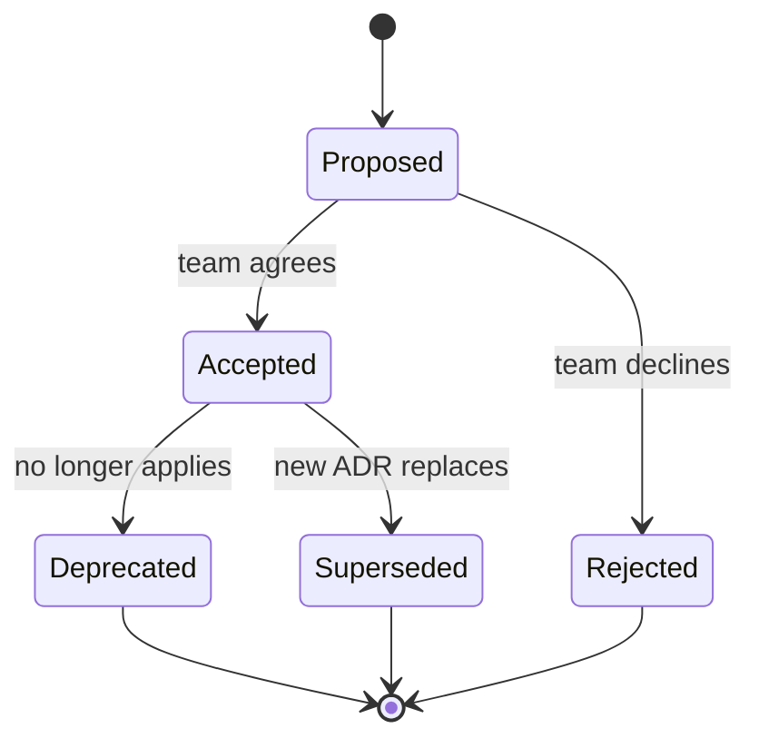
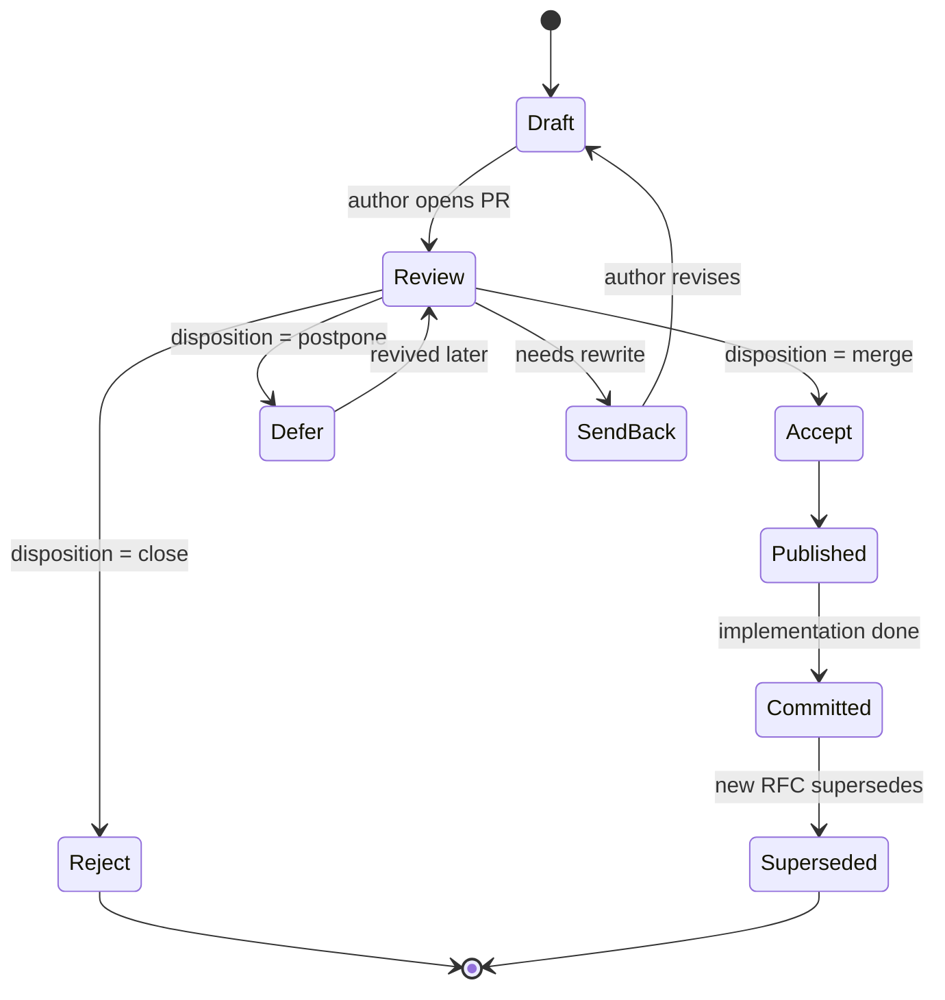
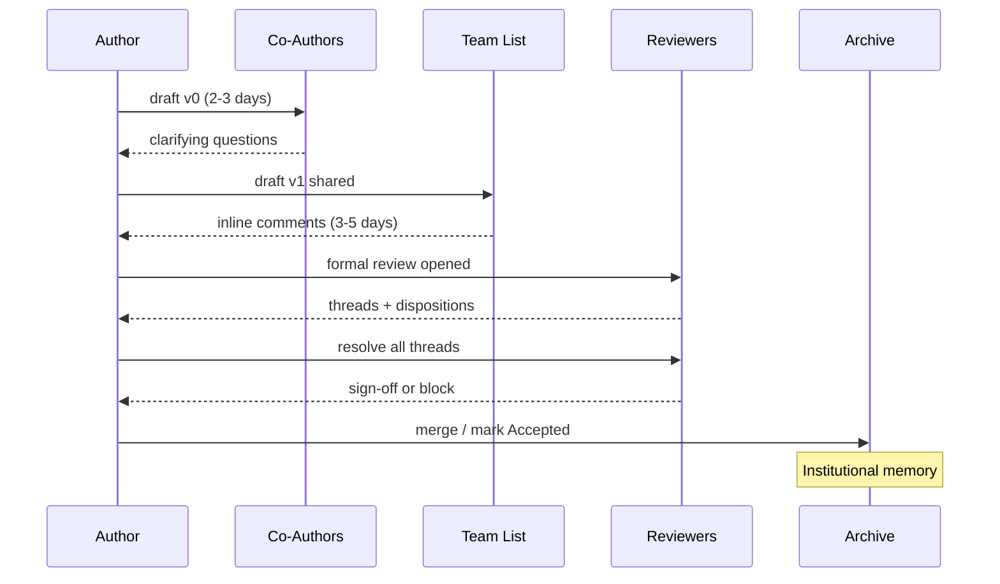
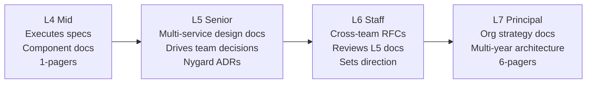

# Design Doc Authoring

> **TL;DR**: The whiteboard evaporates. The design doc persists. For a Staff+ engineer, the written artifact is the primary leverage: ADRs log single decisions in under a page, design docs align cross-team architecture in 10-20 pages[^1], and RFCs gate proposals through explicit lifecycle states. Google analyzed 141,652 approved design documents and found that structured review interventions reduced median time-to-approval by 25%[^2]. Master the format, the review culture, and the lifecycle, and your decisions compound instead of disappearing.

## Learning Objectives

After this module, you will be able to:

- [ ] Write a Nygard-format ADR in under 30 minutes
- [ ] Structure a design doc with the nine canonical sections (including Non-Goals and Alternatives Considered)
- [ ] Run an RFC through its lifecycle and give ask-don't-tell feedback
- [ ] Choose the right format (ADR, design doc, RFC, 6-pager) for a given decision scope
- [ ] Map doc output to level expectations from L4 to L7

## Intuition

You move into a new apartment. The previous tenant left no notes. The thermostat has three unlabeled modes. The breaker panel has 20 switches, none labeled. The garden hose connects to a valve you cannot find. You spend the first month reverse-engineering decisions someone else made years ago.

Now imagine the previous tenant left a binder. Page one: "We set the thermostat to mode 2 because mode 3 trips the breaker when the AC runs simultaneously. We considered replacing the breaker panel but the landlord refused." That is an Architecture Decision Record. It is short, it names the context, the decision, and the consequences, and it saves you a week of debugging.

A design doc is the blueprint you write before renovating the kitchen. It names what you are building, what you are not building, the alternatives you rejected, and how you will know it worked. An RFC is that blueprint submitted to the building committee for formal review before you start demolition.

The format differs. The purpose is identical: serialize a decision into prose so that reviewers can consent asynchronously and future readers can reconstruct intent. This chapter teaches you the dominant formats, the review culture that makes them work, and the anti-patterns that turn them into theater.

## Theory

### Why design docs matter

A design doc is a pre-implementation written artifact that captures context, goals, a proposed design, alternatives considered, and cross-cutting concerns. Its value is threefold.

First, writing is thinking. The act of serializing a plan into prose exposes logical gaps that diagrams and conversation hide. Malte Ubl frames this as "early identification of design issues when making changes is still cheap."[^1]

Second, async review scales past meeting bandwidth. A reviewer in Tokyo can engage before the author in New York wakes up. Uber's RFC process coordinated "dozens of systems and well over twenty engineering teams" in two months for their tipping launch.[^3]

Third, the doc survives personnel changes. At Google, "Where is the design doc?" is the standard first question when encountering an unfamiliar system.[^4] A whiteboard sketch does not survive a team reorg. A doc does.

The cost is real: creation overhead for obvious implementations, review latency if the team waits for weekly slots, and drift when docs are not updated alongside code. The skill is knowing when to write (one-way doors, cross-team changes) and when not to (two-way doors, trivial changes). [Trade-off Thinking](../part-1-core-fundamentals/06-trade-off-thinking.md) introduced the one-way/two-way door framework; design docs are the written process that one-way doors deserve.

### ADR format and its variants

Michael Nygard introduced Architecture Decision Records in 2011 as a reaction against large specifications that nobody updates: "Large documents are never kept up to date... small, modular documents have at least a chance at being updated."[^5]

The original template has five sections:

```markdown
# ADR-NNN: Use Postgres as primary operational store

## Status
Accepted

## Context
We need ACID transactions for payment flows. Our team has 5 years
of Postgres operational experience. DynamoDB was considered but
lacks cross-item transactions without Streams workarounds.

## Decision
We will use PostgreSQL 18 with logical replication for read replicas.

## Consequences
Positive: familiar tooling, strong consistency, rich ecosystem.
Negative: vertical scaling ceiling around 100K TPS write;
we accept this given current 2K TPS volume.
```

Key properties: ADRs are immutable once accepted. If a decision is reversed, you write a new superseding ADR and mark the old one as superseded. The history is the value.[^5]

**Nat Pryce's `adr-tools`** (first commit 2016, with version 2.0 in February 2017 introducing the current CLI interface) automates this with a CLI: `adr new Use Rust for performance-critical paths` scaffolds a numbered file in `doc/adr/`.[^6]

**MADR** (Markdown ADR, Zimmermann and Kopp, 2017) extends Nygard with YAML frontmatter metadata (status, date, deciders, consulted, informed), a Decision Drivers section, explicit Considered Options with pros/cons, and a Confirmation section for validating compliance.[^7] Microsoft's Well-Architected Framework now officially recommends ADRs with the immutability rule: "write a new record that supersedes the original and link the two together."[^8]



*ADRs are immutable once accepted; reversing a decision means writing a new superseding ADR, preserving the full decision history.*

### Design doc structure (Google-style)

A full design doc runs 10-20 pages for a large project and 1-3 pages for incremental work.[^1] The canonical sections:

1. **TL;DR** - 2-3 sentences a VP reads in 20 seconds.
2. **Context and Scope** - what exists today, what is changing, who is affected.
3. **Goals and Non-Goals** - explicit outcomes this doc addresses, and what is deliberately excluded.
4. **The Design** - system-context diagram, APIs, data storage, degree-of-constraint discussion.
5. **Alternatives Considered** - 2-4 real options with trade-off analysis for each.
6. **Cross-Cutting Concerns** - security, privacy, observability, rollout, migration.
7. **Open Questions** - known unknowns and explicit decision requests.
8. **Rollout Plan** - phased deployment, success metrics, rollback triggers.
9. **Document History** - amendment links rather than inline edits.

Two sections separate senior from junior writing. The **Non-Goals** section names things that could reasonably be goals but are explicitly excluded. Ubl: "non-goals aren't negated goals like 'The system shouldn't crash', but rather things that could reasonably be goals, but are explicitly chosen not to be goals."[^1] The **Alternatives Considered** section is where you demonstrate that you explored the design space: "this section is one of the most important ones."[^1]

[Trade-off Articulation](./03-trade-off-articulation.md) covers how to structure the alternatives analysis itself. [Diagramming Skills](./02-diagramming-skills.md) covers the visual artifacts that belong in the Design section.

### RFC process across organizations

An RFC (Request for Comments) adds process governance to a design doc: numbered identifiers, explicit lifecycle states, and formal disposition by a named decision body.

**IETF (the origin):** RFC 2026 defines the Internet Standards Track with minimum six-month soak at Proposed Standard and advancement requiring "at least two independent and interoperable implementations from different code bases."[^9] The procedural weight is extreme because it governs protocols used by thousands of vendors.

**Rust RFCs:** Fork the repo, copy the template, submit a PR. A sub-team proposes Final Comment Period (FCP) with a disposition (merge, close, postpone); all sub-team members must sign off; FCP lasts ten calendar days.[^10] The template mandates a Drawbacks section before Rationale and Alternatives, forcing the author to argue against their own proposal first.[^11]

**Python PEPs:** Three types (Standards Track, Informational, Process) with a PEP-Delegate (or the Steering Council) as decision-maker. Required sections include "How to Teach This" and "Rejected Ideas."[^12]

**Go proposals:** Start as a GitHub issue; discussion triages into accept, decline, or ask-for-design-doc. The design doc template adds a Compatibility section tied to Go's backward-compatibility promise.[^13]

**Oxide Computer RFDs:** "Request for Discussion" with six states (prediscussion, ideation, discussion, published, committed, abandoned). Each RFD lives on its own branch until published. Short URLs (`42.rfd.oxide.computer`), chat-bot fuzzy search, and an auto-maintained CSV index make them discoverable. Guidance: "3-5 business days to comment on your RFD before merging seems reasonable."[^14]



*An RFC progresses through named states; the Send-Back path is the one most authors forget to plan for.*

### Amazon 6-pager, 2-pager, and PR/FAQ

Amazon banned PowerPoint in favor of prose narratives. Jeff Bezos argued that full sentences force clearer thinking than bullet points, which can hide sloppy logic behind vague fragments.[^15]

The **PR/FAQ** starts with a mock press release (heading, subheading, problem, solution, customer quote, getting-started) followed by External FAQs (price, how it works) and Internal FAQs (TAM, competition, "top three reasons this product will not succeed"). That last question is the truth-seeking forcing function. Amazon spent over a year iterating the initial AWS PR/FAQ.[^16]

The **6-pager** for strategic planning has six sections: introduction, goals, tenets, state of the business, lessons learned, and strategic priorities. Tenets use the "better than / worse than" framing: "We value speed of iteration over completeness of specification" forces the author to name what they sacrifice.

The meeting format: 15-20 minutes of silent reading at the start, then 40 minutes of discussion.[^16] Silent reading ensures every reviewer actually reads the doc, eliminating the "I skimmed the email" failure mode.

[Company-Specific Flavors](./04-company-specific-flavors.md) introduces Amazon's writing culture in the interview context. This chapter goes deeper on the mechanics.

### Review culture and async norms

The doc is only as good as its review. Three principles make review work:

1. **Ask, don't tell.** Frame feedback as questions to uncover author intent. Oxide's guidance: "if the comment you are about to make is not something you would want someone commenting on an RFD of yours, then do not make the comment."[^14]
2. **Thread resolution belongs to the author.** The author decides which comments to accept but must address every thread: agree, push back with reasoning, or escalate.
3. **Time-box the review window.** Rust uses 10 calendar days for FCP.[^10] Oxide suggests 3-5 business days.[^14] Without a deadline, docs stall indefinitely.

Uber's scaling lesson: at 2,000+ engineers, hundreds of RFCs per week overwhelmed senior reviewers. The fix was tiered templates (lightweight for team scope, heavyweight for org scope) and a purpose-built tool with search and approver tracking integrated into Phabricator.[^3]



*The review phase is where the doc pays for itself; skipping or rubber-stamping it is the single most expensive engineering shortcut.*

### Doc output by engineering level

Written output scales with scope. At L4, engineers execute specs and contribute component-level writeups. At L5, they drive team decisions through design docs and ADRs. At L6 (Staff), cross-team RFCs become the primary leverage and reviewing other engineers' docs is a core responsibility. At L7 (Principal), docs set multi-year architectural direction, often in Amazon 6-pager or strategy-doc form.



*Doc output correlates with engineering level; L6 is the inflection where writing RFCs that span teams becomes the primary leverage.*

## Real-World Example

**Google's design-doc culture at scale**

Google treats design docs as a precondition for coding, not a deliverable produced in parallel.[^1] A 2023 study analyzed 141,652 approved design documents authored by 41,030 users over four years.[^2] The findings:

- **Typical length:** 10-20 pages for major projects; 1-3 page "mini design docs" for incremental work.[^1]
- **Failure modes:** Unclear reviewer lists, ambiguous approval state, and stalled threads were systemic issues. Structured interventions (pre-populated metadata, automated reviewer assignment) reduced median time-to-approval by 25%.[^2]
- **No single mandated template.** The section list is cultural convention, not tool-enforced. Teams converge on similar structures because the problems are universal.[^1]
- **Privacy and security reviews are mandatory gates** for any project touching user data. A separate privacy design doc is required.[^1]
- **Docs feed performance review.** This creates a double-edged incentive: engineers write docs to demonstrate impact, but the incentive can produce docs that describe state rather than decisions.[^4]

The "US constitution with amendments" pattern is Google's acknowledged failure mode: rather than update the original design doc, teams link out to new "amendment" docs, creating an archaeology problem for future maintainers.[^1] The antidote is Nygard's immutability principle: accept that the original doc is a snapshot, and write new ADRs for subsequent decisions.

## Trade-offs

| Format | Strengths | Weaknesses | Best when | Our Pick |
|---|---|---|---|---|
| Nygard ADR (short) | 1-2 pages; git-versioned; immutable; written in 30 min | Limited depth; no alternatives section | Small architecturally-significant decisions | Default for team-scoped one-way doors |
| MADR (extended ADR) | Structured alternatives with pros/cons; RACI metadata | More ceremony; template cargo-culting risk | Medium decisions with 2-5 genuine alternatives | When you need to show your work |
| Full design doc (Google-style) | Comprehensive; aligns many teams; surfaces cross-cutting concerns | 10-20 pages; review fatigue; meeting latency | Major cross-team architecture; new systems | Cross-team or privacy-sensitive changes |
| Amazon 6-pager / PR/FAQ | Business + tech in one; forces customer-first thinking | Hard to write (weeks to months); meeting-centric | New products; strategy; executive decisions | When the audience includes non-engineers |
| RFC (in-repo markdown) | Version-controlled; async PR review; explicit lifecycle states | Easy to miss reviewers without tooling; FCP too slow for startups | Open-source projects; platform changes; Git-workflow orgs | When you need public commitment and a paper trail |

## Common Pitfalls

> [!WARNING]
> **Post-hoc justification RFCs.** Writing the RFC after the code is already shipped turns the process into theater. Reviewers cannot meaningfully influence the outcome. Require RFC status before significant implementation begins.

> [!WARNING]
> **Missing Non-Goals section.** Without explicit non-goals, reviewers ask about every conceivable scope expansion, wasting weeks. Non-goals are not negated goals ("the system should not crash") but things that could reasonably be goals and are deliberately excluded ("ACID compliance," "multi-region support").

> [!WARNING]
> **Alternatives listed without real evaluation.** Listing straw-man alternatives with one-line dismissals while the chosen option gets paragraphs. Each alternative deserves pros, cons, and the specific trade-off that made it lose. MADR makes this structural with "Good, because... / Bad, because..." for every option.[^7]

> [!WARNING]
> **No observability or rollout plan.** The doc ends at "Implementation" with no answer to "How will we know this is working?" or "How do we roll back?" Uber's templates explicitly required testing, rollout, metrics, and monitoring sections.[^3]

> [!WARNING]
> **Wiki rot and docs drift.** The doc says one thing, the code does another. Mitigations: ADR immutability (never edit, only supersede), git-proximity (docs live next to code), and annual re-reading rituals.[^1]

## Exercise

Write an ADR for "migrate from MongoDB to Postgres" using the Nygard template: Context, Decision, Status, Consequences. One page. Bonus: draft the superseding ADR you would write if, 18 months later, Postgres had become the bottleneck.

<details>
<summary>Hint</summary>

The Context section should name the forces: why MongoDB is no longer sufficient (transaction needs, consistency requirements, operational familiarity). The Consequences section must name both positive outcomes (ACID, ecosystem) and negative ones (migration risk, vertical scaling ceiling). For the superseding ADR, think about what changes in context would make Postgres the wrong choice.

</details>

<details>
<summary>Solution</summary>

**ADR-0012: Use PostgreSQL as primary operational store**

**Status:** Accepted (2024-03-15)

**Context:** Our payment service requires cross-table transactions. MongoDB's multi-document transactions add 30% latency overhead and require careful session management. The team has 5 years of Postgres operational experience. Current write volume is 2K TPS; projected 12-month peak is 8K TPS, well within Postgres single-node capacity.

**Decision:** We will migrate the payment service from MongoDB 8.0 to PostgreSQL 18 with logical replication for read replicas. Migration will use a dual-write strategy over 4 weeks with shadow traffic validation.

**Consequences:**

- Positive: Native ACID transactions simplify payment logic. Rich ecosystem (pg_stat_statements, pgBouncer, logical replication). Team familiarity reduces on-call toil.
- Negative: Vertical scaling ceiling around 50-100K write TPS. Schema migrations require more discipline than schemaless MongoDB. We lose MongoDB's flexible document model for non-payment collections.
- Neutral: Operational runbooks need rewriting. Monitoring dashboards need rebuilding.

---

**ADR-0019: Shard payment data across multiple Postgres instances (supersedes ADR-0012)**

**Status:** Accepted (2025-09-20)

**Context:** Payment volume grew to 45K TPS (ADR-0012 projected 8K). Single-node Postgres is at 85% CPU during peaks. We considered: (1) vertical scaling (larger instance), (2) Citus for transparent sharding, (3) application-level sharding by merchant_id. Vertical scaling buys 6 months at best. Citus adds operational complexity but preserves SQL semantics.

**Decision:** We will deploy Citus with sharding by merchant_id. This preserves our Postgres expertise while distributing writes across 4 coordinator nodes.

**Consequences:**

- Positive: Horizontal write scaling to 200K+ TPS. Familiar SQL interface. Team retains Postgres operational muscle.
- Negative: Cross-shard queries (reporting across merchants) require careful query planning. Citus upgrade path is less battle-tested than vanilla Postgres.

</details>

## Key Takeaways

- The design doc is the decision. Whiteboard sketches evaporate; written artifacts compound into institutional memory.
- ADRs are immutable. Never edit a past ADR; write a superseding one. The history is the value.
- Non-Goals and Alternatives Considered are the two sections that separate senior from junior writing. Spend the most time here.
- Match format to scope: ADR for team decisions, design doc for cross-team architecture, RFC for public commitment, 6-pager for executive alignment.
- Review culture matters more than template choice. Ask-don't-tell feedback, time-boxed windows, and thread resolution by the author make any format work.
- Doc output correlates with engineering level. At L6/Staff, writing RFCs that span teams becomes the primary leverage.
- Truth-seeking beats selling. A doc with only pros is a pitch deck, not an architecture decision.

## Further Reading

- [Documenting Architecture Decisions (Nygard, 2011)](https://web.archive.org/web/20241019152849/https://www.cognitect.com/blog/2011/11/15/documenting-architecture-decisions) - The original ADR essay; 1,200 words that changed how teams record decisions. Read this first.
- [Design Docs at Google (Malte Ubl, 2020)](https://www.industrialempathy.com/posts/design-docs-at-google/) - The most cited single source on modern design-doc practice; covers sections, anti-patterns, and review culture.
- [RFD 1: Requests for Discussion (Oxide Computer, 2020)](https://oxide.computer/blog/rfd-1-requests-for-discussion/) - One of the clearest modern RFC processes on the open web; includes tooling, states, and cultural norms.
- [Engineering Planning with RFCs, Design Documents and ADRs (Gergely Orosz, 2022)](https://newsletter.pragmaticengineer.com/p/rfcs-and-design-docs) - How Uber's doc process evolved from DUCK to tiered ERDs at 2,000+ engineers.
- [Improving Design Reviews at Google (Ziftci and Greenberg, 2023)](https://research.google/pubs/improving-design-reviews-at-google/) - Data-driven paper analyzing 141K design docs with concrete interventions that reduced approval latency by 25%.
- [About MADR](https://adr.github.io/madr/) - The Markdown ADR template with rationale for each optional section; useful when Nygard feels too minimal.
- [Working Backwards PR/FAQ Instructions and Template](https://workingbackwards.com/resources/working-backwards-pr-faq/) - Full template and meeting format from the authors of the Amazon book.
- [rust-lang/rfcs README](https://github.com/rust-lang/rfcs) - Rust RFC process including the FCP mechanism and mandatory Drawbacks section.

## Flashcards

**Q:** What are the five sections of a Nygard ADR?
**A:** Title, Status (proposed/accepted/deprecated/superseded), Context (forces at play), Decision (stated in active voice: "We will..."), and Consequences (positive, negative, neutral).

**Q:** Why are ADRs immutable once accepted?
**A:** Immutability preserves the decision as it was actually made. If a decision is reversed, a new superseding ADR is written, keeping the full history intact for future readers.

**Q:** What is the most underused section in a design doc, according to Ubl?
**A:** Non-Goals. These are things that could reasonably be goals but are explicitly excluded. They prevent scope creep and save weeks of reviewer questions.

**Q:** How does Rust's RFC template force intellectual honesty?
**A:** It mandates a Drawbacks section before Rationale and Alternatives, requiring the author to argue against their own proposal before justifying it.

**Q:** What is the Amazon PR/FAQ's truth-seeking forcing function?
**A:** The Internal FAQ includes "top three reasons this product will not succeed," forcing the author to confront failure modes rather than sell the idea.

**Q:** What three failure modes did Google's 2023 study identify in design review?
**A:** Unclear reviewer lists, ambiguous approval state, and stalled comment threads. Structured automation reduced median time-to-approval by 25%.

**Q:** How did Uber scale its RFC process past 2,000 engineers?
**A:** Tiered templates (lightweight for team scope, heavyweight for org scope), a purpose-built search tool with approver tracking, and weekly formal reviews by experienced engineers for critical changes.

**Q:** What is the "US constitution with amendments" anti-pattern?
**A:** Rather than updating the original design doc, teams link out to new amendment docs, creating an archaeology problem. The fix is ADR-style immutability: accept the original as a snapshot and write new records for subsequent decisions.

**Q:** What is the difference between an ADR and an RFC?
**A:** An ADR records a single decision (short, immutable, no lifecycle). An RFC is a process-gated proposal with numbered identifier, explicit lifecycle states (draft, review, accept/reject/defer), and formal disposition by a named decision body.

**Q:** What doc output is expected at Staff (L6) level?
**A:** Cross-team RFCs that set technical direction, reviews of L5 design docs, and architecture docs that align multiple teams. The written artifact, not the code, is the primary leverage at this level.

**Q:** When should you NOT write a design doc?
**A:** For two-way door decisions (easily reversible), trivial implementations where the code is self-evident, and changes scoped entirely within one engineer's domain with no cross-cutting concerns.

**Q:** What does "better than / worse than" mean in Amazon's tenet framing?
**A:** Each tenet explicitly names what it sacrifices. "We value speed of iteration over completeness of specification" commits the team to accepting incomplete specs in exchange for faster learning. It forces trade-off honesty.

## References

[^1]: Malte Ubl, "Design Docs at Google", 2020. https://www.industrialempathy.com/posts/design-docs-at-google/
[^2]: Celal Ziftci and Ben Greenberg, "Improving Design Reviews at Google", IEEE/ACM International Conference on Automated Software Engineering, 2023. https://research.google/pubs/improving-design-reviews-at-google/
[^3]: Gergely Orosz, "Engineering Planning with RFCs, Design Documents and ADRs", The Pragmatic Engineer Newsletter, June 21, 2022. https://newsletter.pragmaticengineer.com/p/rfcs-and-design-docs
[^4]: Ryan Madden, "Things I Learned at Google: Design Docs", September 4, 2024. https://ryanmadden.net/things-i-learned-at-google-design-docs/
[^5]: Michael Nygard, "Documenting Architecture Decisions", Cognitect blog, November 15, 2011. https://web.archive.org/web/20241019152849/https://www.cognitect.com/blog/2011/11/15/documenting-architecture-decisions
[^6]: Nat Pryce, `npryce/adr-tools`. https://github.com/npryce/adr-tools
[^7]: Olaf Zimmermann, "The Markdown ADR (MADR) Template Explained and Distilled", November 22, 2022. https://ozimmer.ch/practices/2022/11/22/MADRTemplatePrimer.html
[^8]: Microsoft, "Maintain an architecture decision record (ADR)", Azure Well-Architected Framework. https://learn.microsoft.com/en-us/azure/well-architected/architect-role/architecture-decision-record
[^9]: Scott Bradner, "RFC 2026: The Internet Standards Process, Revision 3", BCP 9, October 1996. https://www.rfc-editor.org/rfc/rfc2026.html
[^10]: rust-lang/rfcs, README.md (RFC process description). https://github.com/rust-lang/rfcs/blob/master/README.md
[^11]: rust-lang/rfcs, `0000-template.md`. https://github.com/rust-lang/rfcs/blob/master/0000-template.md
[^12]: Barry Warsaw, Jeremy Hylton, David Goodger, Alyssa Coghlan, "PEP 1 - PEP Purpose and Guidelines", created 13 June 2000. https://peps.python.org/pep-0001/
[^13]: Go project, design doc template. https://github.com/golang/proposal/blob/master/design/TEMPLATE.md
[^14]: Jessie Frazelle, "RFD 1 Requests for Discussion", Oxide Computer blog, July 24, 2020. https://oxide.computer/blog/rfd-1-requests-for-discussion/
[^15]: Colin Bryar and Bill Carr, "Working Backwards: Insights, Stories, and Secrets from Inside Amazon", St. Martin's Press, 2021, Chapter 4. See also Bezos's 2017 shareholder letter on six-page narratives: https://www.aboutamazon.com/news/company-news/2017-letter-to-shareholders
[^16]: Bill Carr and Colin Bryar (via Working Backwards LLC), "Working Backwards PR/FAQ Instructions & Template". https://workingbackwards.com/resources/working-backwards-pr-faq/
