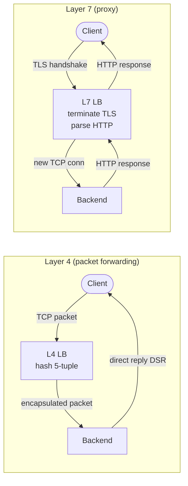
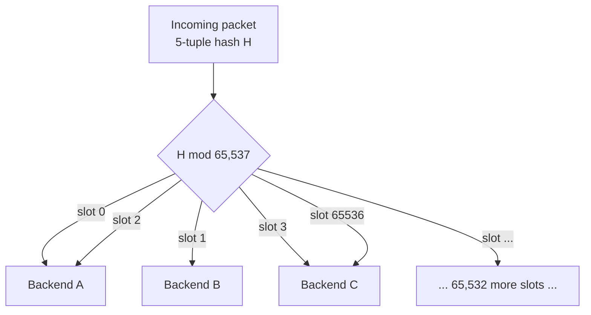
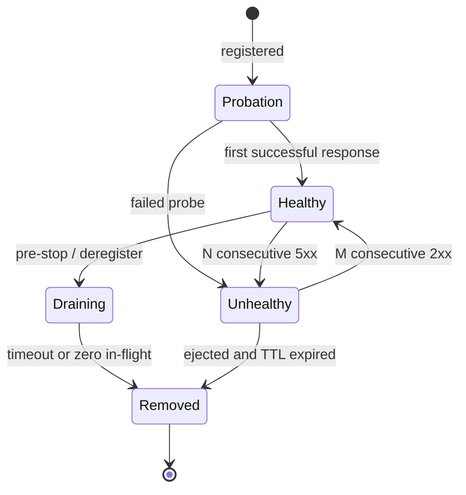
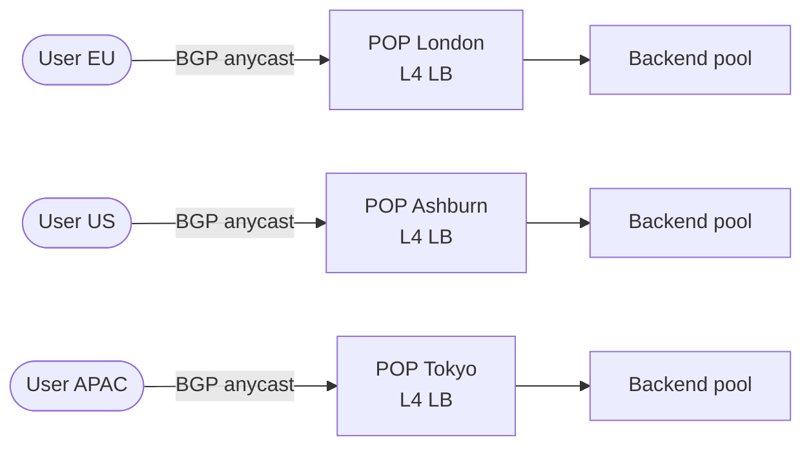

# Load Balancers: Spreading Traffic, Absorbing Failure

> **TL;DR**: A load balancer accepts a virtual IP, picks a backend, and quietly removes the ones that stop responding. Layer 4 forwards packets by 5-tuple at line rate: Google Maglev saturates a 10 Gbps link on a single machine[^1]. Layer 7 terminates TCP, parses HTTP, and routes on headers, at the cost of CPU per request. Most production stacks run both: a stateless L4 tier absorbs raw packet volume, and an L7 tier adds routing, retries, and observability[^2].

## Learning Objectives

After this module, you will be able to:

- [ ] Choose between L4 and L7 load balancing for a given workload
- [ ] Explain the trade-offs of round robin, least-connections, consistent-hash, and power-of-two-choices algorithms
- [ ] Design health checks that catch real failures without flapping
- [ ] Reason about sticky sessions, connection draining, and graceful deploys
- [ ] Describe how anycast and DNS-based GSLB route traffic globally
- [ ] Compare HAProxy, NGINX, Envoy, and cloud load balancers on features, throughput, and cost

## Intuition

Imagine you arrive at an airport terminal with 20 boarding gates. A single gate agent checks every passenger's ticket, assigns them a gate, and redirects anyone whose gate is closed. Without her, passengers would crowd gate 1 while gates 2 through 20 sit empty.

She does three jobs. First, she distributes passengers across gates so no single gate is overwhelmed. Second, she monitors gate status: if a gate's jetbridge breaks, she stops sending people there. Third, she handles the paperwork: scanning boarding passes, verifying IDs, and handing back a simplified stub so the gate agent downstream does less work.

A load balancer does the same three jobs for network traffic: distribution, health tracking, and termination (TLS, protocol parsing). The simplest version just reads the destination on your ticket (the 5-tuple) and points you to a gate. A smarter version reads your frequent-flyer status, your connection time, and your luggage weight before deciding. The simple version is faster. The smart version makes better decisions. Production airports use both: a fast first pass at the terminal entrance, then a smarter second pass at the gate cluster.

That is the L4/L7 split in one analogy. The rest of this chapter makes it concrete.

## Theory

### Layer 4 vs layer 7

An L4 load balancer operates on TCP/UDP packets. It hashes the 5-tuple (source IP, source port, destination IP, destination port, protocol) into a backend slot and forwards the packet without ever reading the payload. Responses typically bypass the LB entirely via Direct Server Return (DSR), so the LB only touches ingress traffic[^1][^3].

An L7 load balancer terminates the TCP connection, decrypts TLS, parses HTTP (or gRPC, WebSocket, HTTP/2), and opens a new connection to the chosen backend. This lets it route by path, header, cookie, or method, retry failed requests, inject observability headers, and enforce per-tenant rate limits[^4][^5].

The cost is CPU. Every request parsed is a request the LB must buffer, decrypt, and re-serialize. L7 proxies top out an order of magnitude lower on requests per second than L4 forwarders on the same hardware.

*L4 forwards packets without seeing HTTP and uses DSR for replies; L7 terminates the connection and proxies both directions.*

Use L4 when you need raw throughput, protocol-agnostic forwarding, or a DDoS absorption tier. Use L7 when you need path-based routing, retries, auth, or per-request metrics. Most production stacks use both: Cloudflare runs Unimog (L4, XDP) in front of Pingora (L7)[^2][^23]; AWS customers put NLB in front of ALB or Envoy[^6].

### Algorithms

**Round robin** walks an ordered list. It is dead simple and distributes evenly across homogeneous hosts. It ignores actual load: a stalled host keeps receiving traffic until a health check removes it[^7].

**Weighted round robin** repeats higher-weight hosts proportionally. Use it when backends have different capacities (mixed-generation hardware).

**Least-connections / least-outstanding-requests** picks the host with the fewest in-flight requests. The naive version herds: when many LB instances simultaneously pick the same "least loaded" backend, that backend spikes.

**Power of two choices (P2C)** fixes the herding problem. Pick two backends at random; send the request to whichever has fewer outstanding requests. Mitzenmacher's 2001 result proves that d=2 choices gives an exponential improvement over d=1 (random), while d=3 gives only a constant factor further improvement[^8]. This is why Envoy, NGINX (via its `random two` directive), Netflix Zuul, and Finagle all offer P2C as a load balancing option[^4][^7].

**Consistent hashing** routes requests by hashing a stable key (user ID, cache key, 5-tuple) into a server slot. When one of N backends is removed, roughly 1/N of keys move. Google's Maglev hash fills a 65,537-slot lookup table via a permutation algorithm; packet-path selection is a single modulo and array lookup[^1][^9].

*A Maglev-style lookup table maps 65,537 slots to backends by permutation; the 5-tuple hashes into a slot in O(1).*

Use round robin for homogeneous stateless services. Use P2C least-request as the default for heterogeneous or latency-sensitive workloads. Use consistent hash only when you need cache affinity or flow pinning, and accept that hot keys can overload one backend[^10].

### Health checks and outlier detection

**Active health checks** probe backends on a schedule: a TCP connect, an HTTP GET to `/healthz`, or a gRPC health RPC. They find dead backends fast even when traffic is low[^11].

**Passive (outlier) health checks** observe real request traffic. Envoy's default outlier detector ejects a host after 5 consecutive 5xx responses for a base ejection time of 30 seconds, with linear backoff on re-ejection[^11][^12]. Passive checks catch gray failures (slow responses, partial errors) that active checks miss.

**Connection draining** stops sending new connections to a backend while existing requests finish. In Kubernetes, the `preStop` hook sleeps for the LB's deregistration delay before the container receives SIGTERM[^13][^14].

**Slow start** ramps traffic to a newly launched backend over a configurable window. Netflix uses 90 seconds to avoid overloading a cold JVM[^7].

*A backend transitions through probation, healthy, unhealthy, and draining states; the LB only routes new traffic to healthy backends.*

### Session persistence

Sticky sessions bind a client to a specific backend via a cookie, header, or source-IP hash. AWS ALB uses an `AWSALB` cookie[^15]; NLB pins each TCP connection via a 6-tuple flow hash that adds the TCP sequence number, so separate connections from one client can land on different targets[^24].

> [!WARNING]
> **Sticky sessions are a smell.** They break horizontal scaling (a celebrity user hotspots one backend), break deploys (rotating the backend invalidates the session), and break on mobile networks (IP changes on roaming). Fix the statefulness: externalize session state to Redis or encode it in a JWT. Use consistent-hash LB only for cache affinity, where losing affinity degrades latency but not correctness[^15].

### Global load balancing

Above a single datacenter, traffic is steered globally by two mechanisms:

**BGP anycast** advertises the same VIP from every POP. Internet routers converge on the nearest location for each client. Cloudflare operates in 330+ cities with 500 Tbps of external capacity[^16]. When a POP goes dark, it withdraws its BGP route and traffic reconverges in seconds, with no DNS TTL delay[^2].

**DNS-based GSLB** (Route 53, NS1) returns different A records based on client subnet, RTT, or weighted policy. It is coarser: stale caches at ISPs can pin users to dead regions for minutes. Only new DNS lookups are affected; existing TCP connections stay put[^17].

*A single anycast VIP reaches the nearest of many POPs; inside each POP, a stateless L4 LB fans out to backends.*

Use anycast when you need sub-second failover and can operate BGP. Use DNS GSLB when you need geographic steering without BGP infrastructure, and accept minutes-long failover on stale caches.

### TLS termination

Three patterns dominate:

1. **Termination at the LB.** The LB decrypts, inspects HTTP, and re-originates to the backend (cleartext or re-encrypted). This is the default for AWS ALB, Cloudflare's L7 tier, and Envoy ingress. It enables header routing, WAF, and retries, but puts all private keys on the LB[^18].
2. **Passthrough.** The LB forwards encrypted bytes untouched (L4 or SNI-based routing). AWS NLB TLS listener and Istio `PASSTHROUGH` mode fit here. No HTTP routing, but end-to-end encryption is preserved[^19].
3. **mTLS in a service mesh.** Istio and Linkerd terminate outer TLS at the sidecar and re-originate mTLS to the upstream sidecar. Automatic cert rotation, zero-trust between services[^19].

Use termination when you need L7 features. Use passthrough when compliance requires end-to-end encryption. Use mTLS when you need authenticated service-to-service communication.

## Real-World Example

### Cloudflare Unimog: every server is a load balancer

Cloudflare's Unimog is an L4 load balancer deployed across their entire edge network: 330+ cities, 500 Tbps of capacity[^16]. Its defining design choice is that every server in a datacenter is simultaneously a load balancer and an application server. There is no separate LB tier.

**How it works.** Routers ECMP packets to any server. An XDP program chain runs per packet: `l4drop` (DDoS mitigation) first, then Unimog. Unimog hashes the 5-tuple, looks up a forwarding table with tens of thousands of buckets (roughly 100x the server count), and GUE-encapsulates the packet to the target server[^2].

**Connection persistence.** When the forwarding table changes (server added or removed), Unimog uses "daisy chaining" borrowed from the Beamer paper: each bucket has two slots (current and previous). If the current server has no matching TCP socket, it forwards to the previous server. Less than 1% of packets take this "second hop"[^2].

**CPU overhead.** Less than 1% of each server's CPU is spent on load-balancing work. XDP runs before the Linux kernel network stack touches the packet, so the cost is near zero[^2].

**The oscillation incident.** Early on, Cloudflare hit a feedback-loop problem: when a datacenter became overloaded and the control plane (`conductor`) diverted new connections to less-loaded servers, those servers then degraded while the original recovered, causing oscillation. The fix: teach the conductor to distinguish individual-server degradation from datacenter-wide saturation[^2].

**DDoS absorption.** In 2025, Cloudflare mitigated a 31.4 Tbps DDoS attack through the l4drop/Unimog chain with no human intervention[^16].

The lesson: a stateless L4 LB that runs on every server eliminates the "LB tier" as a separate capacity-planning problem. The LB scales with the fleet.

## Trade-offs

### Where does the load balancer sit?

| Approach | Pros | Cons | Best when | Our Pick |
|---|---|---|---|---|
| L4 (NLB, Maglev, Katran) | Line-rate throughput, protocol agnostic, flow pinning via consistent hash | No HTTP features, no header routing, no retries | High throughput, non-HTTP, DDoS absorption tier | **Front tier always** |
| L7 (ALB, Envoy, NGINX, HAProxy) | Rich routing, TLS termination, retries, auth, rate limiting | CPU cost per request, adds latency, TLS keys at the LB | HTTP services, microservice mesh, multi-tenant ingress | **Behind L4 for HTTP** |
| Client-side LB (gRPC, Finagle) | No extra network hop, latency-aware selection | Complex client, needs service discovery, every language must implement | Internal RPC meshes between your own services | When you own both ends |

### Which algorithm picks the backend?

| Algorithm | Pros | Cons | Best when | Our Pick |
|---|---|---|---|---|
| Round robin / weighted RR | Dead simple, no state | Ignores actual load; stalls a slow backend until health check removes it | Homogeneous stateless services | Starting default, replace with P2C |
| P2C least-request | Cheap, self-balancing, resistant to herding[^8] | Requires per-backend in-flight count | Heterogeneous backends, latency-sensitive | **Default for L7** |
| Consistent hash (ring, Maglev) | Stable assignment for cache affinity; ~1/N reassignment on membership change[^4] | Sensitive to key skew; hot keys overload one backend | Cache routing, flow pinning | Only for affinity |

## Common Pitfalls

> [!WARNING]
> **Treating the LB as a single point of failure.** A single active-passive VRRP pair can split-brain if heartbeats are blocked (e.g., both VMs on the same ESXi host blocking multicast)[^20]. Fix: use anycast + ECMP + stateless L4 so any LB instance can serve any flow. N+1 capacity with automatic route withdrawal on failure[^21].

> [!WARNING]
> **Deep health checks causing cascading failure.** If your health check hits the database and the database is slow, every backend fails its health check simultaneously. The LB ejects the entire pool. Use shallow checks (TCP connect or `/healthz` that tests only the process) for liveness, and reserve deep checks for readiness with panic thresholds that prevent ejecting more than 50% of backends[^11].

> [!WARNING]
> **Botched connection draining during deploys.** Kubernetes sends SIGTERM immediately after marking a pod for deletion, but endpoint propagation to the LB takes seconds. In-flight requests get TCP RSTs. Fix: add a `preStop` hook that sleeps 30 seconds before the container receives SIGTERM, and set the LB's deregistration delay to match[^13][^14].

> [!WARNING]
> **DNS TTL too high for failover.** DNS-based GSLB with a 5-minute TTL means users stay pinned to a dead region for 5+ minutes after failover. ISP resolvers often ignore TTL entirely. Fix: keep TTLs at 30-60 seconds and accept the DNS query cost, or use BGP anycast which reconverges in seconds[^17][^2].

> [!WARNING]
> **Not tuning SO_REUSEPORT.** Without `reuseport`, all NGINX workers wake on a shared accept queue and suffer lock contention. F5/NGINX benchmarks on a 36-core instance: 2-3x RPS (localhost test), and latency stdev dropped from 26.59 ms to 3.15 ms in a separate-hosts test[^22]. One config line, massive improvement.

> [!WARNING]
> **Sticky sessions masking statefulness.** A celebrity user pinned to one backend hotspots it while the rest of the fleet idles. Deploys invalidate sessions. Mobile users change IPs on roaming and lose their pin. Fix: externalize state to Redis or a JWT. Drop sticky sessions entirely[^15].

## Exercise

Design the load balancing tier for a public API that serves 200k RPS across 80 stateless pods, needs TLS termination, path-based routing to four services, per-tenant rate limiting, and zero-downtime deploys. Decide between ALB, NLB + Envoy, or NGINX, and justify the choice against cost, feature fit, and operational burden.

Hint

Path-based routing and per-tenant rate limiting require L7. TLS termination can happen at L4 (passthrough) or L7 (terminate). Zero-downtime deploys require connection draining. Which combination gives you all three without over-engineering?

Solution

**Architecture: NLB + Envoy sidecar fleet.**

1. **NLB (L4 front tier).** Provides static IPs, handles TCP/TLS passthrough at millions of RPS, preserves client source IP. No per-request CPU cost. Absorbs connection storms and basic DDoS.

2. **Envoy (L7 tier).** Runs as a fleet of pods (or a DaemonSet). Terminates TLS, parses HTTP, routes by path prefix to the four backend services. Envoy's route configuration supports per-route rate limiting via an external rate-limit service (or local token bucket). P2C least-request algorithm distributes across the 80 backend pods.

3. **Zero-downtime deploys.** Envoy's outlier detection ejects unhealthy pods within seconds. Backend pods use a `preStop` sleep of 30 seconds. Envoy's health checks mark draining pods as unhealthy before SIGTERM arrives.

**Why not ALB alone?** ALB handles path routing and TLS, but per-tenant rate limiting requires custom logic (Lambda@Edge or a sidecar). ALB's rate limiting is coarse (fixed-rate per target group, not per tenant). At 200k RPS, ALB cost is roughly $0.008 per LCU-hour times peak LCUs, which can exceed a self-managed Envoy fleet on large clusters.

**Why not NGINX alone?** NGINX can do everything Envoy does, but lacks native xDS integration for dynamic service discovery in Kubernetes. You would need NGINX Plus (commercial) or a custom control plane. Envoy's xDS protocol integrates natively with Istio, Consul, or a custom control plane.

**Trade-off accepted:** Operational complexity of managing an Envoy fleet vs. the simplicity of a managed ALB. At 200k RPS with per-tenant rate limiting, the control and cost savings justify the complexity.

## Key Takeaways

- L4 is fast and dumb; L7 is smart and expensive. Most production stacks use both: L4 in front for packet volume, L7 behind for routing intelligence.
- P2C least-request is the best default algorithm. It self-balances, resists herding, and handles heterogeneous backends without configuration.
- The load balancing algorithm matters less than good health checks and connection draining. A perfect algorithm with broken health checks still sends traffic to dead servers.
- Sticky sessions are a smell. Externalize state to Redis or a JWT; use consistent hash only for cache affinity where losing affinity degrades latency, not correctness.
- Anycast with stateless L4 gives sub-second global failover. DNS-based GSLB is simpler but fails over in minutes due to TTL caching.
- Every server can be a load balancer. Cloudflare's Unimog proves that eliminating a separate LB tier removes a capacity-planning problem at less than 1% CPU overhead[^2].
- Enable `SO_REUSEPORT` on any multi-core proxy. It is one config line that eliminates accept-queue contention and can double throughput[^22].

## Further Reading

- [Maglev: A Fast and Reliable Software Network Load Balancer (Eisenbud et al., NSDI 2016)](https://www.usenix.org/conference/nsdi16/technical-sessions/presentation/eisenbud) - The foundational L4-at-scale paper; introduces the Maglev hash and explains how Google serves all production traffic without shared LB state.
- [Unimog: Cloudflare's Edge Load Balancer (2020)](https://blog.cloudflare.com/unimog-cloudflares-edge-load-balancer/) - The most detailed public write-up of a global L4 LB, including daisy-chaining for connection persistence and the oscillation incident.
- [Open-sourcing Katran (Meta Engineering, 2018)](https://engineering.fb.com/open-source/open-sourcing-katran-a-scalable-network-load-balancer/) - How XDP+eBPF lets an L4 LB run colocated with backend applications at 10M+ pps per core.
- [Rethinking Netflix's Edge Load Balancing (2018)](https://netflixtechblog.com/netflix-edge-load-balancing-695308b5548c) - P2C plus server-reported utilization with real production incident data; the best public case for why round robin fails.
- [The Power of Two Random Choices: A Survey of Techniques and Results (Mitzenmacher, 2001)](https://www.eecs.harvard.edu/~michaelm/postscripts/handbook2001.pdf) - The theoretical basis cited by every major modern LB; proves d=2 is exponentially better than d=1.
- [Envoy Load Balancer Documentation](https://www.envoyproxy.io/docs/envoy/latest/intro/arch_overview/upstream/load_balancing/load_balancers) - The reference L7 LB's menu of algorithms (ring hash, Maglev, P2C, weighted round robin) and why each exists.
- [Socket Sharding in NGINX 1.9.1 (F5/NGINX, 2015)](https://www.f5.com/fr_fr/company/blog/nginx/socket-sharding-nginx-release-1-9-1.html) - The SO_REUSEPORT benchmark that unlocks multi-core scaling; one of the highest-ROI tuning changes for any proxy.
- [HAProxy Forwards Over 2M RPS on a Single Arm Instance (2021)](https://www.haproxy.com/user-spotlight-series/how-we-achieved-2-million-rps-haproxy-on-arm-processors/) - A public software LB benchmark near the top of what one box can do; useful for capacity planning.
- [Consistent Hashing and Random Trees (Karger et al., STOC 1997)](https://dl.acm.org/doi/10.1145/258533.258660) - The original consistent hashing paper; prerequisite reading for understanding Maglev, ring hash, and jump hash.
- [GLB: GitHub's Open Source Load Balancer (2018)](https://github.blog/engineering/infrastructure/glb-director-open-source-load-balancer/) - Rendezvous hashing and the "second chance" technique for stateless connection persistence; a good complement to Unimog.

## Flashcards

**Q:** What is the fundamental difference between L4 and L7 load balancing?
**A:** L4 forwards packets by 5-tuple without inspecting the payload (fast, protocol-agnostic). L7 terminates the connection, parses the application protocol, and routes on content (smart, CPU-intensive).

**Q:** Why do production stacks often run L4 in front of L7?
**A:** L4 absorbs raw packet volume and DDoS at line rate with minimal CPU. L7 behind it adds routing, retries, and observability only for the traffic that survives the L4 tier.

**Q:** What does "power of two choices" mean and why is d=2 special?
**A:** Pick two random backends, send to whichever has fewer outstanding requests. Mitzenmacher proved d=2 gives an exponential improvement over d=1 (random), while d=3 gives only a constant factor further improvement. Two choices is the sweet spot.

**Q:** How does Maglev achieve stateless consistent hashing across a fleet?
**A:** Each Maglev machine independently computes the same 65,537-slot lookup table via a deterministic permutation algorithm. Given the same backend set, every machine agrees on which backend gets which 5-tuple without sharing state.

**Q:** What is Direct Server Return (DSR) and why does it matter?
**A:** The backend replies directly to the client, bypassing the LB on the return path. This means the LB only handles ingress traffic, so reply bandwidth is not constrained by LB capacity.

**Q:** Why are sticky sessions considered a "smell" in load balancing?
**A:** They break horizontal scaling (celebrity user hotspots one backend), break deploys (rotating backends invalidates sessions), and break on mobile networks (IP changes). The fix is externalizing state, not masking statefulness at the LB.

**Q:** What is the difference between active and passive health checks?
**A:** Active checks probe backends on a schedule (TCP connect, HTTP GET). Passive checks observe real traffic and eject hosts that emit consecutive errors. Active finds dead backends fast; passive catches gray failures that active misses.

**Q:** How does BGP anycast provide faster failover than DNS-based GSLB?
**A:** When a POP goes dark, it withdraws its BGP route and traffic reconverges in seconds via router fabric. DNS-based failover depends on TTL expiry, which can take minutes due to stale caches at ISPs.

**Q:** What is connection draining and why does it matter for deploys?
**A:** Connection draining stops sending new connections to a backend while existing in-flight requests finish. Without it, rolling deploys drop requests because backends receive SIGTERM before the LB stops routing to them.

**Q:** What did Cloudflare's Unimog oscillation incident teach about LB control planes?
**A:** When the control plane diverted traffic away from overloaded servers, the receiving servers then overloaded, causing oscillation. The fix: distinguish individual-server degradation from datacenter-wide saturation before rebalancing.

**Q:** What does SO_REUSEPORT do for a multi-core proxy like NGINX?
**A:** It gives each worker its own dedicated kernel accept queue, eliminating lock contention on the shared queue. F5/NGINX benchmarks on a 36-core instance: 2-3x RPS in a localhost test, and latency stdev cut from 26.59 ms to 3.15 ms in a separate-hosts test.

**Q:** When should you use consistent hashing vs P2C least-request?
**A:** Use consistent hashing when you need cache affinity or flow pinning (losing affinity degrades latency, not correctness). Use P2C least-request as the default for everything else, because it self-balances without configuration.

**Q:** How much CPU overhead does Cloudflare's Unimog add per server?
**A:** Less than 1%. The XDP program runs before the Linux kernel network stack touches the packet, making the per-packet cost near zero.

**Q:** What is the "daisy chaining" technique for connection persistence?
**A:** Each forwarding-table bucket has two slots: current and previous backend. If the current server has no matching TCP socket for a packet, it forwards to the previous server. This preserves existing connections across table changes.

**Q:** Name three signals Netflix Zuul 2 uses for backend selection.
**A:** Client-observed health (did the last request succeed?), server-reported utilization (carried in an X-Netflix.server.utilization response header), and client-observed in-flight request count. Combined via P2C.

## References

[^1]: Eisenbud et al., "Maglev: A Fast and Reliable Software Network Load Balancer", NSDI 2016. https://www.usenix.org/conference/nsdi16/technical-sessions/presentation/eisenbud
[^2]: David Wragg, "Unimog - Cloudflare's edge load balancer", Cloudflare Blog, 2020-09-09. https://blog.cloudflare.com/unimog-cloudflares-edge-load-balancer/
[^3]: Shirokov and Dasineni, "Open-sourcing Katran, a scalable network load balancer", Meta Engineering Blog, 2018-05-22. https://engineering.fb.com/open-source/open-sourcing-katran-a-scalable-network-load-balancer/
[^4]: Envoy Project, "Supported load balancers", Envoy documentation. https://www.envoyproxy.io/docs/envoy/latest/intro/arch_overview/upstream/load_balancing/load_balancers
[^5]: Envoy Project, "What is Envoy", Envoy documentation. https://www.envoyproxy.io/docs/envoy/latest/intro/what_is_envoy
[^6]: Jeff Barr, "New Network Load Balancer: Effortless Scaling to Millions of Requests per Second", AWS News Blog, 2017-09-07. https://aws.amazon.com/blogs/aws/new-network-load-balancer-effortless-scaling-to-millions-of-requests-per-second/
[^7]: Mike Smith, "Rethinking Netflix's Edge Load Balancing", Netflix TechBlog, 2018-09-28. https://netflixtechblog.com/netflix-edge-load-balancing-695308b5548c
[^8]: Michael Mitzenmacher, "The Power of Two Random Choices: A Survey of Techniques and Results", Handbook of Randomized Computing, Kluwer Academic Publishers, 2001. https://www.eecs.harvard.edu/~michaelm/postscripts/handbook2001.pdf
[^9]: Paper Trail, "Network Load Balancing with Maglev", 2020. https://www.the-paper-trail.org/post/2020-06-23-maglev/
[^10]: Vahab Mirrokni, Mikkel Thorup, and Morteza Zadimoghaddam, "Consistent Hashing with Bounded Loads", Google Research Blog, 2017 (paper: arXiv:1608.01350, SODA 2018). https://research.google/blog/consistent-hashing-with-bounded-loads/
[^11]: HashiCorp Help Center, "Troubleshooting Consul Envoy 503 Error: No Healthy Host for HTTP Connection Pool", 2025. https://support.hashicorp.com/hc/en-us/articles/20777919636115-Troubleshooting-Consul-Envoy-503-Error-No-Healthy-Host-for-HTTP-Connection-Pool
[^12]: Envoy Project, "Outlier detection", Envoy v1.25 docs. https://www.envoyproxy.io/docs/envoy/v1.25.0/intro/arch_overview/upstream/outlier
[^13]: Kubernetes, "Explore Termination Behavior for Pods And Their Endpoints". https://kubernetes.io/docs/tutorials/services/pods-and-endpoint-termination-flow/
[^14]: AWS, "How to rapidly scale your application with ALB on EKS (without losing traffic)", 2023. https://aws.amazon.com/blogs/containers/how-to-rapidly-scale-your-application-with-alb-on-eks-without-losing-traffic/
[^15]: AWS, "Sticky sessions for your Application Load Balancer". https://docs.aws.amazon.com/elasticloadbalancing/latest/application/sticky-sessions.html
[^16]: Tanner Ryan, "500 Tbps of capacity: 16 years of scaling our global network", Cloudflare Blog, 2026-04-10. https://blog.cloudflare.com/500-tbps-of-capacity/
[^17]: AWS, "Choosing a routing policy", Amazon Route 53 Developer Guide. https://docs.aws.amazon.com/Route53/latest/DeveloperGuide/routing-policy.html
[^18]: AWS, "Create an HTTPS listener for your Application Load Balancer", Elastic Load Balancing User Guide. https://docs.aws.amazon.com/elasticloadbalancing/latest/application/create-https-listener.html
[^19]: Istio, "Ingress Sidecar TLS Termination". https://istio.io/latest/docs/tasks/traffic-management/ingress/ingress-sidecar-tls-termination/
[^20]: Broadcom KB, "VRRP Split-Brain Condition When Multiple Nodes Reside on the Same ESXi Host". https://knowledge.broadcom.com/external/article/427472/vrrp-virtual-router-redundancy-protocol.html
[^21]: Keepalived Project, "Failover using VRRP". https://keepalived.org/doc/case_study_failover.html
[^22]: Andrew Hutchings, "Socket Sharding in NGINX Release 1.9.1", NGINX Blog, 2015-05-26. https://www.f5.com/fr_fr/company/blog/nginx/socket-sharding-nginx-release-1-9-1.html
[^23]: Yuchen Wu, "How we built Pingora, the proxy that connects Cloudflare to the Internet", Cloudflare Blog, 2022-09-14. https://blog.cloudflare.com/how-we-built-pingora-the-proxy-that-connects-cloudflare-to-the-internet/
[^24]: AWS, "What is a Network Load Balancer?" (TCP flow hash includes protocol, source/dest IP+port, and TCP sequence number). https://docs.aws.amazon.com/elasticloadbalancing/latest/network/introduction.html
