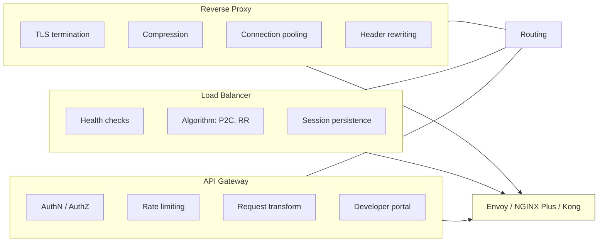
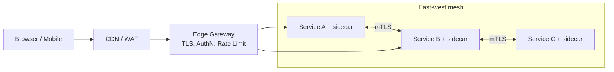
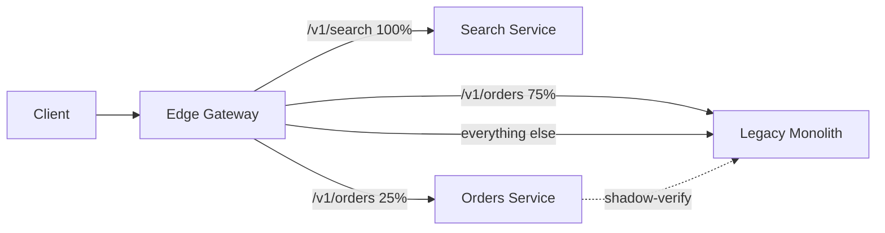
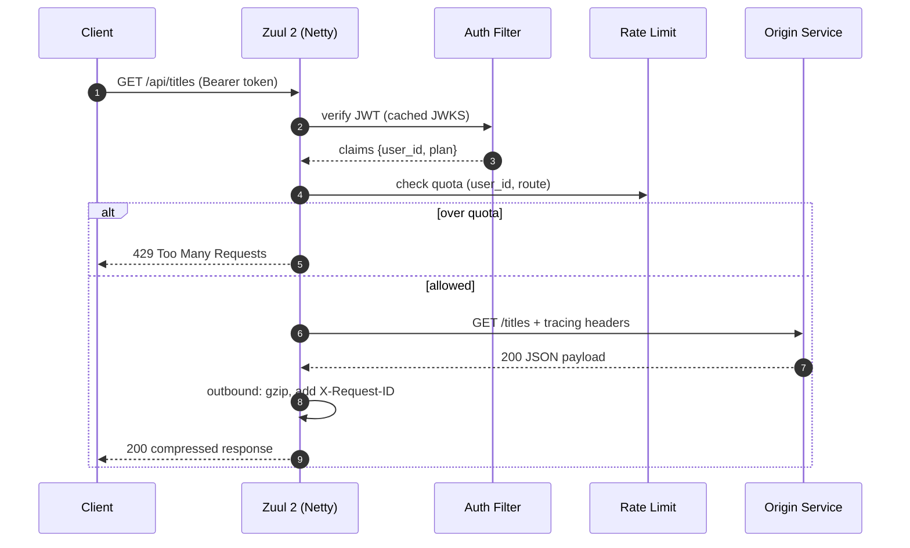

# Reverse Proxies and API Gateways: The Smart Edge

> **TL;DR**: A reverse proxy terminates client connections, hides origin topology, and adds TLS, compression, and retries. An API gateway is a reverse proxy with product policy: auth, rate limits, quotas, and developer portals. Netflix Zuul 2 handles over 1,000,000 req/s across 80+ clusters[^1], while Envoy typically adds single-digit millisecond p99 latency overhead as a sidecar proxy[^2]. Default to a thin reverse proxy (Envoy or NGINX) when you need routing and TLS. Reach for a full API gateway only when you need per-consumer auth, quotas, and a developer portal. Keep business logic out of the gateway or it becomes a distributed monolith.

## Learning Objectives

After this module, you will be able to:

- [ ] Distinguish a reverse proxy from a load balancer from an API gateway and pick the right tool
- [ ] Design TLS termination and mTLS between gateway and services
- [ ] Implement path and header routing, canary releases, and A/B splits at the edge
- [ ] Configure authentication (JWT, OAuth2, API keys) and per-tenant rate limits in a gateway filter chain
- [ ] Explain north-south vs east-west traffic patterns and why one gateway cannot serve both well
- [ ] Avoid the "distributed monolith" anti-pattern where the gateway owns business logic

## Intuition

You check into a large hotel. The concierge at the front desk does not carry your bags, cook your food, or clean your room. But every request you make passes through her. She verifies your reservation (authentication), checks whether your room type allows pool access (authorization), tells you which elevator bank serves your floor (routing), and politely limits how many towels you can take per day (rate limiting). Behind the desk, dozens of staff handle the actual work. You never see the kitchen, the laundry, or the maintenance crew. You just talk to the concierge.

A reverse proxy is that concierge. It sits between every client and every backend service. It terminates TLS so backends do not manage certificates. It compresses responses so backends do not burn CPU on gzip. It buffers slow clients so backends are not held hostage by a trickle of bytes. And it routes requests to the right upstream based on path, header, or hostname.

An API gateway is a concierge who also runs the loyalty program: she issues room keys (API keys), tracks how many requests each guest has made this month (quotas), and publishes a directory of hotel services (developer portal). The concierge role is the same. The scope of responsibility is wider.

The rest of this chapter makes that distinction precise and teaches you when a thin concierge is enough and when you need the full loyalty-program desk.

## Theory

### Reverse proxy vs load balancer vs API gateway

These three roles overlap heavily, and the same binary often plays all three. The distinction is about primary responsibility:

- A **load balancer** distributes traffic across N identical backends. Its job is even spread and health tracking. See [Load Balancers](./00-load-balancers.md).
- A **reverse proxy** terminates the client connection and forwards it to an upstream. Its job is protocol handling: TLS, HTTP/2, compression, buffering, header rewriting, and connection pooling.
- An **API gateway** enforces API product policy. Its job is business-layer concerns: authentication, authorization, per-consumer rate limits, request transformation, schema validation, and developer portals.

In practice, NGINX, Envoy, HAProxy, and Caddy can act as all three. Kong, Apigee, and AWS API Gateway push the gateway role up the stack with richer business features. The question is never "which category does my tool belong to?" but "which responsibilities does my deployment own?"

*All three roles share routing as common ground; tools like Envoy and Kong span all three, while simpler tools specialize.*

### What reverse proxies do

A reverse proxy owns six protocol-level concerns that you do not want every backend to implement:

1. **TLS termination.** The proxy holds certificates, negotiates TLS 1.3, and speaks cleartext (or re-encrypted mTLS) to backends. This centralizes certificate rotation and offloads expensive handshakes[^3].
2. **HTTP/2 and HTTP/3 at the edge.** The proxy speaks multiplexed protocols to clients while backends can stay on simple HTTP/1.1 with keepalive pools.
3. **Compression.** Gzip or Brotli on the response path, saving bandwidth without backend CPU.
4. **Request buffering.** The proxy absorbs slow clients (mobile on 3G) so backends are not blocked waiting for bytes. This is the defense against slowloris-style attacks[^4].
5. **Connection pooling.** Instead of each client opening a TCP connection to each backend, the proxy maintains a small pool of keepalive connections per upstream. Netflix's Zuul 2 reduced total fleet connections 10x by adding HTTP/2 multiplexing and deterministic subsetting to its pools[^5].
6. **Header rewriting and request routing.** Path-based, header-based, or hostname-based routing to different upstream clusters. Canary splits, A/B tests, and blue-green deploys are all routing rules at the proxy.

### API gateway capabilities

An API gateway adds product-layer concerns on top of the reverse proxy:

**Authentication and authorization.** JWT verification against a JWKS endpoint, OAuth2 token introspection, API key lookup, and mTLS client certificate validation. Centralizing auth in the gateway means individual services do not each re-implement JWT validation (badly)[^6].

**Rate limiting and quotas.** Per-consumer, per-endpoint, per-plan limits. A free-tier user gets 100 req/min; a paid user gets 10,000. The gateway enforces this before the request reaches the backend, saving compute on rejected traffic.

**Request and response transformation.** Rewrite paths, inject headers, translate protocols (REST to gRPC, JSON to Protobuf), validate request schemas against OpenAPI specs, and aggregate multiple backend calls into a single client response.

**Developer portal and key management.** Issue API keys, display documentation, track usage analytics, and manage subscription plans. This is where Kong, Apigee, and Tyk differentiate from raw Envoy.

The core tension: a fat gateway centralizes these concerns (good for consistency) but becomes a shared dependency where every team queues to ship changes and a bad deploy blasts every consumer[^6].

### North-south vs east-west

**North-south** traffic crosses the trust boundary: browsers, mobile apps, and partner APIs hitting your edge. It needs heavy security: WAF, DDoS defense, TLS termination, geographic routing, bot detection, and rate limiting by IP.

**East-west** traffic flows between internal services. It cares about mTLS, service discovery, retries, circuit breakers, and locality-aware load balancing. The threat model is different: you trust the network (mostly), but you need authenticated service identity.

*North-south gateway faces untrusted clients with heavy security; east-west sidecars speak mTLS between trusted services with lightweight policy.*

One gateway cannot be optimized for both. Lyft runs Envoy in both roles with different configs: a centralized front proxy for egress/ingress, and per-service Envoy sidecars for east-west[^2]. Envoy Gateway (CNCF, GA 2024) is the Kubernetes-native control plane for north-south; Istio is the control plane for east-west[^7].

**Rule of thumb:** default to Envoy for east-west (sidecar or ambient mesh). Use a managed API gateway (AWS API Gateway, Cloudflare) for north-south when your team is small. Graduate to self-hosted Envoy or Kong when per-request cost or feature needs outgrow the managed offering.

### Patterns: BFF, strangler fig, and request coalescing

**Backend for Frontend (BFF).** Instead of one general-purpose gateway, each client type (web, iOS, Android) gets its own dedicated edge service that aggregates downstream microservices into client-shaped responses[^8]. The web BFF concatenates four calls into a single response matching the web view model. The mobile BFF returns a smaller, battery-friendly shape. Each BFF is owned by the team that owns that client.

**Strangler fig.** The gateway fronts both the legacy monolith and new services, routing requests to the new service when ready and leaving the rest on the monolith. The monolith shrinks one route at a time until it can be decommissioned[^9]. Shopify built exactly this with Lua in NGINX+OpenResty: rules routed requests between the legacy Rails storefront and the new Storefront Renderer, with rates for render, forward-verify, reverse-verify, and self-verify[^10].

*The gateway progressively routes paths from the legacy monolith to new services; rollback is setting one percentage to zero.*

**Request coalescing.** When many clients request the same resource simultaneously (a cache stampede), the gateway collapses duplicate in-flight requests into one upstream call and fans the response back to all waiting clients. NGINX calls this `proxy_cache_lock`; Envoy achieves similar behavior through its cache filter configuration.

### Canonical configurations

**NGINX.** Single-binary C daemon, one worker per core, event-loop driven. Excels at static file serving and simple reverse proxying. Configuration is file-based and requires a reload (or NGINX Plus for dynamic upstreams). Community benchmarks report 50K to 80K rps on dual-Xeon hardware for simple reverse proxying (highly workload-dependent)[^11]. Slowloris defense requires explicit timeout tuning[^4].

**Envoy.** C++ proxy, single-process multi-threaded. First-class xDS API for dynamic configuration without restarts. Built-in support for HTTP/2, gRPC, circuit breakers, outlier detection, and distributed tracing. The default choice for service mesh sidecars (Istio, Consul Connect). Adds single-digit millisecond p99 latency overhead in typical sidecar deployments[^2].

**Traefik.** Go binary with native Kubernetes integration. Auto-discovers services via IngressRoute CRDs. Automatic Let's Encrypt certificates via ACME. Middlewares (rate limit, retry, circuit breaker) compose declaratively. Best for small-to-medium Kubernetes deployments where simplicity beats raw performance.

**Caddy.** Go binary that defaults to HTTPS. Provisions Let's Encrypt certificates automatically, including on-demand TLS for SaaS custom domains[^12]. The simplest reverse proxy to configure correctly. Use it when you want zero-config TLS and do not need mesh-level features.

**Kong.** Lua-based API gateway built on NGINX/OpenResty. Plugin ecosystem for auth, rate limiting, logging, and transformations. Enterprise edition adds a developer portal, RBAC, and analytics. The sweet spot for teams that need gateway product features without building from scratch.

## Real-World Example

### Netflix Zuul 2: async gateway at 1M+ requests per second

Netflix routes all external traffic through Zuul 2, an async gateway built on Netty. As of 2018, the fleet comprised 80+ Zuul 2 clusters routing to approximately 100 origin clusters, handling over 1,000,000 requests per second for 125M+ streaming members[^1].

**Architecture.** Zuul 2 processes requests through a three-stage filter pipeline: inbound filters (routing, auth, decoration), an endpoint filter (static response or proxy to origin), and outbound filters (compression, metrics, response shaping). Filter logic is written in Groovy/Java and owned by feature teams; the Netty plumbing (connection handling, proxying, bookkeeping) is owned by the platform team[^1].

**Why async?** Zuul 1 used a servlet-per-request model. At Netflix scale, connection cost dominates CPU cost. A slow origin holding 10,000 servlet threads blocks the entire gateway. Zuul 2's Netty event loops handle connections without dedicating a thread per request, which bought connection scaling and resilience against slow origins[^3].

**The connection explosion problem.** With one connection pool per event loop per origin, the math explodes: 16 cores x 800 origin servers x 100 Zuul instances = 1.28 million connections. When mTLS arrived, each connection required an expensive handshake. The fix: HTTP/2 multiplexing plus Google's Ringsteady deterministic subsetting algorithm, applied per event loop. Result: 10x fewer connections at peak with no load-balancing fairness loss, plus ~4% CPU, ~15% heap, and ~3% latency reduction[^5].

**Self-serve routing.** Teams publish routing rules (path/header predicates mapped to percentages and origins) that gateway instances pick up dynamically. This enables canary deploys, sticky canary, sharding, and dark testing without touching gateway code[^1].

*A request through Zuul 2's filter pipeline: auth and rate limiting can short-circuit before the request reaches the origin, saving backend compute.*

The lesson: separate filter logic (owned by feature teams) from data-plane plumbing (owned by platform). Let teams self-serve routing rules. And when connection math explodes, fix it with protocol multiplexing and subsetting, not more hardware.

## Trade-offs

| Approach | Pros | Cons | Best when | Our Pick |
|---|---|---|---|---|
| Thin reverse proxy (NGINX, Envoy, Caddy) | Fast, minimal, easy to reason about | You build auth, rate limiting, and portals yourself | Routing + TLS + health checks, not product features | **Default for internal services** |
| Full API gateway (Kong, Apigee, Tyk) | Batteries included: dev portal, plugins, analytics | Vendor lock-in, cost, shared SPOF | Public API product with many external consumers | **Public APIs with SLAs** |
| Cloud-managed (AWS API Gateway, GCP) | Zero ops, pay per request | Per-request cost at scale, cold starts (100 ms to seconds without Provisioned Concurrency)[^13] | Low-to-moderate traffic APIs on Lambda backends | Small teams, < 100 rps sustained |
| Service mesh sidecar (Envoy + Istio) | Gateway features per service, mTLS everywhere | Operational weight, sidecar CPU/memory overhead | Large microservices estate where east-west dominates | **East-west default** |
| GraphQL gateway (Apollo Router, Cosmo) | One client query, optimal subgraph fan-out, 8x throughput vs Node.js[^14] | Newer tooling, N+1 pitfalls, schema governance overhead | Many teams, many clients, shared domain model | When you have the org for federation |
| Edge compute (Cloudflare Workers) | Anycast network spanning 330+ cities in 120+ countries[^18], effectively zero cold start (isolate preloaded during TLS handshake)[^15] | Limited runtime (V8/Wasm), vendor API surface | Global latency-sensitive APIs, custom edge logic | Latency-critical global APIs |

## Common Pitfalls

> [!WARNING]
> **Upstream timeout cascade.** One slow origin drags down the gateway, and from there every client. When the gateway's read timeout exceeds the client's, connections pile up, event loops saturate, and p99 explodes across unrelated routes. Fix: timeouts must decrease as you go up the stack (client > gateway > origin). Add per-origin concurrency limits and circuit breakers. Use `retry_on: connect-failure,reset`, never blind `5xx` retries[^3].

> [!WARNING]
> **Slowloris exhausting connections.** A handful of attacker connections, each dribbling one header byte at a time, exhaust `worker_connections` and the proxy stops accepting legitimate clients. Fix: set `client_header_timeout`, `client_body_timeout`, and `send_timeout` to 10 seconds. Use `limit_conn` per IP. Put a CDN or L4 DDoS layer upstream[^4].

> [!WARNING]
> **Cache poisoning via unkeyed headers.** An attacker crafts a request where the cache key omits a header that affects the response (e.g., `X-Forwarded-Host`). The proxy caches a malicious response and serves it to every subsequent client. Fix: key caches on `Host` and every header that can change the response. Set `Vary` correctly. Never cache authenticated responses unless explicitly allowed[^16].

> [!WARNING]
> **Header injection and request smuggling.** The proxy and origin disagree on where one request ends and the next begins (`Content-Length` vs `Transfer-Encoding: chunked`). An attacker smuggles a second request on another user's connection. Fix: run a modern HTTP parser, reject ambiguous messages, never propagate `Connection`-related headers upstream[^16].

> [!WARNING]
> **GraphQL N+1 via aggregation.** A federated gateway plans sub-queries across subgraphs. A naive plan issues one downstream call per item in a list, turning a single client query into hundreds of backend calls. Fix: use DataLoader-style batching in subgraphs, enable persisted queries, and monitor query-plan depth[^14].

> [!WARNING]
> **Business logic creep into the gateway.** The gateway is the only place every request passes through, so teams dump "just one more" transformation there. Soon the gateway owns product logic, every change requires gateway deploys, and a gateway outage is a product outage. Fix: reserve the gateway for cross-cutting policy (auth, rate limiting, observability). Push transformations back to service-owned code. Uber and Netflix both invested in self-serve tooling specifically to push ownership back to feature teams[^1][^6].

## Exercise

You are launching a public API for a fintech product: 50 endpoints, OAuth2 with per-client rate limits, mTLS between gateway and services, audit logs, and a developer portal. Compare AWS API Gateway + Lambda authorizer, Kong on Kubernetes, and a hand-rolled Envoy configuration. Recommend one with cost and ownership justification.

Hint

Consider three axes: time-to-launch (weeks vs months), per-request cost at your expected scale (start at 1,000 rps, grow to 50,000 rps within a year), and operational ownership (how many infra engineers do you have?). The developer portal requirement eliminates raw Envoy unless you build one yourself.

Solution

**Recommendation: Kong on Kubernetes.**

**Why not AWS API Gateway + Lambda authorizer?**

- At 1,000 rps sustained (~2.59B requests/month), AWS API Gateway REST APIs cost roughly $6.8K/month with tiered pricing (333M x $3.50 + 667M x $2.80 + 1,592M x $2.38)[^17]; HTTP APIs are cheaper at ~$2.4K/month. At 50,000 rps (your year-one target), REST APIs run ~$309K/month and HTTP APIs ~$117K/month in gateway fees alone. The cost crossover with self-hosted happens somewhere between 5,000 and 15,000 rps depending on which API flavor you pick.
- Lambda cold starts add 100 ms to several seconds for the authorizer path[^13]. For a fintech product where p99 latency matters, this is unacceptable without Provisioned Concurrency (additional cost).
- Vendor lock-in: migrating off API Gateway later requires rewriting all routing config.

**Why not hand-rolled Envoy?**

- Envoy gives you TLS, mTLS, routing, and rate limiting out of the box. But it has no developer portal, no API key management, no usage analytics dashboard. You would build these from scratch.
- Recommendation: only choose raw Envoy if you have 3+ dedicated infra engineers and no portal requirement.

**Why Kong on Kubernetes?**

- Kong provides OAuth2 plugin, rate-limiting plugin (sliding window, per-consumer), mTLS upstream, audit logging via the logging plugin, and a developer portal (Enterprise) or open-source alternatives (Backstage integration).
- Runs on your existing Kubernetes cluster. Cost is compute (3 to 5 Kong pods) plus Enterprise license if you need the portal. At 50,000 rps, Kong on 5 pods with 4 vCPU each handles the load comfortably.
- mTLS between Kong and upstream services is native via the `mtls-auth` plugin and service mesh integration.
- Operational burden: moderate. You manage Kong upgrades, plugin compatibility, and Kubernetes manifests. But you avoid per-request cloud fees and cold-start latency.

**Trade-off accepted:** You take on operational complexity (Kong upgrades, plugin testing) in exchange for cost control, latency predictability, and portal features. If your team has fewer than 2 infra engineers, start with AWS API Gateway and migrate to Kong when cost forces the move.

## Key Takeaways

- A reverse proxy handles routing and TLS. An API gateway adds product features: auth, quotas, keys, portals. Most tools (Envoy, NGINX, Kong) can play multiple roles.
- Keep business logic out of the gateway. It should enforce cross-cutting policy, not implement features. If gateway config grows faster than your service fleet, you are centralizing logic that belongs in services.
- North-south and east-west traffic have different threat models and different optimal tools. Do not force one gateway to serve both.
- The BFF pattern gives each client team its own gateway, eliminating the shared-gateway coordination bottleneck. Use it when you have distinct client shapes (web, mobile, partner).
- The strangler fig pattern uses the gateway as a traffic splitter during migrations. Rollback is setting one percentage to zero.
- Cloud gateways win below ~5,000 rps sustained. Above that, per-request cost dominates and self-hosted wins.
- Netflix Zuul 2 proves that separating filter logic (team-owned) from data-plane plumbing (platform-owned) scales to 1M+ rps across 80+ clusters[^1].

## Further Reading

- [Zuul 2: The Netflix Journey to Asynchronous, Non-Blocking Systems](https://netflixtechblog.com/zuul-2-the-netflix-journey-to-asynchronous-non-blocking-systems-45947377fb5c) - The honest retro on why Netflix moved to Netty and what async actually bought them (connection scaling, not CPU).
- [Curbing Connection Churn in Zuul](https://netflixtechblog.com/curbing-connection-churn-in-zuul-2feb273a3598) - 2023 deep dive on HTTP/2 multiplexing + Ringsteady subsetting for 10x connection reduction; essential reading for anyone managing proxy connection pools.
- [Designing Edge Gateway, Uber's API Lifecycle Management Platform](https://www.uber.com/en-US/blog/gatewayuberapi/) - How Uber built a self-serve gateway deployed as 40+ independent services for 1,600 APIs (with 40% of engineering contributing code) without the gateway becoming a distributed monolith.
- [Apollo Router: our GraphQL Federation runtime in Rust](https://www.apollographql.com/blog/apollo-router-our-graphql-federation-runtime-in-rust) - Benchmarks showing 8x throughput vs Node.js gateway; read this before choosing a GraphQL composition layer.
- [Eliminating Cold Starts 2: shard and conquer](https://blog.cloudflare.com/eliminating-cold-starts-2-shard-and-conquer/) - Cloudflare's technique for 99.99% warm-request rate using consistent hash rings inside each datacenter; the counterpoint to Lambda cold starts.
- [Pattern: Backends For Frontends (Sam Newman)](https://samnewman.io/patterns/architectural/bff/) - The canonical source for the BFF pattern; read before splitting your gateway per client type.
- [Strangler fig pattern (AWS Prescriptive Guidance)](https://docs.aws.amazon.com/prescriptive-guidance/latest/cloud-design-patterns/strangler-fig.html) - Incremental monolith-to-microservices migration via gateway routing; the safest path when "rewrite from scratch" is not an option.
- [Envoy Proxy documentation](https://www.envoyproxy.io/docs) - The canonical reference for filter chains, xDS dynamic configuration, and HTTP connection manager; required reading for any Envoy deployment.

## Flashcards

**Q:** What is the fundamental difference between a reverse proxy and an API gateway?
**A:** A reverse proxy handles protocol-level concerns (TLS, compression, routing, connection pooling). An API gateway adds product-level concerns (authentication, rate limiting, quotas, developer portals) on top of the reverse proxy.

**Q:** Why can one gateway not serve both north-south and east-west traffic well?
**A:** North-south faces untrusted clients and needs WAF, DDoS defense, and heavy auth. East-west flows between trusted services and needs mTLS, service discovery, and retries. The threat models and optimization targets are different.

**Q:** What problem did Netflix solve by moving from Zuul 1 (servlet) to Zuul 2 (Netty)?
**A:** Connection scaling. A slow origin holding servlet threads blocked the entire gateway. Netty event loops handle connections without dedicating a thread per request, preventing one slow origin from cascading to all routes.

**Q:** How did Netflix achieve a 10x reduction in Zuul 2 fleet connections?
**A:** HTTP/2 multiplexing (multiple requests over one connection) plus Ringsteady deterministic subsetting (each event loop connects to a fair subset of origins, not all of them).

**Q:** What is the BFF pattern and when should you use it?
**A:** Backend for Frontend gives each client type (web, iOS, Android) its own dedicated edge service that aggregates downstream calls into client-shaped responses. Use it when clients have distinct data shapes and you want each client team to ship independently.

**Q:** What is the strangler fig pattern in the context of gateways?
**A:** The gateway fronts both the legacy monolith and new services, routing requests to the new service when ready. The monolith shrinks one route at a time. Rollback is setting the percentage to zero.

**Q:** What is the upstream timeout cascade pitfall?
**A:** When the gateway's read timeout exceeds the client's, a slow origin causes connections to pile up in the gateway pool, saturating event loops and exploding p99 across all routes. Fix: timeouts decrease going up the stack.

**Q:** How does Envoy's added latency compare to the benefits it provides?
**A:** Envoy adds single-digit millisecond p99 latency overhead in typical sidecar deployments. In return, it provides dynamic configuration via xDS, built-in observability, circuit breaking, and mTLS, all without restarts.

**Q:** What is the cost crossover between managed API gateways and self-hosted?
**A:** Roughly 5,000 to 10,000 sustained rps. Below that, managed (pay-per-request) is cheaper. Above that, self-hosted (pay-per-host) wins because per-request fees compound.

**Q:** Why is business logic creep the most common API gateway anti-pattern?
**A:** The gateway is the only place every request passes through, making it tempting to add "just one more" rule. This turns the gateway into a distributed monolith where every product change requires gateway deploys and a gateway outage becomes a product outage for unrelated features.

**Q:** What is request smuggling and how do you prevent it?
**A:** The proxy and origin disagree on request boundaries (Content-Length vs Transfer-Encoding). An attacker smuggles a second request on another user's connection. Prevent it by running a modern HTTP parser, rejecting ambiguous messages, and never propagating Connection-related headers upstream.

**Q:** How does Cloudflare Workers achieve effectively zero cold starts vs Lambda's 100 ms to seconds?
**A:** Workers use V8 isolates (lightweight JavaScript sandboxes) instead of containers. Hundreds of isolates share one process, eliminating container boot cost. Additionally, Workers preload during the TLS handshake, hiding the under-5 ms isolate load time entirely. The trade-off is a weaker sandbox and limited runtime APIs.

**Q:** What does Apollo Router achieve over the Node.js Apollo Gateway?
**A:** Roughly 8x more throughput, under 10 ms overhead per operation, and 90% less latency variance. It is written in Rust and runs as a single multi-threaded binary.

**Q:** When should you choose Kong over raw Envoy?
**A:** When you need gateway product features (developer portal, API key management, usage analytics, plugin ecosystem) without building them from scratch. Raw Envoy is better when you have dedicated infra engineers and need only routing, TLS, and observability.

**Q:** What is the Ringsteady subsetting algorithm used by Netflix?
**A:** A deterministic algorithm that assigns each Zuul event loop a fair subset of origin servers to connect to, rather than connecting to all origins. This reduces total connections from N*M (all-to-all) to a manageable subset while maintaining load-balancing fairness.

## References

[^1]: Netflix Technology Blog, "Open Sourcing Zuul 2" (2018). https://netflixtechblog.com/open-sourcing-zuul-2-82ea476cb2b3
[^2]: D. Liu, "Internet Egress Filtering of Services at Lyft", Lyft Engineering (2022). Describes Lyft's Envoy-based architecture with front proxy and per-service sidecars. https://eng.lyft.com/internet-egress-filtering-of-services-at-lyft-72e99e29a4d9
[^3]: Netflix Technology Blog, "Zuul 2: The Netflix Journey to Asynchronous, Non-Blocking Systems" (2016). https://netflixtechblog.com/zuul-2-the-netflix-journey-to-asynchronous-non-blocking-systems-45947377fb5c
[^4]: NGINX Trac #2590, "Nginx is not able to withstand with pwnloris DoS attack" - official mitigation guidance (2024). https://trac.nginx.org/nginx/ticket/2590
[^5]: A. Gonigberg and Argha C., "Curbing Connection Churn in Zuul", Netflix Tech Blog (2023). https://netflixtechblog.com/curbing-connection-churn-in-zuul-2feb273a3598
[^6]: M. Thangavelu et al., "Designing Edge Gateway, Uber's API Lifecycle Management Platform", Uber Engineering (2020). https://www.uber.com/en-US/blog/gatewayuberapi/
[^7]: CNCF, "Announcing Envoy Proxy 1.31.0 and Envoy Gateway 1.1" (2024). https://www.cncf.io/blog/2024/08/27/announcing-envoy-proxy-1-31-0-and-envoy-gateway-1-1/
[^8]: S. Newman, "Pattern: Backends For Frontends". https://samnewman.io/patterns/architectural/bff/
[^9]: AWS Prescriptive Guidance, "Strangler fig pattern". https://docs.aws.amazon.com/prescriptive-guidance/latest/cloud-design-patterns/strangler-fig.html
[^10]: D. Stride, "How Shopify Dynamically Routes Storefront Traffic", Shopify Engineering (2021). https://shopify.engineering/dynamically-route-storefront-traffic
[^11]: E. Ahmed / denji, "NGINX tuning for best performance" GitHub gist (2017). https://gist.github.com/denji/8359866
[^12]: Caddy, "Automatic HTTPS" documentation. https://caddyserver.com/docs/automatic-https
[^13]: AWS, "Creating low-latency, high-volume APIs with Provisioned Concurrency" (2020). https://aws.amazon.com/blogs/compute/creating-low-latency-high-volume-apis-with-provisioned-concurrency/
[^14]: J. Rosenberger, "Apollo Router: our GraphQL Federation runtime in Rust", Apollo GraphQL Blog (2021). https://www.apollographql.com/blog/apollo-router-our-graphql-federation-runtime-in-rust
[^15]: Cloudflare, "Eliminating cold starts with Cloudflare Workers" (2020). https://blog.cloudflare.com/eliminating-cold-starts-with-cloudflare-workers/
[^16]: SentinelOne vulnerability database entries for Apache CVE-2024-24795, Node.js CVE-2023-30589 (HTTP header injection, request smuggling, cache poisoning). https://www.sentinelone.com/vulnerability-database/cve-2024-24795/
[^17]: AWS, "Amazon API Gateway pricing" (accessed 2026-05-08). REST API tiered pricing: first 333M at $3.50/M, next 667M at $2.80/M, next 19B at $2.38/M. HTTP API tiered pricing: first 300M at $1.00/M, next 300M+ at $0.90/M. https://aws.amazon.com/api-gateway/pricing/
[^18]: Cloudflare, "Peering Policy" (accessed 2025). "Cloudflare AS13335 operates a global anycast network, spanning over 330 cities, in more than 125 countries." https://www.cloudflare.com/partners/peering-portal/
