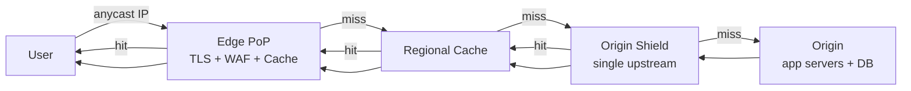
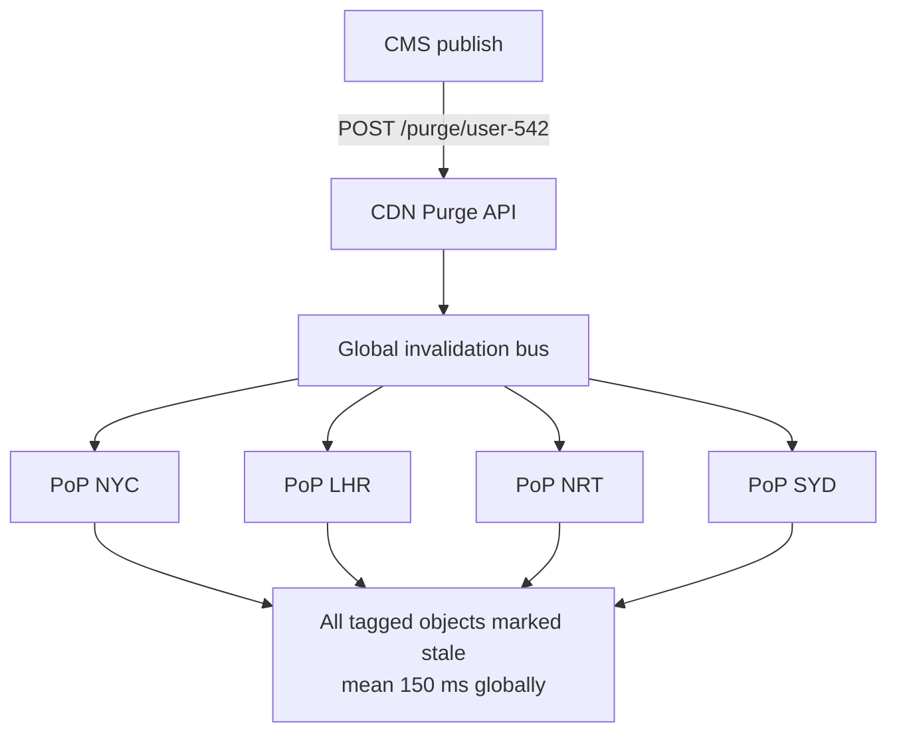
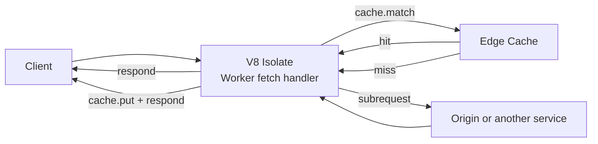
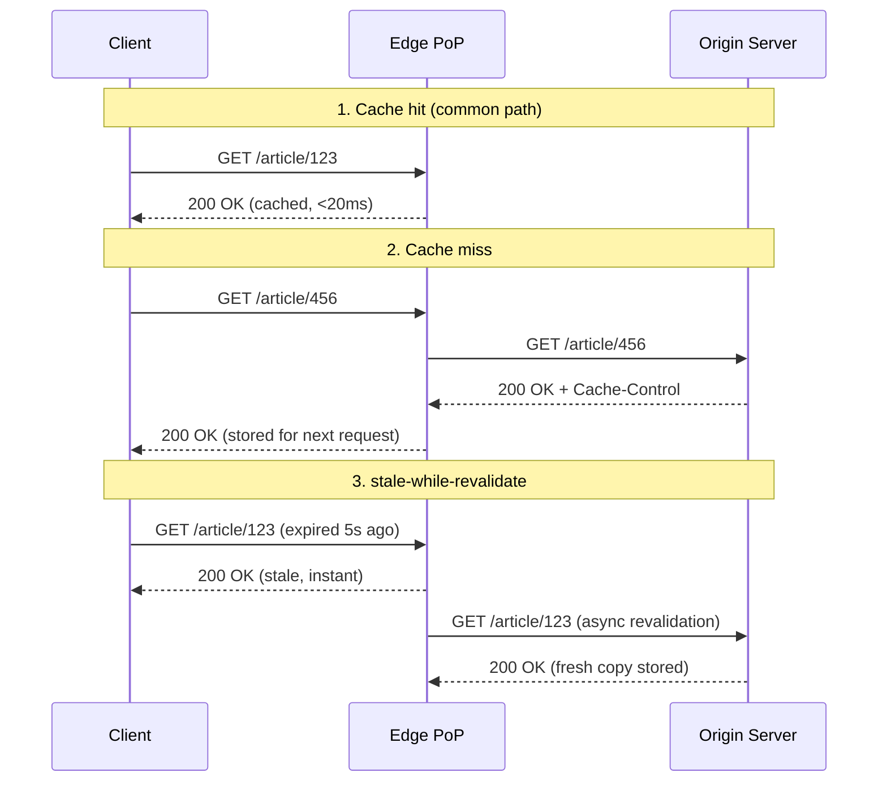

# Content Delivery Networks: Moving Bytes Closer to Users

> **TL;DR**: A CDN is a globally distributed cache and security front door. It terminates TLS near the user, serves cacheable content from the edge, and forwards only misses to your origin. Cloudflare operates in 330+ cities with 500 Tbps of capacity [^1]. Netflix Open Connect pre-positions video content across 1,000+ ISP-embedded appliances [^2]. A well-tuned CDN achieves 90 to 99% cache hit ratio [^3], meaning your origin handles 1 to 10% of traffic. Push aggressively to edge; 95%+ hit rate is the bar for static assets.

## Learning Objectives

After this module, you will be able to:

- [ ] Explain how anycast routing and GSLB direct users to the nearest edge
- [ ] Design cache keys and TTLs for dynamic and static content
- [ ] Use stale-while-revalidate, stale-if-error, and soft purges to hide origin failures
- [ ] Reason about cache hit ratio, origin offload, and egress cost
- [ ] Decide what belongs at the edge vs the origin vs the client
- [ ] Evaluate edge compute platforms and their execution constraints

## Intuition

Imagine a bookstore chain with one massive warehouse in Kansas. Every customer order ships from that warehouse. Customers in New York wait two days; customers in Tokyo wait two weeks. The fix is obvious: open small stores in every major city, stock them with bestsellers, and ship only rare titles from the warehouse.

A CDN does exactly this for HTTP traffic. Instead of every request traveling to your origin server (the warehouse), each user connects to the nearest point of presence (the local store). The PoP stocks popular content in memory and on disk. Only cache misses travel back to origin. The result: a round trip that would take 200 ms from New York to Sydney drops to under 20 ms to the nearest metro PoP. That latency win requires zero code changes. It is the single largest performance improvement available to any web application.

The tension is the same as in retail: how do you keep the local stores stocked with the right inventory (freshness), without overstocking (memory cost), and without selling yesterday's newspaper (staleness)? That is the substance of this chapter.

## Theory

### Why CDNs exist

Three forces make CDNs non-optional for any public-facing application:

**The speed of light.** A round trip from New York to Sydney is about 200 ms on ideal fiber. TCP handshake plus TLS 1.3 already consumes two RTTs before the first byte of response. Shortening that path to the nearest metro, often under 20 ms, eliminates the dominant latency component. Cloudflare targets less than 50 ms to 95% of Internet users [^4] by operating data centers in 330+ cities across 125+ countries [^1][^5].

**Origin offload.** A site with heavy static assets regularly achieves 90 to 99% cache hit ratio at the edge [^3][^6]. That means the origin handles 1 to 10% of incoming request volume. This multiplier is what lets small origin fleets survive viral events without autoscaling panic.

**DDoS absorption.** A CDN with 500 Tbps of capacity can absorb volumetric attacks that would saturate any single origin. In October 2024, Cloudflare autonomously mitigated a 5.6 Tbps UDP flood from a Mirai-variant botnet in 80 seconds, with no human intervention [^7]. Across 2024, Cloudflare blocked 21.3 million DDoS attacks, averaging 4,870 per hour [^7].

### Architecture: anycast, PoPs, and origin shield

A PoP (point of presence) is a physical cluster of cache servers colocated at or near an Internet exchange point. User traffic reaches the correct PoP via one of two mechanisms:

**BGP anycast** announces a single IP from every PoP. Routers on the path pick the topologically nearest announcement via BGP. Cloudflare and Fastly rely primarily on anycast [^8]. If a PoP fails, BGP withdraws the route and traffic shifts in seconds, with zero DNS TTL dependence.

**DNS-based GSLB** (Global Server Load Balancing) returns a different A/AAAA record per geography based on resolver IP or EDNS Client Subnet. Akamai and CloudFront historically use this approach [^9]. The downside: failover depends on DNS TTLs, which can stick users to a suboptimal PoP for minutes.

In 2026, anycast has mostly won for new deployments. It gives automatic failover, simpler configuration, and no DNS propagation delay. GSLB remains relevant for fine-grained geo-steering and compliance routing.

Both approaches feed into a tiered cache hierarchy:

*User requests resolve via anycast to the nearest edge PoP; misses escalate through regional cache and origin shield before reaching origin.*

Without Origin Shield, each regional cache independently fetches from origin. A viral asset can generate multiple parallel origin requests on CloudFront (one per regional edge cache) [^9]. With Origin Shield enabled, all regional caches proxy through a single designated PoP, and the origin sees one request per object [^10]. Request collapsing at the shield handles concurrent in-flight misses for the same key.

### Cache keys and hit rates

The cache key is the tuple of (scheme, host, path, query string, selected headers) that uniquely identifies a cached object. Anything not in the key is ignored; anything added to it fragments the cache and kills hit rate.

**The golden pattern for static assets:** long TTL (`max-age=31536000, immutable`) plus hash-busting URLs (`/assets/app.a3f2b1.js`) [^11]. New deploys never collide with cached versions. Hit rate approaches 100%.

**The `Vary` trap:** `Vary` tells caches which request headers must match for a hit. `Vary: Accept-Encoding` is fine (2 to 3 variants). `Vary: User-Agent` shatters the cache into thousands of near-duplicate variants and drops hit rate from 95% to single digits [^3]. Normalize at the edge: map User-Agent to "mobile"/"desktop"/"bot" before keying.

**Revalidation:** `ETag` plus `If-None-Match` returns 304 Not Modified on match, saving bandwidth even when freshness is short [^12].

**Target hit rates:** 95%+ for static assets, 40 to 60% for dynamic API responses with short TTLs, below 10% means something is broken (usually `Vary` or cookies in the key).

### Purge and invalidation

Invalidation tells the CDN that a cached object is no longer fresh. Three granularities exist:

**URL purge** invalidates one object. Simple but does not scale when a CMS edit affects hundreds of pages.

**Tag-based purge (surrogate keys)** is the industry's answer. The origin attaches space-delimited keys via the `Surrogate-Key` header: `Surrogate-Key: user-542 user-pics template-pic-show`. A single API call invalidates every object tagged with that key, globally, in a mean of 150 ms on Fastly [^13][^14]. Discord, Webflow, and Anthropic use this pattern to keep rapidly-mutating content cacheable with long TTLs [^13].

**Soft purge** marks objects stale rather than deleting them, so `stale-while-revalidate` can still serve them while origin catches up [^15]. This turns an invalidation into a revalidation rather than a cold fetch, avoiding origin stampedes.

**Wildcard/prefix purge** invalidates all objects matching a path pattern. CloudFront charges per path after the first 1,000 per month [^16].

*Tag-based purge propagates through a globally replicated invalidation bus; Fastly reports 150 ms mean end-to-end propagation [^14].*

> [!IMPORTANT]
> Never run "purge all" in production. It forces the entire cache tier to cold-fill from origin simultaneously. This is equivalent to removing the CDN during the refill window and regularly takes sites down [^14].

### Edge compute

Edge compute runs user code in the CDN PoP, in the request/response path, so personalization, auth, A/B routing, and image transforms happen without a round trip to origin.

**Cloudflare Workers** runs multi-tenant V8 isolates. Cold start is under 5 ms. Limits: 10 ms CPU (free), up to 5 minutes CPU per HTTP request (paid, default 30 seconds), 128 MB memory per isolate, and up to 6 simultaneous open connections including TCP sockets via the `connect()` API [^17][^18].

**Fastly Compute** compiles to WebAssembly on Wasmtime. Cold starts are under 50 microseconds for lightweight modules [^19]. True polyglot: Rust, Go (TinyGo), JavaScript (Javy).

**AWS Lambda@Edge** runs full Node.js/Python at CloudFront's regional edge caches. Cold starts of 50 to 200 ms, deploys that take minutes to propagate, but longer execution limits (up to 30 seconds) [^20][^21].

*A Worker intercepts the request, checks the edge cache, and decides whether to serve cached content, fetch from origin, or respond directly.*

Be blunt: edge compute is a request-shaping layer for most workloads, not a drop-in general-purpose runtime. Free-tier CPU budgets (10 ms on Workers) rule out heavy per-request work; even with Workers Paid allowing up to 5 minutes of CPU per request, cold-path latency, memory caps (128 MB per isolate), and the lack of local disk make the edge the wrong home for stateful backends. Use it for header manipulation, auth token validation, A/B splits, and personalization stamps on cached templates. Do not try to run your application server at the edge.

### Streaming at the edge

Video streaming is the CDN's heaviest workload. HLS (HTTP Live Streaming) and DASH (Dynamic Adaptive Streaming over HTTP) segment video into 2 to 10 second chunks (6 seconds is the HLS default) [^22]. Each segment is a cacheable HTTP object. The manifest file lists available bitrates and segment URLs; the player fetches segments sequentially.

Low-Latency HLS (LL-HLS) targets 2 to 3 seconds glass-to-glass latency by using partial segments and blocking playlist reloads [^22]. This pushes CDN requirements toward sub-second TTLs on manifest files while keeping segment TTLs long.

Netflix Open Connect is the extreme case: a private CDN with custom appliances deployed to 1,000+ ISP partners [^2][^23]. OCAs are push-filled during off-peak windows (2 am to 2 pm local time) so peak-hour bandwidth is 100% outbound, never inbound [^24]. Netflix serves 325 million paid subscribers (Q4 2025) and logged 96 billion hours of viewing in H2 2025 alone [^25].

### Security at the edge

Because all traffic transits the CDN, the edge is the right place to inspect, rate-limit, and drop hostile requests before they consume origin resources.

**WAF rules** match request signatures (OWASP Top 10 patterns, custom regex) and block at the edge. Ship with a staging mode first; false positives have repeatedly taken legitimate traffic down.

**DDoS mitigation** runs in eBPF/XDP on the network card. Cloudflare's `l4drop` program drops packets matching attack fingerprints before they reach user space. `dosd` broadcasts fingerprints colo-wide in seconds so every server in a PoP converges on the same drop list [^1].

**Bot management** combines TLS fingerprinting (JA3/JA4), header ordering, behavioral analysis, and challenge responses (Cloudflare Turnstile) to separate legitimate browsers from headless crawlers [^1].

Dropping attack traffic at 500 Tbps of absorbed capacity is the only economical answer to volumetric DDoS [^5][^7]. Rate-limiting at the edge protects origin login and checkout endpoints from credential stuffing without adding origin latency.

## Real-World Example

### Netflix Open Connect: the world's largest private CDN

Netflix delivers 100% of its video traffic through Open Connect, a purpose-built CDN serving tens of terabits per second of simultaneous peak traffic [^2]. The system serves 301 million paid subscribers who watched 94 billion hours in H2 2024 [^25].

**Architecture.** Netflix designs and ships custom appliances (OCAs) to ISPs that qualify on traffic volume. OCAs are also deployed at Netflix-operated IXP colocation sites across 60+ data centers [^23]. Content is pre-positioned, not pulled on demand. A nightly fill window copies that day's predicted-popular encodes to every appliance before peak hours begin [^24].

**Why private?** No public CDN would have been cost-effective at Netflix's scale. Open Connect appliances are given to ISPs free because both sides save transit cost [^2][^23]. The ISP avoids paying for upstream bandwidth; Netflix avoids paying CDN egress fees on petabytes of daily traffic.

**Routing.** Clients resolve a Netflix domain that returns an OCA selected by the Open Connect control plane based on ISP, appliance health, and geography. If an ISP's embedded OCA is down, the control plane routes to a second embedded OCA, then to a nearby IX OCA, then to a regional data center OCA [^23].

**The push-fill pattern.** OCAs do not pull through on demand. They pre-load during the ISP's off-peak window (typically 2 am to 2 pm local time). This shifts 100% of peak-hour OCA traffic to egress with zero peak-hour ingress [^24]. The result: predictable bandwidth usage, no cache-miss storms during prime time.

**Failure mode.** The November 2024 Jake Paul vs Mike Tyson live event exhibited widespread buffering and app crashes. Analysis attributed degradation to origin/egress congestion rather than Open Connect's steady-state CDN [^26]. Live streaming is qualitatively different from VOD, even for a CDN of this scale.

*On hit, the client gets sub-20ms response. With stale-while-revalidate, even expired content is served instantly while the edge refreshes in the background.*

## Trade-offs

| Approach | Pros | Cons | Best when | Our Pick |
|---|---|---|---|---|
| Public CDN (Cloudflare, Fastly, CloudFront) | Global reach, zero infra, built-in DDoS, edge compute | Per-request cost, vendor lock-in | Public web, SaaS, media | Default for most applications |
| Private CDN (Netflix Open Connect) | Bespoke for workload, lowest cost at exabyte scale | Years of investment, ISP partnerships | Only at massive media scale | Only if you are Netflix-scale |
| Multi-CDN | Redundancy, vendor negotiation leverage | Complex config, purge coordination across vendors | Tier-1 consumer products | When availability SLA demands it |
| Anycast + few big PoPs (Fastly) | High per-PoP hit rate, dense peering, instant purge | Fewer locations, more RTT in some regions | Dynamic, API-heavy, news sites | When purge speed matters most |
| GSLB + many small PoPs (Akamai) | Close to every eyeball, deep ISP reach | Lower per-PoP hit rate, DNS-TTL failover | Enterprise, streaming, compliance | Legacy enterprise with Akamai contracts |

## Common Pitfalls

> [!WARNING]
> **Cache key poisoning via `Vary`.** Adding `Vary: User-Agent` or `Vary: Cookie` shatters each URL into thousands of variants. Hit rate drops from 95% to single digits. Fix: normalize request headers at the edge (map User-Agent to "mobile"/"desktop"/"bot") and strip marketing query parameters before keying [^3].

> [!WARNING]
> **Forgetting `Vary: Accept-Encoding`.** Without it, a gzipped response may be served to a client that cannot decompress, or vice versa. Always include `Vary: Accept-Encoding` on text responses. But never add `Vary: User-Agent` alongside it.

> [!WARNING]
> **Over-aggressive TTLs breaking invalidation.** Setting `max-age=31536000` on content that changes (API responses, HTML pages) means you cannot fix mistakes without a purge. Reserve year-long TTLs for hash-busted immutable assets only. Everything else needs a TTL you can outlive.

> [!WARNING]
> **Ignoring origin egress costs.** CloudFront pay-as-you-go charges $0.085/GB for the first 10 TB/month in North America [^27]. Direct S3 egress is $0.09/GB [^27]. Cloudflare R2 charges $0 for egress [^28]. At petabyte scale, egress is your largest bill. Model it before choosing a CDN.

> [!WARNING]
> **Not using Origin Shield.** Without it, each regional cache independently fetches from origin on miss. A viral asset generates multiple parallel origin requests on CloudFront (one per regional edge cache) [^9]. Enable Origin Shield for any workload where origin protection matters. The extra hop adds single-digit milliseconds but collapses request volume dramatically.

> [!WARNING]
> **Going to production without a CDN.** "We're small, we don't need one yet" is a familiar line that breaks the first time a post trends, a bot swarm probes the login page, or a user in Singapore complains about a 400 ms page load against a US-east origin. A CDN is not an optimization, it is the DDoS mitigation tier, the TLS tier, and the latency floor for global users. Even internal tools accessed over the public internet benefit from edge TLS termination and bot filtering. The only reasonable "no CDN" case is a strictly internal service behind a VPN or corp network.

> [!WARNING]
> **Single-CDN blast radius.** On June 8, 2021, a single customer's valid config change triggered a latent bug that caused 85% of Fastly's network to return errors for about one hour, taking down Amazon, Reddit, Twitch, PayPal, the Guardian, and gov.uk [^29]. Fix: multi-CDN DNS-level failover with health checks that shift traffic within the DNS TTL window. Expect operational complexity.

## Exercise

> **Design Challenge:** You are building the CDN strategy for a video-on-demand platform with 100M MAU, 1080p default resolution, and a 4 PB content library. Design the caching, invalidation, and delivery architecture. Consider: where does content live at the edge? How do you handle new releases vs long-tail catalog? What is your purge strategy when a title is removed for licensing?

Hint

Think about the difference between popular titles (cache-friendly, high hit rate) and long-tail catalog (rarely accessed, low hit rate). Consider a push-fill model for predicted-popular content and pull-through for the long tail. For invalidation on license removal, you need global purge within minutes, not hours.

Solution

**Architecture: tiered CDN with push-fill for popular content.**

Use a public CDN (CloudFront or Fastly) with Origin Shield enabled. S3 as the origin for all video segments. Enable tiered caching so regional caches absorb misses before they reach origin.

**Popular titles (top 5%, ~80% of views):** Pre-warm these into edge PoPs during off-peak hours using a background job that issues warming requests through the CDN. Set `Cache-Control: max-age=86400, stale-while-revalidate=3600, stale-if-error=86400`. These segments will have near-100% hit rate.

**Long-tail catalog (bottom 95%, ~20% of views):** Pull-through caching with `max-age=3600`. Accept lower hit rates (40 to 60%) because the per-title access frequency is too low to justify pre-warming. Origin Shield collapses concurrent misses.

**Segment and manifest strategy:** Video segments (2 to 10 seconds each) are immutable once encoded. Use hash-busted URLs: `/segments/{title_id}/{bitrate}/{hash}.ts` with `max-age=31536000, immutable`. Manifest files (`.m3u8`) change when new bitrates are added; use `max-age=60` with `stale-while-revalidate=30`.

**Purge on license removal:** Tag every segment with `Surrogate-Key: title-{id}`. When a title is pulled, issue a single tag-based purge: `POST /purge/title-{id}`. Fastly propagates this in 150 ms globally. On CloudFront, use wildcard invalidation on the title's path prefix.

**Capacity math:** 100M MAU, assume 2 hours/day average viewing at 5 Mbps (1080p) = 4.5 GB/user/day. Peak concurrent users ~10M. Peak egress: 10M * 5 Mbps = 50 Tbps. This is Netflix-adjacent scale. At this point, evaluate a private CDN or negotiate enterprise CDN contracts with committed capacity.

**Trade-offs accepted:** Long-tail content has higher origin load and occasional first-viewer latency spikes. Pre-warming costs bandwidth during off-peak but eliminates cold-start latency for popular titles. Multi-CDN adds complexity but is required at 50 Tbps peak.

## Key Takeaways

- A CDN is a cache first, a compute platform second. Cache hit ratio is the metric that matters. Target 95%+ for static assets.
- The speed-of-light argument is not rhetorical: 200 ms NYC-to-Sydney RTT drops to under 20 ms to the nearest PoP. This is the largest latency win available without code changes.
- Long TTLs plus hash-busting URLs (`app.a3f2b1.js` with `max-age=31536000, immutable`) are the highest-leverage CDN pattern ever invented [^11].
- Stale-while-revalidate hides origin failures and latency. It is nearly free to enable and should be on every cacheable response [^12].
- Tag-based purge (surrogate keys) lets you cache aggressively with long TTLs and still invalidate in 150 ms globally [^13][^14].
- Edge compute is a request-shaping layer, not a general runtime. Workers caps CPU at 10 ms (free) or up to 5 minutes (paid, default 30 seconds) and memory at 128 MB per isolate. Use it for auth, A/B splits, and personalization stamps.
- Your CDN is a single point of failure. The 2021 Fastly outage took down half the internet for an hour [^29]. Multi-CDN is a resilience pattern for any tier-1 product.

## Further Reading

- [Cloudflare: 500 Tbps of capacity, 16 years of scaling](https://blog.cloudflare.com/500-tbps-of-capacity/) - Concrete 2026 network numbers, architecture of l4drop/Unimog/Quicksilver; read to understand how a modern CDN absorbs 5+ Tbps attacks.
- [Netflix Open Connect program overview](https://openconnect.netflix.com/en/) - The canonical source for the private-CDN model; explains why Netflix builds its own hardware and gives it to ISPs for free.
- [Fastly: Surrogate Keys Part 1](https://www.fastly.com/blog/surrogate-keys-part-1) - The founding blog post for tag-based purge; explains the Surrogate-Key header and why URL-based purge does not scale for CMS workloads.
- [RFC 5861: Cache-Control Extensions for Stale Content](https://datatracker.ietf.org/doc/html/rfc5861) - The spec behind stale-while-revalidate and stale-if-error; short, readable, and immediately actionable.
- [AWS CloudFront: Increase origin offload](https://aws.amazon.com/developer/application-security-performance/articles/increase-origin-offload/) - Cache hit ratio math, Origin Shield architecture, and practical tuning for CloudFront deployments.
- [High Performance Browser Networking by Ilya Grigorik](https://hpbn.co/) - The definitive free reference on HTTP caching, TLS latency, and network performance; read Chapter 11 before designing any CDN strategy.
- [Fastly 2021 outage retrospective (Reuters)](https://www.reuters.com/business/media-telecom/fastly-blames-software-bug-major-global-internet-outage-2021-06-09/) - The case study for single-CDN risk; one valid config change triggered a latent bug that took down 85% of the network.
- [Cloudflare DDoS Threat Report 2024 Q4](https://blog.cloudflare.com/ddos-threat-report-for-2024-q4/) - 5.6 Tbps mitigation details and full-year attack statistics; essential context for security-at-the-edge arguments.

## Flashcards

**Q:** What is the single largest latency win a CDN provides, and why?
**A:** Reducing physical distance. A round trip from NYC to Sydney is ~200 ms on fiber. Connecting to a local PoP (under 20 ms) eliminates the speed-of-light penalty without any code changes.

**Q:** What is the golden caching pattern for static assets?
**A:** Long TTL (`max-age=31536000, immutable`) plus hash-busting URLs (`/app.a3f2b1.js`). New deploys use new hashes, so old cached versions never collide with new ones. Hit rate approaches 100%.

**Q:** What is stale-while-revalidate and why should you always enable it?
**A:** Per RFC 5861, it lets the cache serve a stale response instantly while asynchronously fetching a fresh copy from origin. Users never wait for revalidation. Combined with stale-if-error, it turns origin outages into degraded-but-available states.

**Q:** How do surrogate keys (tag-based purge) work?
**A:** The origin attaches `Surrogate-Key: tag1 tag2` to responses. The CDN maps each cached object to its tags. A single API call (`POST /purge/tag1`) invalidates every object with that tag globally. Fastly reports 150 ms mean propagation.

**Q:** What is the difference between anycast and DNS-based GSLB for CDN routing?
**A:** Anycast announces one IP from every PoP; BGP picks the nearest. Failover is automatic (seconds). GSLB returns different DNS records per geography; failover depends on DNS TTLs (minutes). Anycast has mostly won for new deployments.

**Q:** What is Origin Shield and when should you enable it?
**A:** A single designated cache that acts as the sole upstream for all regional caches. Without it, each regional cache independently fetches from origin on miss. Enable it when origin protection matters; it collapses N parallel origin requests into one.

**Q:** Why is "purge all" dangerous in production?
**A:** It forces the entire cache tier to cold-fill from origin simultaneously. Origin saturates, error rates spike, and the site effectively loses its CDN during the refill window. Use tag-based purge or soft purge instead.

**Q:** What are the CPU limits of edge compute platforms?
**A:** Cloudflare Workers: 10 ms (free), up to 5 minutes per HTTP request (paid, default 30 seconds), with 128 MB memory per isolate. Fastly Compute (Wasm): under 50 microsecond cold start with similar short per-request budgets. Lambda@Edge: up to 30 seconds but with 50 to 200 ms cold starts. Edge compute is a request-shaping layer, not a general runtime.

**Q:** Why did Netflix build a private CDN instead of using Cloudflare or Akamai?
**A:** At Netflix's scale (tens of Tbps peak, petabytes daily), no public CDN would be cost-effective. Open Connect appliances are given to ISPs free; both sides save transit cost. Content is push-filled during off-peak so peak-hour bandwidth is 100% outbound.

**Q:** What caused the June 2021 Fastly outage and what is the lesson?
**A:** A single customer's valid configuration change triggered a latent software bug, causing 85% of Fastly's network to return errors for about one hour. The lesson: your CDN is a single point of failure. Multi-CDN with DNS-level failover is the resilience pattern for tier-1 products.

**Q:** What cache hit rate should you target for static vs dynamic content?
**A:** 95%+ for static assets (CSS, JS, images with hash-busted URLs). 40 to 60% for dynamic API responses with short TTLs. Below 10% means something is broken, usually Vary headers or cookies in the cache key.

**Q:** How does Cloudflare mitigate DDoS at the network level?
**A:** eBPF/XDP programs (`l4drop`) run on the network card and drop packets matching attack fingerprints before they reach user space. `dosd` broadcasts fingerprints colo-wide in seconds so every server converges on the same drop list. No centralized scrubbing center.

**Q:** What is the push-fill pattern used by Netflix Open Connect?
**A:** OCAs pre-load predicted-popular content during ISP off-peak windows (2 am to 2 pm local). This means peak-hour bandwidth is 100% outbound (OCA to user) with zero peak-hour ingress (origin to OCA). No cache-miss storms during prime time.

**Q:** When should you use multi-CDN?
**A:** When your availability SLA cannot tolerate a single-CDN global outage (the Fastly 2021 incident lasted one hour). Expect operational complexity: configuration, purge, and logging must be coordinated across both CDNs. Use DNS-level failover with health checks.

**Q:** What is the egress cost difference between Cloudflare R2 and AWS S3?
**A:** Cloudflare R2 charges $0 for egress to the Internet. AWS S3 direct egress is $0.09/GB for the first 10 TB. At petabyte scale, this difference dominates your infrastructure bill.

## References

[^1]: Ryan, T. "500 Tbps of capacity: 16 years of scaling our global network." Cloudflare Blog, April 2026. https://blog.cloudflare.com/500-tbps-of-capacity/
[^2]: Netflix. "How Netflix works with ISPs around the globe to deliver a great viewing experience." About Netflix, accessed 2026. https://about.netflix.com/en/news/how-netflix-works-with-isps-around-the-globe-to-deliver-a-great-viewing-experience
[^3]: AWS. "Increase the proportion of requests that are served directly from the CloudFront caches (cache hit ratio)." AWS CloudFront Developer Guide, accessed 2026. https://docs.aws.amazon.com/AmazonCloudFront/latest/DeveloperGuide/cache-hit-ratio.html
[^4]: Cloudflare. "Global Network Infrastructure." Cloudflare Workers, accessed 2026. https://workers.cloudflare.com/solutions/network
[^5]: Takaya, S.M. and Herdes, B. "The backbone behind Cloudflare's Connectivity Cloud." Cloudflare Blog, August 2024. https://blog.cloudflare.com/backbone2024/
[^6]: AWS. "Increase origin offload." AWS Application Security and Performance, accessed 2026. https://aws.amazon.com/developer/application-security-performance/articles/increase-origin-offload/
[^7]: Yoachimik, O. and Pacheco, J. "Record-breaking 5.6 Tbps DDoS attack and global DDoS trends for 2024 Q4." Cloudflare Blog, January 2025. https://blog.cloudflare.com/ddos-threat-report-for-2024-q4/
[^8]: Cloudflare. "How does Anycast work?" Cloudflare Learning Center, accessed 2026. https://www.cloudflare.com/learning/cdn/glossary/anycast-network/
[^9]: AWS. "Use Amazon CloudFront Origin Shield." AWS CloudFront Developer Guide, accessed 2026. https://docs.amazonaws.cn/en_us/AmazonCloudFront/latest/DeveloperGuide/origin-shield.html
[^10]: AWS. "Announcing Amazon CloudFront Origin Shield." AWS News, October 2020. https://aws.amazon.com/about-aws/whats-new/2020/10/announcing-amazon-cloudfront-origin-shield/
[^11]: Grigorik, I. "High Performance Browser Networking, Ch. 11." O'Reilly, accessed 2026. https://hpbn.co/primer-on-web-performance/
[^12]: Nottingham, M. "RFC 5861: HTTP Cache-Control Extensions for Stale Content." IETF, May 2010. https://datatracker.ietf.org/doc/html/rfc5861
[^13]: McMullen, T. "Surrogate Keys: Part 1." Fastly Blog, July 2013. https://www.fastly.com/blog/surrogate-keys-part-1
[^14]: Fastly. "Purging with surrogate keys." Fastly Documentation, accessed 2026. https://docs.fastly.com/en/guides/purging-with-surrogate-keys
[^15]: Fastly. "Soft purges." Fastly Documentation, accessed 2026. https://www.fastly.com/documentation/guides/full-site-delivery/purging/soft-purges/
[^16]: AWS. "Amazon CloudFront Pricing." Accessed 2026. https://aws.amazon.com/cloudfront/pricing/
[^17]: Partovi, A. "Eliminating cold starts with Cloudflare Workers." Cloudflare Blog, July 2020. https://blog.cloudflare.com/eliminating-cold-starts-with-cloudflare-workers/
[^18]: Cloudflare. "Limits." Cloudflare Workers Documentation, accessed 2026. https://developers.cloudflare.com/workers/platform/limits/
[^19]: Jones, MJ. "How Compute is tackling serverless cold starts, regional latency, and observability." Fastly Blog, October 2020. https://www.fastly.com/blog/how-compute-edge-is-tackling-the-most-frustrating-aspects-of-serverless
[^20]: AWS. "Customize at the edge with Lambda@Edge." AWS CloudFront Developer Guide, accessed 2026. https://docs.aws.amazon.com/AmazonCloudFront/latest/DeveloperGuide/lambda-at-the-edge.html
[^21]: AWS. "Lambda@Edge quotas." AWS CloudFront Developer Guide, accessed 2026. https://docs.aws.amazon.com/AmazonCloudFront/latest/DeveloperGuide/edge-functions-restrictions.html
[^22]: CDNsun. "Low-Latency HLS with CDN: The Ultimate Production Guide." Accessed 2026. https://blog.cdnsun.com/low-latency-hls-with-cdn-the-ultimate-production-guide/
[^23]: Netflix. "Open Connect Appliances." Open Connect, accessed 2026. https://openconnect.netflix.com/en/appliances/
[^24]: Netflix. "Fill patterns." Open Connect Partner Help Center, accessed 2026. https://openconnect.zendesk.com/hc/en-us/articles/360035618071-Fill-patterns
[^25]: Netflix. "What We Watched: The Second Half of 2024." About Netflix, February 2025. https://about.netflix.com/en/news/what-we-watched-the-second-half-of-2024
[^26]: ThousandEyes. "Lessons for Major Live Events: Netflix Disruption Analysis." ThousandEyes Blog, November 2024. https://www.thousandeyes.com/blog/netflix-disruption-analysis-november-15-2024
[^27]: AWS. "Amazon CloudFront Pricing." Accessed 2026. https://aws.amazon.com/cloudfront/pricing/
[^28]: Cloudflare. "R2 Pricing." Cloudflare R2 Documentation, accessed 2026. https://developers.cloudflare.com/r2/pricing/
[^29]: Reuters. "Fastly blames software bug for major global internet outage." June 9, 2021. https://www.reuters.com/business/media-telecom/fastly-blames-software-bug-major-global-internet-outage-2021-06-09/
