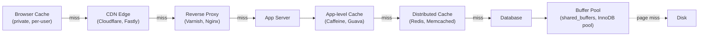
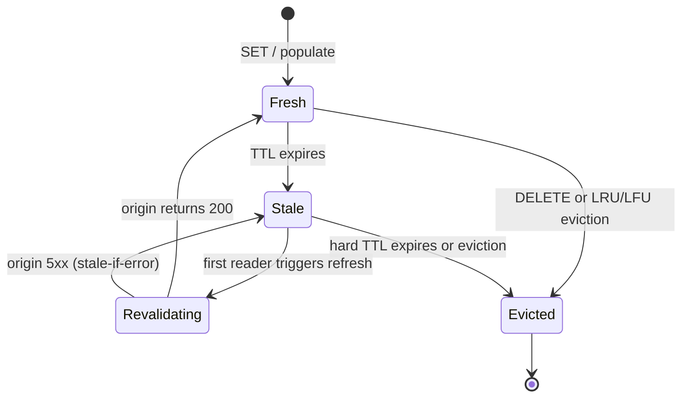
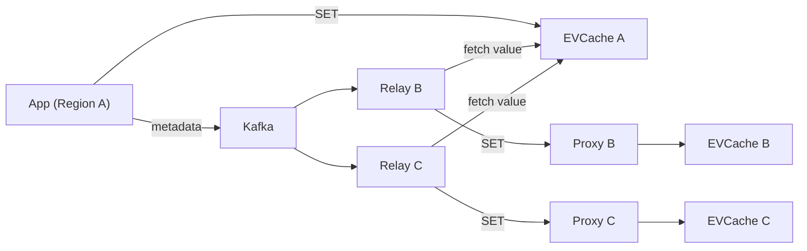
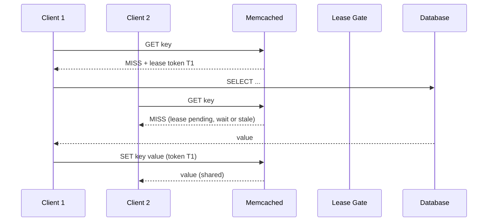

# Caching: From Browser to Database

> **TL;DR**: A cache trades memory and a bounded risk of staleness for a 10x to 1,000x latency win. Every layer of a modern stack has one, from the browser's HTTP cache to the database buffer pool. Facebook's Memcache fleet handles billions of requests per second across trillions of items [^1]. Netflix EVCache serves approximately 400 million operations per second across 22,000 server instances at peak [^2]. The default pattern is cache-aside with jittered TTLs and single-flight coalescing. Invalidation is genuinely hard because it is a distributed consistency problem. Treat it with the same rigor you give replication.

## Learning Objectives

After this module, you will be able to:

- [ ] Choose between cache-aside, read-through, write-through, write-behind, and refresh-ahead for a given workload
- [ ] Reason about cache invalidation, TTLs, and consistency windows
- [ ] Prevent thundering herds, cache stampedes, and hot-key problems
- [ ] Pick an eviction policy (LRU, LFU, TinyLFU) based on access patterns
- [ ] Size a cache using hit ratio, working set, and latency targets
- [ ] Explain how distributed caches (Redis Cluster, mcrouter) route and replicate

## Intuition

Picture a professional kitchen during dinner service. The chef does not walk to the pantry for every plate. Instead, she sets up a **mise en place**: small containers of prepped ingredients arranged within arm's reach. Garlic is minced, sauces are reduced, proteins are portioned. The prep station is a cache. It trades counter space (memory) for speed (latency). If a container runs empty, the sous chef refills it from the walk-in (the origin). If the recipe changes, the old prep gets tossed (invalidation).

Now scale up. A restaurant chain has a central commissary (the database), regional distribution centers (distributed cache), and each kitchen's own prep station (app-level cache). A customer never sees the commissary. They see the plate that came from the nearest prep station. The chain works because most orders hit the prep station. When they do not, the kitchen slows down, tickets pile up, and the expeditor starts yelling. That is a cache miss under load.

Your system works the same way. A 50 ms database call becomes a 0.3 ms cache hit. The question is never "should I cache?" It is "where in the hierarchy, for how long, and how do I invalidate safely?"

## Theory

### The cache hierarchy

A request passes through up to six caching layers before it touches disk. Each layer shields the one below it.

*Every layer from browser to buffer pool is a cache; a request that hits at any layer short-circuits the rest.*

The browser obeys `Cache-Control` directives from RFC 9111 [^3]. Hashed static assets use `max-age=31536000, immutable` for a one-year freshness lifetime [^4]. The CDN caches at the edge, cutting WAN round-trip time. The reverse proxy (Varnish) stores rendered pages in RAM and supports grace mode for serving stale while revalidating [^5]. The app-level cache (Caffeine in JVM, Rails fragment cache) stores deserialized objects with zero network hop. The distributed cache (Redis, Memcached) shares state across stateless app servers. The database buffer pool (Postgres recommends `shared_buffers` at 25% of RAM [^6]) keeps hot pages in memory so most reads never hit disk.

The key insight: each layer has its own TTL and consistency model. Long TTLs at the browser for immutable assets, short TTLs at the app layer for user-specific state. N layers means N places where stale data can linger, so you must reason about invalidation at every level.

### Caching patterns

Five standard patterns govern how application, cache, and database interact.

**Cache-aside (lazy loading).** The application reads the cache first. On miss, it loads from the database, populates the cache, and returns. On write, it updates the database and invalidates the cache key. This is the default at AWS because it tolerates cache unavailability [^7]. If Redis is down, reads fall through to the database.

**Read-through.** The cache library loads from the database on miss. The application calls only `get`. Caffeine's `LoadingCache` and DynamoDB Accelerator (DAX) work this way [^7]. Simpler caller code, but the cache is now on the availability path.

**Write-through.** Every write goes to cache and database synchronously. Guarantees read-your-writes consistency, but doubles write latency. Use it for low-write workloads where freshness matters more than speed.

**Write-behind (write-back).** Write to cache first, flush to the database asynchronously. Fast writes, batched database load. Discord's Read States service uses a 30-second coalescing window to batch Cassandra writes [^8]. The risk: data loss on crash between cache write and database flush.

**Refresh-ahead (stale-while-revalidate).** The cache detects a key approaching its TTL and refreshes it in the background before expiry. HTTP's `stale-while-revalidate` directive (RFC 5861) is the standard version for edge caches [^9]. Readers never wait, but they may see bounded stale data.

Use cache-aside as your default. Reach for write-through only when you need strong read-your-writes. Use write-behind for counters, metrics, and high-write workloads where you can tolerate bounded data loss.

### Eviction policies

When the cache is full, something must go. The eviction policy decides what.

**LRU (Least Recently Used)** is the most common eviction policy for caching workloads. Redis recommends `allkeys-lru` as the default choice for most caches [^10]. It is O(1), intuitive, and good enough for recency-skewed workloads. Its weakness: a sequential scan (reading N keys where N exceeds cache size) wipes the entire hot working set.

**LFU (Least Frequently Used)** prefers popular keys. Redis supports `allkeys-lfu` using a probabilistic counter [^10]. Sticky for popular entries, but stale popular keys never evict without aging.

**TinyLFU** uses a 4-bit count-min sketch to estimate access frequency. It admits a new entry only if its estimated frequency exceeds the victim's. The Caffeine implementation grows the sketch at 8 bytes per cache entry [^11].

**W-TinyLFU (Window TinyLFU)** is Caffeine's default. It adds a small admission LRU window so recency bursts are not rejected by the frequency filter. Caffeine reports W-TinyLFU is within a few percent of Belady's optimal on workloads from Wikipedia and ARC traces, and significantly beats plain LRU [^12]. If you are on the JVM, use Caffeine. If you are on Redis, use `allkeys-lfu` for frequency-skewed workloads and `allkeys-lru` for recency-skewed ones.

### TTL and staleness

TTL (time-to-live) bounds how long a cached entry is considered fresh.

**Absolute TTL** expires at a fixed timestamp. Simple, predictable, but entries populated at the same time expire together, causing synchronized misses.

**Sliding TTL** resets on each access. Hot keys stay alive; cold keys age out. Useful for session caches but harder to reason about staleness bounds.

**Jittered TTL** adds random noise: `TTL = base +/- 10%`. Entries filled together no longer expire together. This is the cheapest stampede prevention and should be your default for any cache with more than one writer.

**Stale-while-revalidate** lets the cache serve a stale response while refreshing asynchronously [^9]. Varnish implements this as "grace mode" [^5]. The reader never waits, but sees data that is at most `grace_window` seconds old.

**XFetch** (Vattani, Chierichetti, Lowenstein, 2015) probabilistically recomputes before TTL based on how long the computation takes and a beta parameter, making stampedes provably rare [^13]. Use it when you can track per-key computation time.

AWS recommends a soft-TTL plus hard-TTL pattern: clients try to refresh at soft-TTL but continue serving cached data until hard-TTL if the origin is unavailable [^7]. This prevents a backend outage from cascading into a cache avalanche.

*A cache entry transitions through fresh, stale, revalidating, and evicted states; TTL expiry and explicit invalidation drive the transitions.*

### Cache invalidation

Phil Karlton's quip that "there are only two hard things in Computer Science: cache invalidation and naming things" is the standard shorthand for this pain. It is hard because consistency is a distributed problem: multiple cache replicas, multiple writers, clock skew, and replication lag.

**Write-invalidate (delete on write).** The cache-aside default. Update the database, then delete the cache key. The next read fills a fresh value. Simple, but between the write and the delete, readers see stale data.

**Double-delete.** Delete the key before the write and again after. Handles the race where a concurrent reader re-populates stale data between the write and the first delete. Extra operation per write, but closes the window.

**Versioned keys.** Embed a version or hash in the key: `product:v42:123`. Invalidation is a no-op because the old key ages out. All new reads go to the new key. Works well for immutable data with infrequent schema changes.

**Pub/sub invalidation.** Broadcast invalidation messages via Redis Pub/Sub or Kafka. Netflix EVCache uses a Kafka-based relay to replicate cache mutations across regions within one second at p99 [^2]. Delivery is not guaranteed (Kafka drops old messages when queues fill), so combine with TTL as a safety net.

**Leases (Facebook NSDI 2013).** A cache miss returns a 64-bit lease token. Only the leaseholder may SET the key. Any concurrent writer's invalidation revokes outstanding leases. This prevents stale sets under concurrency and throttles recomputation to one per key per 10 ms [^1]. Leases are the cleverest idea in the paper and the most misunderstood. They solve both the thundering herd and the stale-set race in one mechanism.

### Distributed cache architectures

At scale, a single cache node is not enough. You need a cluster, and you need to decide how clients find the right shard.

**Client-side sharding** uses consistent hashing in the client library (Ketama for Memcached, CRC16 mod 16,384 for Redis Cluster hash slots). No extra hop, but every client needs pool membership, and adding nodes without downtime requires careful ring rebalancing.

**Proxy-based routing** (Facebook's mcrouter [^14], Twemproxy, Envoy) puts a routing layer between the application and the cache pool. Centralizes pool management, consistent hashing, and failover. The trade-off: an extra network hop and the proxy becomes an availability dependency.

**Redis Cluster** embeds membership in the cache servers themselves. Clients receive `MOVED` and `ASK` redirects during resharding. Built-in failover with replicas per shard. The constraint: multi-key commands are limited to the same hash slot.

**Cross-region replication.** Netflix EVCache runs multiple memcached server groups per region for intra-region redundancy. Cross-region replication uses a Kafka pipeline: the client writes metadata (key, not value) to Kafka, a Replication Relay fetches the value from the local cache, and sends it to a Replication Proxy in the target region [^2]. Peak cross-region replication exceeds 1 million RPS [^2].

*A write in Region A enqueues metadata on Kafka; per-region relay/proxy pairs replicate the value to peer regions within seconds.*

## Real-World Example

### Facebook Memcache at scale (NSDI 2013)

Facebook operates one of the largest cache deployments in the world: billions of requests per second across trillions of items, with a target p99 under 1 ms for in-region lookups [^1]. The system uses vanilla memcached as a building block, wrapped with a custom client library and server-side extensions.

**Architecture.** Each user-facing request fans out to many memcached shards via mcrouter. The client uses UDP for GETs (saving sockets) and TCP for SETs/DELETEs (preserving reliability). Pools are replicated across regions with one master region and followers. Writes invalidate cross-region caches asynchronously.

**The lease mechanism.** The paper's key contribution is leases. On a cache miss, the client receives a 64-bit lease token. Only the token holder may SET the key. If a concurrent writer invalidates the key mid-flight, the lease is revoked and the stale SET is rejected. Additionally, leases are granted only once per 10 ms per key, which hard-caps recomputation QPS and prevents thundering herds [^1].

**Stale values extension.** A DELETE marks the key stale rather than removing it. Readers can opt into stale data while a new value is being computed, functioning like `stale-while-revalidate` at the cache protocol level.

**Failure handling.** Cross-region traffic shifts produced cold-cache storms because the follower region's memcached lacked the working set. The fix: warm the follower asynchronously by replicating SETs (not just DELETEs) for a subset of hot keys. A small "gutter" pool absorbs overflow when a primary shard is unreachable.

*Facebook's lease mechanism: only the leaseholder may SET, preventing stale writes and throttling recomputation to one caller per key per 10 ms.*

The lesson: at Facebook's scale, naive cache-aside breaks. Leases, stale-value serving, and regional warming are not optimizations. They are requirements.

## Trade-offs

| Approach | Pros | Cons | Best when | Our Pick |
|---|---|---|---|---|
| Cache-aside | Simple, failure-tolerant, works with any KV store | Stale reads on race, explicit invalidation needed | Default for most apps | Default choice |
| Read-through | Transparent to app, centralized load logic | Cache outage = origin outage, couples to DB schema | Library-managed caches (Caffeine, DAX) | When using Caffeine or DAX |
| Write-through | Strong read-your-writes consistency | Write latency doubles, cache must be online | Low-write workloads needing freshness | Rarely; only for config/metadata |
| Write-behind | Fast writes, batched DB load, absorbs spikes | Durability risk on crash, complex recovery | Counters, metrics, Discord-style read states | High-write, loss-tolerant workloads |
| Refresh-ahead | Hides DB latency for hot keys, reader never waits | Wastes work if key goes cold, bounded staleness | Predictable hot sets, CDN edge | HTTP stale-while-revalidate at CDN |

## Common Pitfalls

> [!WARNING]
> **Cache stampede (thundering herd).** A popular key expires, and N servers miss simultaneously, all hammering the origin. Fix: jittered TTLs prevent synchronized expiry. Single-flight coalescing (Go's `singleflight` package [^15]) caps origin calls to one per key per process. At Facebook scale, leases cap recomputation to one per key per 10 ms [^1].

> [!WARNING]
> **Negative cache poisoning.** Queries for keys that never exist bypass the cache entirely, generating a steady stream of origin misses. An attacker can exploit this to overload your database. Fix: cache "not found" results with a short TTL (30 to 60 seconds). Add a Bloom filter to reject obviously-absent keys before hitting the origin [^7].

> [!WARNING]
> **Stale data after failover.** A database failover promotes a lagging replica. Data the cache says is fresh is now older than the new primary. Users see reverted writes. Fix: version your cache keys so old entries age out naturally. Accept the staleness window or flush affected keys (carefully, to avoid avalanche) [^7].

> [!WARNING]
> **Double-write inconsistency.** Writing to cache and database in parallel (or cache-then-database) breaks under any partial failure. The cache and database disagree, and there is no transaction spanning both. Fix: always write database first, then invalidate cache. For stronger guarantees, use the outbox pattern: write a DB row and an outbox row in the same transaction, then invalidate from the outbox.

> [!WARNING]
> **Hot-key saturation.** One key (celebrity tweet, trending product) receives orders-of-magnitude more QPS than the median, saturating a single Redis shard. Fix: replicate the hot key across multiple shards with key suffixing (`tweet:celebrity:1:shard0`, `...:shard1`). Add a local in-process cache (Caffeine L1) with a short TTL in front of the distributed cache [^12].

## Exercise

> **Design Challenge:** You are building the timeline cache for a Twitter-like platform. A celebrity with 100 million followers posts a tweet. Within seconds, all followers' timelines must reflect the new tweet. Design the cache strategy: what pattern, what TTL, how do you prevent a stampede, and how do you handle the hot-key problem?

Hint

Think about the fanout problem. You cannot push to 100M cached timelines synchronously. Consider a hybrid approach: pull-based for celebrity timelines (read-time merge) with a local cache layer to absorb the hot-key QPS. Use single-flight to prevent the stampede on the celebrity's own cached tweet.

Solution

**Pattern: cache-aside with pull-based fanout for celebrities.**

For normal users (under 10K followers), use push-based fanout: when they tweet, append to each follower's cached timeline. For celebrities (over 100K followers), push is too expensive. Instead, store the celebrity's recent tweets in a dedicated hot cache and merge them at read time into each follower's timeline.

**Hot-key mitigation:** The celebrity's tweet key will receive millions of QPS. Replicate it across 8 to 16 Redis shards with key suffixing (`tweet:celeb123:shard0` through `...:shard15`). The client hashes the reader's user ID to pick a shard, spreading load evenly. Add a Caffeine L1 cache (TTL 1 to 2 seconds) on each app server to absorb repeated reads within the same process.

**Stampede prevention:** When the celebrity posts, the new tweet is written to the database and the cache key is SET (not invalidated, since this is a new entry). For the timeline merge, use single-flight: the first reader per app server computes the merged timeline, and all concurrent readers on that server share the result.

**TTL strategy:** Celebrity tweet cache: TTL 5 minutes with jitter (+/- 30 seconds). Timeline merge result: TTL 10 seconds (short, because it changes frequently). The L1 Caffeine cache: TTL 1 second (absorbs burst, always fresh enough).

**Trade-offs accepted:** Followers see the celebrity's tweet within 1 to 10 seconds (eventual consistency). The merge at read time adds 2 to 5 ms of latency per timeline load. This is acceptable because the alternative (pushing to 100M timelines) would take minutes and overwhelm the cache cluster.

## Key Takeaways

- Caching is the single highest-leverage optimization in most systems. A 50 ms database call becomes a 0.3 ms cache hit. Measure hit ratio before anything else.
- Cache-aside is the safe default. It tolerates cache unavailability and works with any key-value store. Reach for write-through only when you need strong read-your-writes.
- Stampedes are inevitable at scale. Jittered TTLs plus single-flight coalescing are not optional. At Facebook scale, leases cap recomputation to one per key per 10 ms [^1].
- Invalidation is genuinely hard because it is a distributed consistency problem. Prefer short TTLs and versioned keys over clever invalidation schemes.
- W-TinyLFU (Caffeine's default) significantly outperforms LRU on real-world traces [^12]. If you are on the JVM, use Caffeine. On Redis, choose `allkeys-lfu` for frequency-skewed workloads.
- A service that cannot operate with a cold cache has become addicted to its cache [^7]. Design for graceful degradation: the origin must survive a full cache restart.
- Every layer of the hierarchy has its own TTL and consistency model. Reason about staleness at each layer independently.

## Further Reading

- [Scaling Memcache at Facebook (Nishtala et al., NSDI 2013)](https://www.usenix.org/conference/nsdi13/technical-sessions/presentation/nishtala) - The canonical production-scale caching paper; leases, lease throttling, stale-set handling, and regional pools. Read this before designing any cache layer above 100K QPS.
- [Caffeine Wiki: Efficiency](https://github.com/ben-manes/caffeine/wiki/Efficiency) - Ben Manes on W-TinyLFU vs ARC/LIRS/LRU with trace comparisons; the evidence that admission policy matters more than eviction policy.
- [AWS Builders' Library: Caching challenges and strategies](https://aws.amazon.com/builders-library/caching-challenges-and-strategies/) - Soft-TTL/hard-TTL, negative caching, cold-start addiction, and the "addicted to the cache" anti-pattern.
- [Caching for a Global Netflix (EVCache team)](https://netflixtechblog.com/caching-for-a-global-netflix-7bcc457012f1) - 30M req/sec peak, 2T/day, cross-region Kafka replication architecture. The best public description of a global cache fleet.
- [TinyLFU: A Highly Efficient Cache Admission Policy (Einziger et al., 2015)](https://arxiv.org/pdf/1512.00727.pdf) - The paper behind Caffeine's admission policy; explains the count-min sketch and why frequency beats recency.
- [Optimal Probabilistic Cache Stampede Prevention (Vattani et al., PVLDB Vol 8, 2015)](https://www.vldb.org/pvldb/vol8/p886-vattani.pdf) - The XFetch algorithm; provably optimal early-refresh probability.
- [Why Discord is switching from Go to Rust](https://discord.com/blog/why-discord-is-switching-from-go-to-rust) - GC-driven latency spikes on a large LRU cache and the Rust rewrite fix; a cautionary tale about cache size vs garbage collection.
- [Go singleflight package](https://pkg.go.dev/golang.org/x/sync/singleflight) - The reference implementation of duplicate call suppression; 50 lines that prevent stampedes.

## Flashcards

**Q:** What is cache-aside and why is it the default pattern?
**A:** The app reads the cache first; on miss, it loads from the database, populates the cache, and returns. On write, it updates the database and invalidates the cache. It is the default because it tolerates cache unavailability (reads fall through to the database if the cache is down).

**Q:** Name three mitigations for cache stampede (thundering herd).
**A:** (1) Jittered TTLs prevent synchronized expiry. (2) Single-flight coalescing caps origin calls to one per key per process. (3) Leases (Facebook) cap recomputation to one per key per 10 ms and reject stale SETs.

**Q:** What is the difference between LRU and W-TinyLFU?
**A:** LRU evicts the least recently used entry. W-TinyLFU uses a frequency sketch (count-min sketch) as an admission filter: a new entry is admitted only if its estimated frequency exceeds the victim's. This makes it near-optimal on real-world traces and resistant to scan pollution.

**Q:** Why is cache invalidation considered a hard problem?
**A:** Because it is a distributed consistency problem. Multiple cache replicas, multiple writers, clock skew, and replication lag mean there is no single moment when "the cache is consistent with the database." Every strategy trades latency, correctness, and complexity differently.

**Q:** What is a lease in the Facebook Memcache system?
**A:** A 64-bit token returned on a cache miss. Only the token holder may SET the key. If a concurrent writer invalidates the key, the lease is revoked and the stale SET is rejected. Leases also throttle: only one lease is granted per key per 10 ms.

**Q:** What does "addicted to the cache" mean?
**A:** A service that cannot operate with a cold cache. If the cache restarts and all requests hit the origin simultaneously, the origin collapses. The fix: design for graceful degradation with soft-TTL/hard-TTL, cache warming, and origin capacity that can handle a cold start.

**Q:** When should you use write-behind instead of cache-aside?
**A:** When writes are high-volume, loss-tolerant, and benefit from batching. Examples: counters, metrics, Discord's Read States (30-second coalescing window). The risk is data loss on crash between cache write and database flush.

**Q:** How does Netflix EVCache replicate across regions?
**A:** The client writes metadata (key, not value) to Kafka. A Replication Relay in the target region consumes the message, fetches the value from the source region's cache, and sends it to a Replication Proxy that writes to the target region's EVCache. This keeps Kafka small and decouples replication from write latency.

**Q:** What eviction policy should you use on Redis for a frequency-skewed workload?
**A:** `allkeys-lfu`. It uses a probabilistic frequency counter to prefer popular keys. For recency-skewed workloads (most recent access predicts next access), use `allkeys-lru`.

**Q:** What is the stale-while-revalidate pattern?
**A:** The cache serves a stale response while asynchronously fetching a fresh one from the origin. The reader never waits, but sees data that is at most `grace_window` seconds old. Defined in RFC 5861 for HTTP; Varnish implements it as "grace mode."

**Q:** How do you handle a hot key that saturates a single Redis shard?
**A:** Replicate the key across multiple shards with key suffixing (e.g., `key:shard0` through `key:shardN`). The client hashes the reader's ID to pick a shard. Add a local in-process cache (Caffeine) with a 1 to 2 second TTL as an L1 in front of Redis.

**Q:** What is negative caching and when do you need it?
**A:** Caching "not found" results with a short TTL. You need it when queries for non-existent keys bypass the cache and hit the database repeatedly. Without it, an attacker can overload your origin by querying keys that will never exist.

**Q:** Name the six layers of the cache hierarchy from user to disk.
**A:** Browser cache, CDN edge, reverse proxy (Varnish/Nginx), app-level cache (Caffeine/Guava), distributed cache (Redis/Memcached), database buffer pool (shared_buffers/InnoDB pool).

**Q:** What is the XFetch algorithm?
**A:** A probabilistic early-refresh strategy. Before TTL expires, each access has a probability of triggering a background recomputation. The probability increases as the entry approaches expiry. It makes stampedes provably rare without requiring coordination between clients.

**Q:** Why should you jitter your TTLs?
**A:** Entries populated at the same time (e.g., after a deploy or cache warm) expire together without jitter, causing synchronized misses that stampede the origin. Adding +/- 10% random noise to the TTL spreads expiry over time. It is the cheapest stampede prevention available.

## References

[^1]: Rajesh Nishtala, Hans Fugal, Steven Grimm, Marc Kwiatkowski et al., "Scaling Memcache at Facebook", USENIX NSDI 2013. https://www.usenix.org/conference/nsdi13/technical-sessions/presentation/nishtala
[^2]: Shashi Madappa, Vu Nguyen, Scott Mansfield et al., "Caching for a Global Netflix", Netflix Technology Blog, March 1, 2016. https://netflixtechblog.com/caching-for-a-global-netflix-7bcc457012f1
[^3]: Fielding, Nottingham, Reschke (eds.), "RFC 9111: HTTP Caching", IETF, June 2022. Obsoletes RFC 7234. https://datatracker.ietf.org/doc/html/rfc9111
[^4]: MDN Web Docs, "HTTP caching". https://developer.mozilla.org/en-US/docs/Web/HTTP/Caching
[^5]: Varnish Cache Project, "Grace mode and keep", Varnish users guide (7.6). https://varnish-cache.org/docs/7.6/users-guide/vcl-grace.html
[^6]: PostgreSQL Global Development Group, "19.4. Resource Consumption (shared_buffers)", PostgreSQL documentation. https://www.postgresql.org/docs/current/runtime-config-resource.html
[^7]: Matt Brinkley and Jas Chhabra, "Caching challenges and strategies", AWS Builders' Library. https://aws.amazon.com/builders-library/caching-challenges-and-strategies/
[^8]: Jesse Howarth, "Why Discord is switching from Go to Rust", Discord Engineering Blog, February 4, 2020. https://discord.com/blog/why-discord-is-switching-from-go-to-rust
[^9]: Mark Nottingham, "RFC 5861: HTTP Cache-Control Extensions for Stale Content", May 2010. https://datatracker.ietf.org/doc/html/rfc5861
[^10]: Redis Ltd., "Key eviction", Redis documentation. https://redis.io/docs/latest/develop/reference/eviction/
[^11]: Gil Einziger, Roy Friedman, Ben Manes, "TinyLFU: A Highly Efficient Cache Admission Policy", 2015. https://arxiv.org/pdf/1512.00727.pdf
[^12]: Ben Manes, "Efficiency", Caffeine Wiki. https://github.com/ben-manes/caffeine/wiki/Efficiency
[^13]: Andrea Vattani, Flavio Chierichetti, Keegan Lowenstein, "Optimal Probabilistic Cache Stampede Prevention", Proceedings of the VLDB Endowment (PVLDB), Vol. 8, No. 8, 2015. https://www.vldb.org/pvldb/vol8/p886-vattani.pdf
[^14]: Facebook/Meta, "mcrouter: a memcached protocol router for scaling memcached deployments". https://github.com/facebook/mcrouter
[^15]: Go Authors, "singleflight: duplicate function call suppression", golang.org/x/sync. https://pkg.go.dev/golang.org/x/sync/singleflight
