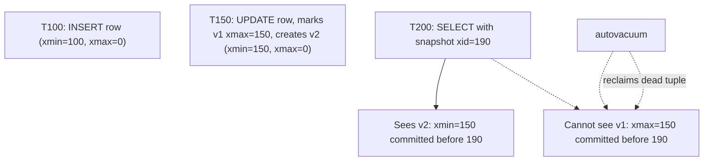
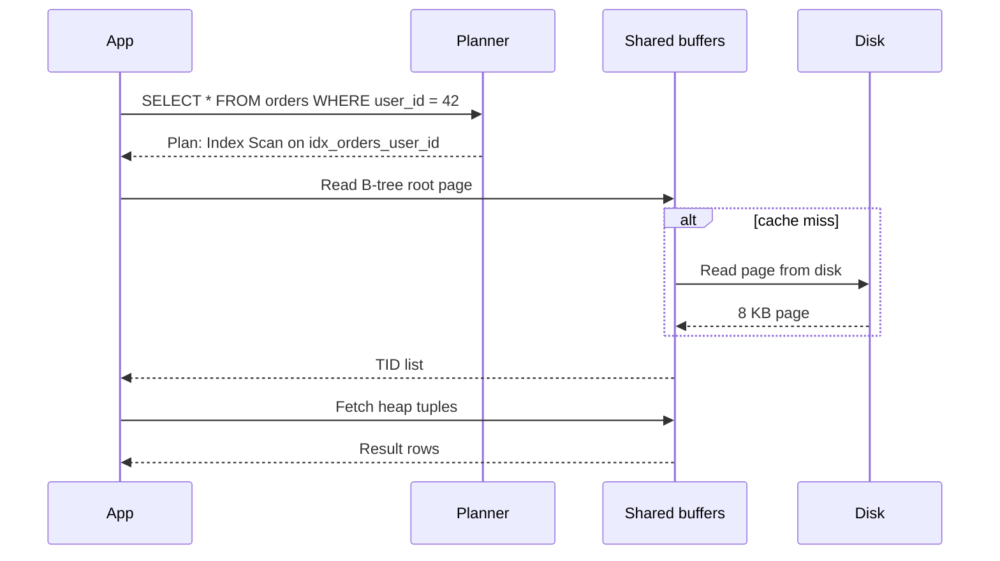
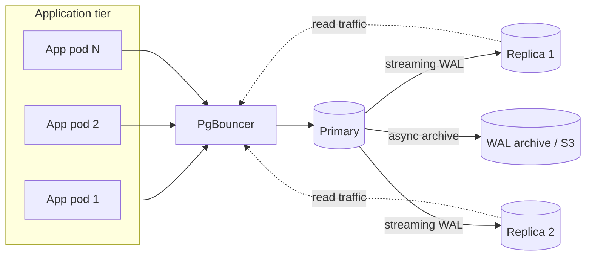
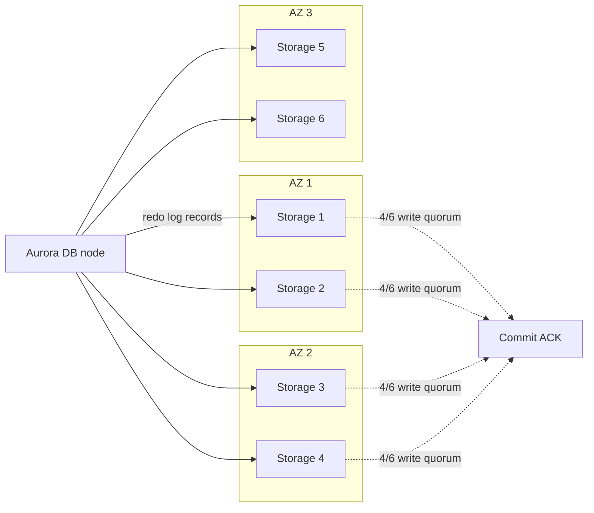

# SQL Databases: The Boring Technology That Wins

> **TL;DR**: "Choose boring technology," Dan McKinley wrote in 2015, and SQL databases are the boringest technology that still wins. PostgreSQL is the most-used database among professional developers (55.6% in the 2025 Stack Overflow survey[^1]), Aurora MySQL hit 200,000 writes/sec on a single instance[^2], and a GCP `c3-highmem-176` gives you 176 vCPUs with 1,408 GB RAM for under $9K/month[^3]. Vertical scaling goes further than you think. Shard only when you must. Master the boring parts first: indexes, connection pooling, VACUUM, and the query planner.

## Learning Objectives

After this module, you will be able to:

- [ ] Explain how B-trees and WAL give you durable, fast reads and writes
- [ ] Read an `EXPLAIN ANALYZE` plan and identify missing indexes or bad joins
- [ ] Choose an isolation level based on the anomalies your workload cannot tolerate
- [ ] Pick PostgreSQL vs MySQL vs a distributed SQL engine for a given workload
- [ ] Size a database and anticipate when vertical scaling will run out
- [ ] Design a connection-pooling strategy that prevents backend exhaustion

## Intuition

Think of a SQL database as a filing cabinet with cross-references and index tabs. Every drawer is labeled (tables), every folder has a tab (primary key), and you have built additional index tabs for the queries you run most (secondary indexes). A logbook on the desk records every change before you file it (the write-ahead log), so if the building burns down, you can replay the logbook and lose nothing.

The filing cabinet also practices double-entry bookkeeping: every transaction either completes fully or leaves no trace. Two clerks can read the same folder simultaneously because each gets a photocopy of the version that existed when they started (MVCC). But photocopies pile up, and someone must shred the old ones periodically (VACUUM).

This is the system that has powered banking, e-commerce, and SaaS for forty years. It is boring, it is correct, and it is almost certainly the right default for your next project.

## Theory

### Why SQL wins in 2026

PostgreSQL was the most-used, most-admired, and most-wanted database in the Stack Overflow 2025 Developer Survey for the third consecutive year, used by 55.6% of professional developers.[^1] DB-Engines ranked it second only to Snowflake for DBMS of the Year 2024.[^4] Werner Vogels called Aurora "the fastest-growing service in the history of AWS."[^5]

Why? Because SQL databases have compounded forty years of engineering into one binary. You get ACID transactions, a cost-based query optimizer, streaming replication, full-text search, geospatial queries, JSON storage, and an extension ecosystem. No other category of data store offers this breadth without bolting on three additional systems.

The "just use Postgres" meme is a market fact. Kelsey Hightower put it bluntly: "Use Postgres for everything." Gergely Orosz observed that most startups that reach Series B are still running on a single Postgres instance. The boring choice compounds.

### ACID internals

Every SQL database implements ACID through two mechanisms: a write-ahead log (WAL) and multi-version concurrency control (MVCC).

**WAL and durability.** Every change appends a redo record to the WAL and calls `fsync` before returning `COMMIT OK`.[^6] Data pages update lazily at checkpoints. Multiple transactions sharing the same fsync window get group commit, amortizing the ~1 ms flush cost across dozens of commits.[^7] Postgres WAL segments are 16 MB by default; InnoDB runs two logs (redo log for crash recovery, binlog for replication).[^8]

**MVCC implementations differ.** Postgres stores old row versions in-place in the heap. Each tuple carries `xmin` (creating transaction ID) and `xmax` (deleting/updating transaction ID). A visibility check per query decides which versions this snapshot can see.[^9][^10] Dead tuples accumulate until `VACUUM` reclaims them.[^11]

InnoDB keeps the current version in-place and pushes old versions to the undo log. Consistent reads walk the undo chain backward to reconstruct the snapshot.[^12] This means updates are cheaper (no secondary index updates for unchanged columns), but long-running transactions balloon the undo tablespace.

**Isolation levels.** Postgres implements three real levels:[^13]

| Level | Anomalies prevented | Mechanism |
|-------|--------------------:|-----------|
| Read Committed (default) | Dirty reads | Fresh snapshot per statement |
| Repeatable Read (= Snapshot Isolation) | + non-repeatable reads, phantoms | Single snapshot for entire transaction |
| Serializable (= SSI) | + write skew | Runtime cycle detection, aborts with SQLSTATE 40001 |

In 2020, Jepsen found that Postgres 12.3 Serializable allowed G2-item anomalies, a bug present since SSI shipped in 9.1, nine years earlier.[^14] The lesson: pick a level, trust the engine, but test your invariants.



*Every heap tuple carries xmin/xmax; a snapshot decides visibility, and VACUUM later reclaims invisible versions.*

### Indexes

An index is an auxiliary data structure that converts O(n) scans into O(log n) lookups. Postgres ships six built-in types plus the `bloom` extension:[^15]

- **B-tree** (default): equality and range on scalars, supports `ORDER BY`. The workhorse.
- **Hash**: equality only. Rarely better than B-tree since Postgres 10 made hash indexes WAL-logged.
- **GIN** (generalized inverted index): one entry per element. Used for arrays, `tsvector` full-text, and `jsonb`. Fast reads, slow writes.
- **GiST** (generalized search tree): spatial (PostGIS), trigram similarity, range types. Good for nearest-neighbor.
- **SP-GiST** (space-partitioned GiST): non-balanced structures like quadtrees, k-d trees, and radix trees; useful for point data and prefix search.
- **BRIN** (block range index): stores min/max per range of heap pages. Tiny on disk, effective only when physical order correlates with indexed order (append-only time-series).
- **Bloom** (extension): multi-column bloom filter for equality across any subset of low-cardinality columns.

**Composite indexes** obey the leftmost-prefix rule: an index on `(a, b, c)` serves `WHERE a = ?` and `WHERE a = ? AND b = ?`, but not `WHERE b = ?` alone.[^16]

**Covering indexes** (`CREATE INDEX ... INCLUDE (col)`) add payload columns so queries resolve from the index alone (index-only scan) without a heap fetch.[^17] Instagram used partial and functional indexes to index only high-value rows and key prefixes, cutting index size by up to 10x.[^18]

**The cost.** Every index is a write tax. Three to six indexes per hot OLTP table is typical; past that, writes suffer measurably.[^19] A table with 12 indexes writes 13 physical records per INSERT (one heap tuple plus 12 index entries), each WAL-logged.

### The query optimizer

The planner assigns each candidate plan a cost in abstract units (`seq_page_cost = 1.0`, `random_page_cost = 4.0`, `cpu_tuple_cost = 0.01`) and picks the cheapest.[^20] It chooses among three join algorithms:

- **Nested-loop**: scan outer, probe inner. Cheap when outer is small and inner has an index.
- **Hash join**: build hash table on smaller side, probe with larger. Best for large equality joins.
- **Merge join**: both sides pre-sorted, walk in lockstep. Often fed by index scans.



*A typical index scan: B-tree descent through the buffer cache, then heap tuple fetch (unless the index is covering).*

**Common traps:**

- Stale statistics cause the planner to mis-estimate selectivity. Run `ANALYZE` after bulk loads.[^20]
- `random_page_cost = 4.0` is a legacy HDD assumption. Lower it on SSDs.
- Parameter sniffing: the first bind values bake into the prepared plan. Skewed distributions produce pathological plans for later calls.[^20]
- `pg_stat_statements` is the first thing to enable in production. It aggregates normalized SQL by total time, calls, and mean execution time.[^21]

### Replication

**Postgres streaming replication** ships WAL to standbys over a persistent connection. Async by default (tens to hundreds of milliseconds lag); synchronous when `synchronous_standby_names` is set (commits block until at least one standby durably has the WAL).[^22] Logical replication decodes WAL into row-level change events, the basis for Debezium CDC.[^23]

**MySQL** defaults to async (replicas pull binlog events). Semi-sync guarantees at least one replica has the event before the primary acknowledges. Group Replication runs an internal Paxos variant for virtually synchronous certification-based replication across up to nine members.[^24]

**Aurora** rewrites the replication layer entirely. Writes are redo-log records sent to a multi-tenant storage fleet: six copies across three AZs, writes succeed on a 4/6 quorum, reads on 3/6.[^26] The SIGMOD 2017 paper reports up to 5x throughput over stock MySQL.[^25] Failover completes in under a minute because replicas share storage.



*The canonical Postgres deployment: PgBouncer absorbs connection storms, replicas scale reads, WAL archiving gives point-in-time recovery.*

### Postgres superpowers

Features that let teams replace three other systems with just Postgres:

- **JSONB** with GIN indexes: schema-flexible document storage within an ACID database.
- **Full-text search**: `tsvector` + GIN index + `ts_rank_cd`. Good enough for most apps that would otherwise reach for Elasticsearch.
- **PostGIS**: geospatial types, R-tree via GiST, the reference open-source GIS database.
- **Logical decoding**: WAL-to-events stream, basis for CDC pipelines.
- **Extensions**: TimescaleDB (time-series), `pgvector` (HNSW vector search), foreign data wrappers.

### Scaling limits

Vertical scaling goes further than engineers expect. A GCP `c3-highmem-176` is 176 vCPUs and 1,408 GB RAM.[^3] Aurora MySQL hit 200,000 writes/sec on a single r4 instance.[^2] Most OLTP workloads that people shard were never forced to.

**Connection pooling is mandatory.** Every Postgres connection forks a backend process that typically uses 5 to 10 MB of RAM under active workload. The default `max_connections` is 100.[^27] At 500 connections you burn several GB on connection overhead alone. PgBouncer (2 kB per client) transaction-pools thousands of app connections onto tens of server connections.[^28]

**When to leave SQL:**

- Truly key-value workloads at millions of ops/sec (use Redis or DynamoDB)
- Massive write-heavy time-series with eventual consistency tolerance (use ClickHouse or TimescaleDB)
- Feed fanout at Instagram scale (Cassandra for the fan-out layer, Postgres for canonical data)
- Global strong consistency without operational sharding (CockroachDB or Spanner, but pay the consensus RTT on every write[^29])



*Aurora ships redo log records (not pages) to six storage nodes across three AZs; a 4/6 write quorum means no single AZ failure blocks commits.*

## Real-World Example

**Figma: from one Postgres instance to horizontal sharding in three years.**

In 2020, Figma ran on a single RDS Postgres instance hitting 65% CPU at peak. Their database fleet grew approximately 100x from 2020 to 2024.[^31]

**Phase 1: Vertical partitioning (2020 to 2022).** Groups of related tables ("Figma files," "Organizations") moved onto dedicated physical databases, each fronted by PgBouncer. By end of 2022, Figma had a dozen vertically partitioned Postgres databases. Some tables had billions of rows and several terabytes, approaching the Aurora/RDS IOPS ceiling.[^30]

**Phase 2: Horizontal sharding (2023 to 2024).** Figma built DBProxy, a Go service that sits between the application and PgBouncer. DBProxy parses SQL into an AST, extracts the shard key (UserID, FileID, OrgID), and routes single-shard queries directly while scatter-gathering cross-shard ones.[^31] They used hash-based routing to avoid hotspots from auto-incrementing IDs.

The key innovation was "logical sharding" via Postgres views:

```sql
CREATE VIEW table_shard1 AS
SELECT * FROM table
WHERE hash(shard_key) >= min_range
  AND hash(shard_key) <  max_range;
```

This let them test shard routing with a config-flag rollback (seconds) before committing to the riskier physical split. The first horizontally sharded table went live in September 2023 with approximately 10 seconds of partial primary-availability impact and zero replica impact.[^31]

**Why they stayed on Postgres:** Figma evaluated CockroachDB, TiDB, Spanner, and Vitess. They chose to build DBProxy because months of vertical runway remained, and rebuilding domain expertise on a new engine was riskier than building a routing layer on top of the system they already understood.[^31]

## Trade-offs

| Approach | Pros | Cons | Best when | Our Pick |
|----------|------|------|-----------|----------|
| PostgreSQL | Rich features (GIN, JSONB, PostGIS, extensions), strict MVCC, strong optimizer | VACUUM complexity, process-per-connection | Default for new systems | **Yes, unless you have a specific reason not to** |
| MySQL / InnoDB | Ubiquitous, Aurora + Vitess + ProxySQL, lighter per-connection cost | Weaker defaults (RR gap locks), fewer data types | Existing estates, high-write OLTP, Rails at scale | When your team already knows it |
| Amazon Aurora | Decoupled storage, fast failover, up to 5x MySQL throughput[^25] | AWS lock-in, higher per-GB cost, commit latency floor from quorum | You are on AWS and need managed scale | When operational simplicity outweighs cost |
| CockroachDB / Spanner | Horizontal SQL, strong consistency across regions | Per-write consensus RTT that single-region Postgres does not pay[^32] | Global transactions where sharding ops cost > latency cost | Only when you truly need multi-region writes |

## Common Pitfalls

> [!WARNING]
> **Missing FK indexes.** Postgres does not auto-create indexes on foreign keys. Deleting a parent row triggers a sequential scan of the child table to check referential integrity. For every FK, run `CREATE INDEX CONCURRENTLY ON child (fk_col)`.[^16]

> [!WARNING]
> **N+1 queries.** Your ORM fetches 100 users, then runs one query per user for their posts. That is 101 round trips. Use `JOIN`, `IN (...)`, or DataLoader-style batching. Detect with `pg_stat_statements` showing many near-identical queries in bursts.

> [!WARNING]
> **Stale statistics.** The planner is only as good as its stats. After bulk loads or large deletes, run `ANALYZE` on affected tables. A cardinality mis-estimate of 10x can flip a plan from index scan to sequential scan, turning a 1 ms query into a 500 ms one.[^20]

> [!WARNING]
> **Parameter sniffing.** The first bind values seen bake into the prepared plan. If your data is skewed (one user has 10M rows, most have 100), the cached plan is pathological for one group. Fix with `plan_cache_mode = 'force_custom_plan'` for hot queries.[^20]

> [!WARNING]
> **Unbounded connections.** At 500 direct Postgres connections, you can burn several GB of RAM on backend processes alone. Always use PgBouncer in transaction-pooling mode. Set `idle_in_transaction_session_timeout` to kill stray sessions.[^27][^28]

> [!WARNING]
> **Forgetting VACUUM.** Dead tuples accumulate from every UPDATE and DELETE. If autovacuum falls behind (long-running transactions pin the xmin horizon), tables bloat and you risk transaction-ID wraparound at 2 billion XIDs, where Postgres refuses all writes to protect data integrity. Notion's 2021 sharding was triggered precisely by this.[^33][^11]

## Exercise

You run a SaaS CRM on a single Postgres `db.r6i.4xlarge`. The `orders` table has 100M rows. Nightly analytics reports lock key tables, and p99 write latency has crept from 5 ms to 80 ms. Design a diagnosis and remediation plan covering indexes, partitioning, read replicas, connection pooling, and when to consider sharding.

<details>
<summary>Hint</summary>

Start with `pg_stat_statements` to find the top queries by total time. Check `pg_stat_user_tables` for tables with high `n_dead_tup` (VACUUM falling behind). Look at `pg_stat_activity` for long-running transactions from the analytics workload that might be pinning the xmin horizon.

</details>

<details>
<summary>Solution</summary>

**Step 1: Diagnose.**

```sql
-- Top queries by total time
SELECT query, calls, mean_exec_time, total_exec_time
FROM pg_stat_statements ORDER BY total_exec_time DESC LIMIT 10;

-- Tables with VACUUM debt
SELECT relname, n_dead_tup, last_autovacuum
FROM pg_stat_user_tables WHERE n_dead_tup > 100000;

-- Long-running transactions (the analytics culprit)
SELECT pid, state, age(clock_timestamp(), xact_start) AS duration, query
FROM pg_stat_activity WHERE state != 'idle' ORDER BY duration DESC;
```

**Step 2: Quick wins.**

- Add a composite index for the hot customer-lookup pattern: `CREATE INDEX CONCURRENTLY idx_orders_customer_date ON orders (customer_id, created_at DESC);`
- Add a covering index if the hot query only needs a few columns: `CREATE INDEX ... INCLUDE (status, total_cents);`
- Deploy PgBouncer in transaction-pooling mode if not already present. Cap server connections at 50 to 80.
- Set `idle_in_transaction_session_timeout = '30s'` to kill stray analytics sessions.

**Step 3: Isolate analytics.**

- Route nightly reports to a dedicated read replica. This removes the long-running snapshot from the primary, letting VACUUM reclaim dead tuples.
- If reports need fresher data than async replication provides, use logical replication to a dedicated analytics instance.

**Step 4: Partition if needed.**

- If `orders` is append-mostly and queries filter by date, use declarative range partitioning (`PARTITION BY RANGE (created_at)`) with monthly partitions. This lets VACUUM run per-partition and enables partition pruning.

**Step 5: When to shard.**

- If after all the above, write throughput still saturates the primary (sustained >50K TPS on the largest available instance), consider application-level sharding by `customer_id`. Follow Figma's playbook: logical sharding via views first, physical split second.
- If you need global strong consistency without operational sharding, evaluate CockroachDB, but accept the consensus-RTT write penalty.

**Trade-off accepted:** This plan prioritizes operational simplicity. Each step is reversible. Sharding is the last resort because it is a 9 to 18 month project that breaks cross-shard joins and transactions.

</details>

## Key Takeaways

- PostgreSQL or MySQL solves 99% of production OLTP problems. Pick one and get deep.
- Every index speeds one query shape and slows every write. Three to six per hot table is the sweet spot.
- Vertical scaling on a single primary goes further than engineers expect: 176 vCPUs, 1.4 TB RAM, 200K writes/sec on Aurora.
- Connection pooling (PgBouncer in transaction mode) is mandatory. The default 100 connections is not enough.
- VACUUM is not optional. Long-running transactions are the enemy of a healthy Postgres.
- Isolation levels are a contract with your code. Use Read Committed for most workloads, Serializable for money.
- Shard only when you must. Notion ran four orders of magnitude of growth on one instance before sharding.

## Further Reading

- [PostgreSQL Documentation (current)](https://www.postgresql.org/docs/current/) - the reference for every claim in this chapter; start with chapters 11 (Indexes), 13 (Concurrency), and 30 (WAL).
- [Use The Index, Luke!](https://use-the-index-luke.com/) by Markus Winand - the canonical database-independent introduction to SQL indexing; the "Concatenated Indexes" chapter explains composite index column order better than any other source.
- [Amazon Aurora SIGMOD 2017 paper](https://www.amazon.science/publications/amazon-aurora-design-considerations-for-high-throughput-cloud-native-relational-databases) - the redo-only-to-storage model explained by its designers; essential reading for understanding decoupled storage.
- [Jepsen: PostgreSQL 12.3 (Kingsbury, 2020)](https://jepsen.io/analyses/postgresql-12.3) - the nine-year-old SSI bug story; a reminder that "Serializable" is a claim to verify, not a guarantee to trust blindly.
- [Notion: Sharding Postgres at Notion (2021)](https://www.notion.com/blog/sharding-postgres-at-notion) - the canonical app-level sharding case study: 480 logical shards, VACUUM as the forcing function, and why 480 has many factors.
- [Figma: How Figma's databases team lived to tell the scale (2024)](https://www.figma.com/blog/how-figmas-databases-team-lived-to-tell-the-scale/) - DBProxy, logical vs physical sharding, and the decision to stay on Postgres rather than migrate to distributed SQL.
- [GitHub: Partitioning GitHub's relational databases (2021)](https://github.blog/engineering/infrastructure/partitioning-githubs-relational-databases-scale/) - schema domains, ProxySQL, Vitess, and how to split 950K QPS across 50+ clusters.
- [Designing Data-Intensive Applications, Ch. 3, 7, 8](https://dataintensive.net/) - Kleppmann's treatment of storage engines, transactions, and distributed trouble; the textbook companion to this chapter.

## Flashcards

**Q:** What is the default isolation level in Postgres, and what anomalies does it permit?
**A:** Read Committed. It permits non-repeatable reads, phantoms, and write skew. Each statement sees a fresh snapshot, but two statements in the same transaction can see different data.

**Q:** How does Postgres MVCC differ from InnoDB MVCC?
**A:** Postgres stores old versions in-place in the heap (requiring VACUUM to reclaim). InnoDB keeps the latest version in-place and pushes old versions to the undo log (requiring undo purge). Postgres pays bloat risk; InnoDB pays undo-chain traversal cost for consistent reads.

**Q:** What is the leftmost-prefix rule for composite indexes?
**A:** An index on (a, b, c) can serve queries filtering on a, or a+b, or a+b+c, but not b alone or c alone. The index is sorted by the first column first.

**Q:** Why is connection pooling mandatory for production Postgres?
**A:** Postgres forks one backend process per connection, costing 5 to 10 MB each. The default max_connections is 100. PgBouncer in transaction mode lets thousands of app connections share tens of real backends at 2 KB per client.

**Q:** What triggered Notion's 2021 Postgres sharding?
**A:** VACUUM stalls caused by long-running transactions threatened transaction-ID wraparound at the 2-billion XID boundary. Postgres would have refused all writes to protect data integrity.

**Q:** What does Aurora do differently from stock MySQL/Postgres replication?
**A:** Aurora ships redo log records (not data pages) to a shared storage fleet of six nodes across three AZs. Writes succeed on a 4/6 quorum. Replicas share storage, so failover needs no data copy and completes in under a minute.

**Q:** When should you choose CockroachDB or Spanner over Postgres?
**A:** When you need strong consistency across multiple geographic regions without operational sharding. The trade-off is consensus RTT on every write, which puts a floor on commit latency.

**Q:** What is write skew and which isolation level prevents it?
**A:** Two transactions each read a condition, each write based on it, both commit, and the combined result violates an invariant neither individually broke. Only Serializable (SSI in Postgres) prevents it.

**Q:** What does `pg_stat_statements` show you?
**A:** Normalized SQL statements aggregated by total execution time, call count, mean time, and rows returned. It is the first extension to enable in production for identifying slow queries.

**Q:** Why did Figma choose to build DBProxy rather than migrate to CockroachDB?
**A:** They had months of vertical runway remaining, and rebuilding domain expertise on a new engine was riskier than building a routing layer on top of the Postgres they already understood. They valued rollback safety (config-flag revert in seconds) over distributed-SQL features.

**Q:** What is a covering index and when should you use one?
**A:** A covering index includes all columns a query needs via `INCLUDE (col)`, enabling an index-only scan that skips the heap entirely. Use it when EXPLAIN shows heap fetches on a hot, read-heavy query.

**Q:** How does Aurora achieve up to 5x MySQL throughput?
**A:** By shipping only redo log records to storage (not full pages), eliminating the checkpoint and double-write buffer overhead. The storage fleet applies logs and materializes pages independently.

**Q:** What is the practical vertical ceiling for a single Postgres instance in 2026?
**A:** GCP c3-highmem-176 offers 176 vCPUs and 1,408 GB RAM. Aurora MySQL demonstrated 200,000 writes/sec on a single r4 instance. Most OLTP workloads never need to exceed this.

**Q:** What are the three join algorithms a SQL planner chooses from?
**A:** Nested-loop (probe inner per outer row, best with small outer + indexed inner), hash join (build hash table on smaller side, best for large equality joins), and merge join (both sides pre-sorted, walk in lockstep).

**Q:** What happens if VACUUM cannot keep up with dead tuple production?
**A:** Tables and indexes bloat (wasting disk and slowing scans), and transaction-ID consumption approaches the 2-billion XID wraparound boundary. At that point Postgres enters "emergency autovacuum" mode and eventually refuses all writes to prevent data corruption.

## References

[^1]: Stack Overflow 2025 Developer Survey, "Databases" (PostgreSQL 55.6% among professional developers, third consecutive year at #1). https://survey.stackoverflow.co/2025/technology/#most-popular-technologies-database
[^2]: AWS News, "Amazon Aurora (MySQL) Doubles Maximum Write Throughput with Support for R4 Instances" (200K writes/sec). https://aws.amazon.com/about-aws/whats-new/2017/10/amazon-aurora-mysql-doubles-maxiumum-write-throughput-with-support-for-r4-instances/
[^3]: Cloudprice/Vantage instance specs for GCP c3-highmem-176 (176 vCPU, 1,408 GB RAM). https://instances.vantage.sh/gcp/c3-highmem-176
[^4]: DB-Engines, "Snowflake is the Database Management System of the Year 2024". https://db-engines.com/en/blog_post/109
[^5]: Werner Vogels, "Weekend Reading: Amazon Aurora", All Things Distributed, 2017. https://www.allthingsdistributed.com/2017/05/amazon-aurora-design-considerations.html
[^6]: PostgreSQL Documentation, "Write-Ahead Logging (WAL)". https://www.postgresql.org/docs/current/wal-intro.html
[^7]: PostgreSQL Documentation, "WAL Internals". https://www.postgresql.org/docs/current/wal-internals.html
[^8]: MySQL 8.0 Reference Manual, "The InnoDB Storage Engine". https://dev.mysql.com/doc/refman/8.0/en/innodb-storage-engine.html
[^9]: "PostgreSQL MVCC, byte by byte" (boringsql). https://boringsql.com/posts/postgresql-mvcc-byte-by-byte/
[^10]: PostgreSQL Wiki, "Hint Bits". https://wiki.postgresql.org/wiki/Hint_Bits
[^11]: Google Cloud, "Deep dive into PostgreSQL VACUUM garbage collector", 2023. https://cloud.google.com/blog/products/databases/deep-dive-into-postgresql-vacuum-garbage-collector
[^12]: MySQL 8.0 Reference Manual, "InnoDB Multi-Versioning". https://dev.mysql.com/doc/refman/8.0/en/innodb-multi-versioning.html
[^13]: PostgreSQL Documentation, "13.2. Transaction Isolation". https://www.postgresql.org/docs/current/transaction-iso.html
[^14]: Kyle Kingsbury (Jepsen), "PostgreSQL 12.3", 2020. https://jepsen.io/analyses/postgresql-12.3
[^15]: PostgreSQL Documentation, "Index Types". https://www.postgresql.org/docs/current/indexes-types.html
[^16]: PostgreSQL Documentation, "Multicolumn Indexes". https://www.postgresql.org/docs/current/indexes-multicolumn.html
[^17]: PostgreSQL Documentation, "Index-Only Scans and Covering Indexes". https://www.postgresql.org/docs/current/indexes-index-only-scans.html
[^18]: Instagram Engineering, "Handling Growth with Postgres: 5 Tips From Instagram", 2013. https://instagram-engineering.com/handling-growth-with-postgres-5-tips-from-instagram-d5d7e7ffdfcb
[^19]: Postgres.ai, "Over-indexing" (on HOT updates and write amplification). https://postgres.ai/docs/postgres-howtos/performance-optimization/indexing/over-indexing
[^20]: PostgreSQL Documentation, "Using EXPLAIN" and "Query Planning". https://www.postgresql.org/docs/current/using-explain.html
[^21]: PostgreSQL Documentation, "pg_stat_statements". https://www.postgresql.org/docs/current/pgstatstatements.html
[^22]: PostgreSQL Documentation, "High Availability, Load Balancing, and Replication". https://www.postgresql.org/docs/current/high-availability.html
[^23]: Debezium Documentation, "Debezium connector for PostgreSQL". https://debezium.io/documentation/reference/stable/connectors/postgresql.html
[^24]: MySQL 8.0 Reference Manual, "Semisynchronous Replication" and "Group Replication". https://dev.mysql.com/doc/refman/8.0/en/replication-semisync.html
[^25]: AWS, "Amazon Aurora Features - Performance" (5x MySQL, 3x Postgres SysBench claim). https://aws.amazon.com/rds/aurora/features/
[^26]: Verbitski et al., "Amazon Aurora: Design Considerations for High Throughput Cloud-Native Relational Databases", SIGMOD 2017. https://www.amazon.science/publications/amazon-aurora-design-considerations-for-high-throughput-cloud-native-relational-databases
[^27]: PlanetScale, "Scaling Postgres connections with PgBouncer". https://planetscale.com/blog/scaling-postgres-connections-with-pgbouncer
[^28]: PgBouncer Documentation, "Features" (2 kB per connection by default). https://www.pgbouncer.org/features.html
[^29]: CockroachDB Docs, "Multi-Region Overview and Topology Patterns". https://www.cockroachlabs.com/docs/stable/topology-development
[^30]: Figma Blog, "The growing pains of database architecture", 2023. https://www.figma.com/blog/how-figma-scaled-to-multiple-databases/
[^31]: Figma Blog, "How Figma's databases team lived to tell the scale", 2024. https://www.figma.com/blog/how-figmas-databases-team-lived-to-tell-the-scale/
[^32]: CockroachDB blog, "CockroachDB Resilience Enhanced in 25.2" (single-region 9-node benchmarks ~63K tpmC). https://cockroachlabs.com/blog/cockroachdbs-resilience-25-2
[^33]: Notion, "Herding elephants: Lessons learned from sharding Postgres at Notion", 2021. https://www.notion.com/blog/sharding-postgres-at-notion

