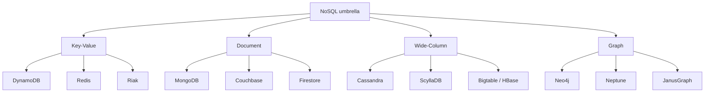
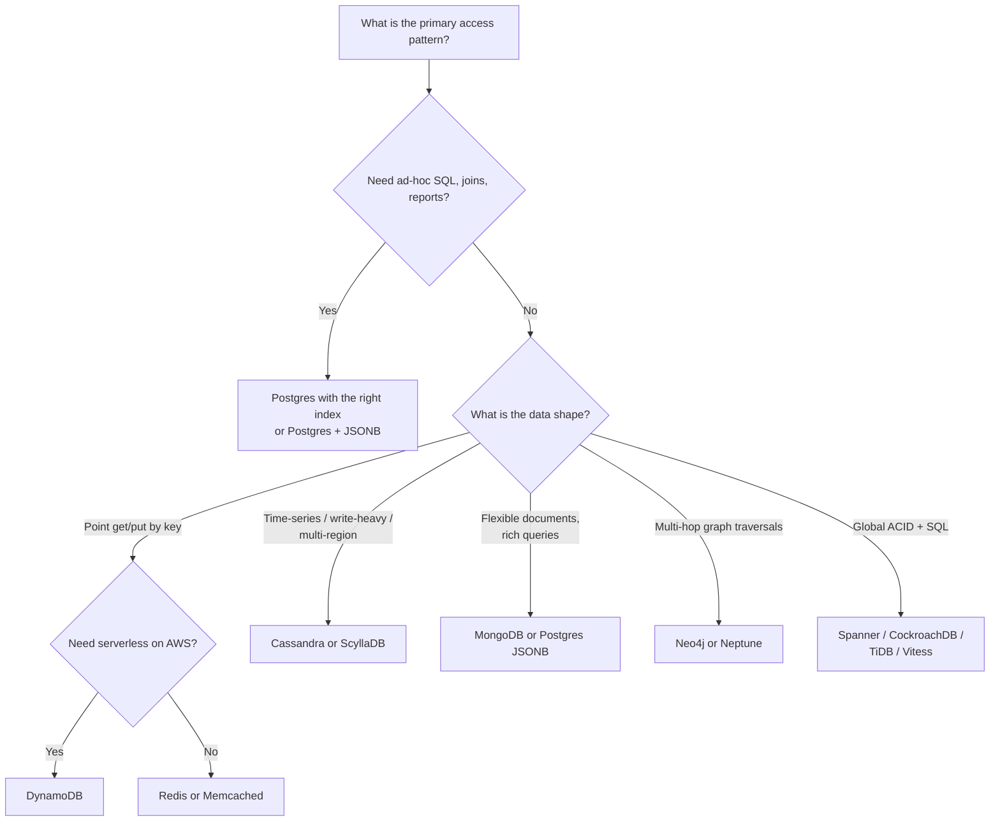
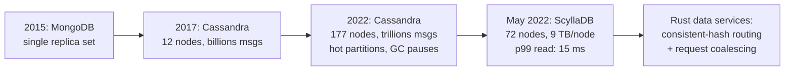
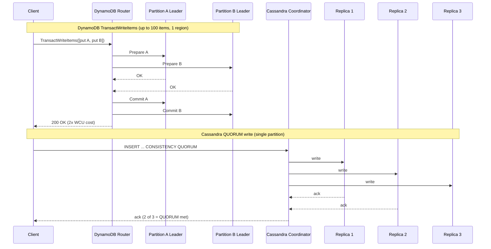

# NoSQL Databases: Picking the Right Non-Relational Tool

> **TL;DR**: Default to Postgres. Reach for NoSQL only when you can state the specific access pattern or scale wall that forces it. DynamoDB peaked at 151 million requests per second during Prime Day 2025[^1], and Discord cut read p99 from 125 ms to 15 ms by migrating from Cassandra to ScyllaDB[^2]. These are real wins, but they required years of operational investment in query-first data modeling, tunable consistency, and denormalization. If you cannot articulate which Postgres limit you are hitting in a number, a NoSQL migration will move the problem, not solve it.

## Learning Objectives

After this module, you will be able to:

- [ ] Classify a NoSQL product into key-value, document, wide-column, or graph
- [ ] Pick the right family given access patterns, scale, and consistency needs
- [ ] Model data for DynamoDB single-table design and Cassandra query-first schemas
- [ ] Recognize when "we need NoSQL" is actually "we need an index"
- [ ] Reason about consistency guarantees (eventual, tunable, strong) per product

## Intuition

Imagine you run a massive warehouse. A SQL database is a cross-referenced library: every book has a catalog card, and you can find any book by author, title, subject, or publication year because the catalog links everything together. Powerful, but the catalog itself becomes a bottleneck when millions of people search simultaneously.

NoSQL databases are specialized storage rooms. One room has numbered lockers (key-value): hand over the number, get the contents instantly, no browsing allowed. Another room stores filing cabinets where each drawer holds a complete folder of related documents (document store): you can search inside folders, but cross-referencing between cabinets is your problem. A third room has enormous shelves sorted by date (wide-column): perfect for grabbing "everything from last Tuesday," terrible for ad-hoc questions. The last room is a corkboard with pins and strings connecting them (graph): follow any thread to find connections, but counting all the pins is slow.

Each room trades the library's universal flexibility for speed at one specific task. The engineering question is never "which room is best?" but "which room matches the way my application actually retrieves data?" Most applications retrieve data in ways the library handles fine. You only move to a specialized room when the library's catalog is provably the bottleneck.

## Theory

### What NoSQL means (the four families)

"NoSQL" is a marketing umbrella, not a technical category. It covers four product families that each rejected a different part of the relational contract.[^3][^4][^5] The three foundational papers, Bigtable (OSDI 2006), Dynamo (SOSP 2007), and Cassandra (LADIS 2009), all emerged within three years as reactions to the same pain: relational replication, schema changes, and joins did not scale horizontally on commodity hardware at Google, Amazon, and Facebook.[^6][^4][^5]



*The four NoSQL families share a rejection of the relational model but differ fundamentally in data structure, access path, and trade-offs.*

### Key-value stores

A key-value store is a hash map: opaque key to opaque value, O(1) point lookup. DynamoDB adds a sort key and optional secondary indexes on top. Redis adds typed value structures (lists, sorted sets, streams) and single-threaded command execution that gives atomic operations for free.[^4][^1][^7]

Redis benchmarks show ~180,000 ops/sec for SET without pipelining and ~1,536,000 ops/sec with pipelining (16 commands batched per round trip).[^7] That ~8.5x gap is the single most important Redis performance fact: throughput is RTT-bound unless you batch.

DynamoDB is the serverless extreme. You provision read/write capacity units or pay on-demand; there is no cluster to operate. During Prime Day 2025, DynamoDB sustained 151 million requests per second with single-digit millisecond p99.[^1][^8]

**When to use:** Session stores, shopping carts, feature flags, caches, leaderboards. Any workload where you always know the key at query time.

### Document stores

A document store holds self-describing JSON (or BSON) documents identified by `_id`, with indexes on arbitrary fields. MongoDB uses WiredTiger (which defaults to B-tree storage) underneath; Firestore is layered on Spanner.[^9][^10]

The promise is "no schema migrations during rapid iteration." The reality is that the schema still exists, it just lives in your application code. After a few releases, a collection holds four implicit schema versions, and new code crashes on missing fields. MongoDB's own documentation prescribes explicit `schema_version` fields and `$jsonSchema` validation.[^9][^11]

MongoDB added multi-document ACID transactions in 4.0 (2018). However, Jepsen's 2020 analysis of MongoDB 4.2.6 found that at the strongest settings (`readConcern: snapshot` plus `writeConcern: majority`), the database still exhibited read skew and cyclic information flow.[^12] More concerning: 99.6% of MongoDB Atlas users use the default `readConcern`, which returns uncommitted data that can be silently rolled back on failover.[^12]

**When to use:** Content catalogs, product listings, user profiles with variable schemas, early-stage products where iteration speed matters more than reporting.

### Column-family stores

A row is identified by a partition key plus clustering columns. Rows within a partition are stored together and sorted by the clustering key. The engine is an LSM-tree: writes append to a commit log plus memtable and flush to immutable SSTables that are compacted later.[^3][^5][^13]

The critical modeling discipline is **query-first schemas**: you design one table per read pattern. For a chat app fetching recent messages by channel:

```cql
CREATE TABLE messages (
    channel_id  bigint,
    bucket      int,
    message_id  bigint,
    author_id   bigint,
    content     text,
    PRIMARY KEY ((channel_id, bucket), message_id)
) WITH CLUSTERING ORDER BY (message_id DESC);
```

The composite partition key `(channel_id, bucket)` forces all rows for a channel-bucket pair onto the same replica set. The clustering column `message_id DESC` keeps them sorted newest-first on disk. A `SELECT ... LIMIT 50` is a prefix scan of one partition, not a merge across the cluster.[^2][^14]

Cassandra's tunable consistency lets each query name a level: `ONE`, `QUORUM`, `ALL`. A write at `QUORUM` plus a read at `QUORUM` with R + W > N gives read-your-write consistency within a partition.[^15][^13]

**When to use:** Time-series data, write-heavy workloads, multi-region deployments, messaging at Discord/Netflix scale.

### Graph databases

Nodes and typed edges with property maps, stored so each node keeps direct pointers to its edges (index-free adjacency). A traversal of k hops costs O(d^k) with a small constant, not a join-per-hop cost. Neo4j beats relational engines on multi-hop queries and loses to them on bulk aggregate scans.[^16][^17]

Meta's TAO serves over a billion reads and millions of writes per second against many petabytes of social graph data, with a high cache hit rate on the follower tier.[^18][^19] TAO keeps MySQL as the source of truth and puts a graph-aware cache on top, because Facebook found that lookaside memcache did not give the right semantics for graph workloads.

**When to use:** Social graphs, fraud detection, knowledge graphs, recommendation path queries. Not for general OLTP.

### NewSQL hybrids

NewSQL systems expose SQL and ACID but shard and replicate like NoSQL. They are not a fifth NoSQL family; they exist for teams that want NoSQL's scale with SQL's correctness.

- **Google Spanner**: globally distributed, synchronously replicated via Paxos, externally consistent via TrueTime. Won the 2025 ACM SIGMOD Systems Award.[^20][^21]
- **CockroachDB**: Raft-replicated ranges (512 MiB default max, 128 MiB default min per zone config), SQL on top, serializable isolation via HLC. Runs Jepsen nightly; in two years of nightly tests, the suite found one real inconsistency bug.[^22][^23][^24][^25]
- **TiDB**: stateless SQL servers speaking MySQL protocol over TiKV (Raft-replicated RocksDB). HTAP via TiFlash columnar replica.[^26][^27]
- **Vitess**: MySQL sharding middleware (not distributed SQL). Powers YouTube, Slack, Shopify, GitHub.[^28][^29]

The honest trade-off: Dan McKinley's "innovation tokens" argument cuts hardest here. Distributed SQL is a decade-plus-old category with smaller community scar tissue than Postgres or MySQL.[^30]

### When to pick NoSQL (and when NOT to)

Dan McKinley's "Choose Boring Technology" (2015) argues every team has about three innovation tokens to spend on unfamiliar technology.[^30] If you spend one on a new language, one on a new queue, and one on a new database, you have zero left for the actual product.

The heuristic: **state the scale wall in numbers before migrating.** If you cannot articulate which specific number on Postgres is failing, a NoSQL migration will not help.[^31][^30]

Common "we need NoSQL" situations that are actually "we need an index":

- A 500 ms table scan fixed by a B-tree or partial index
- A "flexible schema" need covered by Postgres JSONB with GIN indexes[^32]
- A "scale" need that disappears with connection pooling and read replicas

Instagram scaled on sharded Postgres with aggressive partial indexes. Migrations from MongoDB back to Postgres are common and rarely reversed; teams cite reporting pain, cross-entity queries, and schema drift as triggers.[^33][^34][^35]



*Most teams asking "which NoSQL?" end on the Postgres branch. The other branches require a stateable scale or access-pattern reason.*

## Real-World Example

**Discord: from MongoDB to Cassandra to ScyllaDB (2015 to 2023).**

Discord started on MongoDB in 2015, migrated to Cassandra in 2017 with 12 nodes and billions of messages, and by early 2022 ran 177 Cassandra nodes storing trillions of messages.[^2]

The Cassandra pain points were specific and measurable:

- **Hot partitions.** A celebrity channel would blow past per-replica concurrency and drag down cluster tail latency.
- **Compaction debt.** The team spent on-call time "gossip dancing" nodes out of rotation to catch up on LSM compactions.
- **JVM garbage collection.** GC pauses caused latency spikes requiring manual node reboots.

Read p99 ranged from 40 to 125 ms; write p99 from 5 to 70 ms.[^2]

In May 2022, Discord migrated to 72 ScyllaDB nodes (same CQL wire protocol, C++ implementation, shard-per-core via Seastar). The data model stayed identical: partition by `(channel_id, bucket)`, cluster by `message_id DESC`. A custom Rust migrator moved data at a peak of 3.2 million messages per second over 9 days.[^2]

Results: read p99 dropped to 15 ms, write p99 to 5 ms. Node count fell from 177 to 72 while disk per node grew from ~4 TB to 9 TB.[^2][^36]

The architectural key was not just the database swap. Discord built Rust "data services" with consistent-hash routing on `channel_id`. Each service instance holds an in-process request-coalescing layer that deduplicates concurrent reads of the same row into a single database query.[^2]



*Discord's data model stayed the same across three database engines; the scaling wall moved each time, and the fix was always operational, not schema-level.*

## Trade-offs

| Approach | Pros | Cons | Best when | Our Pick |
|----------|------|------|-----------|----------|
| DynamoDB | Serverless, predictable single-digit ms latency, 89.2M req/sec proven | AWS lock-in, modeling discipline required, GSI eventually consistent | AWS-native, known access patterns, need zero-ops | When you are on AWS and can model access patterns upfront |
| Cassandra / ScyllaDB | Linear write scale, tunable consistency, multi-DC native | Operational complexity, no joins, query-first modeling, compaction debt | Time-series, write-heavy, multi-region at Discord/Netflix scale | When you need multi-region writes and can invest in ops |
| MongoDB | Flexible schema during iteration, rich queries, wide driver ecosystem | Weak defaults (99.6% use unsafe readConcern), sharding pain, Jepsen anomalies | Content catalogs, variable schemas, early-stage products | Only if you override defaults and accept schema-in-code |
| Neo4j / graph DBs | Multi-hop traversals in O(pointer chases), expressive Cypher | Hard to scale writes beyond single leader, niche ops | Social graphs, fraud rings, knowledge graphs | When traversal depth > 3 hops and SQL joins are provably slow |
| Postgres JSONB | One system, full ACID, SQL joins, GIN indexes | Not horizontally scaled without sharding middleware | When "document" needs are modest and you want boring | **The default. Start here.** |
| Distributed SQL | SQL + horizontal scale + ACID; Spanner gives strict serializability | Newer operational scar tissue, latency tax, innovation-token cost | Global OLTP needing SQL, unwilling to run OLAP/OLTP split | Only when you truly need multi-region strong consistency |

## Common Pitfalls

> [!WARNING]
> **Picking NoSQL for the wrong reason.** "SQL does not scale" is a 2010 meme with a 2026 price tag. A 176-vCPU Postgres instance handles more than most teams will ever need. State the scale wall in a number before migrating.[^31][^30]

> [!WARNING]
> **Trusting MongoDB defaults.** Default `writeConcern: w:1` acknowledges on a single node before majority replication. Default `readConcern: local` returns uncommitted data. Jepsen found 10% of transactions exhibited cycle anomalies with no injected faults in 4.2.6. Always set `readConcern: majority` and `writeConcern: majority`.[^12]

> [!WARNING]
> **Underestimating operational burden.** Running a 100-node Cassandra cluster requires compaction tuning, gossip monitoring, repair scheduling, and JVM GC tuning. Discord's entire migration to ScyllaDB was motivated by on-call toil, not feature gaps.[^2]

> [!WARNING]
> **"Schemaless" means schema in application code.** After a few releases, your MongoDB collection holds four implicit schema versions. New code reads old documents and crashes on missing fields. Use explicit `schema_version` fields and lazy-migrate on read.[^9][^11]

> [!WARNING]
> **Expecting joins in Cassandra or DynamoDB.** Wide-column stores deliberately forbid cross-partition operations. DynamoDB transactions cap at 100 items and cost 2x WCU. Denormalize upfront or accept that ad-hoc analytics happen in a separate OLAP system.[^5][^1][^37]

> [!WARNING]
> **Ignoring Jepsen results.** The advertised consistency guarantee and the delivered guarantee often disagree. MongoDB, Cassandra, and even CockroachDB have had Jepsen findings. Test your invariants in staging with fault injection, not just in production with hope.[^12][^24]

## Exercise

Design the primary datastore for a social messaging app: 1B users, 10B messages/day, messages fetched by conversation in reverse chronological order, cross-conversation search, and a 99.99% uptime SLA across three regions. Compare Cassandra, DynamoDB, and sharded Postgres. Pick one and justify.

<details>
<summary>Hint</summary>

Think about the access pattern first: "fetch the 50 most recent messages in conversation X." Which data model makes that a single-partition prefix scan? Then think about multi-region: which system gives you active-active writes without application-level conflict resolution?

</details>

<details>
<summary>Solution</summary>

**The answer is Cassandra (or ScyllaDB) for the message store.**

**Access pattern fit.** The primary read is "fetch recent messages by conversation, reverse chronological." With a schema of `PRIMARY KEY ((conversation_id, bucket), message_id)` and `CLUSTERING ORDER BY (message_id DESC)`, this is a single-partition prefix scan returning 50 rows. No joins, no cross-partition queries. This is exactly the pattern Cassandra was designed for, and exactly what Discord uses.[^2][^14]

**Multi-region.** Cassandra's `NetworkTopologyStrategy` with `LOCAL_QUORUM` gives you active-active writes across three regions. Each DC independently keeps 3 replicas; a write waits for 2 of 3 local replicas. The 99.99% uptime SLA is achievable because no single region failure blocks writes.[^15][^13]

**Why not DynamoDB?** DynamoDB Global Tables replicate active-active with last-writer-wins, which works, but at 10B messages/day (~115K writes/sec sustained, 350K+ peak), the cost model becomes significant. DynamoDB also caps transactions at 100 items and 4 MB. If you are AWS-only and can accept the cost, DynamoDB is a close second.

**Why not sharded Postgres?** At 10B messages/day across 3 regions, you need ~350K writes/sec at peak. Sharded Postgres can handle this, but you lose native multi-region replication (you build it yourself), you lose tunable consistency per query, and cross-shard queries for "all messages in conversation X" require scatter-gather if the shard key is not conversation_id. If it is conversation_id, you get hot shards on popular conversations. Cassandra's consistent hashing handles this more gracefully.

**Cross-conversation search** lives in a separate system (Elasticsearch or OpenSearch), fed by CDC from the message store. Do not try to make Cassandra do full-text search.

**Trade-off accepted:** You give up ad-hoc SQL queries and joins. Reporting and analytics happen in a separate OLAP pipeline (Kafka to ClickHouse or BigQuery), not against the message store.

</details>

## Key Takeaways

- Default to Postgres. Reach for NoSQL only when you can state the access pattern or scale wall in a specific number.
- The four NoSQL families (key-value, document, wide-column, graph) solve different problems. Picking the wrong family is worse than staying on SQL.
- Wide-column stores like Cassandra shine for write-heavy, time-series, multi-region workloads but are terrible at ad-hoc queries and joins.
- DynamoDB rewards disciplined single-table modeling and punishes lazy access-pattern design. It proved 89.2M req/sec at Prime Day.
- MongoDB's default settings are unsafe. Override `readConcern` and `writeConcern` to `majority` or accept silent data loss on failover.
- NewSQL (Spanner, CockroachDB) gives you SQL + horizontal scale, but costs an innovation token and a latency tax.
- Model for your reads, not your writes. Every NoSQL family forces this discipline; the ones that succeed embrace it early.

## Further Reading

- [How Discord Stores Trillions of Messages](https://discord.com/blog/how-discord-stores-trillions-of-messages) - the best single public case study for wide-column operations at scale; covers MongoDB to Cassandra to ScyllaDB with specific latency numbers.
- [Amazon DynamoDB: A Scalable, Predictably Performant, and Fully Managed NoSQL Database Service (USENIX ATC 2022)](https://www.usenix.org/conference/atc22/presentation/elhemali) - the authoritative DynamoDB architecture paper; explains partitioning, adaptive capacity, and the 89.2M req/sec Prime Day result.
- [Jepsen: MongoDB 4.2.6](https://jepsen.io/analyses/mongodb-4.2.6) - Kyle Kingsbury's definitive analysis of MongoDB transactional guarantees; essential reading before trusting any NoSQL consistency claim.
- [Choose Boring Technology](https://boringtechnology.club/) - Dan McKinley's essay on innovation tokens; the philosophical foundation for "default Postgres."
- [Dynamo: Amazon's Highly Available Key-value Store (SOSP 2007)](https://www.amazon.science/publications/dynamo-amazons-highly-available-key-value-store) - the paper that named the key-value family and introduced consistent hashing, vector clocks, and sloppy quorums.
- [Cassandra: A Decentralized Structured Storage System (LADIS 2009)](https://www.cs.cornell.edu/projects/ladis2009/papers/lakshman-ladis2009.pdf) - Lakshman and Malik's short, readable paper; the source of Cassandra's design combining Dynamo's partitioning with Bigtable's data model.
- [TAO: Facebook's Distributed Data Store for the Social Graph (USENIX ATC 2013)](https://engineering.fb.com/core-data/tao-the-power-of-the-graph/) - Meta's MySQL-backed graph cache serving billions of reads per second; shows that "graph database" can mean "graph API over boring storage."
- [CockroachDB's Consistency Model](https://www.cockroachlabs.com/blog/consistency-model/) - explains why serializable is not linearizable in distributed SQL and the engineering tax of getting it right.

## Flashcards

**Q:** What are the four NoSQL families and their primary access patterns?
**A:** Key-value (point lookup by key), document (rich queries on JSON fields), wide-column (partition scan sorted by clustering key), and graph (multi-hop traversals via index-free adjacency).

**Q:** What is DynamoDB's proven peak throughput?
**A:** 151 million requests per second during Amazon Prime Day 2025, with single-digit millisecond p99 latency.

**Q:** What is "query-first" data modeling in Cassandra?
**A:** You design one table per read pattern. The partition key determines data locality; the clustering key determines sort order within the partition. You cannot efficiently query data in a way the schema was not designed for.

**Q:** Why did Discord migrate from Cassandra to ScyllaDB?
**A:** Hot partitions, compaction debt, and JVM GC pauses caused read p99 of 40-125 ms. ScyllaDB (same CQL protocol, C++ shard-per-core) dropped read p99 to 15 ms on 72 nodes (down from 177).

**Q:** What percentage of MongoDB Atlas users use the default (unsafe) readConcern?
**A:** 99.6%, according to Jepsen's 2020 analysis. The default `readConcern: local` returns uncommitted data that can be rolled back on failover.

**Q:** What is DynamoDB single-table design?
**A:** Storing heterogeneous item types (users, orders, line items) in one table with overloaded partition and sort keys (e.g., `PK=USER#123`, `SK=ORDER#456`) so every access pattern is served by a single Query or GetItem, without joins.

**Q:** What does "tunable consistency" mean in Cassandra?
**A:** Each query names a consistency level (ONE, QUORUM, ALL). A write at QUORUM plus a read at QUORUM with R + W > N gives read-your-write consistency within a partition. Weaker combinations are eventually consistent.

**Q:** When should you NOT pick NoSQL?
**A:** When you need ad-hoc SQL queries, joins, reports, or when your "scale problem" is actually a missing index or missing connection pooling on Postgres. State the scale wall in a number before migrating.

**Q:** What is index-free adjacency in graph databases?
**A:** Each node stores direct pointers to its edges, so a k-hop traversal costs O(d^k) with a small constant rather than a join-per-hop. This makes Neo4j faster than SQL for multi-hop queries but slower for bulk aggregate scans.

**Q:** What is the innovation-token argument against NoSQL?
**A:** Dan McKinley argues teams have ~3 innovation tokens to spend on unfamiliar technology. A new database consumes one token and brings unknown operational failure modes, a smaller hiring pool, and less community documentation. Boring (Postgres) should be the default.

**Q:** How does ScyllaDB achieve better performance than Cassandra on the same workload?
**A:** ScyllaDB reimplements Cassandra's LSM engine in C++ on the Seastar shard-per-core framework. Each CPU core owns its own data slice and handles IO without cross-core synchronization, eliminating JVM GC pauses and lock contention.

**Q:** What is the difference between DynamoDB's eventually consistent and strongly consistent reads?
**A:** Eventually consistent reads (default, cheaper) may return stale data from any replica. Strongly consistent reads always go to the partition leader, cost 2x RCU, and guarantee the latest committed value. Global Secondary Indexes are always eventually consistent.



*DynamoDB gives cross-item ACID at 2x WCU cost via two-phase commit; Cassandra's QUORUM write gives majority durability within a single partition but no multi-partition atomicity.*

## References

[^1]: Mostafa Elhemali et al., "Amazon DynamoDB: A Scalable, Predictably Performant, and Fully Managed NoSQL Database Service," USENIX ATC 2022. https://www.usenix.org/conference/atc22/presentation/elhemali
[^2]: Bo Ingram, "How Discord Stores Trillions of Messages," Discord Engineering blog, March 6, 2023. https://discord.com/blog/how-discord-stores-trillions-of-messages
[^3]: Apache Cassandra documentation, "Overview" (architecture/overview.adoc). https://github.com/apache/cassandra/blob/trunk/doc/modules/cassandra/pages/architecture/overview.adoc
[^4]: Giuseppe DeCandia et al., "Dynamo: Amazon's Highly Available Key-value Store," SOSP 2007. https://www.amazon.science/publications/dynamo-amazons-highly-available-key-value-store
[^5]: Avinash Lakshman and Prashant Malik, "Cassandra: A Decentralized Structured Storage System," LADIS 2009. https://www.cs.cornell.edu/projects/ladis2009/papers/lakshman-ladis2009.pdf
[^6]: Fay Chang et al., "Bigtable: A Distributed Storage System for Structured Data," OSDI 2006. https://research.google/pubs/bigtable-a-distributed-storage-system-for-structured-data/
[^7]: Redis documentation, "Redis benchmark." https://redis.io/docs/latest/operate/oss_and_stack/management/optimization/benchmarks/
[^8]: Sebastien Stormacq, "Happy 10th Birthday, DynamoDB!" AWS News Blog, February 18, 2022. https://aws.amazon.com/blogs/aws/happy-birthday-dynamodb/
[^9]: MongoDB documentation, "Data Modeling." https://www.mongodb.com/docs/manual/data-modeling/
[^10]: MongoDB documentation, "WiredTiger Storage Engine." https://www.mongodb.com/docs/manual/core/wiredtiger/
[^11]: MongoDB documentation, "Data Model Design: embedded vs references." https://www.mongodb.com/docs/manual/core/data-model-design/
[^12]: Kyle Kingsbury, "Jepsen: MongoDB 4.2.6," May 15, 2020. https://jepsen.io/analyses/mongodb-4.2.6
[^13]: Jose David Baena, "Cassandra's Architecture Handles 1M+ Writes/Second Because of These Design Decisions." https://josedavidbaena.com/blog/exploration-cassandra/cassandra/architecture-overview
[^14]: Apache Cassandra documentation, "Data Definition Language." https://github.com/apache/cassandra/blob/trunk/doc/modules/cassandra/pages/developing/cql/ddl.adoc
[^15]: Apache Cassandra documentation, "Consistency levels." https://cassandra.apache.org/doc/latest/cassandra/architecture/dynamo.html
[^16]: Neo4j, "Graph Database vs. Relational Database." https://neo4j.com/blog/graph-database/graph-database-vs-relational-database/
[^17]: Neo4j, "Graph Database Concepts" (index-free adjacency). https://neo4j.com/docs/getting-started/graph-database/
[^18]: Mark Marchukov, "TAO: The power of the graph," Facebook Engineering, June 25, 2013. https://engineering.fb.com/core-data/tao-the-power-of-the-graph/
[^19]: Meta Engineering, "RAMP-TAO: Layering atomic transactions on Facebook's online graph store," August 18, 2021. https://engineering.fb.com/2021/08/18/core-data/ramp-tao/
[^20]: Google Cloud Spanner documentation, "TrueTime and external consistency." https://cloud.google.com/spanner/docs/true-time-external-consistency
[^21]: Google Cloud blog, "Spanner wins the 2025 ACM SIGMOD Systems Award." https://cloud.google.com/blog/products/databases/spanner-wins-the-2025-acm-sigmod-systems-award/
[^22]: CockroachDB documentation, "Frequently Asked Questions." https://www.cockroachlabs.com/docs/stable/frequently-asked-questions
[^23]: Cockroach Labs, "CockroachDB's consistency model." https://www.cockroachlabs.com/blog/consistency-model/
[^24]: Cockroach Labs, "Lessons learned from 2+ years of nightly Jepsen tests." https://www.cockroachlabs.com/blog/jepsen-tests-lessons/
[^25]: Cockroach Labs, "Replication Controls" (zone configuration defaults: `range_max_bytes = 536870912` / 512 MiB, `range_min_bytes = 134217728` / 128 MiB). https://www.cockroachlabs.com/docs/stable/configure-replication-zones
[^26]: PingCAP, "TiDB Architecture." https://docs.pingcap.com/tidb/stable/tidb-architecture/
[^27]: PingCAP, "TiKV Overview." https://docs.pingcap.com/tidb/stable/tikv-overview
[^28]: PlanetScale, "What is Vitess?" https://planetscale.com/blog/what-is-vitess
[^29]: Vitess project, "ADOPTERS.md" (lists Shopify, GitHub, Slack, YouTube, and others). https://github.com/vitessio/vitess/blob/main/ADOPTERS.md
[^30]: Dan McKinley, "Choose Boring Technology." https://boringtechnology.club/
[^31]: Thakur Coder, "Netflix Uses Cassandra. Instagram Uses PostgreSQL. Twitter Uses Redis. They're All Right." https://www.thakurcoder.com/blog/netflix-instagram-twitter-database-architecture
[^32]: PostgreSQL documentation, "JSON Types." https://www.postgresql.org/docs/current/datatype-json.html
[^33]: Instagram Engineering, "Sharding & IDs at Instagram," December 2012. https://instagram-engineering.com/sharding-ids-at-instagram-1cf5a71e5a5c
[^34]: Selleo, "Rewriting a Ruby on Rails App from MongoDB to PostgreSQL." https://www.selleo.com/blog/rewriting-a-ruby-on-rails-app-from-mongodb-to-postgresql
[^35]: Nearform, "Database Migration: A TypeScript-guided journey from MongoDB to PostgreSQL." https://www.nearform.com/digital-community/database-migration-a-typescript-guided-journey-from-mongodb-to-postgresql/
[^36]: Discord Engineering blog, "How Discord Supercharges Network Disks for Extreme Low Latency." https://discord.com/blog/how-discord-supercharges-network-disks-for-extreme-low-latency
[^37]: AWS documentation, "Amazon DynamoDB Transactions: How it works" (TransactWriteItems groups up to 100 actions; 2x WCU cost). https://docs.aws.amazon.com/amazondynamodb/latest/developerguide/transaction-apis.html
