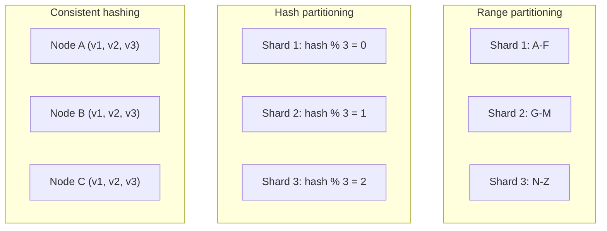
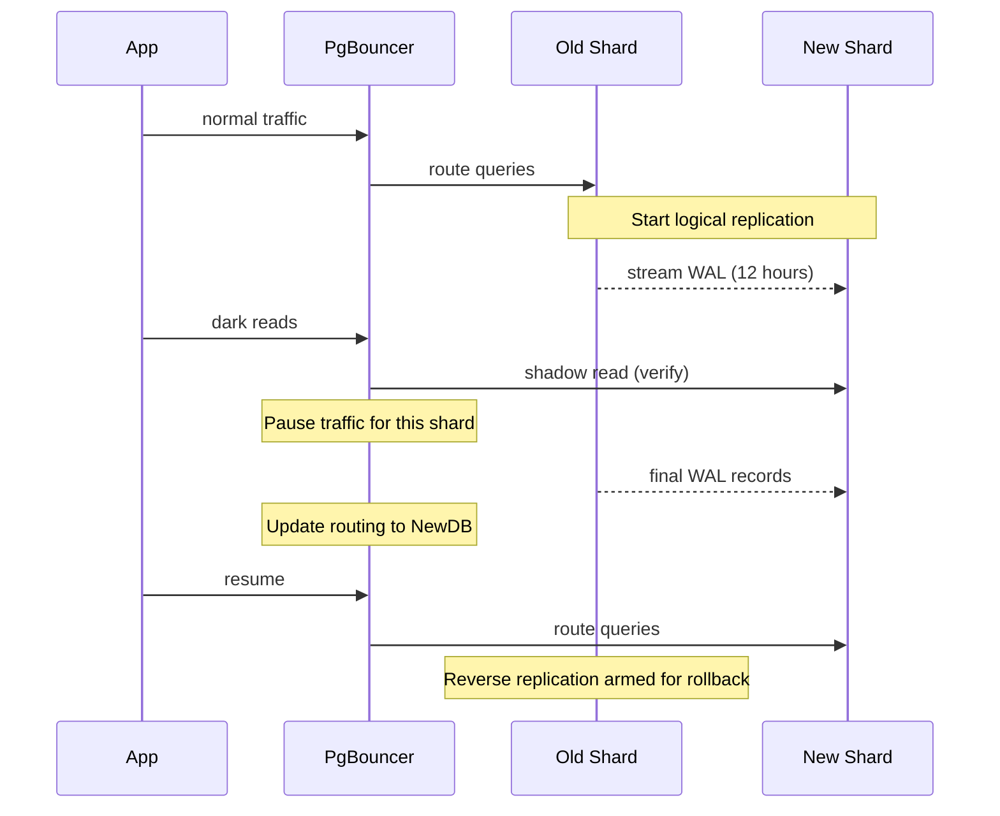
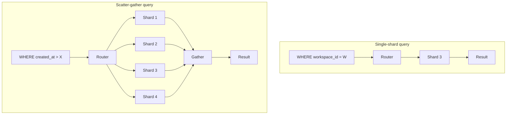
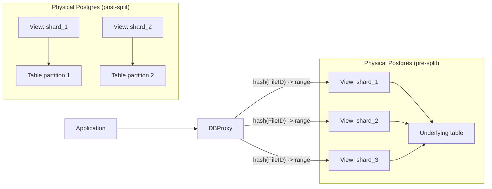

# Database Partitioning and Sharding: When One Node Is Not Enough

> **TL;DR**: Sharding splits a single logical database across many physical nodes so you can scale past one machine's CPU, IOPS, and connection limits. Pick a partition key with high cardinality and even distribution. Use hash-based routing unless you need range scans. Pre-shard into many logical partitions (Notion chose 480 for its divisibility[^1]) so you can grow physical capacity without re-bucketing data. Shard only when vertical scaling is truly exhausted: Figma called horizontal sharding "an order of magnitude more complex than our previous scaling efforts"[^2] and took nine months to ship the first table.

## Learning Objectives

After this module, you will be able to:

- [ ] Choose between range, hash, and consistent-hash partitioning for a workload
- [ ] Pick a partition key that avoids hot spots
- [ ] Design a shard-routing layer (client-side, proxy, or vtgate-style)
- [ ] Plan a resharding operation with minimal downtime
- [ ] Recognize when partitioning is premature and vertical scaling still wins

## Intuition

Imagine a city with one giant central library. Every resident drives downtown to borrow books, return books, and ask questions. At 50,000 residents the parking lot is full, the librarians are overwhelmed, and the building physically cannot hold more shelves.

The city council opens branch libraries. Each branch holds books for a specific set of zip codes. A resident walks into their local branch and finds everything they need without crossing town. The central catalog still knows which branch has which book, but day-to-day traffic is local.

This is sharding. The "zip code" is your partition key. The "central catalog" is your routing layer. The hard part is choosing zip-code boundaries that spread residents evenly, handling the person who visits multiple branches (cross-shard queries), and opening a new branch without closing the others for renovation (online resharding).

Now imagine one zip code contains a stadium. On game day, that branch is crushed while others sit idle. That is a hot partition, and it is the single most common failure mode in sharded systems.

## Theory

### Why shard

A single database node has hard ceilings: CPU cores, disk IOPS, RAM for the buffer pool, and connection slots. Postgres creates a dedicated OS process per connection; between shared memory mappings, work_mem allocations, and per-process overhead, raw Postgres practically tops out in the low hundreds of connections before contention and memory pressure dominate.[^3] Notion hit the largest available RDS instance, faced VACUUM stalls threatening transaction-ID wraparound, and could no longer run safe migrations under load.[^1] Figma's tables reached several terabytes and billions of rows, with vacuums causing reliability impact and write rates projected to exceed the IOPS ceiling.[^2]

Sharding removes these ceilings by distributing the keyspace across independent nodes. Each shard handles a fraction of the traffic, has its own buffer pool, its own VACUUM schedule, and its own connection budget. But it is a one-way door: you lose cross-shard joins, cross-shard transactions, and globally unique indexes. Make sure vertical scaling and read replicas are truly exhausted first.

> [!IMPORTANT]
> **Shard only when you must.** Notion's own retrospective warns that sharding by user before pivoting to a team-focused product "can cause significant technical pain."[^1] Figma had already scaled to AWS's largest physical instance and 12 vertically partitioned databases before committing to horizontal sharding.[^2]

### Partitioning vs sharding

The terms overlap but carry different connotations in practice. **Partitioning** usually means splitting rows across tables or child tables inside one database instance (Postgres `PARTITION BY RANGE`, MySQL `PARTITION BY HASH`). **Sharding** means splitting rows across independent database instances that share nothing at the storage layer.[^4] The two coexist: Notion's 480 logical shards are Postgres schemas inside 32 (later 96) physical RDS instances, which is partitioning inside sharding.[^1][^5]

### Sharding strategies



*Three partitioning families: range preserves locality, hash ensures even distribution, consistent hashing minimizes data movement on membership changes.*

**Range partitioning.** Rows sorted by key are split at boundary values. Good for range scans; pathological for append-heavy workloads where the latest shard becomes a hot partition. Citus explicitly advises: "Do not choose a timestamp as the distribution column."[^6]

**Hash partitioning.** `shard = hash(key) % N`. Even distribution by construction; destroys range-scan locality on the hashed column. Figma uses this approach: "As long as we picked a sufficiently random hash function, we would ensure a uniform distribution of data."[^2] The downside: `hash % N` remaps nearly every key when N changes.

**Consistent hashing.** Karger et al. (1997) map both keys and nodes to a unit circle. Each key is assigned to the first node clockwise. Adding a new node steals only ~1/N of keys instead of nearly all.[^7] Virtual nodes (multiple points per physical node) smooth out variance. The bounded-loads extension (Mirrokni et al., 2016) caps each node at (1+e) times the average load, moving at most O(1/e^2) keys per event.[^8] Vimeo reported an ~8x reduction in shared cache bandwidth after deploying it in HAProxy.[^9][^17]

**Directory-based.** An external lookup table maps keys to shards. Flexible per-tenant placement; the directory is a single point of failure and adds a network hop. Notion uses application-level directory routing from `workspace_id` to (database, schema).[^1]

**Geographic.** Data partitioned by user region for GDPR data residency or latency. Instagram scaled to multiple data centers this way in 2015-2016.[^10]

### Choosing a partition key

The partition key is the single most important design decision in a sharded system. Every production source converges on the same criteria:

- **High cardinality.** Enough distinct values to spread evenly across shards.
- **Even distribution.** No single value dominates traffic.
- **Stability.** The key does not change after creation (UUIDs, not usernames).
- **Present in hot-path queries.** If the key is not in the WHERE clause, every query becomes a scatter-gather.

Notion chose `workspace_id`: UUID-typed, high-cardinality, and naturally scopes the vast majority of reads because users almost always work inside one workspace.[^1] Discord chose `(channel_id, bucket)` where `bucket` is a static time window so partitions do not grow unboundedly.[^11] Figma chose multiple keys (UserID, FileID, OrgID) because no single column existed in their model, then colocated related tables under each key into a "colo."[^2]

The industry pattern for multi-tenant systems is a compound key: `(tenant_id, local_id)` where `tenant_id` partitions and `local_id` is unique inside the tenant. This gives a single unique index per shard that is globally unique without cross-shard coordination.[^6]

### Resharding

The dominant pattern is replication-based online resharding: set up new shards, stream data from old to new via logical replication, verify with dark reads, then flip the router.

Notion's 2023 re-shard is the cleanest reference.[^5] They moved from 32 to 96 physical databases:

1. Provision 96 new RDS instances
2. Start Postgres logical replication (3 publications per source, 5 schemas each)
3. Copy without indexes (reducing sync from 3 days to 12 hours)
4. Rebuild indexes on new shards
5. Verify with dark reads (1-second setTimeout to wait for replication)
6. Pause traffic at PgBouncer, verify replication caught up, update routing, resume

User-visible impact: "about a second of a 'saving' loading spinner" per shard.[^5] Reverse replication was armed the entire time as a rollback escape hatch.



*Online resharding: replicate, verify with dark reads, pause briefly at the proxy, flip routing, keep reverse replication as an escape hatch.*

> [!TIP]
> **Pre-shard into many virtual partitions.** Instagram's 2012 design puts it best: "several thousand 'logical' shards that are mapped in code to far fewer physical shards. Using this approach, we can start with just a few database servers, and eventually move to many more, simply by moving a set of logical shards from one database to another, without having to re-bucket any of our data."[^12] Notion chose 480 logical shards because 480 is divisible by 2, 3, 4, 5, 6, 8, 10, 12, 15, 16, 20, 24, 30, 32, 40, 48, 60, 80, 96, 120, 160, and 240, allowing incremental physical growth.[^1]

### Cross-shard queries

When a query includes the shard key in WHERE, the router sends it to one shard. When it does not, the router must scatter the query to every shard and gather results. Figma's analogy: "like a database-wide game of hide-and-seek: You send out your query to every shard (scatter), then piece together answers from each (gather)."[^2]

Scatter-gather latency is bounded by the slowest shard (tail amplification). At scale, "having too many scatter-gathers would impact horizontal sharding scalability. Because the queries have to touch every single database, each scatter-gather contributes the same amount of load as it would if the database was unsharded."[^2]



*A query with the shard key hits one shard directly; without it, the router scatters to all shards and gathers, bounded by the slowest.*

**Cross-shard joins** require either colocation (both tables share the shard key so rows live on the same shard), reference tables (small tables replicated to every shard), or a distributed join plan (proxy pulls rows from multiple shards and joins in memory).[^6]

**Cross-shard transactions** are the hardest problem. Both Figma and Shopify explicitly removed them rather than rely on two-phase commit. Figma: "we chose not to support atomic cross-shard transactions because we could work around cross-shard transaction failures."[^2] Shopify: "We opted to remove all cross shard transactions to avoid any issues."[^13]

### Hot keys and multi-tenancy

Real-world traffic follows a power law. Discord observed hot partitions when a large server with hundreds of thousands of members shared a partition with small servers: "reads are more expensive than writes... Lots of concurrent reads as users interact with servers can hotspot a partition."[^11]

Mitigations:

- **Request coalescing.** Discord's Rust data services layer: "If multiple users are requesting the same row at the same time, we'll only query the database once."[^11]
- **Compound partition keys.** Discord's `(channel_id, bucket)` splits a single channel's messages across many partitions as it ages.[^11]
- **Write sharding.** DynamoDB pattern: append a random suffix to the hot key (`user#42#001` through `user#42#099`) so writes spread across 100 partitions; reads query all suffixes.[^14]
- **Per-key rate limiting.** Cap the rate any one key can demand from the database.

For multi-tenant SaaS, three canonical patterns exist: **silo** (one database per tenant, strongest isolation, highest cost), **pool** (all tenants share tables with a `tenant_id` column, lowest cost, noisy-neighbor risk), and **bridge** (shared database, schema per tenant, middle ground).[^15] Shopify's pod architecture is a pragmatic hybrid: pods are silos of datastores (MySQL + Redis + Memcached + cron) with pooled stateless compute. A pod failure affects only that pod's shops, not the platform.[^16]

## Real-World Example

**Figma: from one Postgres instance to horizontal sharding in nine months.**

Figma's database stack grew approximately 100x between 2020 and 2024.[^2] By end of 2022, they had 12 vertically partitioned Postgres databases, but some tables had billions of rows and several terabytes, approaching the RDS IOPS ceiling.

In late 2022, Figma committed to horizontal sharding. They built **DBProxy**, a Go service that sits between the application and PgBouncer. DBProxy parses SQL into an AST, extracts the shard key from the WHERE clause, looks up the physical database in a topology stored in S3 and etcd, rewrites the query to target the correct shard's view, and streams the result.[^2]

The key innovation was **logical sharding via Postgres views**:

```sql
CREATE VIEW table_shard1 AS
  SELECT * FROM table
  WHERE hash(shard_key) >= min_range
    AND hash(shard_key) <  max_range;
```

This let Figma test shard routing with a config-flag rollback (seconds) before committing to the riskier physical split. Related tables are grouped into "colos" that share a shard key, so cross-table joins inside a colo remain single-shard.



*Figma's logical-to-physical shard mapping: views act as logical shards on a single database, then physical splits move views to dedicated instances without changing application code.*

The first horizontally sharded table went live in September 2023 with 10 seconds of partial primary-availability impact and zero replica impact.[^2] Figma explicitly rejected CockroachDB, TiDB, Spanner, and Vitess because migrating an existing Postgres stack was deemed riskier than building DBProxy in-house under a hard deadline.

Open problems Figma documents: globally unique ID generation, atomic cross-shard transactions, global unique indexes, and fully automated reshard operations.[^2]

## Trade-offs

| Approach | Pros | Cons | Best when | Our Pick |
|----------|------|------|-----------|----------|
| Range partitioning | Efficient range scans; locality for ordered reads | Hot ranges on append-heavy workloads; skew near boundaries | Time-series with explicit non-time bucketing | Only if range scans are on the critical path |
| Hash partitioning | Even load by construction; simplest to reason about | No range queries on hashed column; `hash % N` moves most keys on reshard | Point lookups, evenly distributed writes, static shard count | **Default choice for most OLTP** |
| Consistent hashing | Minimal data movement on rebalance (~1/N); tolerates dynamic membership | Variance without virtual nodes; tuning complexity | Dynamic membership (caches, Dynamo-style clusters) | When shard set changes frequently |
| Directory-based | Flexible per-tenant placement; supports moving a big tenant to its own shard | Directory lookup hop; directory is SPOF | Multi-tenant SaaS with per-tenant scale outliers | When you need per-tenant control |

> [!TIP]
> **Pre-shard, regardless of which strategy you picked above.** Create many more logical shards (virtual partitions) than physical databases from day one. Figma started with 4,096 logical shards per colo; Vitess, Notion, and DynamoDB all use the same pattern.[^2][^5] Rebalancing then becomes a physical move (logical shard 173 migrates from DB-A to DB-B) instead of a re-bucketing (every key in the table recomputed). Pick an initial logical-shard count with many divisors (4,096 = 2^12, 360, 720) so you can split to 32, 48, 64, 96 physical nodes without remainder. This is the single highest-ROI decision in a greenfield sharded system; retrofitting virtual partitions after the fact is painful.

## Common Pitfalls

> [!WARNING]
> **Timestamp as partition key.** All writes pile up on one shard (the "current" one); old shards sit idle. Citus explicitly advises against it.[^6] Use a high-cardinality entity ID and add time as a secondary dimension only (Discord's bucket pattern).

> [!WARNING]
> **Celebrity hot keys.** One user or channel receives 1%+ of traffic; the shard holding its key becomes the bottleneck. Discord's hot-partition pain in Cassandra came from servers with hundreds of thousands of members sharing partitions with small servers.[^11] Mitigate with request coalescing, write sharding, or per-key rate limiting.

> [!WARNING]
> **Scatter-gather on every query.** One developer ships a query without the shard key in WHERE; at production scale every query becomes N-way scatter and all N shards melt. Enforce at commit-time that every sharded-table query carries the shard key. Figma built a shadow-planning framework; Shopify built query verifiers that reject non-compliant SQL.[^2][^13]

> [!WARNING]
> **Cross-shard foreign key constraints.** Foreign keys that span shards cannot be enforced by the database. Either colocate related tables under the same shard key, use application-level checks, or accept eventual consistency. Do not pretend the constraint still holds.

> [!WARNING]
> **Forgetting secondary index rebuilds.** When you physically move data to a new shard, indexes do not come for free. Notion skipped index creation during the copy phase (reducing sync from 3 days to 12 hours) and rebuilt them afterward.[^5] Plan for this in your resharding timeline.

> [!WARNING]
> **Backfilling a partition key under load.** If the partition key column does not exist yet, backfilling billions of rows on an already-saturated primary will either stall the backfill or page-fault the product. Notion's lesson: backfill the partition key before the database is saturated, or backfill on-the-fly during the migration copy phase.[^1]

## Exercise

Your single Postgres primary hits 85% CPU on writes at 30K WPS and the dataset is 2 TB. You project 5x growth in 18 months. Design a sharding plan: partition key, number of shards, routing layer, resharding strategy, and how you will keep cross-tenant reports working during the migration.

<details>
<summary>Hint</summary>

Think about what entity scopes 90%+ of your queries. Consider pre-sharding into a highly divisible number of logical shards. For cross-tenant reports, consider whether a read replica or an analytics pipeline (CDC to a warehouse) can serve the reporting workload without scatter-gathering the OLTP shards.

</details>

<details>
<summary>Solution</summary>

**Partition key:** `tenant_id`. Most queries in a multi-tenant SaaS filter by tenant. High cardinality (thousands of tenants), even distribution (no single tenant dominates unless you have a celebrity, which you handle with a dedicated shard), stable (tenant IDs never change), and present in every hot-path query.

**Number of shards:** 480 logical shards (following Notion's divisibility reasoning). Start with 16 physical databases (30 schemas each). At 5x growth, move to 48 physical databases (10 schemas each) without re-bucketing.

**Routing layer:** Application-level. A thin routing function maps `hash(tenant_id) % 480` to a logical shard number, then a config file maps logical shard to physical database. Deploy PgBouncer between the app and each physical database to pool connections.

**Resharding strategy:** Postgres logical replication from old physical databases to new ones. Copy without indexes, rebuild after, verify with dark reads, then pause-and-flip at PgBouncer. Keep reverse replication armed for rollback. Target: under 2 seconds of user-visible impact per shard.

**Cross-tenant reports:** Do not scatter-gather the OLTP shards. Set up CDC (Debezium on each shard's WAL) streaming into a columnar warehouse (ClickHouse or BigQuery). Reports query the warehouse, which is optimized for full scans and aggregations. This decouples analytics latency from OLTP latency entirely.

**Trade-off accepted:** Cross-tenant reports see data with replication lag (seconds to minutes). If real-time cross-tenant queries are required, consider Citus with co-located distributed tables, but accept the operational complexity of a distributed coordinator.

</details>

## Key Takeaways

- Sharding is a one-way door. Exhaust vertical scaling, read replicas, and vertical partitioning first.
- Pick the partition key for the worst access pattern, not the average one. High cardinality, even distribution, stable, present in hot-path queries.
- Hash-based routing is the default for OLTP. Use consistent hashing only when the shard set is dynamic.
- Pre-shard into many logical partitions (pick a highly divisible number like 480 or 360). You can grow physical capacity without re-bucketing data.
- Cross-shard joins and transactions are expensive or impossible. Colocate related data under the same shard key.
- Hot partitions will find you. Design so you can add request coalescing, write sharding, or split on short notice.
- Online resharding via logical replication, dark reads, and proxy-level pause-and-flip is the industry standard pattern.

## Further Reading

- [Herding elephants: Lessons learned from sharding Postgres at Notion](https://www.notion.com/blog/sharding-postgres-at-notion) - The canonical "first-time sharder" post-mortem: 480 shards, workspace_id, audit-log migration, and why 480 has many factors.
- [The Great Re-shard: adding Postgres capacity (again) with zero downtime](https://www.notion.com/blog/the-great-re-shard) - How to reshard live at 32 to 96 Postgres instances using logical replication and a sharded PgBouncer.
- [How Figma's databases team lived to tell the scale](https://www.figma.com/blog/how-figmas-databases-team-lived-to-tell-the-scale/) - DBProxy, logical-vs-physical sharding, colos, views-as-logical-shards, and shadow planning; one of the most detailed sharding write-ups in the industry.
- [Sharding & IDs at Instagram](https://instagram-engineering.com/sharding-ids-at-instagram-1cf5a71e5a5c) - Still the clearest explanation of logical-vs-physical shards and Snowflake-style sharded IDs (41 bits time + 13 bits shard + 10 bits sequence).
- [How Discord Stores Trillions of Messages](https://discord.com/blog/how-discord-stores-trillions-of-messages) - Hot partitions, data services with request coalescing, Cassandra to ScyllaDB migration, and the (channel_id, bucket) partitioning pattern.
- [Partitioning GitHub's relational databases to handle scale](https://github.blog/engineering/infrastructure/partitioning-githubs-relational-databases-scale/) - Schema domains, SQL linters, Vitess adoption, and a write-cutover process for 130 tables at 950K QPS.
- [Consistent Hashing and Random Trees (Karger et al., STOC 1997)](https://dl.acm.org/doi/10.1145/258533.258660) - The original paper; read at least the theorem statement on balance and spread.
- [Designing Data-Intensive Applications, Ch. 6](https://dataintensive.net/) - Kleppmann's canonical textbook treatment of partitioning strategies, rebalancing, and request routing.

## Flashcards

**Q:** What is the difference between partitioning and sharding?
**A:** Partitioning splits rows across tables inside one database instance (Postgres PARTITION BY). Sharding splits rows across independent database instances that share nothing at the storage layer. They often coexist: Notion uses Postgres schemas (partitioning) inside separate RDS instances (sharding).

**Q:** What are the four criteria for a good partition key?
**A:** High cardinality, even distribution, stability (does not change after creation), and presence in hot-path queries so the router can target one shard instead of scattering.

**Q:** Why is a timestamp a bad partition key?
**A:** All writes pile up on the "current" shard while old shards sit idle. This creates a permanent hot partition on the newest time range.

**Q:** What does consistent hashing guarantee when adding a node?
**A:** Only ~1/N of keys move to the new node, compared to hash-mod-N which remaps nearly every key. Virtual nodes smooth out variance across physical nodes.

**Q:** Why did Notion choose 480 logical shards?
**A:** 480 is highly divisible (by 2, 3, 4, 5, 6, 8, 10, 12, 15, 16, 20, 24, 30, 32, 40, 48, 60, 80, 96, 120, 160, 240). This allows incremental physical growth from 32 to 40 to 48 to 96 hosts without re-bucketing data.

**Q:** What is scatter-gather and why is it expensive?
**A:** When a query lacks the shard key, the router fans it to every shard and aggregates results. Latency is bounded by the slowest shard (tail amplification), and each scatter-gather contributes the same load as if the database were unsharded.

**Q:** How did Figma decouple logical sharding from physical sharding?
**A:** They used Postgres views (CREATE VIEW ... WHERE hash(shard_key) >= min AND < max) as logical shards. This let them test routing with a config-flag rollback in seconds before committing to the riskier physical data split.

**Q:** What is the pre-sharded virtual partitions pattern?
**A:** Create many logical shards (hundreds or thousands) mapped to fewer physical databases. To scale, move logical shards between physical databases without re-hashing any keys. Instagram, Notion, and Figma all use this pattern.

**Q:** How do Figma and Shopify handle cross-shard transactions?
**A:** They removed them entirely. Both explicitly chose not to support atomic cross-shard transactions, working around failures at the application level instead of relying on two-phase commit.

**Q:** What is Discord's solution to hot partitions?
**A:** A Rust "data services" layer with request coalescing: if multiple users request the same row simultaneously, only one query goes to the database. Combined with the (channel_id, bucket) partition key that splits old channels across many partitions.

**Q:** What is the DynamoDB write-sharding pattern for hot keys?
**A:** Append a random suffix to the hot key (user#42#001 through user#42#099) so writes spread across many partitions. Reads must then query all suffixes and aggregate.

**Q:** What is Notion's online resharding sequence?
**A:** Provision new databases, start logical replication, copy without indexes (12 hours vs 3 days), rebuild indexes, verify with dark reads, pause traffic at PgBouncer, verify replication caught up, update routing, resume. User-visible impact: about 1 second per shard.

**Q:** What are the three multi-tenancy patterns?
**A:** Silo (one database per tenant, strongest isolation, highest cost), pool (all tenants share tables with tenant_id column, lowest cost, noisy-neighbor risk), and bridge (shared database, schema per tenant, middle ground).

## References

[^1]: Garrett Fidalgo, "Herding elephants: Lessons learned from sharding Postgres at Notion", Notion Blog, 2021-10-06. https://www.notion.com/blog/sharding-postgres-at-notion
[^2]: Sammy Steele, "How Figma's databases team lived to tell the scale", Figma Blog, 2024-03-14. https://www.figma.com/blog/how-figmas-databases-team-lived-to-tell-the-scale/
[^3]: PostgreSQL Documentation, "Resource Consumption" (work_mem, shared_buffers, and per-backend resource costs). https://www.postgresql.org/docs/current/runtime-config-resource.html
[^4]: PostgreSQL Documentation, "Table Partitioning". https://www.postgresql.org/docs/current/ddl-partitioning.html
[^5]: Arka Ganguli, Tanner Johnson, Ben Kraft, Nathan Northcutt, "The Great Re-shard: adding Postgres capacity (again) with zero downtime", Notion Blog, 2023-07-17. https://www.notion.com/blog/the-great-re-shard
[^6]: Citus Documentation, "Choosing Distribution Column" and "Table Co-Location", 13.0. https://docs.citusdata.com/en/stable/sharding/data_modeling.html
[^7]: D. Karger, E. Lehman, T. Leighton, M. Levine, D. Lewin, R. Panigrahy, "Consistent Hashing and Random Trees", STOC 1997. https://dl.acm.org/doi/10.1145/258533.258660
[^8]: V. Mirrokni, M. Thorup, M. Zadimoghaddam, "Consistent Hashing with Bounded Loads", arXiv 1608.01350, 2016. https://arxiv.org/abs/1608.01350
[^9]: Andrew Rodland, "Improving load balancing with a new consistent-hashing algorithm", Vimeo Engineering Blog, 2018. https://medium.com/vimeo-engineering-blog/improving-load-balancing-with-a-new-consistent-hashing-algorithm-9f1bd75709ed
[^10]: Instagram Engineering, "Instagration Pt. 2: Scaling our infrastructure to multiple data centers", 2016-04-28. https://instagram-engineering.com/instagration-pt-2-scaling-our-infrastructure-to-multiple-data-centers-5745cbad7834
[^11]: Bo Ingram, "How Discord Stores Trillions of Messages", Discord Blog, 2023-03-06. https://discord.com/blog/how-discord-stores-trillions-of-messages
[^12]: Instagram Engineering, "Sharding & IDs at Instagram", 2012-12-30. https://instagram-engineering.com/sharding-ids-at-instagram-1cf5a71e5a5c
[^13]: Hammad Khalid et al., "Horizontally scaling the Rails backend of Shop app with Vitess", Shopify Engineering, 2024-01-17. https://shopify.engineering/horizontally-scaling-the-rails-backend-of-shop-app-with-vitess
[^14]: AWS Documentation, "Using write sharding to distribute workloads evenly". https://docs.aws.amazon.com/amazondynamodb/latest/developerguide/bp-partition-key-sharding.html
[^15]: AWS Prescriptive Guidance, "Multi-tenant SaaS partitioning models for PostgreSQL". https://docs.aws.amazon.com/prescriptive-guidance/latest/saas-multitenant-managed-postgresql/partitioning-models.html
[^16]: Xavier Denis, "A Pods Architecture To Allow Shopify To Scale", Shopify Engineering, 2018-03-02. https://shopify.engineering/a-pods-architecture-to-allow-shopify-to-scale
[^17]: Vahab Mirrokni, Morteza Zadimoghaddam, "Consistent Hashing with Bounded Loads", Google AI Blog, 2017-04-03. https://ai.googleblog.com/2017/04/consistent-hashing-with-bounded-loads.html
