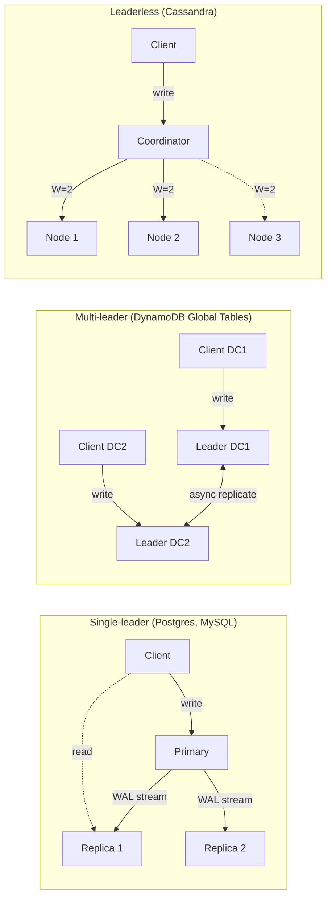
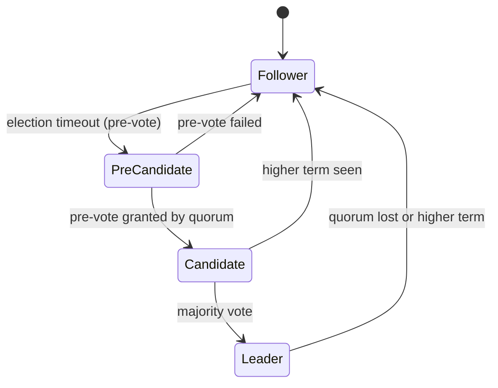
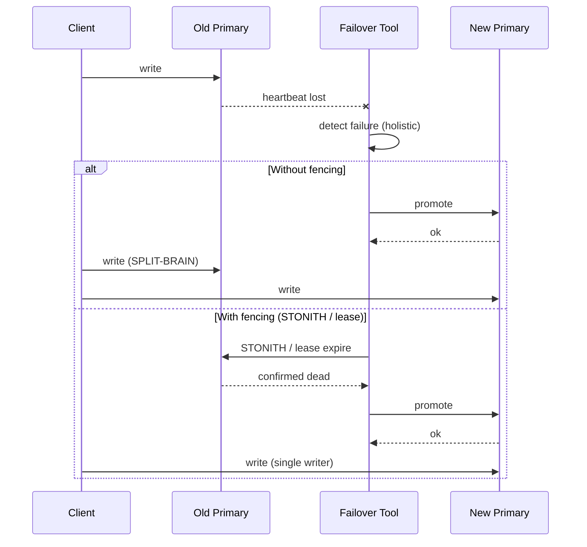
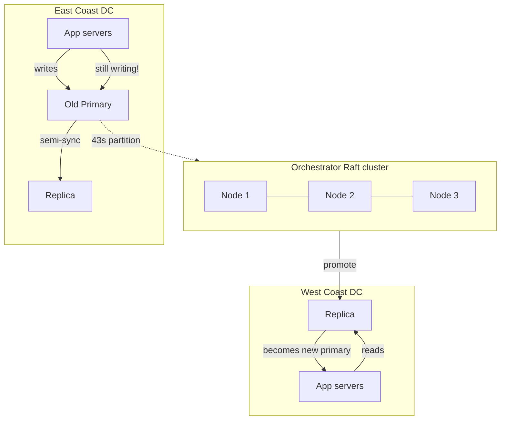

# Database Replication: Keeping Copies in Sync

> **TL;DR**: Replication keeps N copies of your data on N nodes so reads scale out and a single failure does not lose data. Single-leader with semi-sync replication is the default for most OLTP workloads. Reach for multi-leader or leaderless only when you have proven geo-latency needs. The hard part is not copying bytes; it is failover without split-brain. GitHub learned this when a 43-second network partition caused 24 hours of recovery and up to 954 unreconciled writes on a single cluster[^1]. Every replication decision is a separable choice (topology, sync mode, failover policy, multi-region) with measurable consequences.

## Learning Objectives

After this module, you will be able to:

- [ ] Distinguish leader-follower, multi-leader, and leaderless replication
- [ ] Choose sync vs async replication based on durability and latency requirements
- [ ] Reason about replication lag and its impact on read-your-writes
- [ ] Design a failover procedure that avoids split-brain
- [ ] Understand tunable consistency (R + W > N) in leaderless systems
- [ ] Explain how Aurora's 4-of-6 quorum and Spanner's Paxos groups differ in practice

## Intuition

Imagine you run a chain of bank branches. Each branch keeps a ledger. At the end of the day, every branch sends its new entries to headquarters, which reconciles them and ships the combined ledger back overnight.

This works until two branches approve conflicting loans to the same customer on the same day. Now headquarters has a conflict it cannot resolve without calling both branch managers. That is multi-leader replication with last-write-wins, and it silently loses data.

A safer model: one branch is the "main office." All loan approvals go there. The other branches get read-only copies of the ledger, updated every few minutes. If the main office burns down, you promote the branch with the freshest copy. But during the promotion, nobody can approve loans. That gap is your failover window.

The tension between "every branch can approve loans" (availability, low latency) and "only one branch approves loans" (consistency, no conflicts) is the fundamental trade-off in database replication. Every topology you will learn in this chapter is a different answer to that tension.

## Theory

### Why replicate

You replicate for four reasons, and they are separable:

1. **Durability.** If the primary's disk dies, a replica has the data. Without replication, you rely on backups with a recovery point measured in hours.
2. **Availability.** If the primary process crashes, a replica can take over in seconds rather than the minutes a cold restore requires.
3. **Read scaling.** Route read queries to replicas. Read throughput scales linearly with replica count[^2].
4. **Geo-latency.** Place a replica in Singapore so users there read local data instead of crossing the Pacific to us-east-1.

These four goals pull in different directions. Durability wants synchronous writes to at least one replica. Read scaling wants many async replicas. Geo-latency wants replicas far away, which makes synchronous writes expensive. Every replication design is a weighted combination of these four.

### Topologies

*Single-leader routes all writes through one node; multi-leader accepts writes everywhere and reconciles later; leaderless fans every write to N replicas and waits for W acknowledgements.*

**Single-leader** is the workhorse. All writes go to one node (the primary), which ships a log of changes to followers. PostgreSQL streams the Write-Ahead Log (WAL). MySQL ships the binary log (binlog). MongoDB ships the oplog[^2]. The primary is the single source of truth. Followers are read-only copies.

**Multi-leader** lets two or more nodes accept writes and replicate to peers. DynamoDB Global Tables in MREC mode (the default) accept writes in every region with typically under 1 second replication lag[^3]. The price: conflict resolution. Almost always last-write-wins (LWW), which silently discards the "loser" when two regions write the same key concurrently.

**Leaderless** (Dynamo-style) has no designated primary. The client or a coordinator fans writes to N replicas and waits for W acknowledgements. Reads fan to R replicas and take the freshest. Netflix benchmarked Cassandra at 1.1 million client writes per second on 288 EC2 nodes with RF=3[^4].

**Consensus-based** (Raft, Paxos) is sometimes treated as single-leader, but the safety guarantees differ. Every write is committed only after a majority of replicas persist it. No data loss on single-node failure. Automatic leader election. etcd, CockroachDB, Spanner, and TiKV all use this model[^5].

**Chain replication** arranges replicas in a linear chain. Writes enter at the head and flow tail-ward; reads come from the tail. Simpler than Paxos but requires an external configuration master. Described by van Renesse and Schneider[^6] and used in Windows Azure Storage[^7].

### Sync vs async vs semi-sync

The sync-versus-async choice answers one question: how many seconds of writes can you afford to lose on a single-machine failure?

| Mode | Mechanism | RPO | Write latency | Example |
|------|-----------|-----|---------------|---------|
| Async | Primary replies immediately, ships log later | Seconds to minutes | Lowest | Postgres default, MySQL default |
| Semi-sync | Primary waits up to timeout T, then falls back | 0 if replica acks, else seconds | +1 RTT (local) | GitHub MySQL (500 ms timeout)[^8] |
| Sync | Primary waits for replica fsync before replying | 0 | +1 RTT (possibly cross-region) | Postgres `synchronous_commit = on`[^2] |
| Quorum | Primary waits for W of N replicas | 0 if W met | +1 RTT to W-th fastest | Aurora 4-of-6[^9], Raft majority |

PostgreSQL exposes this as `synchronous_commit` with settings `on`, `remote_write`, and `remote_apply`. The minimum wait on sync is one network round trip to the standby[^2]. MySQL's semi-sync uses a timeout (GitHub sets 500 ms) that falls back to async if replicas are slow[^8]. This gives best-effort lossless failover within a datacenter.

> [!IMPORTANT]
> Semi-sync with a short timeout is the pragmatic default for most production MySQL deployments. It gives you near-zero RPO in the common case (local replica acks in under 1 ms) while avoiding hung writes when a replica is down.

### Log-based replication

Every single-leader system ships changes via a log. The format matters:

- **Physical log (WAL).** PostgreSQL streams raw WAL records (page-level changes). Compact, fast, but tied to the exact storage format. You cannot replicate between different Postgres major versions without logical decoding[^2].
- **Binary log (binlog).** MySQL ships row-level changes (before/after images) or statements. Row-based is the production default because statement-based has non-determinism bugs (NOW(), RAND())[^10].
- **Oplog.** MongoDB ships idempotent operations in a capped collection. Replicas tail the oplog and apply operations[^11].
- **Logical replication.** A higher-level format (row changes as structured data) that decouples replication from storage format. PostgreSQL's logical replication slots, MySQL's binlog in row format, and Debezium's CDC connectors all operate at this level.

The key distinction: physical replication is faster but locks you to one engine version. Logical replication is slower but enables cross-version upgrades, heterogeneous replication, and CDC pipelines.

### Consensus replication (Raft and Paxos)

Raft decomposes consensus into three sub-problems: leader election, log replication, and safety[^5]. A leader accepts proposals, appends them to its log, sends `AppendEntries` RPCs to followers, and declares an entry committed when a majority have persisted it. The etcd `raft` library uses a 10:1 ElectionTick-to-HeartbeatTick ratio with randomized election timeouts to avoid split votes[^12].

*Each Raft node transitions between Follower, Candidate, and Leader; the Pre-Vote mechanism prevents disruptive term bumps from a rejoining isolated node.*

Paxos is equivalent in fault tolerance but harder to implement correctly. Spanner uses Paxos groups per tablet with TrueTime (clock uncertainty typically between 1 and 7 ms) to achieve external consistency across the entire database[^13]. The practical difference: Raft is what you debug at 3 AM because it decomposes cleanly into election + replication + safety. Paxos is what Google runs because they built it first and have 20 years of operational tooling.

> [!TIP]
> The `R + W > N` rule gives read-your-writes within the coordinator's view of the quorum. It does NOT mean reads are linearizable, and it does NOT prevent silent data loss under clock skew with LWW. For linearizability, you need consensus (Raft/Paxos) or a read from the leader with a read-index check.

### Failover

Failover has three parts: detection, election, and fencing.

**Detection.** Naive ping-based monitoring suffers false positives during network glitches. GitHub's Orchestrator uses holistic detection: it declares the master dead only when it cannot reach the master AND all replicas report replication is broken from their end[^14][^15].

**Election.** Orchestrator picks the most up-to-date replica based on a rules matrix (version, format, semi-sync status, datacenter)[^16]. Patroni delegates to a Distributed Configuration Store (etcd, Consul, or ZooKeeper) so the election is itself a Raft decision[^17].

**Fencing.** The old primary must stop accepting writes. Without fencing, split-brain is inevitable on network partition. STONITH ("shoot the other node in the head") via IPMI power-off is the nuclear option. Patroni uses a DCS lease that expires if the primary cannot renew it[^17]. GitHub uses HAProxy's `hard-stop-after` to terminate old connections after reload[^8].

*Without fencing, the old primary keeps accepting writes during the promotion window; with fencing, the old primary is provably dead before the new one takes over.*

### Multi-region replication

Three production approaches dominate:

- **DynamoDB Global Tables (MREC).** Async cross-region replication with LWW conflict resolution. Typical lag under 1 second. SLA: 99.999% availability[^3]. Best for idempotent writes where silent conflict resolution is acceptable.
- **Aurora Global Database.** Storage-level cross-region replication with under 1 second lag. Up to 10 secondary regions. Write forwarding lets secondary-region reads route writes back to the primary region[^18]. Best for read-heavy multi-region with a single write region.
- **Spanner.** Synchronous Paxos across regions. Every write waits for a majority of voting replicas. External consistency via TrueTime. Best when you need global strong consistency and can tolerate cross-region write latency[^13].

## Real-World Example

### GitHub's 2018 MySQL incident: 43 seconds that took 24 hours to fix

On October 21, 2018, a 43-second network partition between GitHub's East Coast network hub and their primary East Coast datacenter triggered a cascade that took 24 hours and 11 minutes to fully resolve[^1].

**The setup.** GitHub ran multiple MySQL clusters (by 2023, the fleet had grown to 50+ clusters with 1,200+ hosts)[^19]. Each cluster used semi-sync replication with a 500 ms timeout. Orchestrator ran on Raft across datacenters for coordinated failover. Applications reached the primary through Consul-backed HAProxy[^8].

**The partition.** At 22:52 UTC, connectivity between the network hub and the East Coast DC dropped for 43 seconds. Orchestrator-on-Raft, holding quorum in the remaining DCs, correctly detected the primaries as unreachable and promoted West Coast replicas to primary[^1].

**The split-brain.** During those 43 seconds, East Coast applications kept writing to the old primaries. When the network healed, both sides had accepted writes the other had not seen. One of the busiest clusters had 954 writes in the affected window that had not been replicated[^1].

**The decision.** GitHub chose data integrity over speed. They kept the West Coast as primary (it had the Orchestrator-blessed identity), forced East Coast apps to incur cross-country latency, and spent 24 hours draining the backlog of webhooks and GitHub Pages builds. The divergent writes were manually reconciled[^1].

**The lesson.** Automated failover without application-tier readiness for cross-region latency creates a new failure mode. GitHub's post-mortem recommended constraining Orchestrator to prevent cross-region promotion unless the application can tolerate the latency change[^1]. The failover tool optimizes for "any healthy primary exists"; the application assumes a local-DC primary in its latency budget.

*During the 43-second partition, Orchestrator promoted the West Coast replica while East Coast apps continued writing to the old primary, creating up to 954 unreconciled writes on a single cluster.*

## Trade-offs

| Approach | Pros | Cons | Best when | Our Pick |
|----------|------|------|-----------|----------|
| Single-leader, async | Lowest write latency, simple topology | Data loss on primary failure, read lag | Most OLTP workloads tolerant of seconds of data loss | **Default for most systems** |
| Single-leader, semi-sync | Near-zero RPO in common case | Write latency +1 local RTT, falls back to async under replica failure | Financial, regulated, or audit-critical writes | When RPO matters |
| Multi-leader (LWW) | Local writes in every region, survives full region loss | Silent write loss under clock skew, hard-to-debug conflicts | Multi-region with idempotent or commutative writes | Only with proven geo-latency need |
| Leaderless (Dynamo) | High availability, tunable per-request consistency | Eventual consistency, operational complexity (repair, compaction, gossip) | Write-heavy workloads tolerant of eventual consistency | Cassandra/DynamoDB workloads |
| Consensus (Raft/Paxos) | Strong consistency, automatic failover, no data loss | Consensus latency per write, cross-region expensive | Metadata stores, systems needing linearizability | etcd, Spanner, CockroachDB |

## Common Pitfalls

> [!WARNING]
> **Split-brain without fencing.** Two nodes both claim to be primary, both accept writes, and the writes can never be merged cleanly. This happens when the failover tool promotes a new primary without confirming the old one is dead. Always fence: STONITH, DCS lease expiry, or proxy connection termination[^8][^17].

> [!WARNING]
> **Serving reads from async replicas for read-your-writes flows.** User saves a form, refreshes, sees old data because the refresh hit a replica that had not received the write yet. Fix: pin reads to primary for N seconds after a write, or pass a commit LSN token that routes to a sufficiently-fresh replica[^2].

> [!WARNING]
> **Treating replication as backup.** A bad `DROP TABLE` replicates to every replica within seconds. You lose the data everywhere at once. Replication faithfully replicates bugs, human errors, and malicious actions. You still need PITR from WAL archives and delayed replicas[^2].

> [!CAUTION]
> **Ignoring Jepsen-proven write loss under failover.** MongoDB with default `w:1` acknowledges a write after one node persists it; on failover, that write can be rolled back. About 80% of hosted MongoDB service users never change the default[^20]. Always set `writeConcern: majority` for anything you cannot afford to lose[^21].

> [!WARNING]
> **Ignoring replication lag alerts.** Lag under normal load is milliseconds, but under heavy write load or network hiccup it grows to seconds or minutes. Monitor `pg_stat_replication.replay_lag` (Postgres), `Seconds_Behind_Source` (MySQL), or `ReplicationLatency` (DynamoDB Global Tables)[^22]. Alert at 5 seconds; page at 30 seconds.

> [!WARNING]
> **Cross-region promotion without application readiness.** The HA tool correctly promotes a primary in another region; the application was not built to tolerate the extra latency, so page loads time out. Constrain the HA tool to only promote in regions the app is ready for[^1].

## Exercise

You run a global SaaS on Postgres in us-east-1 with async replicas in eu-west-1 and ap-southeast-1 for reads. A customer in Singapore reports that after saving, refreshing immediately shows old data. Diagnose, and design three alternatives: (1) pin reads to primary after writes, (2) synchronous APAC replica, (3) move to a multi-region SQL engine. Quantify the latency cost of each.

Hint

The customer's write goes to us-east-1 (the primary). Their read hits the ap-southeast-1 replica, which is behind by the replication lag plus the time between the write and the read. Think about what each solution costs in latency and what it gains in consistency.

Solution

**Diagnosis.** The customer writes to us-east-1 (cross-Pacific, ~180 ms RTT). Their subsequent read hits the ap-southeast-1 async replica, which may be 200 ms to 2 seconds behind the primary. If the read arrives before the replica catches up, they see stale data.

**Option 1: Pin reads to primary after writes.**
After any write, set a session flag with a TTL (e.g., 5 seconds). During that window, route all reads for that user to the us-east-1 primary. Latency cost: the Singapore user's reads go cross-Pacific (~180 ms RTT) for 5 seconds after each write. The rest of the time, reads are local (~20 ms). Implementation: pass a `last_write_ts` cookie; the routing layer compares it to the replica's known LSN.

**Option 2: Synchronous APAC replica.**
Set `synchronous_standby_names = 'ANY 1 (ap-southeast-1-replica)'` on the primary. Every write now waits for the APAC replica to fsync before acknowledging. Latency cost: every write from every user (not just Singapore) pays +180 ms. This is usually unacceptable for a global SaaS unless the APAC replica is the only sync standby and you use `ANY 1 (local, apac)` to prefer the local standby.

**Option 3: Multi-region SQL engine (Spanner or Aurora Global).**
Aurora Global Database with write forwarding: reads are local, writes forward to the primary region and return in ~1 RTT cross-region. Spanner: writes go to the nearest Paxos leader, committed after majority ack (cross-region latency on every write, but reads are local and strongly consistent). Latency cost: Spanner adds ~100 to 200 ms per write for cross-region consensus. Aurora Global adds ~1 second for write forwarding but reads are local and under 1 second stale.

**Recommendation for most SaaS:** Option 1 (pin reads to primary after writes). It is the cheapest, requires no infrastructure change, and the latency penalty is bounded to a short window after writes. Option 3 is justified only if you have multiple write-heavy regions and the engineering budget for a database migration.

## Key Takeaways

- Single-leader async is the default and solves most problems. Understand replication lag and you are 90% of the way there.
- Synchronous replication trades latency for durability. Use semi-sync with a short timeout (500 ms) for best-effort lossless failover within a datacenter.
- Multi-leader is deceptively attractive. Conflicts are always harder than they look, and LWW silently loses data.
- Leaderless (Dynamo-style) with tunable R/W gives you a knob to trade consistency for availability per query, but `R + W > N` is not linearizability.
- Automated failover without fencing is a split-brain waiting to happen. Always fence the old primary before promoting the new one.
- Replication is not a backup. A bad `DROP TABLE` replicates everywhere in seconds. You still need point-in-time restore.
- Aurora's 4-of-6 quorum tolerates an AZ failure plus one extra segment loss without losing data[^9]. That is the bar for cloud-native durability.

## Further Reading

- [Amazon Aurora: Design Considerations for High Throughput Cloud-Native Relational Databases (Verbitski et al., SIGMOD 2017)](https://www.amazon.science/publications/amazon-aurora-design-considerations-for-high-throughput-cloud-native-relational-databases) - The canonical Aurora paper; "the log is the database" and the 4-of-6 quorum design explained from first principles.
- [MySQL High Availability at GitHub (Shlomi Noach, 2018)](https://github.blog/2018-06-20-mysql-high-availability-at-github/) - Orchestrator + Consul + GLB in production detail; the architecture behind the 10 to 13 second failover target.
- [October 21 post-incident analysis (GitHub, 2018)](https://github.blog/news-insights/company-news/oct21-post-incident-analysis/) - The 24-hour outage from a 43-second partition; the canonical split-brain war story for any replication discussion.
- [In Search of an Understandable Consensus Algorithm (Ongaro and Ousterhout, USENIX ATC 2014)](https://raft.github.io/raft.pdf) - The Raft paper; required reading before working with etcd, CockroachDB, or TiKV.
- [Dynamo: Amazon's Highly Available Key-value Store (DeCandia et al., SOSP 2007)](https://www.amazon.science/publications/dynamo-amazons-highly-available-key-value-store) - The paper that launched the leaderless category and defined (N, W, R) tunable quorums.
- [Spanner: Google's Globally-Distributed Database (OSDI 2012)](https://research.google/pubs/spanner-googles-globally-distributed-database-2/) - Paxos + TrueTime; the synchronous multi-region blueprint that trades latency for global strong consistency.
- [Jepsen: MongoDB 4.2.6 (Kyle Kingsbury, 2020)](https://jepsen.io/analyses/mongodb-4.2.6) - How "full ACID" claims meet network partitions; essential reading for healthy skepticism about replication guarantees.
- [PostgreSQL: High Availability, Load Balancing, and Replication](https://www.postgresql.org/docs/current/high-availability.html) - The reference for streaming replication, synchronous commit modes, and PITR configuration.

## Flashcards

**Q:** What are the three main replication topologies?
**A:** Single-leader (all writes to one node, replicated to followers), multi-leader (multiple nodes accept writes, reconcile conflicts), and leaderless (writes fan to N replicas, wait for W acks).

**Q:** What does `R + W > N` guarantee, and what does it NOT guarantee?
**A:** It guarantees read-your-writes within the coordinator's quorum view. It does NOT guarantee linearizability, and it does NOT prevent silent data loss under clock skew with LWW.

**Q:** What is the RPO difference between async and semi-sync replication?
**A:** Async: RPO is seconds to minutes (writes accepted but not yet replicated are lost on primary failure). Semi-sync: RPO is zero in the common case (replica acks before primary replies to client), but falls back to async RPO if the replica is slow or down.

**Q:** What are the three parts of failover?
**A:** Detection (confirming the primary is actually dead), election (picking the most up-to-date replica), and fencing (ensuring the old primary cannot accept writes).

**Q:** Why is "replication is not a backup" true?
**A:** A bad DROP TABLE or logical corruption replicates to every replica within seconds. You lose the data everywhere at once. Backups (PITR, delayed replicas, offline dumps) protect against logical errors; replication protects against hardware failure.

**Q:** What happened in GitHub's October 2018 incident?
**A:** A 43-second network partition caused Orchestrator to promote West Coast replicas. East Coast apps kept writing to old primaries for 43 seconds, producing up to 954 unreconciled writes on a single busy cluster. Recovery took 24 hours.

**Q:** How does Aurora's 6-way replication work?
**A:** Aurora stores 6 copies across 3 AZs (2 per AZ). Write quorum is 4 of 6; read quorum is 3 of 6. This tolerates a full AZ loss plus one extra segment failure without data loss.

**Q:** What is STONITH and why does it matter?
**A:** "Shoot The Other Node In The Head." It forcibly kills the old primary (via IPMI power-off, network ACL, or lease expiry) before promoting a new one, preventing split-brain where two nodes both accept writes.

**Q:** When should you use multi-leader replication?
**A:** Only when you have proven geo-latency needs (users in multiple regions need local write latency) AND your writes are idempotent or commutative enough to tolerate LWW conflict resolution. For most workloads, single-leader with read replicas is simpler and safer.

**Q:** What is GitHub's semi-sync timeout and why that value?
**A:** 500 ms. High enough that local-DC replicas almost always ack (sub-millisecond typical), low enough that a total replica outage does not hang writes for users.

**Q:** How does Spanner achieve global strong consistency?
**A:** Paxos groups per tablet with TrueTime (clock uncertainty under 7 ms at p99). Every write waits for a Paxos majority across regions, and TrueTime's bounded uncertainty eliminates the need for distributed locks on read-only transactions.

**Q:** What is the typical replication lag for DynamoDB Global Tables?
**A:** Typically under 1 second between regions (MREC mode, the default). The newer MRSC mode uses cross-region consensus for strong consistency at higher latency.

## References

[^1]: Jason Warner, "October 21 post-incident analysis", GitHub Blog, October 30, 2018. https://github.blog/news-insights/company-news/oct21-post-incident-analysis/
[^2]: "Chapter 26. High Availability, Load Balancing, and Replication", PostgreSQL 18 documentation. https://www.postgresql.org/docs/current/warm-standby.html
[^3]: "How DynamoDB global tables work", AWS DynamoDB Developer Guide. https://docs.aws.amazon.com/amazondynamodb/latest/developerguide/V2globaltables_HowItWorks.html
[^4]: Adrian Cockcroft and Denis Sheahan, "Benchmarking Cassandra Scalability on AWS - Over a million writes per second", Netflix Tech Blog, November 2011. https://web.archive.org/web/20240118151011/https://netflixtechblog.com/benchmarking-cassandra-scalability-on-aws-over-a-million-writes-per-second-39f45f066c9e
[^5]: Ongaro and Ousterhout, "In Search of an Understandable Consensus Algorithm", USENIX ATC 2014. https://raft.github.io/
[^6]: van Renesse and Schneider, "Chain Replication for Supporting High Throughput and Availability", OSDI 2004. https://www.usenix.org/legacy/publications/library/proceedings/osdi04/tech/full_papers/renesse/renesse_html/index.html
[^7]: Calder et al., "Windows Azure Storage: A Highly Available Cloud Storage Service with Strong Consistency", SOSP 2011. https://sigops.org/s/conferences/sosp/2011/current/2011-Cascais/11-calder-online.pdf
[^8]: Shlomi Noach, "MySQL High Availability at GitHub", GitHub Engineering, June 20, 2018. https://github.blog/2018-06-20-mysql-high-availability-at-github/
[^9]: Anurag Gupta, "Amazon Aurora under the hood: quorums and correlated failure", AWS Database Blog, August 14, 2017. https://aws.amazon.com/blogs/database/amazon-aurora-under-the-hood-quorum-and-correlated-failure/
[^10]: "MySQL 8.0 Reference Manual: Replication", Oracle. https://dev.mysql.com/doc/refman/8.0/en/replication.html
[^11]: "MongoDB Replication", MongoDB Manual. https://www.mongodb.com/docs/manual/replication/
[^12]: etcd-io/raft source code, raft.go. https://github.com/etcd-io/raft/blob/main/raft.go
[^13]: Corbett et al., "Spanner: Google's Globally-Distributed Database", OSDI 2012. https://research.google/pubs/spanner-googles-globally-distributed-database-2/
[^14]: Shlomi Noach, "Orchestrator at GitHub", GitHub Engineering, December 8, 2016. https://github.blog/engineering/infrastructure/orchestrator-github/
[^15]: openark/orchestrator, docs/failure-detection.md. https://github.com/openark/orchestrator/blob/master/docs/failure-detection.md
[^16]: openark/orchestrator repository and documentation. https://github.com/openark/orchestrator
[^17]: "Patroni documentation", Patroni 3.x. https://patroni.readthedocs.io/en/latest/
[^18]: "Using Amazon Aurora Global Database", AWS RDS User Guide. https://docs.aws.amazon.com/AmazonRDS/latest/AuroraUserGuide/aurora-global-database.html
[^19]: Jiaqi Liu, Daniel Rogart & Xin Wu, "Upgrading GitHub.com to MySQL 8.0", GitHub Engineering, December 7, 2023. https://github.blog/engineering/infrastructure/upgrading-github-com-to-mysql-8-0/
[^20]: Schultz et al., "Tunable Consistency in MongoDB", PVLDB 12(12), 2019. http://www.vldb.org/pvldb/vol12/p2071-schultz.pdf
[^21]: Kyle Kingsbury, "Jepsen: MongoDB 4.2.6", Jepsen, May 15, 2020. https://jepsen.io/analyses/mongodb-4.2.6
[^22]: "Monitoring DynamoDB global tables", AWS DynamoDB Developer Guide. https://docs.aws.amazon.com/amazondynamodb/latest/developerguide/V2globaltables_monitoring.html
