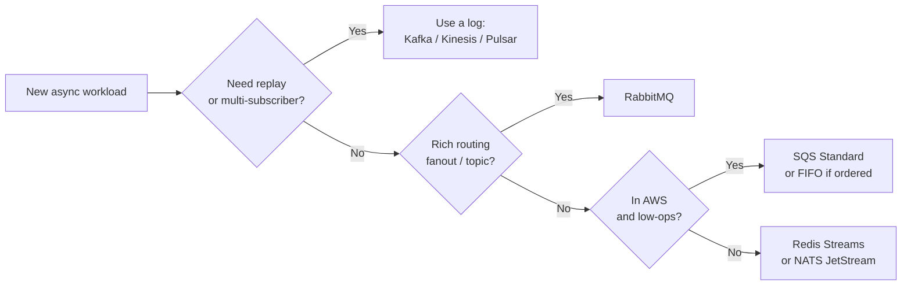
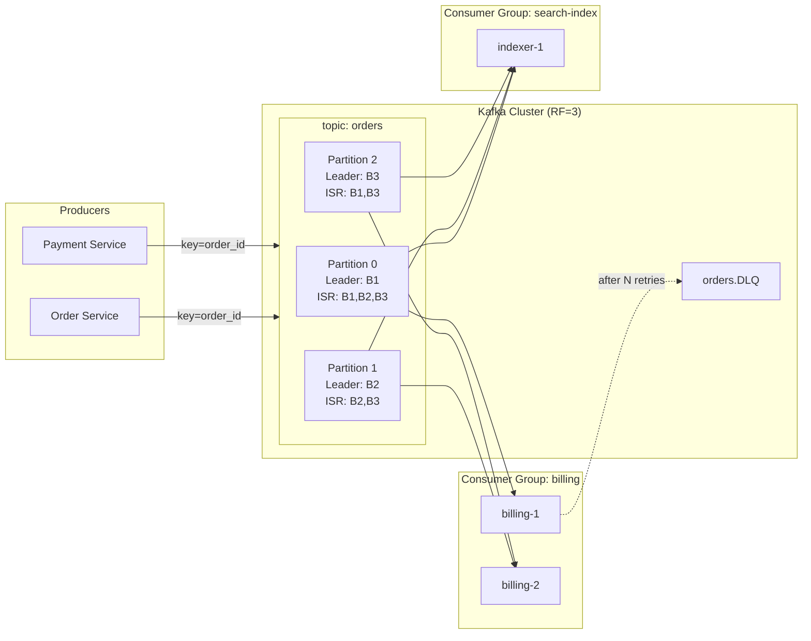
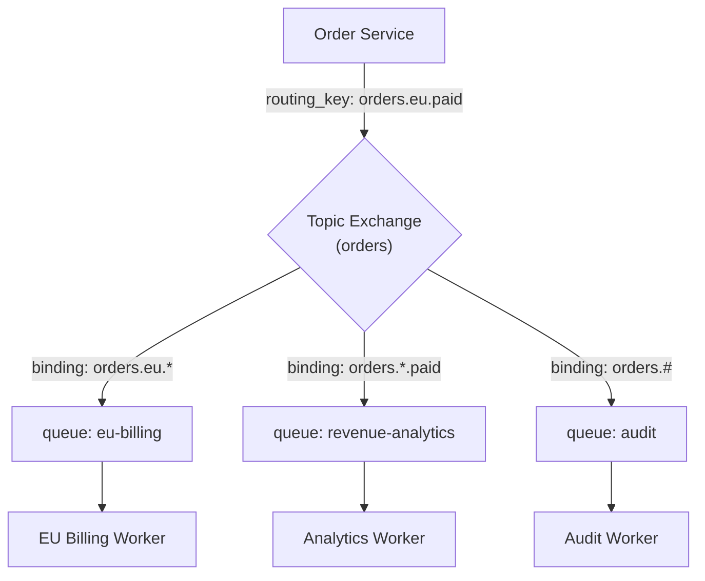
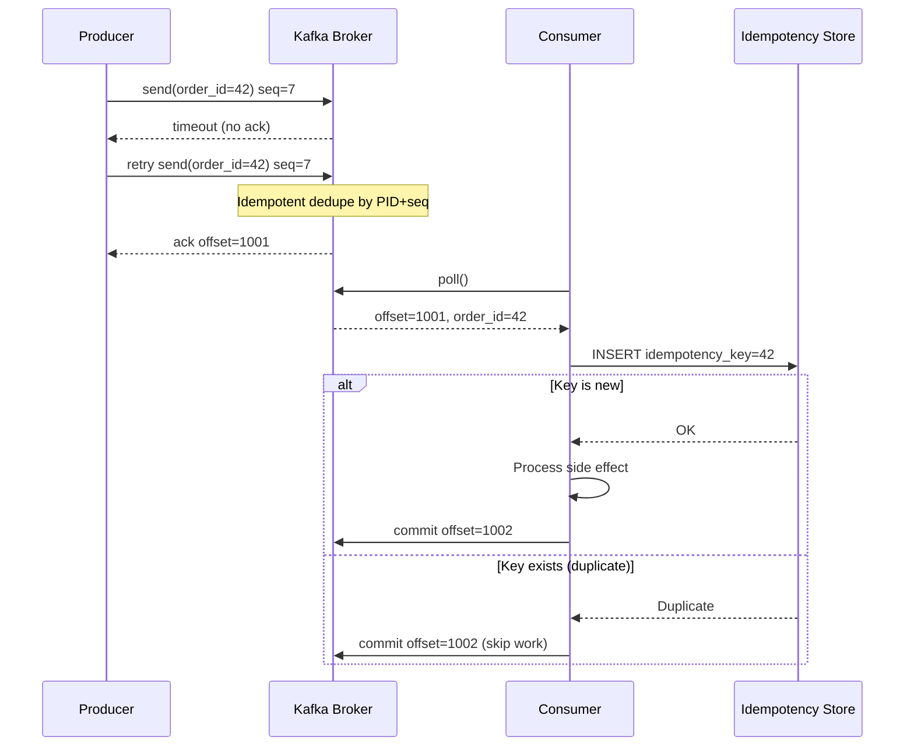

# Message Queues and Streaming: Decoupling at Scale

> **TL;DR**: Message systems split into two families. A **queue** (RabbitMQ, SQS) delivers each message to one consumer and deletes it after acknowledgement. A **log** (Kafka, Kinesis, Pulsar) is an append-only, ordered, durable record that many consumer groups read independently at their own pace. Jay Kreps's 2013 essay reframed the log as the source of truth from which every downstream system derives its state[^1]. The practical delivery guarantee is at-least-once with idempotent consumers; "exactly-once" only holds end-to-end within Kafka's transactional boundary[^2]. At scale, LinkedIn processes over 7 trillion messages per day across 4,000+ brokers[^3], and Netflix processes hundreds of billions of events daily through its Keystone pipeline. The partition is the unit of parallelism, the cap on consumer scaling, and the boundary of ordering.

## Learning Objectives

After this module, you will be able to:

- [ ] Distinguish a queue from a log and pick the right one for a workload
- [ ] Design for at-least-once delivery with idempotent consumers
- [ ] Reason about Kafka partitions, consumer groups, and ordering guarantees
- [ ] Handle backpressure, dead-letter queues, and poison messages
- [ ] Compare Kafka, RabbitMQ, SQS, Kinesis, and Pulsar on real criteria
- [ ] Explain why partition count is a permanent architectural decision

## Intuition

Think of two services at the post office.

The first is the **package counter**. You hand a parcel to a clerk. The clerk gives it to exactly one delivery driver. Once delivered, the receipt is shredded. If you want to send the same parcel to two people, you need two parcels. This is a queue: one message, one consumer, gone after processing.

The second is the **newspaper archive**. Every edition is printed, numbered, and shelved in order. Any subscriber can walk in, find edition #4,217, and read forward from there. A new subscriber does not need to wait for tomorrow's paper; they can start from any past edition. Adding a subscriber does not slow down existing readers. This is a log: append-only, ordered, replayable, multi-subscriber.

The queue is simpler. The log is more powerful. Most confusion in system design comes from reaching for a queue when you need a log, or paying the operational cost of a log when a queue would suffice.

The rest of this chapter teaches you to tell the difference and pick correctly.

## Theory

### Queue vs stream: the fundamental distinction

A **queue** (SQS, RabbitMQ work queue) tracks per-message state: visible, in-flight, acknowledged. Competing consumers drain work faster than one could alone. Once acknowledged, the message is gone. If you add a new consumer service next month, it starts from "now" with no history[^4].

A **log** (Kafka, Kinesis, Pulsar) stores durable, offset-addressable segments. Each consumer group tracks its own offset. Adding a new consumer group replays history from offset 0 without disturbing existing consumers. The log is not just a transport mechanism; it is the source of truth that downstream systems (search indexes, caches, warehouses, microservices) derive their state from[^1].

*A pragmatic decision tree: start with replay and fan-out needs, then narrow by routing complexity and operational appetite.*

Use a log when you need replay, multi-subscriber fan-out, or CDC. Use a queue when you need simple work distribution with per-message acks and no history.

### Delivery guarantees: at-most, at-least, exactly-once

Three levels exist, and only one is honest at scale:

- **At-most-once** (Kafka `acks=0`, fire-and-forget): the producer sends and moves on. Messages can be lost on broker crashes.
- **At-least-once** (the practical default): the producer retries until it gets an ack. On broker crashes, a message may be written twice. Consumers must handle duplicates. Netflix's Keystone pipeline uses `acks=1` (leader-only acknowledgement), a pragmatic middle ground that accepts a small data loss risk on leader failure in exchange for lower latency and higher availability[^5].
- **Exactly-once** (Kafka EOS): requires `enable.idempotence=true` (producer sequence numbers deduped broker-side), a `transactional.id` (atomic writes across partitions plus consumer offset commit in the same transaction), and consumers using `isolation.level=read_committed`[^2]. Throughput overhead is approximately 3% compared to at-least-once with `acks=all`[^2].

> [!IMPORTANT]
> Kafka's exactly-once only covers Kafka-to-Kafka pipelines. The moment you make an external RPC, write to a database, or trigger a side-effect, the chain breaks. The honest answer for real systems: at-least-once delivery plus idempotent consumers with application-level deduplication keys.

### Kafka architecture: topics, partitions, ISR, KRaft

A Kafka **topic** is split into N **partitions**. Each partition is a replicated log with one leader and several followers. The **ISR** (in-sync replicas) is the subset of replicas that have caught up to the leader.

Key invariants:

- `acks=all` + `min.insync.replicas=2` on replication factor 3 guarantees no data loss under single-broker failure[^6].
- Producer idempotence (default since Kafka 3.0) assigns each producer a PID and each batch a sequence number; brokers dedupe retries with `max.in.flight.requests.per.connection <= 5`[^6].
- Partition throughput: 10-50 MB/s per partition in production[^7].

*Producers write keyed events into partitioned topics; two consumer groups read independently at their own offsets, and poison messages route to a DLQ after N retries.*

**KRaft** (KIP-500) replaced ZooKeeper with an internal Raft-based metadata quorum. ZooKeeper was deprecated in Kafka 3.5 and fully removed in Kafka 4.0[^8]. This eliminates an entire system from the operational footprint and enables faster controller failover.

**Tiered storage** (KIP-405, GA in Kafka 3.9) offloads older log segments to object storage (S3, GCS), significantly reducing storage cost for long-retention topics while keeping recent data on local disks for hot reads[^9][^10].

### RabbitMQ and AMQP: exchanges, flexibility, routing

RabbitMQ implements AMQP 0-9-1. Producers publish to an **exchange**; **bindings** attach queues to exchanges with a **routing key** pattern[^11]:

- **Direct exchange**: routes to queues whose binding key exactly matches the routing key.
- **Fanout exchange**: ignores routing keys, delivers to every bound queue.
- **Topic exchange**: uses dotted routing keys (`orders.eu.paid`) with `*` (one word) and `#` (zero or more words) wildcards.

*A topic exchange routes by wildcard pattern; one message fans out to multiple queues without duplication logic in the producer.*

Modern RabbitMQ (3.8+) provides **quorum queues** built on Raft, replacing the deprecated mirrored-queue feature with clear failure semantics[^12]. However, RabbitMQ throughput (tens of thousands msgs/sec per queue) is an order of magnitude below Kafka (hundreds of thousands per partition)[^13]. It is a broker, not a log: once acknowledged, messages are gone. No replay.

Use RabbitMQ when you need rich routing (topic/fanout/headers), low-latency task distribution, or RPC-style request/reply patterns. Use Kafka when you need a durable, replayable event log.

### SQS, SNS, Kinesis, Pulsar, and Redpanda

| System | Model | Throughput | Ordering | Ops burden | Best for |
|---|---|---|---|---|---|
| SQS Standard | Queue | Unlimited | None | Zero (managed) | Async jobs in AWS |
| SQS FIFO | Queue | 300 TPS (3K batched, 70K high-throughput)[^14] | Per MessageGroupId | Zero | Ordered work in AWS |
| Kinesis | Log | 1 MB/s or 1K records/s per shard[^15] | Per shard | Low (managed) | AWS-native streaming |
| Pulsar | Log | High (BookKeeper) | Per partition | Medium (brokers + bookies) | Multi-tenant, geo-replicated |
| Redpanda | Log | Kafka-compatible, C++, no JVM | Per partition | Low (single binary) | Low-latency, edge |

SQS uses a **visibility timeout** (default 30s): after `ReceiveMessage`, the message is invisible to other consumers. If the consumer crashes before `DeleteMessage`, the message reappears. A **redrive policy** moves messages to a DLQ after `maxReceiveCount` failed receives[^16].

For fan-out in AWS, combine **SNS** (pub/sub) with **SQS** (per-subscriber queue): SNS delivers to N SQS queues, each consumed independently. This gives you log-like multi-subscriber semantics without running Kafka.

### Consumer patterns: groups, competing consumers, DLQ, backpressure

**Consumer groups** distribute partitions across members. You cannot have more active consumers per group than partitions. This is the hard ceiling on parallelism[^7].

**Cooperative rebalance** (KIP-429, Kafka 2.4+): only partitions that need to move are revoked, instead of the older "stop-the-world" protocol where every consumer surrenders every partition on any membership change[^17][^18].

**Backpressure** is managed via bounded in-flight windows:

- Kafka: `max.poll.records` and `fetch.max.bytes`
- SQS: 120,000 in-flight messages per queue[^19]
- RabbitMQ: prefetch (QoS) count

**Dead Letter Queue (DLQ)**: after N retries with exponential backoff, produce the failing record to a `<topic>.DLQ`, commit the offset, and move on. This is the Dead Letter Channel pattern from Hohpe and Woolf's *Enterprise Integration Patterns*[^20]. Alert on DLQ depth. Build a redrive tool to re-inject fixed messages.

**Lag monitoring**: the difference between log-end offset and committed offset. LinkedIn's [Burrow](https://github.com/linkedin/Burrow) is the canonical consumer-lag monitor[^21].

*The producer retry creates a duplicate at the broker; the idempotent producer dedupes by PID+sequence, and the consumer deduplicates using a persisted idempotency key before committing the offset.*

## Real-World Example

**LinkedIn Kafka: 7 trillion messages per day.**

LinkedIn is where Kafka was born, and it remains the largest public deployment. As of 2019, LinkedIn operates over 100 Kafka clusters with 4,000+ brokers, 100,000+ topics, and 7 million partitions, processing more than 7 trillion messages per day[^3]. The largest single cluster runs 140+ brokers with 1 million replicas.

Every LinkedIn service runs a Kafka client (or a REST proxy for non-JVM languages). Events flow to regional Kafka clusters, are mirrored cross-region by Brooklin (which replaced MirrorMaker, mirroring more than 7 trillion messages/day between clusters)[^22], and consumed by Samza stream processors, Hadoop, Pinot, and hundreds of microservices.

Key engineering decisions that kept this running:

- **Maintenance mode brokers**: brokers flagged for decommission stop receiving new partition assignments, letting SREs safely drain hardware without triggering rebalance storms[^3].
- **Controller memory optimization**: reusing `UpdateMetadataRequest` objects to prevent cascading controller failures in clusters with millions of replicas[^3].
- **Cruise Control**: automated partition rebalancing and self-healing across clusters.

The failures are instructive. LinkedIn's KIPs document production issues: KIP-291 (separating controller from data-plane connections to avoid head-of-line blocking), KIP-354 (maximum log compaction lag, after a compaction stall filled disks), and KIP-380 (detecting outdated control requests after broker bounces)[^3].

The lesson: at 7 trillion messages per day, every configuration choice (partition count, acks setting, retention policy, rebalance strategy) is the difference between a healthy pipeline and a 3am page.

## Trade-offs

| System | Throughput | Ordering | Replay | Ops burden | Cost model | Our Pick |
|---|---|---|---|---|---|---|
| Kafka | 10-50 MB/s per partition | Per partition | Full log replay | High (JVM, KRaft, disks) | Infra + team | Ordered event streams, CDC, analytics |
| SQS Standard | Unlimited | None | No | Zero | Pay-per-request | Async jobs in AWS, no ordering needed |
| SQS FIFO | Up to 70K TPS | Per MessageGroupId | No | Zero | Pay-per-request | Ordered work queues in AWS |
| RabbitMQ | Tens of K/s per queue | Per queue | No | Medium (Erlang, quorum queues) | Infra | Rich routing, RPC, task distribution |
| Pulsar | High (BookKeeper) | Per partition | Full replay | Medium-High (brokers + bookies) | Infra | Multi-tenant SaaS, geo-replication |
| Kinesis | 1 MB/s per shard | Per shard | Up to 365-day replay | Low (managed) | Per-shard-hour | AWS-native streaming, small teams |

**Decision rule**: Use Kafka for partitioned ordered streams with replay. Use SQS when you do not need ordering or replay and want zero ops. Use RabbitMQ when you need flexible routing patterns. Use Kinesis or Pulsar when your constraints (AWS-native or multi-tenant) demand them.

## Common Pitfalls

> [!WARNING]
> **Hot partitions.** If your partition key has skewed cardinality (one customer generates 80% of traffic), one partition gets all the load while others idle. Monitor per-partition lag. Use composite keys (`customer_id + order_date`) or a sub-partitioning strategy to spread hot keys.

> [!WARNING]
> **Stop-the-world rebalance.** Under the legacy "eager" protocol, any consumer that misses a heartbeat (GC pause, slow processing exceeding `max.poll.interval.ms`) triggers every consumer to surrender every partition. Switch to `CooperativeStickyAssignor` and use static membership (`group.instance.id`) so pod restarts during deploys do not trigger rebalance[^17].

> [!WARNING]
> **Poison messages without a DLQ.** A single malformed message stalls an entire partition. Consumers crash on deserialization, retry, crash again, repeat forever. Implement the Dead Letter Channel pattern: after N retries with exponential backoff, produce to a DLQ, commit the offset, and alert[^20][^23].

> [!WARNING]
> **Unbounded retention without backpressure.** Producers burst; consumers cannot keep up; lag grows to hours; retention expires and data is lost before consumption. Monitor lag with Burrow[^21]. Autoscale consumers up to partition count. Alert when lag exceeds `consumption_rate * X minutes`.

> [!WARNING]
> **Using Kafka for RPC-style request/response.** Kafka is optimized for high-throughput, high-latency streaming. Request/response patterns need low-latency, per-message routing, and correlation IDs. Use RabbitMQ or gRPC for synchronous communication. Kafka adds unnecessary latency (batching, polling intervals) and complexity (reply topics, correlation headers) for this pattern.

> [!WARNING]
> **Ignoring consumer lag until retention expires.** Consumer lag is not a warning; it is a countdown. Once lag exceeds `retention.ms`, messages are deleted before consumption. There is no recovery. Set alerts at 50% of retention, not 90%.

## Exercise

> **Design Challenge**: You are building the event backbone for a fintech platform. Requirements: 100 million events per day, 3 consumer types (fraud detection with sub-second latency, billing with exactly-once semantics, analytics warehouse with hourly batch loads), and strict per-user ordering of financial events.

Hint

The partition key determines ordering scope. Per-user ordering means `user_id` as the partition key. But how many partitions do you need for 100M/day throughput? And how do you serve three consumers with different latency and semantics requirements from the same topic?

Solution

**Throughput sizing**: 100M events/day is roughly 1,157 events/sec average, with 3-5x peak bursts (3,500-5,800/sec). At ~1 KB per event, that is 3-6 MB/s peak. A single Kafka partition handles 10-50 MB/s, so throughput alone needs only 1 partition. But parallelism matters more.

**Partition count**: you need enough partitions to parallelize consumers. Fraud detection needs low latency, so give it dedicated consumer instances. With 3 consumer types and future scaling, start with 32 partitions. This allows up to 32 parallel consumers per group.

**Partition key**: `user_id`. This guarantees all events for a user land on the same partition, preserving per-user ordering. With millions of users, distribution across 32 partitions will be roughly uniform.

**Three consumer groups on one topic**:

1. **Fraud detection** (consumer group `fraud`): reads with `max.poll.records=1` for lowest latency. Processes inline. No batching.
2. **Billing** (consumer group `billing`): uses Kafka transactions. Reads events, writes billing records to a billing topic, and commits consumer offsets atomically. For the external DB write, uses an idempotency key (`event_id`) in the billing database.
3. **Analytics** (consumer group `analytics`): reads in large batches, buffers in memory, flushes to S3/warehouse hourly. Tolerates lag.

**DLQ strategy**: each consumer group has its own DLQ topic (`events.fraud.DLQ`, `events.billing.DLQ`). After 3 retries with exponential backoff, produce to DLQ and commit offset. Alert on DLQ depth > 0.

**Exactly-once for billing**: Kafka transactional producer wraps the read-process-write cycle. For the external database write, the billing service uses `INSERT ... ON CONFLICT DO NOTHING` with `event_id` as the idempotency key. This makes the consumer idempotent regardless of Kafka-level duplicates.

## Key Takeaways

- A queue delivers each message to one consumer and deletes it. A log is an append-only, replayable record that many consumer groups read independently.
- At-least-once with idempotent consumers is the honest, practical delivery guarantee. "Exactly-once" only holds end-to-end within Kafka's transactional boundary.
- The partition is the unit of parallelism and the cap on consumer scaling. You cannot have more active consumers per group than partitions.
- Ordering is only meaningful per partition. Design your partition key for the ordering you need (typically entity ID).
- Partition count is nearly permanent. Increasing it later reshuffles `hash(key) % N`, breaking ordering guarantees. Over-provision at creation.
- DLQs are not optional. Poison messages will happen, and without a DLQ they block the entire partition indefinitely.
- Use Kafka for ordered event streams with replay. Use SQS for zero-ops async jobs. Use RabbitMQ for rich routing and task distribution.

## Further Reading

- [The Log: What every software engineer should know (Jay Kreps, 2013)](https://engineering.linkedin.com/distributed-systems/log-what-every-software-engineer-should-know-about-real-time-datas-unifying) - the foundational essay that reframes messaging as derived views over a durable log; read this before anything else in the space.
- [How LinkedIn customizes Apache Kafka for 7 trillion messages/day](https://engineering.linkedin.com/blog/2019/apache-kafka-trillion-messages) - the canonical large-scale operations story; covers controller tuning, maintenance mode, and Cruise Control.
- [Exactly-Once Semantics Are Possible (Confluent, 2017)](https://www.confluent.io/blog/exactly-once-semantics-are-possible-heres-how-apache-kafka-does-it/) - authoritative walkthrough of idempotent producer + transactions; explains the 3% overhead and the Kafka-to-Kafka boundary.
- [Scaling Slack's Job Queue](https://slack.engineering/scaling-slacks-job-queue/) - the best "add Kafka incrementally without rewriting everything" story; shows Kafka as a durable buffer in front of Redis workers.
- [Kafka Inside Keystone Pipeline (Netflix, 2016)](https://netflixtechblog.com/kafka-inside-keystone-pipeline-dd5aeabaf6bb) - running Kafka in a cloud that treats brokers as cattle; covers the `acks=1` trade-off and cold-standby failover.
- [Designing Data-Intensive Applications, Ch. 11 (Kleppmann)](https://dataintensive.net/) - conceptual framing of messaging and stream processing; the textbook treatment of exactly-once semantics.
- [Enterprise Integration Patterns (Hohpe and Woolf)](https://www.enterpriseintegrationpatterns.com/) - the DLQ, routing, and channel patterns everyone reinvents badly; read the Dead Letter Channel and Competing Consumers patterns.
- [KIP-500: Replace ZooKeeper with Self-Managed Metadata Quorum](https://cwiki.apache.org/confluence/display/KAFKA/KIP-500%3A+Replace+ZooKeeper+with+a+Self-Managed+Metadata+Quorum) - the design document for KRaft; explains why ZooKeeper was the operational bottleneck.

## Flashcards

**Q:** What is the fundamental difference between a queue and a log?
**A:** A queue delivers each message to one consumer and deletes it after acknowledgement. A log is an append-only, offset-addressable sequence that many consumer groups can read independently and replay from any point.

**Q:** What is the honest delivery guarantee for systems that write to external databases?
**A:** At-least-once delivery with idempotent consumers. Kafka's exactly-once only covers Kafka-to-Kafka pipelines; any external side-effect breaks the transactional boundary.

**Q:** Why is partition count nearly permanent in Kafka?
**A:** Because the default partitioner uses `murmur2(key) % N`. Adding partitions changes N, reshuffling every key's partition assignment, breaking ordering guarantees and causing duplicate processing windows.

**Q:** What is the ISR and why does `min.insync.replicas=2` matter?
**A:** The ISR (in-sync replicas) is the set of replicas caught up to the leader. With `acks=all` and `min.insync.replicas=2` on replication factor 3, at least two replicas must acknowledge before the write is committed, guaranteeing no data loss under single-broker failure.

**Q:** How does cooperative rebalance differ from eager rebalance?
**A:** Eager rebalance (legacy) revokes all partitions from all consumers on any membership change, causing a stop-the-world pause. Cooperative rebalance (KIP-429, Kafka 2.4+) only revokes partitions that need to move, keeping most consumers processing during the transition.

**Q:** What is the Dead Letter Queue pattern?
**A:** After N retries with exponential backoff, produce the failing record to a dedicated DLQ topic, commit the offset, and move on. This prevents a single poison message from blocking an entire partition. Alert on DLQ depth and build a redrive tool.

**Q:** When should you use RabbitMQ instead of Kafka?
**A:** When you need rich routing (topic/fanout/headers exchanges), low-latency task distribution, or RPC-style request/reply patterns. RabbitMQ is a broker with flexible routing, not a durable replay log.

**Q:** What is the maximum consumer parallelism for a Kafka topic with 32 partitions?
**A:** 32 consumers per consumer group. You cannot have more active consumers than partitions; additional consumers sit idle.

**Q:** How does SQS FIFO ordering work?
**A:** SQS FIFO preserves order within a `MessageGroupId`. Messages with the same group ID are delivered in order. Different group IDs are processed in parallel, giving horizontal scaling of ordered work.

**Q:** What throughput overhead does Kafka's exactly-once (transactional producer) add?
**A:** Approximately 3% throughput reduction compared to at-least-once. The cost comes from transaction coordination and `read_committed` consumers waiting for commit markers.

**Q:** Netflix Keystone uses `acks=1` instead of `acks=all`. What is the trade-off?
**A:** `acks=1` means only the leader confirms the write. If the leader crashes before followers replicate, data is lost. Netflix accepts this small data loss risk in exchange for lower latency and higher availability.

**Q:** What is consumer lag and why is it dangerous?
**A:** Lag is the difference between the log-end offset and the consumer's committed offset. If lag grows beyond `retention.ms`, messages are deleted before consumption with no recovery possible.

**Q:** How does LinkedIn handle 7 trillion messages per day?
**A:** 100+ Kafka clusters, 4,000+ brokers, 7 million partitions. Key practices: maintenance-mode brokers for safe decommission, Cruise Control for automated rebalancing, Brooklin for cross-cluster mirroring, and controller memory optimizations to prevent cascading failures.

**Q:** What problem does tiered storage (KIP-405) solve?
**A:** It offloads older log segments to object storage (S3/GCS), significantly reducing storage cost for long-retention topics while keeping recent data on local disks for low-latency reads.

**Q:** When should you use SQS over Kafka?
**A:** When you need zero operational burden, pay-per-request pricing, and do not need ordering, replay, or multi-subscriber fan-out. SQS is the right choice for simple async job processing in AWS.

## References

[^1]: Jay Kreps, "The Log: What every software engineer should know about real-time data's unifying abstraction", LinkedIn Engineering, 2013. https://engineering.linkedin.com/distributed-systems/log-what-every-software-engineer-should-know-about-real-time-datas-unifying
[^2]: Neha Narkhede, Guozhang Wang, "Exactly-Once Semantics Are Possible: Here's How Kafka Does It", Confluent Blog, 2017. https://www.confluent.io/blog/exactly-once-semantics-are-possible-heres-how-apache-kafka-does-it/
[^3]: Jon Lee, Wesley Wu, "How LinkedIn customizes Apache Kafka for 7 trillion messages per day", LinkedIn Engineering, October 2019. https://engineering.linkedin.com/blog/2019/apache-kafka-trillion-messages
[^4]: AWS, "Amazon SQS queue types". https://docs.aws.amazon.com/AWSSimpleQueueService/latest/SQSDeveloperGuide/sqs-queue-types.html
[^5]: Real-Time Data Infrastructure Team, "Kafka Inside Keystone Pipeline", Netflix Tech Blog, April 2016. https://netflixtechblog.com/kafka-inside-keystone-pipeline-dd5aeabaf6bb
[^6]: Apache Kafka project, ProducerConfig.java source, clients module. https://github.com/apache/kafka/blob/trunk/clients/src/main/java/org/apache/kafka/clients/producer/ProducerConfig.java
[^7]: Jun Rao, "How to Choose the Number of Topics/Partitions in a Kafka Cluster?", Confluent Blog, March 2015. https://www.confluent.io/blog/how-choose-number-topics-partitions-kafka-cluster/
[^8]: KIP-500: Replace ZooKeeper with a Self-Managed Metadata Quorum. https://cwiki.apache.org/confluence/display/KAFKA/KIP-500%3A+Replace+ZooKeeper+with+a+Self-Managed+Metadata+Quorum
[^9]: KIP-405: Kafka Tiered Storage. https://cwiki.apache.org/confluence/display/KAFKA/KIP-405%3A+Kafka+Tiered+Storage
[^10]: Apache Kafka, "Tiered Storage Operations". https://kafka.apache.org/39/operations/tiered-storage/
[^11]: RabbitMQ, "Exchanges". https://www.rabbitmq.com/docs/exchanges
[^12]: RabbitMQ, "Quorum Queues". https://www.rabbitmq.com/docs/quorum-queues
[^13]: Quix, "Redpanda vs Kafka". https://quix.io/blog/redpanda-vs-kafka-comparison
[^14]: AWS, "Amazon SQS high throughput FIFO queues". https://docs.aws.amazon.com/AWSSimpleQueueService/latest/SQSDeveloperGuide/high-throughput-fifo.html
[^15]: AWS, "Amazon Kinesis Data Streams: working with streams and shards". https://docs.aws.amazon.com/streams/latest/dev/working-with-streams.html
[^16]: AWS, "Amazon SQS visibility timeout". https://docs.aws.amazon.com/AWSSimpleQueueService/latest/SQSDeveloperGuide/sqs-visibility-timeout.html
[^17]: Apache Kafka, CooperativeStickyAssignor.java source. https://github.com/apache/kafka/blob/trunk/clients/src/main/java/org/apache/kafka/clients/consumer/CooperativeStickyAssignor.java
[^18]: KIP-429: Kafka Consumer Incremental Rebalance Protocol. https://cwiki.apache.org/confluence/display/KAFKA/KIP-429%3A+Kafka+Consumer+Incremental+Rebalance+Protocol
[^19]: AWS, "SQS message quotas". https://docs.aws.amazon.com/AWSSimpleQueueService/latest/SQSDeveloperGuide/quotas-messages.html
[^20]: Gregor Hohpe, Bobby Woolf, "Dead Letter Channel" pattern, Enterprise Integration Patterns. https://www.enterpriseintegrationpatterns.com/patterns/messaging/DeadLetterChannel.html
[^21]: LinkedIn, Burrow: Kafka Consumer Lag Checking. https://github.com/linkedin/Burrow
[^22]: LinkedIn Engineering, "Replicating large-scale Kafka clusters at LinkedIn with Brooklin". https://engineering.linkedin.com/blog/2022/load-balanced-brooklin-mirror-maker--replicating-large-scale-kaf
[^23]: Codelit, "Handling Failed Messages at Scale: Dead Letter Queue patterns". https://codelit.io/blog/dead-letter-queue-patterns
