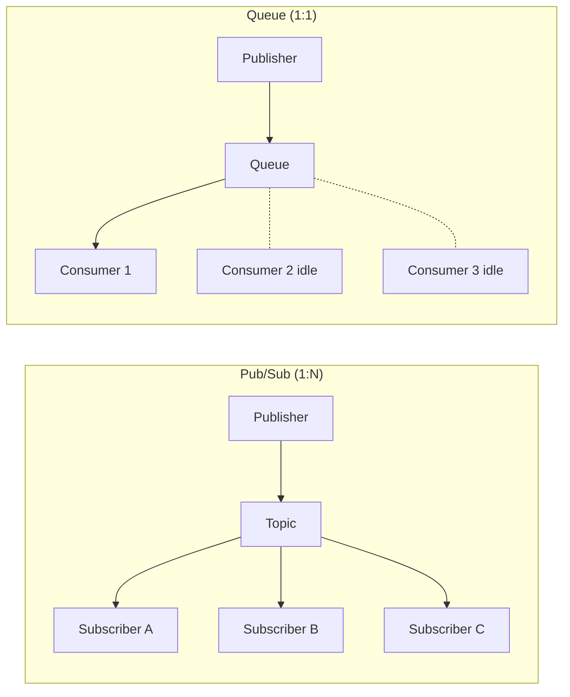
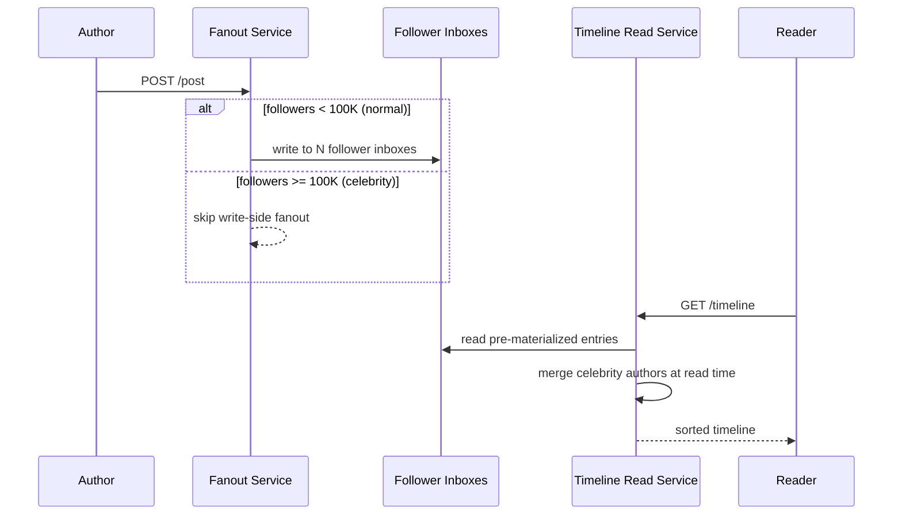
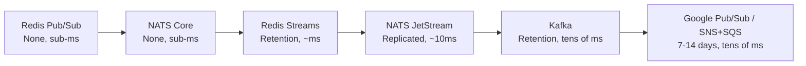
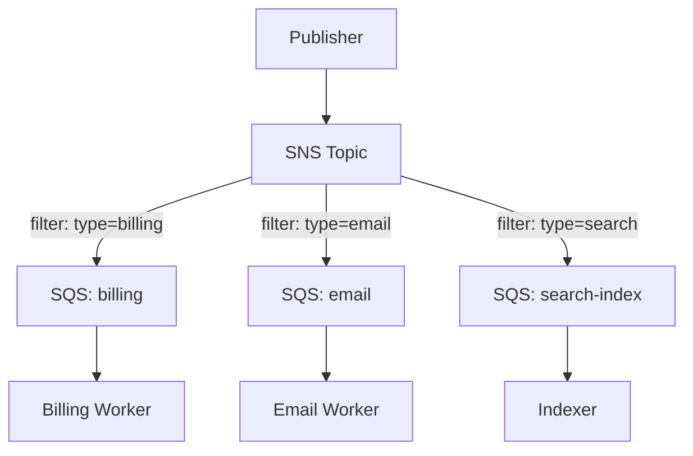
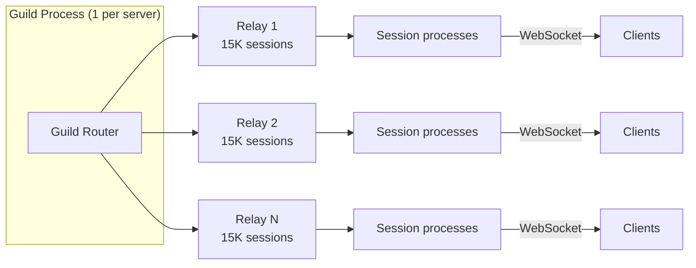

# Pub/Sub: Fan-Out and Event-Driven Systems

> **TL;DR**: Publish/subscribe is the 1:N messaging pattern: a publisher sends to a topic, and the broker copies the message to every subscription[^1]. It is the "broadcast" cousin of the queue (which is 1:1). The critical design axis is durability versus latency versus cost. Redis Pub/Sub delivers in sub-milliseconds but drops messages silently if a subscriber disconnects[^2]. Google Cloud Pub/Sub replicates to a quorum of clusters before acking, powering 500M+ messages/sec internally[^3]. Kafka gives you replay and consumer groups but forces partition planning[^4]. Use Redis Pub/Sub for best-effort realtime; Kafka for durable fanout with replay; SNS+SQS when AWS-native and you want zero ops.

## Learning Objectives

After this module, you will be able to:

- [ ] Distinguish pub/sub from queueing and point-to-point messaging
- [ ] Pick push vs pull delivery based on consumer behavior and scale
- [ ] Choose between in-memory (Redis, NATS) and durable (Kafka, Google Pub/Sub, SNS+SQS) substrates
- [ ] Design fan-out strategies that handle the celebrity problem without write amplification explosions
- [ ] Implement per-key ordering without requiring global ordering (which does not scale)
- [ ] Recognize when Redis Pub/Sub will silently lose messages and what to use instead

## Intuition

Think of a radio station. The DJ speaks into a microphone. The signal goes out to every tuned-in receiver simultaneously. The DJ does not know how many listeners exist, does not wait for each one to confirm receipt, and does not re-broadcast for someone who turned on their radio late. If you missed the 8am news, it is gone.

Now think of a newspaper subscription. The paper prints one edition and mails a copy to every subscriber on the list. A new subscriber starts receiving tomorrow's paper, not yesterday's. If the mailbox is full, the paper piles up (or gets discarded by the carrier).

Pub/sub is both of these models, depending on the system you pick. Redis Pub/Sub is the radio: fire-and-forget, instant, no memory. Kafka is the newspaper with an archive room: every edition is numbered and shelved, and a new subscriber can start reading from edition #1.

The rest of this chapter teaches you when to pick the radio, when to pick the newspaper, and what breaks when you confuse the two.

## Theory

### The pub/sub pattern

A pub/sub system has four actors: a **publisher** that emits messages, a **topic** (the named channel), a **subscription** (an interest expression), and a **subscriber** that receives copies of matching messages. Each subscription gets its own copy of every matching message. This is the fundamental difference from a queue: a queue delivers each message to exactly one competing consumer; pub/sub delivers each message to every subscriber[^1].

*A pub/sub topic copies each message to every subscription, while a queue sends each message to exactly one competing consumer.*

Subscriptions can be **durable** (survive subscriber disconnect: Google Pub/Sub, Kafka consumer groups, MQTT with `CleanStart=0`) or **ephemeral** (disappear on disconnect: Redis Pub/Sub, NATS Core)[^3][^5]. Filtering is usually topic-based (subscribe to `orders.us`) with optional wildcards (MQTT `+` for one level, `#` for multi-level), or content-based using filter predicates on message attributes (SNS filter policies, Google Pub/Sub filter expressions)[^6][^7].

### Systems compared

Not all pub/sub systems are interchangeable. They sit on a spectrum from "fast and lossy" to "durable and heavy":

| System | Durability | Ordering | Delivery | Throughput | Best for |
|---|---|---|---|---|---|
| Redis Pub/Sub | None | Per-connection | At-most-once | High (single-threaded bound)[^8] | Cache invalidation, presence |
| NATS Core | None | Per-publisher | At-most-once | Sub-ms | Microservice events, IoT |
| Redis Streams | Retention-based | Per-stream | At-least-once | High | Lightweight durable pub/sub |
| NATS JetStream | Replicated | Per-stream | At-least-once / exactly-once | ~10ms | Cloud-native messaging |
| Kafka | Retention-based | Per-partition | At-least-once (EOS available) | Typically 10s of MB/s per partition[^4] | Analytics + app eventing |
| Google Cloud Pub/Sub | 7 days (unacked) | Per-ordering-key | At-least-once (exactly-once on pull) | 500M+ msg/sec internal[^3] | Cross-service cloud events |
| SNS + SQS | SQS: up to 14 days | SNS Standard: none; FIFO: per-group | At-least-once | SNS FIFO: 300 msg/s per group; 3K msg/s per topic (default)[^9] | AWS-native fan-out |
| MQTT | Broker-dependent | Per-publisher (QoS 1/2) | QoS 0/1/2[^10] | Varies | IoT, constrained devices |

Use Redis Pub/Sub when losing a message is acceptable (cache invalidation, typing indicators). Use Kafka when you need replay, ordering, and multi-consumer-group independence. Use SNS+SQS when you want durable fan-out on AWS without running infrastructure.

### Delivery semantics

Three levels exist, and only one is honest at scale:

- **At-most-once** (Redis Pub/Sub, NATS Core): the broker writes to the subscriber's socket and forgets. If the subscriber is disconnected or slow, the message is lost. No retry, no ack, no persistence[^2].
- **At-least-once** (Google Pub/Sub, SNS+SQS, Kafka default): the broker retries until the subscriber acknowledges. Duplicates are possible on publisher retry, broker crash mid-ack, or consumer crash after side-effect but before commit[^3][^4].
- **Exactly-once** (Kafka EOS, Google Pub/Sub pull-only, MQTT QoS 2): only holds within one system boundary. The moment you make an external RPC or write to a database, the chain breaks[^4][^11]. MQTT QoS 2 uses a four-packet handshake (PUBLISH/PUBREC/PUBREL/PUBCOMP) that significantly reduces throughput versus QoS 0 due to requiring 4 network round-trips per message[^10].

> [!IMPORTANT]
> The honest answer for real systems: at-least-once delivery plus idempotent consumers. Store the message's unique ID (SNS `MessageId`, Kafka offset+partition, Pub/Sub `messageId`) in a dedup table or use idempotent upserts. The consumer is responsible, not the broker.

### Fan-out strategies

When a producer has N followers, how do you make sure all N see the event? This is the fan-out problem, and it has three solutions:

**Fan-out on write (push):** At publish time, insert the message into each follower's inbox. Twitter's 2013 design used a Redis cluster with each timeline as an 800-entry linked list; publishing a tweet with 20,000 followers meant 20,000 LPUSH operations. This gave 300K QPS timeline reads[^12]. The failure mode: Lady Gaga had 31 million followers in 2013, producing up to 5 minutes of end-to-end tail latency for a single tweet[^12].

**Fan-out on read (pull):** Do no work at publish time. At read time, query each followed author's timeline and merge. LinkedIn's FollowFeed uses this approach, measuring a 62x reduction in data set size versus pre-materialization[^13].

**Hybrid:** Push for normal users, pull for celebrities. Twitter explicitly stopped fanning out "high-value users," merging them in at read time, saving "tens of percent of computational resources"[^12].

*Normal authors push to inboxes at write time; celebrity authors are merged in at read time, bounding write amplification.*

### Push vs pull delivery

**Push** (broker initiates): lowest delivery latency, no polling overhead. Google Pub/Sub push subscriptions POST each message to an HTTPS endpoint. AWS SNS is push-only to subscribers (HTTP, SQS, Lambda). MQTT is push from broker to subscriber[^14][^9][^10].

**Pull** (subscriber polls): subscriber controls rate, large batch sizes give high throughput. Kafka consumer groups are pull-only by design. Google Pub/Sub recommends pull for "GBs per second" workloads[^14].

The trade-off: push is simpler for consumers ("my code runs when an event happens") but requires flow-control protocols to handle slow subscribers. Pull adds client-side complexity (cursor management, ack-deadline extension, rebalance handling) but decouples consumer slowness from broker health.

Use push when latency matters and subscribers are fast. Use pull when throughput matters and subscribers process at varying speeds. Chapter [2.10 Real-Time Communication](./10-real-time-communication.md) covers the consumer-side delivery mechanisms (WebSockets, SSE, long-polling).

### Durability spectrum

Pub/sub systems trade durability for latency along a clear spectrum:

*Pub/sub systems trade durability for latency; pick the point your use case tolerates.*

**Redis Pub/Sub** has zero durability: "Published messages evaporate, regardless if there was any subscriber"[^2]. A subscriber that disconnects loses those messages forever. Redis Streams (`XADD`/`XREADGROUP`) added a persistent append-only log with consumer groups[^15].

**SNS+SQS** is the AWS durability pattern: SNS is push with no storage, but the subscribed SQS queues persist messages for up to 14 days. A subscriber outage does not lose data[^16].

**Google Cloud Pub/Sub** replicates each publish to a quorum of clusters before acking. On the data plane, the message is written to N clusters and within each cluster to M disks; the publish is acked once written to at least half the clusters[^3]. Unacked messages are retained for 7 days with seek-based replay.

*One SNS publish fans out to N SQS queues; each queue is drained by an independent consumer at its own pace. Filter policies evaluated at SNS avoid sending messages only for the subscriber to discard[^7].*

## Real-World Example

**Discord: fan-out to 1M+ concurrent users in a single guild.**

Discord's Midjourney server has over 10 million members with 1M+ concurrent online users[^17]. Every message, presence update, and voice event must fan out to every connected session in the guild. This is quadratic: a 100,000-user guild doing 1 message per user generates 10 billion notifications.

Discord's architecture uses Elixir (Erlang/BEAM) with one process per guild as the central router. Each connected user has a session process. The guild process holds the session list and fans out every event to every session, which forwards over WebSocket to the client.

Three optimizations make this tractable:

1. **Passive sessions.** Roughly 90% of user-guild connections in large servers are marked "passive." These skip per-message permission checks and payload serialization. They receive events only when the user foregrounds the guild. This 90% passive rate gives approximately 3x headroom in maximum community size[^17].

2. **Relay processes.** Instead of the guild process sending directly to all sessions, relay processes sit between guild and sessions. Each relay handles up to 15,000 connected sessions, splitting the fan-out across multiple Erlang processes.

3. **Manifold Offload.** The network send is moved to a separate sender process, insulating the guild from BEAM backpressure when a relay's network buffer backs up[^17].

*Discord's guild process fans out through relay tiers, each handling 15,000 sessions, to avoid quadratic cost in the central router.*

The fan-out is local (in-process via Erlang message passing), not over the network for the per-session step. The cost is scheduling plus permission checks, not TCP round-trips. Where Elixir's immutable data structures became bottlenecks, Discord replaced them with Rust NIFs: at 250,000 items, raw Elixir `ordsets` worst-case insert was 27,000 microseconds. Discord's custom Elixir `OrderedSet` (a skip-list-like structure) improved that to 4-640 microseconds. The final Rust `SortedSet` NIF delivered 0.61-3.68 microsecond inserts across set sizes from 5,000 to 1,000,000 items[^18].

The lesson: at extreme fan-out, the pub/sub primitive is not a broker. It is in-process message passing with careful tiering to keep the quadratic cost manageable.

## Trade-offs

| Approach | Durability | Ordering | Latency | Ops Cost | Our Pick |
|---|---|---|---|---|---|
| Redis Pub/Sub | None | Per-connection | Sub-ms | Low | Cache invalidation, typing indicators |
| Kafka (consumer groups) | Retention-based | Per-partition | Tens of ms | High (JVM, disks) | Ordered event streams with replay |
| SNS + SQS | SQS: 14 days | Standard: none; FIFO: per-group | Tens of ms | Zero (managed) | AWS-native durable fan-out |
| Google Cloud Pub/Sub | 7 days | Per-ordering-key | Tens of ms | Zero (managed) | GCP-native cross-service events |
| NATS JetStream | Replicated | Per-stream | ~10ms | Low (single binary) | Lightweight durable messaging |

**Decision rule:** Use Redis Pub/Sub for ephemeral notifications where loss is tolerable. Use Kafka when you need replay, per-key ordering, and multiple independent consumer groups. Use SNS+SQS when you are on AWS and want durable fan-out without running infrastructure. Use Google Pub/Sub on GCP. Use NATS JetStream when you want Kafka semantics without Kafka ops.

## Common Pitfalls

> [!WARNING]
> **Silent message drops in Redis Pub/Sub.** Redis Pub/Sub is fire-and-forget: no persistence, no per-subscriber queue. If a subscriber's socket buffer fills or the TCP connection drops, the message is silently lost. No error, no log, no metric by default. Compare `PUBLISH` return value against expected subscriber count and alert on client output buffer evictions[^2][^15].

> [!WARNING]
> **Unbounded fan-out (the celebrity problem).** Pure fan-out-on-write is O(followers per publish). Twitter's Lady Gaga at 31M followers produced 31M LPUSH operations, taking up to 5 minutes end-to-end[^12]. Set a follower threshold and switch to pull for accounts above it. The merge and sort at read time is cheap compared to N writes.

> [!WARNING]
> **Missing ordering guarantees.** Most pub/sub systems guarantee order only per-partition (Kafka), per-ordering-key (Google Pub/Sub), or not at all (SNS Standard, Redis Pub/Sub cross-publisher)[^4][^19]. Always partition by entity ID (user_id, order_id). Global ordering does not scale and is almost never needed.

> [!WARNING]
> **Zombie subscribers causing backpressure.** A slow or dead subscriber on a push subscription backs up the broker. Google Pub/Sub limits outstanding messages per push subscription and backs off with retries to a dead-letter topic after N failures[^14]. For in-house brokers, buffer per subscriber or use pull delivery.

> [!WARNING]
> **At-least-once duplicates without idempotent consumers.** The same message processed twice means double charges, duplicate emails, or double-incremented counters. At-least-once is the practical default; duplicates occur on publisher retry, broker crash mid-ack, and consumer crash after side-effect but before commit[^3][^4]. Store the message's unique ID in a dedup table.

> [!WARNING]
> **One topic, one purpose.** Overloading a single topic with unrelated event types forces every subscriber to filter and discard irrelevant messages. This wastes bandwidth, complicates schema evolution, and makes it impossible to set per-event-type ordering keys. Use separate topics for separate domains.

## Exercise

> **Design Challenge:** You are building the notification fan-out for a social app with 100M users. Each user generates an average of 10 events per day (posts, likes, comments). Each event must reach all followers. The average user has 200 followers; 0.1% of users have 1M+ followers. You must preserve per-user ordering (a user's events arrive in the order they were created). Design the pub/sub architecture: pick a substrate, estimate throughput, handle the celebrity problem, and explain your ordering strategy.

Hint

Per-user ordering means the partition key must be the author's user_id. The celebrity problem means you cannot fan-out-on-write for all users. Think about what threshold triggers the switch to pull, and how the read path merges the two sources.

Solution

**Throughput sizing:** 100M users x 10 events/day = 1 billion events/day. Average fan-out of 200 followers = 200 billion inbox writes/day if pure fan-out-on-write. That is 2.3M writes/sec average, 7M/sec at 3x peak. This is too expensive for pure push.

**Hybrid strategy:** Set a celebrity threshold at 10,000 followers. Users below the threshold get fan-out-on-write (their events are pushed to each follower's inbox at publish time). Users above the threshold skip write-side fan-out; their events are merged in at read time.

**Substrate choice:** Kafka for the event bus (durable, per-partition ordering, replay for new consumers). Partition by `author_user_id` to guarantee per-user ordering. With 1B events/day at ~500 bytes each, that is ~6 MB/s average. 64 partitions gives comfortable headroom.

**Fan-out service:** Consumes from Kafka. For each event, looks up the author's follower count. If below threshold, performs N writes to follower inbox stores (Redis Sorted Sets or Cassandra). If above threshold, writes only to the author's own timeline store.

**Read path:** Timeline read service fetches the user's pre-materialized inbox, then merges in recent events from followed celebrities (scatter-gather over their timeline stores). Sort by event timestamp. Deduplicate by event_id.

**Ordering guarantee:** Kafka's per-partition ordering ensures events from the same author arrive in order at the fan-out service. The inbox store preserves insertion order. The read-time merge sorts by timestamp, maintaining causal order.

**Celebrity threshold tuning:** Re-evaluate daily. If an account crosses the threshold, stop fanning out new events (old inbox entries remain). Alert when read-time merge latency p99 exceeds 200ms, indicating too many celebrities in the pull tier.

## Key Takeaways

- Pub/sub is fan-out: every subscriber gets every matching message. It is not a load-balancer.
- Redis Pub/Sub is ephemeral and will silently drop messages. Use Streams, Kafka, or SNS+SQS when delivery matters.
- Fan-out on write is fast to read but breaks on celebrities. Hybrid (push for normal, pull for celebrities) is required at social-network scale.
- Global ordering does not scale. Design for per-key ordering (user_id, order_id) and accept that cross-key events are unordered.
- Push is simpler for consumers; pull is simpler for the broker. Choose based on where you want to absorb slow consumers.
- SNS+SQS is the simplest durable fan-out on AWS and solves most problems without running infrastructure.
- At-least-once with idempotent consumers is the honest delivery guarantee. "Exactly-once" only holds within one system boundary.

## Further Reading

- [Google Cloud Pub/Sub Architectural Overview](https://cloud.google.com/pubsub/architecture) - the single best primary architecture doc for a cloud pub/sub service; covers data-plane/control-plane split, quorum writes, and consistent hashing.
- [Fanout Amazon SNS notifications to Amazon SQS queues](https://docs.aws.amazon.com/sns/latest/dg/sns-sqs-as-subscriber.html) - AWS's canonical fan-out pattern with JSON envelope example; the "right default" for durable fan-out on AWS.
- [The Architecture Twitter Uses to Deal with 150M Active Users](https://highscalability.com/the-architecture-twitter-uses-to-deal-with-150m-active-users/) - Raffi Krikorian's 2013 talk writeup; the celebrity problem origin story with specific numbers on fan-out latency.
- [Discord: Maxjourney - Pushing Discord's Limits](https://discord.com/blog/maxjourney-pushing-discords-limits-with-a-million-plus-online-users-in-a-single-server) - Elixir guild fanout, passive sessions, relay tier; the clearest explanation of quadratic fan-out cost at 1M+ concurrent users.
- [LinkedIn FollowFeed](https://engineering.linkedin.com/blog/2016/03/followfeed--linkedin-s-feed-made-faster-and-smarter) - fan-out-on-read at scale with scatter-gather brokers; demonstrates the 62x data reduction versus pre-materialization.
- [Slack Engineering: Real-time Messaging](https://slack.engineering/real-time-messaging/) - Channel Server / Gateway Server / consistent hashing; production pub/sub for chat at 16M channels per host.
- [Enterprise Integration Patterns: Publish-Subscribe Channel](https://www.enterpriseintegrationpatterns.com/patterns/messaging/PublishSubscribeChannel.html) - Hohpe and Woolf's original 2003 pattern definition; still the best one-page reference for the formal semantics.
- [OASIS MQTT 5 Specification](https://docs.oasis-open.org/mqtt/mqtt/v5.0/mqtt-v5.0.html) - the canonical pub/sub protocol for IoT; read for QoS 0/1/2 semantics and the cost of exactly-once delivery.

## Flashcards

**Q:** What is the fundamental difference between pub/sub and a message queue?
**A:** A queue delivers each message to exactly one competing consumer. Pub/sub delivers a copy of each message to every subscriber registered for that topic.

**Q:** Why is Redis Pub/Sub dangerous for anything where message loss matters?
**A:** Redis Pub/Sub is fire-and-forget with zero durability. If a subscriber disconnects or its socket buffer fills, messages are silently lost with no retry, no error, and no metric by default.

**Q:** What are the three delivery semantics in pub/sub systems?
**A:** At-most-once (message may be lost, never duplicated), at-least-once (message delivered one or more times, duplicates possible), and exactly-once (message delivered exactly once, only achievable within a single system boundary).

**Q:** What is the celebrity problem in fan-out-on-write?
**A:** When a user with millions of followers publishes, the system must perform millions of writes to follower inboxes. Twitter's Lady Gaga at 31M followers caused up to 5 minutes of end-to-end tail latency per tweet.

**Q:** How does the hybrid fan-out strategy solve the celebrity problem?
**A:** Normal users (below a follower threshold) get fan-out-on-write for fast reads. Celebrity users skip write-side fan-out; their content is merged in at read time via scatter-gather, bounding write amplification.

**Q:** What ordering guarantee do most pub/sub systems provide?
**A:** Per-key or per-partition ordering only. Kafka guarantees per-partition order. Google Pub/Sub offers per-ordering-key order. Global ordering does not scale because it requires a single partition or sequencer.

**Q:** What is the SNS+SQS fan-out pattern?
**A:** A publisher sends to an SNS topic. SNS evaluates filter policies and delivers to N subscribed SQS queues. Each queue is drained by an independent consumer at its own pace. SNS provides push fan-out; SQS provides durable buffering.

**Q:** Why does Discord mark 90% of guild connections as "passive"?
**A:** Passive sessions skip per-message permission checks and payload serialization, receiving events only when the user foregrounds the guild. This reduces per-event fan-out cost by roughly 10x, giving approximately 3x headroom in maximum community size.

**Q:** When should you use pull delivery instead of push?
**A:** When throughput matters more than latency, when subscribers process at varying speeds, or when you need subscriber-controlled rate limiting. Kafka is pull-only by design for this reason.

**Q:** What is the honest delivery guarantee for systems that write to external databases?
**A:** At-least-once delivery with idempotent consumers. Exactly-once only holds within one system boundary (Kafka-to-Kafka, or Google Pub/Sub pull-only). Any external side-effect breaks the transactional chain.

**Q:** How does Google Cloud Pub/Sub achieve its durability guarantee?
**A:** It replicates each publish to a quorum of clusters before acking. The message is written to N clusters and within each cluster to M disks; the publish is acked once written to at least half the clusters.

**Q:** What is the maximum retention for unacked messages in Google Cloud Pub/Sub vs SQS?
**A:** Google Cloud Pub/Sub retains unacked messages for 7 days. SQS retains messages for up to 14 days.

**Q:** Why is "one topic, one purpose" important?
**A:** Overloading a topic with unrelated event types forces every subscriber to filter and discard irrelevant messages, wastes bandwidth, complicates schema evolution, and makes per-event-type ordering impossible.

**Q:** What throughput does SNS FIFO support?
**A:** 300 messages/sec per message group, and 3,000 messages/sec per topic (or 10 MB/sec, whichever comes first) by default. High-throughput mode (setting `FifoThroughputScope` to `MessageGroup`) enables up to 30,000 messages/sec per account in US East (N. Virginia). Use SNS Standard with SQS for higher throughput when strict ordering is not needed.

**Q:** How does Slack's Channel Server architecture implement pub/sub for chat?
**A:** Messages route via consistent hash to a Channel Server (CS) that holds channel state in memory. CS broadcasts to every Gateway Server (GS) subscribed to that channel across regions. Each GS pushes to connected WebSocket clients. Peak: 16M channels per CS host, delivery under 500ms globally.

## References

[^1]: Hohpe and Woolf, Enterprise Integration Patterns, Publish-Subscribe Channel. https://www.enterpriseintegrationpatterns.com/patterns/messaging/PublishSubscribeChannel.html
[^2]: Redis, Pub/Sub. https://redis.io/docs/latest/develop/pubsub/
[^3]: Google Cloud, Architectural overview of Pub/Sub. https://cloud.google.com/pubsub/architecture
[^4]: Apache Kafka Documentation. https://kafka.apache.org/documentation/
[^5]: NATS Docs, Core NATS. https://docs.nats.io/nats-concepts/core-nats
[^6]: Google Cloud Pub/Sub product page, Key features. https://cloud.google.com/pubsub
[^7]: AWS, Amazon SNS message filtering. https://docs.aws.amazon.com/sns/latest/dg/sns-message-filtering.html
[^8]: Redis Labs Knowledge Base, Reducing CPU and Server Load Caused by Redis Pub/Sub Traffic. https://support.redislabs.com/hc/en-us/articles/34110927418002-Reducing-CPU-and-Server-Load-Caused-by-Redis-Pub-Sub-Traffic
[^9]: AWS, Amazon SNS Features. https://aws.amazon.com/sns/features/
[^10]: OASIS, MQTT Version 5.0 Specification. https://docs.oasis-open.org/mqtt/mqtt/v5.0/mqtt-v5.0.html
[^11]: Google Cloud, Exactly-once delivery. https://cloud.google.com/pubsub/docs/exactly-once-delivery
[^12]: Todd Hoff (High Scalability), The Architecture Twitter Uses to Deal with 150M Active Users, 300K QPS, a 22 MB/S Firehose. https://highscalability.com/the-architecture-twitter-uses-to-deal-with-150m-active-users/
[^13]: Ankit Gupta et al. (LinkedIn Engineering), FollowFeed: LinkedIn's Feed Made Faster and Smarter. https://engineering.linkedin.com/blog/2016/03/followfeed--linkedin-s-feed-made-faster-and-smarter
[^14]: Google Cloud, Choose a subscription type (pull vs push vs export). https://cloud.google.com/pubsub/docs/subscriber
[^15]: Redis, Introduction to Redis Streams. https://redis.io/docs/latest/develop/data-types/streams/
[^16]: AWS, Fanout Amazon SNS notifications to Amazon SQS queues. https://docs.aws.amazon.com/sns/latest/dg/sns-sqs-as-subscriber.html
[^17]: Yuliy Pisetsky (Discord), Maxjourney: Pushing Discord's Limits with a Million+ Online Users in a Single Server. https://discord.com/blog/maxjourney-pushing-discords-limits-with-a-million-plus-online-users-in-a-single-server
[^18]: Matt Nowack (Discord), Using Rust to Scale Elixir for 11 Million Concurrent Users. https://discord.com/blog/using-rust-to-scale-elixir-for-11-million-concurrent-users
[^19]: Google Cloud, Ordering messages. https://cloud.google.com/pubsub/docs/ordering
