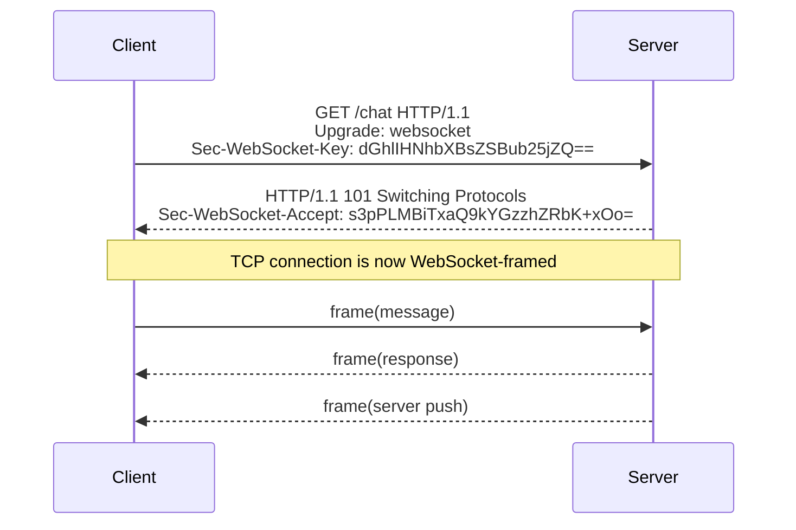
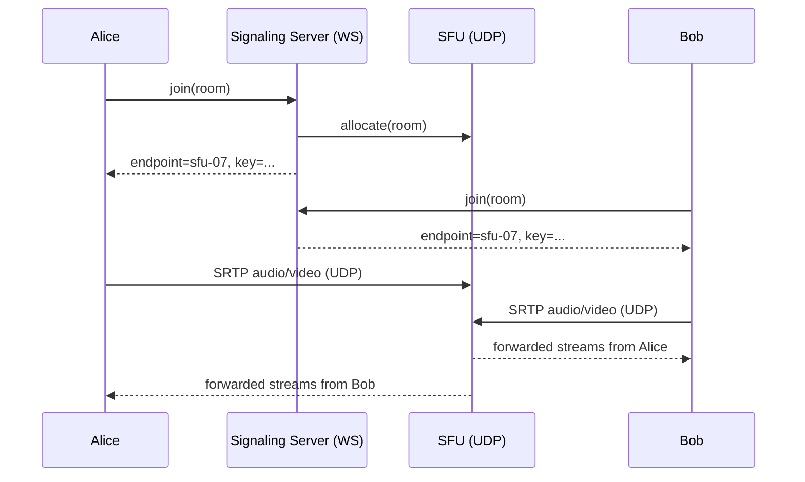
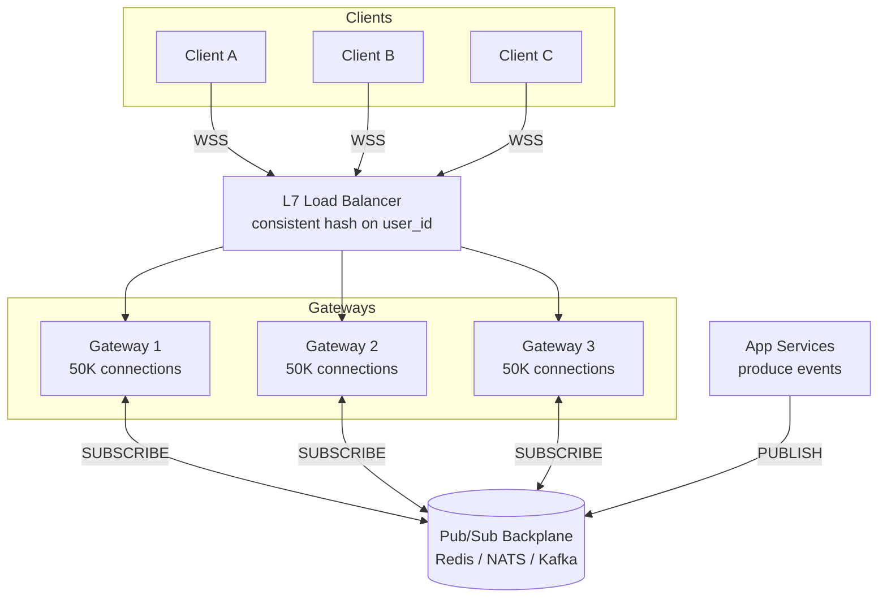
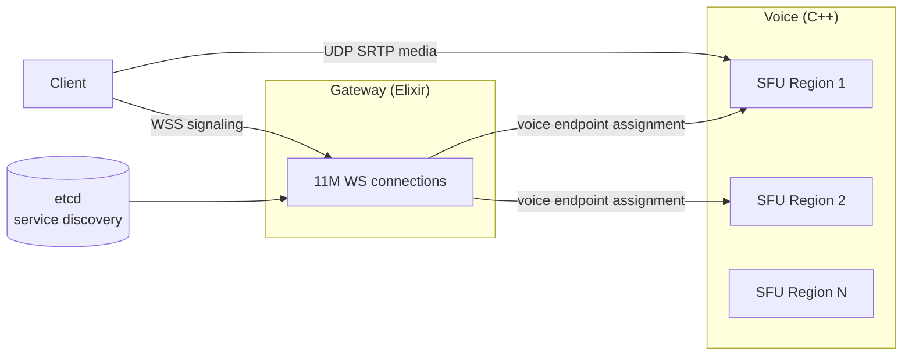

# Real-Time Communication: WebSockets, SSE, and Long Polling

> **TL;DR**: "Real-time" on the web is not one protocol but five, each trading simplicity for latency and infrastructure cost. Long polling works through any proxy but wastes headers per message. SSE gives you one-way server push with automatic reconnect for free. WebSockets (RFC 6455) give full-duplex at 2 to 14 bytes of framing overhead per message[^1]. WebRTC gives low-tens-of-milliseconds peer-to-peer media but demands STUN/TURN infrastructure[^2]. MQTT gives IoT devices delivery guarantees at 2 bytes of overhead[^3]. Use WebSockets for bidirectional chat and collaboration; SSE for server-to-client dashboards; WebRTC for voice and video; MQTT for constrained devices. The scaling axis for all persistent-connection systems is per-gateway memory, not request throughput.

## Learning Objectives

After this module, you will be able to:

- [ ] Choose between polling, long polling, SSE, WebSockets, WebRTC, and MQTT for a given use case
- [ ] Explain the WebSocket upgrade handshake and frame format (RFC 6455)
- [ ] Scale a WebSocket service horizontally with sticky routing and a pub/sub backplane
- [ ] Design reconnect, resume, and message-replay protocols with sequence-based recovery
- [ ] Identify and mitigate backpressure on slow consumers
- [ ] Reason about per-connection resource costs (file descriptors, TCP buffers, heap)

## Intuition

Imagine two ways to check if your friend is home. The first: you walk to their house every five minutes and knock. Most trips are wasted. This is polling.

The second: you call their phone and stay on the line. The moment they have something to say, you hear it instantly. No repeated trips, no wasted effort. But you are holding a phone line open the entire time, and your phone company charges per line.

That is the core tension of real-time communication. HTTP's request-response model is the repeated knocking: stateless, scalable, but blind between requests. Persistent connections (WebSockets, SSE) are the open phone line: instant delivery, but every open line consumes a file descriptor, a TCP buffer, and a slot in your server's memory. At 100,000 connections with default Linux TCP buffer sizes, you can consume over 19 GB of kernel memory on sockets before your application allocates a single byte[^4].

The rest of this chapter teaches you which "phone line" to pick, how to keep millions of them open without melting your servers, and what to do when someone hangs up unexpectedly.

## Theory

### The problem with HTTP request-response

HTTP is half-duplex by design. The client speaks, the server answers, the connection is done. If the server has new data five seconds later, it has no way to reach the client. The client must ask again.

For a stock ticker updating once per second, polling means one HTTP round-trip per second per client. Each round-trip carries hundreds of bytes of headers for a few bytes of payload. At 100,000 clients, that is 100,000 requests per second of pure overhead[^5].

The web needed server push. Five mechanisms emerged, each at a different point on the simplicity-to-capability spectrum.

### Long polling

Long polling is the simplest server-push hack. The client sends a GET request. The server holds it open (parking the coroutine or thread) until data arrives or a timeout hits (typically 30 to 60 seconds). The server responds, and the client immediately reconnects[^5].

It works through every proxy, firewall, and corporate middlebox because each message is a normal HTTP response. No protocol upgrade, no special load balancer configuration. The cost: each message pays a full HTTP round-trip with headers, and there is a brief gap between one response and the next request where messages can be missed[^5].

Use long polling as a fallback for environments where WebSockets are blocked (corporate proxies, legacy infrastructure).

### Server-Sent Events (SSE)

SSE is a one-way, server-to-client streaming protocol defined by the WHATWG HTML Living Standard. The client opens a standard HTTP GET; the server responds with `Content-Type: text/event-stream` and keeps the connection open, sending `data:` lines as events arrive[^6].

The killer feature: automatic reconnect with resume. The browser's `EventSource` API reconnects on drop and sends `Last-Event-ID` back to the server, which can replay missed events. The `retry:` field lets the server control backoff timing. A keep-alive comment line (`:`) every 15 seconds defeats proxy idle timeouts[^6].

The limitation: SSE is server-to-client only. Client-to-server still needs a separate fetch or XHR. On HTTP/1.1, browsers cap connections per origin at 6, so multiple tabs to the same SSE endpoint exhaust the budget. HTTP/2 multiplexing solves this but introduces head-of-line blocking on one TCP connection[^6].

Use SSE for live dashboards, price tickers, notification feeds, and log tails where the client only reads.

### WebSockets (RFC 6455)

WebSockets are the full-duplex answer. The client sends an HTTP/1.1 `Upgrade: websocket` request with a random `Sec-WebSocket-Key`. The server responds with 101 Switching Protocols and a `Sec-WebSocket-Accept` value (SHA-1 of the key concatenated with a fixed GUID, base64-encoded). After the handshake, the TCP connection switches to a binary framing protocol[^7][^1].

*The WebSocket handshake upgrades an HTTP connection to full-duplex framing; after 101, both sides send independently.*

Each message wraps in a 2 to 14 byte frame header. Client-to-server frames are masked with a random 32-bit key (anti-cache-poisoning). Ping/pong frames keep the connection alive. RFC 7692 adds per-message deflate compression as a negotiated extension[^7][^1].

The subprotocol field (`Sec-WebSocket-Protocol`) lets you version application protocols independently: Socket.IO, STOMP, GraphQL-WS, and MQTT-over-WS all ride on top of WebSocket framing[^7].

RFC 8441 (2018) bootstraps WebSockets over HTTP/2 via Extended CONNECT. RFC 9220 (2022) does the same for HTTP/3 over QUIC, letting a WebSocket ride a single QUIC stream alongside ordinary requests[^8][^9]. QUIC's connection migration keeps a WebSocket alive across Wi-Fi to cellular handoff because QUIC identifies connections by ID, not 5-tuple[^9].

### HTTP/2 Push (deprecated) and HTTP/3

HTTP/2 Server Push is dead. Chrome 106 disabled it by default in October 2022 after measuring adoption at 1.25% of HTTP/2 sites, dropping to 0.7%, with often-negative performance impact[^10]. It was a cache-priming mechanism (push associated resources), not a pub/sub channel. Engineers who reach for "HTTP/2 Push" hoping for WebSocket-like delivery find their traffic ignored by browsers.

The replacement for its original use case is HTTP 103 Early Hints with `Link: rel=preload` headers. For server-to-client streaming, use SSE or WebSockets[^10].

HTTP/3 over QUIC matters for real-time because it eliminates head-of-line blocking across streams. A lost packet on one WebSocket stream does not stall others sharing the same UDP connection[^11]. However, UDP is blocked on some corporate networks, so HTTP/3 needs a reliable HTTP/1.1 fallback.

### WebRTC for peer-to-peer media

WebRTC is a browser-native specification for media capture, codecs, NAT traversal, and peer-to-peer transport. It does not define signaling. Peers exchange SDP offers and ICE candidates over a channel you supply (typically a WebSocket to your server)[^12].

ICE tries three paths in order: direct UDP (host candidates), STUN (server tells the client its public IP), and TURN (relay through a server) if NAT punching fails. Media rides SRTP; DataChannels ride SCTP over DTLS over UDP[^12].

*WebRTC signaling rides your WebSocket; media rides UDP directly to the SFU, typically achieving low-tens-of-milliseconds transport latency on direct paths.*

At scale, peer-to-peer meshes become impractical beyond roughly 4 to 6 participants because each peer sends N-1 streams (total bandwidth scales as N*(N-1)). Production systems use a Selective Forwarding Unit (SFU) that receives each sender's stream once and forwards per-subscriber without transcoding[^2].

Use WebRTC for voice/video calls, gaming, and low-latency data sync. Budget for TURN bandwidth: an estimated 10 to 20% of calls may require relay on networks with restrictive NATs[^12].

### MQTT for IoT

MQTT is a publish/subscribe wire protocol (OASIS standard) designed for constrained devices with as little as 2 bytes of overhead per message. Clients connect to a central broker over TCP (or WebSocket). Three QoS levels control delivery[^3]:

- **QoS 0**: fire-and-forget (one PUBLISH, zero acks)
- **QoS 1**: at-least-once (PUBLISH then PUBACK; retransmit until acked)
- **QoS 2**: exactly-once via a four-packet handshake (PUBLISH, PUBREC, PUBREL, PUBCOMP)

QoS 2 is academically interesting but rarely used in practice. Most IoT deployments use QoS 1 with application-level deduplication because the four-round-trip cost of QoS 2 is prohibitive for high-frequency telemetry[^3]. AWS IoT Core advertises support for billions of devices and routes trillions of messages[^16].

Use MQTT for IoT telemetry, fleet tracking, and industrial sensors where battery life and bandwidth matter more than latency.

### Scaling real-time connections

The fundamental challenge: a persistent connection pins a user to a specific process. You cannot round-robin the next message to any server. Scaling requires three things:

1. **Sticky routing.** The load balancer hashes on user_id (or a signed resume token) so reconnects land on the same gateway. L7 load balancers (Envoy, Nginx) must be WebSocket-aware to avoid closing idle connections[^13].

2. **A pub/sub backplane.** When user A sends a message to user B, and they are on different gateways, the backplane (Redis Pub/Sub, NATS, Kafka) routes the event to B's gateway. Every gateway subscribes to channels relevant to its connected users[^14][^15].

3. **Kernel tuning.** Each WebSocket is one file descriptor plus TCP send/receive buffers. With default Linux TCP buffer maximums (~128 KB receive, ~64 KB send), 100,000 connections can consume tens of gigabytes of kernel memory. Production systems shrink `tcp_rmem` and `tcp_wmem` to 4-16 KB for mostly-idle sockets, raise `fs.file-max` to 12M+, and set `ulimit -n` to 20M[^4].

*Sticky routing pins each client to one gateway; the pub/sub backplane makes any gateway able to deliver any channel's messages.*

For graceful deploys: the draining gateway sends a WebSocket close frame with code 1001 and a hint (e.g., a new endpoint URL). Clients reconnect with exponential backoff plus jitter to avoid a thundering herd[^13][^17].

## Real-World Example

**Discord: 11 million concurrent users on Elixir, more than 2.6 million concurrent voice users on WebRTC.**

Every online Discord client holds a WebSocket to a Gateway service written in Elixir on the BEAM VM. At peak, this service handles 11 million concurrent users[^18]. The BEAM's lightweight process model (one Erlang process per connection, scheduled cooperatively across cores) makes this possible without thread-pool exhaustion.

When Elixir's immutable data structures became bottlenecks at scale, Discord replaced critical paths with Rust NIFs via Rustler. A sorted set for guild member lists dropped worst-case insertion from 640 microseconds (a custom Elixir `OrderedSet` at 250,000 elements) to 3.68 microseconds in Rust (tested at sizes from 5,000 to 1,000,000 items)[^18].

For voice, Discord runs a separate fleet of more than 850 servers across 13 regions handling more than 2.6 million concurrent voice users, more than 220 Gbps egress, and 120 million packets per second[^19]. They skip standard WebRTC ICE negotiation entirely. Every client connects directly to a C++ SFU (Selective Forwarding Unit) whose endpoint is assigned by service discovery in etcd. This eliminates NAT traversal complexity and hides client IPs from other participants (DDoS defense)[^19].

The architecture separates signaling (Elixir, over the existing gateway WebSocket) from media (C++, over UDP). If the SFU crashes, the signaling process reconstructs state and pushes a new endpoint to clients without requiring full reconnection[^19].

For DDoS mitigation on voice servers: Discord detects traffic spikes, removes the node from etcd service discovery, migrates voice state to a new server, and notifies clients of the new endpoint over the gateway WebSocket. This is automated and routine[^19].

*Discord separates signaling (Elixir WebSocket gateway) from media (C++ SFU over UDP), scaling each independently.*

The lesson: at Discord's scale, the WebSocket gateway is a routing and presence layer. Heavy work (media forwarding, sorted-set operations) is offloaded to specialized processes in languages optimized for that workload.

## Trade-offs

| Approach | Direction | Overhead | Reconnect | Best when | Our Pick |
|---|---|---|---|---|---|
| Long polling | Bidirectional (awkward) | Full HTTP headers per message | Client re-GETs immediately | Fallback for blocked WS; legacy proxies | Fallback only |
| SSE | Server to client | HTTP stream, auto-reconnect | Built-in Last-Event-ID | Dashboards, tickers, notifications | Server-push-only use cases |
| WebSocket | Full-duplex | 2-14 bytes per frame | Manual (resume token + replay) | Chat, multiplayer, collab editing | Default for bidirectional real-time |
| WebRTC | Peer-to-peer | UDP, SRTP | ICE restart | Voice/video, gaming, P2P data | Media and ultra-low-latency data |
| MQTT | Pub/sub (broker) | 2 bytes minimum | Persistent sessions (QoS 1/2) | IoT, constrained devices, fleet telemetry | IoT with delivery guarantees |

**Decision rule:** Start with SSE if you only need server-to-client. Move to WebSockets the moment you need bidirectional communication or binary framing. Use WebRTC only for media or when you need sub-50 ms P2P latency. Use MQTT for IoT devices where battery and bandwidth are primary constraints.

## Common Pitfalls

> [!WARNING]
> **Load balancer idle timeouts kill WebSockets.** Most L4/L7 load balancers default to 60-second idle timeouts. A WebSocket with no traffic for 61 seconds gets silently closed. Configure WebSocket-aware idle timeouts (5+ minutes) and use ping/pong frames every 30 seconds to keep the connection alive.

> [!WARNING]
> **Thundering herd on reconnect.** When a gateway restarts, every disconnected client reconnects simultaneously. Naive clients with fixed 1-second delays produce a 100,000-connection spike in a 100 ms window. Use exponential backoff with full jitter: `sleep = random(0, min(cap, base * 2^attempt))`[^13][^17]. Slack's Flannel absorbs reconnect storms at the edge by serving cached team data without fanning out to origin[^14].

> [!WARNING]
> **Per-connection memory exhaustion.** Each WebSocket is one file descriptor plus TCP buffers that can reach ~192 KB at default maximums. At 100,000 connections, that can consume tens of gigabytes of kernel memory before your application allocates a single byte. Shrink `tcp_rmem` and `tcp_wmem` to 4-16 KB for idle sockets. The Phoenix team hit this wall repeatedly on their road to 2 million connections[^4].

> [!WARNING]
> **Sticky sessions break on mobile IP changes.** Hashing on source IP fails when mobile clients switch from Wi-Fi to cellular. Use a signed resume token (user_id + last sequence number) as the sticky key. Persist a sliding window of recent messages in Redis so any gateway can replay on resume[^15].

> [!WARNING]
> **Backpressure on slow consumers.** A slow mobile client on a poor network stops ACKing. The server's kernel send buffer fills. Naive servers queue unboundedly, growing RSS until OOM. Check `getBufferedAmount()` (or equivalent) per client. If it exceeds a threshold (e.g., 1 MB), drop non-critical events (typing indicators) or disconnect with a snapshot-on-resume hint[^20].

> [!WARNING]
> **Browser 6-connection limit with SSE on HTTP/1.1.** Opening multiple tabs to the same SSE endpoint exhausts the per-origin connection budget. Users see "stuck" tabs. Use HTTP/2 (multiplexed streams) or switch to WebSockets for multi-tab applications[^6].

## Exercise

> **Design Challenge:** You are building real-time chat for 10 million concurrent users. Messages must deliver in under 100 ms p99. Users reconnect gracefully after network drops without missing messages. The system must handle gateway deploys without user-visible disruption. Design the protocol choice, gateway architecture, pub/sub backplane, and reconnect strategy.

Hint

Think about what happens when a gateway process restarts. Where are the messages between "old gateway dies" and "client reconnects to new gateway"? You need a durable buffer outside the gateway process.

Solution

**Protocol choice:** WebSockets for bidirectional messaging. SSE is insufficient because clients send messages too.

**Gateway architecture:** A fleet of stateless-ish gateway servers, each holding 200,000 to 500,000 connections (tuned kernel, 8-16 KB TCP buffers). L7 load balancer (Envoy) with consistent hashing on a signed session token. Each gateway subscribes to relevant channels on the pub/sub backplane.

**Pub/sub backplane:** Redis Streams (not Redis Pub/Sub, which drops messages on disconnect). Each channel is a Redis Stream keyed by `channel:{id}`. Gateways subscribe via `XREADGROUP`. Messages persist for a configurable window (e.g., 24 hours).

**Reconnect strategy:** Each message carries a monotonic sequence number per channel. On reconnect, the client sends `last_ack=N`. The new gateway queries Redis Streams for messages with sequence > N and replays them before resuming the live stream. This handles both network drops and gateway deploys.

**Graceful deploy:** The draining gateway sends WebSocket close code 1001 with a JSON body containing the new gateway endpoint (from the load balancer's health check). Clients reconnect with jittered backoff (base 100 ms, cap 5 seconds). The pub/sub backplane ensures no messages are lost during the transition because they are persisted in Redis Streams independently of gateway lifetime.

**Capacity math:** 10M connections / 500K per gateway = 20 gateway instances minimum. At 3x headroom for deploys and spikes: 60 gateways. Each gateway needs ~8 GB RAM (500K connections * 16 KB buffers). Redis Streams cluster sized for peak write QPS (assume 1M messages/sec at 500 bytes = 500 MB/s, partitioned across 10 Redis nodes).

## Key Takeaways

- WebSockets are the default for bidirectional real-time. SSE is underrated for server-to-client-only use cases and requires zero client libraries.
- The WebSocket handshake is a standard HTTP Upgrade; after 101, framing overhead drops to 2-14 bytes per message.
- Persistent-connection services scale on per-gateway resources (file descriptors, TCP buffers, heap), not request throughput. Tune the kernel.
- Sticky routing plus a pub/sub backplane is the canonical horizontal scaling pattern for WebSocket fleets.
- Design reconnect into the protocol from day one: sequence numbers, server-side message buffers, and exponential backoff with jitter.
- HTTP/2 Server Push is dead (Chrome 106, 2022). Do not confuse it with server-to-client streaming.
- WebRTC is not a WebSocket replacement. It is a peer-to-peer media layer with a WebSocket signaling channel underneath.

## Further Reading

- [RFC 6455: The WebSocket Protocol](https://datatracker.ietf.org/doc/html/rfc6455) - the authoritative spec; read sections 4 (handshake), 5 (framing), and 7 (closing) to understand what your library abstracts away.
- [Server-Sent Events, WHATWG HTML Living Standard](https://html.spec.whatwg.org/multipage/server-sent-events.html) - includes the parsing algorithm and Last-Event-ID semantics; surprisingly short and readable.
- [Discord: Using Rust to Scale Elixir for 11 Million Concurrent Users](https://discord.com/blog/using-rust-to-scale-elixir-for-11-million-concurrent-users) - the specific Rust NIF numbers and BEAM tuning that made Discord's gateway possible.
- [Discord: How Discord Handles Two and Half Million Concurrent Voice Users using WebRTC](https://discord.com/blog/how-discord-handles-two-and-half-million-concurrent-voice-users-using-webrtc) - the best public description of a production SFU architecture with DDoS automation.
- [Slack Engineering: Flannel Edge Cache](https://slack.engineering/flannel-an-application-level-edge-cache/) - reconnect storm mitigation at 4M simultaneous connections; the edge-cache pattern for WebSocket metadata.
- [The Road to 2 Million WebSocket Connections in Phoenix](https://phoenixframework.org/blog/the-road-to-2-million-websocket-connections) - deep kernel tuning, BEAM VM story, and every resource ceiling you will hit on the way to millions of connections.
- [WebRTC for the Curious (Sean DuBois)](https://webrtcforthecurious.com/) - free book; the best first read on ICE/STUN/TURN/SDP for engineers who have never touched WebRTC.
- [uWebSockets.js Backpressure Example](https://github.com/uNetworking/uWebSockets.js/blob/master/examples/Backpressure.js) - the most honest comment in any WebSocket library: "Any slow receiver can DOS your whole server if you are not taking backpressure into account."

## Flashcards

**Q:** What is the per-message framing overhead of WebSocket (RFC 6455)?
**A:** 2 to 14 bytes per frame, depending on payload length and whether masking is applied (client-to-server frames are always masked with a 4-byte key).

**Q:** How does the WebSocket handshake work?
**A:** The client sends an HTTP/1.1 GET with `Upgrade: websocket` and a random `Sec-WebSocket-Key`. The server responds 101 Switching Protocols with `Sec-WebSocket-Accept` (SHA-1 of key + fixed GUID, base64-encoded). After 101, the TCP connection uses WebSocket framing.

**Q:** What is the key advantage of SSE over WebSockets for server-to-client push?
**A:** SSE has built-in automatic reconnect with `Last-Event-ID` resume in the browser's `EventSource` API. No client library needed, works through any HTTP proxy, and the server controls retry timing via the `retry:` field.

**Q:** Why does HTTP/2 Server Push not work for real-time streaming?
**A:** It was a cache-priming mechanism for associated resources, not a pub/sub channel. Chrome 106 disabled it by default in October 2022 due to low adoption (1.25%, dropping to 0.7%) and often-negative performance.

**Q:** What three things do you need to scale WebSockets horizontally?
**A:** (1) Sticky routing so reconnects land on the same gateway, (2) a pub/sub backplane so any gateway can deliver any channel's messages, and (3) kernel tuning to handle hundreds of thousands of file descriptors and shrunk TCP buffers per process.

**Q:** How does Discord handle WebRTC at scale without ICE negotiation?
**A:** Every client connects directly to a C++ SFU whose endpoint is assigned via etcd service discovery. Since all peers connect to the SFU (not to each other), NAT traversal is deterministic and ICE is unnecessary. This also hides client IPs for DDoS defense.

**Q:** What is backpressure in a WebSocket server and how do you handle it?
**A:** When a slow client stops ACKing, the server's kernel send buffer fills and application-level queues grow unboundedly. Handle it by checking `getBufferedAmount()` per client; if it exceeds a threshold, drop non-critical events or disconnect with a resume hint.

**Q:** What kernel parameters must be tuned for millions of WebSocket connections?
**A:** Raise `fs.file-max` (12M+), `ulimit -n` (20M), and shrink per-socket TCP buffers (`tcp_rmem`, `tcp_wmem` to 4-16 KB) so idle sockets fit in memory. The Phoenix team documented hitting every one of these ceilings on the road to 2M connections.

**Q:** When should you use MQTT instead of WebSockets?
**A:** For IoT and constrained devices where battery life and bandwidth matter more than latency. MQTT has 2-byte minimum overhead, QoS levels for delivery guarantees, persistent sessions for offline subscribers, and broker-managed topic routing.

**Q:** What is the thundering herd problem in WebSocket systems?
**A:** When a gateway restarts, all disconnected clients reconnect simultaneously, overwhelming surviving gateways and auth services. Mitigate with exponential backoff plus full jitter on the client, and edge caches (like Slack's Flannel) that absorb reconnect metadata requests without hitting origin.

**Q:** How does SSE handle missed messages during a disconnect?
**A:** Each event carries an `id:` field. On reconnect, the browser sends `Last-Event-ID` in the request header. The server replays all events with ID greater than the last-seen value.

**Q:** What is the browser connection limit that affects SSE on HTTP/1.1?
**A:** Browsers cap HTTP/1.1 connections per origin at 6. Multiple tabs to the same SSE endpoint exhaust this budget, causing "stuck" tabs. HTTP/2 multiplexing solves this by sharing one TCP connection across streams.

**Q:** What are the three QoS levels in MQTT?
**A:** QoS 0 is fire-and-forget (no ack). QoS 1 is at-least-once (PUBLISH + PUBACK, retransmit until acked). QoS 2 is exactly-once via a four-packet handshake (PUBLISH, PUBREC, PUBREL, PUBCOMP). In practice, most deployments use QoS 1 with application-level dedup.

**Q:** How many concurrent WebSocket connections did Phoenix achieve on a single 40-core server?
**A:** 2 million connections on a 40-core, 128 GB box, limited by `ulimit` at that point. Key tunings: `fs.file-max=12000500`, `ulimit -n 20000000`, and TCP buffer sizes shrunk to 4-16 KB per socket.

**Q:** What replaced HTTP/2 Server Push for its original resource-hint use case?
**A:** HTTP 103 Early Hints with `Link: rel=preload` headers. The server sends a preliminary response with preload hints while still computing the real response.

## References

[^1]: I. Fette and A. Melnikov, "The WebSocket Protocol", RFC 6455, IETF, December 2011. https://datatracker.ietf.org/doc/html/rfc6455
[^2]: Mazed, "Scaling WebRTC for Thousands of Concurrent Voice Agents". https://www.mazed.ai/blog/scaling-webrtc-concurrent-voice-agents
[^3]: HiveMQ, "What is MQTT Quality of Service (QoS) 0,1, & 2? MQTT Essentials Part 6". https://www.hivemq.com/blog/mqtt-essentials-part-6-mqtt-quality-of-service-levels/
[^4]: Gary Rennie, "The Road to 2 Million Websocket Connections in Phoenix", Phoenix Framework blog, November 2015. https://phoenixframework.org/blog/the-road-to-2-million-websocket-connections
[^5]: WebSocket.org comparison guides, "WebSockets vs Long Polling" and "WebSockets vs SSE". https://websocket.org/guides/websocket-protocol/
[^6]: WHATWG, "HTML Living Standard, section 9.2 Server-sent events". https://html.spec.whatwg.org/multipage/server-sent-events.html
[^7]: Matthew O'Riordan, "WebSocket Protocol: RFC 6455 Handshake, Frames & More", WebSocket.org. https://websocket.org/guides/websocket-protocol/
[^8]: P. McManus, "Bootstrapping WebSockets with HTTP/2", RFC 8441, IETF, September 2018. https://datatracker.ietf.org/doc/html/rfc8441
[^9]: R. Hamilton, "Bootstrapping WebSockets with HTTP/3", RFC 9220, IETF, June 2022. https://www.rfc-editor.org/rfc/rfc9220
[^10]: Barry Pollard, "Remove HTTP/2 Server Push from Chrome", Chrome for Developers blog, August 2022. https://developer.chrome.com/blog/removing-push
[^11]: HTTP.dev, "HTTP/3 explained" (summary of RFC 9114). https://http.dev/3
[^12]: MDN Web Docs, "Introduction to WebRTC protocols". https://developer.mozilla.org/en-US/docs/Web/API/WebRTC_API/Protocols
[^13]: Matthew O'Riordan, "WebSocket Reconnection: State Sync and Recovery Guide", WebSocket.org, March 2026. https://websocket.org/guides/reconnection/
[^14]: Bing Wei, "Flannel: An Application-Level Edge Cache to Make Slack Scale", Slack Engineering, 2017. https://slack.engineering/flannel-an-application-level-edge-cache/
[^15]: Sameera Thangudu, "Real-time Messaging", Slack Engineering, April 2023. https://slack.engineering/real-time-messaging/
[^16]: AWS, "AWS IoT Core documentation and pricing". https://aws.amazon.com/iot-core/pricing/
[^17]: Evil Martians, "Connection avalanche safety tips and prepping for real-time applications". https://evilmartians.com/chronicles/connection-avalanche-safety-tips-and-prepping-for-realtime-applications
[^18]: Matt Nowack, "Using Rust to Scale Elixir for 11 Million Concurrent Users", Discord Engineering, May 2019. https://discord.com/blog/using-rust-to-scale-elixir-for-11-million-concurrent-users
[^19]: Jozsef Vass, "How Discord Handles Two and Half Million Concurrent Voice Users using WebRTC", Discord Engineering, September 2018. https://discord.com/blog/how-discord-handles-two-and-half-million-concurrent-voice-users-using-webrtc
[^20]: uNetworking, "uWebSockets.js Backpressure example", GitHub. https://github.com/uNetworking/uWebSockets.js/blob/master/examples/Backpressure.js
