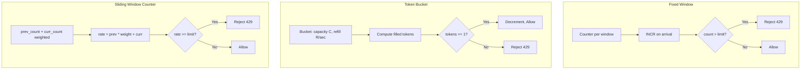
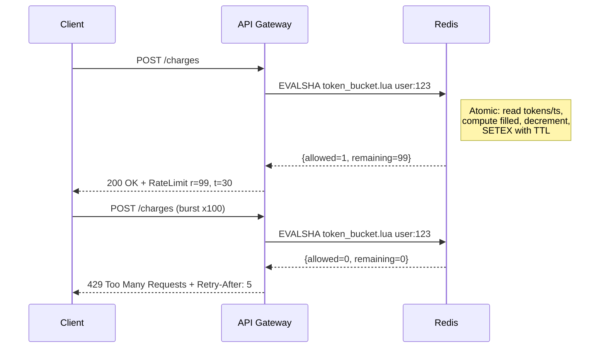
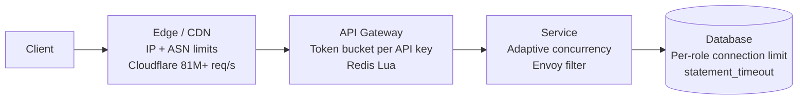
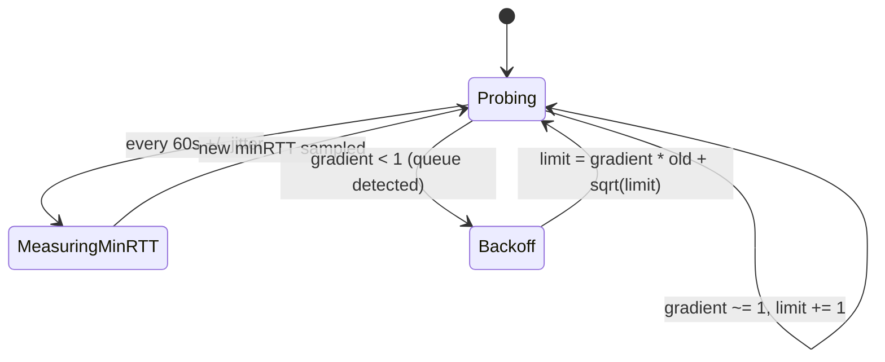

# Rate Limiting: Protecting Systems from Themselves

> **TL;DR**: Rate limiting caps how often a principal (user, API key, IP, tenant) can call an API within a time window and rejects the excess with HTTP 429. Token bucket is the default algorithm: it allows bursts up to a configured capacity and refills at a steady rate. Use centralized Redis with a Lua script for atomicity at moderate scale[^1], sliding window counters at the edge for global scale[^2], and adaptive concurrency limits (Netflix Vegas-style) when you cannot predict the safe rate in advance[^3]. Always return `Retry-After` on 429. Separate rate limits (abuse prevention, per-second) from quotas (billing, per-month): they share infrastructure but have different reset semantics.

## Learning Objectives

After this module, you will be able to:

- [ ] Implement token bucket, leaky bucket, fixed window, and sliding window rate limiters
- [ ] Choose a rate-limit key scheme (per-user, per-API-key, per-IP, per-tenant)
- [ ] Make a rate limiter distributed without turning Redis into a bottleneck
- [ ] Communicate limits to clients via standard HTTP headers and response codes
- [ ] Combine rate limiting with circuit breaking, load shedding, and quotas

## Intuition

You are the bouncer at a nightclub with a fire-code capacity of 200. You let people in one at a time, counting heads. When the count hits 200, the rope goes up and nobody enters until someone leaves. That is a fixed-window rate limiter.

Now imagine a highway toll plaza. Cars arrive in bursts (rush hour) and trickles (3 AM). The toll booth does not care about bursts as long as the average throughput stays below the road's capacity. It lets a cluster of cars through quickly, then slows the next batch. That is a token bucket: you accumulate tokens while idle, spend them during bursts, and once they are gone you wait for refills.

Both models solve the same problem: protecting a finite resource from unbounded demand. In software, the resource is your API server, your database connection pool, or your downstream dependency. The demand is every client, script, and bot on the internet. Without a limiter, one runaway script can saturate your entire fleet, and you cannot distinguish it from a DDoS attack until it is too late.

The rest of this chapter gives you the algorithms, the distributed infrastructure, and the production patterns to build that bouncer into your system.

## Theory

### Why rate limit

Rate limiting defends against three classes of failure that a backend cannot otherwise distinguish[^4]:

1. **Malicious abuse** - credential stuffing, scraping, L7 DDoS.
2. **Accidental abuse** - a developer's runaway loop, a retry storm from a broken client.
3. **Cost runaway** - one tenant's batch job starving every other customer of shared capacity.

Beyond defense, rate limits enable **monetization** (free tier: 100 req/min, pro: 1,000 req/min) and **SLO protection** (if your database handles 50K QPS, you cannot let clients push 80K through the gateway).

Stripe draws a sharp distinction: a rate limiter shapes the rate of well-behaved traffic from a single actor, while a load shedder looks at the whole system and drops low-priority work when resources saturate[^4]. Both live in the same request path but answer different questions.

### Algorithms

Six algorithms dominate production. They differ in state per key, burst tolerance, and atomicity requirements.

**Fixed window.** Store one counter per (key, window start). INCR on arrival, reject if over limit. One integer per key. The fatal flaw: at the window boundary, a client can fire N requests at 11:00:59 and N more at 11:01:00, admitting 2N in one second[^5]. Figma rejected it for exactly this reason[^6].

**Sliding window log.** Store a sorted set of every request timestamp. Count members within the window on each request. Exact, but memory is O(limit * keys). Figma calculated that 500 req/day/user over 10,000 users would require ~20 MB in Redis just for timestamps[^6]. Use for security-critical, low-volume endpoints (login).

**Sliding window counter.** Keep counters for the current and previous bucket, then weight them: `rate = prev_count * ((window - elapsed) / window) + curr_count`[^2]. Two integers per key. Cloudflare measured this across 400 million requests and 270,000 distinct sources: 0.003% error rate, average 6% gap between true and observed rate, zero false positives[^2]. This is the production-proven choice at edge scale.

**Token bucket.** A bucket of capacity C refills at rate R tokens/sec. Each request takes one token; reject if empty. Allows bursts up to C and steady rate R. Stripe sets C = 5 * R so a user with a 100 req/sec limit can burst to 500[^1]. This is the industry default. Use it unless you have a specific reason not to.

**Leaky bucket.** A queue of capacity C drains at constant rate R. Requests enqueue on arrival; if full, reject. Output rate is constant. NGINX `limit_req` uses this with zero burst by default[^7]. Harsher on clients than token bucket because it smooths rather than absorbs bursts.

**GCRA (Generic Cell Rate Algorithm).** The leaky bucket formalized as virtual scheduling. State is a single scalar: the Theoretical Arrival Time (TAT). On arrival at time t_now: allow if `t_now >= TAT - tau`, then set `TAT = max(t_now, TAT) + T` where T = period/limit[^8]. Implemented in `redis-cell` as the `CL.THROTTLE` command, benchmarked at ~0.1 ms per command[^9]. Reach for GCRA only when you need precise smoothing with minimal state.



*Three algorithm families: fixed window is simplest but bursty at boundaries; token bucket absorbs bursts naturally; sliding window counter approximates exactness with two integers.*

### Distributed rate limiting

A single-process counter is trivial. The hard problem is making the counter consistent across a fleet of servers that all see parts of the same user's traffic.

**Central Redis with Lua.** The simplest correct design. A Lua script runs atomically inside Redis (single-threaded execution), collapsing read-modify-write into one round trip. Stripe's production token-bucket Lua is about 26 lines: read tokens and last_refreshed, compute filled tokens, check requested, write back, return allowed/remaining[^10]. Typical round-trip: 0.1 to 0.5 ms for a local cluster. Redis failure rate in Stripe's production: 0.01%, and they fail open on those[^1].

**Dedicated rate-limit service.** Envoy's global rate limit filter calls a gRPC Rate Limit Service (RLS) over a long-lived stream; Lyft's reference RLS uses Redis as the backend[^11]. Gubernator (Mailgun, open source) runs a cluster of stateless peers, consistent-hashes each key to an owning peer, holds counters in memory, and batches hits in 500-microsecond windows (up to 1,000 requests per batch at peak)[^12]. For hot global keys, Gubernator's `GLOBAL` behavior answers from a local replica and asynchronously gossips hits to the owner, trading exact counts for scale.

**Cell-based local counters.** Cloudflare evaluates rate limits at 330+ PoPs. Inside each PoP, a Twemproxy/memcached cluster consistent-hashes counters across servers. Once a limiter trips, each server caches the "mitigation active" flag in process memory, so subsequent rejected requests short-circuit without a memcached round-trip. This is how a 400,000 req/sec attack does not crush their own counter layer[^2].



*The Lua EVALSHA runs atomically inside Redis, collapsing four operations (get tokens, get timestamp, compute, setex both) into one network round trip.*

### Where to enforce

Most production stacks layer limits at multiple points, trading context for reach:



*Coarse limits live at the edge with minimal context; precise limits at the gateway with auth context; adaptive concurrency at the service with latency signals.*

The edge has the best blast-radius (rejects before your infrastructure even sees the traffic) but the least context about the user's tier or session. The gateway has auth context but adds a hop. The service has the most context but protects only itself. Database-level throttles (Postgres `statement_timeout`, per-role connection limits) are the last line and most correct but the latest to fire[^13].

### Client behaviors

RFC 6585 defines HTTP 429 Too Many Requests and permits (via "MAY include") a `Retry-After` header; the RFC's SHOULD applies to explanatory details, not Retry-After itself[^14]. The IETF `draft-ietf-httpapi-ratelimit-headers-10` (2025) standardizes two structured fields: `RateLimit-Policy` (quota and window) and `RateLimit` (remaining and reset)[^15].

Legacy headers are widespread: GitHub returns `x-ratelimit-limit`, `x-ratelimit-remaining`, `x-ratelimit-used`, `x-ratelimit-reset` (UTC epoch seconds)[^16]. Slack returns 429 with a `Retry-After` header (e.g., 30 seconds)[^17].

Well-behaved clients implement capped exponential backoff with full jitter: `sleep = random(0, min(cap, base * 2^attempt))`. Marc Brooker's 2015 AWS simulation showed full jitter reduced total call count by more than half versus un-jittered backoff across 100 competing clients[^18]. Most AWS SDKs ship this today.

Sustained 429 should trip a client-side circuit breaker, not just sustained 5xx. Tight-looping through 429 is just as load-inducing as tight-looping through 503.

### Adaptive and concurrency limits

Static rate limits become stale as topology changes (auto-scaling, partial outages, code pushes that change latency). Netflix Concurrency Limits (2018) infers the safe operating point from measured latency using a TCP-Vegas-style gradient[^3]:

`gradient = minRTT / sampleRTT`

A gradient of 1 means no queuing. Less than 1 means a queue has formed. The limit updates as `newLimit = currentLimit * gradient + sqrt(limit)`. After convergence, the algorithm holds the limit where p99 latency just starts to rise. Netflix reports it stops retry storms from cascading and rejects excess load in sub-millisecond time[^3].

Envoy ships the same idea as the `adaptive_concurrency` HTTP filter with a Gradient Controller: measures minRTT every 60 seconds (with 0 to 10% jitter to avoid cluster-wide synchronization), then adjusts the concurrency limit each sample window[^13].



*The adaptive concurrency filter probes upward while latency is flat, then drops the limit when gradient falls below 1; the sawtooth tracks the real ceiling as it moves with auto-scaling events.*

## Real-World Example

**Stripe's four-layer rate limiting architecture** is the most thoroughly documented production system in this space[^1][^10].

**Layer 1: Request Rate Limiter.** Token bucket, capacity = 5x replenish rate, keyed per user. Implemented as a ~26-line Lua script against Redis (ElastiCache). The script reads tokens and last_refreshed, computes filled tokens based on elapsed time, checks if the request fits, decrements, and writes back with a TTL of 2x fill_time. The entire read-modify-write is atomic because Redis runs Lua single-threaded.

**Layer 2: Concurrent Request Limiter.** A Redis sorted set of in-flight request IDs per user. ZCARD to check count, ZADD to enter, ZREM on completion, ZREMRANGEBYSCORE to reap crashed requests whose timestamps exceed a timeout. This catches users who open thousands of slow connections rather than sending fast bursts.

**Layer 3: Fleet Usage Load Shedder.** Identical to the concurrent limiter but with a global key. Reserves a fraction of workers for critical requests (creating charges) when the fleet is under pressure.

**Layer 4: Worker Utilization Load Shedder.** Local per-process. When worker utilization exceeds 0.8, linearly sheds traffic (test-mode first, then GETs, then POSTs, critical last), ramping over 120 seconds to avoid flapping[^19].

**Key engineering decisions:**

- **Fail open on Redis errors.** The limiter must not take down the API. Redis failure rate: 0.01%[^1].
- **Dark launch every new limiter.** Measure what it would have blocked, tune thresholds, then enforce.
- **Kill switch per limiter** (feature flag) so ops can disable any tier during an incident.
- **Lua over MULTI/WATCH.** Optimistic concurrency collapses under contention; Lua is always atomic.

Per their blog post, Stripe reports rejecting "millions of requests this month" of test-mode traffic alone through Layer 1, and 12,000 requests/month through the concurrent limiter[^1].

## Trade-offs

### Algorithm

| Algorithm | Accuracy | Memory/Key | Burst Tolerance | Best When | Our Pick |
|---|---|---|---|---|---|
| Token bucket | High | 2 values | Excellent (capacity C) | General-purpose API limits | **Default choice** |
| Sliding window counter | ~94% (6% gap) | 2 integers | Good (weighted) | High-scale edge (Cloudflare) | When central Redis is infeasible |
| GCRA | Exact (rolling) | 1 scalar | Configurable (tau) | Precise smoothing, minimal state | When you need rolling-window exactness |
| Fixed window | Exact within window | 1 integer | Poor (2x at boundary) | Coarse, non-critical counters | Daily-quota counters where 2x boundary burst is acceptable |
| Sliding window log | Exact | O(limit) | Exact | Security-critical low-volume endpoints | Login, payment auth only |

### Enforcement point

| Enforcement Point | Context | Latency Added | Blast Radius | Our Pick |
|---|---|---|---|---|
| Edge (CDN/WAF) | IP, ASN, headers | ~0 ms (inline) | Best (rejects before infra) | Coarse abuse limits |
| API Gateway | Auth token, tier, endpoint | 0.1 to 0.5 ms (Redis) | Good | Precise per-user limits |
| Service (sidecar) | Full request context, latency | Sub-ms (local) | Per-instance only | Adaptive concurrency |
| Database | Connection, query cost | N/A (last line) | Narrowest | Connection pool guard |

## Common Pitfalls

> [!WARNING]
> **Fixed-window boundary bursts.** A client fires N requests at 11:00:59 and N more at 11:01:00, admitting 2N in one second. Every throttled client whose reset points at the same instant creates a synchronized spike. Use sliding windows or add jitter to reset values[^5].

> [!WARNING]
> **Per-IP limits breaking shared NAT.** A dorm, office, or mobile CGNAT shares one IP among thousands of users. A strict per-IP limit either blocks everyone or is set so loose it does nothing. Use composite keys (IP + session cookie, IP + JA3 TLS fingerprint). Cloudflare specifically calls out carrier-grade NAT as why IP-only limiting is insufficient[^20].

> [!WARNING]
> **Amplification from retries without Retry-After.** Client gets 429, immediately retries, gets 429, retries again. Retry traffic doubles every failure instead of halving. Always include `Retry-After` on 429. In clients, implement capped exponential backoff with full jitter[^18].

> [!WARNING]
> **Counter leaks from failed requests.** A request consumes a token, times out downstream, and the client retries. The server counted it twice. Over time, limits are tighter than advertised. Refund on failure (decrement on 5xx) or use a lease-and-release pattern like Stripe's ZADD/ZREM[^10].

> [!WARNING]
> **Over-tight limits breaking bursty traffic.** A legitimate user runs a nightly batch job that looks like abuse to a tight-moving-average limiter. Publish both a burst cap and a sustained rate. Token bucket with capacity much greater than refill rate (Stripe's 5x) absorbs exactly this pattern[^1].

> [!WARNING]
> **Ignoring shared tenants in multi-tenant systems.** One noisy tenant's batch job starves every other customer. Use per-tenant keys with per-endpoint sub-limits. GitHub layers 5,000/hr primary, 100 concurrent, 900 points/min secondary, and 80 content-creations/min onto the same user[^16].

## Exercise

**Design a rate limiter** for a public API with the following requirements: 1,000 requests/minute per API key, burst allowance of 200 requests, 100 million active keys, two regions, and a 30-second SLO for limit changes taking effect. Specify: algorithm, key scheme, storage, where it runs, and what headers you return on throttle.

<details>
<summary>Hint</summary>

Token bucket naturally models "1,000/min sustained with 200 burst." Think about how many Redis keys 100M active users produce, whether one Redis cluster can handle the QPS, and what happens when a user hits both regions simultaneously.

</details>

<details>
<summary>Solution</summary>

**Algorithm:** Token bucket. Capacity C = 200 (burst allowance). Refill rate R = 1000/60 = 16.67 tokens/sec. A user who has been idle accumulates up to 200 tokens and can burst; steady-state throughput is capped at ~16.67 req/sec.

**Key scheme:** `(api_key, endpoint_class)`. The primary limit is per-key global. A secondary per-endpoint limit (e.g., write endpoints at 100/min) prevents one endpoint from consuming the entire budget.

**Storage:** Redis cluster with hash-slot sharding. Each key stores two values (tokens + last_refreshed) via a Lua EVALSHA script. 100M keys *2 values* 8 bytes = ~1.6 GB, well within a single Redis cluster's memory. At 1,000 req/min per key with 100M keys, worst-case QPS is enormous, but active keys at any moment are far fewer. Size the cluster for peak concurrent active keys (likely 1 to 5M), giving 16M to 83M Redis ops/sec, which requires 3 to 8 Redis primaries with replicas.

**Where it runs:** API Gateway layer. The gateway has the API key from the auth header and can resolve the tier (free/pro/enterprise) from a local cache. A coarse IP-based limit at the edge (Cloudflare) blocks volumetric attacks before they reach the gateway.

**Two-region consistency:** Each region runs its own Redis cluster. A user hitting both regions simultaneously gets 2x the intended limit in the worst case. Accept this (cell-based approximation) or route each API key to a home region via consistent hashing at the load balancer. For most APIs, the 2x worst-case is acceptable because legitimate users rarely split traffic across regions.

**30-second SLO for limit changes:** Store tier-to-limit mappings in a config service with a 30-second TTL local cache at each gateway. When an admin changes a limit, the new value propagates within one cache TTL.

**Headers returned on 429:**

```http
HTTP/1.1 429 Too Many Requests
Retry-After: 4
RateLimit: "default";r=0;t=4
RateLimit-Policy: "default";q=1000;w=60
```

</details>

## Key Takeaways

- Token bucket is the default rate-limit algorithm. Start there and rarely regret it. Set capacity to 3 to 5x the refill rate for burst tolerance.
- Per-key Redis counters with Lua scripts work until Redis becomes the bottleneck (~100K req/s per primary); then cell-based or sharded approaches take over.
- Always return `Retry-After` on 429. Without it, clients retry in tight loops and amplify the overload.
- Separate rate limits (abuse prevention, per-second reset) from quotas (billing, monthly reset) even if they share infrastructure. They have different reset semantics and audit needs.
- Layer your defenses: coarse at the edge, precise at the gateway, adaptive at the service. No single layer is sufficient.
- Adaptive concurrency limits (Netflix Vegas-style) self-tune and eliminate the need to guess a service's RPS ceiling. Use them for service-to-service calls under auto-scaling.
- The algorithm is a two-week project. The policy (per-user, per-endpoint, per-tenant, tiered) is forever. Invest in the policy framework.

## Further Reading

- [Stripe: Scaling your API with rate limiters](https://stripe.com/blog/rate-limiters) - The canonical production writeup covering token bucket, concurrent-request limiter, load shedder, and worker utilization; includes fail-open posture and dark-launch methodology.
- [Cloudflare: How we built rate limiting capable of scaling to millions of domains](https://blog.cloudflare.com/counting-things-a-lot-of-different-things/) - Sliding-window accuracy math (0.003% error on 400M requests), PoP-local architecture, and why CAS was rejected under attack load.
- [Figma: An alternative approach to rate limiting](https://www.figma.com/blog/an-alternative-approach-to-rate-limiting/) - Sliding window counter derivation, memory calculations, and the shadow-ban technique for persistent attackers.
- [AWS Architecture Blog: Exponential Backoff and Jitter](https://aws.amazon.com/blogs/architecture/exponential-backoff-and-jitter/) - Marc Brooker's 2015 post establishing full jitter as the industry standard; includes simulations showing >50% retry-load reduction.
- [Netflix: Performance Under Load](https://netflixtechblog.medium.com/performance-under-load-3e6fa9a60581) - Adaptive concurrency limits, the gradient algorithm, and why static RPS limits become stale under auto-scaling.
- [Brandur Leach: Rate Limiting, Cells, and GCRA](https://brandur.org/rate-limiting) - The definitive GCRA explainer; one scalar per key, no drip process, rolling window inherent.
- [IETF draft-ietf-httpapi-ratelimit-headers-10](https://www.ietf.org/archive/id/draft-ietf-httpapi-ratelimit-headers-10.html) - The modern standard for `RateLimit` and `RateLimit-Policy` header fields, replacing the `X-RateLimit-*` chaos.
- [GitHub REST rate limits docs](https://docs.github.com/en/rest/using-the-rest-api/rate-limits-for-the-rest-api) - Tiered primary + secondary limits, the full header contract, and how GitHub layers 5+ different limit dimensions on one API.

## Flashcards

**Q:** What is the default rate-limiting algorithm for general-purpose APIs?
**A:** Token bucket. It allows bursts up to a configured capacity C and refills at a steady rate R tokens/sec. Stripe, GitHub, and most API gateways use it.

**Q:** What is the fixed-window boundary burst problem?
**A:** A client can fire N requests at the end of one window and N more at the start of the next, admitting 2N requests in under a second. Sliding window counters or token buckets prevent this.

**Q:** How does Stripe make its token-bucket check atomic in Redis?
**A:** A Lua script (EVALSHA) runs the entire read-modify-write inside Redis single-threaded. No MULTI/WATCH needed; Lua is always atomic regardless of contention.

**Q:** What should a server always include in a 429 response?
**A:** A `Retry-After` header (seconds until the client should retry). Without it, clients retry immediately and amplify the overload.

**Q:** What is the sliding window counter formula?
**A:** `rate = prev_count * ((window - elapsed) / window) + curr_count`. Two integers per key. Cloudflare measured 0.003% error rate across 400M requests.

**Q:** Why is per-IP rate limiting insufficient alone?
**A:** Carrier-grade NAT (CGNAT) puts thousands of mobile users behind one IP. A strict per-IP limit either blocks legitimate users or is set so loose attackers walk through. Use composite keys.

**Q:** What is adaptive concurrency limiting?
**A:** Instead of a static rate, infer the safe concurrency from measured latency using a TCP-Vegas-style gradient: `gradient = minRTT / sampleRTT`. When gradient drops below 1, a queue has formed and the limit decreases. Netflix and Envoy implement this.

**Q:** What is the difference between a rate limit and a quota?
**A:** A rate limit prevents abuse (per-second, resets continuously). A quota controls billing (per-month, resets on billing cycle). They share infrastructure but have different reset semantics and audit needs.

**Q:** How does Stripe handle Redis failures in its rate limiter?
**A:** Fail open. If Redis is unreachable (0.01% of calls in production), the request is allowed through. The limiter must not become a single point of failure for the API.

**Q:** What does full jitter add to exponential backoff?
**A:** `sleep = random(0, min(cap, base * 2^attempt))` de-synchronizes retries across competing clients. AWS simulations showed it reduces total call count by more than half versus un-jittered backoff.

**Q:** Name three enforcement points for rate limiting, from outermost to innermost.
**A:** Edge (CDN/WAF, coarse IP limits), API Gateway (per-user token bucket with Redis), Service (adaptive concurrency via Envoy sidecar). Each layer trades context for reach.

**Q:** What is GCRA and when should you use it?
**A:** Generic Cell Rate Algorithm. State is one scalar (Theoretical Arrival Time). Equivalent to a leaky bucket but with no drip process and atomic in one Redis operation. Use when you need precise smoothing with minimal per-key state.

**Q:** How does Cloudflare handle a 400K req/sec attack without crushing its own counter layer?
**A:** Once the rate crosses the threshold, the PoP writes a "mitigation active" flag. Each server caches this flag in process memory. Subsequent rejected requests short-circuit on the local cached flag without a memcached round-trip.

**Q:** What are GitHub's primary REST API rate limits?
**A:** 5,000 req/hr authenticated, 60 req/hr unauthenticated per IP, plus secondary limits: 100 concurrent requests, 900 points/min, 80 content-creations/min.

**Q:** Why does Netflix prefer adaptive concurrency over static RPS limits?
**A:** Static limits become stale as topology changes (auto-scaling, partial outages, code pushes). Adaptive concurrency self-tunes by measuring latency, adapts across scaling events, and rejects excess load in sub-millisecond time.

## References

[^1]: Stripe Engineering, "Scaling your API with rate limiters" (token bucket section, concurrent requests, fail-open at 0.01%). https://stripe.com/blog/rate-limiters
[^2]: Julien Desgats, "How we built rate limiting capable of scaling to millions of domains", Cloudflare Blog, 7 June 2017. https://blog.cloudflare.com/counting-things-a-lot-of-different-things/
[^3]: Eran Landau, William Thurston, Tim Bozarth, "Performance Under Load", Netflix Tech Blog, 23 March 2018. https://netflixtechblog.medium.com/performance-under-load-3e6fa9a60581
[^4]: Paul Tarjan, "Scaling your API with rate limiters", Stripe Blog, 30 March 2017. https://stripe.com/blog/rate-limiters
[^5]: Nikrad Mahdi, "An alternative approach to rate limiting" (fixed-window boundary burst section), Figma Engineering, 12 April 2017. https://www.figma.com/blog/an-alternative-approach-to-rate-limiting/
[^6]: Figma Engineering, "An alternative approach to rate limiting" (sliding window counter derivation, memory calc, shadow-ban). https://www.figma.com/blog/an-alternative-approach-to-rate-limiting/
[^7]: NGINX, "Module ngx_http_limit_req_module". https://nginx.org/en/docs/http/ngx_http_limit_req_module.html
[^8]: Brandur Leach, "Rate Limiting, Cells, and GCRA", 18 September 2015. https://brandur.org/rate-limiting
[^9]: brandur/redis-cell README. https://github.com/brandur/redis-cell
[^10]: Paul Tarjan (Stripe), rate-limiter gist with Lua scripts and Ruby driver code. https://gist.github.com/ptarjan/e38f45f2dfe601419ca3af937fff574d
[^11]: Envoy Project, "Global rate limiting" architecture overview. https://www.envoyproxy.io/docs/envoy/latest/intro/arch_overview/other_features/global_rate_limiting
[^12]: Derrick Wippler, "Gubernator: Cloud-native distributed rate limiting for microservices", Mailgun Blog, 9 September 2019. https://www.mailgun.com/blog/gubernator-cloud-native-distributed-rate-limiting-microservices
[^13]: Envoy Project, "Adaptive Concurrency" HTTP filter reference. https://www.envoyproxy.io/docs/envoy/latest/configuration/http/http_filters/adaptive_concurrency_filter
[^14]: M. Nottingham and R. Fielding, "RFC 6585: Additional HTTP Status Codes (including 429 Too Many Requests)", IETF, April 2012. https://www.rfc-editor.org/rfc/rfc6585.html
[^15]: R. Polli, A. Martinez, D. Miller, "RateLimit header fields for HTTP", draft-ietf-httpapi-ratelimit-headers-10, IETF, 27 September 2025. https://www.ietf.org/archive/id/draft-ietf-httpapi-ratelimit-headers-10.html
[^16]: GitHub Docs, "Rate limits for the REST API". https://docs.github.com/en/rest/using-the-rest-api/rate-limits-for-the-rest-api
[^17]: Slack API docs, "Rate limits". https://api.slack.com/apis/rate-limits
[^18]: Marc Brooker, "Exponential Backoff And Jitter", AWS Architecture Blog, 4 March 2015 (updated 2023). https://aws.amazon.com/blogs/architecture/exponential-backoff-and-jitter/
[^19]: Paul Tarjan (Stripe), worker utilization load shedder implementation in rate-limiter gist. https://gist.github.com/ptarjan/e38f45f2dfe601419ca3af937fff574d
[^20]: Daniele Molteni, "Introducing Advanced Rate Limiting", Cloudflare Blog, 16 March 2022. https://blog.cloudflare.com/advanced-rate-limiting/
