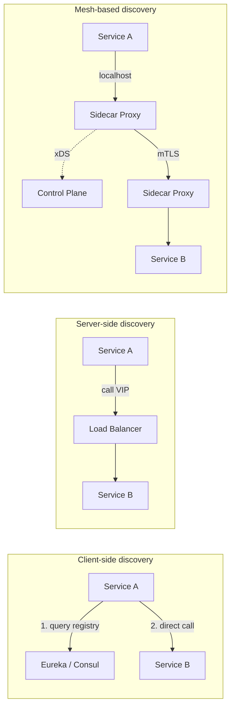
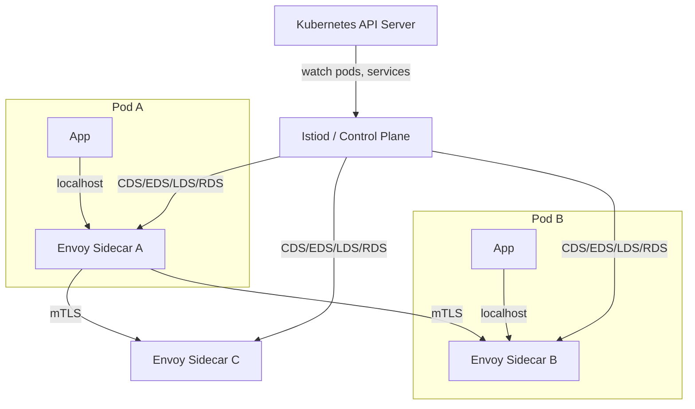
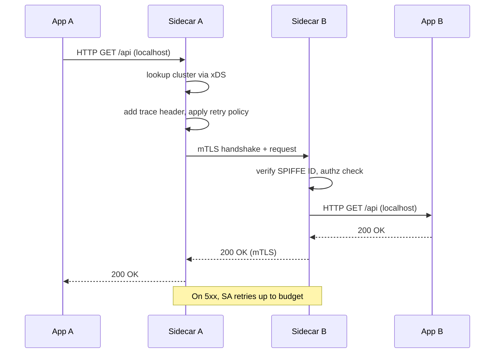
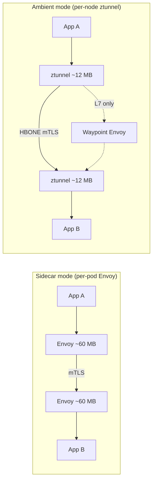

# Service Discovery and Service Mesh: Finding and Talking to Services

> **TL;DR**: Service discovery answers "where is service B right now?" for every inter-service call. Solutions range from DNS with short TTLs, to registries like Consul and Kubernetes Services, to mesh-based sidecars that resolve endpoints locally. A service mesh extends discovery by inserting a proxy (Envoy, Linkerd2-proxy) next to every pod, giving you mTLS, retries, circuit breaking, and distributed tracing without changing application code. The cost is real: Istio sidecars consume ~0.20 vCPU and 60 MB RAM per pod at 1,000 RPS[^1]. Do not adopt a mesh until you have 20+ services and a clear need for the full bundle; if you only need mTLS, cert-manager plus NetworkPolicies is cheaper.

## Learning Objectives

After this module, you will be able to:

- [ ] Distinguish client-side, server-side, and mesh-based service discovery
- [ ] Explain how Kubernetes Services and EndpointSlices route traffic at scale
- [ ] Describe the data plane vs control plane split and the xDS API
- [ ] Decide whether a service mesh is worth its operational cost for your estate
- [ ] Configure mTLS, retries, timeouts, and circuit breaking at the mesh layer
- [ ] Compare Istio, Linkerd, and Cilium on performance, features, and overhead

## Intuition

You start a new job at a 500-person company. You need to talk to someone in Finance. In a small startup, you would shout across the room. In a big company, you look them up in the corporate directory (the registry), get their desk number (the endpoint), and walk over. If they moved desks last week, the directory has the new location. If they are on vacation, the directory marks them unavailable so you do not waste a trip.

Now imagine the company also installs a receptionist outside every office door. The receptionist checks your badge (mTLS), logs your visit (tracing), retries if the person is briefly away (retries with budget), and turns you away if the person's queue is too long (circuit breaking). You never learn the routing rules; you just say "I need Finance" and the receptionist handles it.

The corporate directory is service discovery. The receptionist is the sidecar proxy. The HR department that trains all receptionists and keeps their policies in sync is the control plane. That is the entire service mesh in one analogy.

## Theory

### Service discovery models

Three models exist for resolving a logical service name to a live instance:

**Client-side discovery.** The caller queries a registry (Eureka, Consul, ZooKeeper) and picks an instance itself. Netflix built Ribbon for this: the Java client fetched endpoints from Eureka and applied client-side load balancing[^2]. The advantage is no extra network hop. The disadvantage is that every language needs a mature client library, and Netflix eventually moved to Envoy precisely because maintaining Ribbon across polyglot services became untenable[^2].

**Server-side discovery.** The caller hits a stable VIP or load balancer that knows the backends. AWS ALB with target groups and Kubernetes ClusterIP Services are canonical examples. Clients stay dumb. The cost is a proxy hop and a shared failure domain at the LB.

**Mesh-based discovery.** The caller sends to `localhost`; a sidecar proxy resolves the target using config streamed from a control plane. This is client-side discovery with a local proxy: the application stays trivial, but you pay the sidecar's CPU and memory overhead.

*Client-side avoids the LB hop but demands language-specific clients; server-side hides complexity behind a VIP; mesh-based keeps the client trivial via a local proxy.*

Use client-side when you control all callers and want latency-aware selection (gRPC with xDS, Finagle). Use server-side as the default for Kubernetes workloads. Use mesh-based when you need uniform policy across many languages.

### Kubernetes Service model

Kubernetes Services are the native discovery mechanism for most cloud workloads. A ClusterIP Service gets a virtual IP; `kube-proxy` on every node programs iptables (or nftables, the recommended successor since Kubernetes 1.33) rules that DNAT traffic toward one of the backend pods[^3].

**EndpointSlices** became the default for kube-proxy in Kubernetes 1.19, superseding the monolithic Endpoints object. Before EndpointSlices, a Service with 5,000 pods on 3,000 nodes meant distributing a 1.5 MB Endpoints object per change, producing "more than 22 TB worth of data transferred" across the cluster during a rolling update[^4]. EndpointSlices partition endpoints into shards of up to 100, scaling to 100,000+ network endpoints per Service.

At very large scale, kube-proxy rule programming is a known hotspot. Cilium replaces it entirely with eBPF maps for O(1) lookup per packet[^5].

### Service mesh: data plane vs control plane

Matt Klein framed the canonical split in 2017: "the data plane is responsible for conditionally translating, forwarding, and observing every network packet... the control plane takes a set of isolated stateless sidecar proxies and turns them into a distributed system"[^6].

The **data plane** is the set of proxies on the request path. Envoy (C++, used by Istio and Consul Connect), Linkerd2-proxy (Rust, used by Linkerd), and ztunnel (Rust, used by Istio ambient mode).

The **control plane** (Istiod, Linkerd control plane, Consul servers, Google Traffic Director) generates configuration and streams it to proxies over the xDS suite of APIs: CDS (clusters), EDS (endpoints), LDS (listeners), RDS (routes)[^6]. Each sidecar opens a gRPC stream to the control plane and receives eventually-consistent config updates. When a deployment scales up, the control plane watches Kubernetes and emits EDS updates to every affected proxy.

*Istiod watches Kubernetes and streams xDS config to every Envoy sidecar; the control plane never sits on the request path.*

### What meshes provide

A sidecar gives every service, in any language, the following without an SDK:

- **Mutual TLS (mTLS)** with automatic cert rotation (default 24-hour TTL in Istio)
- **Retries with budgets** to prevent retry storms from cascading
- **Circuit breakers and outlier detection** to eject unhealthy upstreams
- **Distributed tracing** headers propagated automatically (B3, W3C Trace Context)
- **Traffic splitting** for canary, blue-green, and A/B deployments
- **Per-service authorization policies** based on cryptographic identity (SPIFFE)

*Every hop through the mesh adds mTLS termination, policy checks, retry logic, and trace propagation; the application sees a plain local call.*

### Major meshes compared

**Istio** is the feature-rich option. CNCF graduated in July 2023[^7]. Istio 1.24 load-tested at 1,000 services, 2,000 pods, and 70,000 mesh-wide RPS[^1]. It uses Envoy as the data plane and Istiod as the consolidated control plane. The downside is weight: at 1,000 RPS per sidecar, expect ~0.20 vCPU and 60 MB RAM[^1].

**Linkerd** is the lightweight alternative. In the 2021 Kinvolk benchmark (Linkerd 2.11.1 vs Istio 1.12.0) at 2,000 RPS, Linkerd added 6 ms median latency versus Istio's 17 ms, and consumed 26 MB per proxy versus Istio's 156 MB[^8]. Both projects have evolved significantly since; Istio ambient mode changes the comparison. Its data plane, Linkerd2-proxy, is a purpose-built Rust micro-proxy using Tokio and Rustls. The design choice: avoid garbage-collected languages to keep tail latency predictable[^9].

**Cilium** takes a different approach entirely. It uses eBPF programs attached to kernel socket hooks to enforce L4 policy and encryption (WireGuard or IPsec) without any proxy on the request path[^5]. L7 features are weaker and kernel-version gated, but the overhead is near zero for L4-only workloads.

**Consul Connect** bridges the VM and container worlds. If you have a mixed estate (some Kubernetes, some bare-metal, some VMs), Consul's registry-then-mesh path is the natural fit.

### Overhead and alternatives

According to CNCF Annual Survey data, sidecar-based mesh adoption dropped from 50% to 42% between 2023 and 2024[^10]. The reason is cost: sidecar overhead is roughly fixed per pod, independent of traffic. A side service doing 10 RPS with a 100 MB JVM heap now costs 160 MB total because Envoy adds 60 MB. Multiplied across hundreds of small services, cluster capacity vanishes.

**Istio ambient mode** splits the mesh: a ztunnel DaemonSet handles mTLS and L4 policy at ~0.06 vCPU and 12 MB per node, while optional waypoint proxies handle L7 routing only where needed[^1][^11]. Measured against sidecar's 0.20 vCPU and 60 MB per pod in the same Istio 1.24 benchmark, that is roughly 3x CPU and 5x memory for L4-only workloads.

**Proxyless gRPC** embeds xDS support directly in the gRPC library. Google Traffic Director speaks xDS to gRPC clients, eliminating the sidecar hop entirely for services that already use gRPC[^12].

*Sidecar mode puts Envoy in every pod (60 MB each); ambient mode runs a shared ztunnel per node (12 MB) and optional waypoint proxies only for L7 features.*

### mTLS bootstrapping with SPIFFE

Meshes mint a short-lived X.509 certificate per workload and require both sides to present and verify certs on every connection. SPIFFE standardizes the identity document (SVID) and the Workload API the proxy uses to fetch it; SPIRE is the reference implementation[^13].

A typical Kubernetes SPIFFE ID looks like `spiffe://cluster.local/ns/default/sa/bookinfo-reviews`, encoding the namespace and ServiceAccount. Because the identity is a URI, authorization policies refer to workloads symbolically rather than by IP. In Linkerd, each proxy generates its own key on startup, never writes it to disk, and gets a cert signed by the control plane Identity service[^9].

The key insight: mTLS authenticates who is calling. It does not authorize what they can do. You still need explicit AuthorizationPolicies with a deny-by-default posture.

## Real-World Example

### Lyft Envoy: the origin of the modern service mesh

In 2016, Lyft's SOA had a problem every polyglot company hits: each service had a half-baked RPC library with inconsistent retries, circuit breakers, and observability. Java services used one retry strategy; Python services used another. Nobody had consistent distributed tracing. Matt Klein built Envoy to solve this.

Envoy launched publicly on September 14, 2016[^14]. By April 2017, it had over 40 contributors and was being adopted by Google and IBM[^14]. The key design decisions:

1. **C++ for performance.** Tail-latency predictability over JVM-based proxies. No GC pauses.
2. **Eventually-consistent discovery.** Lyft deliberately designed service discovery in Envoy as "eventually consistent and lossy", in contrast to the strongly-consistent ZooKeeper approach, and reported "extremely high reliability without the maintenance headache"[^14].
3. **HTTP/2 transparent upgrade.** Critical for gRPC adoption across the fleet.
4. **Universal xDS APIs.** By publishing CDS/EDS/LDS/RDS as open APIs, Klein decoupled the data plane from any control plane. This is why Istio, Consul Connect, and Google Traffic Director all use Envoy today.

Lyft ran Envoy as both an edge proxy and a per-host sidecar on every service pod, replacing per-language RPC libraries entirely. The architecture is the direct ancestor of every modern service mesh: sidecar proxy, local-first routing, control plane pushing config.

The lesson: if you have 3+ languages and inconsistent resilience logic, a shared proxy is cheaper than maintaining N client libraries. But if you are a single-language shop with a mature RPC framework, you may not need the proxy at all.

## Trade-offs

| Approach | Pros | Cons | Best when | Our Pick |
|---|---|---|---|---|
| DNS-only discovery | Zero infra; universal | No health checks; TTL caching breaks failover | Small/static topologies | Small static fleets (< 10 nodes) with tolerance for minute-scale failover |
| Consul / etcd registry | Strong consistency; active health; metadata | You operate it; Raft quorum ops | Medium estates, non-k8s, mixed VM/container | **Mixed estates** |
| Kubernetes Services + EndpointSlices | Built-in; scales to 100K+ endpoints | Limited advanced L7 routing | Most k8s workloads | **Default for k8s** |
| Client-side (gRPC xDS, Finagle) | No extra hop; latency-aware LB | Every language needs a client | Internal RPC, you control all callers | When single-language |
| Service mesh (Istio sidecar) | mTLS + retries + tracing + policy; language-agnostic | 60 MB + 0.20 vCPU per pod; complex upgrades | Many services, compliance mandate, multi-language | **20+ services, multi-lang** |
| Ambient / eBPF mesh (Istio ambient, Cilium) | 3x CPU / 5x memory savings vs sidecar for L4; simpler ops | Newer; fewer L7 features; kernel dependency | Large k8s estates with cost pressure | **Direction of travel** |

## Common Pitfalls

> [!WARNING]
> **Adopting a mesh before you need one.** Teams deploy Istio for "zero trust" when they have 8 services and one language. The mesh adds 60 MB per pod, upgrade complexity, and debugging overhead for features they never use. If you only need mTLS, cert-manager plus NetworkPolicies costs far less.

> [!WARNING]
> **Debugging across sidecars.** A failing request traverses client sidecar, network, and server sidecar. A 503 could come from five components. Without correlating Envoy response flags (`UH`, `URX`) and distributed trace IDs, you will spend hours on what should be a 5-minute diagnosis. Enable access logs with response flags from day one.

> [!WARNING]
> **Certificate rotation failures.** Meshes rotate workload certs every 24 hours by default. If the control plane is down during rotation, proxies cannot get new certs and connections fail. Run 3+ control plane replicas across zones and monitor cert expiry metrics.

> [!WARNING]
> **Upgrade hell from version skew.** Istio's supported skew is narrow: the control plane can be one minor version ahead of the data plane, but the data plane cannot be ahead of the control plane[^15]. Upgrading Istiod while sidecars run an older Envoy can break xDS config push if you drift further. Use canary upgrades: install a second Istiod revision, label pods to pick it up gradually.

> [!WARNING]
> **Retry storms without budgets.** Proxy-level retries on a flapping backend multiply load. Two sidecars on the call path each doing 3 retries turns 1 failed request into 9. Always configure retry budgets (cap retry traffic as a fraction of success traffic) and never retry non-idempotent operations.

> [!WARNING]
> **mTLS without authorization.** Teams enable mTLS for "zero trust" but keep allow-all AuthorizationPolicies. Any compromised workload can still call any other. mTLS authenticates who is calling; it does not authorize what they can do. Start with a namespace-level deny-all, then explicitly allow per-service using SPIFFE identity.

## Exercise

You have 80 microservices on Kubernetes, 5 teams, a mandate for mTLS everywhere, and existing retry/timeout logic in an in-house Go library. Compare: (a) keep the library, add cert-manager + NetworkPolicies, (b) adopt Linkerd, (c) adopt Istio. Estimate CPU overhead, migration effort, and which operational burdens move where.

Hint

Calculate the per-pod memory cost of each option across 80 services (assume 3 replicas each = 240 pods). Consider who owns the retry logic today versus who owns it after migration. Think about what happens when the Go library team ships a breaking change versus when the mesh team upgrades the control plane.

Solution

**Option (a): cert-manager + NetworkPolicies.**

- Memory overhead: ~0 (certs are mounted as secrets, no sidecar). Total: baseline only.
- Migration effort: Low. Add cert-manager Issuer, annotate pods, write NetworkPolicies per service. The in-house Go library keeps handling retries and timeouts.
- Operational burden: cert-manager is lightweight (one controller). NetworkPolicies require a CNI that enforces them (Calico, Cilium). The Go library team still owns resilience logic; every team must upgrade when they ship changes.
- Limitation: no traffic splitting, no distributed tracing from the infra layer, no L7 authorization. You get mTLS and coarse network segmentation only.

**Option (b): Linkerd.**

- Memory overhead: ~26 MB per proxy (Kinvolk benchmark). 240 pods x 26 MB = ~6.2 GB cluster-wide. Control plane adds ~365 MB.
- Migration effort: Medium. Linkerd injection is a namespace label; no app code changes. The in-house Go library's retry logic now competes with Linkerd's proxy retries. You must disable one or the other to avoid retry amplification.
- Operational burden: Linkerd control plane is lighter than Istio. Upgrades are simpler (fewer CRDs, smaller surface). But you now have two systems doing resilience: the Go library and the mesh. Pick one.

**Option (c): Istio.**

- Memory overhead: ~60 MB per sidecar. 240 pods x 60 MB = ~14.4 GB cluster-wide. Control plane adds ~600 MB.
- Migration effort: High. Istio has more CRDs, more configuration surface, and more failure modes. You gain traffic splitting, richer authorization, and a larger ecosystem. But the Go library must be deprecated or scoped down to avoid conflicting with Envoy's retry/timeout logic.
- Operational burden: Istio upgrades are notoriously complex (canary revisions, version skew). You need a dedicated platform team.

**Recommendation:** For 80 services with 5 teams and a Go-only stack, start with option (a). You already have resilience logic in Go; adding a mesh duplicates it. cert-manager gives you mTLS at near-zero cost. If you later need traffic splitting or multi-language support, migrate to Linkerd (option b) for its lower overhead and simpler operations. Reserve Istio for estates with 200+ services, 10+ teams, and 3+ languages where the feature breadth justifies the cost.

## Key Takeaways

- Service discovery is mandatory; a service mesh is a deliberate choice. Many teams buy mesh features they never use.
- If you only need mTLS, cert-manager and NetworkPolicies cost far less than a full mesh.
- Envoy is the de facto data plane; Linkerd is lighter and faster (26 MB, 6 ms median overhead), Istio is feature-rich but heavier (60 MB, 17 ms median overhead)[^8].
- The control plane never sits on the request path. If it goes down, existing proxies keep routing with stale config, but new deployments stop working.
- Sidecars buy language-agnostic policy at the cost of 1-5% CPU and 30-200 MB RAM per pod. Ambient mode and eBPF cut this by roughly 3x CPU and 5x memory for L4-only workloads.
- Do not adopt a mesh until you have 20+ services and clear needs for the full bundle (mTLS + retries + tracing + policy + traffic splitting).
- The direction of travel is sidecar-less: Istio ambient, Cilium eBPF, and proxyless gRPC. Evaluate before committing to per-pod sidecars.

## Further Reading

- [Matt Klein, "Service mesh data plane vs. control plane" (2017)](https://blog.envoyproxy.io/service-mesh-data-plane-vs-control-plane-2774e720f7fc) - The taxonomy article that named the data plane/control plane split; required reading before evaluating any mesh.
- [Linkerd blog, "Under the hood of Linkerd2-proxy" (2020)](https://linkerd.io/2020/07/23/under-the-hood-of-linkerds-state-of-the-art-rust-proxy-linkerd2-proxy/) - Best single article on why a purpose-built Rust micro-proxy wins on tail latency versus a general-purpose C++ proxy.
- [Netflix Tech Blog, "Zero Configuration Service Mesh with On-Demand Cluster Discovery" (2023)](https://netflixtechblog.com/zero-configuration-service-mesh-with-on-demand-cluster-discovery-ac6483b52a51) - Real migration story from Eureka + Ribbon to Envoy; shows the pain of maintaining per-language discovery clients.
- [Kubernetes Blog, "Scaling Kubernetes Networking with EndpointSlices" (2020)](https://kubernetes.io/blog/2020/09/02/scaling-kubernetes-networking-with-endpointslices/) - Why the old Endpoints API broke at scale and how EndpointSlices fix it with 100-endpoint shards.
- [Istio blog, "Istio: The Highest-Performance Solution for Network Security" (2025)](https://istio.io/latest/blog/2025/ambient-performance/) - Ambient mode benchmark numbers showing 75% throughput improvement over 4 releases; the case for sidecar-less.
- [William Morgan, "Benchmarking Linkerd and Istio: 2021 Redux"](https://linkerd.io/2021/11/29/linkerd-vs-istio-benchmarks-2021/) - The most cited independent mesh benchmark; shows Linkerd at 6x less memory and 3x less latency than Istio.
- [SPIFFE project documentation](https://spiffe.io/docs/latest/spiffe-about/overview/) - Workload identity standard used by Istio, Consul, cert-manager, and Dapr; understand this before designing zero-trust policies.
- [Envoy Proxy documentation](https://www.envoyproxy.io/docs/envoy/latest/) - The canonical data plane reference; start with the architecture overview and xDS protocol description.

## Flashcards

**Q:** What are the three service discovery models?
**A:** Client-side (caller queries registry, picks instance), server-side (caller hits a stable LB VIP), and mesh-based (caller sends to localhost, sidecar proxy resolves via control plane).

**Q:** What is the data plane vs control plane split in a service mesh?
**A:** The data plane (Envoy, Linkerd2-proxy) handles every network packet on the request path. The control plane (Istiod, Linkerd control plane) generates configuration and streams it to proxies via xDS. The control plane never sits on the request path.

**Q:** What does xDS stand for and what are its main APIs?
**A:** xDS is the "x Discovery Service" protocol suite. Main APIs: CDS (Cluster Discovery), EDS (Endpoint Discovery), LDS (Listener Discovery), RDS (Route Discovery). Each streams config from control plane to data plane over gRPC.

**Q:** How much overhead does an Istio sidecar add per pod?
**A:** At 1,000 RPS with 1 KB payload: ~0.20 vCPU and 60 MB RAM. Istio ambient mode's ztunnel is ~0.06 vCPU and 12 MB, roughly 5x cheaper.

**Q:** Why did Kubernetes replace Endpoints with EndpointSlices?
**A:** A Service with 5,000 pods produced a 1.5 MB Endpoints object. A rolling update across 3,000 nodes transferred over 22 TB of data. EndpointSlices shard endpoints into groups of 100, scaling to 100K+ endpoints.

**Q:** What is SPIFFE and why does it matter for service meshes?
**A:** SPIFFE (Secure Production Identity Framework For Everyone) standardizes workload identity as a URI in X.509 certs (e.g., spiffe://cluster.local/ns/default/sa/my-service). It lets authorization policies reference workloads by identity rather than IP address.

**Q:** When should you NOT adopt a service mesh?
**A:** When you have fewer than 20 services, a single language with a mature RPC library, or only need mTLS (use cert-manager instead). The mesh's CPU/memory overhead and operational complexity are not justified without the full feature bundle.

**Q:** How does Linkerd compare to Istio on resource consumption?
**A:** In the 2021 Kinvolk benchmark at 2,000 RPS: Linkerd used 26 MB per proxy vs Istio's 156 MB (6x less), added 6 ms median latency vs Istio's 17 ms (3x less), and used 365 MB control plane memory vs Istio's 597 MB.

**Q:** What is Istio ambient mode and why does it exist?
**A:** Ambient mode replaces per-pod sidecars with a per-node ztunnel DaemonSet for L4 (mTLS, basic policy) and optional waypoint proxies for L7 features. It exists because sidecar overhead (fixed per pod regardless of traffic) was driving adoption decline.

**Q:** What is the difference between mTLS authentication and authorization in a mesh?
**A:** mTLS authenticates who is calling (verifies the SPIFFE identity in the cert). Authorization policies separately control what that identity is allowed to do. Enabling mTLS without deny-by-default authorization gives you encryption but not zero trust.

**Q:** Why did Lyft build Envoy with eventually-consistent discovery instead of using ZooKeeper?
**A:** Lyft reported that strongly-consistent registries (ZooKeeper, etcd) added operational pain at scale. Eventually-consistent, lossy discovery gave "extremely high reliability without the maintenance headache" because stale endpoints are handled gracefully by health checks and retries.

**Q:** What is the "retry storm" problem and how do meshes prevent it?
**A:** When two sidecars on a call path each retry 3 times, 1 failed request becomes 9. Meshes prevent this with retry budgets that cap retry traffic as a percentage of successful traffic, and by never retrying non-idempotent operations.

## References

[^1]: Istio documentation, "Performance and Scalability" (Istio 1.24). https://istio.io/latest/docs/ops/deployment/performance-and-scalability/
[^2]: David Vroom, James Mulcahy, Ling Yuan, Rob Gulewich, "Zero Configuration Service Mesh with On-Demand Cluster Discovery", Netflix TechBlog, Aug 29, 2023. https://netflixtechblog.com/zero-configuration-service-mesh-with-on-demand-cluster-discovery-ac6483b52a51
[^3]: Kubernetes documentation, "Virtual IPs and Service Proxies". https://kubernetes.io/docs/reference/networking/virtual-ips/
[^4]: Rob Scott, "Scaling Kubernetes Networking With EndpointSlices", Kubernetes blog, Sep 2, 2020. https://kubernetes.io/blog/2020/09/02/scaling-kubernetes-networking-with-endpointslices/
[^5]: Cilium documentation, "Kubernetes Without kube-proxy". https://docs.cilium.io/en/stable/network/kubernetes/kubeproxy-free/
[^6]: Matt Klein, "Service mesh data plane vs. control plane", Envoy Proxy blog, Oct 10, 2017. https://blog.envoyproxy.io/service-mesh-data-plane-vs-control-plane-2774e720f7fc
[^7]: CNCF, "Cloud Native Computing Foundation Reaffirms Istio Maturity with Project Graduation", Jul 12, 2023. https://www.cncf.io/announcements/2023/07/12/cloud-native-computing-foundation-reaffirms-istio-maturity-with-project-graduation/
[^8]: William Morgan, "Benchmarking Linkerd and Istio: 2021 Redux", Linkerd blog, Nov 29, 2021. https://linkerd.io/2021/11/29/linkerd-vs-istio-benchmarks-2021/
[^9]: Eliza Weisman, "Under the hood of Linkerd's state-of-the-art Rust proxy, Linkerd2-proxy", Linkerd blog, Jul 23, 2020. https://linkerd.io/2020/07/23/under-the-hood-of-linkerds-state-of-the-art-rust-proxy-linkerd2-proxy/
[^10]: Ratan Tipirneni, "Why Service Mesh is Poised for a Dramatic Comeback in 2026", CloudNativeNow, Mar 5, 2026 (citing CNCF Annual Survey 2024 data). https://cloudnativenow.com/contributed-content/why-service-mesh-is-poised-for-a-dramatic-comeback-in-2026/
[^11]: Istio documentation, "Ambient Mode". https://istio.io/latest/docs/ambient/
[^12]: Google Cloud, "Cloud Service Mesh - xDS control plane APIs" (formerly Traffic Director). https://cloud.google.com/traffic-director/docs/xds-control-plane-apis
[^13]: SPIFFE project, "SPIFFE Overview" documentation. https://spiffe.io/docs/latest/spiffe-about/overview/
[^14]: Matt Klein, "Envoy: 7 months later", Lyft Engineering, Apr 25, 2017. https://eng.lyft.com/envoy-7-months-later-41986c2fd443
[^15]: Istio documentation, "Supported Releases" - Control Plane/Data Plane Skew. https://istio.io/latest/docs/releases/supported-releases/
