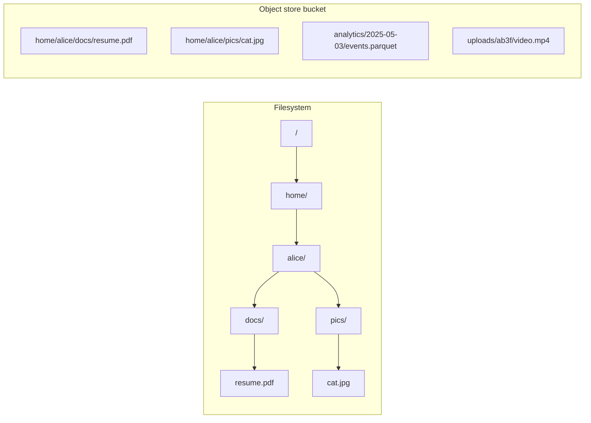
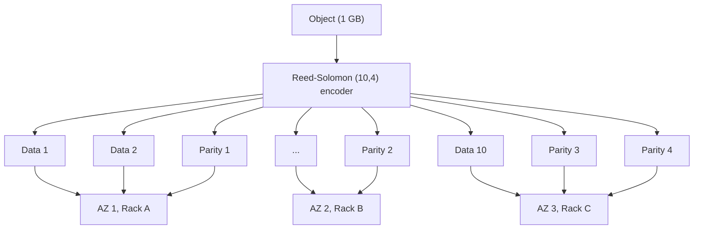
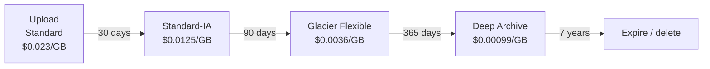
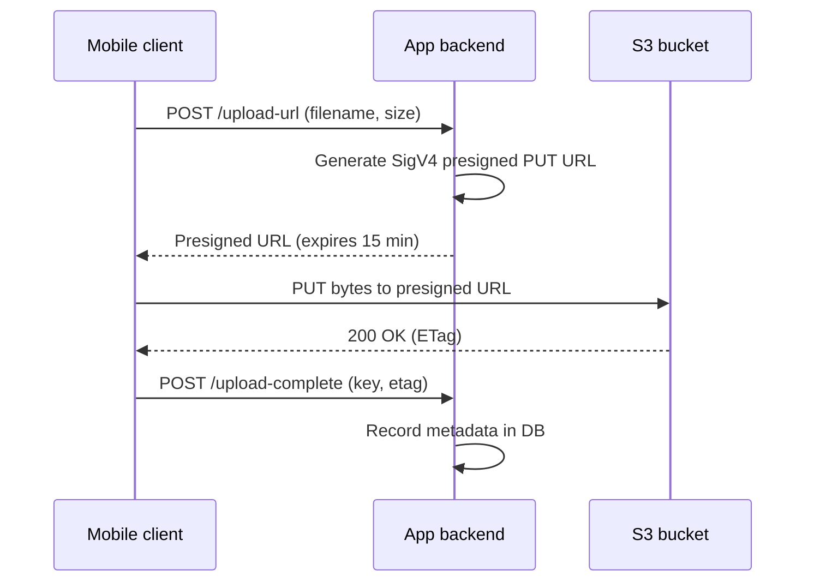

# Blob and Object Storage: Storing the Big Stuff

> **TL;DR**: Object storage is a flat, HTTP-addressable key-value store for opaque blobs. Amazon S3 holds over 500 trillion objects and serves 200+ million requests per second[^1]. It achieves 99.999999999% (eleven nines) durability through Reed-Solomon erasure coding spread across availability zones[^1]. Default to S3 Standard for hot data, tier to Glacier Deep Archive (23x cheaper) only after measuring access patterns, and always put a CDN in front of public buckets because egress costs will eat you alive.

## Learning Objectives

After this module, you will be able to:

- [ ] Explain the object-storage data model (bucket, key, object, metadata, versions)
- [ ] Design upload and download flows using presigned URLs and multipart uploads
- [ ] Use storage classes and lifecycle policies to control cost at scale
- [ ] Reason about S3 consistency guarantees (strong read-after-write since 2020)
- [ ] Decide when to store a blob in object storage vs a database vs a filesystem

## Intuition

Imagine a self-storage warehouse with millions of numbered lockers. You walk in, hand the clerk a labeled box (any size, from a postcard to a refrigerator), and get back a receipt with the locker number. To retrieve it, you show the receipt. There are no hallways, no floors, no nested rooms. Just a flat list of locker numbers. You cannot open a box and change one item inside; you swap the entire box or leave it alone.

Now imagine a record label's master archive. Every song, every take, every mix goes into a vault designed to survive earthquakes, floods, and human error. The vault stores each master on multiple tapes in multiple buildings. If one building burns, the others reconstruct the lost copies automatically. You never worry about capacity; the warehouse expands as you fill it.

Object storage is both of these things: a flat namespace of immutable blobs with planetary-scale durability. It trades POSIX semantics (no partial writes, no directories, no rename) for the ability to scale to exabytes without capacity planning. That trade-off is why every photo you upload, every video you stream, and every ML dataset you train on lives in an object store.

## Theory

### Object vs file vs block

A filesystem organizes data into a tree of directories and inodes. You can `open()`, `seek()`, `write()` arbitrary bytes at arbitrary offsets. A block device gives you raw numbered sectors. Object storage does neither.

An object store has three concepts: a **bucket** (namespace boundary), a **key** (UTF-8 string up to 1,024 bytes), and an **object** (the blob body plus metadata). The slash in `photos/2025/cat.jpg` is cosmetic; there is no `photos/` directory[^2]. The API is intentionally tiny: `PUT`, `GET`, `DELETE`, `HEAD`, `LIST`, plus multipart upload variants.

*File systems have a tree of directories and inodes; object stores have a flat keyspace where the slash is cosmetic.*

Objects are **immutable** from the client's perspective. To change one byte of a 1 GB video, you PUT the entire 1 GB back (a single S3 object can be up to 48.8 TiB via multipart upload)[^2][^3]. This constraint is what lets the system scale: no partial-write coordination, no lock managers, no directory rename serialization.

### Internals: erasure coding and placement

How does S3 promise eleven nines of durability without storing three full copies of every object? The answer is **Reed-Solomon erasure coding**.

Each object is split into *k* data shards. An encoder generates *m* parity shards using linear algebra over a finite field. Any *k* of the *k+m* shards can reconstruct the original object. Shards are placed across drives, racks, and availability zones so correlated failures never destroy more than *m* shards simultaneously[^4].

A (10, 4) code stores 14 shards for every 10 shards of real data: 1.4x raw overhead instead of 3x for triple replication, while surviving 4 simultaneous drive failures. Meta's f4 system used a similar erasure coding scheme to reduce its effective replication factor from 3.6x to as low as 2.1x, saving petabytes of disk[^5].

*A (10, 4) Reed-Solomon code splits one object into 14 shards spread across racks and AZs; any 10 reconstruct the object, surviving 4 simultaneous failures.*

On read, the frontend pulls from the nearest available *k* shards. On write, it waits for all *k+m* durable acks before returning HTTP 200. The spread placement means a single customer burst can pull from millions of disks simultaneously because aggregate heat across millions of tenants averages out[^4].

### Durability vs availability

These are different numbers. **Durability** is the probability your object still exists after a year. **Availability** is the probability you can read it right now.

S3 Standard: 99.999999999% durability (eleven nines), 99.99% availability[^1]. Translate eleven nines concretely: store 10 million objects, expect to lose one every 10,000 years. The durability comes from erasure coding across multiple AZs. The availability gap (99.99% = 52 minutes of downtime per year) comes from transient failures in the frontend fleet, metadata index, or network path.

S3 Express One Zone trades multi-AZ durability for single-digit millisecond latency at $0.16/GB-month[^6]. If the one AZ burns, your data is gone. Use it for ephemeral caches and scratch space, never for source-of-truth storage.

### Storage classes and tiering

S3 offers a spectrum from hot to frozen:

| Class | $/GB-month | Retrieval | Min duration | Use case |
|-------|---:|---|---:|---|
| Express One Zone | $0.160 | ~1 ms | None | ML scratch, ephemeral cache |
| Standard | $0.023 | Instant | None | Default for active data |
| Standard-IA | $0.0125 | Instant + fee | 30 days | Backups accessed monthly |
| Glacier Instant | $0.004 | Instant + fee | 90 days | Compliance archives, rare reads |
| Glacier Flexible | $0.0036 | Minutes to hours | 90 days | Disaster recovery |
| Deep Archive | $0.00099 | 12-48 hours | 180 days | Legal hold, 7-year retention |

That is a 23x price spread from Standard to Deep Archive for the same API[^7].

**Lifecycle policies** automate transitions. A typical rule: "After 30 days, move to Standard-IA. After 120 days, move to Glacier Flexible. After 7 years, expire." These rules are free to configure and save 5x to 20x on stale data[^8].

*A typical hot-to-cold lifecycle: Standard for the first 30 days, IA for the next 90, Glacier Flexible for a year, Deep Archive for legal-hold retention, eventual expire.*

> [!TIP]
> Use **Intelligent-Tiering** when access patterns are unpredictable. It monitors per-object access and moves objects between tiers automatically for a small monitoring fee ($0.0025 per 1,000 objects/month). No retrieval fees, no minimum duration penalties.

### Consistency model

Before December 1, 2020, S3 was eventually consistent for overwrites and deletes. A PUT followed by an immediate GET could return stale data. Analytics tools like Spark needed workarounds (S3Guard, EMRFS consistent view) to avoid reading phantom files.

On December 1, 2020, AWS shipped **strong read-after-write consistency for all operations** at no extra cost and no latency penalty[^9]. Every PUT now commits to a strongly consistent metadata index. Every GET resolves through the same index before reading shards. List-after-write is also strong.

The catch: strong consistency is **per-key**, not multi-object transactional. Two concurrent PUTs to the same key race; last-writer-wins. Use conditional writes (`If-None-Match: *` to fail if the key exists, `If-Match: <etag>` to fail if someone else changed it) to avoid lost updates[^10].

### Access patterns: uploads and downloads

**Multipart upload** breaks large objects into 5 MB to 5 GB parts. The client calls `CreateMultipartUpload`, PUTs each part in parallel, then calls `CompleteMultipartUpload` with the list of part ETags. AWS recommends multipart for anything over 100 MB[^3]. Benefits: parallelism, per-part retry, and resumability after network failures.

**Presigned URLs** let clients upload or download directly to S3 without proxying bytes through your backend. Your server signs a URL with time-limited HMAC-SHA256 credentials (SigV4, max 7 days). The client uses that URL to PUT bytes straight to the bucket[^11].

*The backend signs a URL once; the mobile client uploads bytes directly to S3, bypassing backend bandwidth entirely.*

> [!IMPORTANT]
> Presigned URLs are bearer tokens. If a signed URL leaks before expiration, anyone can use it. Keep expirations short (minutes for uploads, hours for downloads). Never set 7-day expirations unless you have a specific reason.

### Performance and costs

S3 auto-scales to **3,500 PUT/sec and 5,500 GET/sec per partitioned prefix**[^12]. There is no hard limit on the number of prefixes, so total throughput is effectively unbounded if you distribute keys well. If all your keys start with `logs/2025-05-03/`, you funnel writes into one partition and hit throttling within minutes.

**Cost model:**

| Component | Price | Notes |
|-----------|------:|-------|
| Storage (Standard) | $0.023/GB-month | First 50 TB |
| PUT/COPY/POST/LIST | $0.005/1,000 | 12.5x more expensive than GET |
| GET/HEAD | $0.0004/1,000 | Cheap reads |
| Internet egress | $0.09/GB | First 10 TB/month |
| S3 to CloudFront | $0.00 | Free origin transfer |

At scale, **egress dominates**. Serving 10 TB/month of video directly from S3 costs $900 in egress vs $230 in storage[^7]. This is why CDN-origin architectures are standard: S3 to CloudFront is free, and CloudFront-to-internet rates are lower. For truly egress-heavy workloads, Cloudflare R2 ($0.015/GB-month, zero egress) or Backblaze B2 ($6.95/TB-month, approximately $0.00695/GB-month, with 3x free egress) are credible alternatives[^13][^17][^14].

## Real-World Example

**Dropbox Magic Pocket: building an exabyte-scale private object store.**

In 2012, Dropbox stored all user files on Amazon S3. By 2014, they were one of S3's largest customers, spending tens of millions annually on storage and egress. The economics did not scale: Dropbox's workload (large immutable files, heavy reads, predictable growth) was a perfect fit for purpose-built infrastructure.

Between February and October 2015, Dropbox migrated over 500 PB of user data from S3 into **Magic Pocket**, their custom object store[^15]. The system hit 90% cutover on October 7, 2015. Today it is multi-exabyte across three US regions.

**Architecture:** Files are split into immutable 4 MB blocks addressed by SHA-256 hash. Blocks live in 1 GB buckets, buckets in volumes, volumes in cells (~50 PB raw each). A centralized Master per cell coordinates repair and garbage collection but stays off the data plane. Cross-zone replication happens asynchronously within 1 second of upload[^16].

**Key decisions:**

- Immutable blocks eliminate concurrent-write coordination entirely.
- Sharded MySQL for the Block Index (leveraging existing operational expertise rather than inventing a new KV store).
- Erasure coding optimized for single-OSD reconstruction (the blog describes a scheme where "reconstruction from a smaller subset of OSDs" is possible under most failure scenarios)[^16].
- Per-cell Master caps cell size at ~100 PB rather than running Paxos, accepting the scaling limit for operational simplicity.

**Design durability target:** 99.9999999999% (twelve nines), one better than S3[^15]. The lesson: at sufficient scale, building your own object store is cheaper than renting one. Below ~100 PB, the operational cost of running your own storage fleet almost certainly exceeds S3's bill.

## Trade-offs

| Approach | Pros | Cons | Best when | Our Pick |
|----------|------|------|-----------|----------|
| S3 / GCS / Azure Blob | 11 nines durability (S3; GCS and Azure publish their own equivalents), infinite scale, zero ops | Egress cost, ~100 ms latency, vendor lock-in | Default for unstructured data | **Yes, start here** |
| Cloudflare R2 / Backblaze B2 | Zero or low egress, S3-compatible API | Fewer regions, fewer storage classes | Heavy-egress public content | When egress > storage cost |
| MinIO / Ceph on-prem | No vendor lock-in, S3-compatible API | You operate it, capacity planning, your own durability math | Regulated / air-gapped, cost at scale past ~10 PB | Only if compliance demands it |
| Block storage (EBS, local SSD) | Sub-ms latency, POSIX mountable | Not shared, capacity fixed, expensive per GB | Hot path of a database or stateful service | For databases only |

## Common Pitfalls

> [!WARNING]
> **Storing blobs in a RDBMS BLOB column.** Every row read pulls the blob into the buffer pool, evicting useful pages; every replica copies the bytes on every write; backups balloon to untenable sizes. Past ~1 MB per row, Postgres TOAST and MySQL `LONGBLOB` both degrade noticeably. Fix: store the blob in S3 and keep only the URL + metadata in the row. The one legitimate narrow case is a small (<100 KB), rarely-accessed attachment where transactional coupling to the parent row matters and the total volume stays below the buffer-pool comfort zone, and even then S3 + a reference is usually simpler.

> [!WARNING]
> **Using NFS or EFS as an object store.** POSIX filesystems trade sub-ms latency for semantics that object storage does not need (directories, hard links, locking) and ceiling characteristics (inode count, per-file IOPS cost) that object storage does not have. EFS is priced per GB-month at multiples of S3 Standard, and IOPS get expensive fast under concurrent small-object workloads. Fix: use NFS/EFS only for lift-and-shift of legacy apps that require POSIX semantics; for everything else, put the bytes in S3 (or an S3-compatible store) and fetch via HTTPS.

> [!WARNING]
> **Not using multipart for large uploads.** Uploading a 2 GB file as a single PUT means one network hiccup forces a full restart. Use multipart for anything over 100 MB. Each part retries independently, and you get parallel throughput across multiple TCP connections.

> [!WARNING]
> **Egress cost surprises.** S3 Standard costs $0.023/GB to store but $0.09/GB to egress. At 100 TB/month egress, your transfer bill is 40x your storage bill. Put CloudFront in front of public buckets (S3 to CloudFront is free). For extreme egress, evaluate R2 or B2.

> [!WARNING]
> **Orphaned multipart uploads.** Incomplete multipart uploads (started but never completed or aborted) leave part data in S3 forever. You pay for those bytes silently. Set a lifecycle rule on every bucket: "Abort incomplete multipart upload after 7 days." This rule is free[^8].

> [!WARNING]
> **Hot prefix throttling.** Keys like `logs/2025-05-03/...` funnel all writes to one partition. S3 auto-splits partitions under sustained load, but the split happens gradually and is not instantaneous. Prefix keys with a hash or random value (`logs/3f/2025-05-03/...`) to spread writes immediately[^12].

> [!WARNING]
> **Bucket-root listing at scale.** `ListObjectsV2` without a prefix scans the entire bucket. With billions of keys, this is slow and expensive ($0.005 per 1,000 keys listed). Always scope listings with a prefix and use pagination cursors.

> [!WARNING]
> **Missing Object Lock for compliance.** If regulations require immutable retention (SEC 17a-4, HIPAA), enable Object Lock in Governance or Compliance mode at bucket creation time. You cannot enable it retroactively on existing objects. Forgetting this means re-uploading everything.

## Exercise

> **Design Challenge:** You are building image storage for a social app with 100 million users. Each user has 10 photos on average (1 billion objects total). Average photo size is 500 KB. Access pattern: 10% of photos are "hot" (accessed daily), 90% are "cold" (accessed less than once per month). Design the storage architecture, including tiering strategy and serving path.

Hint

Think about separating the hot and cold paths. The hot 10% should be served with minimal latency (CDN + Standard). The cold 90% should cost as little as possible without sacrificing availability when accessed. Calculate total storage and monthly costs for each tier.

Solution

**Numbers first:**

- Total storage: 1 billion objects x 500 KB = 500 TB
- Hot tier (10%): 50 TB in S3 Standard = $1,150/month
- Cold tier (90%): 450 TB in S3 Standard-IA = $5,625/month (vs $10,350 in Standard)
- Monthly savings from tiering: ~$4,725

**Architecture:**

1. **Upload path:** Mobile client gets a presigned URL from the backend. Client PUTs directly to S3 Standard (500 KB is below the multipart threshold). Backend records the key and metadata in a database.

2. **Serving path:** CloudFront CDN in front of the S3 bucket. Hot photos hit the CDN cache (>90% hit rate for popular content). Cache misses go to S3 Standard. S3-to-CloudFront transfer is free.

3. **Tiering:** Lifecycle rule transitions objects to Standard-IA after 30 days. The 30-day minimum storage duration aligns with the "hot window" for new uploads. Do not use Glacier because users can still access old photos on demand (Standard-IA has instant retrieval).

4. **Key design:** Use `{user_id_hash_prefix}/{user_id}/{photo_id}` to distribute writes across prefixes and avoid hot-partition throttling.

5. **Cost optimization:** Enable Intelligent-Tiering for the cold tier if access patterns are unpredictable. The monitoring fee ($0.0025/1,000 objects/month = $2,500/month for 1B objects) is worth it only if it saves more than that in retrieval fees. For this workload with predictable cold access, a static lifecycle rule is cheaper.

**Trade-off accepted:** Standard-IA charges a per-GB retrieval fee ($0.01/GB). For the cold tier accessed once per month, that is 450 TB x $0.01 = $4,500/month in retrieval. Total cold cost: $5,625 + $4,500 = $10,125. This is roughly equal to keeping everything in Standard ($10,350). The real savings come from the 90% of cold objects accessed less than once per month (not exactly once). If true cold access is 1% per month, retrieval cost drops to $45, making IA the better choice by 45% ($5,670 vs $10,350).

## Key Takeaways

- Object storage is a flat key-value store for blobs, exposed over HTTP. No directories, no partial writes, no POSIX. That simplicity is what lets it scale to exabytes.
- Eleven nines of durability comes from Reed-Solomon erasure coding spread across multiple availability zones, not from triple replication.
- S3 has been strongly consistent (read-after-write for all operations) since December 2020. But consistency is per-key, not multi-object transactional.
- Use presigned URLs for client uploads. Never proxy large files through your backend.
- Multipart upload is mandatory for files over 100 MB. Set an abort-incomplete lifecycle rule on every bucket from day one.
- Lifecycle policies are free to configure and save 5x to 20x on cold data. Default to Standard, tier down after measuring access patterns.
- Egress is the hidden cost. Put a CDN in front of public buckets. Evaluate R2 or B2 if egress exceeds storage cost.

## Further Reading

- [Building and Operating a Pretty Big Storage System (Warfield, 2023)](https://www.allthingsdistributed.com/2023/07/building-and-operating-a-pretty-big-storage-system.html) - the canonical insider account of S3's scale, heat management, and organizational architecture from an AWS distinguished engineer.
- [Inside the Magic Pocket (Dropbox Engineering, 2016)](https://dropbox.tech/infrastructure/inside-the-magic-pocket) - detailed architecture of an exabyte-scale private object store, from 4 MB blocks to 50 PB cells.
- [f4: Facebook's Warm BLOB Storage System (OSDI 2014)](https://research.facebook.com/publications/f4-facebooks-warm-blob-storage-system/) - erasure coding for warm-tier blob storage; defines the effective-replication-factor metric that every storage engineer should know.
- [Amazon S3 Strong Consistency (AWS Blog, 2020)](https://aws.amazon.com/blogs/aws/amazon-s3-update-strong-read-after-write-consistency/) - the announcement that eliminated eventual consistency from S3; pair with [Vogels' deep dive](https://www.allthingsdistributed.com/2021/04/s3-strong-consistency.html) for implementation details.
- [S3 Performance Best Practices (AWS Docs)](https://docs.aws.amazon.com/AmazonS3/latest/userguide/optimizing-performance.html) - AWS's own guide to prefix sharding, multipart uploads, and byte-range fetches; the reference for the 3,500/5,500 per-prefix limits.
- [Announcing Cloudflare R2 (Cloudflare, 2021)](https://blog.cloudflare.com/introducing-r2-object-storage/) - the zero-egress pitch that reshaped cloud-storage pricing; read to understand when R2 beats S3.
- [Colossus Under the Hood (Google Cloud, 2021)](https://cloud.google.com/blog/products/storage-data-transfer/a-peek-behind-colossus-googles-file-system) - the file system behind GCS, YouTube, and Drive; scales to exabytes per cluster.
- [MinIO Erasure Code Quickstart](https://github.com/minio/minio/blob/master/docs/erasure/README.md) - clear, code-adjacent explanation of Reed-Solomon in a real S3-compatible implementation; useful for on-prem sizing decisions.

## Flashcards

**Q:** What are the three things object storage gives up to reach exabyte scale?
**A:** POSIX semantics (no partial writes), strong tree structure (flat namespace instead of directories), and low latency (stateless HTTP API, tens of milliseconds per request).

**Q:** What is S3's durability target, and what does it mean concretely?
**A:** 99.999999999% (eleven nines). Store 10 million objects, expect to lose one every 10,000 years.

**Q:** How does erasure coding differ from replication for durability?
**A:** Replication stores 3 full copies (3x overhead). A (10, 4) Reed-Solomon code stores 14 shards for 10 data shards (1.4x overhead) while surviving 4 simultaneous failures instead of 2.

**Q:** When did S3 become strongly consistent, and what is the scope?
**A:** December 1, 2020. Strong read-after-write for all operations, per-key. Not multi-object transactional; concurrent PUTs to the same key still race (last-writer-wins).

**Q:** Why should you use presigned URLs instead of proxying uploads through your backend?
**A:** Presigned URLs let the client upload bytes directly to S3, saving your backend's bandwidth and CPU. Your server only signs the URL (a few KB of work) instead of relaying gigabytes.

**Q:** What is the per-prefix throughput limit in S3?
**A:** 3,500 PUT/COPY/POST/DELETE per second and 5,500 GET/HEAD per second per partitioned prefix. Distribute keys across prefixes to avoid throttling.

**Q:** When should you use multipart upload?
**A:** For any object over 100 MB (mandatory over 5 GB). Benefits: parallel part uploads, per-part retry on failure, and resumability without restarting the entire upload.

**Q:** What lifecycle rule should every S3 bucket have from day one?
**A:** "Abort incomplete multipart upload after 7 days." Without it, incomplete uploads accumulate silently and you pay for orphaned parts forever.

**Q:** What is the price spread between S3 Standard and Glacier Deep Archive?
**A:** About 23x. Standard is $0.023/GB-month; Deep Archive is $0.00099/GB-month. The trade-off is retrieval time: instant vs 12-48 hours.

**Q:** Why does Dropbox run its own object store instead of using S3?
**A:** At 500+ PB (now multi-exabyte), the economics favor purpose-built infrastructure. Dropbox's workload (large immutable files, predictable growth) made the operational cost of Magic Pocket lower than S3's bill. Below ~100 PB, S3 is almost always cheaper.

**Q:** How do you avoid hot-prefix throttling in S3?
**A:** Prefix keys with a hash or random value (e.g., `uploads/3f/2025-05-03/file.mp4`) so writes spread across many partitions immediately instead of funneling into one time-based prefix.

**Q:** What makes egress the dominant cost for public-facing object storage?
**A:** S3 charges $0.09/GB for internet egress but only $0.023/GB-month for storage. Serving 10 TB/month costs $900 in egress vs $230 in storage. Put CloudFront in front (S3 to CloudFront is free) to shift the bill to cheaper CDN rates.

## References

[^1]: Amazon Web Services, "Cloud Object Storage - Amazon S3," product page (durability and availability). https://aws.amazon.com/s3/
[^2]: Amazon Web Services, "Amazon S3 User Guide" (object model, keys, metadata). https://docs.aws.amazon.com/AmazonS3/latest/userguide/Welcome.html
[^3]: Amazon Web Services, "Amazon S3 multipart upload limits" (maximum object size 48.8 TiB, 5 MiB to 5 GiB part size, 10,000 parts max, 100 MB recommended threshold). https://docs.aws.amazon.com/AmazonS3/latest/userguide/qfacts.html
[^4]: Andy Warfield, "Building and Operating a Pretty Big Storage System," FAST 2023 keynote, AWS distinguished engineer. https://www.usenix.org/conference/fast23/presentation/warfield
[^5]: Muralidhar et al., "f4: Facebook's Warm BLOB Storage System," OSDI 2014. https://research.facebook.com/publications/f4-facebooks-warm-blob-storage-system/
[^6]: Jeff Barr, "Announcing the new Amazon S3 Express One Zone high performance storage class," AWS News Blog, November 28, 2023. https://aws.amazon.com/blogs/aws/new-amazon-s3-express-one-zone-high-performance-storage-class/
[^7]: Amazon Web Services, "Amazon S3 Pricing," 2025 (S3 Standard $0.023/GB, Deep Archive $0.00099/GB, PUT $0.005/1K, GET $0.0004/1K, egress $0.09/GB). https://aws.amazon.com/s3/pricing/
[^8]: Amazon Web Services, "Managing your storage lifecycle." https://docs.aws.amazon.com/AmazonS3/latest/userguide/object-lifecycle-mgmt.html
[^9]: Jeff Barr, "Amazon S3 Update - Strong Read-After-Write Consistency," AWS News Blog, December 1, 2020. https://aws.amazon.com/blogs/aws/amazon-s3-update-strong-read-after-write-consistency/
[^10]: Werner Vogels, "Diving Deep on S3 Consistency," All Things Distributed, April 2021. https://www.allthingsdistributed.com/2021/04/s3-strong-consistency.html
[^11]: Amazon Web Services, "Sharing an object with a presigned URL." https://docs.aws.amazon.com/AmazonS3/latest/userguide/ShareObjectPreSignedURL.html
[^12]: Amazon Web Services, "Best practices design patterns: optimizing Amazon S3 performance" (3,500 PUT/s, 5,500 GET/s per prefix). https://docs.aws.amazon.com/AmazonS3/latest/userguide/optimizing-performance.html
[^13]: Greg McKeon, "Announcing Cloudflare R2 Storage: Rapid and Reliable Object Storage, minus the egress fees," Cloudflare Blog, September 28, 2021. https://blog.cloudflare.com/introducing-r2-object-storage/
[^14]: Backblaze, "B2 Cloud Storage Pricing," 2026 ($6.95/TB/month with 3x free egress). https://www.backblaze.com/cloud-storage/pricing
[^15]: Akhil Gupta, "Scaling to exabytes and beyond," Dropbox Engineering, March 14, 2016. https://dropbox.tech/infrastructure/magic-pocket-infrastructure
[^16]: James Cowling, "Inside the Magic Pocket," Dropbox Engineering, May 6, 2016. https://dropbox.tech/infrastructure/inside-the-magic-pocket
[^17]: Cloudflare, "R2 Pricing" ($0.015/GB-month Standard storage, zero egress). https://developers.cloudflare.com/r2/pricing/
