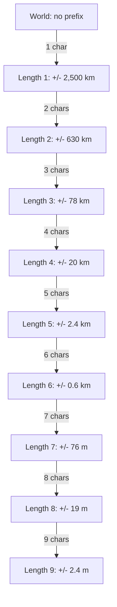
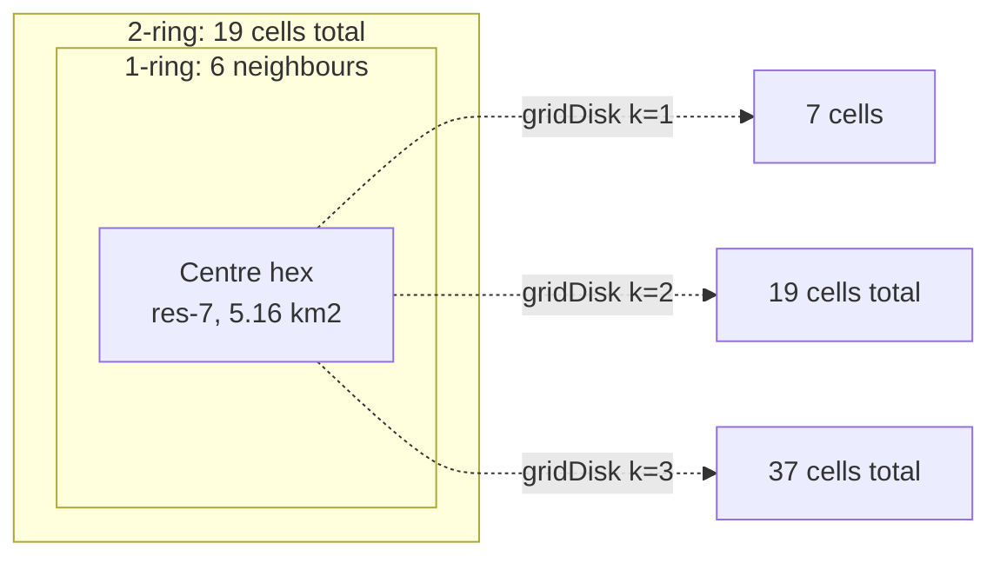
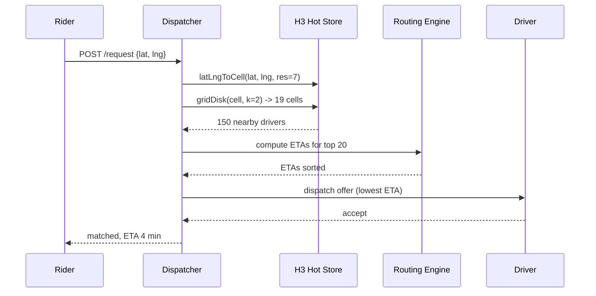
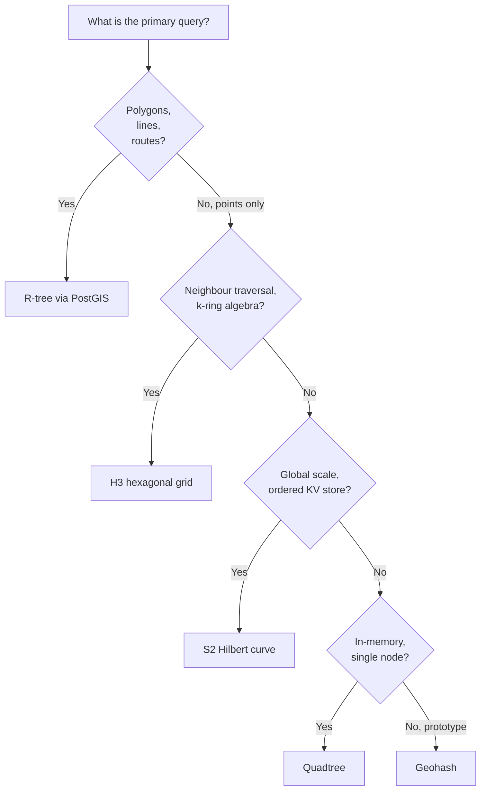

# Geospatial Indexing: Geohash, Quadtree, R-tree, S2, and H3

> **TL;DR**: A hash index answers equality; a B-tree answers 1-D range; neither answers "give me everything within 2 km of this point." You need a geospatial index. For dispatch and proximity, use H3 (uniform hexagonal neighbours, clean k-ring). For global distance queries on an ordered KV store, use S2 (Hilbert curve on a sphere, 64-bit integer keys). For polygon and route queries, use PostGIS with its R-tree GiST index. Uber processes over 40 million trips per day[^1] using H3 res-7 cells for driver matching. PostGIS efficiently handles nearest-K queries via GiST R-tree indexes[^2]. Redis GEO handles hundreds of thousands of operations per second on a single node with 52-bit geohash encoding[^3].

## Learning Objectives

After this module, you will be able to:

- [ ] Explain why hash and B-tree indexes fail for geospatial range queries
- [ ] Choose between geohash, quadtree, R-tree, S2, and H3 for a given workload
- [ ] Implement a k-nearest-neighbour search using ring expansion or bounded-box filter
- [ ] Reason about hotspot and re-indexing failure modes at city-scale density
- [ ] Map the index choice to real systems: PostGIS, Redis GEO, S2, H3, Elasticsearch geo_point

## Intuition

You are standing at a street corner in a grid city, looking for the nearest coffee shop. Your phone has a list of every shop in the city sorted alphabetically. Useless. It also has a list sorted by street number. Still useless, because "nearby" means close in two dimensions, not one.

Now imagine the city painted a fishnet grid over itself. Each square in the grid has a code: row 3, column 7 becomes "3-7." Your phone can instantly pull all shops in square "3-7" and the eight squares around it. That is a geospatial index: it converts a 2-D proximity question into a set of 1-D lookups.

The five indexes in this chapter are different ways to paint that fishnet. Geohash uses a Z-shaped curve. S2 uses a Hilbert curve on a sphere. H3 uses hexagons instead of squares. Quadtree adapts the grid size to density. R-tree wraps shapes in bounding boxes. Each makes a different trade-off between uniformity, precision, and query flexibility. By the end of this chapter, you will know which fishnet to paint for your workload.

## Theory

### Why geospatial is hard

A B-tree sorts keys along one dimension. You can ask "give me all keys between 100 and 200" in O(log n). But latitude and longitude are two dimensions. A point at (37.77, -122.41) is close to (37.78, -122.40), but a B-tree on latitude alone would scatter them across different longitude ranges.

The fundamental problem: you need 2-D locality in a 1-D index. Space-filling curves solve this by interleaving coordinate bits into a single sortable key. Points that are close in 2-D tend to be close in the 1-D curve, though not always (this is where edge cases bite).

A second problem: the Earth is a sphere. A degree of longitude is 111.3 km at the equator but shrinks to zero at the poles. Euclidean distance (`sqrt(dx^2 + dy^2)`) is wrong for any distance over a few kilometres. Production systems use Haversine (spherical earth, within 0.5% error[^4]) or Vincenty (ellipsoidal earth, sub-millimetre accuracy[^5]).

### Common queries

Every geospatial workload reduces to one of four query types:

- **Nearest-K**: "Find the 10 closest drivers to this rider." Requires distance-ordered traversal.
- **Range (radius)**: "Find all restaurants within 2 km." A circle on the map becomes a set of cell lookups plus a distance filter.
- **Bounding box**: "Find all POIs in this viewport." The simplest query: a rectangle maps directly to index range scans.
- **Containment**: "Is this point inside the delivery zone polygon?" Requires geometry-aware indexes like R-tree.

Your index choice depends on which query dominates your workload.

### Geohash and Z-order curve

Geohash interleaves latitude and longitude bits along a Z-order (Morton) curve, then base-32 encodes the result[^6]. Each character adds 5 bits of precision:

*Each geohash character halves the error; length 6 gives city-block precision, length 9 gives room-level precision.*

The killer advantage: any string-indexed store (Postgres, MySQL, DynamoDB, Redis) can range-scan on geohash prefixes. Truncating characters zooms out. Redis GEO uses exactly this: a 52-bit interleaved geohash stored as a sorted-set score[^3].

The killer flaw: the "edge straddle" problem. Two points a metre apart on opposite sides of a cell boundary share no prefix. Worse, at the antimeridian (180 degrees), a point at (0, 179.999) has longitude bits `111111...` while (0, -179.999) has `000000...`. No shared prefix despite being metres apart[^6]. Always query the centre cell plus its 8 neighbours.

### Quadtree and KD-tree

A quadtree recursively splits space into four quadrants (NW/NE/SW/SE). Each leaf holds points up to a capacity threshold (typically 4 to 16 items). When a leaf overflows, it splits into four children.

Quadtrees adapt perfectly to data density. Manhattan becomes a deep subtree; Antarctica stays a single leaf. This makes them excellent for in-memory single-node workloads: game servers, collision detection, CAD tools.

The downsides are severe for distributed systems. Splits depend on where data landed, so two replicas drift in tree shape. You cannot hash-route to a deterministic partition. Uber chose H3's deterministic hexagonal grid over approaches like quadtrees, citing the advantages of uniform grid cells that provide comparable shapes and sizes across cities[^7]. KD-trees (binary splits alternating dimensions) share the same distribution problem.

### R-tree and PostGIS

The R-tree (Guttman, SIGMOD 1984) is a height-balanced tree where every node stores Minimum Bounding Rectangles (MBRs) for its children[^8]. Leaves hold actual geometry: points, lines, polygons. Search prunes by MBR intersection. The `<->` operator in PostGIS walks the R-tree in distance order for k-NN queries[^2].

R-tree is the only index here that handles polygons and routes natively. `ST_Contains`, `ST_Intersects`, `ST_DWithin` all lean on it. PostGIS implements it via GiST (Generalized Search Tree), which allows user-defined operator classes for different geometry types.

The ceiling: single-writer friction. GiST splits hold page-level write locks, so a PostGIS instance hits a write throughput ceiling well below its read capacity, with contention becoming significant under heavy concurrent inserts. For read-heavy analytics and static POI datasets, this is fine. For real-time driver tracking at Uber scale, it is not.

### H3: Uber's hexagonal grid

H3 tiles the Earth with hexagons on a sphere-circumscribed icosahedron. It has 16 resolutions: res-0 cells are 4.3 million km^2, res-15 cells are 0.9 m^2[^9]. The default dispatch resolution at Uber is res-7 (average area 5.16 km^2, average edge 1.40 km)[^9].

Why hexagons? A hexagon has exactly one centre-to-centre distance to all 6 neighbours. A square has two distances (edge vs diagonal). This matters for gradient calculations like surge pricing, where you need uniform neighbour weighting[^7].

*H3 k-ring expansion: gridDisk(k) returns 1 + 3k(k+1) cells, giving a clean "nearby" primitive for dispatch.*

The `gridDisk` function returns the k-ring neighbourhood in O(1) per cell. For "find nearby drivers," you compute `gridDisk(riderCell, k=2)`, look up drivers indexed by those 19 cells, and rank by ETA.

The catch: 12 pentagon cells per resolution (at icosahedron vertices, placed in the ocean by design[^9]). `gridDistance` can fail when paths cross a pentagon. Treat it as best-effort and fall back to Haversine.

### S2: Google's Hilbert curve on a sphere

S2 projects the unit sphere onto six cube faces, applies a Hilbert curve to each face, and links them into one continuous loop. Each cell gets a 64-bit S2CellId with 30 levels of subdivision, reaching about 1 cm^2 at the finest level[^10].

The key property: numerically close cell IDs are spatially close. This means a plain B-tree range scan on a 64-bit integer column becomes a spatial range scan. Any ordered KV store (Bigtable, Spanner, Cassandra, Postgres) becomes a geo index with zero special infrastructure.

Queries use `S2RegionCoverer` to approximate a search region as a set of cell-ID ranges (default 8 ranges). Each range becomes a B-tree scan; the union is filtered by exact geometry. S2 is commonly used in industry for venue and location search due to its efficient integer-key indexing[^10].

S2 uses a Hilbert curve rather than Z-order because Hilbert preserves locality better: adjacent cells in the curve are always adjacent in 2-D, while Z-order has the "jumps" that make geohash notorious at boundaries.

### Distance math: Haversine vs Vincenty

- **Haversine**: assumes a perfect sphere. Fast. Error up to 0.5% (about 500 m on a 100 km trip)[^4]. Use for "within N kilometres" filters where the error is noise.
- **Vincenty**: models the WGS84 ellipsoid. Sub-millimetre accuracy[^5]. Use for billing, compliance, and safety thresholds.
- **Euclidean**: wrong for anything beyond a few hundred metres. A degree of longitude varies from 111 km at the equator to 0 km at the poles.

PostGIS `geography` type defaults to Vincenty. The `geometry` type does planar math in whatever SRID you declare. Mixing SRIDs in a `ST_Distance` call returns meaningless numbers silently.

## Real-World Example

Uber processes over 40 million trips per day (3.8 billion in Q4 2025)[^1]. Every trip starts with "find available drivers near this rider" and must complete in under 100 ms.

**The index**: H3 at resolution 7. Driver apps emit location updates every 4 seconds, keyed by H3 cell. The matchmaker computes `gridDisk(riderCell, k=2)` to get 19 candidate cells, then queries a hot store (Redis or in-memory) for drivers in those cells.

**Why H3 over alternatives**: Uber's engineering team chose hexagons because surge pricing requires gradient computation across neighbours. With squares, diagonal neighbours are sqrt(2) farther than edge neighbours, distorting the gradient. With hexagons, all 6 neighbours are equidistant[^7].

**The dispatch flow**:

*Uber's dispatch pipeline: H3 k-ring finds candidate drivers, a routing engine ranks by ETA, and bipartite matching assigns the optimal pair.*

**Resolution choices**: Res-7 (5.16 km^2) for coarse matching, res-8 to res-9 (0.74 to 0.11 km^2) for surge heatmaps[^9]. Finer resolutions split stadium hotspots into manageable chunks.

**Scale numbers**: At 33M trips/day, that is roughly 380 ride requests per second average, with peaks 3-5x higher. Each request triggers a k-ring lookup across 19 cells, filtering to the nearest 10-20 drivers, then an ETA computation. The entire pipeline completes in under 100 ms.

## Trade-offs

| Index | Pros | Cons | Best when | Our Pick |
|---|---|---|---|---|
| Geohash | Any DB stores strings; prefix = zoom | Edge-straddle, uneven cells at poles | Prototypes, single-region apps | Use for Redis GEO or quick MVPs |
| Quadtree | Adapts to density, simple bounding-box | Hard to distribute, no neighbour primitive | In-memory single-node (games, CAD) | Use only if single-process |
| R-tree (PostGIS) | Polygons, exact distance, full SQL | Single-writer lock contention ceiling | Static POIs, geofences, analytics | Use for polygon/route queries |
| S2 | 64-bit key in any KV store, handles poles | Complex API, k-ring messier than H3 | Global mapping, region covering | Use for planet-scale ordered-KV |
| H3 | Uniform neighbours, clean k-ring, 64-bit | 12 pentagons, coverage approximation error | Dispatch, surge pricing, proximity | Use for real-time spatial matching |

## Common Pitfalls

> [!WARNING]
> **Antimeridian breaks geohash queries.** Two points metres apart at longitude 179.999 and -179.999 share zero prefix bits. Your "nearby" query returns nothing. Fix: use S2 or H3 (both handle the antimeridian correctly), or explicitly union queries across the +180/-180 boundary.

> [!WARNING]
> **Geohash boundary over-fetch.** A point near a cell edge requires querying 9 cells (centre + 8 neighbours) to avoid missing nearby results. Naive implementations query only the centre cell and miss 20-40% of true neighbours.

> [!WARNING]
> **Stadium hotspot pins one shard.** A 50K-seat stadium emptying at event end generates 40K+ requests in one H3 res-7 cell. If you shard by cell ID, one shard takes 40K hot reads/sec while peers sit idle. Fix: drop to res-8 or res-9 for hot regions, or shard by driver_id with a secondary cell index.

> [!WARNING]
> **Euclidean distance is wrong on a sphere.** Using `sqrt(dlat^2 + dlng^2)` gives errors up to 30% at high latitudes because a degree of longitude shrinks toward the poles. Always use Haversine (0.5% error) or Vincenty (sub-mm) for production distance calculations.

> [!WARNING]
> **Projection mismatch between write and read paths.** Writes use SRID 4326 (WGS84 degrees), reads use SRID 3857 (Web Mercator metres). PostGIS accepts cross-SRID `ST_Distance` but returns meaningless numbers. Fix: always use the `geography` type for distance work, which forces spheroidal math.

> [!WARNING]
> **Dense urban centres overwhelm uniform grids.** A single H3 res-8 cell (0.74 km^2) in Manhattan may contain 10,000 drivers. Your "nearby" query returns too many candidates, wasting compute on ETA calculations. Fix: use adaptive resolution (finer in cities, coarser in suburbs) or cap candidate sets with distance-ordered ranking.

## Exercise

Design the geospatial subsystem for a ride-hailing service with 1 million active drivers, 10,000 concurrent ride requests per second, and a sub-100 ms response time target. Pick an index, justify it, size the storage tier, and handle a stadium-after-concert hotspot where 40,000 riders request simultaneously in one cell.

Hint

Think about which index gives you a clean "nearby" primitive without computing distances for every driver. Consider how many cells a k-ring at k=2 covers, and how many drivers fall in each cell on average. For the hotspot, think about resolution switching.

Solution

**Index choice**: H3 at resolution 7 (5.16 km^2 per cell). Reason: uniform neighbours for clean k-ring expansion, 64-bit integer keys for Redis sorted sets, and Uber's proven track record at similar scale.

**Storage sizing**: 1M drivers, each stored as a Redis sorted-set member keyed by H3 res-7 cell. At ~100 bytes per entry (member name + score + overhead), that is ~100 MB. Redis handles this trivially on a single node. For 10K requests/sec, each triggering a `gridDisk(k=2)` lookup across 19 cells, you need ~190K ZRANGEBYSCORE operations/sec. A single Redis node handles 500K+ ops/sec, so one node suffices for the index layer.

**Query flow**: Rider request arrives. Compute `latLngToCell(lat, lng, res=7)`. Call `gridDisk(cell, 2)` to get 19 cells. For each cell, `ZRANGEBYSCORE` on the Redis sorted set to get drivers. Filter by Haversine distance (the k-ring may include drivers beyond the desired radius). Rank top 20 by straight-line distance, compute ETAs for those 20 via routing engine, dispatch to the best.

**Hotspot handling**: When 40K riders request from one res-7 cell simultaneously, the candidate driver set in that cell is exhausted quickly. Solution: (1) expand k to 3 or 4 to pull drivers from farther cells, (2) switch to res-9 (0.11 km^2) for the hot region so requests spread across ~50 sub-cells instead of 1, (3) rate-limit dispatch offers per driver to prevent the same 100 drivers from getting 400 simultaneous offers.

**Comparison to Uber**: Uber uses H3 res-7 as the default dispatch grid and res-9 for surge heatmaps. Our design matches. The key difference at Uber's scale (33M trips/day vs our ~860K) is that they run a bipartite matching optimizer (Hungarian algorithm) rather than simple nearest-driver dispatch.

## Key Takeaways

- There is no universal best geospatial index. The right choice depends on whether your queries are nearest-K, range, polygon, or neighbour traversal.
- Space-filling curves (geohash, S2) let any ordered KV store serve as a geospatial index, which is why they dominate at scale.
- Hexagons (H3) give uniform neighbour distance, making them ideal for gradient computations like surge pricing and dispatch.
- Always query the centre cell plus neighbours. A single-cell lookup misses 20-40% of true nearby results at cell boundaries.
- Plan for hotspots before launch. Dense cities and event venues will concentrate traffic in one or two cells.
- Use Haversine for "within N km" filters; use Vincenty for billing and compliance thresholds. Never use Euclidean on geographic coordinates.
- If you need polygons or routes, you need R-tree via PostGIS. Curve-based indexes do not handle shapes natively.

## Further Reading

- [H3: Uber's Hexagonal Hierarchical Spatial Index](https://www.uber.com/en-CA/blog/h3/) - The origin post explaining why hexagons beat squares for marketplace gradient computations; essential reading for any dispatch system design.
- [S2 Geometry Cell Hierarchy](https://s2geometry.io/devguide/s2cell_hierarchy) - Deep dive into the Hilbert curve projection, cell-ID bit layout, and region covering algorithms; read this before implementing S2 in production.
- [H3 Resolution Table](https://h3geo.org/docs/core-library/restable/) - Canonical cell-area numbers across all 16 resolutions; bookmark this for capacity estimation.
- [PostGIS ST_DWithin Documentation](https://postgis.net/docs/ST_DWithin.html) - The reference for proximity filters with GiST R-tree indexes, including the `use_spheroid` flag that controls Haversine vs Vincenty.
- [Redis Geospatial Commands](https://redis.io/docs/latest/develop/data-types/geospatial/) - GEOADD/GEOSEARCH command surface, 52-bit geohash encoding, and O(N + log M) complexity analysis.
- [BKD-backed geo_shapes in Elasticsearch](https://www.elastic.co/blog/bkd-backed-geo-shapes-in-elasticsearch-precision-efficiency-speed) - How Elasticsearch achieved 138,236:1 compression over quadtree prefix encoding using triangular tessellation.
- [Guttman, R-trees: A Dynamic Index Structure for Spatial Searching, SIGMOD 1984](https://dl.acm.org/doi/10.1145/602259.602266) - The original R-tree paper; still the reference for understanding MBR-based spatial search.
- [Should You Use H3 for Geospatial Analytics?, Apache Sedona 2025](https://sedona.apache.org/latest/blog/2025/09/05/should-you-use-h3-for-geospatial-analytics-a-deep-dive-with-apache-spark-and-sedona/) - Empirical H3 coverage error benchmarks showing 3.8x over-count at res-8; read before trusting H3 for analytics.

## Flashcards

**Q:** Why can't a B-tree index answer "find all points within 2 km of P"?
**A:** A B-tree sorts along one dimension. Proximity is a 2-D property. Two points close in latitude may be far in longitude, so a single-dimension range scan cannot express a radius query.

**Q:** What is the "edge straddle" problem in geohash?
**A:** Two points metres apart on opposite sides of a cell boundary share no common prefix. A query on the centre cell alone misses them. Fix: always query the centre plus 8 neighbouring cells.

**Q:** Why did Uber choose hexagons over squares for H3?
**A:** A hexagon has exactly one centre-to-centre distance to all 6 neighbours. Squares have two distances (edge vs diagonal), which distorts gradient computations like surge pricing.

**Q:** How many cells does H3 gridDisk(k=2) return?
**A:** 1 + 3k(k+1) = 1 + 3(2)(3) = 19 cells. The formula gives the centre plus all cells within k rings.

**Q:** What are the 12 pentagon cells in H3?
**A:** Hexagons cannot perfectly tile a sphere. H3 places 12 pentagons at icosahedron vertices (in the ocean by design). gridDistance can fail across pentagon boundaries.

**Q:** When should you use Haversine vs Vincenty for distance?
**A:** Haversine (spherical, 0.5% error) for "within N km" filters where error is noise. Vincenty (ellipsoidal, sub-mm) for billing, compliance, and safety thresholds.

**Q:** What is the write throughput ceiling of PostGIS with a GiST R-tree index?
**A:** GiST splits hold page-level write locks, creating significant contention under concurrent inserts. The exact ceiling depends on hardware and workload, but write throughput is substantially lower than read throughput.

**Q:** How does Redis GEO encode coordinates?
**A:** It interleaves latitude and longitude into a 52-bit geohash stored as the score of a sorted set. The 52-bit limit comes from the double-precision mantissa, giving about 60 cm precision.

**Q:** What is the default dispatch resolution at Uber?
**A:** H3 resolution 7, with an average cell area of 5.16 km^2 and average edge length of 1.40 km. Surge heatmaps use res-8 to res-9 for finer granularity.

**Q:** How does S2 differ from geohash in curve choice?
**A:** S2 uses a Hilbert curve (adjacent cells in the curve are always adjacent in 2-D). Geohash uses a Z-order curve, which has "jumps" that break locality at cell boundaries.

**Q:** Which geospatial index should you pick for polygon containment queries?
**A:** R-tree via PostGIS. It is the only production index that handles polygons, lines, and routes natively with exact geometry operations like ST_Contains and ST_Intersects.

*Decision flowchart: start from your workload and land on the right geospatial index.*

## References

[^1]: "Uber Announces Results for Fourth Quarter and Full Year 2024", Uber Investor Relations (3.1B trips in Q4 2024, approximately 33M trips/day). https://investor.uber.com/news-events/news/press-release-details/2025/Uber-Announces-Results-for-Fourth-Quarter-and-Full-Year-2024
[^2]: "ST_DWithin", PostGIS Documentation. https://postgis.net/docs/ST_DWithin.html
[^3]: "Redis geospatial", Redis Documentation (GEOADD, GEOSEARCH with complexity notes). https://redis.io/docs/latest/develop/data-types/geospatial/
[^4]: "Great-circle distance", Wikipedia. https://en.wikipedia.org/wiki/Great-circle_distance
[^5]: "Distance on an ellipsoid: Vincenty's Formulae", Esri Community. https://community.esri.com/t5/coordinate-reference-systems-blog/distance-on-an-ellipsoid-vincenty-s-formulae/ba-p/902053
[^6]: "Geohash", Wikipedia (includes precision table and limitations section). https://en.wikipedia.org/wiki/Geohash
[^7]: "H3: Uber's Hexagonal Hierarchical Spatial Index", Uber Engineering Blog. https://www.uber.com/en-CA/blog/h3/
[^8]: Guttman, A. (1984). "R-trees: A dynamic index structure for spatial searching", ACM SIGMOD 1984. https://dl.acm.org/doi/10.1145/602259.602266
[^9]: "Tables of Cell Statistics Across Resolutions", h3geo.org. https://h3geo.org/docs/core-library/restable/
[^10]: "S2 Cells and the S2CellId Numbering", s2geometry.io Developer Guide. https://s2geometry.io/devguide/s2cell_hierarchy
