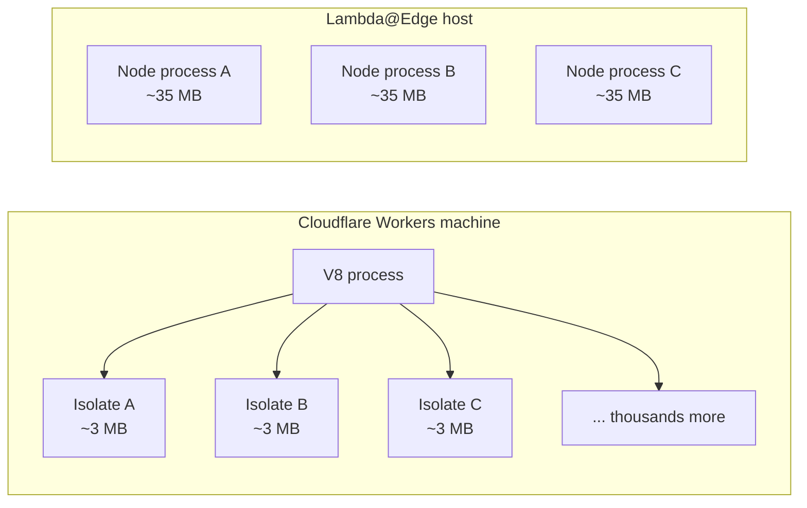
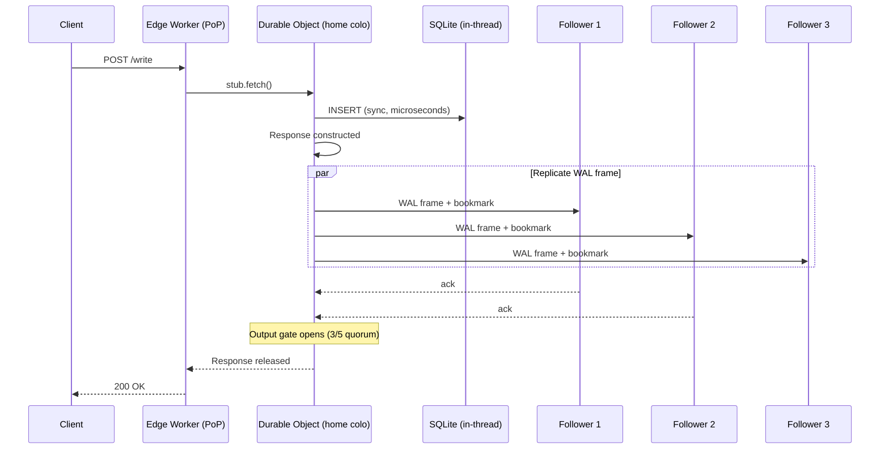
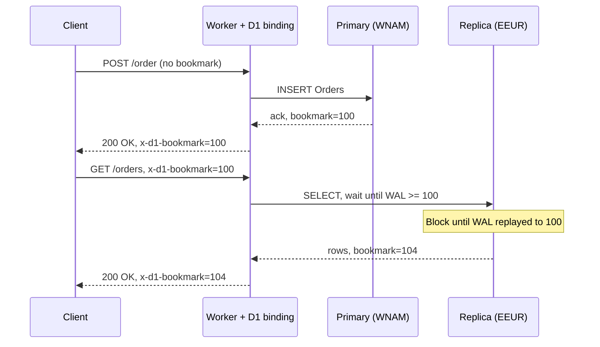
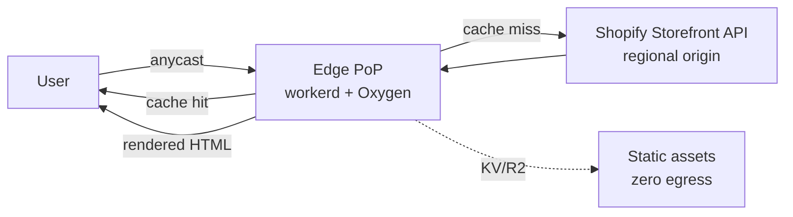

# Edge Computing (Cloudflare Workers, Lambda@Edge, Deno Deploy)

> **TL;DR**: Edge computing runs application code in hundreds of PoPs rather than a handful of regions. Cloudflare Workers operates in 330+ cities with sub-5 ms cold starts by sharing one V8 process across thousands of tenants [^1]. The appeal is latency: compute within milliseconds of most Internet-connected users [^2]. The trap is assuming that moving code closer to users also moves data closer. It does not. Successful edge applications are hybrid: stateless transforms at the edge, system of record at the origin, and carefully chosen stateful primitives (Durable Objects, D1, Turso) bridging the gap.

## Learning Objectives

After this module, you will be able to:

- [ ] Describe the three dominant edge runtime models and their execution constraints
- [ ] Explain Durable Objects and how they enable stateful edge computing
- [ ] Choose between global-regional-edge tiers for a given workload
- [ ] Design edge data access patterns using D1 Sessions, KV, and Hyperdrive
- [ ] Avoid anti-patterns: heavy compute at edge, chatty back-to-origin calls, KV as transactional store

## Intuition

You run a chain of coffee shops across 330 cities. Each shop has a barista (compute), a small display case (cache), and a menu board (config). Customers get their coffee in seconds because the shop is on their block.

But the shops do not roast their own beans. Every night, a truck delivers fresh beans from a central roastery (the origin). If a customer orders a rare single-origin pour-over that is not in stock, the barista calls the roastery and the customer waits for a courier. The shop is fast for common orders and slow for rare ones.

Now imagine one special shop in each region that keeps a ledger of loyalty points. Every customer worldwide has exactly one ledger, pinned to one shop. If you are near that shop, checking your balance is instant. If you are across the ocean, you wait for the call to cross the water. That ledger is a Durable Object: one instance, one location, strongly consistent, but not magically global.

Edge computing works the same way. The PoP is the coffee shop. The barista is a V8 isolate with a tight CPU budget (10 ms on the Free plan, 30 s default on Paid). The display case is the edge cache. The roastery is your origin database. And the loyalty ledger is the stateful primitive that makes the edge more than a glorified CDN. The rest of this chapter makes these ideas precise.

## Theory

### Edge runtimes and cold starts

[CDNs and Edge Delivery](../part-2-building-blocks/02-cdns.md) introduced the CDN as a cache layer. Edge computing extends that layer with programmable request handling. Three runtime families dominate:

**V8 isolates** (Cloudflare Workers, Deno Deploy, Vercel Edge Functions) share a single V8 process across thousands of tenants on one machine. Context-switching between isolates requires no OS-level process switch. Cold start is approximately 5 ms and memory overhead is roughly 3 MB per tenant, compared to 35 MB for a Node.js Lambda container [^1]. The trade-off: code must target JavaScript, TypeScript, or WebAssembly. No native binaries, no arbitrary system calls.

**WebAssembly sandboxes** (Fastly Compute) compile tenant code to Wasm and spin a fresh Wasmtime sandbox per request [^3]. This gives the strongest per-request isolation and true polyglot support (Rust, Go via TinyGo, JavaScript via Javy). Cold starts are on the order of microseconds for lightweight functions.

**MicroVM platforms** (AWS Lambda@Edge, Fly.io via Firecracker) boot a hardware-virtualized VM per tenant. Full OS semantics, any language, but cold starts of 50 to 100 ms and higher memory overhead [^4].

*V8 isolates share one process across thousands of tenants, using roughly 10x less memory per tenant than containerized Lambda functions [^1].*

The CPU budget is the constraint that shapes everything. On the current Workers Standard plan, each HTTP request defaults to 30 seconds of CPU time and can be raised up to 5 minutes; the Workers Free plan caps CPU at 10 ms per request (wall-clock time during `await` does not count toward CPU time) [^5]. The legacy Bundled plan's 50 ms CPU ceiling remains on grandfathered Workers but is no longer the default for new deployments. CloudFront Functions are far tighter: sub-millisecond execution, 2 MB memory, 10 KB code, ECMAScript 5.1 only [^6]. Lambda@Edge allows up to 30 seconds but deploys only to CloudFront's 15 Regional Edge Caches, not to every PoP [^6].

| Platform | Cold start | CPU budget | Memory | Locations | Language |
|---|---|---|---|---|---|
| Cloudflare Workers | ~5 ms | 30 s default, 5 min max (Paid); 10 ms (Free) | 128 MB | 330+ cities | JS/TS/Wasm |
| CloudFront Functions | sub-ms | sub-ms | 2 MB | 750+ PoPs | ES 5.1 only |
| Lambda@Edge | 50 to 100 ms | 30 s | 128 MB (viewer) / 10 GB (origin) | 15 Regional Edge Caches | Node/Python |
| Deno Deploy | sub-50 ms | configurable | 512 MB | global (multi-region) | TS/JS/Wasm |
| Fastly Compute | microseconds | configurable | 128 MB | ~90 cities | Rust/Go/JS (Wasm) |
| Vercel Edge Functions | ~5 ms | 30 s (Fluid) | 128 MB | multi-region | JS/TS |

### Stateful edge with Durable Objects

Most edge runtimes are stateless by design. Durable Objects (DOs) break that rule. A DO is a single-instance, named, locality-bound actor with private SQLite storage [^7]. Every request for a given name, from anywhere in the world, routes to the same instance on the same machine.

SQLite runs in the same thread as application code. Queries execute synchronously in microseconds because the database is a library call, not a network hop [^7]. The absence of `await` between a SELECT and an UPDATE is the correctness property: no concurrent request can interleave because JavaScript is single-threaded and the "input gate" holds other events during an await.

Writes are asynchronously replicated to five "durability follower" machines in different datacenters via Cloudflare's Storage Relay Service. The "output gate" holds the Worker's response until at least 3 of 5 followers acknowledge the write [^7]. This guarantees durability without blocking application code.

*The output gate holds the response until a 3-of-5 durability quorum confirms the write. The application sees synchronous SQL, but the system guarantees multi-datacenter durability [^7].*

**WebSocket hibernation** extends DOs for real-time use cases. Using `ctx.acceptWebSocket()` instead of `ws.accept()`, the runtime can evict the DO from memory while keeping TCP connections open at the edge. The DO wakes only when a message arrives [^8]. A chat room with 10,000 idle connections incurs zero duration charges until someone speaks.

The single-writer property is the feature, not the bug. It eliminates distributed coordination for per-key state: rate limiters, session stores, collaborative document locks, game lobbies. But a DO pinned in North America serves European users with 100+ ms cross-Atlantic latency on every request. Use `locationHint` or region-prefixed naming to control placement.

### Edge databases and storage

Edge databases solve the read path. Writes still bottleneck at a primary, but reads can be served from nearby replicas.

**D1** is Cloudflare's SQLite-backed edge database. Under the hood, each D1 database is a Durable Object with automatic read replicas in every supported region [^9]. The Sessions API provides read-your-writes consistency: every write returns a monotonic "bookmark" (a Lamport timestamp). Clients pass that bookmark on subsequent reads, and replicas wait until they have replayed up to that point before answering [^9]. Confirm lag from ENAM primary to WEUR replica is approximately 55 ms [^9].

*The client carries the bookmark through the round trip; replicas block reads until their WAL has caught up to that bookmark, preventing stale-replica reads after a fresh write [^9].*

**Workers KV** is an eventually-consistent global key-value store. Reads from a cached PoP are served with low latency. Writes propagate asynchronously. It is designed for "mostly read, occasional write" patterns like feature flags and configuration. It is not transactional and has no compare-and-swap.

**R2** is S3-compatible object storage with zero egress fees [^10]. At $0.015/GB-month storage and $0 egress, it undercuts AWS S3 dramatically for read-heavy workloads.

**Hyperdrive** is a connection pool and query cache for external PostgreSQL/MySQL databases. It routes queries over Cloudflare's backbone, reducing connection overhead and caching read results at the edge. It does not make a regional Postgres global; it makes accessing one faster from the edge.

**Turso** uses libSQL (a SQLite fork) with "embedded replicas" that maintain a local SQLite file synced from a cloud primary [^11]. Reads are zero-latency (local file); writes go to the primary. This is the closest thing to a true edge-first database today.

### Patterns that work at the edge

**Edge cache with stale-while-revalidate.** Serve stale content instantly while refreshing in the background. Combined with Tiered Cache (funneling PoP misses through an upper-tier cache before hitting origin), this eliminates thundering-herd storms on TTL expiry.

**Edge API gateway.** Auth token validation, rate limiting, request routing, and header manipulation all fit comfortably within a handful of milliseconds of CPU time, well under the Standard 30-second default. The edge becomes a security and routing front door without adding origin latency.

**Edge SSR and React Server Components.** Shopify Hydrogen renders storefronts on Oxygen (Cloudflare's `workerd` runtime). Vercel's Fluid Compute pre-warms instances and uses in-function concurrency to share the JavaScript engine cost across requests [^12]. First byte arrives within tens of milliseconds of the user.

**Smart routing.** Cloudflare's Smart Placement automatically moves a Worker closer to its origin when the Worker makes more subrequests than it serves directly. This is the escape hatch for Workers that are accidentally chatty.

**Edge ML inference.** Workers AI bindings let you call inference models without shipping weights to the edge. The model runs on Cloudflare's GPU fleet; the Worker orchestrates the request.

### When NOT to use edge

The edge is a hybrid tier between CDN and origin. It is not a replacement for either.

**Heavy compute.** Image processing, PDF generation, video transcoding, and ML training all exceed the CPU budget. Offload to containers or origin.

**Chatty origin calls.** An edge handler making 8 sequential `fetch()` calls to `us-east-1` gives a user in Singapore 8 x 200 ms = 1.6 seconds. Moving the handler to the edge made latency worse, not better. Co-locate data with compute, batch calls, or use Smart Placement.

**Synchronous fan-out.** Aggregating responses from 5 microservices at the edge serializes cross-ocean round trips. Do the aggregation at the origin where services are colocated.

**Strong consistency across regions.** If every request must read the latest write globally, the edge adds a hop without reducing latency. Keep the request at the origin where the primary lives.

## Real-World Example

### Shopify Hydrogen on Oxygen: edge-rendered storefronts

Shopify's Hydrogen is a React-based storefront framework. Oxygen is the hosting platform that runs Hydrogen on Cloudflare's `workerd` runtime, deployed globally across Cloudflare's network [^13]. Every paid Shopify plan includes Oxygen at no extra infrastructure cost.

The architecture is straightforward: a Hydrogen storefront is a Worker. It receives a request at the nearest PoP, renders React Server Components, fetches product data from Shopify's Storefront API (cached aggressively at the edge), and returns personalized HTML. The local development server replicates the production Workers runtime exactly, so what runs locally runs in production.

*Shopify Oxygen renders Hydrogen storefronts at the edge PoP. Cache hits return in under 30 ms. Misses fetch from the Storefront API and cache the result for subsequent requests.*

Why this works: product catalog pages are read-heavy with predictable data shapes. The CPU cost of rendering a React component tree fits within the Worker budget. Writes (cart updates, checkout) route to Shopify's regional origin where transactional guarantees live. The edge handles the 95% of traffic that is browsing; the origin handles the 5% that is buying.

## Trade-offs

| Approach | Pros | Cons | Best when | Our Pick |
|---|---|---|---|---|
| Full origin (single region) | Simple, one data model | 100 to 200 ms for far users | Internal tools, regional apps | Only for internal/regional |
| CDN cache at edge | Huge latency win on cached paths | Stale data, no dynamic logic | Static + occasionally-dynamic | Default for static assets |
| Edge compute (stateless) | Personalized rendering, A/B, auth at 5 ms cold start | CPU budget (30 s default on Paid, 10 ms on Free), no state | Redirects, auth, transforms | Default for request shaping |
| Edge compute + Durable Objects | Stateful near users, 3-of-5 durability | Single-instance bottleneck, pinned to one region | Session state, rate limiting, coordination | When you need per-key state |
| Edge database (D1/Turso replicas) | Low-latency reads, session-pinned consistency | Writes still centralized, bookmark plumbing | Read-heavy, eventual OK for most reads | When reads dominate 10:1 |
| Edge-first local database (CRDT) | True offline, zero-latency reads | Restricted data model, sync complexity | Collaborative apps, field workers | Niche but powerful |

## Common Pitfalls

> [!WARNING]
> **Using KV as a transactional store.** A `get -> modify -> put` pattern loses writes under contention because KV is eventually consistent with no compare-and-swap. Use a Durable Object for counters, sessions, or any read-modify-write pattern.

> [!WARNING]
> **Thundering herd at origin on cache miss.** A popular page expires in cache and 330 PoPs all independently fetch the origin simultaneously. Use Tiered Cache to funnel misses through an upper-tier cache, and `stale-while-revalidate` to serve stale while refreshing asynchronously.

> [!WARNING]
> **Pinning Durable Objects in one region for a global audience.** A DO created in North America serves European users with 100+ ms cross-Atlantic RTT on every request. Use `locationHint`, region-prefixed naming, or a read-cache tier in front of the DO.

> [!WARNING]
> **Running heavy compute past the configured CPU limit.** Workers Free caps CPU at 10 ms; Workers Paid defaults to 30 s and can be raised to 5 min. Exceeding the configured limit terminates the request with a 1102 error. Offload image processing, PDF generation, and ML inference to containers or Workers AI bindings. Never run video transcoding at the edge.

> [!WARNING]
> **Chatty origin calls amplifying edge latency.** Eight sequential `fetch()` calls to a distant origin turn a 200 ms RTT into 1.6 seconds. Batch calls into a single BFF endpoint, co-locate data with compute via D1/Hyperdrive, or let Smart Placement move the Worker closer to the origin.

## Exercise

Design the rate-limiting logic for a public API that needs to enforce "100 requests per minute per API key" globally. The naive implementation hits a central Redis; at the edge you want sub-10 ms latency. Design a solution using Durable Objects (one object per API key, pinned to the first region that sees the key) and reason about what happens when a client migrates regions mid-minute.

Hint

Each API key maps to exactly one Durable Object instance. The DO maintains a sliding window counter in its SQLite storage. Think about what "pinned to the first region" means for a user who starts in Europe and moves to Asia mid-minute. The counter is still accurate (single-writer), but latency increases for the migrated user.

Solution

**Architecture:** Create a Durable Object class `RateLimiter`. Each API key maps to a DO by name (`env.RATE_LIMITER.idFromName(apiKey)`). The DO stores a sorted list of timestamps in SQLite.

**Request flow:**

1. Edge Worker extracts the API key from the request header.
2. Worker calls `rateLimiter.fetch()` with the current timestamp.
3. The DO prunes timestamps older than 60 seconds, counts remaining entries, and either allows (inserts timestamp, returns 200) or rejects (returns 429).

**Why this works:** The DO is single-threaded. No race conditions. No distributed locks. The counter is always accurate because there is exactly one writer. SQLite queries are synchronous microseconds.

**Region migration:** If a client starts in Frankfurt (where the DO is pinned) and moves to Tokyo, every rate-limit check now crosses the ocean (~150 ms RTT). The counter remains correct, but latency increases. This is acceptable for rate limiting because:

- The check is not in the critical path of the response body (you can check in parallel with origin fetch).
- Accuracy matters more than latency for abuse prevention.
- If latency is unacceptable, shard by region: `eu-{apiKey}`, `ap-{apiKey}`, with a slightly higher global limit to account for per-region undercounting.

**Trade-off accepted:** Per-region sharding trades accuracy for latency. A user could get 100 requests in EU and 100 in AP within the same minute. If strict global enforcement matters, accept the cross-ocean latency. If approximate enforcement is fine (most rate limiters are), shard by region.

## Key Takeaways

- Edge shines when latency matters and the work is small. It fails when you treat it as a cheaper origin.
- V8 isolates eliminated cold starts as a blocker (~5 ms vs 50 to 100 ms for Lambda@Edge), but the per-request CPU budget (10 ms on Free, 30 s default up to 5 min max on Paid) still shapes what you can do per request [^1][^5].
- Durable Objects are single-instance actors with embedded SQLite. The single-writer property eliminates distributed coordination for per-key state [^7].
- D1's Sessions API provides read-your-writes consistency via monotonic bookmarks. Without it, reads fall back to eventual consistency with no guarantees [^9].
- R2's zero-egress pricing makes edge-served static assets dramatically cheaper than S3 at scale [^10].
- The edge is additive to a regional origin, not a replacement. Most successful edge apps are hybrid: stateless transforms at edge, system of record at origin.
- Pick a consistency story explicitly: read-your-writes (D1 Sessions), eventual (KV), or strong single-writer (Durable Objects). Silence here creates bugs.

## Further Reading

- [Cloud Computing without Containers](https://blog.cloudflare.com/cloud-computing-without-containers/) - Cloudflare's 2018 argument for V8 isolates over containers; still the clearest statement of why the model matters and how it enables deploying every Worker to every PoP.
- [Zero-latency SQLite storage in every Durable Object](https://blog.cloudflare.com/sqlite-in-durable-objects/) - Kenton Varda's deep dive on Storage Relay Service, output gates, and why SQLite lives in the same thread as application code.
- [Sequential consistency without borders: how D1 implements global read replication](https://blog.cloudflare.com/d1-read-replication-beta) - The bookmark/Sessions API design with actual measured confirm-lag numbers across regions.
- [AWS CloudFront Functions vs Lambda@Edge](https://docs.aws.amazon.com/AmazonCloudFront/latest/DeveloperGuide/edge-functions-choosing.html) - The canonical comparison table; note the 10 KB code limit and 10,000 RPS ceiling on Lambda@Edge.
- [The Anatomy of an Isolate Cloud](https://deno.com/blog/anatomy-isolate-cloud) - Deno's take on V8-isolate architecture with extra security layers (seccomp, process-per-deployment).
- [How We Built Oxygen](https://shopify.engineering/how-we-built-oxygen) - Shopify's engineering post on running Hydrogen on Cloudflare's `workerd` runtime at global scale.
- [Turso Embedded Replicas](https://turso.tech/blog/do-it-yourself-database-cdn-with-embedded-replicas) - SQLite replica in the application process itself; local-first with cloud sync for the edge-first database pattern.
- [workerd GitHub repo](https://github.com/cloudflare/workerd) - Cloudflare's open-source Workers runtime (Apache 2.0); read the README for design principles and the "not a hardened sandbox" warning.

## Flashcards

**Q:** What is the fundamental difference between V8 isolates and Lambda@Edge containers?
**A:** V8 isolates share one OS process across thousands of tenants with ~3 MB overhead and ~5 ms cold start. Lambda@Edge runs a full Node.js process per tenant with ~35 MB overhead and 50 to 100 ms cold start. Isolates trade language flexibility (JS/Wasm only) for density and speed.

**Q:** What is the default CPU budget for a Cloudflare Worker, and what happens when you exceed it?
**A:** On the Workers Paid Standard plan, CPU time defaults to 30 seconds per HTTP request and can be raised up to 5 minutes. The Workers Free plan is capped at 10 ms. Wall-clock time during await does not count toward CPU time. Exceeding the configured limit terminates the request with a 1102 error. (The 50 ms figure comes from the deprecated Bundled usage model.)

**Q:** How does a Durable Object guarantee durability for writes?
**A:** The output gate holds the Worker's response until at least 3 of 5 durability followers in different datacenters acknowledge the WAL frame. The application sees synchronous SQL, but the system guarantees multi-datacenter persistence.

**Q:** What is WebSocket hibernation and why does it matter for cost?
**A:** Using `ctx.acceptWebSocket()`, the runtime evicts the DO from memory while keeping TCP connections open at the edge. The DO wakes only when a message arrives. A room with 10,000 idle connections incurs zero duration charges.

**Q:** How does D1's Sessions API provide read-your-writes consistency?
**A:** Every write returns a monotonic bookmark (Lamport timestamp). Clients pass that bookmark on subsequent reads. Replicas wait until they have replayed up to that bookmark before answering. Without the bookmark, reads fall back to eventual consistency.

**Q:** What is the confirm lag for D1 read replication from ENAM to WEUR?
**A:** Approximately 55 ms. Intra-region confirm lag is 30 to 45 ms.

**Q:** Why is Workers KV unsuitable for counters or session state?
**A:** KV is eventually consistent with no compare-and-swap. A get-modify-put pattern loses writes under contention. Use a Durable Object for any read-modify-write pattern.

**Q:** What does Cloudflare R2 charge for egress?
**A:** $0. R2 charges $0.015/GB-month for storage and zero for egress to the Internet. This makes it dramatically cheaper than S3 for read-heavy workloads at scale.

**Q:** When should you NOT use edge compute?
**A:** When the workload exceeds the CPU budget (image processing, video transcoding), when it requires multiple sequential origin calls (chatty BFF), when it needs strong global consistency on every request, or when the origin is already close to all users.

**Q:** What is Cloudflare Smart Placement?
**A:** An automatic optimization that moves a Worker closer to its origin when the Worker makes more subrequests than it serves directly. It is the escape hatch for Workers that are accidentally chatty with a distant backend.

**Q:** How does Shopify Oxygen use edge computing for storefronts?
**A:** Oxygen runs Hydrogen (React-based storefronts) on Cloudflare's `workerd` runtime globally across Cloudflare's network. Product pages render at the edge PoP with cached Storefront API data. Writes (cart, checkout) route to Shopify's regional origin.

**Q:** What is the core tension in edge computing?
**A:** Locality of compute vs locality of state. Pushing a function to 330 PoPs is easy. Pushing a consistent, writable database to 330 PoPs is not, because every write crosses the speed of light. Edge platforms resolve this with stateless compute, read replicas, or single-instance actors.

## References

[^1]: Zack Bloom, "Cloud Computing without Containers," Cloudflare Blog, November 2018. https://blog.cloudflare.com/cloud-computing-without-containers/
[^2]: Cloudflare, "Global Network." https://www.cloudflare.com/network/
[^3]: Fastly, "Getting started with Compute," 2024. https://www.fastly.com/documentation/guides/compute/getting-started-with-compute/
[^4]: Ann Pastushko, "Lambda@Edge vs. CloudFront Functions," 2024. https://annpastushko.substack.com/p/lambdaedge-vs-cloudfront-functions
[^5]: Cloudflare, "Workers Pricing" and "Workers Platform Limits." https://developers.cloudflare.com/workers/platform/pricing/ and https://developers.cloudflare.com/workers/platform/limits/
[^6]: AWS, "Differences between CloudFront Functions and Lambda@Edge." https://docs.aws.amazon.com/AmazonCloudFront/latest/DeveloperGuide/edge-functions-choosing.html
[^7]: Kenton Varda, "Zero-latency SQLite storage in every Durable Object," Cloudflare Blog, September 2024. https://blog.cloudflare.com/sqlite-in-durable-objects/
[^8]: Cloudflare, "Use WebSockets (Durable Objects)." https://developers.cloudflare.com/durable-objects/best-practices/websockets/
[^9]: Justin Mazzola Paluska and Lambros Petrou, "Sequential consistency without borders: how D1 implements global read replication," Cloudflare Blog, April 2025. https://blog.cloudflare.com/d1-read-replication-beta
[^10]: Cloudflare, "R2 Pricing." https://developers.cloudflare.com/r2/pricing/
[^11]: Turso, "Do It Yourself Database CDN with Embedded Replicas." https://turso.tech/blog/do-it-yourself-database-cdn-with-embedded-replicas
[^12]: Vercel, "A new compute model for modern workloads (Fluid compute)." https://vercel.com/resources/fluid-a-new-compute-model-for-modern-workloads
[^13]: Shopify Engineering, "How We Built Oxygen: Hydrogen's Counterpart for Hosting Custom Storefronts," August 2022. https://shopify.engineering/how-we-built-oxygen
