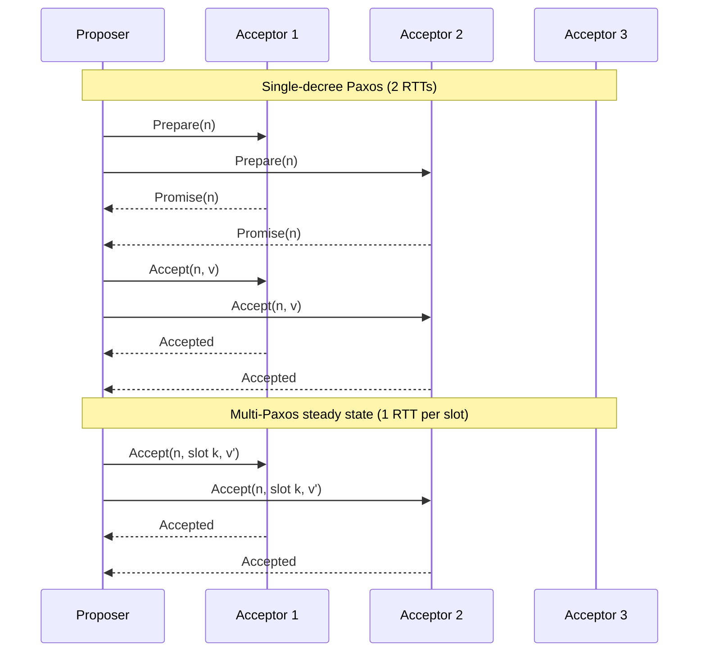
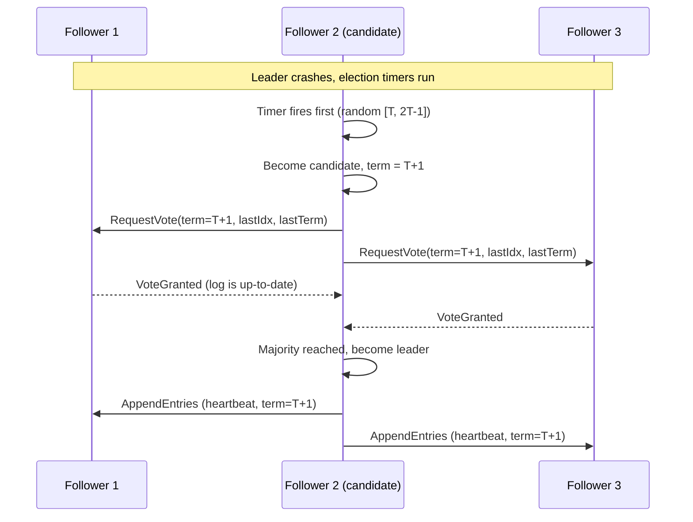
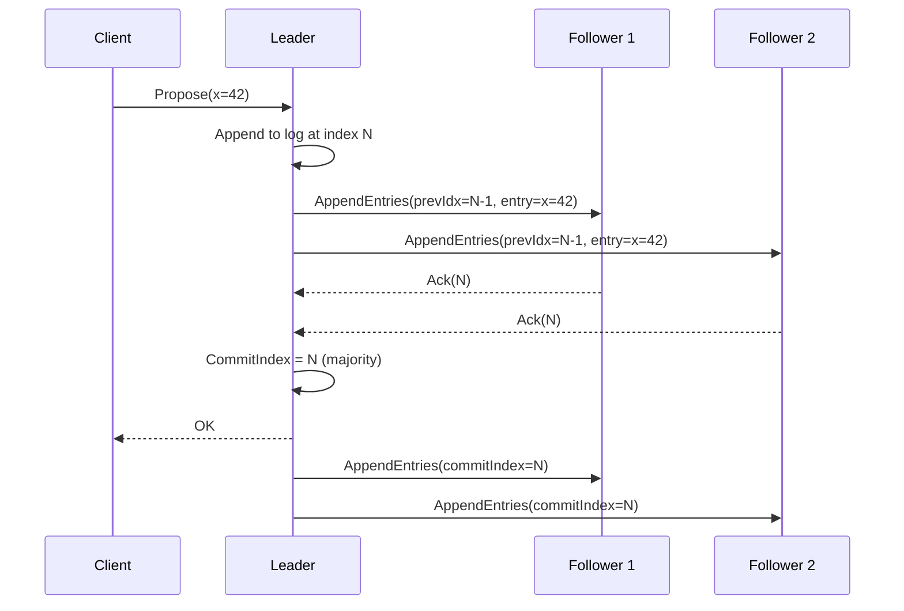
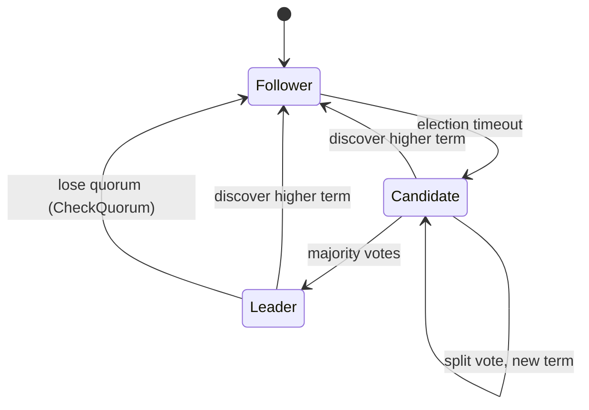
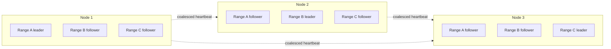

# Consensus Protocols: How Distributed Systems Agree

> **TL;DR**: Consensus is how a group of nodes agree on one value despite crashes and network delays. Practical protocols (Raft, Multi-Paxos) are always safe but only guarantee liveness when the network is well-behaved enough for a leader to hold its role. Every committed decision costs at least one round trip to a majority, so use consensus sparingly: for the state that must be correct (leader identity, cluster membership, transaction metadata), not for every request. A cluster of 2N+1 nodes tolerates N failures. etcd runs 3 to 5 nodes with a 100 ms heartbeat and < 10 ms WAL fsync p99[^1][^2]. If you are reaching for consensus per request, you probably do not need strong consistency at that layer.

## Learning Objectives

After this module, you will be able to:

- [ ] Explain the two phases of Paxos (prepare/promise, accept/accepted) and when each is skipped
- [ ] Walk through Raft leader election, log replication, and safety via term numbers
- [ ] Pick a cluster size (3, 5, 7) given the failure tolerance you need
- [ ] Reason about what a minority partition can and cannot do
- [ ] Recognize when you need consensus and when you do not
- [ ] Describe how multi-raft sharding scales write throughput beyond a single leader

## Intuition

Imagine a jury of five people deliberating a verdict. The judge says: "You must reach a majority decision, and you must do it by passing written ballots, because you cannot all talk at the same time." One juror is the foreman. She proposes a verdict, writes it on a slip, and passes copies to the other four. Once three of the five (including herself) sign the same slip, the verdict is final.

Now imagine one juror falls asleep mid-deliberation. The remaining four can still reach a majority of three. But if two jurors fall asleep, the awake three are exactly the majority, so one more nap and the jury is stuck. That is why five-member clusters tolerate two failures and no more.

What if the foreman falls asleep? The remaining jurors notice she stopped passing slips. After a random wait (so they do not all shout at once), one of them declares herself the new foreman, asks for votes, and resumes. The old foreman wakes up, sees a newer ballot number, and quietly becomes a regular juror again.

This is consensus. One leader proposes, a majority agrees, and the decision is durable even if some members crash. The rest of this chapter makes that precise.

## Theory

### What consensus solves

Consensus answers one question: how do N processes agree on a single value when some may crash and messages may be lost or delayed?

Formally, a consensus protocol must satisfy three properties[^3]:

1. **Agreement.** All correct processes decide the same value.
2. **Validity.** The decided value was proposed by some process.
3. **Termination.** Every correct process eventually decides.

The Fischer-Lynch-Paterson (FLP) impossibility result of 1985 proves that no deterministic algorithm in a purely asynchronous system can guarantee all three when even one process may crash[^3]. The intuition: you cannot distinguish a crashed peer from a slow one, so any algorithm must either wait forever (losing termination) or proceed with partial information (risking disagreement).

Practical protocols dodge FLP by assuming partial synchrony: they are always safe (agreement and validity hold no matter what), but only guarantee liveness (termination) when the network behaves well enough for a leader to maintain its role[^3]. This is not a theoretical curiosity. It means your Raft cluster will never corrupt data during a partition, but it may stop accepting writes until the partition heals.

The dominant use of consensus is the **replicated state machine** (RSM): a group of nodes agrees on an ordered log of commands, each applies those commands deterministically, and the group behaves as a single fault-tolerant machine[^4]. Leader election, distributed locks, configuration stores (etcd, ZooKeeper), and strongly-consistent databases (CockroachDB, Spanner) are all RSMs under the hood.

### Paxos in 15 minutes

Paxos is the original majority-quorum consensus protocol. It has three roles: proposer, acceptor, and learner. A single-decree Paxos run chooses one value in two phases[^5]:

**Phase 1 (Prepare/Promise).** A proposer picks a ballot number n and asks a majority of acceptors: "Promise not to accept anything numbered lower than n, and tell me the highest value you have already accepted." If a majority promises, the proposer proceeds.

**Phase 2 (Accept/Accepted).** The proposer sends accept(n, v) where v is either its own value or the highest previously-accepted value reported in phase 1. Once a majority of acceptors accept, the value is chosen.

*Multi-Paxos eliminates phase 1 after a stable leader is elected, cutting commit latency from two round trips to one in the common case.*

A single run takes two round trips. **Multi-Paxos** amortizes this by electing a stable leader that skips phase 1 for subsequent log slots, leaving one round trip per command in steady state[^5].

The problem with Paxos is not correctness. It is implementability. Google's "Paxos Made Live" paper documents the engineering gap between the single-decree specification and a production system: leader leases, log corruption handling, membership changes, snapshotting, master recovery, and disk quota all required bespoke solutions not described in the original paper[^6]. Multi-Paxos is underspecified in the literature, so every implementation diverges on these details[^4].

**EPaxos** (Moraru et al., SOSP 2013) removes the single-leader bottleneck: any replica can propose, and non-conflicting commands commit in one round trip[^7]. Conflicting commands fall back to a two-round path with an explicit dependency graph. The idea is elegant but the original protocol has known gaps; recent work has had to "fix and simplify" it to restore linearizability[^8].

### Raft: designed for understandability

Raft (Ongaro and Ousterhout, 2014) is equivalent to Multi-Paxos in safety and performance[^9]. It won adoption by being understandable, not by being fundamentally different.

**Terms** are the central abstraction. Time is divided into monotonically increasing terms, each starting with an election and producing at most one leader. Every RPC carries a term number. If a node receives a message with a higher term, it immediately reverts to follower. Terms are the distributed clock that orders leadership.

**Leader election.** Every node is in one of three states: follower, candidate, or leader. A follower that does not hear a heartbeat within a randomized election timeout (chosen from [T, 2T-1], where T is the base timeout) becomes a candidate, increments its term, and solicits votes[^9]. The randomization prevents simultaneous elections. A candidate wins when it receives votes from a majority.

*A contested election: the randomized timeout lets one candidate finish its RequestVote round before others start, avoiding a split vote.*

The **election restriction** guarantees safety: vote granters require the candidate's log to be at least as up-to-date as their own (comparing last log term, then last log index). This ensures the new leader carries every committed entry[^9].

**Log replication.** The leader appends client commands to its log, sends AppendEntries RPCs to followers, and commits an entry once a majority have persisted it. Raft's log-matching invariant (same index and term implies same content and identical prefix) is preserved by the leader's single-writer discipline and by followers overwriting conflicting suffixes[^10].

*A write is durable only after a majority of followers acknowledge the append; the leader advances the commit index and notifies followers in the next heartbeat.*

*Every Raft node transitions between follower, candidate, and leader states driven by timers and higher-term messages.*

### Membership changes and snapshots

Adding or removing nodes from a running cluster is dangerous: if old and new configurations overlap incorrectly, two independent majorities can form. Raft's original paper describes **joint consensus**, where the cluster briefly operates under both old and new configurations simultaneously. In practice, most implementations (including etcd/raft) simplify this to one-node-at-a-time changes, which avoids the joint state at the cost of slower reconfiguration[^11].

**Log compaction** prevents unbounded log growth. Periodically, a node snapshots its state machine and discards all log entries up to the snapshot index. If a follower falls far behind, the leader sends the snapshot directly rather than replaying thousands of entries.

### Leader leases and ReadIndex

A naive linearizable read requires the leader to confirm it still holds leadership before answering, which costs one round trip to a majority. Two optimizations exist[^11]:

1. **ReadIndex.** The leader records the current commit index, confirms quorum (one round of heartbeats), then serves the read once its state machine has applied up to that index. Safe but adds one RTT.
2. **Lease-based reads.** The leader assumes it remains leader for the duration of the election timeout (since no election can succeed while heartbeats are flowing). It serves reads locally without a quorum check. Faster, but depends on bounded clock drift. etcd defaults to ReadIndex because lease reads are unsafe under clock skew[^11].

### Byzantine consensus

Everything above assumes crash-fault tolerance: nodes either follow the protocol or stop. **Byzantine** consensus tolerates nodes that behave arbitrarily, including maliciously. The cost: you need at least 3f+1 replicas to tolerate f Byzantine faults[^12].

**PBFT** (Castro and Liskov, 1999) uses three phases (pre-prepare, prepare, commit) with O(n^2) messages per decision[^12]. **HotStuff** (Yin et al., 2019) replaces the all-to-all phases with a pipelined three-phase vote aggregated by the leader, achieving O(n) communication per decision and O(n) view change[^13]. HotStuff underpins Diem/Libra and most production blockchain consensus. **Tendermint** (CometBFT) is a partially-synchronous BFT protocol with rotating leaders used by Cosmos, reaching consensus one block at a time with instant finality[^14].

When do you need BFT? When participants do not trust each other: permissioned blockchains, cross-organization ledgers, multi-cloud coordination where a compromised node could lie. For internal infrastructure where all nodes run your code on your hardware, crash-fault tolerance (Raft/Paxos) is sufficient and dramatically cheaper.

## Real-World Example

### etcd powering the Kubernetes control plane

Every Kubernetes cluster stores its entire state (pods, services, secrets, config maps) in etcd, a single-Raft-group key-value store. The reference Go library (`etcd-io/raft`) models Raft as a deterministic state machine: storage, transport, and ticking are the caller's responsibility[^11].

**Cluster sizing.** etcd recommends 3 or 5 members, never more than 7[^2]. The default heartbeat interval is 100 ms and the election timeout is 1000 ms, enforcing the 10x RTT rule for stable elections[^1]. For globally distributed clusters, the election timeout can stretch to 50 seconds[^1].

**Disk is the bottleneck.** The p99 WAL fsync duration target is < 10 ms[^2]. If fsync latency exceeds the heartbeat interval, followers time out and force a new election. This is the number-one cause of spurious leader loss in production etcd clusters[^2]. Dedicated SSDs and ionice priority are non-negotiable.

**Storage limits.** The default quota is 2 GB (8 GB suggested maximum)[^2]. etcd is designed for small coordination state that fits in memory, not for high-volume data.

**Linearizable reads.** etcd defaults to ReadIndex: the leader confirms quorum before answering. Followers can serve serializable (stale) reads to scale read throughput, but linearizable reads must route through the leader[^2].

**Jepsen results.** Kyle Kingsbury's 2020 analysis of etcd 3.4.3 found key-value operations to be strict serializable under process pauses, crashes, clock skew, and partitions[^15]. However, etcd's distributed lock was fundamentally unsafe: process pauses induced approximately 18% lost updates with 2-second lease TTLs, plus a bug where the server did not re-check lease validity after a blocked lock acquisition[^15].

*CockroachDB and TiKV run one Raft group per range (512 MiB and 96 MiB respectively), coalescing heartbeats to one exchange per node pair per tick rather than one per range.*

**Scaling beyond a single group.** CockroachDB shards its keyspace into ranges of approximately 512 MiB, each replicated by its own Raft group using the etcd/raft library[^16]. A single node may participate in hundreds of thousands of consensus groups simultaneously. The MultiRaft optimization coalesces heartbeats to one exchange per pair of nodes per tick, which is the only way this scales[^16]. TiKV uses the same pattern with smaller 96 MiB regions[^17].

## Trade-offs

| Approach | Pros | Cons | Best when | Our Pick |
|---|---|---|---|---|
| Raft | Understandable; mature libraries (etcd/raft, hashicorp/raft); clean election + replication + safety decomposition | Single leader per group is a throughput bottleneck; multi-raft layering needed for scale | Most new systems needing strongly-consistent replication | **Default choice** |
| Multi-Paxos | Flexible composition (Flexible Paxos, EPaxos); decades of research variants | Hard to implement correctly; underspecified in the literature | Teams with existing Paxos expertise, Google-class ecosystems | Use if you have 20 years of Paxos tooling |
| ZAB (ZooKeeper) | Battle-tested; totally ordered broadcast; rich client ecosystem | Tied to ZooKeeper; Kafka removed it in 4.0 (KRaft) and other projects are migrating | Existing ZooKeeper deployments during migration | Keep for live ZooKeeper clusters; pick Raft for new builds |
| PBFT / HotStuff | Tolerates malicious nodes; HotStuff is O(n) per decision | Needs 3f+1 replicas; crypto overhead; protocol complexity | Cross-trust-boundary systems: blockchains, permissioned ledgers | Only when you cannot trust participants |
| No consensus (eventual) | Higher availability, lower latency, no quorum | No linearizability; application must handle conflicts | When eventual consistency is acceptable (caches, counters, feeds) | When you do not need agreement |

## Common Pitfalls

> [!WARNING]
> **Split leadership without fencing tokens.** A partitioned former leader continues serving stale reads while a new leader is elected on the majority side. Use quorum-verified reads (ReadIndex) or leader leases tied to the election timeout. Jepsen's 2014 etcd/Consul analysis documented linearizability violations from exactly this pattern[^18].

> [!WARNING]
> **Slow fsync killing commit latency.** If WAL fsync latency exceeds the heartbeat interval, followers time out and elect a new leader even though the old leader is healthy. etcd documents this as the top cause of spurious leader loss. Dedicated SSDs, ionice priority, and monitoring the `wal_fsync_duration_seconds` metric are non-negotiable[^2].

> [!WARNING]
> **Distributed locks without fencing.** In an asynchronous model, any lock service must choose between liveness (time out the lock) and mutual exclusion. A zombie client holding an expired lock interleaves with the new holder. Pair every lock with a monotonic fencing token that the protected resource checks. etcd's Jepsen report showed 18% lost updates with 2-second lease TTLs[^15].

> [!WARNING]
> **Disruptive partitioned follower.** A follower partitioned away repeatedly increments its term on reconnect, forcing the live leader to step down each time. Enable the pre-vote extension: the candidate first canvasses the cluster for hypothetical votes without bumping its term. If it cannot win, it never disrupts the current leader[^11].

> [!WARNING]
> **Minority partition accepting writes via stale leader.** Clients on the minority side see writes hang forever. If the protocol is buggy, they may see stale reads from a lingering leader. Accept the unavailability: reads on the minority side must go through ReadIndex or be explicitly marked stale[^2].

> [!WARNING]
> **Using Raft/Paxos in a Byzantine environment.** Crash-tolerant consensus assumes fail-stop behavior. A compromised node that sends conflicting messages to different peers breaks the quorum-intersection argument. If your threat model includes malicious nodes, use PBFT or HotStuff. Otherwise, harden the network layer (mTLS, authenticated RPC) and treat BFT as out of scope[^12].

## Exercise

You are building a control plane for a job scheduler that must never double-schedule a job. Design the consensus layer: pick Raft or Paxos, choose cluster size (3, 5, 7), decide how writes and reads flow through the leader, and describe what happens during a 30-second network partition.

Hint

Think about what "never double-schedule" means in terms of consistency. You need linearizable reads and writes. Consider how many failures you need to tolerate in production (one? two?) and what that implies for cluster size. For the partition scenario, remember: only the majority side can commit.

Solution

**Protocol choice: Raft.** You are building a new system, not extending a Google-class Paxos ecosystem. Raft has mature libraries (etcd/raft in Go, hashicorp/raft), an unambiguous specification, and clean operational tooling. The performance is equivalent to Multi-Paxos.

**Cluster size: 5 nodes.** Five tolerates two failures. Three tolerates only one, which means a single node upgrade takes you to zero fault tolerance. Seven adds latency (the leader waits for the 4th-fastest ack) with marginal benefit. Five is the sweet spot for production control planes.

**Write path.** All job-schedule mutations go through the Raft leader. The leader appends the "schedule job X on worker Y" command to the log, replicates to a majority, commits, then responds to the client. Because the log is totally ordered and committed entries are never revoked, two conflicting schedule commands for the same job cannot both commit.

**Read path.** Use ReadIndex for linearizable reads. The leader confirms it still holds quorum (one heartbeat round), then serves the read. This prevents a stale leader on the minority side from returning outdated job state. Do not use lease-based reads unless you have verified bounded clock drift across all nodes.

**30-second partition behavior.** Suppose nodes {A, B, C} form the majority partition and {D, E} form the minority.

- Majority side: A new leader is elected (if the old leader was D or E) within one election timeout (approximately 1 second with default 1000 ms timeout). Writes continue normally. Jobs are scheduled without interruption.
- Minority side: D and E cannot form a majority. All writes hang. If D was the old leader, it steps down after one election timeout (CheckQuorum detects loss of majority). Clients connected to D or E receive timeouts or redirects.
- After 30 seconds: The partition heals. D and E receive the leader's heartbeat with a higher term, revert to follower, and catch up on the log entries they missed. No data is lost, no jobs are double-scheduled.

The key insight: the minority side is unavailable but never unsafe. This is the CP trade-off in action.

## Key Takeaways

- Consensus gives you one property: agreement despite crash failures in a minority of nodes. That is expensive (one RTT per commit to a majority), so use it sparingly.
- FLP impossibility means no protocol can guarantee both safety and liveness in a purely asynchronous system. Practical protocols (Raft, Paxos) are always safe but may stall during partitions.
- Raft won by being understandable and having good libraries, not by being fundamentally different from Multi-Paxos.
- A cluster of 2N+1 survives N failures. Five nodes tolerate two failures and is the common sweet spot for production.
- The leader is a throughput and latency bottleneck. Sharding into many Raft groups (multi-raft) is how CockroachDB and TiKV scale writes horizontally.
- Distributed locks without fencing tokens are unsafe. Treat the lock as a performance hint and guard writes with a monotonic token the resource checks.
- If you are reaching for consensus per request, you probably do not need strong consistency at that layer. Push consensus down to metadata and coordination; let the data path use weaker guarantees where acceptable.

## Further Reading

- [In Search of an Understandable Consensus Algorithm (Raft paper)](https://raft.github.io/raft.pdf): the primary Raft source; read the extended 18-page version for membership changes and log compaction, not just the conference short form.
- [The Raft Visualization](https://raft.github.io/): interactive animations that are the fastest way to internalize leader election and log replication without reading code.
- [Paxos Made Simple (Lamport, 2001)](https://lamport.azurewebsites.net/pubs/paxos-simple.pdf): the readable 13-page single-decree Paxos derivation; start here before attempting the original "Part-Time Parliament" paper.
- [Paxos Made Live (Chandra, Griesemer, Redstone, 2007)](https://research.google/pubs/paxos-made-live-an-engineering-perspective-2006-invited-talk/): Google's engineering diary of turning single-decree Paxos into Chubby; the best "theory to production" reading in this area.
- [Jepsen: etcd 3.4.3 (Kingsbury, 2020)](https://jepsen.io/analyses/etcd-3.4.3): the canonical modern analysis of etcd and the definitive argument for fencing tokens over distributed locks.
- [CockroachDB "Scaling Raft" (Darnell, 2015)](https://www.cockroachlabs.com/blog/scaling-raft/): the MultiRaft idea that enables per-range consensus at scale; essential reading for anyone building a distributed database.
- [HotStuff (Yin et al., PODC 2019)](https://arxiv.org/abs/1803.05069): the BFT protocol behind most production blockchain consensus; read if your threat model includes malicious participants.
- [DDIA Chapter 9 (Kleppmann)](https://dataintensive.net/): the most readable textbook treatment of consistency, consensus, and total order broadcast; pairs well with this chapter.

## Flashcards

**Q:** What three properties must a consensus protocol satisfy?
**A:** Agreement (all correct processes decide the same value), validity (the decided value was proposed by some process), and termination (every correct process eventually decides).

**Q:** What does the FLP impossibility result actually prove?
**A:** No deterministic consensus protocol in a purely asynchronous system can guarantee both safety and liveness when even one process may crash. It does NOT say consensus is impossible; practical protocols dodge it with partial synchrony assumptions.

**Q:** How many failures can a cluster of 2N+1 nodes tolerate?
**A:** N failures. A 5-node cluster tolerates 2 failures; a 3-node cluster tolerates 1.

**Q:** What is the difference between single-decree Paxos and Multi-Paxos in terms of round trips?
**A:** Single-decree Paxos requires two round trips (prepare/promise + accept/accepted). Multi-Paxos elects a stable leader that skips phase 1, reducing steady-state commits to one round trip per slot.

**Q:** What is the Raft election restriction and why does it matter?
**A:** Vote granters require the candidate's log to be at least as up-to-date as their own (comparing last log term, then index). This guarantees the new leader carries every committed entry, preserving safety across leader changes.

**Q:** Why does etcd default to ReadIndex instead of lease-based reads?
**A:** ReadIndex confirms quorum before serving a read, which is safe regardless of clock behavior. Lease-based reads assume bounded clock drift; if clocks skew, a stale leader can serve linearizability-violating reads.

**Q:** What is the pre-vote optimization in Raft?
**A:** Before incrementing its term, a candidate first canvasses the cluster for hypothetical votes. If it cannot win (e.g., it was partitioned and has a stale log), it never bumps its term and never disrupts the current leader.

**Q:** How does multi-raft (CockroachDB, TiKV) scale write throughput?
**A:** The keyspace is sharded into ranges (512 MiB in CockroachDB, 96 MiB in TiKV), each with its own Raft group and leader. Different ranges can have leaders on different nodes, distributing write load. Heartbeats are coalesced to one exchange per node pair per tick.

**Q:** What is the minimum replica count for Byzantine fault tolerance of f faults?
**A:** 3f+1 replicas. For crash-fault tolerance, 2f+1 suffices.

**Q:** Why are distributed locks without fencing tokens unsafe?
**A:** A lock holder can be paused (GC, swap, network delay) past its lease expiry. A new holder acquires the lock, but the zombie resumes and writes to the protected resource. Without a fencing token that the resource checks, both holders corrupt shared state. Jepsen measured 18% lost updates in etcd with 2-second lease TTLs.

**Q:** What happens to the minority side of a network partition in a Raft cluster?
**A:** All writes hang because the minority cannot form a majority quorum. If the old leader is on the minority side, it steps down after one election timeout (CheckQuorum). The minority is unavailable but never unsafe. After partition heals, minority nodes catch up from the leader's log.

**Q:** What is the etcd WAL fsync p99 target and why does it matter?
**A:** Less than 10 ms. If fsync latency exceeds the heartbeat interval (100 ms default), followers time out and trigger unnecessary elections, causing leader churn and write unavailability.

## References

[^1]: etcd Authors, "Tuning." https://etcd.io/docs/current/tuning/
[^2]: etcd Authors, "Frequently Asked Questions." https://etcd.io/docs/current/faq/
[^3]: Fischer, Lynch, Paterson, "Impossibility of Distributed Consensus with One Faulty Process," JACM 1985. https://groups.csail.mit.edu/tds/papers/Lynch/jacm85.pdf
[^4]: Michael Whittaker, "In Search of an Understandable Consensus Algorithm" (paper notes). https://mwhittaker.github.io/papers/html/ongaro2014search.html
[^5]: Lamport, "Paxos Made Simple," 2001. https://lamport.azurewebsites.net/pubs/paxos-simple.pdf
[^6]: Chandra, Griesemer, Redstone, "Paxos Made Live: An Engineering Perspective," 2007. https://research.google/pubs/paxos-made-live-an-engineering-perspective-2006-invited-talk/
[^7]: Moraru, Andersen, Kaminsky, "There Is More Consensus in Egalitarian Parliaments," SOSP 2013. https://www.cs.cmu.edu/~dga/papers/epaxos-sosp2013.pdf
[^8]: Ryabinin, Gotsman, Sutra, "Making Democracy Work: Fixing and Simplifying Egalitarian Paxos," 2025 (OPODIS). https://arxiv.org/abs/2511.02743v1
[^9]: Ongaro and Ousterhout, "In Search of an Understandable Consensus Algorithm (Extended Version)," USENIX ATC 2014. https://www.usenix.org/conference/atc14/technical-sessions/presentation/ongaro
[^10]: "Raft Consensus Algorithm." https://raft.github.io/
[^11]: etcd-io/raft README. https://github.com/etcd-io/raft/blob/main/README.md
[^12]: Castro and Liskov, "Practical Byzantine Fault Tolerance," OSDI 1999. https://web.archive.org/web/2024/https://pmg.csail.mit.edu/~castro/osdi99_html/osdi99.html
[^13]: Yin, Malkhi, Reiter, Gueta, Abraham, "HotStuff: BFT Consensus in the Lens of Blockchain," PODC 2019. https://arxiv.org/abs/1803.05069
[^14]: Cosmos Network, CometBFT/Tendermint consensus docs. https://docs.cosmos.network/cometbft/latest/spec/consensus/Overview
[^15]: Kingsbury, "Jepsen: etcd 3.4.3," 2020. https://jepsen.io/analyses/etcd-3.4.3
[^16]: Darnell, "Scaling Raft," CockroachDB blog, 2015. https://www.cockroachlabs.com/blog/scaling-raft/
[^17]: PingCAP, "Tune TiKV Memory Parameter Performance" (coprocessor config: region-split-size = 96MiB). https://docs.pingcap.com/tidb/stable/tune-tikv-memory-performance
[^18]: Kingsbury, "Jepsen: etcd and Consul," 2014. https://aphyr.com/posts/316-jepsen-etcd-and-consul
