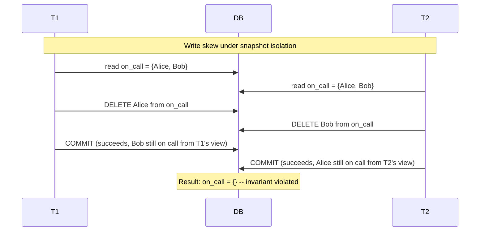
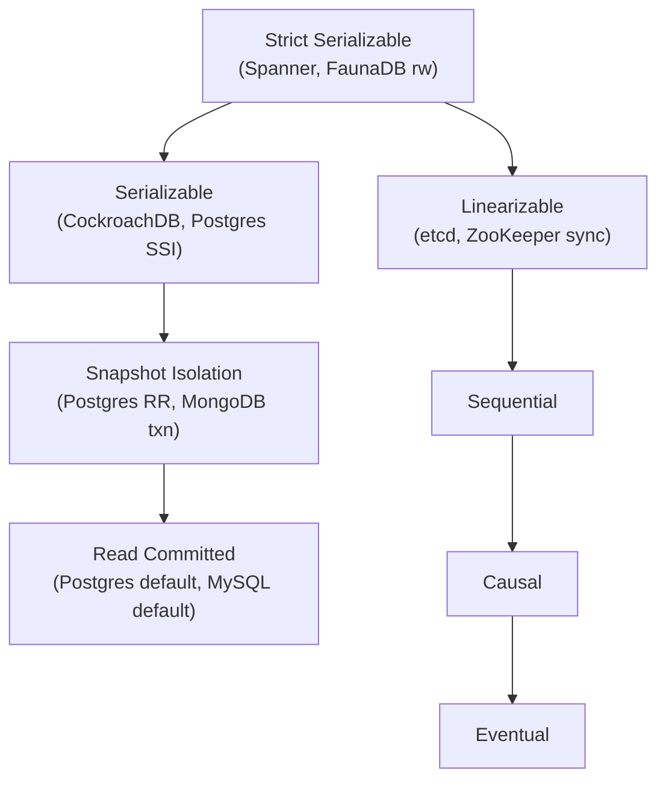
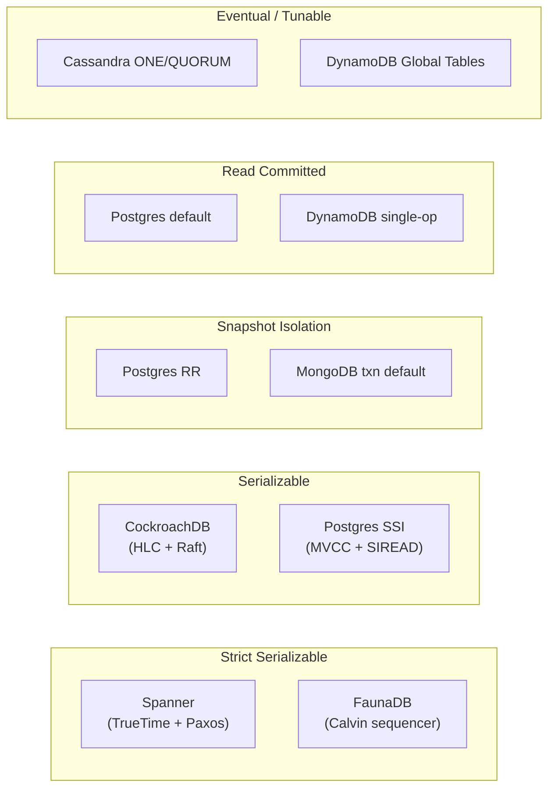
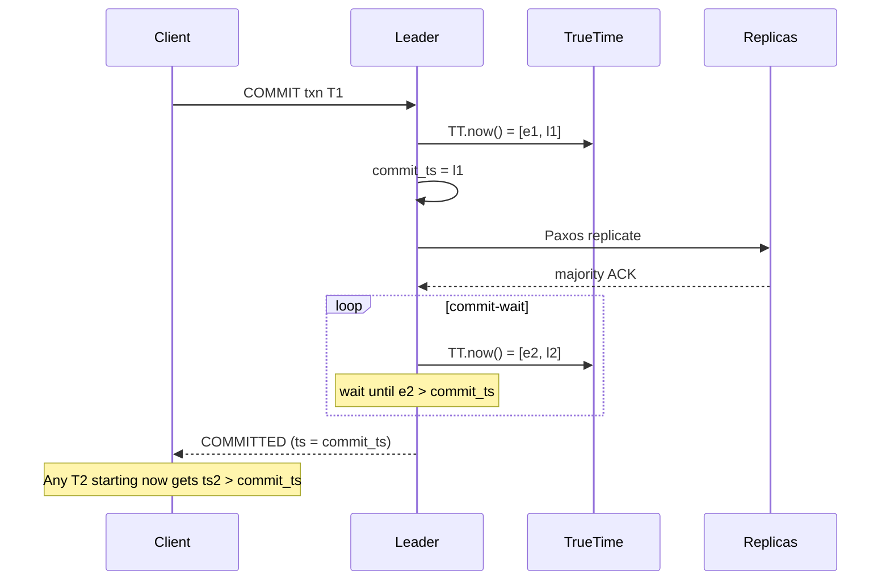

# Consistency Deep Dive: Linearizability, Serializability, and the Spectrum Between

> **TL;DR**: "Strong consistency" is a marketing phrase. Replace it with the precise guarantee: linearizable (single-object, real-time ordered), serializable (multi-object transactions equivalent to some serial order), or strict serializable (both at once, what Spanner calls "external consistency")[^1][^2]. Most OLTP workloads do fine on snapshot isolation, but it lets through write skew[^3]. Tune consistency per operation, not per database. Modern systems (Spanner stale reads, CockroachDB `AS OF SYSTEM TIME`, DynamoDB per-request read modes) let you pay only for the guarantee each query actually needs.

## Learning Objectives

After this module, you will be able to:

- [ ] Distinguish serializability from linearizability and explain why the combination has a name
- [ ] Identify write skew, lost updates, and phantoms across transaction isolation levels
- [ ] Pick an isolation level per operation, not per database
- [ ] Reason about how Spanner, CockroachDB, Postgres SSI, DynamoDB, and Cassandra actually implement their stated guarantees
- [ ] Translate "we need strong consistency" into the precise guarantee the workload requires

## Intuition

Imagine two accountants reconciling a company's books. One works from yesterday's printed ledger (bounded staleness). She can answer "what was our revenue last quarter?" perfectly well from stale data. The other sits at the live register, processing payments in real time. She must see every transaction the instant it commits, because she is deciding whether to approve the next wire transfer.

Both accountants work for the same company. Both are "consistent." But they need fundamentally different guarantees. The ledger accountant tolerates staleness because her decisions do not depend on the latest write. The register accountant cannot, because a stale read could approve a transfer that overdraws the account.

This is the core insight: consistency is not a single dial you turn up or down. It is a two-dimensional grid. One axis is the isolation level (what concurrent transactions see of each other). The other axis is the consistency model (how quickly a committed write becomes visible to readers across replicas). "Strict serializable" sits at the top of both axes. Everything else is a named trade-off below it.

[Consistency Models](../part-1-core-fundamentals/03-consistency-models.md) gave you the single-object hierarchy (linearizable, sequential, causal, eventual) and the four session guarantees. This chapter adds the transactional layer: what happens when the unit of interest is a multi-object transaction, how real databases implement the guarantees they claim, and why those claims often do not match reality.

## Theory

### Recap and scope

[Consistency Models](../part-1-core-fundamentals/03-consistency-models.md) covered single-object consistency models and session guarantees. This chapter is about what happens when the unit of interest is a **transaction** (multi-object) instead of a single register, and how real databases implement the guarantees they claim. We will not re-derive linearizability; we build on top of it.

### Isolation levels and anomalies

The SQL-92 standard defines four isolation levels (read uncommitted, read committed, repeatable read, serializable) in terms of three anomalies (dirty read, non-repeatable read, phantom). But the English-language definitions are ambiguous and miss several important anomalies[^3].

Berenson et al. (1995) showed the ANSI phenomena definitions admit strict and broad interpretations, that neither captures real implementation behavior, and introduced snapshot isolation as a formal level[^3]. Adya's 1999 thesis generalized these with dependency graphs, producing phenomena G0 (dirty write), G1a-c (aborted/intermediate/cyclic reads), G-single (read skew), and G2 (anti-dependency cycles)[^4][^5].

The anomalies that matter most in practice:

- **Write skew**: two transactions each read overlapping state, write disjoint keys, both commit, and the combined result violates an invariant neither individually broke. Two on-call doctors each read "someone else is on call," each remove themselves, nobody is on call.
- **Read skew (G-single)**: a transaction reads two related values at different points in time, seeing an inconsistent snapshot.
- **Phantom**: a transaction re-executes a predicate query and gets different rows because another transaction inserted or deleted matching rows.

The critical vendor-mapping problem: Postgres "REPEATABLE READ" is actually snapshot isolation, not ANSI repeatable read[^6]. MySQL InnoDB RR uses next-key locking to prevent phantoms from index scans but still allows write skew. Jepsen measured approximately 140 G2-item anti-dependency cycles per minute in a contended Postgres RR workload[^7].

*Write skew occurs when two transactions read overlapping state and write disjoint keys; snapshot isolation cannot detect the conflict because the write sets do not intersect.*

**Serializable Snapshot Isolation (SSI)** fixes this. Cahill, Rohm, and Fekete (2008) showed that dangerous structures (a triple of transactions with two adjacent read-write anti-dependencies) are necessary for non-serializable outcomes[^8]. Postgres implements SSI as the SERIALIZABLE level since 9.1, tracking SIREAD locks and aborting transactions that would close a dangerous structure[^9]. SSI preserves snapshot isolation's non-blocking reads while providing true serializability.

> [!WARNING]
> **Postgres SERIALIZABLE had a 9-year bug.** Jepsen (2020) found that Postgres SERIALIZABLE allowed G2-item under concurrent INSERT+UPDATE workloads in every version from 9.1 through 13. The bug was present since SSI was introduced and was patched in August 2020[^7]. Lesson: test your isolation guarantees; do not trust documentation alone.

### Linearizable vs serializable vs strict serializable

These three terms are the most commonly confused in distributed systems. They describe different things:

**Linearizability** (Herlihy and Wing, 1990): a single-object correctness condition. Every operation appears to take effect atomically at some point between its invocation and response; the resulting total order is consistent with real time[^10]. Cost: one consensus round per write on the object.

**Serializability**: a multi-object transaction correctness condition. Some serial order of committed transactions produces the observed reads and final state. It says nothing about real time[^1]. A database can be serializable and still reorder non-overlapping transactions freely.

**Strict serializability** = serializable + linearizable. Every committed transaction has an apparent commit point between invocation and response, and the serial order agrees with that real-time order[^1][^2]. Spanner calls this "external consistency"[^11]. Jepsen's consistency map places strict serializable at the top of both the transaction and single-object families[^1].

*Strict serializable is the strongest model, unifying the transaction family (left branch) and single-object family (right branch); every arrow means "implies."*

The key insight: linearizability and serializability are orthogonal. You can have one without the other. CockroachDB deliberately implements serializable but not linearizable across keys (single-key operations are linearizable, but disjoint-key transactions can exhibit a "causal reverse" anomaly where T2, which begins after T1 commits, appears to commit first)[^12][^13]. This is the price of avoiding Spanner-grade clock costs on commodity hardware.

### Bounded staleness and read-time APIs

Bounded staleness means "at most X seconds or N versions behind the latest committed write." It is strictly stronger than eventual (bounds the gap) and strictly weaker than linearizable (allows a gap)[^14].

Three production implementations:

- **Spanner stale reads**: accept a max-staleness or exact timestamp; served from any replica caught up to that timestamp, avoiding the leader round trip[^11].
- **CockroachDB `AS OF SYSTEM TIME`**: `follower_read_timestamp()` targets a historical read at least 4.2 seconds in the past (per current v26.2 docs) so the read can be served locally from a follower replica without blocking on conflicting writes[^15].
- **Cosmos DB Bounded Staleness**: configured by K writes or T seconds (minimum 100,000 writes / 300 seconds for multi-region); writes throttle if a region lags past the bound[^14].

When bounded staleness is safe: analytics, dashboards, leaderboards, audit-style "as of last close" queries, personalized recommendations.

When bounded staleness is dangerous: inventory checks ("is the last item in stock?"), account balances, uniqueness constraints, rate limiting, and any read-modify-write pattern. The writer cannot tell from the read API whether the value is current.

### How real systems implement each

*Where each named database sits on the isolation-by-consistency grid; the subgraph names the guarantee the default or strongest mode provides.*

**Spanner**: Paxos groups of approximately 5 replicas per tablet. Each transaction gets a commit timestamp within a TrueTime interval; the coordinator waits until `TT.now().earliest > commit_ts` before releasing locks[^11][^16]. The 2012 Spanner paper reported TrueTime epsilon "usually less than 7 ms"; as of 2023, Google reports TrueTime provides Spanner servers with less than 1 ms clock uncertainty at p99[^16][^2]. Read-only transactions pick a safe timestamp and can be served by any up-to-date replica without leader coordination.

**CockroachDB**: Range-based sharding with Raft groups. Transactions use a Hybrid Logical Clock (HLC). Each reader has an uncertainty interval of width `max-offset` (default 500 ms)[^17]. An observed write with a timestamp in that window forces a transaction restart. Parallel Commits (19.2, 2019) collapsed commit latency from two consensus rounds to one[^18]. Nodes self-shut-down if observed clock offset exceeds 80% of max-offset[^17].

**PostgreSQL**: MVCC on a single primary. SERIALIZABLE adds SIREAD locks and aborts transactions involved in a dangerous structure[^8][^9]. Replication is asynchronous; read replicas are not serializable. Default isolation is READ COMMITTED[^6].

**DynamoDB**: Two read modes per request: eventually consistent (0.5 RCU per 4 KB) or strongly consistent (1 RCU, single-region only). `TransactWriteItems` and `TransactGetItems` are serializable but limited to 100 items and 4 MB[^19]. Global Tables replicate asynchronously with last-writer-wins; they do not preserve transaction atomicity across regions[^20].

**Cassandra**: Tunable consistency per query (ONE, QUORUM, LOCAL_QUORUM, ALL). Lightweight Transactions (LWT) implement linearizable compare-and-set via a four-round-trip Paxos protocol[^21]. CEP-14 (Cassandra 4.1) reduces uncontended LWTs to two round trips for writes.

## Real-World Example

**Google Spanner: external consistency via TrueTime.**

Spanner is the production system that most cleanly demonstrates strict serializability at global scale. The engineering insight is deceptively simple: expose clock uncertainty as an interval, not a point, and wait it out.

Every Spanner datacenter has GPS receivers and atomic clocks. The TrueTime API returns `[earliest, latest]` with the true time guaranteed to be inside. The 2012 Spanner paper reported epsilon (the interval width) "usually less than 7 ms"; as of 2023, Google reports TrueTime achieves sub-1 ms clock uncertainty at p99[^16][^2].

When a read-write transaction commits:

1. The coordinator assigns `commit_ts = latest` from the current TrueTime interval.
2. It replicates the write via Paxos to a majority of replicas.
3. It enters **commit-wait**: polling TrueTime until `TT.now().earliest > commit_ts`.
4. Only then does it acknowledge the commit to the client.

*Spanner assigns a commit timestamp within TrueTime's uncertainty interval and waits out the interval before acknowledging, ensuring any subsequent transaction observes the commit.*

This commit-wait is proportional to epsilon: with sub-millisecond p99 uncertainty today, the wait is usually masked by the Paxos quorum round trip itself[^2][^16]. The result is that if T1 commits before T2 starts (in real time), T1's timestamp is strictly less than T2's. This is external consistency: the serial order of transactions matches the real-time order observable by any external observer.

Read-only transactions are cheaper. They pick a safe timestamp and can be served by any replica that has applied all writes up to that timestamp, without acquiring locks or contacting the leader[^11].

The trade-off is explicit: Spanner requires GPS and atomic clocks in every datacenter. CockroachDB's alternative (HLC with a 500 ms max-offset budget, serializable without cross-key linearizability) runs on commodity NTP-synchronized hardware but accepts the causal-reverse anomaly[^13][^12]. Jepsen's 2017 analysis of CockroachDB beta confirmed two serializability violations (both fixed) and documented the causal-reverse as by-design[^12].

## Trade-offs

| Approach | Pros | Cons | Best When | Our Pick |
|---|---|---|---|---|
| Strict serializable (Spanner) | Simplest mental model; matches single-machine DB | High latency (commit-wait); needs GPS/atomic clocks | Financial core, uniqueness, leader election | When correctness is non-negotiable AND you can afford Spanner-class infra |
| Serializable distributed (CockroachDB) | Scale-out serializable; single-key linearizable | Causal reverse across disjoint keys; 500 ms clock skew floor | Multi-region OLTP where single-key linearizability suffices | Default for distributed OLTP on commodity hardware |
| Serializable single-node (Postgres SSI) | Correct transactions; reads never block writes | Vertical scaling only; replicas are not serializable | Core OLTP on a single Postgres primary | When your data fits one node |
| Snapshot isolation | Fast, no read locks, well-understood | Write skew allowed; app must guard invariants | Read-heavy OLTP with disciplined schema design | Most OLTP workloads that do not touch cross-row invariants |
| Bounded staleness | Massive read scale-out, predictable lag | Read-modify-write is unsafe; reporting only | Analytics, dashboards, audit "as of" queries | When you need a recency SLA without paying for linearizability |
| Eventual / tunable | Highest availability, lowest latency | LWW loses writes; lots of app-level correction | Caches, counters, analytics sinks, Dynamo-style KV | When staleness is truly acceptable and conflicts are rare |

## Common Pitfalls

> [!WARNING]
> **Assuming "REPEATABLE READ" means ANSI repeatable read.** Postgres RR is snapshot isolation, which allows write skew. MySQL InnoDB RR uses next-key locking to prevent phantoms but still allows write skew in some interleavings. Jepsen measured approximately 140 G2-item cycles per minute under Postgres RR[^7]. Use SERIALIZABLE or explicit `SELECT FOR UPDATE` for invariant-critical transactions.

> [!WARNING]
> **Relying on LWW across regions.** DynamoDB Global Tables replicate asynchronously with last-writer-wins per item[^20]. With clock skew, a causally-later write can have a lower timestamp and be silently discarded. For data where every write matters (financial, medical), LWW is insufficient.

> [!WARNING]
> **Using snapshot isolation for financial invariants without a write-skew guard.** Two concurrent transfers from the same account can each read "balance = $100," each debit $80, both commit, and the account goes to -$60. Snapshot isolation does not detect this because the write sets are disjoint (different transaction rows). Use SERIALIZABLE or add an explicit row-level lock on the balance row.

> [!WARNING]
> **Treating read-committed as safe for concurrent counter increments.** Under read committed, two transactions can each read counter=5, each write counter=6, and one increment is lost. This is the classic lost-update anomaly. Use `UPDATE counters SET value = value + 1` (atomic increment) or SERIALIZABLE isolation.

> [!WARNING]
> **Expecting DynamoDB Global Tables to be linearizable.** `TransactWriteItems` is serializable within a single region, but Global Tables replicate asynchronously[^19][^20]. A transaction committed in us-east-1 may be observed partially in eu-west-1 during replication. Treat Global Tables as eventual across regions.

> [!WARNING]
> **Using "strongly consistent" as a requirement without naming it precisely.** "We need strong consistency" could mean linearizable reads, serializable transactions, strict serializable, or just read-your-writes. Each has different cost and implementation. Name the guarantee: linearizable, serializable, strict-serializable, snapshot, causal, or eventual. Then pick the cheapest one that satisfies the actual invariant.

## Exercise

You are designing a bank account service. Money transfers must never double-spend and must be visible to the sender immediately. Monthly statements are OK a few seconds stale. Design the consistency level per operation: what must be linearizable, what can be snapshot isolation, what can be read from a stale replica. Then pick a database (Postgres vs CockroachDB vs Spanner) and justify.

Hint

Think about three distinct operations: (1) the transfer itself (a multi-row transaction touching two accounts), (2) the sender checking their balance after the transfer, and (3) the monthly statement generation. Each has different invariant requirements. Which anomalies would be catastrophic for each?

Solution

**Operation 1: Transfer (debit account A, credit account B).**

This is a multi-object transaction with a cross-row invariant (sum of all accounts must remain constant). Write skew is the threat: two concurrent transfers from the same account could each read the balance, each approve, and overdraw. Requires SERIALIZABLE isolation (not snapshot isolation, which allows write skew on disjoint write sets). If distributed, requires serializable across nodes.

**Operation 2: Sender checks balance after transfer.**

The sender just initiated the transfer and expects to see the new balance. This requires read-your-writes at minimum. If the sender's read hits a stale replica, they see the old balance and panic. Implementation: either route the read to the leader/primary, or carry a session token that ensures the replica has applied the transfer before serving the read.

**Operation 3: Monthly statement generation.**

Statements reflect the state "as of midnight on the last day of the month." A few seconds of staleness is acceptable. Use bounded staleness: `AS OF SYSTEM TIME '2026-04-30 23:59:59'` in CockroachDB, or a Spanner stale read at a fixed timestamp. This avoids leader coordination and can be served from any replica.

**Database choice:**

- **Single-region, moderate scale**: PostgreSQL with SERIALIZABLE for transfers, read-your-writes via leader pinning, stale reads from a hot-standby replica for statements. Simplest operational model.
- **Multi-region, high scale**: CockroachDB. Serializable by default. Single-key linearizable covers the sender's balance check. `AS OF SYSTEM TIME` for statements. Accept the causal-reverse anomaly (irrelevant for banking since transfers touch overlapping keys).
- **Global financial system, correctness above all**: Spanner. External consistency means transfers are strictly ordered in real time across continents. Stale reads for statements. Pay the TrueTime infrastructure cost.

The key lesson: you did not pick one consistency level for the whole database. You picked three levels for three operations, matched to their actual invariant requirements.

## Key Takeaways

- "Strong consistency" is marketing. Name the guarantee: linearizable, serializable, strict-serializable, snapshot, causal, or eventual.
- Linearizability is a single-object property (real-time order). Serializability is a multi-object transaction property (equivalent to some serial order). Both together is strict serializability / external consistency.
- Most OLTP workloads do fine on snapshot isolation. Know which anomalies it lets through: write skew is the big one.
- Postgres "REPEATABLE READ" is snapshot isolation, not ANSI RR. Jepsen found approximately 140 G2-item cycles per minute under contention[^7].
- Tune consistency per operation, not per database. Transfers need serializable; statements can use bounded staleness; balance checks need read-your-writes.
- CockroachDB is serializable but not strict-serializable across keys. Spanner is strict-serializable but requires GPS and atomic clocks. Pick based on your actual invariant requirements.
- Even "passed Jepsen" does not mean "always correct." Postgres SSI had a 9-year latent bug (2011 to 2020)[^7]. Test your isolation guarantees under contention.

## Further Reading

- [A Critique of ANSI SQL Isolation Levels (Berenson et al., 1995)](https://www.microsoft.com/en-us/research/publication/a-critique-of-ansi-sql-isolation-levels/) - defines snapshot isolation and exposes the ambiguity of ANSI phenomena; the foundational paper for understanding why vendor labels lie.
- [Serializable Isolation for Snapshot Databases (Cahill et al., 2008)](https://dl.acm.org/doi/abs/10.1145/1620585.1620587) - the SSI algorithm that Postgres 9.1 shipped; read this to understand how optimistic serializability works without blocking reads.
- [Spanner: Google's Globally-Distributed Database (Corbett et al., OSDI 2012)](https://research.google/pubs/spanner-googles-globally-distributed-database-2/) - external consistency and TrueTime; the canonical reference for strict serializability at global scale.
- [CockroachDB Jepsen 2017 analysis](https://jepsen.io/analyses/cockroachdb-beta-20161013) - documents the causal-reverse anomaly and two early serializability bugs; essential for understanding what "serializable but not linearizable" means in practice.
- [PostgreSQL 12.3 Jepsen analysis](https://jepsen.io/analyses/postgresql-12.3) - proves Postgres RR is SI, finds the 9-year SSI bug, and measures G2-item rates; the most important Jepsen report for Postgres users.
- [Jepsen Consistency Models reference](https://jepsen.io/consistency/models) - Kyle Kingsbury's interactive map of every consistency model with implication arrows; the clearest single-page reference online.
- [Parallel Commits (Cockroach Labs, 2019)](https://www.cockroachlabs.com/blog/parallel-commits/) - how CockroachDB collapsed distributed commit from two consensus rounds to one; read for the TLA+ specification of implicit commit.
- DDIA Chapters 7 (Transactions) and 9 (Consistency and Consensus) by Martin Kleppmann - the canonical teaching reference for this material; read alongside this chapter for deeper formalism.

## Flashcards

**Q:** What is the difference between linearizability and serializability?
**A:** Linearizability is a single-object property requiring operations to appear in real-time order. Serializability is a multi-object transaction property requiring the result to be equivalent to some serial execution order. They are orthogonal: you can have one without the other.

**Q:** What is strict serializability, and what does Spanner call it?
**A:** Strict serializability = serializable + linearizable. Every transaction appears to commit atomically at a real-time point between invocation and response. Spanner calls it "external consistency."

**Q:** Why does Postgres "REPEATABLE READ" not match ANSI repeatable read?
**A:** Postgres RR is actually snapshot isolation. It prevents phantoms (stronger than ANSI RR in that regard) but allows write skew (which ANSI RR's formalism does not clearly address). Jepsen measured approximately 140 G2-item cycles per minute under contention.

**Q:** What is write skew, and which isolation level prevents it?
**A:** Two transactions each read overlapping state, write disjoint keys, both commit, and the combined result violates an invariant. Only Serializable (SSI or 2PL) prevents it. Snapshot isolation does not, because the write sets do not intersect.

**Q:** How does Spanner achieve external consistency?
**A:** TrueTime (GPS + atomic clocks) bounds clock uncertainty (the 2012 paper reported under 7 ms; Google reports sub-1 ms at p99 as of 2023). The coordinator assigns a commit timestamp and waits until TrueTime confirms the timestamp is in the past before acknowledging. This "commit-wait" ensures globally ordered timestamps.

**Q:** Why does CockroachDB accept the "causal reverse" anomaly?
**A:** CockroachDB uses HLC on commodity NTP hardware with a 500 ms max-offset budget. Avoiding the causal-reverse would require Spanner-style commit-wait with sub-millisecond clocks. The trade-off: serializable without cross-key linearizability, running on standard hardware.

**Q:** What is the cost of a DynamoDB strongly consistent read vs eventually consistent?
**A:** Strong reads cost 1 RCU per 4 KB and must go to the partition leader (single-region only). Eventually consistent reads cost 0.5 RCU per 4 KB and can hit any replica.

**Q:** When is bounded staleness safe, and when is it dangerous?
**A:** Safe for analytics, dashboards, audit queries, and reporting. Dangerous for read-modify-write patterns (inventory, balances, uniqueness) because the reader cannot tell whether the value is current.

**Q:** What did Jepsen find about Postgres SERIALIZABLE in 2020?
**A:** A bug present since SSI was introduced in 9.1 (2011) allowed G2-item anomalies under concurrent INSERT+UPDATE workloads. It was patched in August 2020, nine years after introduction.

**Q:** How many round trips does a Cassandra Lightweight Transaction require?
**A:** Four round trips (Paxos-based compare-and-set) before CEP-14. After CEP-14 (Cassandra 4.1), uncontended LWTs take two round trips for writes and one for reads.

**Q:** What happens when a CockroachDB node's clock drifts too far?
**A:** If observed clock offset exceeds 80% of max-offset (400 ms by default) with respect to a majority of peers, the node self-shuts-down to prevent serving stale reads.

**Q:** Name three approaches to implementing multi-object serializability.
**A:** (1) Two-phase locking (pessimistic, blocks readers on writers). (2) Serializable Snapshot Isolation / SSI (optimistic, aborts on dangerous structures). (3) Deterministic sequencing (Calvin/FaunaDB: order transactions first, execute deterministically).

**Q:** Why is "we need strong consistency" a bad requirement?
**A:** It is ambiguous. It could mean linearizable reads, serializable transactions, strict serializable, or just read-your-writes. Each has different cost (from session tokens to GPS clocks). Name the precise guarantee the workload requires.

**Q:** What is DynamoDB's isolation level for BatchWriteItem?
**A:** Read-committed as a unit. Individual sub-operations are serializable with respect to transactional operations, but the batch itself is NOT atomic. "I wrapped my writes in a batch, so they're atomic" is wrong; batches are not transactions.

**Q:** What is the typical TrueTime epsilon in Spanner production datacenters?
**A:** The 2012 Spanner paper reported "usually less than 7 ms." As of 2023, Google reports TrueTime delivers less than 1 ms clock uncertainty at the 99th percentile. This bounds the commit-wait duration and thus the minimum write latency for external consistency.

## References

[^1]: Jepsen. "Consistency Models." https://jepsen.io/consistency/models
[^2]: Google Cloud. "Strict Serializability and External Consistency in Spanner." https://cloud.google.com/blog/products/databases/strict-serializability-and-external-consistency-in-spanner
[^3]: Berenson, Bernstein, Gray, Melton, O'Neil, O'Neil. "A Critique of ANSI SQL Isolation Levels." SIGMOD 1995. https://www.microsoft.com/en-us/research/publication/a-critique-of-ansi-sql-isolation-levels/
[^4]: Adya, Liskov, O'Neil. "Generalized Isolation Level Definitions." ICDE 2000. http://pmg.csail.mit.edu/pubs/adya00generalized-abstract.html
[^5]: Adya. "Weak Consistency: A Generalized Theory and Optimistic Implementations for Distributed Transactions." PhD thesis, MIT, 1999. https://web.archive.org/web/2024/https://pmg.csail.mit.edu/papers/adya-phd.pdf
[^6]: PostgreSQL. "Transaction Isolation." https://www.postgresql.org/docs/current/transaction-iso.html
[^7]: Kingsbury. "PostgreSQL 12.3." Jepsen, 2020-06-12. https://jepsen.io/analyses/postgresql-12.3
[^8]: Cahill, Rohm, Fekete. "Serializable Isolation for Snapshot Databases." SIGMOD 2008 / TODS 2009. https://dl.acm.org/doi/abs/10.1145/1620585.1620587
[^9]: Ports and Grittner. "Serializable Snapshot Isolation in PostgreSQL." VLDB 2012 / arXiv:1208.4179. https://arxiv.org/abs/1208.4179
[^10]: Herlihy and Wing. "Linearizability: A Correctness Condition for Concurrent Objects." ACM TOPLAS 1990. https://cs.brown.edu/~mph/HerlihyW90/p463-herlihy.pdf
[^11]: Google Cloud Spanner. "TrueTime and external consistency." https://cloud.google.com/spanner/docs/true-time-external-consistency
[^12]: Kingsbury. "CockroachDB beta-20160829." Jepsen, 2017-02-16. https://jepsen.io/analyses/cockroachdb-beta-20161013
[^13]: Cockroach Labs. "Living Without Atomic Clocks." https://www.cockroachlabs.com/blog/living-without-atomic-clocks/
[^14]: Microsoft Azure. "Consistency levels in Azure Cosmos DB." https://learn.microsoft.com/en-us/azure/cosmos-db/consistency-levels
[^15]: Cockroach Labs. "Follower Reads (v26.2)." https://www.cockroachlabs.com/docs/stable/follower-reads
[^16]: Corbett et al. "Spanner: Google's Globally-Distributed Database." OSDI 2012. https://www.usenix.org/conference/osdi12/technical-sessions/presentation/corbett
[^17]: Entin. "Clock Management in CockroachDB." Cockroach Labs, 2025-04-22. https://www.cockroachlabs.com/blog/clock-management-cockroachdb
[^18]: VanBenschoten. "Parallel Commits: An atomic commit protocol for globally distributed transactions." Cockroach Labs, 2019-11-07. https://www.cockroachlabs.com/blog/parallel-commits/
[^19]: AWS. "Amazon DynamoDB Transactions: How it works." https://docs.aws.amazon.com/amazondynamodb/latest/developerguide/transaction-apis.html
[^20]: AWS. "How DynamoDB global tables work." https://docs.aws.amazon.com/amazondynamodb/latest/developerguide/V2globaltables_HowItWorks.html
[^21]: Apache Cassandra. "CEP-14: Paxos Improvements." https://cwiki.apache.org/confluence/x/54cjCw
