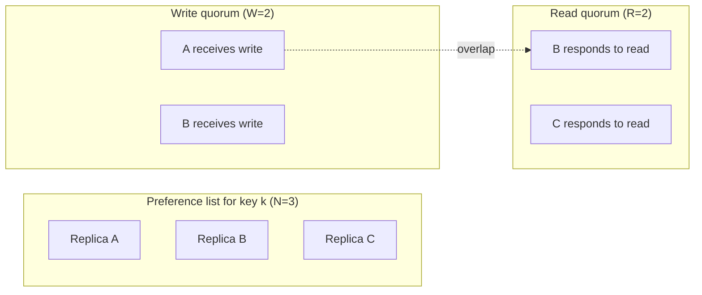
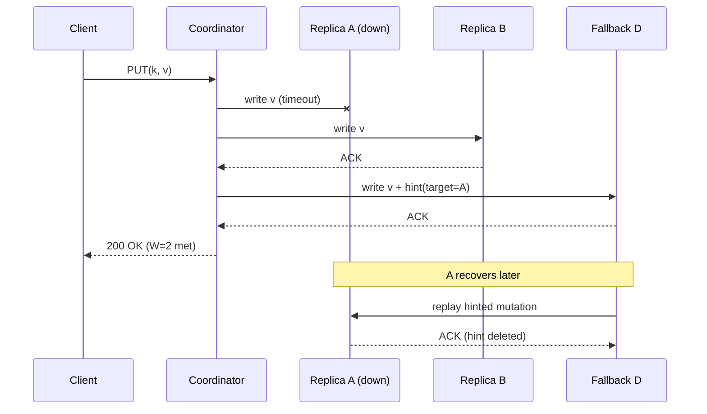
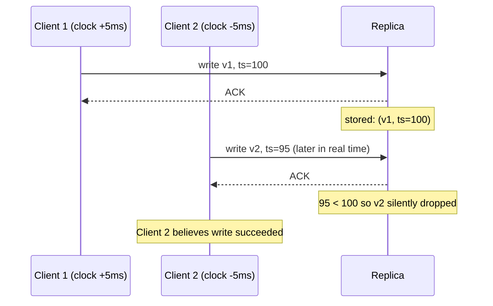
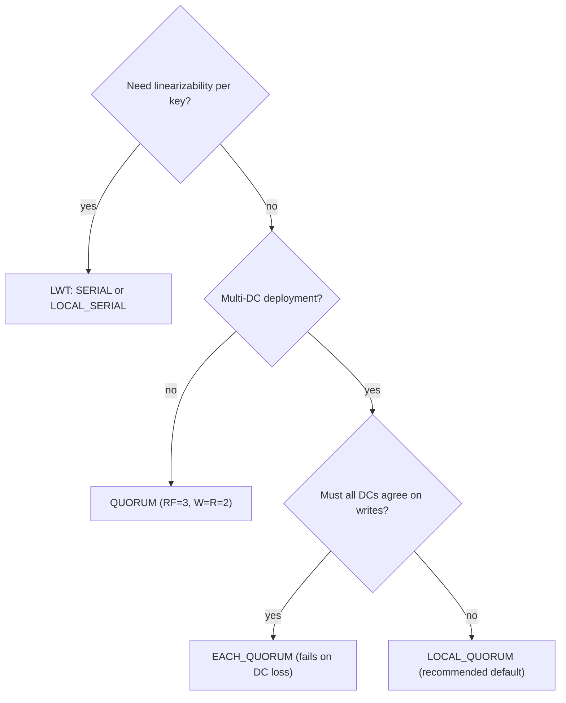

# Quorums and Replication: The Math of R + W > N

> **TL;DR**: In a leaderless system with N replicas, requiring W write-acks and R read-responses where R + W > N guarantees every read overlaps with every recent write on at least one node. This is a **freshness** rule, not a linearizability rule. Dynamo-style systems (Cassandra, Riak, DynamoDB's original design) use this overlap to return the latest value, but concurrent writes with last-write-wins can still silently lose data. Jepsen measured 28% acknowledged-write loss on Cassandra QUORUM under partition[^1]. For true linearizability per key, you need consensus (Paxos, Raft) or the ABD write-back protocol, not just R + W > N.

## Learning Objectives

After this module, you will be able to:

- [ ] Explain the R + W > N quorum rule and what it guarantees (freshness, not linearizability)
- [ ] Pick (N, R, W) configurations based on availability, latency, and consistency needs
- [ ] Describe sloppy quorums, hinted handoff, and their impact on the quorum guarantee
- [ ] Explain why R + W > N is not linearizable and what the ABD register adds
- [ ] Map Cassandra consistency levels (ONE, QUORUM, LOCAL_QUORUM, EACH_QUORUM) to (R, W) values
- [ ] Choose between LOCAL_QUORUM and EACH_QUORUM for multi-DC deployments

## Intuition

Imagine you sign a legal document that requires witnesses. The rule is: at least two of three designated witnesses must sign the document (the "write"), and at least two of three must later confirm they saw it (the "read"). Because you only have three witnesses total, any group of two who confirm will always include at least one person who was present at the signing. That overlap is your proof of freshness.

But here is the catch: if two people sign different versions of the document at the same time, and you resolve the conflict by picking whichever signature has the later timestamp on the clock in the room, you can lose a valid signature if one room's clock is slow. The overlap guarantees you see *something* recent. It does not guarantee you see the *right* thing when concurrent events collide.

This is the core tension of quorum replication. The pigeonhole math (R + W > N) gives you a freshness guarantee. It does not give you linearizability. The rest of this chapter explores what that distinction means in practice, and what to do about it.

## Theory

### The basic quorum rule

Place N copies of every key on N different nodes. A write succeeds once W nodes acknowledge it. A read succeeds once R nodes respond. If R + W > N, then by the pigeonhole principle, any read quorum and any write quorum share at least one node[^2][^3].

That overlapping node holds the most recent acknowledged write. If the client can identify which response is freshest (via a version vector or a timestamp), it returns an up-to-date value.

Werner Vogels stated this explicitly in 2007: "If W + R > N then the write set and the read set always overlap and one can guarantee strong consistency"[^3]. The Dynamo paper uses the same formulation: "Setting R and W such that R + W > N yields a quorum-like system"[^2].

*With N=3 and R=W=2, any read quorum and write quorum share at least one replica (here, B), guaranteeing the read sees the latest acknowledged write.*

The cost of this overlap is twofold. Latency is bounded by the slowest of W (or R) replicas, so tail latency amplifies with quorum size. Dynamo's own 99.9th percentile latencies were approximately 200 ms while the mean was under 10 ms on (3,2,2) (Section 6)[^2]. And availability requires W reachable nodes to write and R to read, so higher quorum sizes reduce fault tolerance.

### Common (N, R, W) configurations

The standard majority-quorum choice is N=3, W=2, R=2. The Dynamo paper reports this as "the common (N,R,W) configuration used by several instances of Dynamo"[^2]. In Cassandra, this maps to consistency level QUORUM with replication factor 3, where `quorum = floor(RF/2) + 1 = 2`[^4].

Other useful configurations:

| Config | Tolerates | Latency profile | Use case |
|--------|-----------|-----------------|----------|
| N=3, W=2, R=2 | 1 replica down for reads or writes | Balanced | General-purpose default |
| N=3, W=3, R=1 | 0 down for writes, 2 down for reads | Fast reads, slow writes | Read-heavy catalog data |
| N=3, W=1, R=3 | 2 down for writes, 0 down for reads | Fast writes, slow reads | Write-heavy telemetry |
| N=5, W=3, R=3 | 2 replicas down | Higher tail latency | Mission-critical with larger clusters |

Cassandra exposes this per-query via consistency levels: ONE, TWO, THREE, QUORUM, ALL, LOCAL_QUORUM, EACH_QUORUM, LOCAL_ONE, ANY, SERIAL, and LOCAL_SERIAL[^4]. The flexibility to choose consistency per request on the same cluster is the key operational advantage of Dynamo-style systems.

### Sloppy quorums and hinted handoff

A "sloppy quorum" accepts the first W *healthy* nodes walking the ring, not necessarily the W nodes from the key's preference list[^2]. This keeps writes available during partitions but breaks the R + W > N guarantee globally.

When preferred replica A is unreachable, the coordinator forwards the write to fallback node D with a "hint" naming A as the intended recipient. When A recovers, D replays the hinted mutation and deletes its local copy[^2][^5].

*When preferred replica A is unreachable, the coordinator routes to fallback D with a hint, preserving availability at the cost of the strict R + W > N guarantee.*

Cassandra's `max_hint_window` defaults to 3 hours[^5]. If a node stays down longer, the coordinator stops generating hints and the node must be reconciled via full repair. A 10-minute restart ingesting 100 Mbps creates roughly 7 GB of hints that takes about 2 hours to replay at the default 1024 KiB/s throttle[^5].

> [!IMPORTANT]
> Sloppy quorums mean R + W > N no longer holds globally. A read to the preferred replicas (which are back up but have not received the hint yet) can return stale data even though the write was acknowledged. This is by design: Dynamo chose "always writeable" over strict consistency[^2].

### Read repair and anti-entropy

Read repair reconciles divergent replicas during the read path. On a read, the Cassandra coordinator issues one full read to the fastest replica and `CL-1` digest reads. If digests disagree, it upgrades to full reads, merges by timestamp, and writes the merged value back to stale replicas before returning[^6].

Cassandra 4.0 made blocking read repair the only option (CASSANDRA-13910 removed the old probabilistic `read_repair_chance`)[^7]. This provides "monotonic quorum reads": successive quorum reads never go backward in time[^6].

Anti-entropy runs as a background process using Merkle trees. Each node maintains a tree per key range; nodes exchange roots, walk downward on mismatches, and transfer only differing leaves[^2]. This handles cold keys that read repair never touches. For a deeper treatment, see [Merkle Trees and Anti-Entropy](./10-merkle-trees-anti-entropy.md).

### Why quorums are not linearizable

This is the most important section in the chapter. R + W > N guarantees freshness. It does not guarantee linearizability. Three mechanisms break linearizability even with strict quorums:

**1. Sloppy quorum + asynchronous handoff.** As shown above, writes to non-preferred nodes create a window where reads to preferred replicas return stale values[^2][^8].

**2. Last-write-wins with clock skew.** Cassandra uses physical timestamps for conflict resolution. Jepsen's 2013 analysis showed "2000 total, 1009 acknowledged, 724 survivors, 285 acknowledged writes lost" on QUORUM with synchronized clocks under partition[^1]. That is a 28% loss rate from LWW conflict resolution during partition recovery, where writes acknowledged on one side of the partition are overwritten by writes from the other side with different timestamps.

*Client 2 writes later in real time but its timestamp is earlier due to clock skew; the later-arriving write is silently discarded by LWW.*

**3. No synchronous write-back.** The ABD register (Attiya, Bar-Noy, Dolev, 1995) adds a second round where the reader writes the freshest value back to a majority before returning[^9]. This guarantees that once a read returns value v, any subsequent read sees v or later. Dynamo's read repair is asynchronous and happens *after* the response returns to the client, so a concurrent reader can still see stale data[^2].

For linearizability per key, you need either ABD's two-round protocol (2 round trips per read)[^9] or consensus (Cassandra's Lightweight Transactions use Paxos with 4 round trips per operation in 3.x, reduced to 2 uncontended in 4.1+ via CEP-14)[^10][^11].

### Multi-DC considerations

In multi-datacenter deployments, Cassandra's QUORUM computes across the sum of all DCs: with RF=3 in two DCs (sum=6), QUORUM requires 4 acks spanning both DCs. This forces cross-DC round trips (typically 30 to 200 ms WAN latency) on every write[^4].

LOCAL_QUORUM computes the majority within the local DC only. With RF=3 per DC, LOCAL_QUORUM requires 2 local acks. Writes complete without waiting for cross-DC replication. This is the standard configuration for multi-DC Cassandra deployments[^4].

EACH_QUORUM requires a majority in *every* DC per write. A down DC fails the write entirely. Use it only when consistency must survive losing one DC without any stale local reads[^4].

*Practical consistency-level picker: start from linearizability needs, then consider multi-DC topology.*

## Real-World Example

### Amazon DynamoDB: from sloppy quorums to Multi-Paxos

Amazon's original Dynamo (SOSP 2007) was the system that defined tunable quorums. It ran the shopping cart service with (N=3, W=2, R=2), achieving single-digit millisecond average latency and 99.9995% request success rate across all Dynamo instances[^2]. Only 0.06% of reads over 24 hours saw divergent versions, driven mostly by automated "busy robots" issuing concurrent writes[^2].

But Dynamo's sloppy quorums and vector-clock reconciliation proved operationally complex. When Amazon built DynamoDB (launched 2012, described in USENIX ATC 2022), they made a radical architectural choice: replace sloppy quorums entirely with Multi-Paxos per partition[^12]. Each partition is a Paxos replication group with replicas placed across Availability Zones. Writes go through the Paxos leader; strongly consistent reads hit the leader or verify via quorum[^12].

The result: DynamoDB served 151 million requests per second at peak during Prime Day 2025, while delivering single-digit millisecond responses[^13]. The system offers two read modes: "eventually consistent" (any replica, cheaper) and "strongly consistent" (leader or quorum-verified, linearizable per key)[^12].

The evolution from Dynamo to DynamoDB illustrates the chapter's thesis: R + W > N is a useful freshness primitive, but production systems that need strong consistency eventually graduate to consensus. DynamoDB kept the key-value API and autoscaling goals but dropped sloppy quorums in favor of Paxos because the operational cost of vector-clock reconciliation and silent staleness was too high at Amazon's scale[^12][^14].

## Trade-offs

| Approach | Pros | Cons | Best when | Our Pick |
|----------|------|------|-----------|----------|
| R=W=N/2+1 (majority) | Balanced, tolerates minority down, monotonic reads with blocking repair | Latency bound by slowest quorum member; still LWW-vulnerable | General-purpose tunable consistency | **Default for most Cassandra workloads** |
| W=N, R=1 | Fast reads (single replica) | Any replica down blocks writes; still not linearizable under LWW | Read-heavy, write-infrequent catalog data | Read-heavy static catalogs where every node already has the data |
| W=1, R=N | Fast writes (single ack) | Any replica down blocks reads; W=1 creates durability window | Write-heavy telemetry you can afford to lose | Telemetry pipelines where occasional lost writes are acceptable |
| Sloppy quorum + hinted handoff | Stays available during transient partitions | R + W > N no longer holds; hints expire (3h default); silent staleness | Dynamo-style AP systems where availability beats consistency | When you accept eventual consistency |
| ABD register / consensus per key | True linearizability per key | Extra round trip (ABD) or 4 round trips (Paxos); lower throughput | Locks, unique constraints, compare-and-set | When correctness is non-negotiable |

## Common Pitfalls

> [!WARNING]
> **Expecting R + W > N to give linearizability.** The pigeonhole overlap guarantees freshness, not real-time ordering. With LWW and clock skew, a later physical-time write with an earlier timestamp silently overwrites a causally-later write. Use vector clocks, CRDTs, or Cassandra LWT for strict correctness[^1].

> [!WARNING]
> **LWW under clock skew silently losing data.** Cassandra's millisecond-resolution timestamps make collisions common under concurrent load. Jepsen measured 28% acknowledged-write loss on QUORUM under partition[^1]. Never modify a cell repeatedly under LWW without monotonic timestamps from an external coordinator.

> [!WARNING]
> **EACH_QUORUM killing writes during DC failure.** EACH_QUORUM requires a majority in every DC. A single unreachable DC fails all writes cluster-wide, even though plenty of replicas are alive elsewhere. Use LOCAL_QUORUM for the hot path; reserve EACH_QUORUM for workloads that absolutely cannot read stale cross-DC data[^4].

> [!WARNING]
> **R=1 with async read repair giving stale reads.** Consistency level ONE returns the first replica's response without waiting for digest comparison. If that replica is stale, you get stale data. Read repair happens in the background and does not help the current request. Use QUORUM or LOCAL_QUORUM for read-your-writes semantics.

> [!WARNING]
> **Hints overflowing disk quota.** A node down for longer than `max_hint_window` (default 3 hours) stops accumulating hints. When it returns, it is permanently divergent until a full `nodetool repair` runs. Monitor node downtime against the hint window; schedule repair after any extended outage[^5].

> [!WARNING]
> **Ignoring tail latency from the slowest W ack.** Your write latency is the W-th fastest replica, not the average. With W=2 and N=3, one slow replica does not matter. With W=3 (ALL), one slow replica dominates your p99. Dynamo's 99.9th percentile was 200 ms while the mean was under 10 ms[^2]. Always measure tail latency, not averages.

## Exercise

You run Cassandra with RF=3 across three AWS Availability Zones for a user-settings service. The workload is 90% reads, 10% writes. Users must see their own settings changes within one page refresh. Choose consistency level(s) for reads and writes, justify R + W > N, and describe what happens when one AZ goes down.

Hint

Think about what "read-your-writes" requires in terms of quorum overlap. With RF=3 and three AZs, each AZ holds one replica. What consistency level gives you W + R > 3 while tolerating one AZ failure?

Solution

**Choice:** LOCAL_QUORUM for both reads and writes.

With RF=3 across 3 AZs (one replica per AZ within a single region), LOCAL_QUORUM requires `floor(3/2) + 1 = 2` acks. So W=2, R=2, and R + W = 4 > 3. The overlap guarantees every read sees the latest acknowledged write.

**Read-your-writes:** Because the user's client hits the same region, and LOCAL_QUORUM requires 2 of 3 replicas, the read quorum always overlaps with the write quorum. The user sees their own write on the next read.

**AZ failure:** With one AZ down, you have 2 of 3 replicas available. LOCAL_QUORUM needs 2, so both reads and writes continue without interruption. If you had chosen ALL (W=3), a single AZ failure would block all writes.

**Why not QUORUM?** In a single-region deployment with 3 AZs, QUORUM and LOCAL_QUORUM compute the same value (both need 2 of 3). The distinction matters in multi-region: QUORUM would span regions, adding cross-region latency. LOCAL_QUORUM stays within the local region.

**Why not ONE?** ONE gives W=1, R=1. R + W = 2, which is not > 3. No freshness guarantee. The user might read from the one replica that did not receive the write yet.

**Trade-off accepted:** LOCAL_QUORUM with LWW means concurrent writes to the same setting from different sessions can still lose one write under clock skew. For user settings (low contention, single-user writes), this risk is negligible. For a counter or balance, you would need LWT.

## Key Takeaways

- R + W > N is a freshness rule, not a linearizability rule. Concurrent writes can still diverge and data can silently lose under LWW.
- The standard (N=3, W=2, R=2) configuration tolerates one replica failure for both reads and writes. It is the right default.
- Sloppy quorums sacrifice the R + W > N guarantee for availability during partitions. Understand what you are giving up before enabling them.
- Cassandra's LOCAL_QUORUM is the correct default for multi-DC deployments. QUORUM across DCs forces cross-DC latency (30 to 200 ms) on every operation.
- LWW is almost always wrong for mutable data under concurrent access. Use vector clocks, CRDTs, or application-level reconciliation instead.
- For true linearizability per key, you need consensus (Paxos, Raft) or the ABD write-back protocol. R + W > N alone is insufficient.
- DynamoDB's evolution from sloppy quorums to Multi-Paxos per partition demonstrates that production systems needing strong consistency graduate beyond quorums.

## Further Reading

- [Dynamo: Amazon's Highly Available Key-value Store (DeCandia et al., SOSP 2007)](https://www.allthingsdistributed.com/files/amazon-dynamo-sosp2007.pdf) - The foundational paper defining (N, R, W) tunable quorums, sloppy quorums, and hinted handoff; Section 4.5 is the quorum math, Section 4.6 is hinted handoff.
- [Eventually Consistent (Werner Vogels, 2007)](https://www.allthingsdistributed.com/2007/12/eventually_consistent.html) - The essay that coined "R + W > N guarantees strong consistency" and defined the client-side consistency taxonomy (read-your-writes, monotonic reads, session consistency).
- [Jepsen: Cassandra (Kyle Kingsbury, 2013)](https://aphyr.com/posts/294-call-me-maybe-cassandra) - The canonical demonstration that QUORUM writes with LWW under partition lose 28% of acknowledged writes; essential reading before trusting any quorum system.
- [Sharing Memory Robustly in Message-Passing Systems (Attiya, Bar-Noy, Dolev, 1995)](https://dl.acm.org/doi/10.1145/200836.200869) - The ABD register proving quorums can be linearizable with a write-back phase; Dijkstra Prize 2011.
- [Amazon DynamoDB: A Scalable, Predictably Performant, and Fully Managed NoSQL Database Service (USENIX ATC 2022)](https://www.usenix.org/conference/atc22/presentation/elhemali) - How DynamoDB replaced sloppy quorums with Multi-Paxos per partition; the "Dynamo without Dynamo" paper.
- [Cassandra Consistency Levels (DataStax docs)](https://docs.datastax.com/en/cassandra-oss/3.0/cassandra/dml/dmlConfigConsistency.html) - Full reference for ONE/QUORUM/LOCAL_QUORUM/EACH_QUORUM/ALL/SERIAL with the quorum formula.
- [Apache Cassandra Hints Documentation](https://cassandra.apache.org/doc/4.1/cassandra/operating/hints.html) - Hinted handoff mechanics, `max_hint_window`, throttle settings, and operational guidance.
- [CEP-14: Paxos Improvements (Apache Cassandra, 2022)](https://cwiki.apache.org/confluence/x/54cjCw) - Acknowledges LWT's linearizability gap across range movements; scope of the Paxos v2 rewrite released in Cassandra 4.1.

## Flashcards

**Q:** What does R + W > N guarantee?
**A:** That every read quorum overlaps with every write quorum on at least one node, so the read can return the freshest acknowledged value. It guarantees freshness, not linearizability.

**Q:** What is the standard (N, R, W) configuration for Dynamo-style systems?
**A:** (3, 2, 2). Tolerates one replica failure for both reads and writes. Used by Dynamo's shopping cart and Cassandra's QUORUM with RF=3.

**Q:** Why does R + W > N not give linearizability?
**A:** Three reasons: sloppy quorums route writes to non-preferred nodes (breaking the overlap), LWW with clock skew silently drops concurrent writes, and without a synchronous write-back phase (ABD), concurrent readers can see values in non-real-time order.

**Q:** What is a sloppy quorum?
**A:** A quorum that accepts acks from any W healthy nodes, not necessarily the key's preferred replicas. It preserves availability during partitions but breaks the R + W > N freshness guarantee because reads to preferred replicas may not see the sloppy write.

**Q:** What is hinted handoff and what is its default window in Cassandra?
**A:** When a preferred replica is down, the coordinator stores the write locally with a "hint" naming the target. When the target recovers, the hint is replayed. Cassandra's default `max_hint_window` is 3 hours; beyond that, hints stop accumulating and full repair is needed.

**Q:** What did Jepsen find about Cassandra QUORUM writes under partition?
**A:** 28% acknowledged-write loss (285 of 1,009 acknowledged writes lost) due to LWW with clock skew, even with synchronized clocks and an external lock.

**Q:** What is the ABD register and why does it matter?
**A:** The Attiya-Bar-Noy-Dolev (1995) protocol adds a write-back phase to quorum reads: after finding the freshest value, the reader writes it back to a majority before returning. This makes quorum reads linearizable. Dynamo-style systems skip this synchronous write-back.

**Q:** When should you use LOCAL_QUORUM vs EACH_QUORUM?
**A:** LOCAL_QUORUM (majority within local DC) is the default for multi-DC because it avoids cross-DC latency. EACH_QUORUM (majority in every DC) is for workloads that must not read stale data from a lagging DC, but it fails writes entirely when any DC is unreachable.

**Q:** How does DynamoDB differ from the original Dynamo?
**A:** DynamoDB replaced sloppy quorums and vector clocks with Multi-Paxos per partition. Writes go through a Paxos leader; strongly consistent reads hit the leader. This eliminates eventual-consistency divergence at the cost of consensus overhead.

**Q:** What is Cassandra's QUORUM formula?
**A:** `quorum = floor(sum_of_replication_factors / 2) + 1`. With RF=3 in one DC, quorum=2. With RF=3 in two DCs (sum=6), QUORUM=4 spanning both DCs.

**Q:** What happens when a Cassandra node is down longer than `max_hint_window`?
**A:** The coordinator stops generating hints. When the node returns, it is permanently divergent on keys written during its absence. Only a full `nodetool repair` (Merkle-tree anti-entropy) reconciles it.

**Q:** What is blocking read repair in Cassandra 4.0+?
**A:** On a read, if digest responses disagree, the coordinator fetches full data from all replicas, merges by timestamp, writes the merged value back to stale replicas, and only then returns to the client. This provides monotonic quorum reads.

**Q:** How many requests per second did DynamoDB handle at peak during Prime Day 2025?
**A:** 151 million requests per second, while delivering single-digit millisecond responses.

**Q:** What is the tail-latency implication of quorum writes?
**A:** Write latency is bounded by the W-th fastest replica, not the average. Dynamo reported 200 ms at p99.9 vs under 10 ms mean on (3,2,2). Higher W amplifies tail latency.

## References

[^1]: Kyle Kingsbury, "Jepsen: Cassandra", aphyr.com, 2013-09-24. https://aphyr.com/posts/294-call-me-maybe-cassandra
[^2]: DeCandia, Hastorun, Jampani, Kakulapati, Lakshman, Pilchin, Sivasubramanian, Vosshall, Vogels, "Dynamo: Amazon's Highly Available Key-value Store", SOSP 2007. https://www.allthingsdistributed.com/2007/10/amazons_dynamo.html
[^3]: Werner Vogels, "Eventually Consistent", All Things Distributed, December 2007. https://www.allthingsdistributed.com/2007/12/eventually_consistent.html
[^4]: DataStax, "How is the consistency level configured?", Cassandra 3.0 docs. https://docs.datastax.com/en/cassandra-oss/3.0/cassandra/dml/dmlConfigConsistency.html
[^5]: Apache Cassandra, "Hints" documentation, Cassandra 4.1. https://cassandra.apache.org/doc/4.1/cassandra/operating/hints.html
[^6]: Apache Cassandra, "Read repair" documentation, Cassandra 5.x. https://cassandra.apache.org/doc/latest/cassandra/managing/operating/read_repair.html
[^7]: CASSANDRA-13910, removal of `read_repair_chance` in Cassandra 4.0. https://issues.apache.org/jira/browse/CASSANDRA-13910
[^8]: Werner Vogels, "Eventually Consistent", Communications of the ACM, 2008/2009. https://cacm.acm.org/practice/eventually-consistent/
[^9]: Hagit Attiya, Amotz Bar-Noy, Danny Dolev, "Sharing Memory Robustly in Message-Passing Systems", JACM 42(1):124-142, 1995. https://dl.acm.org/doi/10.1145/200836.200869
[^10]: DataStax, "How do I accomplish lightweight transactions with linearizable consistency?", Cassandra 3.0 docs. https://docs.datastax.com/en/cassandra-oss/3.0/cassandra/dml/dmlLtwtTransactions.html
[^11]: Apache Cassandra, "CEP-14: Paxos Improvements", Confluence wiki, 2022. https://cwiki.apache.org/confluence/x/54cjCw
[^12]: Elhemali et al., "Amazon DynamoDB: A Scalable, Predictably Performant, and Fully Managed NoSQL Database Service", USENIX ATC 2022. https://www.usenix.org/conference/atc22/presentation/elhemali
[^13]: Channy Yun, "AWS services scale to new heights for Prime Day 2025: key metrics and milestones", AWS News Blog, August 26, 2025. https://aws.amazon.com/blogs/aws/aws-services-scale-to-new-heights-for-prime-day-2025-key-metrics-and-milestones/
[^14]: Lu Pan, "Notes on Amazon's DynamoDB USENIX ATC'22 Paper", 2022-08-14. https://blog.the-pans.com/dynamodb/
