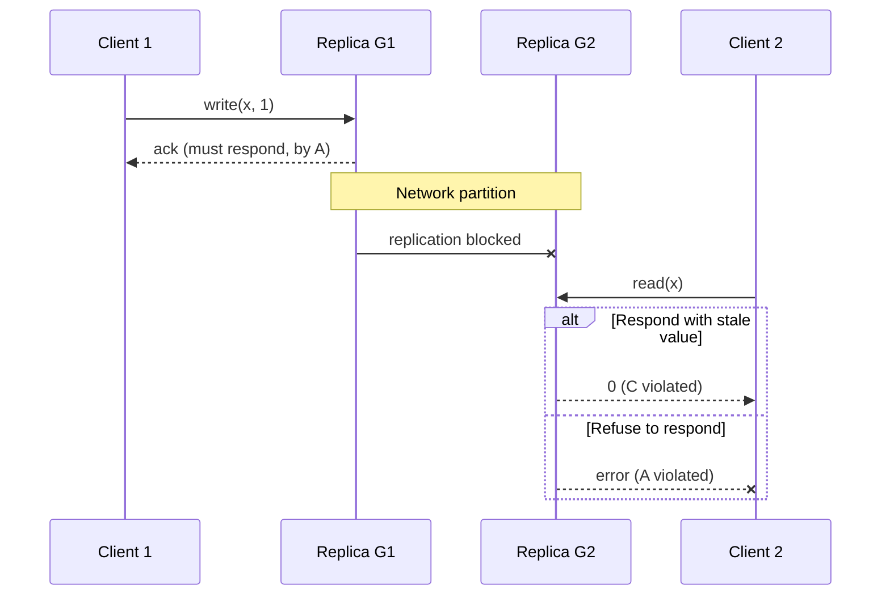
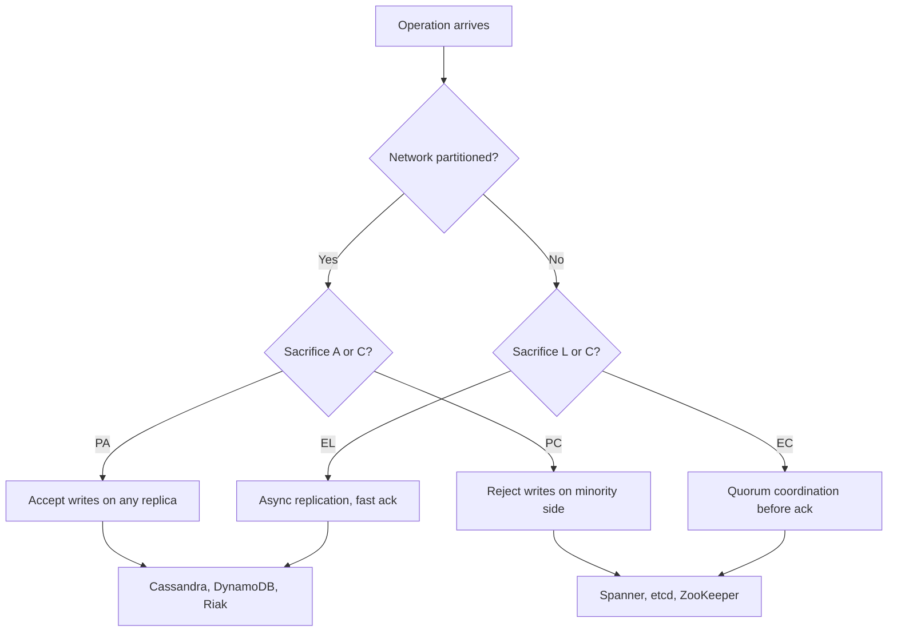
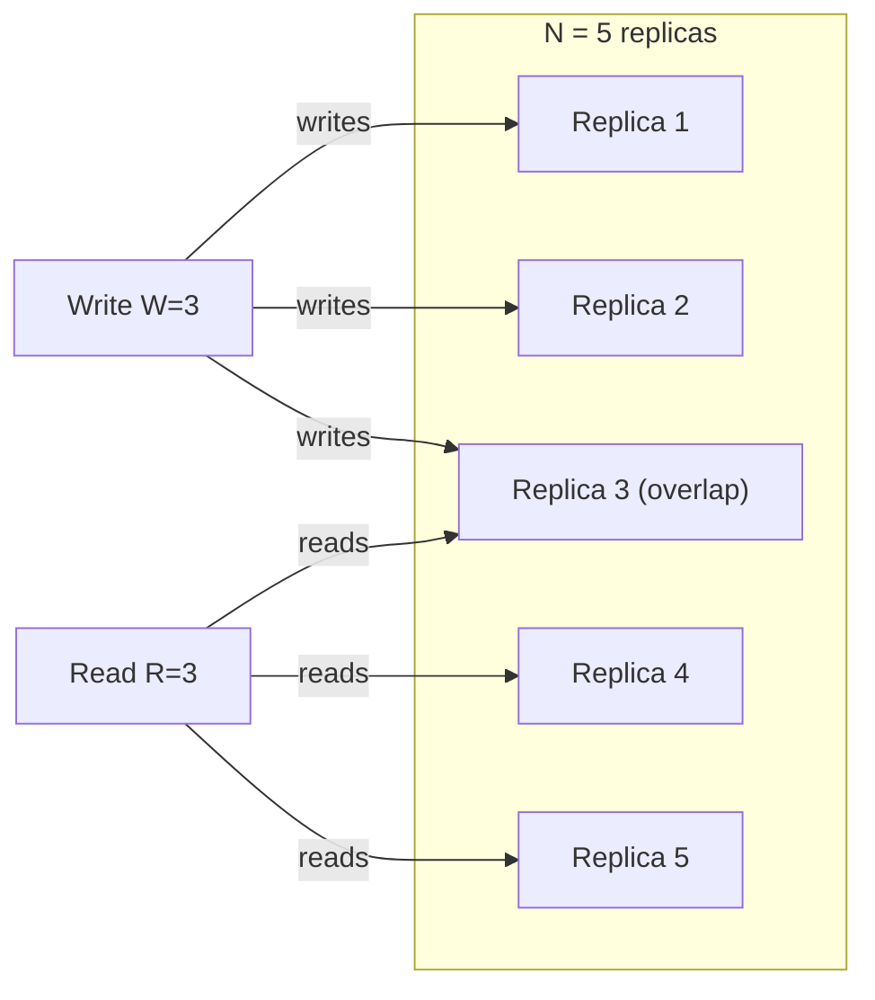
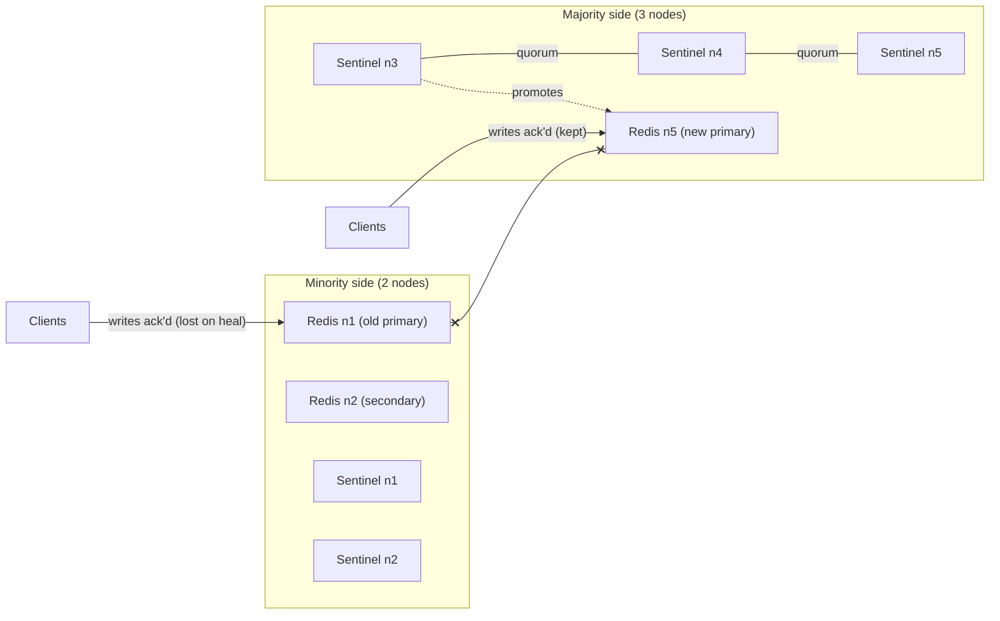

# CAP and PACELC: The Tradeoff That Keeps Confusing People

> **TL;DR**: CAP is an impossibility result: during a network partition, a distributed data store must choose between linearizable consistency and availability[^1]. It does NOT say "pick 2 of 3." PACELC extends the idea: even without a partition, you still trade consistency for latency[^2]. Every database lands somewhere on this spectrum. Use PACELC to force precise design conversations, not to assign bumper-sticker labels.

## Learning Objectives

After this module, you will be able to:

- [ ] State CAP precisely and dismantle the "pick 2 of 3" misconception
- [ ] Explain the Gilbert-Lynch proof in one paragraph
- [ ] Apply PACELC to classify real systems (PC/EC, PA/EL, PC/EL, PA/EC)
- [ ] Calculate quorum overlap requirements (R + W > N) and identify when they fail
- [ ] Use harvest and yield to reason about graceful degradation
- [ ] Push back productively when a colleague says "we picked CA"

## Intuition

Imagine a bank with two branches connected by a phone line. Both branches can see the same account balance. A customer walks into Branch A and withdraws $500. The teller updates the ledger and tries to call Branch B to sync. But the phone line is down.

Now a second customer walks into Branch B and asks for the balance. The Branch B teller has two choices:

1. **Refuse to answer** until the phone line comes back. The customer waits (or leaves angry). The bank stays correct but becomes unavailable.
2. **Answer with the old balance.** The customer is served, but the answer is wrong. The bank stays available but becomes inconsistent.

There is no third option while the phone line is down. That is CAP.

The part everyone forgets: even when the phone line works, calling Branch A before every transaction adds delay. A bank that synchronizes on every operation is slow. One that does not is fast but occasionally stale. That is the latency-vs-consistency axis that PACELC adds.

## Theory

### CAP: what it actually says

Eric Brewer conjectured at PODC 2000 that a distributed shared-data system cannot simultaneously guarantee consistency, availability, and partition tolerance[^3]. Gilbert and Lynch formalized and proved this in 2002[^1]. The precise statement:

- **C (Consistency):** every read returns the most recent write or an error. Formally, this means linearizability.
- **A (Availability):** every request to a non-failed node receives a non-error response.
- **P (Partition tolerance):** the system continues operating despite arbitrary message loss between nodes.

The critical correction: partitions are not a design choice. Networks partition. Fiber gets cut. Switches fail. BGP misconfigures[^4]. The real question is: when a partition happens, do you sacrifice C or A?

Brewer himself corrected the "2 of 3" framing in his 2012 IEEE retrospective[^5]:

1. Partitions are rare but inevitable. You cannot "give up P" in a distributed system.
2. The choice is not binary or permanent. Different operations, different data, different partitions can get different answers.
3. Design for partition recovery, not just partition response.

> [!WARNING]
> **"Pick 2 of 3" is wrong.** This phrasing implies CA is a viable distributed choice. It is not. A single-node system is trivially "CA" because it has no partitions to tolerate. The moment you add a replica, you are back in CAP territory[^5].

### The Gilbert-Lynch proof in one paragraph

Split N nodes into two groups, G1 and G2, with no communication between them. A client writes value v1 to G1. G1 must acknowledge (by availability). A client reads from G2. G2 cannot distinguish "G1 is slow" from "G1 is partitioned" in an asynchronous network. G2 must respond (by availability), but it has not seen v1, so it returns stale data (violating linearizability). The only escape: G2 refuses to respond, violating availability. QED[^1][^6].

*During a partition, G2 cannot distinguish "G1 slow" from "G1 unreachable." Any response violates either consistency or availability.*

### PACELC: the rest of the story

Daniel Abadi observed in 2010 that CAP only describes partition behavior, but partitions are rare[^7]. Most of the time, the dominant trade-off is consistency vs. latency: stronger consistency forces more replicas to coordinate per operation, adding round trips.

PACELC reformulates the principle[^2]:

- **If Partition (P):** choose Availability (A) or Consistency (C)
- **Else (E):** choose Latency (L) or Consistency (C)

Every system gets a four-letter classification:

*PACELC forces two decisions: behavior under partition (A or C) and behavior in normal operation (L or C). Most internet-scale systems are PA/EL; most financial systems are PC/EC.*

| PACELC | Partition behavior | Normal behavior | Example systems |
|---|---|---|---|
| PC/EC | Minority unavailable | Coordination on every op | Spanner, CockroachDB, etcd, ZooKeeper |
| PA/EL | All replicas serve | Async replication, fast | Cassandra, DynamoDB (default), Riak |
| PC/EL | Minority unavailable | Relaxed reads allowed | PNUTS (Yahoo), ZooKeeper follower reads |
| PA/EC | All replicas serve | Strong normal-op consistency | Rare; arguably empty in practice[^8] |

> [!NOTE]
> PACELC is strictly more useful than CAP for everyday design because most of the time you are in E-mode, not P-mode. The EL/EC decision is the one you live with daily.

### "CP" and "AP" in practice

**CP systems** use consensus-based replication (Paxos, Raft, Zab). A cluster of N nodes requires a majority quorum to make progress. During a partition, the minority side stops accepting writes. Users on that side see errors, but they never see stale or divergent data.

- **Spanner:** Paxos per split + TrueTime. Five nines availability[^9], but minority partitions are unavailable.
- **etcd/ZooKeeper/Consul:** Raft or Zab quorum. Jepsen's tests of etcd 3.4.3 observed strict serializable behavior for key-value operations[^10].
- **MongoDB (majority write concern):** primary steps down if it cannot reach majority.

**AP systems** use leaderless or multi-master replication. Every reachable replica accepts writes; divergences reconcile later via LWW, vector clocks, or CRDTs.

- **Cassandra (default):** tunable N/R/W. At consistency ONE, both sides of a partition keep serving.
- **DynamoDB (default reads):** eventually consistent. Strong reads available at 2x cost[^11].
- **Riak:** pure Dynamo-style. Designed for always-writable semantics.

> [!IMPORTANT]
> Kleppmann argues that labeling a database "CP" or "AP" without operation-level qualification is analytically lossy[^12]. ZooKeeper is not linearizable for reads by default (stale follower reads). DynamoDB is "AP" for Global Tables but offers strong reads within a region. Always ask: consistent for which operation, under which failure?

### Quorum math

Dynamo-style systems expose three parameters: N replicas per key, writes acknowledged by W replicas, reads from R replicas[^13]. The key invariant:

**R + W > N guarantees that read and write quorums overlap on at least one replica.**

That overlapping replica has the latest write, so the reader can detect it.

*When R + W > N, at least one replica participates in both the write quorum and the read quorum, guaranteeing the reader sees the latest write.*

Common configurations:

- **N=3, R=2, W=2:** overlap of 1. Strong single-key reads. Cassandra LOCAL_QUORUM.
- **N=3, R=1, W=3:** all replicas must ack writes; reads are fast but writes are slow.
- **N=5, R=3, W=3:** overlap of 1. Tolerates 2 failures for both reads and writes.

> [!WARNING]
> **R + W > N is necessary but not sufficient for linearizability.** It guarantees overlap on the same N replicas. Multi-DC deployments using LOCAL_QUORUM per DC violate this: writes quorum in DC1 and reads quorum in DC2 may not overlap at all[^12].

### Harvest and yield

Fox and Brewer (1999) proposed two continuous metrics for graceful degradation[^14]:

- **Yield:** the fraction of requests that receive a response (analogous to availability).
- **Harvest:** the fraction of data reflected in a response (completeness).

Traditional CAP treats availability as binary. Harvest/yield exposes a spectrum: a search engine can return results from 90% of its shards during a partial failure (high yield, reduced harvest) rather than refusing all queries (zero yield, full harvest). A balance-transfer system cannot trade harvest (a wrong answer breaks the bank); it must trade yield[^14].

This maps directly to real design decisions:

- **Search/social feeds:** serve partial results. Users tolerate incomplete results better than timeouts.
- **Financial transactions:** reject the request. Users tolerate "try again" better than wrong balances.
- **Analytics dashboards:** show stale data with a "last updated" timestamp. Bounded staleness is explicit harvest reduction.

## Real-World Example

**Redis Sentinel: 56% write loss in 42 seconds.**

Redis uses asynchronous primary-to-secondary replication for low latency (PA/EL). Redis Sentinel is a separate fleet of monitor processes that detect primary failure and promote a new primary. This combination creates a textbook split-brain scenario.

In Jepsen's 2013 test of a 5-node Redis Sentinel cluster[^15]:

1. A network partition isolates the primary (node 1) and one secondary (node 2) on the minority side.
2. Clients on the minority side continue writing to the old primary, which acknowledges every write.
3. Sentinels on the majority side (3 of 5) detect the primary as unreachable and promote a secondary to new primary.
4. Clients on the majority side write to the new primary.
5. When the partition heals, Sentinel demotes the old primary. It discards all writes it accepted during the split.

**Result:** 1,126 of 1,998 acknowledged writes lost, a 56% loss rate in a 42-second partition window[^15].

*During a partition, the old primary keeps accepting writes while Sentinel promotes a new primary on the majority side. On heal, the old primary's writes are silently discarded.*

**Root cause:** asynchronous replication (chosen for latency) combined with automatic failover (chosen for availability) without consensus on the data path. The failover protocol has quorum, but the replication does not[^16].

**What changed:** Redis documentation now explicitly warns that "Sentinel + Redis distributed system does not guarantee that acknowledged writes are retained during failures"[^15]. Kingsbury's recommendation: use Redis as a cache, not as a primary data store or lock service.

**Lesson for designers:** if your system uses async replication + automatic failover, you will lose acknowledged writes during partitions. This is not a bug; it is the PA/EL trade-off made concrete. If write loss is unacceptable, use consensus-based replication (Raft, Paxos) or require majority acknowledgment before responding.

## Trade-offs

| PACELC | Consistency | Availability during partition | Normal-op latency | Example systems | Best when |
|---|---|---|---|---|---|
| PC/EC | Linearizable | Minority unavailable | Higher (quorum coordination) | Spanner, CockroachDB, etcd | Financial data, inventory, locks |
| PA/EL | Eventual | All replicas serve | Lowest (local ack) | Cassandra, DynamoDB, Riak | Carts, feeds, sessions, analytics |
| PA/EC | Eventual during partition, strong normally | All replicas serve | Moderate | Rare (arguably empty)[^8] | Theoretical |
| PC/EL | Strong during partition, relaxed normally | Minority unavailable | Lower (stale reads OK) | ZooKeeper follower reads, PNUTS | Config stores with read-heavy load |

The four rows are the quadrants of Abadi's 2x2 PACELC taxonomy. They are exhaustive and mutually exclusive by construction, so readers classify a system into exactly one row rather than picking among alternatives.

**Our pick:** Use PC/EC (Spanner, CockroachDB) for financial data, uniqueness constraints, and anything where a wrong answer costs more than a slow answer. Use PA/EL (DynamoDB, Cassandra) for shopping carts, social feeds, session stores, and analytics where staleness is tolerable and availability drives revenue.

## Common Pitfalls

> [!WARNING]
> **"Pick 2 of 3" as a design framework.** This framing implies CA is a real distributed option. It is not. Brewer corrected this in 2012[^5]. The real choice: during a partition, sacrifice C or A. Outside a partition, sacrifice L or C.

> [!WARNING]
> **"CP means unavailable."** CP systems are only unavailable on the minority side during a partition. Spanner achieves five nines of availability because its private fiber network makes partitions extremely rare (network causes < 10% of outages)[^9]. CP does not mean "always slow and broken."

> [!WARNING]
> **LWW conflict resolution silently loses data.** DynamoDB Global Tables and Cassandra use last-writer-wins by default[^17]. With clock skew, a causally-later write can have a lower timestamp and be discarded. For data where every write matters, LWW is insufficient. Use CRDTs, vector clocks, or route all writes for a key to a single region.

> [!WARNING]
> **Tunable consistency is not free.** Cassandra lets you set R=QUORUM, W=QUORUM to get strong reads. But you pay: higher latency, reduced availability during failures, and operational complexity. "Tunable" means "you can misconfigure it," and many teams do[^12].

> [!CAUTION]
> **CAP is about linearizability, not "general consistency."** CAP's "C" is specifically linearizability. Causal consistency, session guarantees, and bounded staleness are all weaker models that can be totally available under partitions[^18]. A system providing causal consistency is not "violating CAP" by being available during a partition.

## Exercise

> **Problem:** You have a Dynamo-style cluster with N=5, R=2, W=3. (a) Does R + W > N hold? (b) Is this configuration strongly consistent for single-key reads? (c) A network partition splits the cluster into {1, 2} and {3, 4, 5}. Can the majority side still accept writes? Can the minority side? What happens to reads on each side?

Hint

Check the arithmetic for (a). For (b), think about what "strongly consistent" requires beyond quorum overlap. For (c), count how many replicas each side can reach and compare against W and R thresholds.

Solution

**(a) R + W > N?**

R + W = 2 + 3 = 5. N = 5. So R + W = N, which means R + W is NOT greater than N. The overlap is exactly zero in the worst case. This configuration does NOT guarantee that a read quorum and write quorum share a replica.

**(b) Strongly consistent?**

No. With R + W = N (not >), there exist executions where the read quorum contacts only replicas that were not in the write quorum. The reader can miss the latest write. For strong consistency, you need R=3 (giving R + W = 6 > 5, overlap of at least 1).

**(c) Partition behavior:**

- **Majority side {3, 4, 5}:** has 3 replicas. W=3 requires 3 acks, so writes succeed (barely). R=2 requires 2 responses, so reads succeed.
- **Minority side {1, 2}:** has 2 replicas. W=3 requires 3 acks but only 2 are reachable, so writes fail. R=2 requires 2 responses, so reads succeed but may return stale data (since no new writes can land here).

The majority side remains fully operational. The minority side becomes read-only with potentially stale data. This is CP-like behavior for writes, but the read staleness on the minority side means it is not linearizable without additional mechanisms (read-repair, anti-entropy).

**Key insight:** R + W > N is necessary but not sufficient. You also need the quorum to overlap on the correct N replicas, and you need a mechanism to resolve which value is "latest" when multiple versions exist.

## Key Takeaways

- CAP says: during a partition, choose C or A. Partitions are inevitable; "CA" is not a real distributed option.
- The "pick 2 of 3" framing is wrong. Brewer corrected it in 2012. The real choice is per-operation behavior under specific failures.
- PACELC adds the missing axis: in normal operation, you trade consistency for latency. This is the trade-off you live with every day.
- R + W > N guarantees quorum overlap for a single key on the same N replicas. Multi-DC LOCAL_QUORUM can violate this silently.
- Async replication + automatic failover = silent write loss during partitions. Redis Sentinel lost 56% of acknowledged writes in a 42-second test[^15].
- Harvest and yield turn CAP's binary into a spectrum: serve partial results (search), reject requests (banking), or show stale data with a timestamp (dashboards).
- Use PC/EC for money. Use PA/EL for carts and feeds. Use PACELC to force the conversation, not to assign labels.

## Further Reading

- [Brewer, "CAP Twelve Years Later," IEEE Computer, 2012](https://ieeexplore.ieee.org/document/6133253) - Brewer's own correction of the "2 of 3" myth; the definitive framing of CAP as a partition-time choice.
- [Gilbert and Lynch, "Brewer's Conjecture and the Feasibility of Consistent, Available, Partition-Tolerant Web Services," 2002](https://dl.acm.org/doi/10.1145/564585.564601) - the original proof; short, constructive, and still the clearest formal statement.
- [Abadi, "Consistency Tradeoffs in Modern Distributed Database System Design," IEEE Computer, 2012](https://www.cs.umd.edu/~abadi/papers/abadi-pacelc.pdf) - the PACELC paper; read this to understand why latency matters more than partition behavior for daily operations.
- [Kleppmann, "Please stop calling databases CP or AP," 2015](https://kleppmann.com/2015/05/11/please-stop-calling-databases-cp-or-ap.html) - the critique that explains why single-letter labels hide layered reality; essential for nuanced design reviews.
- [Kleppmann, "A Critique of the CAP Theorem," arXiv, 2015](https://arxiv.org/abs/1509.05393) - the formal version of the critique; proposes delay-sensitivity as a replacement framework.
- [Fox and Brewer, "Harvest, Yield, and Scalable Tolerant Systems," HotOS, 1999](https://dl.acm.org/doi/10.5555/822076.822436) - the conceptual precursor to tunable consistency; introduces the continuous trade-off that CAP's binary hides.
- [Bailis and Kingsbury, "The Network is Reliable," CACM, 2014](https://cacm.acm.org/magazines/2014/9/177925-the-network-is-reliable/fulltext) - empirical catalog of real-world partitions from switch firmware bugs to entire DC disconnects.
- [Jepsen analyses](https://jepsen.io/analyses) - Kingsbury's test results for MongoDB, Cassandra, etcd, Redis, CockroachDB, and more; what databases actually do under partition vs. what marketing claims.
- [DeCandia et al., "Dynamo: Amazon's Highly Available Key-value Store," SOSP, 2007](https://www.allthingsdistributed.com/files/amazon-dynamo-sosp2007.pdf) - the canonical AP design with N/R/W quorums and shopping-cart union-merge semantics.
- [Brewer, "Inside Cloud Spanner and the CAP Theorem," 2017](https://cloud.google.com/blog/products/databases/inside-cloud-spanner-and-the-cap-theorem) - the "effectively CA" argument; understand both why Brewer has a point and why Kleppmann disagrees.

## Flashcards

**Q:** What does CAP actually say?
**A:** During a network partition, a distributed data store must choose between linearizable consistency (every read sees the latest write) and availability (every non-failed node responds). You cannot have both simultaneously.

**Q:** Why is "pick 2 of 3" wrong?
**A:** Partition tolerance is not optional in a distributed system. Networks partition. The real choice is: during a partition, sacrifice C or A? "CA" is only valid for a single node, which is trivially not distributed.

**Q:** What does PACELC add to CAP?
**A:** The latency axis. Even without a partition, you trade consistency for latency. PACELC: if Partition, choose A or C; Else, choose L or C. This captures the daily trade-off that CAP ignores.

**Q:** Classify Cassandra (default) in PACELC and explain.
**A:** PA/EL. During a partition, both sides keep serving (available, diverging). In normal operation, single-replica reads/writes give low latency at the cost of consistency.

**Q:** Classify Spanner in PACELC and explain.
**A:** PC/EC. During a partition, the minority side stops serving (consistent). In normal operation, Paxos quorum + TrueTime commit wait enforce external consistency at the cost of latency.

**Q:** What is the quorum overlap condition for strong reads in a Dynamo-style system?
**A:** R + W > N, where N is replicas per key, W is write acknowledgments, R is read contacts. This guarantees at least one replica participates in both quorums.

**Q:** Why is R + W > N necessary but not sufficient for linearizability?
**A:** It guarantees overlap on the same N replicas, but multi-DC deployments with per-DC quorums can violate this. Also, overlap alone does not handle concurrent writes or read-repair timing.

**Q:** What did Jepsen find about Redis Sentinel under partition?
**A:** 56% of acknowledged writes were lost (1,126 of 1,998) during a 42-second partition. The old primary kept accepting writes while Sentinel promoted a new primary; on heal, the old primary's writes were discarded.

**Q:** What are harvest and yield?
**A:** Yield is the fraction of requests that get a response (like availability). Harvest is the fraction of data reflected in a response (completeness). They turn CAP's binary into a continuous spectrum for graceful degradation.

**Q:** A team says "we need strong consistency across regions." What PACELC category does that imply, and what is the cost?
**A:** PC/EC. The cost is write latency: cross-region coordination adds tens to hundreds of milliseconds per write, and availability drops when a region is partitioned.

**Q:** Why does Kleppmann say "please stop calling databases CP or AP"?
**A:** Because CAP's binary classification is too coarse. Real systems offer different consistency for different operations. ZooKeeper is not linearizable for reads by default. DynamoDB is "AP" for Global Tables but offers strong reads within a region. No real system is purely one label.

**Q:** What is the difference between CAP-C and ACID-C?
**A:** CAP-C means linearizability: every read returns the most recent completed write. ACID-C means application-level invariants hold after every transaction (foreign keys, uniqueness). They are completely different properties that share an unfortunate letter.

**Q:** How does Spanner achieve "effectively CA" despite being technically CP?
**A:** Spanner runs on Google's private fiber, making partitions extremely rare (network causes < 10% of outages). With five nines availability, the system spends < 5 minutes per year in the "choose C or A" state. It is technically CP but operationally always-available.

**Q:** When should you choose PA/EL over PC/EC?
**A:** When availability and low latency matter more than perfect consistency. Shopping carts (lost add = lost sale), social feeds (stale like count is fine), session stores, and analytics. If a wrong answer costs less than a slow or missing answer, choose PA/EL.

**Q:** What happens when you combine async replication with automatic failover?
**A:** Silent write loss during partitions. The old primary accepts writes that are never replicated. The new primary diverges. On heal, the old primary's writes are discarded. This is the fundamental PA/EL trade-off made concrete.

## References

[^1]: Gilbert and Lynch, "Brewer's conjecture and the feasibility of consistent, available, partition-tolerant web services," ACM SIGACT News 33(2), 2002. https://users.ece.cmu.edu/~adrian/731-sp04/readings/GL-cap.pdf
[^2]: Abadi, "Consistency Tradeoffs in Modern Distributed Database System Design: CAP is Only Part of the Story," IEEE Computer 45(2), Feb 2012. https://www.odbms.org/2012/01/consistency-tradeoffs-in-modern-distributed-database-system-design/
[^3]: Brewer, "Towards Robust Distributed Systems," PODC 2000 keynote. https://dl.acm.org/doi/abs/10.1145/343477.343502
[^4]: Bailis and Kingsbury, "The Network is Reliable," ACM Queue / CACM, September 2014. https://cacm.acm.org/magazines/2014/9/177925-the-network-is-reliable/fulltext
[^5]: Brewer, "CAP Twelve Years Later: How the Rules Have Changed," IEEE Computer 45(2), Feb 2012. https://ieeexplore.ieee.org/document/6133253
[^6]: Whittaker (summary), "An Illustrated Proof of the CAP Theorem." https://mwhittaker.github.io/blog/an_illustrated_proof_of_the_cap_theorem/
[^7]: Abadi, "Problems with CAP, and Yahoo's little known NoSQL system," DBMS Musings blog, April 2010. http://dbmsmusings.blogspot.com/2010/04/problems-with-cap-and-yahoos-little.html
[^8]: Abadi, "Hazelcast and the Mythical PA/EC System," DBMS Musings, 2017. http://dbmsmusings.blogspot.com/2017/10/hazelcast-and-mythical-paec-system.html
[^9]: Brewer, "Inside Cloud Spanner and the CAP Theorem," Google Cloud Blog, Feb 2017. https://cloud.google.com/blog/products/databases/inside-cloud-spanner-and-the-cap-theorem
[^10]: Kingsbury, "etcd 3.4.3," Jepsen, Jan 2020. https://jepsen.io/analyses/etcd-3.4.3
[^11]: AWS, "DynamoDB Read Consistency." https://docs.aws.amazon.com/amazondynamodb/latest/developerguide/HowItWorks.ReadConsistency.html
[^12]: Kleppmann, "Please stop calling databases CP or AP," May 2015. https://kleppmann.com/2015/05/11/please-stop-calling-databases-cp-or-ap.html
[^13]: DeCandia et al., "Dynamo: Amazon's Highly Available Key-value Store," SOSP 2007. https://www.allthingsdistributed.com/files/amazon-dynamo-sosp2007.pdf
[^14]: Fox and Brewer, "Harvest, Yield, and Scalable Tolerant Systems," HotOS-VII, 1999. https://radlab.cs.berkeley.edu/people/fox/static/pubs/pdf/c18.pdf
[^15]: Kingsbury, "Jepsen: Redis," May 2013. https://aphyr.com/posts/283-jepsen-redis
[^16]: Kingsbury, "Jepsen: Redis redux," December 2013. https://aphyr.com/posts/307-jepsen-redis-redux
[^17]: AWS, "DynamoDB Global Tables: How it works," Version 2019.11.21 (Current). https://docs.aws.amazon.com/amazondynamodb/latest/developerguide/V2globaltables_HowItWorks.html
[^18]: Kleppmann, "A Critique of the CAP Theorem," arXiv:1509.05393, September 2015. https://arxiv.org/abs/1509.05393
