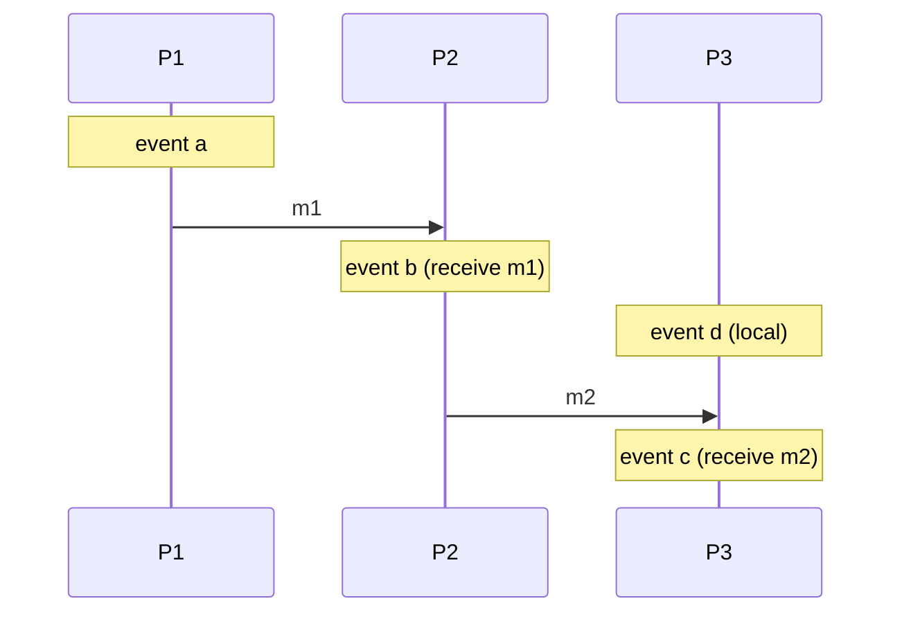
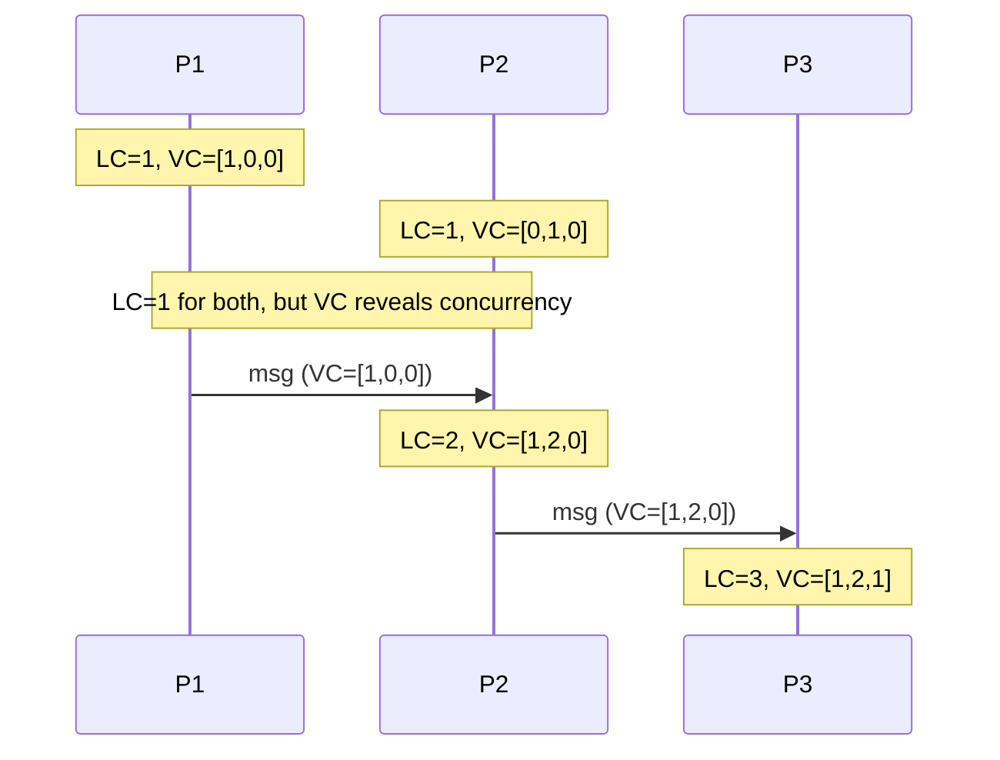
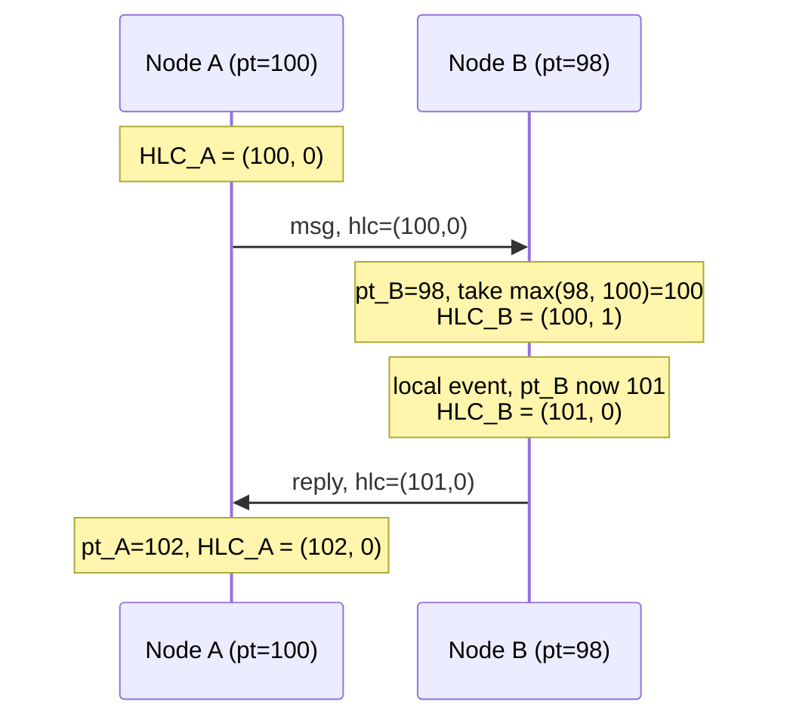
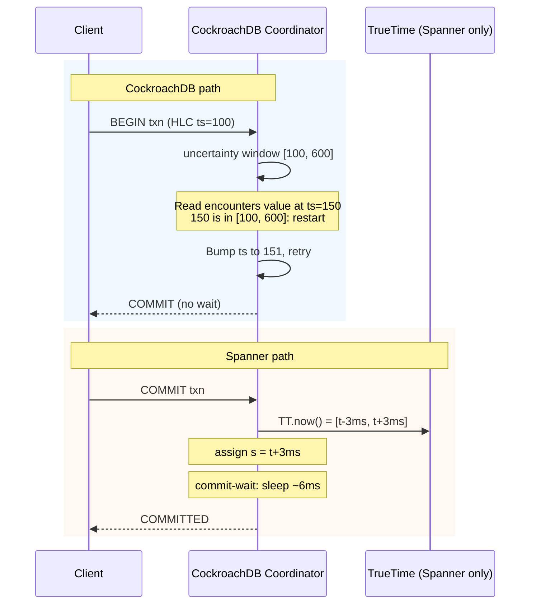

# Clocks and Ordering: Lamport, Vector, and Hybrid Logical Clocks

> **TL;DR**: Wall-clock time is not safe for ordering events across machines. NTP skew between cloud VMs is routinely 10 to 250 ms[^1], quartz oscillators drift up to 150 ppm[^2], and leap seconds have crashed production systems from Reddit to Cloudflare[^3][^4]. Use Lamport timestamps when you need a cheap total order, vector clocks when you must detect concurrency, and Hybrid Logical Clocks (HLC) when you need causal ordering in a 64-bit timestamp compatible with wall-clock reasoning. TrueTime is a hardware advantage that originally bounded epsilon to "usually less than 7 ms" (Corbett et al., OSDI 2012) and, as of Google's 2023 update, to **under 1 ms at p99**[^5][^25]; you cannot replicate it in software, but AWS ClockBound now brings similar sub-millisecond bounds to EC2. Any time you see `ORDER BY created_at` on data written by many nodes, be suspicious.

## Learning Objectives

After this module, you will be able to:

- [ ] Define happens-before and distinguish causal from concurrent events
- [ ] Use Lamport timestamps to build a total order consistent with causality
- [ ] Use vector clocks to detect concurrent updates
- [ ] Explain HLC: a logical counter pinned to physical time in 64 bits
- [ ] Describe TrueTime and how Spanner uses bounded uncertainty for external consistency
- [ ] Choose the right clock for a given system design

## Intuition

Imagine two photographers at a wedding, each with a wristwatch. Photographer A's watch runs 30 seconds fast. Photographer B's watch runs 20 seconds slow. Both stamp every photo with their watch time. Later, you try to arrange all photos in chronological order by timestamp. The result is wrong: some of A's "later" photos actually happened before B's "earlier" ones, and you cannot tell which from the timestamps alone.

Now imagine a corporate mailroom that stamps every incoming letter with a counter: letter 1, letter 2, letter 3. The counter does not know what time it is, but it guarantees that if letter 5 was a reply to letter 3, then 3 < 5. You cannot tell real-world time from the stamp, but you can tell causality. That is the trade-off between physical clocks (human-readable but unreliable across machines) and logical clocks (reliable ordering but no connection to wall time).

Distributed systems need ordering. Consistency models and consensus protocols assume you have it. This chapter teaches you where ordering actually comes from.

## Theory

### Why wall-clock time fails

Every computer has a quartz oscillator that drifts. Commodity motherboards drift up to 150 parts per million[^2], which accumulates to tens of seconds per day if uncorrected. NTP corrects drift by slewing or stepping the clock, but in cloud VMs the sync is routinely 10 to 250 ms off[^1]. During NTP outages, skew can reach multiple seconds.

Three failure modes make wall clocks dangerous for ordering:

**Leap seconds.** Between 1972 and 2016, the IERS inserted 27 leap seconds at irregular intervals (about every 21 months on average, but with gaps as long as 6 years). The most recent leap second was December 31, 2016; none have been inserted since, and the CGPM voted in November 2022 to phase out the practice by 2035 at the latest[^6]. Even with no new insertions, legacy leap-second bugs still haunt systems that handle historical timestamps or run on older code paths. On June 30, 2012, the Linux kernel's hrtimer/futex path deadlocked when the second was inserted, causing CPU saturation on servers running Reddit, Mozilla, Cassandra, and Hadoop[^4][^7]. On January 1, 2017, Cloudflare's RRDNS (written in Go) computed a negative RTT when `time.Now()` ran backward across the leap second, panicking `rand.Int63n` with a negative argument and erroring approximately 0.2% of DNS queries at peak, with full resolution taking about 6 hours and 45 minutes[^3].

**Non-monotonic jumps.** POSIX `CLOCK_REALTIME` can jump in either direction (NTP step, admin action, leap second). Any code that computes `elapsed = now - start` without using a monotonic clock source is vulnerable.

**VM pauses.** Hypervisor steal time and live-migration freezes can pause a guest for hundreds of milliseconds. The guest's clock appears to jump forward on resume, but events during the pause have no timestamps at all.

> [!IMPORTANT]
> Use `CLOCK_MONOTONIC` (Linux) or the monotonic component of `time.Time` (Go 1.9+) for measuring intervals. Reserve `CLOCK_REALTIME` for human-facing display only.

### Happens-before (Lamport 1978)

Leslie Lamport sidestepped physical time entirely[^8]. His "happens-before" relation (written `->`) captures the only ordering that matters for program correctness:

- **Same-process rule:** if a and b are events in the same process and a comes first, then a -> b.
- **Message rule:** if a is the send of a message and b is its receive, then a -> b.
- **Transitivity:** if a -> b and b -> c, then a -> c.

Events not related by `->` are **concurrent** (written `a || b`). Concurrency does not mean "at the same instant." It means neither event could have influenced the other. This is the foundation of all logical clocks.

*Events a -> b -> c form a causal chain; event d is concurrent with a (no message path connects them), even though d may have happened "at the same time" on a wall clock.*

### Lamport timestamps

A Lamport timestamp is a scalar counter per process[^8]:

1. On a local event: `C_P += 1`
2. On sending a message: tag it with `C_P` (after increment)
3. On receiving a message with tag `t`: `C_P = max(C_P, t) + 1`

To break ties, extend the timestamp to `(C_P, process_id)` and compare lexicographically. The result is a **total order consistent with causality**: if a -> b, then LC(a) < LC(b).

The critical limitation: the converse does not hold. LC(a) < LC(b) does **not** imply a -> b. Two concurrent events get different Lamport timestamps, but you cannot tell them apart from causally ordered events. Lamport timestamps erase concurrency information.

**Use Lamport timestamps when:** you need a cheap total order for a log (like Raft's log index) and do not need to detect concurrent writes.

### Vector clocks

Vector clocks (Fidge 1988, Mattern 1989) strengthen the guarantee in both directions[^9][^10]. Each process i maintains a vector `VC_i` of length N (one entry per process):

1. On a local event: `VC_i[i] += 1`
2. On sending: attach `VC_i`
3. On receiving `VC_j`: `VC_i[k] = max(VC_i[k], VC_j[k])` for all k, then `VC_i[i] += 1`

Comparison: `VC(a) < VC(b)` iff every entry of a is less than or equal to the corresponding entry of b, and at least one is strictly less. If neither `VC(a) <= VC(b)` nor `VC(b) <= VC(a)`, the events are concurrent.

This gives the exact characterization: **a -> b if and only if VC(a) < VC(b)**[^9].

*The same event sequence timestamped with Lamport scalars and vector clocks. Lamport assigns 1 to both initial events, hiding their concurrency. Vector clocks [1,0,0] and [0,1,0] are incomparable, revealing that neither caused the other.*

The cost: O(N) bytes per timestamp, where N is the number of writers. Amazon's original Dynamo paper (2007) used vector clocks per item[^11]. With thousands of mobile clients writing, vectors can grow impractically large, motivating the truncation scheme Dynamo employed.

### Dotted version vectors

Riak's classic vector-clock implementation (2009 to 2014) suffered "sibling explosion" as thousands of clients wrote with their own client IDs. Dotted version vectors (DVV), introduced by Preguica et al. (2010), solve this by keying the vector on **servers**, not clients[^12][^13].

Each value is tagged with a single "dot" (server_id, counter) identifying which server event produced it. The surrounding context is a version vector over servers only. On a put-with-context, the DVV subsumes all siblings the client observed; only siblings concurrent with that context survive.

Riak KV adopted DVVs as its default in version 2.0, eliminating the sibling explosion that plagued earlier deployments[^14].

**Use vector clocks or DVVs when:** you have a multi-leader eventually-consistent store and must detect (not just resolve) concurrent writes. Use DVVs specifically when clients outnumber servers.

### Hybrid Logical Clocks (HLC)

HLC (Kulkarni et al. 2014) combines the best of both worlds: a 64-bit timestamp that tracks wall-clock time closely while preserving the Lamport causality guarantee[^15][^16].

The state at node j is a pair `(l_j, c_j)` where `l` is the physical-time component and `c` is a logical counter:

- **Local event:** `l_new = max(l_j, physical_time)`; if `l_new == l_j`, then `c_j += 1`, else `c_j = 0`.
- **Receive from (l_m, c_m):** `l_new = max(l_j, l_m, physical_time)`; bump `c_j` to be strictly greater than both the local and incoming counters at the same `l` value.

In one common encoding, the timestamp fits in 64 bits: 48 bits for physical time (millisecond granularity), 16 bits for the logical counter[^15]. The result:

- **Causality:** if a -> b, then HLC(a) < HLC(b) (the Lamport property).
- **Proximity to wall time:** the physical component stays within NTP drift of real time, so HLC timestamps are human-interpretable and compatible with `AS OF SYSTEM TIME` queries[^17].
- **Constant size:** 64 bits regardless of cluster size, unlike vector clocks.

The limitation: like Lamport, HLC is one-way. HLC(a) < HLC(b) does not imply a -> b. You cannot detect concurrency with HLC alone.

CockroachDB, YugabyteDB, and MongoDB all use HLC-style clocks[^1][^17][^18]. MongoDB's SIGMOD 2019 paper describes their cluster-wide logical clock for causal consistency[^17].

*An HLC at Node B advances its logical counter when its physical clock is behind the incoming message timestamp, preserving strict monotonicity without waiting for NTP to catch up.*

### TrueTime and bounded physical clocks

Google's TrueTime is not a clock. It is an API that returns an **interval** `[earliest, latest]` with a guarantee that the true time is inside[^5]. Every Google datacenter hosts "time masters" (half GPS, half atomic clocks). Servers poll multiple masters, discard outliers via Marzullo's algorithm, and report uncertainty as epsilon.

In production, epsilon is typically 1 to 7 ms[^5]. This is orders of magnitude tighter than NTP (10 to 250 ms).

Spanner uses TrueTime for **commit-wait**: after assigning commit timestamp `s`, a transaction sleeps until `TT.now().earliest > s` before acknowledging[^5]. This guarantees that any later transaction anywhere in the world picks a strictly greater timestamp. The result is external consistency (strict serializability) without cross-datacenter coordination for reads.

The commit-wait cost is proportional to epsilon: roughly 2 * epsilon per write, or about 7 to 14 ms in practice[^5].

AWS now offers a similar capability. Amazon Time Sync Service (November 2023) provides under-100-microsecond accuracy over NTP and under-40-microsecond accuracy over PTP hardware clocks on EC2[^19]. ClockBound is the open-source daemon that exposes the uncertainty interval[^20]. YugabyteDB integrates with Amazon Time Sync to tighten its clock uncertainty[^21].

> [!TIP]
> You do not need Google's infrastructure to use the commit-wait idea. AWS ClockBound gives you a bounded interval on commodity EC2 instances. The tighter the bound, the shorter the wait.

## Real-World Example

**CockroachDB: HLC without atomic clocks.**

CockroachDB is a distributed SQL database that achieves serializability on commodity hardware using HLC[^1]. The design illustrates how to live without TrueTime.

Each CockroachDB node maintains an HLC. Transactions get a provisional commit timestamp from the coordinator's HLC. The critical insight is the **uncertainty interval**: every read carries a window `[ts, ts + max_offset]` where `max_offset` defaults to 500 ms[^22]. If a read encounters a value with a timestamp inside this window, the system cannot tell whether the value was committed before or after the transaction started. CockroachDB resolves this with an **uncertainty restart**: it bumps the transaction's timestamp above the encountered value and retries[^1].

Nodes gossip pairwise clock offsets via RPC heartbeats. If a node's observed offset exceeds the configured tolerated offset threshold, it self-terminates rather than risk serving stale reads[^22][^23].

The contrast with Spanner is instructive:

| | Spanner | CockroachDB |
|---|---|---|
| Clock source | GPS + atomic (epsilon 1-7 ms) | NTP (skew 10-250 ms) |
| Write cost | Commit-wait (~7-14 ms sleep) | No wait; reads may restart |
| Consistency | External (strict serializable) | Serializable (not cross-key linearizable) |
| Hardware | Custom time masters per DC | Commodity servers |
| Default offset budget | ~7 ms | 500 ms |

Spanner pays on writes (a short sleep). CockroachDB pays on reads (occasional restarts). Both achieve serializability. Only Spanner achieves external consistency, because only TrueTime bounds uncertainty tightly enough to make commit-wait cheap.

*CockroachDB avoids commit-wait by restarting reads that hit the uncertainty window; Spanner avoids read restarts by waiting out its tight uncertainty interval on writes.*

## Trade-offs

| Approach | Pros | Cons | Best When | Our Pick |
|---|---|---|---|---|
| Lamport timestamps | Total order; O(1) size; no membership tracking | Cannot detect concurrency | Totally-ordered logs (Raft index) | When you only need "before/after," not "concurrent" |
| Vector clocks | Detect concurrency exactly | O(N) per timestamp; N = writers | Multi-leader K/V with small writer set | When conflict detection matters more than size |
| Dotted version vectors | Compact even with many clients; fixes sibling explosion | More complex; client must carry context | Client-facing K/V stores (Riak-style) | When clients outnumber servers |
| HLC | 64-bit; physical-like and causal; drop-in for wall-clock | One-way causality only; needs bounded clock skew | Distributed SQL, causal consistency | The modern default for most distributed databases |
| TrueTime + commit-wait | External consistency; no cross-DC coordination for reads | Needs atomic + GPS hardware; writes pay epsilon | Global strict serializability; Google's 2023 update reports under 1 ms p99 epsilon[^25] | When correctness is non-negotiable and you can afford the infra |

## Common Pitfalls

> [!WARNING]
> **Last-writer-wins silently drops concurrent writes.** Cassandra's default conflict resolution compares wall-clock timestamps and keeps the largest[^24]. Under NTP skew of 10 to 250 ms between cloud VMs[^1], a causally-later write on a slow-clocked node is permanently shadowed by an earlier write on a fast-clocked node with no user-visible signal. Jepsen's analysis of Cassandra under QUORUM + LWW observed 285 of 1,009 acknowledged writes lost (approximately 28%)[^26]. For collaborative state, shared counters, or anything where a lost write matters, use an OR-Set, a CRDT register that keeps all concurrent values, or HLC + single-writer consensus per key.

> [!WARNING]
> **`ORDER BY created_at` on multi-writer data.** If `created_at` comes from wall clocks on different nodes, the sort order is meaningless within the NTP skew window. Use HLC-derived timestamps or a single-writer pattern per partition.

> [!WARNING]
> **Leap-second bugs in timing code.** Any `elapsed = now - start` using a non-monotonic clock source can go negative on a leap second. The 2012 Linux kernel bug took down Reddit and Cassandra[^4]; the 2017 Cloudflare bug errored DNS for about 6 hours and 45 minutes[^3]. Use monotonic clocks for intervals; use leap smearing (Google, AWS) to eliminate the discontinuity.

> [!WARNING]
> **Setting CockroachDB `max_offset` below NTP skew.** Nodes self-terminate when pairwise offsets exceed the tolerated offset threshold[^22]. Setting it to 100 ms on a cluster with 80 ms NTP variance causes cascading node deaths. Keep the 500 ms default unless you have PTP or AWS Time Sync.

> [!WARNING]
> **Treating NTP as fact, not best-effort.** NTP gives you a probability distribution, not a point. `System.currentTimeMillis()` is a guess. Design for the uncertainty: use intervals (TrueTime, ClockBound) or logical clocks that do not depend on accuracy.

> [!WARNING]
> **Assuming monotonic clocks survive VM migration.** `CLOCK_MONOTONIC` is guaranteed non-decreasing within one boot. A VM live-migration is effectively a reboot of the clock source. After migration, the monotonic clock may reset or jump. Use the hypervisor's paravirtual clock (`kvm-clock`, `tsc`) where available.

## Exercise

Your multi-region document-collaboration service uses LWW on edits and is silently losing user changes about once a week. Diagnose why. Propose three fixes: (1) vector clocks for conflict detection, (2) CRDTs for automatic merging (forward reference to [CRDTs](./05-crdts.md)), (3) switching to HLC with consensus per document. Compare.

Hint

The weekly loss rate correlates with NTP skew spikes during maintenance windows. Think about what happens when two users edit the same paragraph within the skew window: both writes get timestamps, but the "later" timestamp does not correspond to the later real-time event.

Solution

**Diagnosis:** LWW resolves conflicts by comparing wall-clock timestamps. With NTP skew of 10 to 250 ms between regions, edits within that window are ordered arbitrarily. Once a week, two users edit the same section within the skew window, and the "loser" edit is silently discarded.

**Fix 1: Vector clocks for conflict detection.**

Replace LWW with vector clocks (or DVVs) per document section. When two edits are concurrent (incomparable vectors), surface both as a conflict for the user to resolve. This eliminates silent loss but adds user-facing merge UX. Cost: O(N) metadata per section, where N is the number of editing servers.

**Fix 2: CRDTs for automatic merging.**

Use a CRDT text type (RGA, Yjs, Automerge) that merges concurrent edits without conflict. No user intervention needed. Cost: higher storage (operation log or state-based CRDT metadata), more complex client library, and some merge results may surprise users (interleaved characters from concurrent typists).

**Fix 3: HLC with consensus per document.**

Assign each document a leader (via Raft or a lease). All edits to that document go through the leader, which assigns HLC timestamps in causal order. No concurrent writes exist for the same document, so LWW is safe (there is only one writer). Cost: write latency increases by one consensus round trip; leader failover adds complexity; cross-region writes pay the round-trip to the leader's region.

**Comparison:**

| Fix | Silent loss? | User UX | Latency | Complexity |
|---|---|---|---|---|
| Vector clocks | No (conflicts surfaced) | Merge UI needed | Low (no coordination) | Medium |
| CRDTs | No (auto-merged) | Seamless but surprising merges | Low (no coordination) | High (CRDT library) |
| HLC + consensus | No (single writer) | Seamless | Higher (consensus RTT) | Medium |

**Recommendation:** For a document-collaboration service, CRDTs are the best fit. They eliminate conflicts without coordination latency, which matters for real-time typing. Google Docs, Figma, and Apple Notes all use CRDT-like approaches. Use HLC + consensus only if you need strict ordering guarantees (e.g., financial documents where merge semantics are unacceptable).

## Key Takeaways

- Wall-clock time is not safe for ordering in distributed systems. NTP skew of 10 to 250 ms between cloud VMs is routine.
- Lamport timestamps give a total order consistent with causality but cannot detect concurrency. Use them for logs, not conflict detection.
- Vector clocks detect concurrency exactly (a -> b iff VC(a) < VC(b)) but cost O(N) per timestamp. Dotted version vectors fix the explosion for client-heavy workloads.
- HLC is the modern default for distributed databases: 64 bits, causal, physical-like, and used by CockroachDB, YugabyteDB, and MongoDB.
- TrueTime bounds uncertainty to 1 to 7 ms with GPS and atomic clocks. Commit-wait converts that bound into external consistency. AWS ClockBound brings a similar API to commodity EC2.
- Any time you see `ORDER BY created_at` on data written by many nodes, ask: "What clock produced this timestamp, and what is its skew budget?"
- Last-write-wins is wrong by default. Use it only when losing a concurrent write is explicitly acceptable.

## Further Reading

- [Time, Clocks, and the Ordering of Events in a Distributed System (Lamport 1978)](https://lamport.azurewebsites.net/pubs/time-clocks.pdf) - the founding paper; happens-before and logical clocks in 6 pages. Start here.
- [Logical Physical Clocks and Consistent Snapshots (Kulkarni et al. 2014)](https://cse.buffalo.edu/tech-reports/2014-04.pdf) - the HLC paper with pseudocode; dense but essential if you work on CockroachDB or YugabyteDB internals.
- [Living Without Atomic Clocks (CockroachDB, 2022)](https://www.cockroachlabs.com/blog/living-without-atomic-clocks/) - the canonical "HLC vs TrueTime" explainer; best single resource for understanding the uncertainty-restart trade-off.
- [Spanner: Google's Globally Distributed Database (Corbett et al., OSDI 2012)](https://research.google/pubs/spanner-googles-globally-distributed-database-2/) - the original TrueTime + Paxos system paper; read Section 4 for commit-wait.
- [Spanner, TrueTime and the CAP Theorem (Brewer, 2017)](https://research.google/pubs/spanner-truetime-and-the-cap-theorem/) - Brewer explains why Spanner is "effectively CA" and how TrueTime enables it.
- [There Is No Now (Sheehy, ACM Queue 2015)](https://queue.acm.org/detail.cfm?id=2745385) - a short, opinionated essay on why "now" is not a distributed-system concept; excellent for building intuition.
- [How and why the leap second affected Cloudflare DNS (2017)](https://ghost.blog.cloudflare.com/how-and-why-the-leap-second-affected-cloudflare-dns/) - a tight post-mortem with Go code showing exactly how a non-monotonic clock causes a production outage.
- [It's About Time: Microsecond-Accurate Clocks on Amazon EC2 (AWS, 2023)](https://aws.amazon.com/blogs/compute/its-about-time-microsecond-accurate-clocks-on-amazon-ec2-instances) - AWS's TrueTime-style hardware with ClockBound; the path to tighter bounds without Google-grade infra.

## Flashcards

**Q:** What does happens-before (a -> b) mean?
**A:** Event a could have causally influenced event b: either they are in the same process with a first, a is the send of a message that b receives, or there is a transitive chain connecting them.

**Q:** What guarantee do Lamport timestamps provide, and what do they NOT provide?
**A:** They guarantee a total order consistent with causality (a -> b implies LC(a) < LC(b)). They do NOT detect concurrency: LC(a) < LC(b) could mean a -> b or a || b.

**Q:** How do vector clocks improve on Lamport timestamps?
**A:** Vector clocks provide an exact characterization: a -> b if and only if VC(a) < VC(b). If neither vector dominates, the events are concurrent. The cost is O(N) space per timestamp.

**Q:** What problem do dotted version vectors solve?
**A:** Classic vector clocks grow one entry per writer (including clients). DVVs key the vector on servers only and attach a single "dot" per value, keeping size bounded by the server count even with millions of clients.

**Q:** What is an HLC, and why is it 64 bits?
**A:** A Hybrid Logical Clock combines 48 bits of physical time (milliseconds) with 16 bits of logical counter. It preserves the Lamport causality property while staying within NTP drift of wall-clock time, making timestamps human-interpretable and compatible with time-travel queries.

**Q:** How does CockroachDB handle clock uncertainty without TrueTime?
**A:** Each transaction carries an uncertainty interval [ts, ts + max_offset]. If a read encounters a value in that window, the transaction restarts at a higher timestamp. Nodes self-terminate if their clock drifts beyond the configured tolerated offset threshold.

**Q:** What is TrueTime's commit-wait, and what does it achieve?
**A:** After assigning commit timestamp s, Spanner sleeps until TT.now().earliest > s before acknowledging. This guarantees any later transaction picks a strictly greater timestamp, achieving external consistency (strict serializability) without cross-DC coordination for reads.

**Q:** What is the typical TrueTime epsilon in Spanner production?
**A:** 1 to 7 ms, depending on proximity to time masters. This bounds the commit-wait duration.

**Q:** Why is last-write-wins (LWW) dangerous as a default conflict resolution?
**A:** LWW compares wall-clock timestamps. With NTP skew, a causally-later write can have a lower timestamp and be silently discarded. The system loses data without any error signal.

**Q:** What is CockroachDB's default max_offset, and what happens if a node exceeds it?
**A:** Default is 500 ms. If a node's observed clock offset exceeds the tolerated offset threshold relative to peers, it self-terminates to prevent consistency violations.

**Q:** When should you use HLC vs vector clocks?
**A:** Use HLC when you need causal ordering in a compact 64-bit timestamp (distributed SQL, causal consistency). Use vector clocks when you must detect concurrent writes and surface conflicts (multi-leader eventually-consistent stores with a small writer set).

**Q:** What did the 2012 leap-second bug break?
**A:** The Linux kernel's hrtimer/futex path deadlocked on the inserted second, causing CPU saturation. Reddit, Mozilla, Cassandra, and Hadoop operators reported crashes and elevated load.

**Q:** How does AWS ClockBound relate to TrueTime?
**A:** ClockBound exposes a TrueTime-like uncertainty interval on EC2 instances using Amazon Time Sync Service (GPS-disciplined, under 100 microseconds NTP accuracy). It lets databases implement commit-wait-style protocols without Google's custom hardware.

## References

[^1]: Spencer Kimball, "Living Without Atomic Clocks", Cockroach Labs blog, 2022-01 update. https://www.cockroachlabs.com/blog/living-without-atomic-clocks/
[^2]: NTPclient HOWTO, "Typical commodity PC motherboards have initial set errors up to 150 ppm". http://doolittle.icarus.com/ntpclient/HOWTO
[^3]: John Graham-Cumming, "How and why the leap second affected Cloudflare DNS", Cloudflare blog, 2017-01-01. https://ghost.blog.cloudflare.com/how-and-why-the-leap-second-affected-cloudflare-dns/
[^4]: Cade Metz, "The Inside Story of the Extra Second That Crashed the Web", WIRED, 2012-07-03. https://www.wired.com/2012/07/leap-second-glitch-explained/
[^5]: James C. Corbett et al., "Spanner: Google's Globally-Distributed Database", OSDI 2012. https://research.google/pubs/spanner-googles-globally-distributed-database-2/
[^6]: CGPM Resolution 4 (2022), "On the use and future development of UTC", adopted 18 November 2022 (phase out leap seconds by 2035); see also Wikipedia, "Leap second", for the complete list of 27 insertions from 1972 through 31 December 2016. https://en.wikipedia.org/wiki/Leap_second
[^7]: Red Hat Knowledge Base, "Resolve Leap Second Issues in Red Hat Enterprise Linux", updated 2021. https://access.redhat.com/articles/15145
[^8]: Leslie Lamport, "Time, Clocks, and the Ordering of Events in a Distributed System", Communications of the ACM, July 1978. https://lamport.azurewebsites.net/pubs/time-clocks.pdf
[^9]: Colin J. Fidge, "Logical Time in Distributed Computing Systems", IEEE Computer, Vol. 24, No. 8, August 1991, pp. 28-33 (expanded journal version of "Timestamps in Message-Passing Systems That Preserve the Partial Ordering", ACSC-11, 1988). https://ieeexplore.ieee.org/document/84874
[^10]: Friedemann Mattern, "Virtual Time and Global States of Distributed Systems", 1989. https://www.researchgate.net/publication/2949837_Virtual_Time_and_Global_States_of_Distributed_Systems
[^11]: Giuseppe DeCandia et al., "Dynamo: Amazon's Highly Available Key-value Store", SOSP 2007. https://www.allthingsdistributed.com/files/amazon-dynamo-sosp2007.pdf
[^12]: Nuno Preguica, Carlos Baquero, Paulo Sergio Almeida, Victor Fonte, Ricardo Goncalves, "Dotted Version Vectors: Logical Clocks for Optimistic Replication", arXiv:1011.5808, 2010. https://arxiv.org/abs/1011.5808
[^13]: Riak KV Dotted Version Vectors overview. https://riak.com/products/riak-kv/dotted-version-vectors/index.html
[^14]: Riak documentation, "Causal Context". https://docs.riak.com/riak/kv/latest/learn/concepts/causal-context/
[^15]: Sandeep S. Kulkarni, Murat Demirbas, Deepak Madappa, Bharadwaj Avva, Marcelo Leone, "Logical Physical Clocks and Consistent Snapshots in Globally Distributed Databases", 2014. https://cse.buffalo.edu/tech-reports/2014-04.pdf
[^16]: Kulkarni et al., "Logical Physical Clocks", Springer LNCS. https://link.springer.com/chapter/10.1007/978-3-319-14472-6_2
[^17]: Misha Tyulenev et al., "Implementation of Cluster-wide Logical Clock and Causal Consistency in MongoDB", SIGMOD 2019. https://dl.acm.org/doi/10.1145/3299869.3314049
[^18]: Sergei Turukin, "Hybrid Logical Clock (HLC)", 2017. https://sergeiturukin.com/2017/06/26/hybrid-logical-clocks.html
[^19]: Josh Levinson, Julien Ridoux, "It's About Time: Microsecond-Accurate Clocks on Amazon EC2 Instances", AWS Compute Blog, 2023-11-16. https://aws.amazon.com/blogs/compute/its-about-time-microsecond-accurate-clocks-on-amazon-ec2-instances
[^20]: AWS ClockBound open-source daemon. https://github.com/aws/clock-bound
[^21]: "Every Microsecond Counts: YugabyteDB Boosts Performance with Amazon Time Sync", AWS APN blog, 2025-02-17. https://aws.amazon.com/blogs/apn/when-every-microsecond-counts-yugabytedb-amazon-time-sync-service-database-performance/
[^22]: Cockroach Labs forum, "Clock drift inconsistencies", 2017. https://forum.cockroachlabs.com/t/clock-drift-inconsistencies/520
[^23]: CockroachDB HLC source code, `pkg/util/hlc/hlc.go`. https://github.com/cockroachdb/cockroach/blob/master/pkg/util/hlc/hlc.go
[^24]: Stack Overflow discussion of Cassandra LWW semantics. https://stackoverflow.com/questions/44534564/cassandra-concurrent-writes
[^25]: Google Cloud, "Strict serializability and external consistency in Spanner", 2023: "As of this writing, TrueTime provides Spanner servers with less than 1 millisecond clock uncertainty in the 99th percentile." https://cloud.google.com/blog/products/databases/strict-serializability-and-external-consistency-in-spanner
[^26]: Kyle Kingsbury (Aphyr), "Jepsen: Cassandra", 2013: "2000 total, 1009 acknowledged, 724 survivors, 285 acknowledged writes lost. 0.2824579 loss rate." https://aphyr.com/posts/294-jepsen-cassandra
