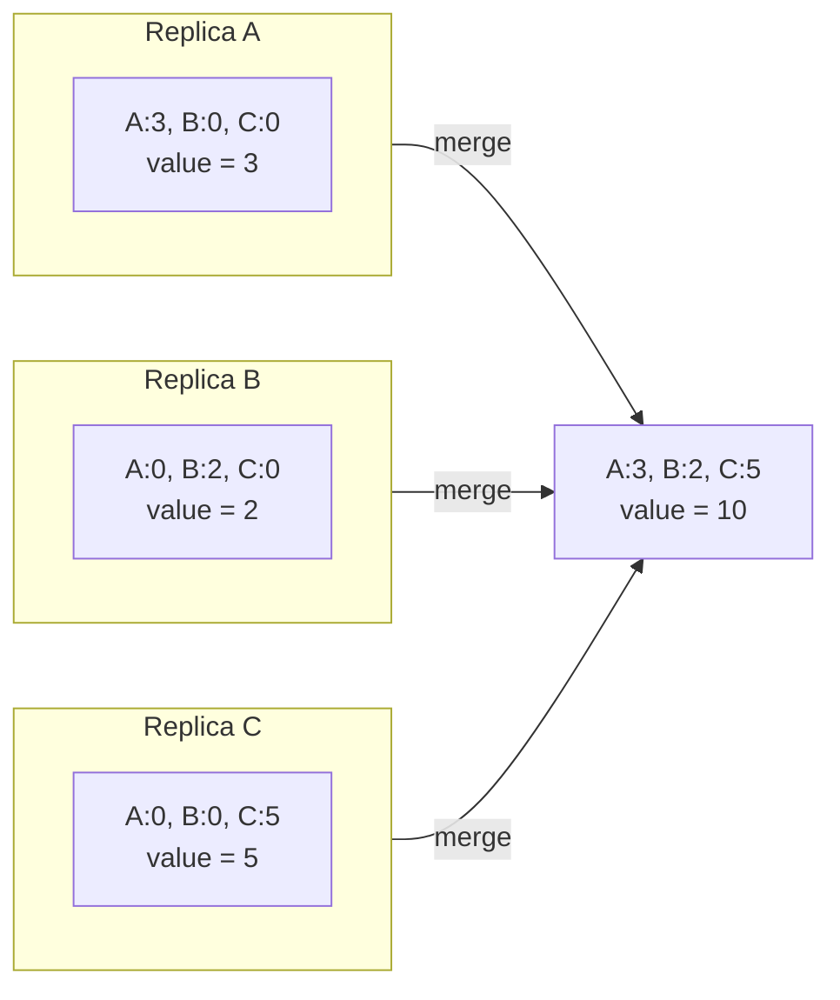
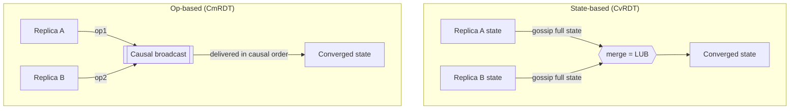
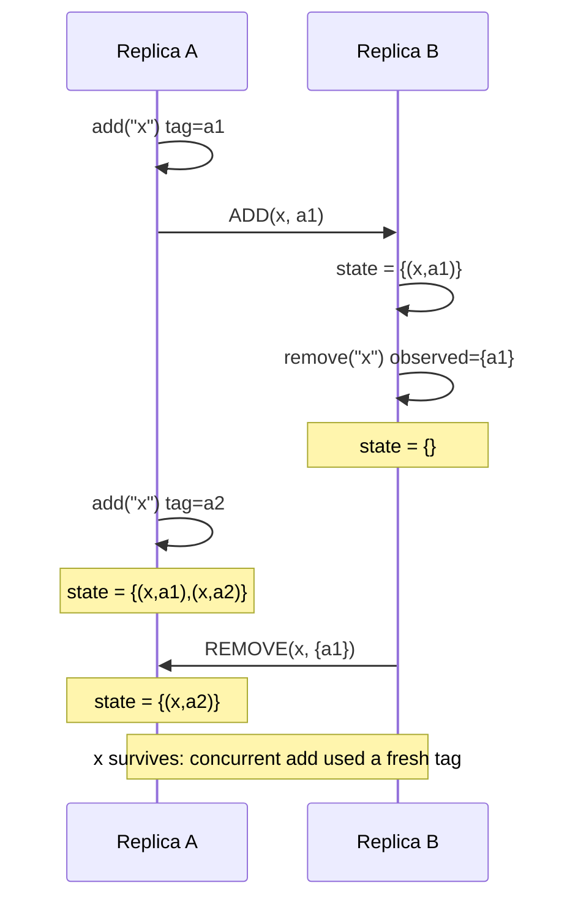
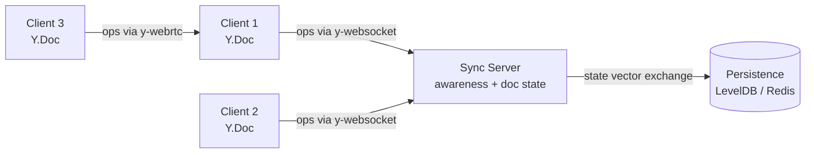

# CRDTs: Conflict-Free Replicated Data Types

> **TL;DR**: A CRDT is a data structure whose replicas can be updated concurrently on different nodes, without coordination, and are mathematically guaranteed to converge once all updates are delivered. This property is called Strong Eventual Consistency (SEC)[^1]. State-based CRDTs (CvRDTs) merge full states via a join-semilattice; op-based CRDTs (CmRDTs) broadcast commutative operations over causal delivery. CRDTs power Redis Enterprise Active-Active, Yjs (~4M npm downloads/week[^2]), and Automerge; Figma's multiplayer engine is CRDT-inspired but uses a centralized server-orders-events approach rather than true CRDTs[^3]. The trade-off: you pay metadata overhead and give up sequential consistency to get availability with zero coordination.

## Learning Objectives

After this module, you will be able to:

- [ ] Distinguish CvRDTs (state-based) from CmRDTs (op-based) and explain when each applies
- [ ] Implement G-Counter, PN-Counter, and OR-Set from first principles
- [ ] Choose a CRDT for a given use case (counters, sets, text, JSON documents)
- [ ] Explain why CRDTs achieve strong eventual consistency without consensus
- [ ] Recognize the costs: metadata growth, tombstones, garbage collection complexity
- [ ] Articulate why LWW-Register silently loses data and when to avoid it

## Intuition

Imagine two accountants in different cities, each keeping a ledger for the same company. Throughout the day, both record transactions independently. At closing time, they call each other and merge their books. If both use a simple rule, "for each account, take the higher balance," they will always agree on the final state without arguing about whose entry came first. No coordinator needed. No lock. No waiting.

Now imagine a collaborative whiteboard. Two designers draw strokes simultaneously. Each stroke gets a unique ID. When the strokes sync, neither erases the other because they are tagged differently. The whiteboard converges to "both strokes present" without conflict resolution logic.

That is the CRDT idea: embed the conflict resolution into the data structure itself, so replicas converge by construction. Where Raft and Paxos pay latency to get linearizability, CRDTs pay metadata and accept weaker ordering to get availability with zero coordination. This is a genuinely different regime from consensus.

## Theory

### Strong Eventual Consistency (SEC)

Plain eventual consistency promises only that replicas will "eventually" converge. It says nothing about what happens when two replicas have received the same set of updates but in different orders. Application developers must write custom conflict resolution, which is error-prone.

SEC closes that gap with a safety guarantee: **any two replicas that have delivered the same set of updates are in identical states**[^1]. No "eventually" qualifier, no application-level merge code. The data type handles it.

Shapiro, Preguica, Baquero, and Zawirski formalized SEC in their 2011 INRIA study[^1] and showed two sufficient conditions:

1. **State-based (CvRDT):** replicas exchange full state and merge using a commutative, associative, idempotent join that forms a join-semilattice. Every update moves the state monotonically upward in the lattice.
2. **Op-based (CmRDT):** replicas broadcast operations via reliable causal delivery, and concurrent operations commute.

Both forms achieve SEC without consensus. Replicas remain available under arbitrary network partitions, meeting AP in the CAP sense[^4].

### State-based CRDTs (CvRDTs)

A CvRDT replica holds a lattice value S. Updates move S upward. Merge takes the least upper bound (LUB) of two states. Because the merge is commutative, associative, and idempotent, replicas converge regardless of message order, duplication, or how many times they merge.

**G-Counter (grow-only counter):** a vector of per-replica monotonic integers. Each replica increments only its own slot. The value is the sum of all slots. Merge takes the elementwise max[^1].

```python
# G-Counter: the canonical state-based CRDT
state = {}  # map<replica_id, int>, all start at 0

def value(s):
    return sum(s.values())

def increment(s, me):
    s[me] = s.get(me, 0) + 1

def merge(a, b):
    return {r: max(a.get(r, 0), b.get(r, 0))
            for r in set(a) | set(b)}
```



*Three replicas increment independently; merge takes the elementwise max, and the global value is the sum of the merged vector.*

**PN-Counter:** a pair (P, N) of G-Counters. Increments go to P, decrements go to N. Value = sum(P) - sum(N). Merge applies G-Counter merge to each half independently[^1].

**G-Set:** grow-only set. Merge = union. You can add but never remove.

**2P-Set:** adds plus a tombstone set for removes. Once removed, an element cannot be re-added. This limitation motivates the OR-Set.

**OR-Set (Observed-Remove Set):** each add tags the element with a unique identifier. A remove only removes the tags the remover has observed. A concurrent add on another replica uses a fresh tag and survives[^1].

> [!TIP]
> If you understand why the G-Counter merge (elementwise max) is a join-semilattice, the rest of the zoo is just variations on the same idea: find a merge function that is commutative, associative, and idempotent.

**Trade-offs of state-based CRDTs:**

- Pro: works over any transport (gossip, TCP, UDP with retries). Duplicates and reordering are harmless.
- Con: shipping full state is expensive as replicas grow. Delta-state CRDTs (Almeida, Shoker, Baquero 2018) fix this by shipping only incremental deltas that still form a semilattice[^5].

### Op-based CRDTs (CmRDTs)

Instead of shipping state, CmRDTs broadcast operations. The middleware delivers operations in causal order, at least once, and exactly once per replica. Because concurrent operations commute, the delivery order for non-causally-ordered pairs does not matter[^1].



*State-based ships whole states over any transport; op-based ships individual operations over a causal-broadcast channel.*

**Op-based OR-Set:** each `add(e)` generates a unique tag. `remove(e)` broadcasts only the tags the remover observed. A concurrent add with a fresh tag is never erased.



*A concurrent add uses a fresh tag, so a prior remove cannot erase it; this is why OR-Sets converge without data loss.*

**Trade-offs of op-based CRDTs:**

- Pro: low bandwidth per update (tens of bytes vs full state). Fine-grained edit history enables undo and time travel[^6][^7].
- Con: requires reliable causal broadcast. In practice that means a backplane (Redis Streams, Kafka, a custom WebSocket fanout, or a peer-to-peer protocol).

### Text and rich collaboration

Collaborative text editing is the hardest CRDT problem. Each character needs a stable identifier so concurrent inserts at the same position converge. The field evolved through multiple generations:

- **WOOT** (Oster et al., 2006): the first text CRDT. Characters have predecessor/successor pointers[^8].
- **Logoot** (Weiss, Urso, Molli, 2009): variable-length position vectors. Suffers interleaving anomalies on concurrent prepends[^9].
- **RGA** (Roh et al., 2011): a causal tree where each insert references an existing character ID. Automerge uses RGA[^10].
- **YATA** (Jahns, 2016): the algorithm behind Yjs. Similar to RGA with a different tie-break for concurrent inserts. Jahns discovered that a flat-list insertion-sort implementation is vastly faster than tree-based approaches[^10][^6].
- **Peritext** (Litt, Lim, Kleppmann, van Hardenberg, 2022): a rich-text CRDT that anchors formatting spans (bold, italic, links) to character operation IDs rather than unstable indexes, so concurrent formatting and edits merge with intent preservation[^11].

The performance gap between implementations is staggering. On the B4 benchmark (259,778 operations, 104,852 final characters)[^12]:

| Library | Apply time | Encoded size | Notes |
|---------|-----------|-------------|-------|
| Yjs 13.6 | 5,714 ms | 159,929 bytes | ~1.5 bytes/char |
| Automerge 2.1 | 14,326 ms | 129,116 bytes | Rust + WASM |
| Automerge 0.14 | ~500,000 ms | ~146 MB | Pure JS, pre-rewrite (on-disk)[^7] |
| Diamond (Rust) | 56 ms | - | 5,196x faster than Automerge 1.0[^10] |

> [!IMPORTANT]
> Do not invent your own text CRDT. The Peritext paper shows that even Notion's pre-Peritext implementation discarded one of two concurrent paragraph edits[^11]. Use Yjs or Automerge.

### Costs and pitfalls of CRDTs

CRDTs are not free. The metadata cost is the primary engineering challenge:

**Tombstones and identifiers.** OR-Sets, RGA, and text CRDTs keep identifiers (and often full operations) forever so that late-arriving removes know what they target. Automerge 0.14 used ~4 KB peak RAM per keystroke on the B4 trace[^7]. Automerge 2.0 reduced on-disk encoding size by 1,135x through columnar compression[^7]. Automerge 3.0 further cut runtime memory by over 10x in general and dramatically more in some cases (pasting Moby Dick: 1.3 MB vs 700 MB in 2.0, ~538x)[^13].

**Garbage collection.** You can only discard metadata for operations that are "causally stable," meaning all replicas have seen them. Determining causal stability requires knowing which replicas exist and what they have received. This is non-trivial in open-membership systems.

**LWW-Register: the CRDT that eats your data.** LWW attaches a timestamp to every write and merge keeps the greatest. Two concurrent writes? One is silently discarded. Clock skew can reverse the "real" order. Kleppmann's local-first essay warns that LWW silently loses data under concurrent writes[^4].

**Delta-state CRDTs** (Almeida, Shoker, Baquero 2018) offer a middle ground: they transmit incremental deltas that are still in the semilattice, giving op-like bandwidth with state-like transport tolerance[^5]. Akka Distributed Data uses this approach in production.

## Real-World Example

**Yjs: the CRDT engine behind AFFiNE, Evernote, GitBook, and Tiptap.**

Yjs is a JavaScript CRDT library that exceeds 4,000,000 npm downloads per week as of May 2026[^2]. It powers collaborative editing in AFFiNE, Evernote, GitBook, Tiptap, Huly, Cargo, JupyterLab, Proton Docs, and dozens of other products[^2][^14]. (Notion, by contrast, uses its own custom block-level conflict resolution system, not Yjs.)

The architecture is deceptively simple. Yjs stores the document as a flat list of items. Each item is `(content, id=[clientID, clock], originLeft, originRight, deleted?)`. On insert, Yjs finds the origin item, scans forward using the YATA conflict rule, and splices the new item in[^10].

The trick that makes it fast: **run-length encoding**. A paste of 1,000 characters becomes one item with length 1,000, not 1,000 items. An in-memory cache of the last edit index makes the common case ("user keeps typing") O(1). Kevin Jahns "wrote and rewrote parts of Yjs 12 times" to hit these performance numbers[^10].

Yjs provides shared types (Y.Map, Y.Array, Y.Text, Y.XmlFragment) and is network-agnostic: connection providers (y-websocket, y-webrtc, y-redis) handle sync without a mandatory server. Delete operations are stored as a compressed bitmap, not per-item tombstones, keeping the "insert then delete same string" document size at 38 bytes[^12].

The result: on the B4 academic-paper editing trace, Yjs encodes 104,852 final characters in 159,929 bytes, roughly 1.52 bytes per character[^12]. The entire library is ~20 KB gzipped. Compare this to Automerge 0.14, whose on-disk encoding for the same document was 146,406,415 bytes (~146 MB), a ~915x size ratio that motivated Automerge's complete rewrite[^7].



*Yjs clients sync via pluggable providers; the server holds document state for persistence and late-joining clients, but the CRDT merge happens on every replica independently.*

## Trade-offs

### Implementation style

| Approach | Pros | Cons | Best when | Our Pick |
|----------|------|------|-----------|----------|
| CvRDT (state-based) | Works over any transport; duplicates harmless | Full state per merge is costly for large structures | Small states, gossip protocols | Start here for simplicity |
| CmRDT (op-based) | Low bandwidth per update; fine history | Needs reliable causal broadcast infrastructure | A backplane (Redis Streams, Kafka) is available | Use when bandwidth matters |
| Delta-state | Small messages + unreliable transport tolerance | Buffering and ack complexity | Large replica state, lossy network | Advanced optimization once state-based hits its bandwidth ceiling |

### Picking a CRDT for your data

| Data type | CRDT | Pros | Cons | Our Pick |
|-----------|------|------|------|----------|
| Counters | PN-Counter | Increment and decrement without coordination | Metadata is O(replicas) per counter | Default choice for multi-writer counters |
| Sets (add/remove/re-add) | OR-Set | Intuitive; concurrent add survives concurrent remove | Tombstones need GC under causal stability | Default choice for sets |
| Registers (single value) | MV-Register (multi-value) | Preserves concurrent writes as siblings the app resolves | App must handle siblings | When losing a concurrent write is unacceptable |
| Rich text / documents | RGA (Automerge) or YATA (Yjs) | Proven rich-text collaboration at scale; character-level merge | Complex internals; DIY implementations are prone to known anomalies (Logoot interleaving, pre-Peritext formatting bugs) | Yjs for performance, Automerge for history; do not roll your own |

## Common Pitfalls

> [!WARNING]
> **Last-writer-wins silently drops concurrent writes.** LWW-Register attaches a timestamp to every write and keeps the greatest on merge. Two replicas accepting writes to the same key within the replication window produce one timestamp-winning write; the other is discarded with no user-visible signal ([Shapiro et al., 2011](https://inria.hal.science/inria-00555588/document); [Kleppmann, "Local-first software," 2019](https://www.inkandswitch.com/essay/local-first/)). Wall-clock skew across nodes can even reverse the "real" order. For collaborative documents, shared files, carts, or anything where a lost write matters, use an OR-Set, an MV-Register that preserves siblings, or an RGA/Yjs/Automerge document instead. Accept LWW only for truly low-stakes fields like `last_seen_at` or ephemeral presence.

> [!WARNING]
> **Rolling your own text CRDT.** Logoot has interleaving anomalies on concurrent prepends. Naive Markdown-based rich text breaks on overlapping bold/italic. The Peritext paper demonstrates that even Notion's pre-Peritext implementation discarded concurrent paragraph edits[^11]. Use Yjs or Automerge.

> [!WARNING]
> **Tombstones with no GC plan.** Documents edited heavily over time become slow to load even if the current visible state is small. Monitor document-size to final-content-size ratio. A healthy Yjs document is ~1.5x the final text; Automerge 0.14 was over 1,000x[^12][^7].

> [!WARNING]
> **Op-based without causal broadcast infrastructure.** CmRDTs assume causal, exactly-once delivery. A raw pub/sub without dedupe is insufficient. Use a broker that provides causal order (Kafka with a single partition per document) or stamp operations with version vectors for dedup and buffering.

> [!WARNING]
> **Naive metadata overhead (10 to 100x data size).** Every keystroke is a permanent record in naive implementations. Run-length encode consecutive inserts (Yjs), use columnar binary formats (Automerge 2.0+), and garbage-collect causally stable entries.

> [!WARNING]
> **Mixing wall-clock timestamps across replicas for LWW.** NTP skew of tens of milliseconds across regions is easy to hit. Use hybrid logical clocks (HLCs) for tie-breaking, not wall-clock timestamps. Better yet, avoid LWW entirely for multi-region multi-writer keys.

## Exercise

**Design the state layer for a collaborative to-do app that works offline.** Users can add, remove, and re-add tasks, mark them done, and edit task text. All changes must merge cleanly when replicas reconnect. Pick CRDTs for each field (title, done flag, assignees, order) and describe the sync protocol.

<details>
<summary>Hint</summary>

Think about what operation each field needs. A task title is text (sequence of characters). A done flag is a boolean that can flip back and forth. Assignees are a set where items can be added and removed. Task order needs a stable position that does not collide. The task list itself needs add and remove with re-add support.

</details>

<details>
<summary>Solution</summary>

**Top-level structure:** a Y.Map (or Automerge document) keyed by task ID.

**Task list membership:** OR-Set semantics. Each task has a unique ID generated client-side. Adding a task inserts the ID; removing it removes only observed tags. Re-adding creates a fresh tag, so it survives concurrent removes.

**Per-task fields:**

| Field | CRDT | Rationale |
|-------|------|-----------|
| `title` | RGA / Y.Text | Character-level merge; two users editing different words never conflict |
| `done` | LWW-Register (with HLC) | Boolean toggle; concurrent flips are rare and low-stakes; last flip wins |
| `assignees` | OR-Set | Users can be added and removed; concurrent add survives concurrent remove |
| `order` | Fractional index (Figma-style) | Each task stores a position between its neighbors; no reindexing needed |

**Sync protocol:**

1. Each client maintains a local Y.Doc (or Automerge doc).
2. On edit, the client applies the operation locally (instant UI response).
3. When online, the client exchanges state vectors with the server via y-websocket.
4. The server computes the delta between the client's state vector and the stored document, sends missing operations.
5. On reconnect after offline, the same state-vector exchange catches the client up. Merge is automatic via the CRDT join.

This design gives offline-first editing with guaranteed convergence. The only field where data can be "lost" is `done` (LWW), but toggling a checkbox is low-stakes enough to accept last-writer-wins.

</details>

## Key Takeaways

- CRDTs give strong eventual consistency without coordination. This is a genuinely different regime from consensus protocols.
- State-based CRDTs (CvRDTs) are easier to ship because they need no causal broadcast. Op-based CRDTs (CmRDTs) are bandwidth-efficient but demand more infrastructure.
- The G-Counter (vector of per-replica counters, merge = elementwise max) is the mental model for all CRDTs: find a join-semilattice.
- Do not invent your own text CRDT. Use Yjs (performance-optimized, 20 KB gzipped) or Automerge (history-preserving, Git-like branching).
- LWW-Register is the CRDT people reach for by accident. It is the one that silently loses data under concurrent writes.
- Tombstones and metadata grow without bound unless you plan for garbage collection under causal stability.
- Production CRDTs (Redis Enterprise Active-Active, Yjs, Automerge) hide CRDT semantics behind familiar APIs. The math is invisible to application developers.

## Further Reading

- [A comprehensive study of Convergent and Commutative Replicated Data Types](https://inria.hal.science/inria-00555588/document) - Shapiro et al. (2011). The foundational paper; read sections 1 to 4 for SEC and the CvRDT/CmRDT duality.
- [Local-first software: you own your data, in spite of the cloud](https://www.inkandswitch.com/essay/local-first/) - Kleppmann et al. (2019). The manifesto that positions CRDTs as the foundation for post-cloud collaboration.
- [5000x faster CRDTs: An Adventure in Optimization](https://josephg.com/blog/crdts-go-brrr/) - Seph Gentle (2021). Performance deep dive showing why implementation beats algorithm; the B4 benchmark explained.
- [How Figma's multiplayer technology works](https://www.figma.com/blog/how-figmas-multiplayer-technology-works/) - Evan Wallace (2019). The best "we looked at CRDTs and built something simpler" writeup; clarifies when you do and do not need full CRDTs.
- [Peritext: A CRDT for Rich-Text Collaboration](https://www.inkandswitch.com/peritext/) - Litt et al. (2022). State of the art in rich-text CRDTs; explains why formatting merge is harder than plain-text merge.
- [Introducing Automerge 2.0](https://automerge.org/blog/automerge-2/) - Ink & Switch (2023). The 275x performance improvement journey from pure JS to Rust + WASM columnar format.
- [Yjs documentation and CRDT benchmarks](https://github.com/dmonad/crdt-benchmarks) - Kevin Jahns. The reference benchmark suite for comparing CRDT libraries head-to-head.
- [Data types for Active-Active databases](https://redis.io/docs/latest/operate/rs/databases/active-active/develop/data-types/) - Redis Enterprise docs. Production CRDT semantics for counters, sets, sorted sets, and JSON behind familiar Redis commands.

## Flashcards

**Q:** What is Strong Eventual Consistency (SEC)?
**A:** Any two replicas that have delivered the same set of updates are in identical states, without requiring coordination. SEC is achieved by CRDTs through commutative merge operations.

**Q:** What are the two families of CRDTs?
**A:** State-based (CvRDT): replicas exchange full state and merge via a join-semilattice. Op-based (CmRDT): replicas broadcast commutative operations over reliable causal delivery.

**Q:** How does a G-Counter work?
**A:** Each replica increments only its own slot in a vector. The value is the sum of all slots. Merge takes the elementwise max across replicas. This is commutative, associative, and idempotent.

**Q:** Why can an OR-Set re-add an element after removal?
**A:** Each add tags the element with a unique identifier. Remove only removes observed tags. A concurrent add on another replica uses a fresh tag that the remove never saw, so it survives.

**Q:** Why is LWW-Register dangerous?
**A:** It silently discards one of two concurrent writes. Clock skew can reverse the "real" order. It is the CRDT that loses data by design.

**Q:** What does delta-state CRDT solve?
**A:** It gives op-like bandwidth (small messages) with state-like transport tolerance (no causal broadcast required). Deltas are still in the semilattice, so correctness is preserved.

**Q:** Why should you not write your own text CRDT?
**A:** Text CRDTs have subtle interleaving anomalies (Logoot), formatting merge failures (pre-Peritext), and performance cliffs (Automerge 0.14 was 5,000x slower than optimized implementations). Use Yjs or Automerge.

**Q:** How does Yjs achieve ~1.5 bytes per character overhead?
**A:** Run-length encoding of consecutive inserts by the same client, compressed delete-set bitmaps instead of per-item tombstones, and a last-edit-location cache for O(1) common-case inserts.

**Q:** What infrastructure does an op-based CRDT require that a state-based one does not?
**A:** Reliable causal broadcast: operations must be delivered in causal order, at least once, and exactly once per replica. This typically requires a backplane like Kafka, Redis Streams, or a custom WebSocket fanout.

**Q:** Name three production systems using CRDT semantics.
**A:** Redis Enterprise Active-Active (OR-Set for sets, PN-Counter for INCR, LWW for strings), Yjs (YATA algorithm powering AFFiNE, Evernote, GitBook, Tiptap), and Riak KV 2.0+ (native counters, sets, maps, registers, flags).

**Q:** What is causal stability and why does it matter for CRDT garbage collection?
**A:** An operation is causally stable when all replicas have received it. Only then can its metadata (tombstones, identifiers) be safely discarded. Determining causal stability requires knowing which replicas exist and what they have seen.

**Q:** How did Automerge 2.0 achieve a 1,135x reduction in on-disk size vs 0.14?
**A:** Columnar compression: grouping same-typed fields (actor IDs, counters, keys, values) across all operations into parallel arrays, then compressing each column with variable-length integer encoding (LEB128).

## References

[^1]: Shapiro, Preguica, Baquero, Zawirski. "A comprehensive study of Convergent and Commutative Replicated Data Types." INRIA Research Report RR-7506, 2011. https://inria.hal.science/inria-00555588/en (full PDF: https://hal.inria.fr/inria-00555588/document)
[^2]: "Yjs in the Wild" (user list) and npm weekly downloads (https://www.npmjs.com/package/yjs; API: https://api.npmjs.org/downloads/point/last-week/yjs reports 4,115,526 for week of 2026-05-01). https://docs.yjs.dev/yjs-in-the-wild
[^3]: Evan Wallace. "How Figma's multiplayer technology works." Figma Blog, October 16, 2019. Figma is "inspired by" CRDTs but explicitly not a true CRDT: "Figma isn't using true CRDTs though. CRDTs are designed for decentralized systems... Since Figma is centralized, we can simplify our system." https://www.figma.com/blog/how-figmas-multiplayer-technology-works/
[^4]: Kleppmann, Wiggins, van Hardenberg, McGranaghan. "Local-first software: you own your data, in spite of the cloud." Onward! 2019. https://www.inkandswitch.com/essay/local-first/
[^5]: Almeida, Shoker, Baquero. "Delta State Replicated Data Types." Journal of Parallel and Distributed Computing, Volume 111, January 2018, pp. 162-173. arXiv:1603.01529. https://arxiv.org/abs/1603.01529
[^6]: Yjs documentation. https://docs.yjs.dev/
[^7]: Ink & Switch. "Introducing Automerge 2.0." January 2023. https://automerge.org/blog/automerge-2/
[^8]: Oster, Urso, Molli, Imine. "Data consistency for P2P collaborative editing" (WOOT). CSCW 2006. https://dl.acm.org/doi/10.1145/1180875.1180916
[^9]: Weiss, Urso, Molli. "Logoot: A Scalable Optimistic Replication Algorithm for Collaborative Editing on P2P Networks." ICDCS 2009. https://doi.org/10.1109/ICDCS.2009.75
[^10]: Seph Gentle. "5000x faster CRDTs: An Adventure in Optimization." July 31, 2021. https://josephg.com/blog/crdts-go-brrr/
[^11]: Litt, Lim, Kleppmann, van Hardenberg. "Peritext: A CRDT for Rich-Text Collaboration." Ink & Switch, Nov 2021; CSCW 2022. https://www.inkandswitch.com/peritext/
[^12]: Kevin Jahns (dmonad). CRDT benchmarks repository (B1-B4, B4x100). https://github.com/dmonad/crdt-benchmarks
[^13]: Ink & Switch. "Automerge 3.0." July 2025. https://automerge.org/blog/automerge-3/
[^14]: Yjs GitHub README (comprehensive user list including AFFiNE, Evernote, GitBook, Tiptap, Huly, Cargo, JupyterLab, Proton Docs). https://github.com/yjs/yjs
