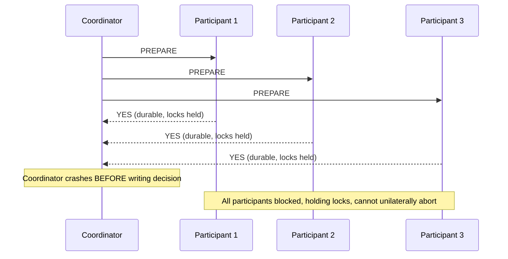
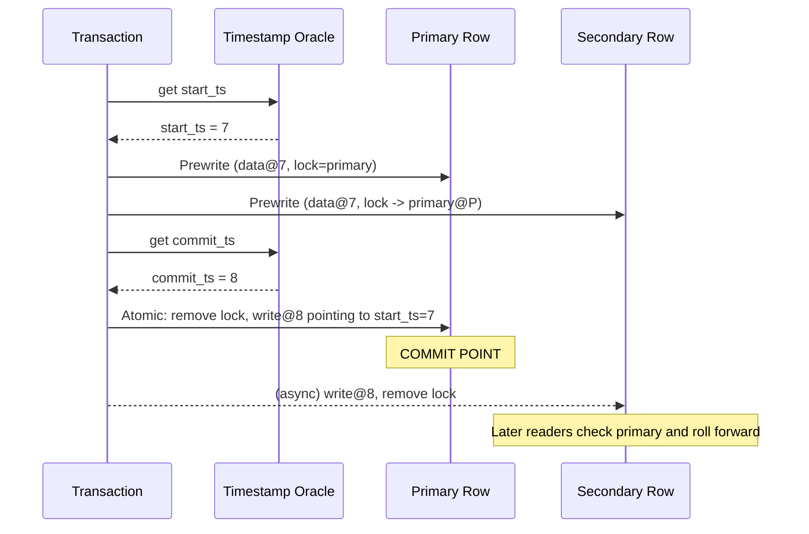
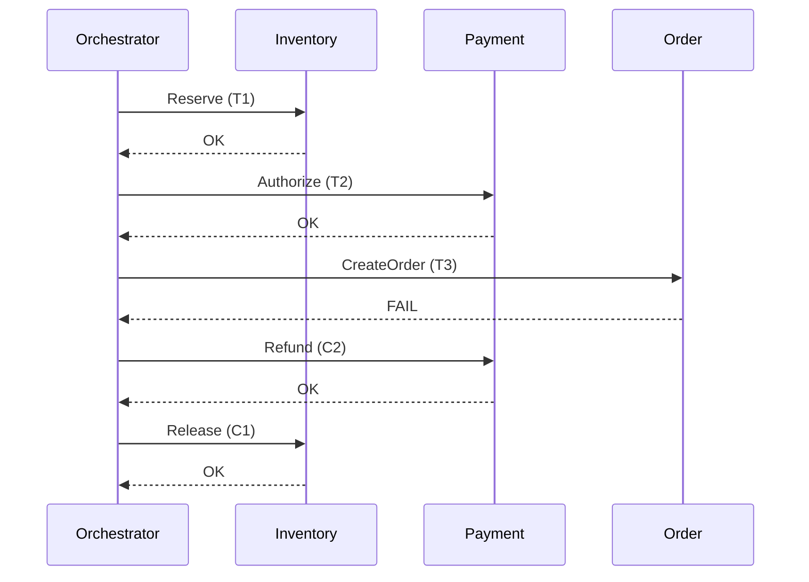
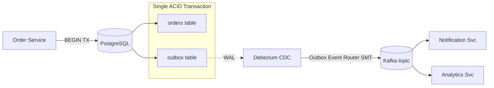

# Distributed Transactions: 2PC, Saga, and When to Avoid Both

> **TL;DR**: When a single business action touches multiple databases or services, you need atomicity across nodes. Two-phase commit (2PC) delivers it but blocks during coordinator failures. Percolator and Spanner layer 2PC on consensus-replicated state to eliminate the blocking problem, at the cost of cross-region latency (~100 ms for Spanner read-write transactions[^1]). Sagas break the big transaction into local ACID steps with compensating actions and are the default for distributed business workflows. The outbox pattern solves the "atomically write DB + publish event" problem without XA. Most distributed transaction problems dissolve under idempotency + eventual consistency + user-visible reconciliation. If you take one thing from this chapter: reach for the outbox and sagas first, 2PC last.

## Learning Objectives

After this module, you will be able to:

- [ ] Walk through 2PC and identify its blocking failure mode
- [ ] Describe Percolator and how it gets snapshot isolation across shards
- [ ] Explain how Spanner and CockroachDB make 2PC non-blocking via consensus
- [ ] Design a saga with compensating actions for each step
- [ ] Implement the transactional outbox pattern for atomic state + event publish
- [ ] Recognize when you actually need a distributed transaction vs eventual consistency

## Intuition

You are closing on a house. The buyer, seller, bank, and title company each have documents to sign. Nobody wants to sign first because if the other parties back out, they are stuck. So everyone signs their documents and hands them to an escrow agent. The agent holds all signatures. Only when every party has signed does the agent release everything simultaneously. If any party refuses, the agent returns all documents and the deal is off.

That is two-phase commit. The escrow agent is the coordinator. "Signing and handing over" is the prepare phase. "Releasing simultaneously" is the commit. The problem: if the escrow agent has a heart attack after collecting all signatures but before releasing them, everyone is stuck holding nothing, unable to proceed or back out.

Now consider a different scenario. You and three friends split a restaurant check. Each person pays their own card independently. If one card declines, that person pays cash or Venmos later. There is no single coordinator holding everything. Each payment is a local transaction. If something fails, you compensate (refund, retry, settle up later). That is a saga: a sequence of independent local transactions with compensating actions on failure.

The rest of this chapter makes both patterns precise, shows you the modern variants, and argues that most of the time you want the restaurant approach, not the escrow approach.

## Theory

### The problem

A distributed transaction requires that a single logical operation touching N independent resource managers commits everywhere or nowhere, despite concurrent access, partial failures, and an asynchronous network[^2].

The canonical example: transfer $100 from account A on shard 1 to account B on shard 2. The intermediate state where money has left A but has not arrived at B must never be durable and never observed. Preserving atomicity across nodes is hard because a participant that has durably prepared its change has no safe local action if the coordinator disappears[^2][^3].

### Two-phase commit

The protocol has two phases[^2]:

1. **Prepare.** The coordinator sends PREPARE to all participants. Each participant durably writes its changes to a log, acquires locks, and votes YES (commit-ready) or NO.
2. **Commit/Abort.** If all participants vote YES, the coordinator logs COMMIT and broadcasts it. Otherwise it broadcasts ABORT. Participants act on the decision and release locks.

The XA specification from The Open Group defines the standard interface (xa_start, xa_prepare, xa_commit, xa_rollback) between a transaction manager and resource managers[^4]. All major RDBMSs and message brokers implement it.

**The blocking problem.** After voting YES, a participant has surrendered its right to abort unilaterally. If the coordinator crashes between collecting all YES votes and writing COMMIT, every participant is stuck: locks held, no authority to proceed or roll back[^2][^3]. Three-phase commit (Skeen) adds an extra round to avoid this, but it assumes bounded message delay and is unsafe under partitions. Nobody runs 3PC in production.

*The coordinator crashes after collecting PREPARE-yes votes, leaving participants prepared and holding locks indefinitely.*

The modern fix is Gray and Lamport's **Paxos Commit** (tech report 2004; ACM TODS 2006): replicate the coordinator's state via consensus so any majority can recover the outcome[^3]. This is exactly what Spanner and CockroachDB do.

### Percolator: snapshot isolation across Bigtable

Google's Percolator (OSDI 2010) layers ACID snapshot-isolation transactions on top of Bigtable using a per-cell lock and a centralized timestamp oracle[^5].

Each logical column is stored as three Bigtable columns: `data` (timestamped value), `lock` (uncommitted lock), and `write` (committed write pointer). A transaction gets a `start_ts` from the oracle, prewrites all cells (writing data and acquiring locks), designates one lock as the **primary**, then gets a `commit_ts` and atomically replaces the primary lock with a write pointer. That single atomic write on the primary row is the commit point[^5][^6].

Secondary locks are resolved lazily: any later reader that encounters a stale lock checks the primary. If the primary was committed, roll forward. If not, roll back. This means no central transaction manager is needed for recovery.

*The atomic transition from "primary lock" to "primary write" is the single commit point; secondaries are resolved lazily by later readers.*

The timestamp oracle serves ~2 million timestamps/sec from a single machine via batching[^5]. Percolator cut average document age in Google's search index by 50% versus the MapReduce system it replaced, with median doc-to-index latency improving ~100x[^5][^7].

**Trade-off:** Percolator deliberately accepts tens-of-seconds tail latency for lock cleanup. Acceptable for web indexing, unacceptable for OLTP. It provides snapshot isolation, not serializability, so write skew is possible[^5][^6].

### Spanner and CockroachDB: 2PC over consensus groups

Google Spanner (OSDI 2012) runs 2PC across Paxos-replicated tablet groups[^1]. Each tablet is a Paxos group spanning multiple data centers. A read-write transaction acquires locks at each involved tablet leader, picks one group as the 2PC coordinator, and runs the protocol where every PREPARE and DECISION are Paxos-replicated log entries. The coordinator cannot block because it is itself a consensus group[^1][^3].

Spanner uses the TrueTime API (GPS receivers + atomic clocks per data center) to assign globally meaningful commit timestamps. Cross-USA read-write transactions take ~100 ms. Read-only transactions skip locks and 2PC entirely, reading from a local replica, and are ~10x faster[^1][^8].

**CockroachDB Parallel Commits** (19.2, November 2019) collapses two sequential Raft rounds into one[^9]. The key insight: a transaction is implicitly committed when its transaction record is in STAGING state and all its in-flight intent writes have Raft-committed. The coordinator pipelines the STAGING record write in parallel with intent writes, so the client sees acknowledgment after one round of consensus instead of two. TPC-C benchmarks show transaction latency scales at 1x inter-node RTT with Parallel Commits versus 2x RTT without[^9]. The protocol was formally verified in TLA+[^9].

**TiDB** inherits the Percolator protocol directly, running it over TiKV (a Raft-replicated key-value store). TiDB Cloud targets < 105 ms P95 transaction latency on Sysbench workloads[^10][^6].

### Sagas: compensating actions instead of distributed locks

A saga (Garcia-Molina and Salem, SIGMOD 1987) models a long-lived transaction as a sequence of local ACID transactions T1..Tn, each paired with a compensating transaction Ci that semantically undoes Ti[^11][^12]. If step k fails, the orchestrator runs C(k-1)..C1 in reverse.

Two coordination styles exist[^13]:

- **Orchestrated saga.** A central orchestrator (state machine) sends commands to each service in order, waits for replies, and drives compensation on failure. Implementations: Temporal (9.1 trillion lifetime actions, 150,000+ actions/sec peak[^14]), AWS Step Functions (Express Workflows advertise up to 100,000 state transitions/sec[^15]; current service quotas list the Express StateTransition bucket as Unlimited[^16]), Netflix Conductor (reported >2.6M process flows in its first year[^17]).
- **Choreographed saga.** Each service subscribes to events from others, runs its local transaction on the trigger, and emits its own event. No central flow owner. Works for 2-3 step flows; becomes unobservable beyond that.

**Sagas lack the "I" in ACID.** This is the single most important thing to understand. Between T1 and T2, another concurrent saga can observe the intermediate state. Every saga bug you will hit in production is an isolation bug[^13]. Countermeasures are domain-specific: semantic locks (reservation rows), commutative updates (deltas instead of read-then-write), pessimistic views (filter "pending" states from user queries).

*Step T3 fails; the orchestrator runs C2 then C1 in reverse to restore semantic consistency.*

### The outbox pattern

The problem: your service writes to its database and then publishes an event to Kafka. If the process crashes between the DB commit and the Kafka publish, the event is lost. If you publish first and the DB write fails, you have a phantom event.

The solution: write the event to an `outbox` table in the same local ACID transaction as the business write. A separate relay process delivers outbox rows to the broker[^18][^19].

Two relay styles:

- **Polling publisher:** periodically SELECT unsent rows and publish. Simple but adds latency.
- **CDC (change data capture):** tail the database's write-ahead log with Debezium or Maxwell. INSERTs into the outbox table become broker messages automatically. Lower latency, preserves per-aggregate ordering[^19].

*One local ACID transaction writes both the business row and the outbox row; Debezium tails the WAL and publishes to Kafka, giving at-least-once event delivery without XA.*

Because CDC delivery is at-least-once, consumers must be idempotent. Track processed event IDs in a local table (INSERT ... ON CONFLICT DO NOTHING). This is covered in depth in [Idempotency and Exactly-Once](./07-idempotency-exactly-once.md).

The outbox pattern is not glamorous. It is the honest answer to "atomically write DB + publish event." If you take one thing from this chapter, it should be this pattern.

### When you do not need distributed transactions

Pat Helland's "Life Beyond Distributed Transactions" (CIDR 2007) argues that systems designed for nearly unbounded scale should reject distributed transactions entirely[^20][^21]. ACID lives inside one entity (one user, one order, one account). All cross-entity interaction is messaging-based, idempotent, and eventually consistent.

Practical restatements:

- **Money transfer** is a ledger append pattern. Each account is its own entity. The transfer is two append-only ledger entries linked by a transfer ID, plus a reconciliation job that verifies conservation of money[^20].
- **Inventory reservation** is a saga: reserve, charge, fulfill. If charging fails, release the reservation.
- **"Book flight + hotel + car"** is a saga with explicit cancellation flows. No 2PC across three travel providers exists or could exist.
- **Analytics pipelines** use idempotent writes keyed by event ID plus eventual consistency.

The design cost is real: idempotency keys, compensations, reconciliation, and user-visible recovery flows are all extra engineering. But the alternative (distributed locks across services) is worse at scale because the failure of any participant stalls commit, and larger systems are more likely to be blocked at any moment[^21].

## Real-World Example

### Temporal: durable execution at trillion-action scale

Temporal is a durable-execution orchestrator that originated as Uber's Cadence (2016) and was forked by its original founders in 2019[^22]. As of February 2026, Temporal Cloud has processed 9.1 trillion lifetime action executions at a peak throughput exceeding 150,000 actions/sec[^14]. Production users include OpenAI, ADP, Yum! Brands, and Block.

**How it works.** A Workflow is durable-executed code (Go, Java, TypeScript, Python). Every invocation of a non-deterministic operation (activity call, timer, signal) is logged to a durable event history. If a worker crashes, a replacement replays the event history to reconstruct local state and resumes from the last recorded decision[^22]. Activities are the steps that call external systems (DB writes, RPCs, payments); they must be idempotent because Temporal retries them at-least-once on timeout.

**Saga orchestration in Temporal** is natural: the workflow code is a for-loop over steps with a try/catch that runs compensations in reverse on failure. Unlike JSON DSL orchestrators (Step Functions, Conductor), branches, loops, and sleeps are expressed in the host language. The trade-off: Step Functions gives you a visual state machine and 1-year execution durability with a 5-minute Express mode for high-throughput; Temporal gives you code-level expressiveness and unbounded execution duration but requires you to run (or pay for) the Temporal server infrastructure.

**The non-determinism trap.** Temporal requires workflows to be deterministic modulo the SDK's `workflow.Now()` and activity calls. If workflow code reads `time.Now()` or a random number directly, replay diverges and the workflow fails with a NonDeterministicError[^22]. This is the most common production pitfall for teams adopting Temporal.

## Trade-offs

The rows below split into two groups: **coordination mechanisms** (Percolator/Spanner-style 2PC over consensus, orchestrated sagas, choreographed sagas) are substitutable choices for a single business action. **Outbox pattern** and **Avoid the problem** are complementary: outbox runs alongside any saga that writes DB + publishes events, and "avoid the problem" is the meta-question you should answer before picking anything else.

| Approach | Pros | Cons | Best when | Our Pick |
|---|---|---|---|---|
| Percolator / Spanner 2PC | Non-blocking coordinator; externally consistent; lock-free reads | Cross-region latency (~100 ms); needs consensus infrastructure | Global databases; multi-region OLTP | Use Spanner/CockroachDB/TiDB |
| Orchestrated saga | Clear flow; observable; retries built in; long-running | Orchestrator as infra dependency; no isolation | Complex business workflows (checkout, onboarding, claims) | **Default for most teams** |
| Choreographed saga | No central coordinator; loose coupling | Unobservable beyond 3 steps; hard to debug | Small, loosely-coupled 2-3 service flows | Small 2-3 step flows where the event graph is already stable |
| Outbox pattern (complementary) | Atomic DB + event publish; no XA; preserves ordering | At-least-once (idempotent consumers required); relay ops overhead | Every event-driven service that writes DB + publishes | **Always pair with any saga step that publishes events** |
| Avoid the problem | Simplest; fastest; highest availability | Requires modeling effort; isolation anomalies | Most "distributed tx" situations; per-entity ACID suffices | Start here. Ask "do I actually need atomicity across these services?" first |

## Common Pitfalls

> [!WARNING]
> **Classic 2PC (XA) blocks on coordinator failure.** A participant that has voted YES has durably prepared its change and holds its locks; it cannot unilaterally abort. If the coordinator crashes between collecting votes and broadcasting COMMIT, every participant stays locked indefinitely ([Gray and Lamport, ACM TODS 2006](https://www.microsoft.com/en-us/research/publication/consensus-on-transaction-commit/); [Dynamo, SOSP 2007](https://www.allthingsdistributed.com/files/amazon-dynamo-sosp2007.pdf)). Across a WAN, classic XA commit latency easily exceeds 200 ms per transaction and a single slow participant stalls all others. If you think you need 2PC, pick one of the alternatives instead: Spanner/CockroachDB/TiDB layer 2PC on consensus so the coordinator cannot block, orchestrated sagas replace locks with compensating actions, and the outbox pattern handles the DB + broker case without XA. Reach for classic XA only in a single data center with two reliable resource managers and an ops team that already runs XA.

> [!WARNING]
> **Compensations that do not semantically undo.** A saga step commits and is externally visible (money charged, email sent). If the compensation for that step was never implemented or is broken, the system stays inconsistent: customer charged, order never created. Require every forward step's PR to include its compensation, tested as a first-class citizen[^23].

> [!WARNING]
> **Choreographed saga without a ledger is impossible to debug.** With no central orchestrator, the only record of saga progress is scattered across service logs and event streams. When step 4 of 6 fails silently, nobody knows the saga is stuck. Use choreography only for 2-3 step flows, or add a saga-state projection that aggregates events into a queryable view.

> [!WARNING]
> **Outbox relay without backoff hammering Kafka.** If the CDC connector stalls and restarts aggressively, it can flood the broker with duplicate publishes or overwhelm it with connection churn. Monitor Debezium's `MilliSecondsBehindSource` metric; alert on lag > SLO; keep WAL retention longer than worst-case relay downtime[^19].

> [!WARNING]
> **Forgetting idempotency in saga compensations.** The orchestrator retries compensations on timeout. A non-idempotent compensation (e.g., issuing a refund without checking if one was already issued) doubles the refund. Every compensation must be idempotent: check before acting, use idempotency keys, and design for at-least-once execution.

## Exercise

Design the checkout flow for an e-commerce site: reserve inventory (inventory service), authorize payment (payment service), create order (orders service), emit shipping event. Pick orchestrated vs choreographed saga, define compensations for each step, and describe what happens when the payment authorization times out after inventory is reserved.

Hint

Think about observability: with 4 steps and 3 compensations, can you debug a stuck flow without a central coordinator? Consider what "payment timeout" means: is the payment captured or not? Your compensation must handle the ambiguous case.

Solution

**Choice: Orchestrated saga.** Four steps with three possible compensation paths is too complex for choreography. You need a single place to query "what state is this checkout in?" and to drive retries and compensations deterministically.

**Steps and compensations:**

| Step | Forward action (Ti) | Compensation (Ci) |
|---|---|---|
| T1 | Reserve inventory (decrement available, increment reserved) | C1: Release reservation (decrement reserved, increment available) |
| T2 | Authorize payment (hold funds on card) | C2: Void authorization (release hold) |
| T3 | Create order (write order record, status=CONFIRMED) | C3: Cancel order (status=CANCELLED, emit cancellation event) |
| T4 | Emit shipping event (publish to fulfillment queue) | No compensation needed (downstream is idempotent and checks order status) |

**Payment timeout scenario:**

1. T1 (reserve inventory) succeeds.
2. T2 (authorize payment) times out. The orchestrator does not know whether the authorization succeeded or failed.
3. The orchestrator queries the payment service for the authorization status (idempotent status check using the original idempotency key).
4. If the authorization succeeded: proceed to T3.
5. If the authorization failed or is unknown after N retries: run C1 (release inventory reservation). Log the saga as FAILED with reason PAYMENT_TIMEOUT.
6. The payment service must support idempotent authorization: if the same idempotency key is retried, it returns the original result rather than creating a duplicate hold.

**Key insight:** The ambiguous timeout is the hardest case. You cannot compensate a payment you are not sure was captured. The solution is always "query, then decide" rather than "assume and compensate blindly." This is why every saga step needs both an idempotent forward action and an idempotent status-check endpoint.

**Implementation:** Use Temporal with a workflow that loops over steps, catches ActivityFailure, and runs compensations in reverse. The workflow's durable event history gives you full observability without building a custom saga-state table.

## Key Takeaways

- 2PC works and is correct, but it is blocking and slow. Reach for it only when no saga is acceptable and both participants are in one data center.
- Percolator-style 2PC layered on a consensus-replicated store is how global databases (Spanner, CockroachDB, TiDB) achieve cross-shard atomicity without blocking.
- CockroachDB's Parallel Commits halve commit latency (1x RTT vs 2x RTT) by pipelining the transaction record write with intent writes[^9].
- Sagas are the default for distributed business workflows. Orchestrators like Temporal handle retries, timeouts, and visibility.
- Sagas lack isolation. Every saga bug you will hit in production is an isolation bug. Design countermeasures per domain.
- The outbox pattern is not glamorous but it is the honest answer to "atomically write DB + publish event." Use CDC (Debezium) for low-latency relay.
- Most distributed transaction problems dissolve under idempotency + eventual consistency + user-visible reconciliation. Start by asking "do I actually need atomicity across these services?" The answer is usually no.

## Further Reading

- [Consensus on Transaction Commit (Gray and Lamport, 2004)](https://www.microsoft.com/en-us/research/publication/consensus-on-transaction-commit/): reframes 2PC as a consensus problem and introduces Paxos Commit as a non-blocking coordinator design; the theoretical foundation for Spanner's approach.
- [Percolator paper (Peng and Dabek, OSDI 2010)](https://research.google/pubs/large-scale-incremental-processing-using-distributed-transactions-and-notifications/): canonical source for snapshot-isolation 2PC over Bigtable; read alongside the TiKV deep-dive for a modern implementation.
- [Spanner: Google's Globally-Distributed Database (OSDI 2012)](https://www.usenix.org/conference/osdi12/technical-sessions/presentation/corbett): 2PC over Paxos groups with TrueTime; the paper that proved externally consistent distributed transactions were possible at global scale.
- [Parallel Commits (CockroachDB, 2019)](https://www.cockroachlabs.com/blog/parallel-commits/): 1x RTT commit via STAGING transaction record with TLA+ verification; essential reading for understanding modern distributed database commit protocols.
- [Life Beyond Distributed Transactions (Helland, CIDR 2007)](https://paperswelove.org/papers/life-beyond-distributed-transactions-an-apostates--a2e1af4d/): the philosophical argument against distributed transactions at scale; entity boundaries, messaging, and idempotency as the alternative.
- [Pattern: Saga (Chris Richardson)](https://microservices.io/patterns/data/saga.html): orchestration vs choreography, isolation countermeasures, and practical implementation guidance for microservices.
- [Reliable Microservices Data Exchange With the Outbox Pattern (Debezium)](https://debezium.io/blog/2019/02/19/reliable-microservices-data-exchange-with-the-outbox-pattern/): reference implementation of the outbox pattern with Debezium CDC and Kafka; includes the Outbox Event Router SMT configuration.
- [DDIA Chapters 7 and 9 (Kleppmann)](https://dataintensive.net/): the most readable textbook treatment of distributed transactions, consensus, and exactly-once semantics; pairs directly with this chapter.

## Flashcards

**Q:** What is the fundamental problem with classic 2PC?
**A:** It is blocking. After a participant votes YES, it cannot unilaterally abort. If the coordinator crashes before broadcasting the decision, all participants hold locks indefinitely, blocking other transactions.

**Q:** How does Paxos Commit (Gray and Lamport) fix the 2PC blocking problem?
**A:** It replicates the coordinator's state via a consensus group. Any majority of coordinator replicas can recover and broadcast the decision, so coordinator failure no longer blocks participants.

**Q:** What is the single commit point in Percolator?
**A:** The atomic transition on the primary row from "lock" to "write pointer." Once the primary's lock is replaced with a write entry, the transaction is committed. Secondaries are resolved lazily by later readers.

**Q:** How does CockroachDB's Parallel Commits reduce latency?
**A:** It introduces a STAGING transaction-record state. The coordinator pipelines the STAGING write in parallel with intent writes, so the client sees acknowledgment after one round of consensus (1x RTT) instead of two sequential rounds (2x RTT).

**Q:** What does "sagas lack the I in ACID" mean in practice?
**A:** Between saga steps Ti and T(i+1), another concurrent saga can observe the intermediate state. This causes isolation anomalies like double-booking or negative inventory. Countermeasures (semantic locks, commutative updates, pessimistic views) are domain-specific.

**Q:** What is the difference between an orchestrated and a choreographed saga?
**A:** Orchestrated: a central coordinator drives the flow, sends commands, and handles compensation. Choreographed: each service reacts to events from others with no central owner. Orchestrated is observable and debuggable; choreographed is loosely coupled but hard to reason about beyond 2-3 steps.

**Q:** What problem does the transactional outbox pattern solve?
**A:** It solves "atomically write to the database and publish an event to a broker." By writing the event to an outbox table in the same local ACID transaction, then relaying it via CDC, you eliminate the failure window between DB commit and broker publish without needing XA.

**Q:** Why must outbox consumers be idempotent?
**A:** Because CDC delivery is at-least-once. Broker restarts, consumer retries, or relay replays can duplicate any message. Consumers must track processed event IDs and skip duplicates.

**Q:** What is Pat Helland's core argument in "Life Beyond Distributed Transactions"?
**A:** At nearly unbounded scale, ACID should live inside one entity (one user, one order). All cross-entity interaction should be messaging-based, idempotent, and eventually consistent. Distributed transactions do not compose well with scale because any participant failure stalls commit.

**Q:** When should you actually use 2PC (XA)?
**A:** Rarely. The main valid use case is coordinating two databases (or a database and a message broker) within a single data center where both participants are reliable and latency is low. For cross-service or cross-region scenarios, use sagas or consensus-backed protocols instead.

**Q:** What is Spanner's cross-USA read-write transaction latency and why?
**A:** Approximately 100 ms. The cost comes from Paxos round trips across data centers plus the commit-wait of 2x TrueTime epsilon for external consistency. Read-only transactions are ~10x faster because they skip locks and 2PC.

**Q:** What happens if a Temporal workflow calls time.Now() directly instead of workflow.Now()?
**A:** On replay, the workflow gets a different time value than was recorded in the event history, causing a NonDeterministicError. All non-deterministic operations must go through the SDK's deterministic APIs or be wrapped in activities.

**Q:** Name three scenarios where you do NOT need a distributed transaction.
**A:** (1) Money transfer: use ledger appends with a reconciliation job. (2) Inventory reservation: use a saga with reserve/charge/fulfill steps. (3) Multi-provider booking (flight + hotel + car): use a saga with explicit cancellation flows.

**Q:** What is the Debezium Outbox Event Router SMT?
**A:** A Single Message Transform that captures CDC events from the outbox table, rewrites the event key to the aggregate ID (preserving per-aggregate partition ordering), routes to a topic named `outbox.event.<aggregatetype>`, and includes the event ID as a Kafka header for consumer-side deduplication.

**Q:** Why is choreographed saga debugging hard?
**A:** With no central orchestrator, the only record of saga progress is scattered across service logs and event streams. When a step fails silently, no single system knows the saga is stuck. You need an explicit saga-state projection or should limit choreography to 2-3 step flows.

## References

[^1]: Corbett et al., "Spanner: Google's Globally-Distributed Database", OSDI 2012. https://www.usenix.org/conference/osdi12/technical-sessions/presentation/corbett
[^2]: Wikipedia, "Two-phase commit protocol". https://en.wikipedia.org/wiki/Two-phase_commit_protocol
[^3]: Jim Gray and Leslie Lamport, "Consensus on Transaction Commit", ACM TODS 31(1), 2006. https://www.microsoft.com/en-us/research/publication/consensus-on-transaction-commit/
[^4]: Wikipedia, "X/Open XA". https://en.wikipedia.org/wiki/X/Open_XA
[^5]: Peng and Dabek, "Large-scale Incremental Processing Using Distributed Transactions and Notifications" (Percolator), OSDI 2010. https://research.google/pubs/large-scale-incremental-processing-using-distributed-transactions-and-notifications/
[^6]: TiKV Project, "Deep Dive TiKV: Percolator". https://tikv.github.io/deep-dive-tikv/distributed-transaction/percolator.html
[^7]: Darsh Shah, "Percolator: Large-Scale Incremental Processing at Google", 2024. https://darshshah.org/blog/2024/09/23/percolator-incremental-processing/
[^8]: MIT 6.5840 Lecture Notes on Spanner, 2024. http://nil.csail.mit.edu/6.5840/2024/notes/l-spanner.txt
[^9]: Nathan VanBenschoten, "Parallel Commits: An atomic commit protocol for globally distributed transactions", CockroachDB blog, Nov 2019. https://www.cockroachlabs.com/blog/parallel-commits/
[^10]: PingCAP, "TiDB Cloud Performance Reference". https://docs.pingcap.com/tidbcloud/tidb-cloud-performance-reference/
[^11]: Hector Garcia-Molina and Kenneth Salem, "Sagas", SIGMOD 1987. https://www.cs.cornell.edu/andru/cs711/2002fa/reading/sagas.pdf
[^12]: Hillel Wayne / Temporal, "Paper Summary: Sagas", 2023. https://dev.to/temporalio/paper-summary-sagas-4bb6
[^13]: Chris Richardson, "Pattern: Saga", microservices.io. https://microservices.io/patterns/data/saga.html
[^14]: Allanah Hughes, "Temporal raises $300M Series D at a $5B valuation", Temporal blog, Feb 2026. https://temporal.io/blog/temporal-raises-usd300m-series-d-at-a-usd5b-valuation
[^15]: Benjamin Smith, "Building cost-effective AWS Step Functions workflows", AWS Compute blog, 2022. https://aws.amazon.com/blogs/compute/building-cost-effective-aws-step-functions-workflows/
[^16]: AWS, "Step Functions service quotas". https://docs.aws.amazon.com/step-functions/latest/dg/limits-overview.html
[^17]: Viren Baraiya and Vikram Singh, "Netflix Conductor: A microservices orchestrator", Netflix TechBlog, Dec 2016. https://netflixtechblog.com/netflix-conductor-a-microservices-orchestrator-2e8d4771bf40 (see also https://github.com/Netflix/conductor)
[^18]: Chris Richardson, "Pattern: Transactional Outbox", microservices.io. https://microservices.io/patterns/data/transactional-outbox.html
[^19]: Debezium Project, "Outbox Event Router transformation (SMT)", Debezium documentation. https://debezium.io/documentation/reference/stable/transformations/outbox-event-router.html
[^20]: Pat Helland, "Life Beyond Distributed Transactions: an Apostate's Opinion", CIDR 2007. https://www.researchgate.net/publication/220988217_Life_beyond_Distributed_Transactions_an_Apostate's_Opinion
[^21]: Papers We Love, "Life Beyond Distributed Transactions". https://paperswelove.org/papers/life-beyond-distributed-transactions-an-apostates--a2e1af4d/
[^22]: Temporal, "How Temporal Transformed Workflow Orchestration from Azure and Uber Roots", 2024. https://temporal.io/blog/building-resilient-workflows-from-azure-to-cadence-to-temporal
[^23]: Airbnb Engineering, "Avoiding Double Payments in a Distributed Payments System". https://web.archive.org/web/20250105181155/https://medium.com/airbnb-engineering/avoiding-double-payments-in-a-distributed-payments-system-2981f6b070bb
