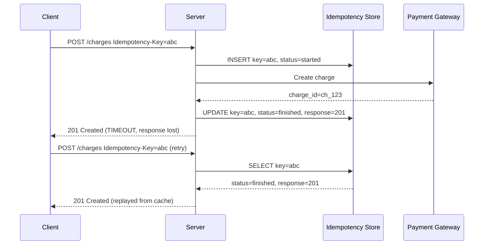
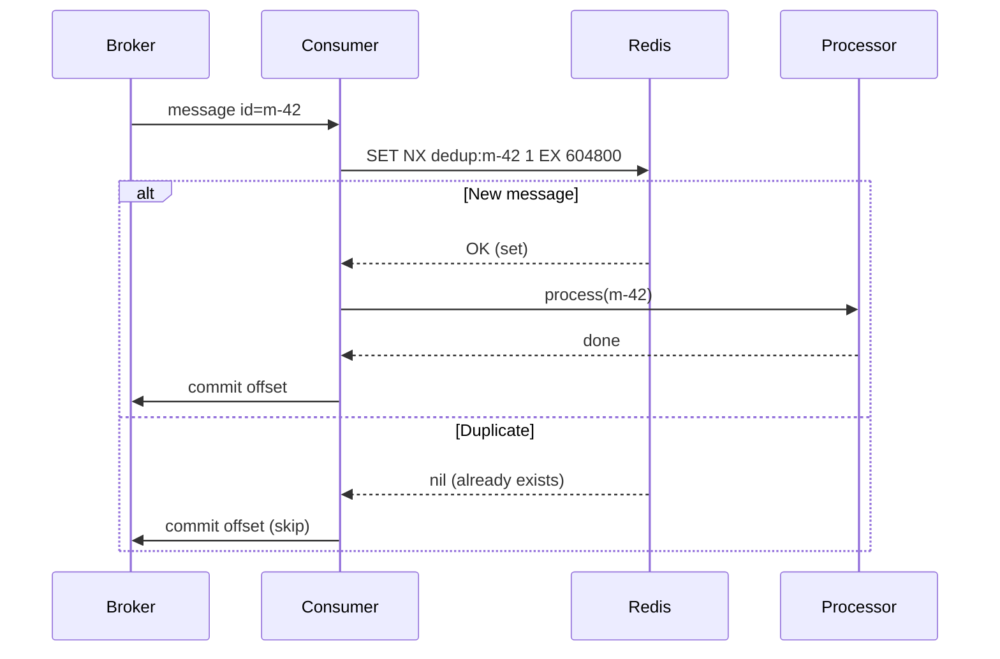
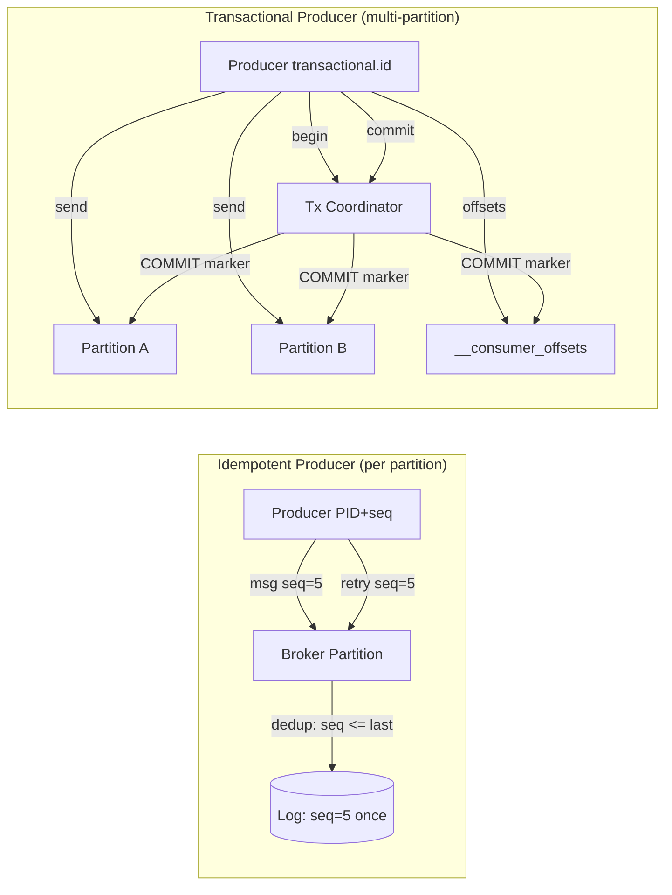
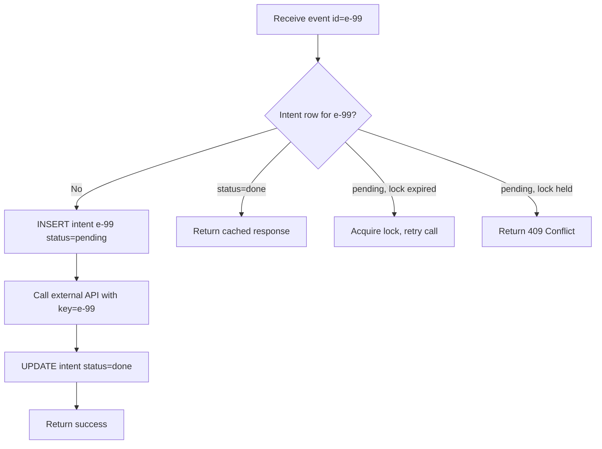

# Idempotency and Exactly-Once: The Honest Truth About Delivery Guarantees

> **TL;DR**: Exactly-once delivery on a network with crashes is impossible. The sender cannot distinguish a lost message from a lost acknowledgement, so it must either retry (risking duplicates) or give up (risking loss)[^1]. What you actually build is at-least-once delivery combined with idempotent processing to achieve "effectively exactly-once." Idempotency keys are the single most valuable pattern for safe APIs: Stripe retains them for 24 hours[^2], Kafka's transactional producer adds only ~3% throughput overhead[^3], and SQS FIFO deduplicates within a 5-minute window[^4]. Every critical endpoint should accept an idempotency key. Kafka's "exactly-once" only covers Kafka-to-Kafka pipelines.

## Learning Objectives

After this module, you will be able to:

- [ ] Explain why at-most-once and at-least-once are the only honest network delivery guarantees
- [ ] Design idempotency keys for HTTP APIs (the Stripe pattern)
- [ ] Implement deduplication at the consumer (message ID store with TTL)
- [ ] Use Kafka's idempotent producer and transactional producer correctly
- [ ] Model "exactly-once side effects" on non-transactional systems (SMS, payments, webhooks)

## Intuition

Two generals sit on opposite hills. They need to coordinate an attack, but every messenger they send through the valley might be captured. General A sends "Attack at dawn." Did General B receive it? A does not know. B sends an acknowledgement back. Did A receive the ack? B does not know. They can send acks of acks forever and never reach certainty.

Now replace the generals with your checkout service and your payment gateway. You submit a charge. The network times out. Did the charge go through? You do not know. If you retry, you might double-charge the customer. If you do not retry, the payment might be lost.

This is the fundamental problem. No protocol can solve it on an unreliable network. What you can do is make retries safe. If the payment gateway recognizes "I already processed this exact request" and replays the original response, your retry is harmless. That is idempotency: applying an operation twice produces the same result as applying it once.

The rest of this chapter teaches you how to build that safety net at every layer of a distributed system.

## Theory

### The Two Generals problem

The Two Generals problem proves that two parties communicating over a lossy channel cannot reach common knowledge of a decision in finite rounds[^1]. When service A sends a request to service B and waits for an acknowledgement, a timeout could mean:

- The request was lost in transit
- B received and processed the request, but the ack was lost
- B crashed after processing
- B is simply slow

A cannot distinguish these cases. To be safe, A retries, which risks duplicate delivery. To avoid duplicates, A can refuse to retry, which risks loss. Tyler Treat's 2015 essay frames this as the core impossibility: "You cannot have exactly-once delivery"[^1].

This gives us the delivery taxonomy:

- **At-most-once**: send and forget. Messages may be lost, never duplicated. (Kafka `acks=0`, UDP fire-and-forget.)
- **At-least-once**: retry until acknowledged. Messages are never lost, but may be duplicated. (The practical default for every production system.)
- **Exactly-once processing**: at-least-once delivery combined with an idempotent consumer, so duplicates produce no visible side effects. This is what Kafka, Pulsar, and Stripe actually provide[^3][^5].

The phrase "exactly-once delivery" is marketing. What exists is exactly-once *processing*.

### Delivery guarantee taxonomy

The distinction between delivery and processing is not pedantic. It determines where you place the deduplication logic:

- **At-most-once** is appropriate for metrics, telemetry, and best-effort notifications where losing a few events is acceptable.
- **At-least-once** is the default for any system where data loss is unacceptable. Every major message broker (Kafka, SQS, RabbitMQ, Pulsar) defaults to this mode.
- **Effectively exactly-once** requires the consumer to be idempotent. The broker delivers at-least-once; the consumer ensures that processing a message twice has the same effect as processing it once.

Apache Pulsar provides "message deduplication" via producer sequence IDs rather than claiming "exactly-once delivery"[^5]. Kafka uses "exactly-once semantics" but the Confluent documentation carefully notes this only covers Kafka-to-Kafka pipelines[^3].

### Idempotency fundamentals

An operation f is idempotent if f(f(x)) = f(x). Applying it twice produces the same observable effect as applying it once.

**Natural idempotency** requires no bookkeeping:

- `PUT /users/42 {name: "Alice"}` replaces the resource regardless of how many times you call it
- `DELETE /orders/99` deletes the order; calling it again returns 404 but changes nothing
- `SET balance = 100` assigns a fixed value; repeating it is harmless

**Non-idempotent operations** need help:

- `POST /charges` creates a new charge per call
- `INCREMENT counter BY 1` changes the total on every retry
- "Send SMS to +1-555-0100" produces a new message each time

HTTP semantics assign idempotency to GET, HEAD, OPTIONS, PUT, and DELETE, but not to POST or PATCH[^6]. When your operation is inherently non-idempotent, you need induced idempotency: a client-provided key that the server uses to deduplicate.

### The idempotency key pattern

The canonical implementation comes from Stripe[^7]. The client generates a unique value (typically a UUIDv4) per logical request and sends it in the `Idempotency-Key` HTTP header. The server stores the tuple (key, request fingerprint, response, status) and replays the stored response on retry instead of re-executing the work.

The IETF draft `draft-ietf-httpapi-idempotency-key-header-07` (October 2025, working-group draft; not yet a finalized RFC) codifies this pattern with specific status codes[^6]:

- `409 Conflict` for concurrent retries on the same key (another request is still in-flight)
- `422 Unprocessable Entity` for a key reused with a different request body
- `400 Bad Request` when a required key is missing

Stripe retains idempotency keys for 24 hours[^2]. A request that returns a `400` error replays the same `400` on retry with the same key; to recover, the client must mint a new key[^2].



*The client retries the same request with the same Idempotency-Key; the server replays the cached response without re-executing the side effect.*

The server stores a request *fingerprint* (hash of method + path + body), not the whole body, to detect reuse with a different payload while keeping storage small[^8]. Brandur Leach's reference implementation adds a `recovery_point` field that supports resumable multi-step workflows: a crashed request resumes from the last completed step rather than replaying all steps[^8].

### Consumer-side deduplication

On the consumer side, you record each message's ID and skip processing if the ID has been seen. Typical stores:

- **Redis SET with TTL**: `SET NX dedup:{msg_id} 1 EX {ttl}`. Fast, bounded memory, language-agnostic.
- **PostgreSQL unique constraint**: `INSERT INTO processed_messages (msg_id) VALUES ($1) ON CONFLICT DO NOTHING`. ACID guarantee, no separate store to operate.
- **Bloom filter**: low-memory approximate dedup. Never produces false negatives (safe), but false positives silently drop legitimate messages. Pair with a ground-truth store for positives.



*Consumer checks a Redis set for the message ID before processing; the TTL must outlive the producer's maximum retry window.*

The critical design decision is TTL sizing. PayPal IPN retries for up to 4 days[^9]. If your Redis TTL is 1 hour, late retries produce duplicates. Size the TTL to at least the producer's maximum retry window. For long-tail scenarios, use a tiered approach: hot Redis with 24-hour TTL plus a PostgreSQL unique index for durable long-tail dedup.

### Kafka exactly-once semantics

As of Kafka 0.11 (KIP-98, 2017), Kafka provides two levels of deduplication[^10]:

**Idempotent producer** (enabled by default since Kafka 3.0[^11]): every producer gets a Producer ID (PID). Each message carries (PID, epoch, sequence number) per partition. The broker rejects a produce if the sequence is not exactly `last_committed + 1` for that (PID, partition), eliminating duplicates caused by producer retries. Throughput penalty: negligible versus at-least-once[^3].

**Transactional producer**: adds a user-supplied `transactional.id` that survives process restarts. The broker writes begin markers, produce RPCs, consumer offset commits via `sendOffsetsToTransaction`, and finally COMMIT or ABORT markers. Consumers using `isolation.level=read_committed` buffer messages until they see the commit marker, then emit[^10].



*Idempotent producer deduplicates retries on a single partition via sequence numbers; transactional producer adds atomic multi-partition writes plus offset commit.*

Key configuration: `transaction.timeout.ms` defaults to 60 seconds, `max.transaction.timeout.ms` to 15 minutes, and `transactional.id.timeout.ms` to 7 days[^10]. Kafka Streams with `processing.guarantee=exactly_once` and a 100 ms commit interval sees 15-30% throughput overhead; with a 30-second commit interval, overhead drops to near zero[^3].

> [!IMPORTANT]
> Kafka's exactly-once covers only Kafka-to-Kafka pipelines. The moment your consumer makes an HTTP call to a payment gateway, sends an SMS, or writes to a database outside the Kafka transaction, the guarantee breaks[^3][^12]. External side effects require their own idempotency mechanism.

### External side effects: the hard part

Any mutation outside your ACID boundary (sending an SMS, charging a card, posting to a webhook) cannot be rolled back. Kafka EOS does not cover it. This is where the **intent-row pattern** comes in[^8]:

1. **Atomic phase 1**: Insert an "intent" row locally (status=pending, idempotency_key=event_id)
2. **External call**: Call the foreign API with an idempotency key the foreign system accepts
3. **Atomic phase 2**: Mark the intent row as done, store the response

On retry, the consumer checks the intent row: if done, skip and replay the cached response. If pending with an expired lock, re-acquire and retry the external call. If pending with a held lock, return 409.



*The intent row is written before the external call; on retry, the consumer checks the intent and either resumes, skips, or re-executes.*

This pattern composes because Stripe, Twilio, Adyen, PayPal, and Square all expose idempotency key mechanisms on their APIs[^6]. You derive a deterministic key from your local event ID (e.g., `payment-intent-{event_id}`) and pass it to the external service. Both sides deduplicate independently.

## Real-World Example

**Stripe's idempotency keys at scale.**

Stripe's public API requires an `Idempotency-Key` header on every mutating POST request. The system has been battle-tested since at least 2015 and forms the foundational safety net for millions of API calls per day[^7].

The server lookup on each request follows this path: load the idempotency key row for `(user_id, idempotency_key)`. If missing, insert with `recovery_point = started` and proceed. If present and `recovery_point = finished`, replay the cached `(response_code, response_body)`. If present and locked by another in-flight request, return `409 Conflict`[^8].

Brandur Leach's reference implementation (`rocket-rides-atomic`) demonstrates the full pattern in PostgreSQL[^8]:

```sql
CREATE TABLE idempotency_keys (
    id              BIGSERIAL   PRIMARY KEY,
    idempotency_key TEXT        NOT NULL,
    user_id         BIGINT      NOT NULL,
    recovery_point  TEXT        NOT NULL,
    locked_at       TIMESTAMPTZ DEFAULT now(),
    request_params  JSONB       NOT NULL,
    response_code   INT         NULL,
    response_body   JSONB       NULL
);
CREATE UNIQUE INDEX ON idempotency_keys (user_id, idempotency_key);
```

The `recovery_point` column acts as a state machine (`started`, `ride_created`, `charge_created`, `finished`). Each step wraps in a `SERIALIZABLE` transaction. If the process crashes between steps, the next retry resumes from the last committed recovery point rather than replaying the entire workflow[^8].

Background jobs are transactionally staged: a `staged_jobs` row is inserted in the same transaction as the domain write. A separate enqueuer process moves staged jobs to the work queue only after the transaction commits. This prevents the "email sent but transaction rolled back" inversion[^8].

Key design decisions that make this work at Stripe's scale:

- **Per-user uniqueness**: the unique constraint is `(user_id, idempotency_key)`, so two different users can reuse the same key value without collision
- **24-hour retention**: keys expire after 24 hours, bounding storage growth[^2]
- **Deterministic downstream keys**: when calling external APIs (card networks, banks), Stripe derives a child idempotency key from the parent (e.g., `stripe-charge-{key_id}`) so the external system also deduplicates

## Trade-offs

| Approach | Pros | Cons | Best When | Our Pick |
|---|---|---|---|---|
| Natural idempotency (PUT, DELETE) | No extra server state; HTTP ecosystem assumes it | Not every operation fits resource replacement | REST-ful resources with client-chosen IDs | Use whenever the operation naturally fits |
| Idempotency keys (client UUID) | Works for any HTTP verb; IETF-standardized; battle-tested at Stripe, Adyen, PayPal | Requires durable server state per key; TTL management; lock on concurrent retry | Financial operations, external API calls, payments | Default choice for any mutating POST |
| Consumer-side dedup (Redis SET) | Simple, language-agnostic, works with any producer | TTL must cover max retry window; extra network hop per message | Async processors with known producer retry bounds | Good for event consumers with bounded retry windows |
| DB unique constraint | ACID guarantee; no separate dedup store | DB becomes dedup bottleneck at high QPS | Critical business events where cost of duplicate exceeds DB load | When you already have a transactional DB in the path |
| Kafka EOS (idempotent + transactional) | Atomic multi-partition writes + offset commit; low overhead (~3%) | Only Kafka-to-Kafka; external side effects still need their own idempotency | Intra-Kafka stream processing pipelines | Use for Kafka Streams apps; pair with intent-row for external calls |

## Common Pitfalls

> [!WARNING]
> **Treating Kafka EOS as end-to-end.** Enabling `processing.guarantee=exactly_once` does not make your HTTP calls to a payment gateway exactly-once. Kafka EOS is atomic only for reads from Kafka, state store updates, and writes back to Kafka. Any external RPC breaks the guarantee[^3][^12]. Use the external system's own idempotency key.

> [!WARNING]
> **Dedup store TTL shorter than producer retry window.** PayPal IPN retries for up to 4 days[^9]. A Redis TTL of 1 hour or even Stripe's 24-hour window will fail on these late retries. Size your TTL to at least the producer's maximum retry window, or use a tiered store (hot Redis + durable DB index).

> [!WARNING]
> **Retrying with a different body under the same key.** If a client sends `Idempotency-Key: abc` with amount=100, then retries with amount=200 under the same key, the server should return `422 Unprocessable Entity`[^6]. Store a request fingerprint (hash of method + path + body) and validate on every retry.

> [!WARNING]
> **Non-cryptographic UUID generation causing collisions.** Using `Math.random()` or a weak seed can produce collisions across concurrent clients. The IETF draft warns that low-entropy keys enable a "data leak" attack where one tenant guesses another's keys[^6]. Use RFC 4122 UUIDv4 (122 bits of entropy, per Section 4.4 of RFC 4122) and namespace keys per tenant: `UNIQUE (user_id, idempotency_key)`.

> [!WARNING]
> **Content-based dedup on non-unique payloads.** SQS content-based deduplication hashes the entire message body. Two legitimate heartbeat events with identical payloads within 5 minutes collide silently[^4]. Use explicit `MessageDeduplicationId` with a monotonic sequence number or UUID per event.

> [!WARNING]
> **Bloom filter false positives eating legitimate requests.** A Bloom filter never produces false negatives (safe for dedup), but false positives silently drop real messages. Acceptable only when paired with a ground-truth store: on a Bloom hit, check the authoritative store before skipping.

## Exercise

You are building a webhook receiver that processes payment notifications from a provider. The provider retries on any non-2xx response for up to 3 days. Your service may crash mid-processing. Design the processing pipeline so that each logical payment is applied exactly once to the user's balance, even with duplicate webhooks, out-of-order delivery, and crashes.

<details>
<summary>Hint</summary>

You need three things: a way to identify duplicate webhooks (the provider includes an event ID), a way to survive crashes mid-processing (atomic writes), and a way to handle out-of-order delivery (version or sequence check on the balance update). Think about what happens if you credit the balance but crash before acknowledging the webhook.

</details>

<details>
<summary>Solution</summary>

**Step 1: Idempotency via intent row.**

Create a `webhook_intents` table with a unique constraint on `(provider, event_id)`:

```sql
CREATE TABLE webhook_intents (
    provider    TEXT NOT NULL,
    event_id    TEXT NOT NULL,
    status      TEXT NOT NULL DEFAULT 'pending',
    locked_at   TIMESTAMPTZ,
    result      JSONB,
    PRIMARY KEY (provider, event_id)
);
```

**Step 2: Atomic processing.**

When a webhook arrives:

1. `INSERT INTO webhook_intents (provider, event_id, status, locked_at) VALUES ('stripe', 'evt_123', 'pending', now()) ON CONFLICT DO NOTHING`
2. If the insert succeeded (new event), proceed. If it conflicted, check status: if `done`, return 200 immediately. If `pending` with expired lock (>5 min), re-acquire and retry.
3. In a single transaction: update the user's balance AND mark the intent as `done`.
4. Return 200 to the provider.

**Step 3: Out-of-order protection.**

Add a `last_event_sequence` column to the user's balance row. Only apply the credit if the incoming event's sequence is greater than the stored value:

```sql
UPDATE balances
SET amount = amount + $credit,
    last_event_sequence = $seq
WHERE user_id = $uid AND last_event_sequence < $seq;
```

If the update affects 0 rows, the event is stale. Mark the intent as `done` (with a "stale" note) and return 200.

**Step 4: Crash recovery.**

If the service crashes after inserting the intent but before completing the transaction, the intent remains in `pending` status. On the provider's next retry (within 3 days), the handler sees `pending` with an expired lock, re-acquires it, and retries the balance update. The unique constraint on `(provider, event_id)` prevents double-crediting even if two instances race.

**Trade-offs accepted:** The `webhook_intents` table grows linearly with events (mitigate with TTL-based archival after 7 days). The serializable transaction on the balance row limits throughput per user (acceptable for payment events, which are low-QPS per user).

</details>

## Key Takeaways

- Exactly-once delivery on a network is impossible. What you build is at-least-once delivery + idempotent processing = effectively exactly-once.
- Idempotency keys are the single most valuable pattern for safe APIs. Every critical mutating endpoint should accept one.
- Consumer-side dedup via a store + TTL handles producer duplicates without changing producers. Size the TTL to the producer's maximum retry window.
- Kafka's exactly-once only covers Kafka-to-Kafka. External side effects (HTTP calls, SMS, payments) always need their own idempotency mechanism.
- The intent-row pattern makes external side effects safe: write intent locally, call externally with a derived key, mark done atomically.
- Design APIs assuming clients will retry. They will. Make retries safe by default.
- Natural idempotency (PUT, DELETE) is free. Use it whenever the operation fits. Reserve idempotency keys for inherently non-idempotent operations (POST /charges).

## Further Reading

- [Designing robust and predictable APIs with idempotency](https://stripe.com/blog/idempotency) (Stripe, 2017) - the canonical engineering post that established the idempotency key pattern; start here if you read nothing else.
- [Implementing Stripe-like Idempotency Keys in Postgres](https://brandur.org/idempotency-keys) (Brandur Leach, 2017) - full working reference implementation with schema, state machine, recovery points, and Ruby code; the best "how to actually build this" resource.
- [Exactly-Once Semantics Are Possible: Here's How Kafka Does It](https://www.confluent.io/blog/exactly-once-semantics-are-possible-heres-how-apache-kafka-does-it/) (Confluent, 2017, updated 2025) - the definitive walkthrough of Kafka's idempotent and transactional producer with throughput benchmarks.
- [KIP-98: Exactly Once Delivery and Transactional Messaging](https://cwiki.apache.org/confluence/display/KAFKA/KIP-98+-+Exactly+Once+Delivery+and+Transactional+Messaging) (Apache, 2017) - the primary design document with full API, configuration, and message-format details.
- [You Cannot Have Exactly-Once Delivery](https://bravenewgeek.com/you-cannot-have-exactly-once-delivery/) (Tyler Treat, 2015) - the blog post that reset the industry's framing; read this to internalize why the impossibility matters.
- [The Idempotency-Key HTTP Header Field](https://www.ietf.org/archive/id/draft-ietf-httpapi-idempotency-key-header-07.html) (IETF draft-07, October 2025) - the emerging standard with status codes, security considerations, and implementation status across Stripe, Adyen, PayPal, and Twilio.
- [Life Beyond Distributed Transactions](https://queue.acm.org/detail.cfm?id=3025012) (Pat Helland, 2007/2016) - the foundational argument for building with idempotent messages instead of distributed transactions; essential reading for anyone designing event-driven systems.
- [Exactly-once processing in Amazon SQS](https://docs.aws.amazon.com/AWSSimpleQueueService/latest/SQSDeveloperGuide/FIFO-queues-exactly-once-processing.html) (AWS) - FIFO deduplication mechanics, the 5-minute window, and content-based vs explicit dedup IDs.

## Flashcards

**Q:** Why is exactly-once delivery impossible on a network with crashes?
**A:** The sender cannot distinguish a lost message from a lost acknowledgement. After a timeout, it must either retry (risking duplicates) or give up (risking loss). This is the Two Generals problem.

**Q:** What is the formula for "effectively exactly-once" processing?
**A:** At-least-once delivery + idempotent consumer = effectively exactly-once. The broker guarantees no message is lost; the consumer guarantees no message is processed twice.

**Q:** What HTTP status code should a server return when an idempotency key is reused with a different request body?
**A:** 422 Unprocessable Entity, per the IETF Idempotency-Key draft. The server stores a request fingerprint and validates it on every retry.

**Q:** How long does Stripe retain idempotency keys?
**A:** 24 hours. After that, the key is reaped and a retry with the same key is treated as a new request.

**Q:** What does Kafka's idempotent producer use to deduplicate retries?
**A:** A Producer ID (PID) and per-partition sequence number. The broker rejects any produce where the sequence is not exactly last_committed + 1 for that (PID, partition).

**Q:** What is the throughput overhead of Kafka's exactly-once features?
**A:** The idempotent producer has negligible overhead. The transactional producer adds ~3% versus at-least-once (acks=all) for 1 KB messages. Kafka Streams at a 100 ms commit interval adds 15-30%, but drops to near zero with a 30-second commit interval.

**Q:** Why does Kafka's exactly-once NOT cover external HTTP calls?
**A:** Kafka EOS is atomic only for reads from Kafka, state store updates, and writes back to Kafka. Any call outside the cluster (HTTP, SMS, database) is a foreign state mutation not inside the Kafka transaction.

**Q:** What is the intent-row pattern for external side effects?
**A:** Insert an intent row locally (status=pending), make the external call with an idempotency key, then mark the intent as done. On retry, check the intent: if done, skip; if pending with expired lock, retry; if locked, return 409.

**Q:** How long is the SQS FIFO deduplication window?
**A:** 5 minutes. A retry within this window is silently deduplicated. A retry after 5 minutes is treated as a new message, so consumer-side idempotency is still needed for worst-case scenarios.

**Q:** Why should idempotency keys be namespaced per user/tenant?
**A:** To prevent cross-tenant collisions. With UNIQUE(user_id, idempotency_key), two users can reuse the same key value without collision, and a malicious actor cannot guess another tenant's keys to trigger a data leak.

**Q:** What is the difference between natural and induced idempotency?
**A:** Natural idempotency requires no bookkeeping (PUT, DELETE, SET). Induced idempotency wraps a non-idempotent operation (POST, INCREMENT) with a client-provided key that the server uses to deduplicate.

**Q:** How long does PayPal IPN retry webhook notifications?
**A:** Up to 4 days. This means any consumer-side dedup store must retain message IDs for at least 4 days, not just minutes or hours.

**Q:** What happens if you replay a Kafka topic from offset 0 with consumer-side dedup enabled?
**A:** If the dedup store still has the old message IDs, all replayed messages are skipped (no work done). If the store has been reaped, all messages are re-processed. Include a replay_generation in the idempotency key namespace to control this behavior.

**Q:** What is a recovery point in the Stripe idempotency pattern?
**A:** A named checkpoint in a multi-step workflow (started, ride_created, charge_created, finished). On crash and retry, the server resumes from the last committed recovery point instead of replaying all steps.

**Q:** When should you use a Bloom filter for deduplication?
**A:** Only when paired with a ground-truth store. Bloom filters never produce false negatives (safe), but false positives silently drop legitimate messages. On a Bloom hit, verify against the authoritative store before skipping.

## References

[^1]: Tyler Treat, "You Cannot Have Exactly-Once Delivery", Brave New Geek, 2015. https://bravenewgeek.com/you-cannot-have-exactly-once-delivery/
[^2]: Stripe, "Advanced error handling" (Idempotency-Key behaviour and retention). https://docs.stripe.com/error-low-level
[^3]: Neha Narkhede, Guozhang Wang, "Exactly-Once Semantics Are Possible: Here's How Kafka Does It", Confluent, 2017 (updated 2025). https://www.confluent.io/blog/exactly-once-semantics-are-possible-heres-how-apache-kafka-does-it/
[^4]: AWS, "Exactly-once processing in Amazon SQS" (5-minute dedup window, MessageDeduplicationId). https://docs.aws.amazon.com/AWSSimpleQueueService/latest/SQSDeveloperGuide/FIFO-queues-exactly-once-processing.html
[^5]: Apache Pulsar, "Messaging" concepts (message deduplication, sequence IDs). https://pulsar.apache.org/docs/next/concepts-messaging/
[^6]: J. Jena and S. Dalal, "The Idempotency-Key HTTP Header Field", draft-ietf-httpapi-idempotency-key-header-07, IETF, October 2025 (working-group draft, not yet a finalized RFC). https://www.ietf.org/archive/id/draft-ietf-httpapi-idempotency-key-header-07.html
[^7]: Stripe Engineering, "Designing robust and predictable APIs with idempotency", Stripe Blog, 2017. https://stripe.com/blog/idempotency
[^8]: Brandur Leach, "Implementing Stripe-like Idempotency Keys in Postgres", brandur.org, 2017. https://brandur.org/idempotency-keys
[^9]: PayPal, "Instant Payment Notification" developer guide (4-day retry window). https://developer.paypal.com/docs/api-basics/notifications/ipn/
[^10]: Apache Software Foundation, "KIP-98 - Exactly Once Delivery and Transactional Messaging", Apache Kafka Wiki, 2017. https://cwiki.apache.org/confluence/display/KAFKA/KIP-98+-+Exactly+Once+Delivery+and+Transactional+Messaging
[^11]: Apache Kafka, "KIP-679: Producer will enable the strongest delivery guarantee by default" (default idempotence enabled). https://cwiki.apache.org/confluence/display/KAFKA/KIP-679:+Producer+will+enable+the+strongest+delivery+guarantee+by+default
[^12]: Conduktor, "Kafka Exactly-Once: When It Works and When It Doesn't", 2025. https://www.conduktor.io/blog/exactly-once-semantics-when-it-works
