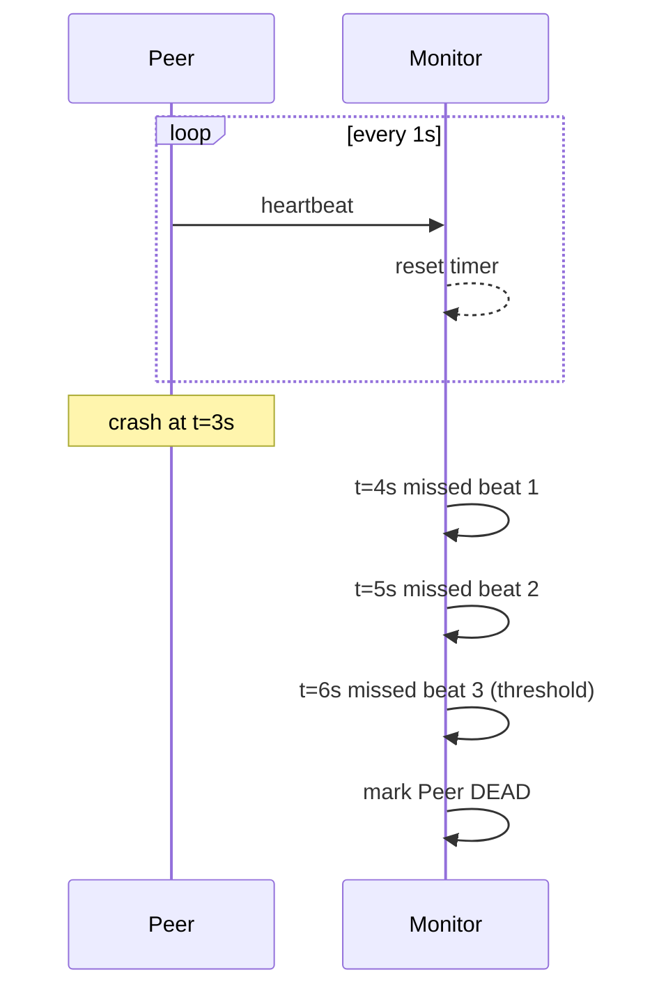
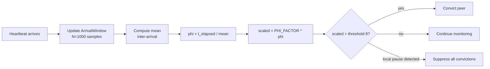
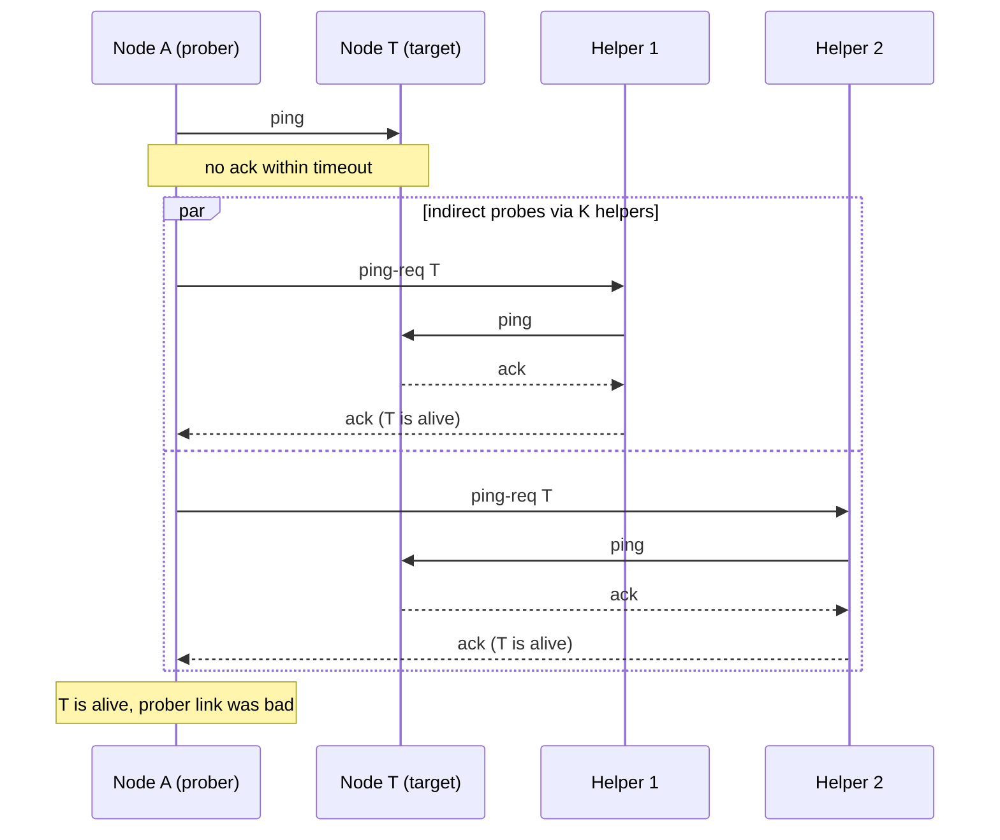
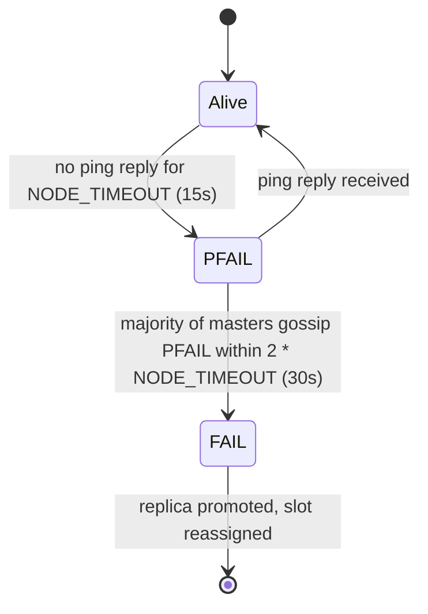

# Failure Detection: Deciding a Node Is Dead

> **TL;DR**: Perfect failure detection is impossible in asynchronous networks. Every detector trades false positives (declaring live nodes dead, triggering unnecessary failovers) against false negatives (missing dead nodes, leaving clients hanging on zombies). Fixed-timeout heartbeats work for stable links. Phi-accrual detectors adapt to observed jitter (Cassandra convicts at phi threshold 8.0, roughly 18 seconds of silence)[^1]. SWIM gossip scales detection to thousands of nodes with O(1) bandwidth per member[^2]. In production, layer these: LB health checks for fast removal from the forward path, cluster-internal detection for membership consensus, and quorum-gated decisions to prevent single-observer false positives.

## Learning Objectives

After this module, you will be able to:

- [ ] Explain why perfect failure detection is impossible in asynchronous systems
- [ ] Design heartbeat intervals and timeouts for your network's p99 latency
- [ ] Describe phi-accrual: probabilistic suspicion that adapts to observed jitter
- [ ] Describe SWIM/Lifeguard gossip-based failure detection and its anti-entropy properties
- [ ] Distinguish LB health checks from cluster membership protocols
- [ ] Avoid flapping through hysteresis, grace periods, and quorum-gated decisions

## Intuition

You call a friend. The phone rings six times, then voicemail. Are they dead? Probably not. They might be in the shower, driving, or ignoring you. You try again in five minutes. Still no answer. Now you are more suspicious, but not certain. You text a mutual friend: "Have you heard from Alex today?" If three friends all say "no contact since yesterday," you start to worry.

This is failure detection. A single missed heartbeat tells you nothing. Repeated silence raises suspicion. Corroboration from independent observers raises it further. But you never reach certainty, because the friend might be on a plane with no signal, perfectly alive but unreachable. Every distributed system faces this exact dilemma: silence is ambiguous, and you must act anyway.

The rest of this chapter gives you the tools to act wisely: how to set timeouts, how to adapt them to observed conditions, how to corroborate suspicion across peers, and how to avoid the operational nightmare of flapping between "alive" and "dead" every few seconds.

## Theory

### Why it is fundamentally hard

In an asynchronous network, there is no upper bound on message delivery delay. A node that has not responded in 5 seconds could be crashed, GC-pausing, partitioned, or alive with its reply still in flight. No local observer can distinguish these cases from a single missed message[^3].

FLP (Fischer, Lynch, Paterson, 1985) sharpens this into an impossibility result: no deterministic protocol can guarantee consensus in an asynchronous system with even one crash failure, because the system cannot reliably tell a crashed process from a slow one[^4].

Chandra and Toueg's 1996 response defines failure detectors as oracles that output a set of suspected peers. They characterize detectors by two properties:

- **Completeness:** every crashed process is eventually suspected.
- **Accuracy:** correct processes are not wrongly suspected (to varying degrees).

They prove that the weakest detector sufficient to solve consensus is "eventually weak" (diamond-W, equivalent to Omega), which guarantees that eventually some correct process is never suspected by any correct process[^5]. The practical takeaway: every production failure detector is a probability judgment. The system around it must tolerate both false positives and false negatives.

### Heartbeats and timeouts

The simplest detector: peer A sends a heartbeat to monitor M every I milliseconds. M declares A dead if no heartbeat arrives within K * I milliseconds.

**Choosing the timeout:**

- Start with your network's p99 RTT plus expected processing jitter.
- Add a safety margin (typically 2-4x the heartbeat interval).
- etcd uses a 100 ms heartbeat interval and a 1,000 ms election timeout (10x the heartbeat), and recommends at least 10x to absorb jitter[^6].
- Kubernetes kubelets update a Lease object every 10 seconds; the node controller declares a node Unknown after 40 seconds of silence (4x the update frequency)[^7].

**The problem:** static timeouts do not adapt. A timeout tuned for normal conditions is too aggressive during a brief latency spike (false positive) and too conservative the rest of the time (slow detection). Linux TCP keepalive defaults to 7,200 seconds (2 hours) before the first probe[^8], which is useless for cluster detection.

*Simple heartbeat detection: the monitor marks a peer dead after K consecutive missed heartbeats, but cannot distinguish a crash from a GC pause or network delay.*

### Phi-accrual detectors

Introduced by Hayashibara, Defago, Yared, and Katayama at SRDS 2004, the phi-accrual detector outputs a continuous suspicion level instead of a binary alive/dead[^9]. Applications choose a phi threshold for their tolerance.

**How it works:**

1. Record the last N inter-arrival times of heartbeats (Cassandra uses N = 1,000)[^10].
2. Compute the mean inter-arrival time from the sample window.
3. On query, compute phi = (time since last heartbeat) / mean interval.
4. Scale by PHI_FACTOR (1 / ln(10) = 0.434) and compare against the threshold.

Cassandra's default `phi_convict_threshold` is 8.0[^1]. With a 1-second gossip interval, a node must be silent for roughly 8 / 0.434 = 18.4 seconds before conviction[^1]. In cloud or cross-DC environments, operators raise the threshold to 10-12 to absorb higher jitter.

**The key advantage:** the same phi = 8 threshold means stricter detection on a stable link (where mean inter-arrival is tight) and more tolerant detection on a jittery link (where mean inter-arrival is wide). The detector self-tunes per peer.

**The GC-pause guard:** Cassandra's `MAX_LOCAL_PAUSE_IN_MS` (default 5,000 ms) prevents a stop-the-world pause on this node from falsely convicting all peers when scheduling resumes[^10]. Without it, a 10-second GC pause would cause every peer's phi to spike simultaneously.

*Cassandra's phi-accrual detector normalizes elapsed silence by observed mean interval; the MAX_LOCAL_PAUSE guard prevents self-inflicted mass convictions after a GC pause.*

### Gossip: SWIM and Lifeguard

SWIM (Scalable Weakly-consistent Infection-style Process Group Membership) was introduced by Das, Gupta, and Motivala at DSN 2002[^2]. Each node, once per protocol period T:

1. Picks a random peer and sends a `ping`.
2. If no ack within a sub-timeout, picks K random helpers and asks them to `ping-req` the target (indirect probe).
3. If both direct and indirect probes fail, marks the target suspect and gossips that state.

Membership updates piggyback on pings and acks, so steady-state bandwidth per node is O(1) in group size. Detection time is independent of cluster size[^2].

**Lifeguard extensions** (Dadgar, Phillips, Currey, HashiCorp 2017)[^11] add three mechanisms:

- **Self-awareness:** Each node tracks a "nack" counter. Missing nacks from helpers imply the local node itself is struggling, so it dampens its own accusations. A tired observer should not accuse others.
- **Dogpile resistance:** The suspicion timeout starts long and shrinks as independent confirmations arrive. Fast failures resolve quickly; single-observer accusations time out.
- **Buddy system:** A suspect node that hears the gossip can immediately broadcast a refutation with a higher incarnation number.

Consul and Serf deploy SWIM + Lifeguard with a 1-second LAN probe interval and roughly 10 seconds from suspicion to dead at defaults[^12]. Lifeguard requires zero operator configuration; it self-tunes based on observed nack rates.

*SWIM's indirect probe filters single-observer false positives: if K helpers can reach the target, the problem is the prober's link, not the target's health.*

### LB health checks vs cluster membership

These solve different problems with different timing:

**LB health checks** optimize for fast removal of a bad target from the forward path. AWS ALB defaults: 30-second interval, 5-second timeout, 2 consecutive failures to mark unhealthy, 5 consecutive successes to return[^13]. They are binary (healthy/unhealthy) and unilateral (the LB decides alone).

**Cluster membership protocols** (Cassandra gossip, Consul SWIM, Redis Cluster bus) optimize for a correct, cluster-wide consensus view. They run on their own intervals, require corroboration, and tolerate slower detection because false positives are expensive (triggering rebalances, replica elections, hinted-handoff storms).

**Passive outlier detection** (Envoy) catches what active probes miss: a node that passes /health but returns 500s on real traffic. Envoy tracks per-upstream success rates and ejects hosts that deviate from the cluster mean by more than a configured standard deviation factor[^14].

> [!IMPORTANT]
> A node can be "healthy" to the LB and "dead" to the cluster, or vice versa. These are independent signals. Do not conflate them.

### Flapping mitigation

Flapping is rapid toggling between alive and dead. Each toggle costs a failover, a client reconnect, or a rebalance. Mitigation strategies:

**Hysteresis:** Different thresholds for going down versus coming back up. ALB uses 2 failures to mark unhealthy but 5 successes to return[^13]. This asymmetry is intentional.

**Grace periods:** Kubernetes `initialDelaySeconds` on probes; Cassandra's `MAX_LOCAL_PAUSE` guard after a stop-the-world pause[^10]. The Kubernetes node controller uses a 40-second grace period before transitioning a node to Unknown[^7].

**Rate limits on state transitions:** Kubernetes evicts pods at 0.1 nodes/second (one node per 10 seconds) and slows further when a zone-wide failure is suspected (>55% of nodes in a zone unhealthy)[^15].

**Quorum-gated decisions:** Redis Cluster requires majority-masters agreement before escalating a local PFAIL to a cluster-wide FAIL. A node marks a peer PFAIL after no reply within `cluster-node-timeout` (15 seconds default). Escalation to FAIL requires that a majority of masters independently report PFAIL within 2 * NODE_TIMEOUT (30 seconds)[^16]. Only FAIL triggers a replica election.

*Redis Cluster's two-phase detection: PFAIL is a local suspicion; FAIL requires majority-masters corroboration, eliminating single-observer false positives at the cost of up to 30 seconds of detection latency.*

## Real-World Example

### Cassandra phi-accrual on a 200+ node cluster

Consider a 200-node Cassandra cluster running JVM workloads with periodic 2-second stop-the-world GC pauses. Without safeguards, here is what happens:

1. Node A pauses for 2 seconds during a G1 mixed collection.
2. On resume, A's failure detector checks every peer. Time since last heartbeat for all peers is now 2+ seconds. With a 1-second mean inter-arrival, phi = 2.0 / 1.0 = 2.0, scaled to 2.0 * 0.434 = 0.87. This is below threshold 8, so a 2-second pause alone does not convict.
3. But if A paused for 10 seconds (a pathological full GC), phi would be 10.0 * 0.434 = 4.34 per peer. Still below 8. However, if the pause coincides with a peer that was already 8 seconds late, the combined elapsed time pushes phi over threshold, and A wrongly convicts that peer.
4. Worse: if A itself stops sending heartbeats during the pause, other nodes see A as silent for 10 seconds. With mean = 1 second, phi = 10 * 0.434 = 4.34 on each observer. Not enough for conviction at threshold 8, but a second missed cycle pushes it over.

**Cassandra's layered defense:**

- **MAX_LOCAL_PAUSE guard:** If the detector's own interpret() loop detects a gap longer than 5,000 ms since its last run, it logs a warning and refuses to convict anyone[^10]. This is the primary defense against self-inflicted mass convictions.
- **Initial interval seeded high:** The arrival window seeds at 2 * gossip interval (2,000 ms), erring conservative because false positives trigger hinted-handoff storms that are worse than slow detection[^10].
- **Tunable threshold:** Operators in cloud environments raise `phi_convict_threshold` from 8 to 10-12, buying more tolerance for jitter at the cost of slower detection[^1].
- **GC tuning:** The real fix is bounding pause times. G1 with `-XX:MaxGCPauseMillis=200` or Shenandoah/ZGC for sub-millisecond pauses eliminates the root cause.

The operational lesson: phi-accrual adapts to network jitter beautifully, but it cannot adapt to local scheduling pauses that affect the detector itself. You need a separate guard for that.

## Trade-offs

### Cluster-internal detection

| Approach | Pros | Cons | Best when | Our Pick |
|---|---|---|---|---|
| Fixed-timeout heartbeat | Simple, predictable, trivial to implement | Does not adapt to jitter; either too aggressive or too conservative | Stable, low-jitter intra-DC links | Baseline for etcd-style tight clusters with known RTT |
| Phi-accrual | Adapts to observed jitter per peer; same threshold works cross-DC | Needs threshold tuning; distributional assumption; vulnerable to local pauses | Clusters with variable latency | **Default for databases** (Cassandra, Akka) |
| SWIM + Lifeguard | Scales to thousands; O(1) bandwidth; self-tunes; decentralized | Eventually consistent membership; more protocol complexity | Large membership services, service discovery | **Default for membership** (Consul, Serf, HashiCorp memberlist) |

### Layered controls (run alongside cluster detection)

| Control | Purpose | Typical defaults | Our Pick |
|---|---|---|---|
| LB active health check (HTTP/TCP) | Remove unhealthy backends from the forward path within seconds | AWS ALB: 30 s interval, 5 s timeout, 2 consecutive failures to mark unhealthy, 5 successes to recover[^13] | Always run at the LB layer; thresholds tighter than cluster-internal timeouts |
| Quorum-gated decisions (PFAIL → FAIL) | Require M independent observers to corroborate a failure before taking expensive action | Redis Cluster: majority of masters must agree within 2 * NODE_TIMEOUT[^16] | Enable when failover is expensive (primary election, resharding) |
| Passive outlier ejection | Detect zombie backends (responding but slow or erroring) by watching traffic | Envoy: eject after configurable consecutive gateway failures or error-rate deviation[^14] | Pair with active health checks to catch gray failures |

## Common Pitfalls

> [!WARNING]
> **TCP keepalive alone is not a failure detector.** The Linux default is 7,200 seconds (2 hours) before the first probe ([tcp(7) man page](https://man7.org/linux/man-pages/man7/tcp.7.html)). Even tuned to seconds, keepalive is point-to-point and provides no cluster-wide view; it tells you one socket is dead, not that a node is dead, and it cannot corroborate with other observers. Use TCP keepalive only to free kernel sockets, and always pair with an application-level detector (phi-accrual, SWIM, or a fixed-timeout heartbeat) that multiple peers agree on.

> [!WARNING]
> **Timeouts shorter than p99 jitter.** If your cross-AZ p99 RTT is 15 ms but spikes to 200 ms during daily load peaks, a 100 ms timeout will false-positive every afternoon. Set timeouts to at least 3-4x your observed p99 under load, not under ideal conditions.

> [!WARNING]
> **Ignoring asymmetric partitions.** Node A can send to B but not receive from B. Standard ping/pong sees one-sided silence; different observers reach different conclusions. SWIM's indirect probes exist specifically to disambiguate this by asking K third parties to cross-check[^2].

> [!WARNING]
> **No hysteresis, causing flap storms.** A node that toggles alive/dead every 30 seconds triggers a failover, a recovery, a failover, a recovery. Each cycle costs client reconnects and data rebalancing. Use asymmetric thresholds (2 failures to go down, 5 successes to come back) and rate-limit state transitions.

> [!WARNING]
> **Conflating LB health checks with cluster membership.** An LB health check answers "should I route traffic here?" A cluster membership protocol answers "is this node part of the ring?" They run on different intervals, use different criteria, and serve different consumers. A node removed from the LB is not necessarily dead to the cluster.

> [!WARNING]
> **Treating zombie nodes the same as dead nodes.** A zombie responds to health checks but serves garbage or extreme latency. Binary detectors miss it entirely. Use passive outlier detection (Envoy's success-rate deviation[^14]) or anomaly detection that compares per-server metrics across the fleet[^17].

## Exercise

Your 200-node Cassandra cluster experiences routine 2-second GC pauses on individual nodes, which currently causes the phi detector to flag them dead and trigger hinted-handoff storms. Design a fix: tune phi, add grace periods, change GC strategy, or switch detection approach. Decide what you would actually change first.

Hint

A 2-second pause with a 1-second mean inter-arrival gives phi = 2 * 0.434 = 0.87, which is well below threshold 8. So the pause alone is not the problem. Think about what happens when a pause coincides with already-elevated phi from normal jitter, or when the pausing node's own detector resumes and sees stale timestamps. The `MAX_LOCAL_PAUSE` guard addresses one of these; what addresses the other?

Solution

**Priority 1: Fix the GC pauses (root cause).**

Switch from CMS or G1 with long pauses to G1 with `-XX:MaxGCPauseMillis=200` or, better, ZGC/Shenandoah for sub-millisecond pauses. A 2-second pause means your GC tuning is broken. No amount of detector tuning fixes a broken JVM.

**Priority 2: Verify MAX_LOCAL_PAUSE is active.**

Cassandra's `MAX_LOCAL_PAUSE_IN_MS` defaults to 5,000 ms. If your pauses are 2 seconds, the guard will not trigger (2,000 < 5,000). This is correct: the guard is for catastrophic pauses (10+ seconds), not routine ones. For 2-second pauses, the phi math (0.87 scaled phi) should not convict. If nodes are being convicted, the real problem is likely compounding: the pausing node misses sending its own heartbeats, and other nodes accumulate silence.

**Priority 3: Raise phi_convict_threshold to 10-12.**

This buys tolerance for the compounding case. At threshold 12, a node must be silent for 12 / 0.434 = 27.6 seconds before conviction. This is a band-aid, not a fix, but it stops the bleeding while you fix GC.

**Priority 4: Rate-limit hinted-handoff storms.**

Even with correct detection, a burst of convictions can overwhelm the hinted-handoff subsystem. Configure `max_hints_delivery_threads` and `hinted_handoff_throttle_in_kb` to bound the blast radius.

**What NOT to do:** Switch to a fixed timeout. You would lose phi-accrual's per-peer adaptation, which is valuable in a 200-node cluster with mixed cross-rack and cross-DC links.

## Key Takeaways

- Perfect failure detection is impossible in asynchronous networks. Every detector chooses between false positives and false negatives.
- Start with heartbeats plus a timeout tuned to 3-4x your observed p99 latency under load. Add phi-accrual or SWIM when scale or variability demands it.
- Phi-accrual adapts to per-peer jitter automatically, but cannot protect against local scheduling pauses. Use a separate pause guard.
- SWIM scales detection to thousands of nodes with O(1) bandwidth per member. Lifeguard's self-awareness prevents degraded observers from falsely accusing peers.
- LB health checks and cluster failure detection serve different purposes with different timing. Do not conflate them.
- Quorum-gated decisions (Redis PFAIL-to-FAIL, Sentinel SDOWN-to-ODOWN) eliminate single-observer false positives at the cost of detection latency.
- Zombie nodes (slow but alive) are often worse than dead nodes. Invest in passive outlier detection, not just binary alive/dead checks.

## Further Reading

- [Unreliable Failure Detectors for Reliable Distributed Systems](https://dl.acm.org/doi/10.1145/226643.226647) - Chandra and Toueg's 1996 paper defining the failure detector hierarchy; won the 2010 Dijkstra Prize and remains the formal foundation for all production detectors.
- [The Phi Accrual Failure Detector](https://www.computer.org/csdl/proceedings-article/srds/2004/22390066/12OmNvT2phv) - Hayashibara et al., SRDS 2004; the original paper behind Cassandra and Akka's adaptive detection.
- [SWIM: Scalable Weakly-consistent Infection-style Process Group Membership Protocol](https://www.cs.cornell.edu/projects/Quicksilver/public_pdfs/SWIM.pdf) - Das, Gupta, Motivala, DSN 2002; the gossip protocol that Consul, Serf, and Nomad implement.
- [Lifeguard: Local Health Awareness for More Accurate Failure Detection](https://arxiv.org/abs/1707.00788) - Dadgar, Phillips, Currey (HashiCorp) 2017; the three extensions that make SWIM production-safe under CPU exhaustion.
- [AWS Builders Library: Implementing health checks](https://aws.amazon.com/builders-library/implementing-health-checks) - Yanacek's operational playbook for shallow vs deep checks, fail-open behavior, and the liveness/dependency split.
- [Redis Cluster specification](https://redis.io/docs/latest/operate/oss_and_stack/reference/cluster-spec/) - The canonical reference for PFAIL/FAIL state machine, gossip protocol, and replica election timing.
- [Impossibility of Distributed Consensus with One Faulty Process](https://dl.acm.org/doi/10.1145/3149.214121) - Fischer, Lynch, Paterson, JACM 1985; the FLP result that proves why failure detection cannot be perfect.
- [etcd Tuning Guide](https://etcd.io/docs/v3.5/tuning/) - Practical guidance on heartbeat/election timeout ratios for Raft-based consensus under varying network conditions.

## Flashcards

**Q:** Why is perfect failure detection impossible in asynchronous networks?
**A:** There is no upper bound on message delay, so a monitor cannot distinguish a crashed node from a slow one. FLP proves no deterministic protocol can solve consensus with even one crash failure under these conditions.

**Q:** What two properties does Chandra and Toueg's framework use to characterize failure detectors?
**A:** Completeness (every crashed process is eventually suspected) and accuracy (correct processes are not wrongly suspected, to varying degrees).

**Q:** What is Cassandra's default phi_convict_threshold and what does it mean in practice?
**A:** Default is 8.0. With a 1-second gossip interval, a node must be silent for roughly 18.4 seconds (8 / 0.434) before conviction.

**Q:** How does SWIM's indirect probe prevent false positives from a single bad link?
**A:** When a direct ping fails, the prober asks K random helpers to ping-req the target. If helpers reach the target, the problem is the prober's link, not the target's health.

**Q:** What are Lifeguard's three extensions to SWIM?
**A:** Self-awareness (degraded nodes dampen their own accusations), dogpile resistance (suspicion timeout shrinks only as independent confirmations arrive), and buddy system (suspects can immediately refute with a higher incarnation number).

**Q:** What is the difference between Redis Cluster's PFAIL and FAIL states?
**A:** PFAIL is a local suspicion (one node's view after NODE_TIMEOUT of silence). FAIL requires majority-masters agreement within 2 * NODE_TIMEOUT and triggers replica election.

**Q:** Why does Cassandra have a MAX_LOCAL_PAUSE guard in its failure detector?
**A:** A stop-the-world GC pause on the detecting node makes all peers appear late when scheduling resumes. The guard detects the local pause and suppresses all convictions to prevent mass false positives.

**Q:** What is the key difference between LB health checks and cluster membership detection?
**A:** LB health checks optimize for fast removal from the forward path (seconds, unilateral). Cluster membership optimizes for correct consensus view (slower, corroborated, conservative). They serve different consumers and should not be conflated.

**Q:** What is flapping and how do you prevent it?
**A:** Flapping is rapid toggling between alive and dead states. Prevent with hysteresis (asymmetric thresholds), grace periods, rate-limited state transitions, and quorum-gated decisions.

**Q:** What is the Kubernetes node-monitor-grace-period and why is it 40 seconds?
**A:** It is the time the node controller waits after the last kubelet heartbeat before marking a node Unknown. At 40 seconds (4x the 10-second update frequency), it tolerates up to 3 missed heartbeats before reacting.

**Q:** Why are zombie nodes often worse than dead nodes?
**A:** Dead nodes are quickly detected and failed over. Zombies pass health checks but serve garbage or extreme latency, poisoning every request routed to them without triggering binary detectors.

**Q:** What does Kubernetes do when >55% of nodes in a zone appear unhealthy?
**A:** It assumes a zone partition or control-plane problem rather than mass node death, and slows or stops pod eviction to prevent cascading failure from a false-positive storm.

**Q:** How does Envoy's passive outlier detection differ from active health checks?
**A:** Active checks probe a /health endpoint on a fixed interval. Passive outlier detection tracks real-request success rates per upstream and ejects hosts whose error rate deviates from the cluster mean, catching failures that active probes miss.

**Q:** What is the recommended ratio between etcd's heartbeat interval and election timeout?
**A:** At least 10x. Default is 100 ms heartbeat, 1,000 ms election timeout. This absorbs network jitter and disk fsync latency without triggering spurious elections.

**Q:** What happens when an AWS ALB marks all targets unhealthy?
**A:** It fails open: routes traffic to all targets anyway. This prevents a buggy health check from taking the entire fleet to zero healthy, but means all requests hit unhealthy backends.

## References

[^1]: Brian Stark (Digitalis), "Understanding phi_convict_threshold in Apache Cassandra", 2025. https://digitalis.io/post/understanding-phi-convict-threshold-in-apache-cassandra-a-deep-dive-into-failure-detection
[^2]: Abhinandan Das, Indranil Gupta, Ashish Motivala, "SWIM: Scalable Weakly-consistent Infection-style Process Group Membership Protocol", DSN 2002. https://www.cs.cornell.edu/projects/Quicksilver/public_pdfs/SWIM.pdf
[^3]: Tushar Deepak Chandra and Sam Toueg, "Unreliable failure detectors for reliable distributed systems", Journal of the ACM 43(2):225-267, 1996. https://dl.acm.org/doi/10.1145/226643.226647
[^4]: Michael J. Fischer, Nancy A. Lynch, Michael S. Paterson, "Impossibility of distributed consensus with one faulty process", JACM 32(2):374-382, 1985. https://dl.acm.org/doi/10.1145/3149.214121
[^5]: Chandra and Toueg, "Unreliable failure detectors for reliable distributed systems", defines completeness/accuracy and the hierarchy; Chandra, Hadzilacos, and Toueg (1996) prove eventually-weak / Omega is the weakest for consensus. https://dl.acm.org/doi/10.1145/226643.226647
[^6]: etcd documentation, "Tuning" (heartbeat interval 100 ms, election timeout 1000 ms). https://etcd.io/docs/v3.5/tuning/
[^7]: Kubernetes documentation, "Nodes" concept page, Node heartbeats and Rate limits on eviction sections. https://kubernetes.io/docs/concepts/architecture/nodes/
[^8]: Linux kernel documentation, `tcp(7)` man page, `tcp_keepalive_time` (default: 7200 seconds). https://man7.org/linux/man-pages/man7/tcp.7.html
[^9]: Naohiro Hayashibara, Xavier Defago, Rami Yared, Takuya Katayama, "The Phi Accrual Failure Detector", SRDS 2004. https://www.computer.org/csdl/proceedings-article/srds/2004/22390066/12OmNvT2phv
[^10]: Apache Cassandra source code, `src/java/org/apache/cassandra/gms/FailureDetector.java`. https://github.com/apache/cassandra/blob/trunk/src/java/org/apache/cassandra/gms/FailureDetector.java
[^11]: Armon Dadgar, James Phillips, Jon Currey, "Lifeguard: Local Health Awareness for More Accurate Failure Detection", arXiv:1707.00788, 2017. https://arxiv.org/abs/1707.00788
[^12]: HashiCorp memberlist, `DefaultLANConfig()` in `config.go` (ProbeInterval: 1s, SuspicionMult: 4). https://github.com/hashicorp/memberlist/blob/master/config.go
[^13]: AWS documentation, "Health checks for Application Load Balancer target groups". https://docs.aws.amazon.com/elasticloadbalancing/latest/application/target-group-health-checks.html
[^14]: Envoy Proxy documentation, "Outlier detection". https://www.envoyproxy.io/docs/envoy/latest/intro/arch_overview/upstream/outlier
[^15]: Kubernetes documentation, "Nodes" concept page, Rate limits on eviction section. https://kubernetes.io/docs/concepts/architecture/nodes/
[^16]: Redis, "Redis cluster specification", sections on Failure Detection and Heartbeat/gossip messages. https://redis.io/docs/latest/operate/oss_and_stack/reference/cluster-spec/
[^17]: Yanacek, "Implementing health checks", covers liveness/local/dependency/anomaly tiers and fail-open behavior. https://aws.amazon.com/builders-library/implementing-health-checks
