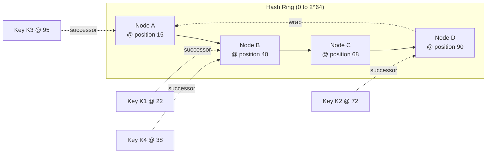
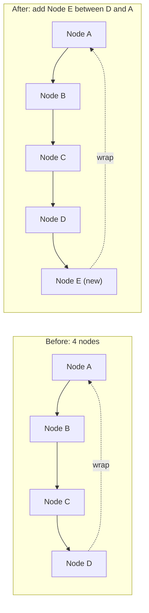
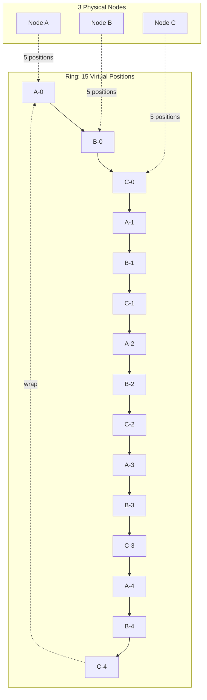
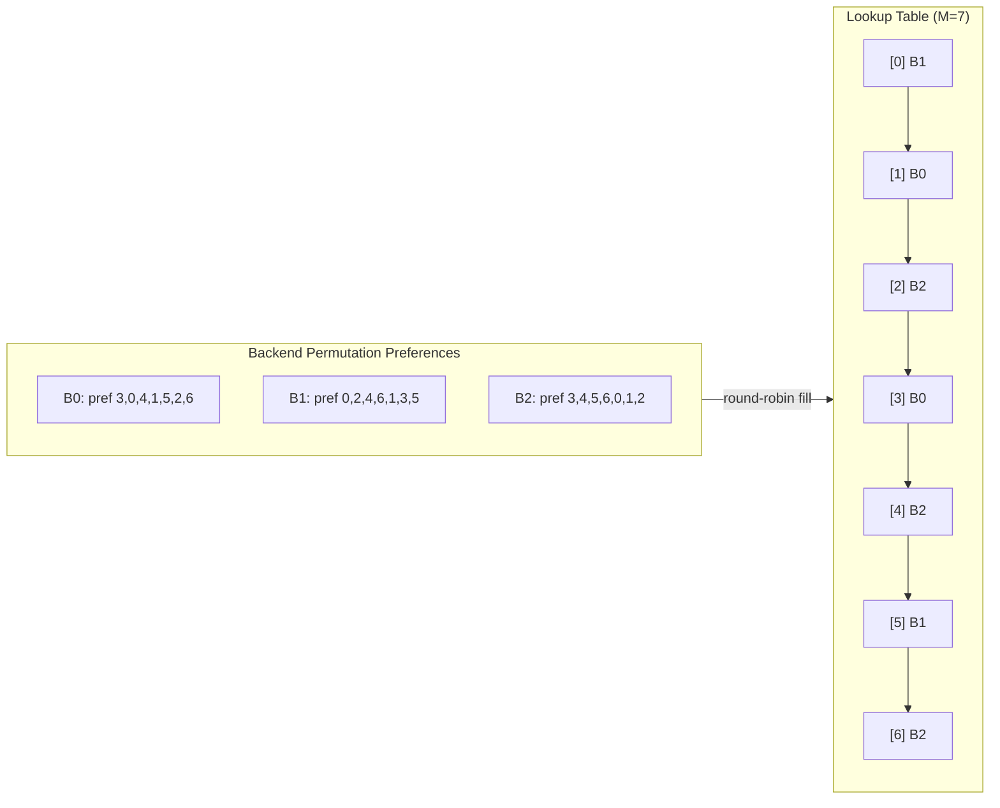

# Consistent Hashing: Keys to Nodes Without Global Reshuffles

> **TL;DR**: Consistent hashing maps keys to nodes so that adding or removing a node moves only ~1/N of keys, not nearly all of them.[^1] Virtual nodes are mandatory at real scale to smooth load variance from ~100% down to ~10% standard deviation at V=100.[^2] Bounded-load consistent hashing caps any single node at c times the average, eliminating hot-node cascades. Rendezvous hashing is simpler for small N. Maglev hashing gives O(1) lookup for L4 load balancers at 10 Gbps line rate.[^3] Pick the variant that matches your constraints on memory, lookup time, and arbitrary-node removal.

## Learning Objectives

After this module, you will be able to:

- [ ] Place keys on a hash ring and find the owning node via successor lookup
- [ ] Explain why virtual nodes are needed for even load distribution
- [ ] Implement bounded-load consistent hashing to cap per-node imbalance
- [ ] Compare ring-based consistent hashing with rendezvous hashing (HRW)
- [ ] Choose between ring hash, Maglev, jump hash, and HRW for a given workload
- [ ] Apply consistent hashing to caches, sharded databases, and sticky load balancing

## Intuition

Imagine a roulette wheel with four numbered pockets. Each pocket represents a server. You spin a ball (the key) and it lands in a pocket. Simple, predictable.

Now the casino adds a fifth pocket. With modulo hashing, you would renumber every pocket and re-spin every ball. Nearly every ball lands somewhere new. Gamblers riot.

With consistent hashing, you slide the new pocket into the wheel between two existing ones. Only the balls that would have landed in that specific gap move to the new pocket. The rest stay put. One-fifth of the balls move, not four-fifths.

Virtual nodes are like giving each server multiple pockets scattered around the wheel instead of one contiguous wedge. If a server goes down, its scattered pockets distribute their balls to many different neighbors rather than dumping everything on a single successor.

This is the entire value proposition: when the node set changes, most keys stay where they are. The rest of this chapter unpacks the six major variants and when to use each.

## Theory

### Why modulo hashing breaks

The simplest key-to-node mapping is `node = hash(key) % N`. It is uniform, O(1), and requires zero state. It works perfectly when N never changes.

The moment N changes, nearly everything moves. Scaling a memcached fleet from 9 to 10 nodes remaps approximately 9/10 of all keys.[^4] Richard Jones at Last.fm described this failure mode when introducing the Ketama library: "everything hashed to different servers, which effectively wiped the entire cache."[^4] The backing database absorbs a cold-cache storm of the full request rate simultaneously.

For sharded databases, the same arithmetic means moving ~90% of all data on a single topology change. This is not an edge case. It is the expected behavior of modulo hashing under any membership change.

Use modulo hashing only when N is fixed and known at compile time: parallel worker bucketing, in-memory lock tables, static shard counts that never grow.

### The hash ring (Karger 1997, successor lookup)

Karger et al. introduced consistent hashing at STOC 1997.[^1] The idea: map both keys and nodes onto a ring of integers `[0, 2^m)`. Each key belongs to the first node encountered clockwise from its hash position.



*Each key walks clockwise to the first node it encounters; Node B owns keys in the arc from A's position to B's position.*

**Lookup:** Binary-search the sorted array of node positions for the smallest position >= key hash. Wrap to position 0 if the key hash exceeds all node positions. This is O(log(V * N)) where V is virtual nodes per physical node.

**Key property:** Adding a node steals only the arc between it and its predecessor. Expected fraction of keys moved: 1/N.[^1] Removing a node hands its arc to its successor. All other keys stay put.

The 1997 paper proved that with high probability each node receives O((log N)/N) fraction of keys. But with only one hash point per physical node, the variance is large. This is why virtual nodes are mandatory in practice.



*Adding Node E between D and A steals only the arc from D to E; all keys owned by A, B, and C stay put. Expected fraction of keys moved: 1/N.*

### Virtual nodes (Ketama, Cassandra 256 default, heterogeneous capacity)

Without virtual nodes, each physical node owns one contiguous arc. Arc lengths are highly non-uniform. Worse, when a node fails, its entire arc dumps onto a single successor, potentially overloading it and triggering a cascade.

Virtual nodes solve both problems. Hash each physical node V times onto the ring (e.g., `nodeA-0`, `nodeA-1`, ..., `nodeA-V`). Now each physical node's load is the sum of V small arcs scattered around the ring. Failure distributes load to V different successors instead of one.



*Each physical node maps to V virtual positions scattered around the ring; on failure, load spreads to V different successors rather than one.*

**Practical numbers:**

- Ketama (libketama) hashes each server 40 times with MD5, extracting 4 points per digest, yielding 160 ring points per server.[^5]
- Cassandra's default `num_tokens` was 256 in versions 2.x through 3.x. Starting with Cassandra 4.0, the default is 16 with the token allocation algorithm.[^6][^7]
- Damian Gryski's simulations show standard deviation of ~10% at V=100 and ~3.2% at V=1000.[^2]

**Heterogeneous capacity:** Give bigger machines more virtual nodes. Envoy's ring-hash load balancer gives a weight-2 host twice as many ring entries as weight-1.[^8]

> [!IMPORTANT]
> **More vnodes is not always better.** Cassandra lowered its recommended `num_tokens` from 256 to 16 because many vnodes per physical node means more ring neighbors, raising the probability of correlated unavailability under multi-node failures.[^6]

### Bounded-load variant (Mirrokni 2016, capacity cap c)

Classic consistent hashing balances keys, not requests. If 50% of traffic targets one key, that key's node sees 50% of traffic regardless of how many virtual nodes you have.

Bounded-load consistent hashing adds a hard capacity cap: each node accepts at most `c * (total_load / N)` requests, where c > 1 is the balancing factor (typically 1.25 to 2). When a key's preferred node is full, probe clockwise to the next node with capacity.[^10][^9]

Mirrokni, Thorup, and Zadimoghaddam proved that each insertion or deletion causes only O(1/e^2) key movements (where e = c - 1), independent of N or total keys.[^9] At e = 0 the algorithm degenerates to least-loaded; as e approaches infinity it becomes plain consistent hashing.

The algorithm preserves cache locality: for the same preferred host, the same fallback sequence is used on overflow. This means a hot key's overflow traffic still benefits from caching on a predictable set of nodes.

### Rendezvous / HRW hashing (O(N) lookup, simpler for small N)

Rendezvous hashing (Thaler and Ravishankar, 1996) predates Karger's ring by a year.[^11] For a key k, compute `h(k, node_i)` for every node i and assign k to `argmax_i h(k, node_i)`. No ring. No virtual-node table. No preprocessing.

**Trade-offs:**

- O(N) per lookup, but the inner loop is tight: one XOR and a cheap integer hash (xorshift-multiply) per node. For N up to ~1000, this is competitive with ring-hash binary search.[^2]
- Adding a node: only keys whose new hash beats the current owner's move (probability 1/N). Disruption is provably minimal.[^12]
- Weighted HRW scales each score by `-weight / log(h)` so weights compose cleanly.[^12]

**Production users:** GitHub's load balancer, Apache Ignite, Apache Druid, Tahoe-LAFS, IBM Cloud Object Storage, and Apache Kafka clients.[^12]

Use rendezvous hashing when N is small (under ~1000), you want zero preprocessing, and you value implementation simplicity over lookup speed.

### Maglev hashing (connection-consistent L4 LB, lookup table)

Google's Maglev (NSDI 2016) builds a fixed-size lookup table of size M (a prime, typically 65,537).[^3] Each backend fills in its preferred slots via a permutation sequence until the table is full. At lookup time: hash the 5-tuple, index into the table. O(1).



*Each backend claims its most-preferred empty slot in round-robin turns; lookup is a single array index into the filled table.*

**Performance:** Maglev saturates a 10 Gbps link with small packets on a single commodity server.[^3] Envoy benchmarks show Maglev is ~5x faster for host selection and ~10x faster for table build compared to a 256K-entry ring hash.[^8]

**Disruption:** Roughly double that of ring hash on backend changes. Envoy's docs note "approximately double the keys will move" compared to ring hash.[^8] This is acceptable for L4 load balancers where connection tracking handles the common case.

**Deployments:** Google (since 2008), Meta's Katran (XDP-based, `kDefaultChRingSize = 65537`), Envoy (configurable up to 5,000,011), and Cilium's eBPF datapath.[^13][^8][^14]

### Jump hash (Google 2014, O(1) space O(log N) time)

Lamping and Veach published jump consistent hash in 2014.[^15] It uses the key as a PRNG seed and "jumps" forward through bucket indices probabilistically. Five lines of code. Zero memory. O(log N) time. Standard deviation of bucket sizes: ~0.000000764%.[^2]

```go
func Hash(key uint64, numBuckets int) int32 {
    var b int64 = -1
    var j int64
    for j < int64(numBuckets) {
        b = j
        key = key*2862933555777941757 + 1
        j = int64(float64(b+1) *
            (float64(int64(1)<<31) / float64((key>>33)+1)))
    }
    return int32(b)
}
```

**Critical limitation:** Buckets are indexed `0..N-1`. You can only add or remove at the top end. Removing an arbitrary bucket in the middle is not supported.[^15] This makes jump hash unsuitable for caches where any node can crash. Use it for sharded databases where replication handles failure and the shard set grows monotonically.

## Real-World Example

**Vimeo's bounded-load consistent hashing in HAProxy (2016)**

Vimeo's Skyfire video-packaging service routes requests through a shared memcached layer. With standard consistent hashing, autoscaling the application tier caused cache-hit-rate instability: each scale event moved keys, triggered cache misses, and forced memcached to re-fetch from origin.

Andrew Rodland implemented bounded-load consistent hashing in HAProxy (released in HAProxy 1.7, November 2016).[^16] The algorithm caps each backend at c times the average load. When a backend hits capacity, requests overflow to the next node in the ring's clockwise sequence.

**Results:** Shared-cache outbound bandwidth dropped from 400 to 500 Mbit/s per server at peak (~8 Gbit/s total across the fleet) down to below 100 Mbit/s per server, a 4-5x per-server reduction (~8x fleet-wide).[^16] Cache-hit rate stabilized and became insensitive to autoscaling-driven fleet size changes.

The key insight: standard consistent hashing moves ~1/N of keys on a topology change, but if those keys are hot, the cold-cache storm on the new node is disproportionate to the fraction moved. Bounded-load CH prevents any single node from absorbing more than c times the average, so even hot-key overflow distributes predictably.

Google deployed the same algorithm in Google Cloud Pub/Sub.[^10] Envoy's documentation recommends Maglev as "very likely a superior drop-in replacement for ring hash" for Redis-like caches, but bounded-load ring hash remains the best choice when you need both cache locality and hard load caps.[^8]

## Trade-offs

| Approach | Lookup | Memory | Disruption on change | Load variance | Arbitrary removal | Our Pick |
|----------|--------|--------|---------------------|---------------|-------------------|----------|
| Modulo hashing | O(1) | Zero | ~(N-1)/N keys move | Perfect | Yes | Fixed worker pools and in-memory lock tables where N never changes |
| Ring hash + vnodes | O(log(V*N)) | O(V*N) | ~1/N keys move | ~10% at V=100 | Yes | **Default for caches and sharded DBs** |
| Bounded-load CH | O(log(V*N)) + probe | O(V*N) | O(1/e^2) moves | Capped at c*avg | Yes | When hot keys exist |
| Rendezvous / HRW | O(N) | O(N) | ~1/N keys move | Good | Yes | Small N, simplicity |
| Maglev | O(1) | O(M) | ~2/N keys move | Good | Yes | L4 load balancers at line rate |
| Jump hash | O(log N) | O(1) | ~1/N keys move | Near-perfect | **No** | Sharded storage, monotonic growth |

## Common Pitfalls

> [!WARNING]
> **Too few virtual nodes causing uneven load.** With V=1, one node can receive 3x its fair share. At V=100, standard deviation is still ~10%. Set V >= 100 for caches (Ketama defaults to 160). Monitor per-backend QPS and raise V if imbalance persists.[^2]

> [!WARNING]
> **Forgetting bounded-load under hot keys.** Consistent hashing balances keys, not requests. A power-law traffic distribution will overload the node owning the hottest key regardless of how many vnodes you have. Enable bounded-load with c = 1.25 to 2, or use explicit key replication for pathological single keys.[^10][^16]

> [!WARNING]
> **Rendezvous hashing at huge N.** HRW is O(N) per lookup. At N = 10,000 nodes with 1M lookups/sec, you are doing 10 billion hash operations per second. Use skeleton-based hierarchical HRW to reduce to O(log N), or switch to ring hash or Maglev.[^12]

> [!WARNING]
> **Maglev table rebuild expense on topology change.** Rebuilding a 65,537-entry table is fast (~10x faster than ring hash build), but it still takes non-zero time and causes ~2x the disruption of ring hash. For latency-sensitive L7 caches where connection affinity matters, prefer ring hash with bounded load over Maglev.[^8]

> [!WARNING]
> **Inconsistent hash function between clients.** Consistent hashing is only consistent across clients that agree on the node list and hash function. If client A uses MurmurHash3 and client B uses xxHash, or they see different backend lists from stale service discovery, they route the same key to different nodes. Use a strongly-consistent source of truth (etcd, Consul) for the node list.[^3]

> [!WARNING]
> **Mixing modulo and consistent hashing during migration.** If half your fleet uses `hash % N` and half uses ring hash during a rollout, the same key routes to two different nodes. Migrate atomically: deploy the new routing to all clients behind a feature flag, then flip all clients simultaneously.

## Exercise

You run a distributed cache of 20 memcached nodes serving 1M RPS. You plan to scale to 40 nodes over the next quarter. Design the client-side routing: pick consistent hashing vs rendezvous, choose virtual-node count, bounded-load factor, and describe the cache-hit-rate behavior during the scale-out.

<details>
<summary>Hint</summary>

At 20 nodes, rendezvous hashing means 20 hash computations per lookup, which is fast enough. But at 40 nodes you are doing 40M hash ops/sec just for routing. Consider whether that CPU cost matters at your scale. For the cache-hit-rate question, think about what fraction of keys move on each scale step and how long it takes the cache to warm those keys.

</details>

<details>
<summary>Solution</summary>

**Algorithm choice:** Ring hash with virtual nodes (Ketama-style). At N=40, rendezvous hashing is still viable (40 hashes per lookup is ~200ns), but ring hash gives O(log(V*N)) = O(log 6400) ~ 13 comparisons per lookup, which is faster and scales better if you grow past 40.

**Virtual-node count:** V = 160 (Ketama's default). This gives 160 * 40 = 6,400 ring points at full scale. Standard deviation of load per node is ~8 to 10%, acceptable for a cache where slight imbalance is tolerable.

**Bounded-load factor:** c = 1.5. This caps any single node at 1.5x the average load. With 40 nodes at 1M RPS, average is 25K RPS per node; no node exceeds 37.5K RPS. This protects against hot keys without excessive overflow churn.

**Scale-out behavior:** Add nodes one at a time (or in small batches). Each addition moves ~1/N of keys to the new node. At N=20, adding one node moves ~5% of keys (50K keys if 1M are cached). Those 50K keys miss cache on first access and hit the backing store. At 1M RPS with 5% miss rate, the backing store sees a transient spike of ~50K RPS.

**Mitigation:** Stagger additions during low-traffic windows. Enable request coalescing (single-flight) on the cache client so duplicate misses for the same key collapse into one backend request. Optionally pre-warm the new node by replaying recent access logs against it before adding it to the ring.

**Cache-hit-rate curve:** Each of the 20 additions (20 to 40 nodes) causes a ~1/N dip in hit rate that recovers within one cache-TTL window (typically seconds to minutes). The dips get smaller as N grows: 1/20 = 5%, 1/21 = 4.8%, ..., 1/39 = 2.6%. Total keys moved across the entire scale-out: approximately ln(40/20) * total_keys = 69% of keys move at least once, but never all at once.

**Trade-off accepted:** Bounded-load with c=1.5 means some keys do not always hit their "ideal" node. Cache locality is slightly reduced compared to unbounded CH. The trade-off is worth it because hot-key protection prevents cascade failures.

</details>

## Key Takeaways

- Consistent hashing minimizes data movement when the node set changes: ~1/N of keys move per addition or removal, not ~(N-1)/N.
- Virtual nodes are not optional at any real scale. Start with V=100 to 200 for caches; tune based on observed load variance.
- Bounded-load consistent hashing (c = 1.25 to 2) prevents hot-node cascades and stabilizes cache-hit rates under autoscaling.
- Rendezvous hashing is simpler than ring-based for small N (under ~1000 nodes). Do not default to ring hash if HRW suffices.
- Maglev hashing gives O(1) lookup for L4 load balancers but moves ~2x more keys than ring hash on topology changes.
- Jump hash has near-perfect distribution and zero memory, but cannot remove arbitrary nodes. Use it only for monotonically-growing shard sets.
- Ketama-style client libraries (libketama, Envoy ring_hash, Redis Cluster) give you consistent hashing for free. Read their docs before reinventing.

## Further Reading

- [Consistent Hashing and Random Trees (Karger et al., STOC 1997)](https://dl.acm.org/doi/10.1145/258533.258660) - The original paper proving the K/N bound and defining ring construction; read at least the theorem statement on balance and spread.
- [Consistent Hashing: Algorithmic Tradeoffs (Damian Gryski, 2018)](https://dgryski.medium.com/consistent-hashing-algorithmic-tradeoffs-ef6b8e2fcae8) - The single best practitioner comparison of jump, multi-probe, Maglev, HRW, and bounded-load with benchmarks and standard-deviation measurements.
- [Improving load balancing with a new consistent-hashing algorithm (Andrew Rodland, Vimeo 2016)](https://medium.com/vimeo-engineering-blog/improving-load-balancing-with-a-new-consistent-hashing-algorithm-9f1bd75709ed) - How bounded-load CH went into HAProxy and cut Vimeo's cache bandwidth 8x; the most persuasive production case study.
- [Maglev: A Fast and Reliable Software Network Load Balancer (Eisenbud et al., NSDI 2016)](https://www.usenix.org/conference/nsdi16/technical-sessions/presentation/eisenbud) - Google's L4 LB architecture including the permutation-table algorithm.
- [A Fast, Minimal Memory, Consistent Hash Algorithm (Lamping and Veach, 2014)](https://arxiv.org/abs/1406.2294) - Jump hash in five lines of code; read for the elegance and the limitation.
- [Consistent Hashing with Bounded Loads (Mirrokni, Thorup, Zadimoghaddam, 2016)](https://arxiv.org/abs/1608.01350) - The theoretical foundation for bounded-load CH with the O(1/e^2) movement proof.
- [Envoy supported load balancers](https://www.envoyproxy.io/docs/envoy/latest/intro/arch_overview/upstream/load_balancing/load_balancers) - Operational guidance on ring hash vs Maglev vs P2C with configuration examples.
- [libketama: Consistent Hashing library for memcached clients (Richard Jones, 2007)](https://metabrew.com/article/libketama-consistent-hashing-algo-memcached-clients) - The post that popularized consistent hashing for caches; includes the cold-cache storm motivation.

## Flashcards

**Q:** What fraction of keys move when you add one node to an N-node consistent hash ring?
**A:** Approximately 1/N of keys move to the new node. All other keys stay on their current node.

**Q:** Why does modulo hashing (`hash % N`) fail on topology changes?
**A:** Changing N remaps approximately (N-1)/N of all keys. Scaling from 9 to 10 nodes moves ~90% of keys, causing a cold-cache storm.

**Q:** What problem do virtual nodes solve?
**A:** Without virtual nodes, each physical node owns one contiguous arc with high variance. Virtual nodes scatter each node's ownership across V positions, reducing load variance to ~10% at V=100 and spreading failure recovery across V successors instead of one.

**Q:** What is the bounded-load consistent hashing invariant?
**A:** No node receives more than c * (total_load / N) requests, where c > 1 is the balancing factor. Overflow probes clockwise to the next node with capacity.

**Q:** When should you use rendezvous (HRW) hashing instead of ring hash?
**A:** When N is small (under ~1000), you want zero preprocessing and minimal code, and O(N) per lookup is acceptable. HRW has no ring, no virtual-node table, and provably minimal disruption.

**Q:** What is Maglev hashing's key advantage over ring hash?
**A:** O(1) lookup via a pre-built table (vs O(log(V*N)) for ring hash). Maglev is ~5x faster for host selection, making it ideal for L4 load balancers at line rate.

**Q:** What is jump hash's critical limitation?
**A:** Buckets are indexed 0..N-1 and you can only add or remove at the top end. Removing an arbitrary bucket in the middle is not supported, making it unsuitable for caches where any node can crash.

**Q:** Why did Cassandra lower its default num_tokens from 256 to 16?
**A:** More vnodes per physical node means more ring neighbors. Losing any node affects more token ranges, raising the probability of correlated unavailability under multi-node failures.

**Q:** How did Vimeo's bounded-load CH deployment improve their system?
**A:** Shared-cache outbound bandwidth dropped from 400 to 500 Mbit/s per server down to below 100 Mbit/s, an ~8x reduction. Cache-hit rate stabilized and became insensitive to autoscaling events.

**Q:** What is the Maglev lookup table size and why is it prime?
**A:** Default is 65,537 (prime). The prime ensures that each backend's permutation sequence (offset + j * skip) mod M visits every slot exactly once before repeating, guaranteeing the table fills completely.

**Q:** How does Envoy compare Maglev to ring hash?
**A:** Maglev is ~5x faster lookup and ~10x faster build, but moves approximately double the keys on backend changes. Envoy recommends Maglev as a "superior drop-in replacement" for most cache use cases.

**Q:** What makes consistent hashing "consistent"?
**A:** The mapping from key to node is stable across membership changes. The same key maps to the same node as long as that node is present, regardless of what other nodes join or leave.

## References

[^1]: Karger, Lehman, Leighton, Panigrahy, Levine, Lewin. "Consistent Hashing and Random Trees: Distributed Caching Protocols for Relieving Hot Spots on the World Wide Web." STOC 1997. https://dl.acm.org/doi/10.1145/258533.258660
[^2]: Gryski, Damian. "Consistent Hashing: Algorithmic Tradeoffs." 2018. https://dgryski.medium.com/consistent-hashing-algorithmic-tradeoffs-ef6b8e2fcae8 (archived: https://web.archive.org/web/20241231130852/https://dgryski.medium.com/consistent-hashing-algorithmic-tradeoffs-ef6b8e2fcae8)
[^3]: Eisenbud et al. "Maglev: A Fast and Reliable Software Network Load Balancer." NSDI 2016. https://www.usenix.org/conference/nsdi16/technical-sessions/presentation/eisenbud
[^4]: Jones, Richard. "libketama: Consistent Hashing library for memcached clients." Metabrew, April 10 2007. https://metabrew.com/article/libketama-consistent-hashing-algo-memcached-clients
[^5]: RJ/ketama. libketama/ketama.c (table construction and ring-hash lookup). https://github.com/RJ/ketama/blob/master/libketama/ketama.c
[^6]: Apache Cassandra. "Architecture: Dynamo" (Murmur3Partitioner, vnodes, token ring). https://cassandra.apache.org/doc/latest/cassandra/architecture/dynamo.html
[^7]: Apache Cassandra. "cassandra.yaml file configuration" (num_tokens default). https://cassandra.apache.org/doc/latest/cassandra/managing/configuration/cass_yaml_file.html
[^8]: Envoy Project. "Supported load balancers" (ring hash, Maglev). https://www.envoyproxy.io/docs/envoy/latest/intro/arch_overview/upstream/load_balancing/load_balancers
[^9]: Mirrokni, Thorup, Zadimoghaddam. "Consistent Hashing with Bounded Loads." arXiv:1608.01350, 2016. https://arxiv.org/abs/1608.01350
[^10]: Mirrokni, Thorup, Zadimoghaddam. "Consistent Hashing with Bounded Loads." Google Research Blog, April 3 2017. https://research.google/blog/consistent-hashing-with-bounded-loads/
[^11]: Thaler, Ravishankar. "A Name-Based Mapping Scheme for Rendezvous." University of Michigan CSE-TR-316-96, 1996. https://web.archive.org/web/20241217195251/https://www.eecs.umich.edu/techreports/cse/96/CSE-TR-316-96.pdf
[^12]: Wikipedia. "Rendezvous hashing" (HRW history, systems using it, weighted variant). https://en.wikipedia.org/wiki/Rendezvous_hashing
[^13]: Meta. "Katran" (facebookincubator/katran) README and katran/lib/CHHelpers.h. https://github.com/facebookincubator/katran
[^14]: Cilium. "cilium-dbg bpf lb" (Maglev lookup table in eBPF datapath). https://docs.cilium.io/en/latest/cmdref/cilium-dbg_bpf_lb/
[^15]: Lamping, Veach. "A Fast, Minimal Memory, Consistent Hash Algorithm." arXiv:1406.2294, 2014. https://arxiv.org/abs/1406.2294
[^16]: Rodland, Andrew. "Improving load balancing with a new consistent-hashing algorithm." Vimeo Engineering Blog, December 19 2016. https://medium.com/vimeo-engineering-blog/improving-load-balancing-with-a-new-consistent-hashing-algorithm-9f1bd75709ed (archived: https://web.archive.org/web/20250101010558/https://medium.com/vimeo-engineering-blog/improving-load-balancing-with-a-new-consistent-hashing-algorithm-9f1bd75709ed)
