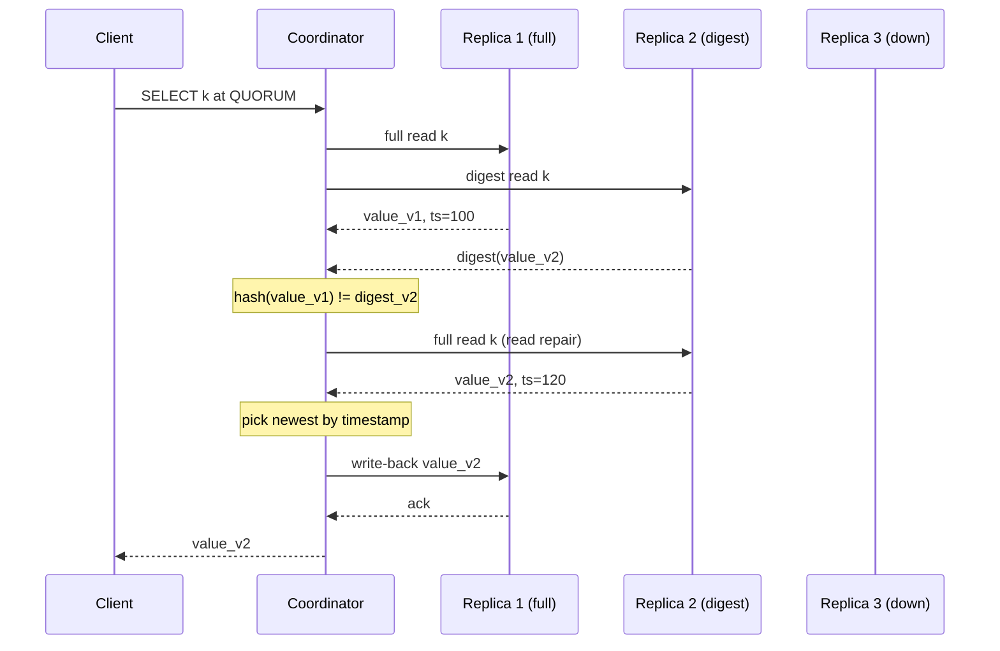
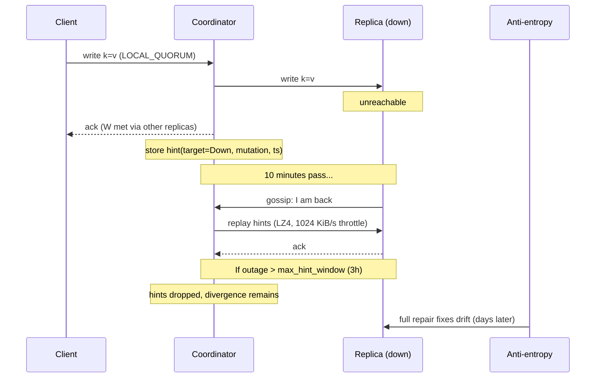
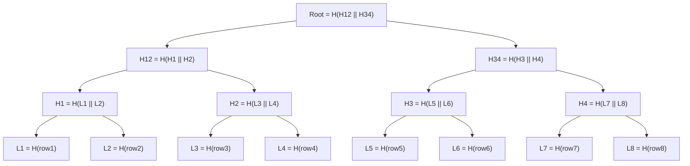
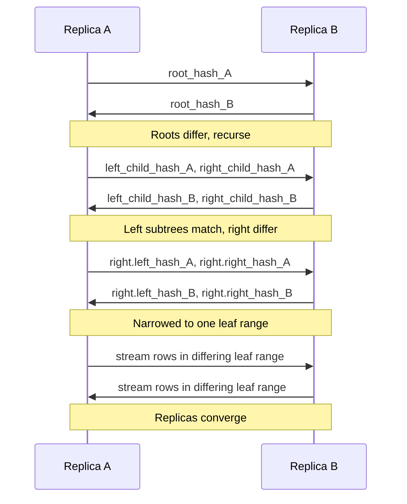

# Merkle Trees and Anti-Entropy: Keeping Replicas in Sync Cheaply

> **TL;DR**: Anti-entropy is the background immune system of eventually consistent stores. In a Dynamo-style system, writes reach W of N replicas; the rest drift. Three mechanisms push replicas back toward agreement: read repair (hot keys), hinted handoff (short outages, 3-hour default window[^1]), and Merkle-tree-based full repair (everything else). A Merkle tree summarizes billions of keys in a single 32-byte root hash[^2]. Comparing two replicas starts with that root; if it matches, you are done in O(1). If not, you recurse into children, narrowing to the few differing ranges in O(log N) comparisons instead of shipping every key[^3]. Repair is I/O-expensive (typically 10 to 100 MB/s per node[^4]), so you schedule it like ops work: throttled, segmented, and finishing within `gc_grace_seconds` (default 10 days[^5]) or deleted data resurrects.

## Learning Objectives

After this module, you will be able to:

- [ ] Construct a Merkle tree over a key range and use it to find differing ranges
- [ ] Distinguish read repair, hinted handoff, and background anti-entropy
- [ ] Reason about bandwidth and CPU cost of anti-entropy in a running cluster
- [ ] Tune repair cadence and concurrency for operational sanity
- [ ] Recognize Merkle trees in other contexts (Git, blockchain, content-addressable storage)

## Intuition

Imagine two librarians each managing a copy of the same 10,000-book collection across two buildings. Every day, books arrive and leave. Occasionally a delivery truck breaks down and one library misses a shipment. How do they figure out which books differ without reading every spine?

They divide each library into 100 shelves. Each librarian computes a summary code for each shelf (a hash of all the ISBNs on it). They compare the 100 codes over the phone. If shelf 47 matches, skip it. If shelf 47 differs, they zoom in: split it into 10 sub-sections, compare those codes, and narrow down to the exact 2 books that are out of sync. They ship only those 2 books, not all 10,000.

That is a Merkle tree. The "summary code" is a cryptographic hash. The "shelves" are tree nodes. The "phone call comparing codes" is the anti-entropy protocol. The key insight: you compare roots first, and most of the time they match, so you are done in one exchange.

Now replace "librarians" with database replicas, "books" with rows, and "delivery truck breakdown" with a network partition. That is anti-entropy in Cassandra, Riak, and DynamoDB.

## Theory

### The divergence problem

In a leaderless system with replication factor N and write consistency W < N, a successful write only needs W replicas to acknowledge. The remaining N-W replicas are supposed to catch up, but many things prevent it: the coordinator crashed before delivering, the hint queue filled, a partition lasted longer than the hint window, a disk bit-flip corrupted an SSTable, or a software bug dropped a mutation[^3][^1].

"Eventually consistent" does not mean "automatically consistent." Without a protocol that actively pushes replicas toward agreement, drift accumulates. Worse, if tombstones (delete markers) are garbage-collected before the delete propagates to all replicas, deleted data can reappear[^5]. You need active convergence mechanisms.

Dynamo-family systems layer three such mechanisms, each covering a different failure shape:

1. **Read repair** fixes hot keys during reads.
2. **Hinted handoff** covers short, transient outages.
3. **Merkle-tree anti-entropy** covers everything else: cold keys, expired hints, bit rot, and operator error.

### Read repair

On a quorum read, the coordinator sends one full read to the closest replica and digest reads (hash-only) to the others. If the digests match, data returns immediately. If they differ, the coordinator pulls full reads from all replicas, picks the newest value by timestamp, writes the winner back to every stale replica, and only then responds to the client[^6].

*Read repair blocks the client response until stale replicas are updated, guaranteeing monotonic quorum reads in Cassandra 4.0+.*

Cassandra 4.0 made blocking read repair the only mode (CASSANDRA-13910 removed the old probabilistic `read_repair_chance`)[^6]. This provides "monotonic quorum reads": successive reads never go backward in time.

**Limitation:** Read repair only covers keys that clients actually read. Cold keys, keys written once and never queried again, are invisible to it. The Riak docs call this the "main drawback" of read-repair-only systems[^7].

### Hinted handoff

When a write to a down replica fails, the coordinator stores a "hint" locally: the serialized mutation plus the target node ID. When the target gossips that it is back, the coordinator replays hints to it[^1].

*Hinted handoff covers short outages cheaply; hints past the 3-hour window are dropped, leaving divergence for full repair to fix.*

Cassandra defaults: `max_hint_window` = 3 hours, `hinted_handoff_throttle` = 1024 KiB/s per delivery thread, 2 delivery threads[^1]. A 10-minute outage ingesting 100 Mbps produces roughly 7 GB of hints that takes about 2 hours to replay at the default throttle[^1].

**Key limitation:** If a node stays down longer than the hint window, new hints are dropped. The coordinator cannot buffer indefinitely (it would fill its own disk). Only full repair reconciles the resulting drift.

### Merkle trees

A Merkle tree (Merkle, CRYPTO 1987[^8]) is a binary tree of hashes. Each leaf is the hash of a data block. Each internal node is the hash of its two children concatenated. The single root hash commits to all leaves.

*A Merkle tree over 8 rows: each leaf hashes one row, internal nodes hash their children, and the single root commits to all data.*

**Why this matters for anti-entropy:** Comparing two replicas means exchanging their root hashes. If the roots match, the replicas are identical and you are done in one round trip. If they differ, you recurse into the subtrees whose hashes disagree, narrowing to the exact differing ranges. For K differences among N keys, this costs O(K log N) hash comparisons, not O(N) data transfers[^3][^9].

**Hash choice matters.** RFC 6962 (Certificate Transparency) uses SHA-256 with domain separation: leaves are hashed as `SHA-256(0x00 || data)` and inner nodes as `SHA-256(0x01 || left || right)` to prevent second-preimage attacks[^9]. Cassandra takes a different approach: each node stores a 32-byte hash produced by concatenating two MurmurHash3_128 digests (`HASH_SIZE = 32; // 2xMM3_128 = 32 bytes`), and inner nodes combine children via XOR rather than re-hashing[^2]. XOR is safe here only because the leaf hashes are already collision-resistant; XOR is a fast commutative combiner, not a hiding function. In adversarial contexts (blockchains, CT logs), a cryptographic hash at every level is mandatory.

### Full anti-entropy

Cassandra's `nodetool repair` triggers the full protocol. For each token range, it runs a validation compaction on each replica that builds a Merkle tree over the SSTables. Replicas exchange trees, compute differences, and stream only the differing ranges[^4].

*Two replicas exchange tree hashes top-down, recursing only into disagreeing subtrees, then streaming data for the few differing leaf ranges.*

Three repair variants exist in Cassandra:

- **Full repair:** Rebuilds Merkle trees over all SSTables. High I/O but catches everything.
- **Incremental repair (default since 2.2, reliable since 4.0):** Only considers SSTables not yet marked as repaired. The 4.0 redesign (CASSANDRA-9143) wraps the session in a transactional prepare phase that anti-compacts candidate SSTables into a "pending repair" pool, preventing the overstreaming bug that plagued pre-4.0 incremental repair[^10].
- **Subrange repair:** Limits repair to specific token ranges (`-st`/`-et`), reducing memory and I/O per session[^4].

**Riak Active Anti-Entropy (AAE)** takes a different approach: it runs continuously as a background process, stores Merkle trees persistently on disk (via LevelDB), and updates leaves in real time on every write. Weekly, it rebuilds trees from scratch to catch silent on-disk corruption[^7].

### Merkle trees beyond databases

The same "tree of hashes" pattern appears everywhere a system needs compact, tamper-evident commitment to large datasets:

- **Git:** Every commit is the root of a Merkle tree. Blobs, trees, and commits are addressed by SHA-1 of their content. A commit's hash transitively commits to its entire directory subtree[^11].
- **Bitcoin:** The Merkle root of a block's transactions sits in the 80-byte block header. SPV (light) clients download only headers (~4.2 MB/year) and verify any transaction's inclusion with an O(log N) Merkle branch[^12].
- **Ethereum:** Uses a Modified Merkle Patricia Trie to commit to global state, storage, transactions, and receipts in each block header[^13].
- **Certificate Transparency (RFC 6962):** An append-only Merkle tree of TLS certificates. Auditors verify inclusion with a `ceil(log2(n))`-node audit path and verify append-only-ness with consistency proofs of at most `ceil(log2(n)) + 1` nodes between Signed Tree Heads[^9].
- **IPFS:** Every object is a Merkle DAG node. The default UnixFS chunker uses 256 KiB blocks with a DAG width of 174[^14].
- **BitTorrent v2 (BEP 52):** Per-file Merkle roots with 16 KiB leaf blocks and SHA-256, replacing v1's flat SHA-1 piece list[^15].

The unifying idea: a single root hash acts as a compact commitment to arbitrarily large data. Light clients can verify inclusion without downloading the full dataset.

## Real-World Example

### Cassandra Reaper: taming repair at scale

Running `nodetool repair` manually on a 100-node Cassandra cluster is operationally brutal. Each repair session builds Merkle trees in memory, streams data between replicas, and competes with production reads and writes for disk I/O. Without orchestration, operators face cascading compaction storms, streaming timeouts, and repair cycles that never complete.

[Cassandra Reaper](https://cassandra-reaper.io/) (originally created by Spotify, later maintained by The Last Pickle and now DataStax) solves this by splitting repair into small, manageable segments. A 3-node cluster with 256 vnodes per node produces at least 768 segments[^16]. Reaper schedules one segment at a time per replica, targeting 10 to 15 minutes per segment[^16].

**Back-pressure:** Reaper monitors pending compactions on each node. If pending compactions exceed 20, it pauses scheduling until the cluster catches up. This prevents repair from starving production workloads[^17].

**Intensity control:** The `intensity` setting controls how many segments run in parallel across the cluster. At intensity 1.0, one segment per replica runs concurrently. Lower values throttle further.

**The critical invariant:** A full repair cycle must complete within `gc_grace_seconds` (default 10 days). If it does not, tombstones can be garbage-collected on replicas that already received the delete, while a stale replica still holds the live row. The next repair then "resurrects" the deleted data by streaming the stale row back[^5][^18]. Reaper surfaces the "last repaired" timestamp per table so operators can verify this invariant holds.

**Typical operational cadence:** Incremental repair every 1 to 3 days, full repair every 1 to 3 weeks, with the full cycle completing inside the 10-day grace window. Operators typically observe repair bandwidth of 10 to 100 MB/s per node during streaming, depending on hardware and `stream_throughput_outbound` settings[^4].

## Defense in depth: anti-entropy mechanisms

Dynamo-style stores do not pick one anti-entropy mechanism; they layer three (read repair, hinted handoff, Merkle-based full repair) because each covers a different failure mode and none alone is sufficient. The table below lists each mechanism's role in the stack rather than asking you to choose between them.

| Mechanism | Role in the stack | When it fires | Key tunables | Notes |
|---|---|---|---|---|
| Read repair (sync / BLOCKING) | Fixes divergence on hot keys during user reads | Every QUORUM read whose replicas disagree | `read_repair` option; Cassandra 4.0+ blocking mode (CASSANDRA-13910) | Default for all QUORUM reads; gives monotonic-reads guarantee but adds read latency |
| Read repair (async / NONE) | Best-effort cleanup on reads without latency cost | Low-criticality reads (e.g., at ONE) | `read_repair_chance` (Cassandra <4.0 only) | Can break monotonicity; do not rely on it for correctness; use only on non-critical paths |
| Hinted handoff | Catches short transient failures (rolling restart, network blip) | Coordinator queues writes for a temporarily-down replica and replays them on recovery | `max_hint_window` (3 h default[^1]); hint disk quota | Always-on complement; bounded by the window and disk quota, so longer outages still need full repair |
| Full anti-entropy (Merkle) | Catches cold keys, dropped hints, bit rot | Scheduled cadence (typically weekly) or post-incident | `gc_grace_seconds` (10 d default[^5]); repair parallelism; Reaper's 20-pending-compactions threshold[^17] | The only mechanism that catches divergence on keys nobody reads; must finish within `gc_grace_seconds` |

## Common Pitfalls

> [!WARNING]
> **Repair slower than gc_grace causes tombstone resurrection.** If your repair cycle takes 12 days but `gc_grace_seconds` is 10 days, tombstones get garbage-collected before the delete propagates to all replicas. The next repair streams the stale live row back, resurrecting deleted data. Always finish a full repair cycle within gc_grace, with operational slack (repair every 7 days with a 10-day grace)[^5].

> [!WARNING]
> **Unthrottled repair causes I/O storms.** Validation compaction reads every SSTable for the repaired ranges. Without back-pressure, repair can double disk read rate and fill compaction queues. Use Reaper with its 20-pending-compactions threshold and bounded parallelism[^17].

> [!WARNING]
> **Hint window shorter than partition duration.** If a node is down for 4 hours but `max_hint_window` is 3 hours, the last hour of writes are silently lost to hints. Read repair only covers read keys. Schedule a full repair after any outage exceeding the hint window[^1].

> [!WARNING]
> **Pre-4.0 incremental repair overstreaming.** In Cassandra before 4.0, an SSTable compacted away mid-repair never got its `RepairedAt` timestamp set. The next run treated its data as unrepaired, producing cascading spurious diffs that significantly multiplied streaming I/O. Upgrade to 4.0+ where CASSANDRA-9143 introduced a transactional prepare phase[^10].

> [!WARNING]
> **Thinking read repair alone is enough for cold keys.** Read repair is invisible to keys nobody reads. A key written once and never queried can stay divergent indefinitely. Full anti-entropy is the only mechanism that catches these[^7].

> [!WARNING]
> **Weak hash functions in adversarial contexts.** BitTorrent v1 used SHA-1; v2 migrated to SHA-256 after SHA-1 collisions became practical. In non-adversarial database repair (Cassandra), MurmurHash3 is adequate. In adversarial contexts (CT logs, blockchains), use SHA-256 or stronger with domain separation[^9][^15].

## Exercise

Your Cassandra cluster has 30 nodes, 5 TB per node, RF=3, and experiences occasional 1-hour network partitions between two AZs. Design the repair strategy: when to run full repair, whether to use subrange or incremental, how to limit bandwidth during repair, and how to handle the hint window.

Hint

Think about: (1) the 10-day `gc_grace_seconds` deadline, (2) how much data 30 nodes x 5 TB represents for Merkle tree memory, (3) what happens to hints during a 1-hour partition vs the 3-hour default window, and (4) how Reaper segments keep individual repair sessions small.

Solution

**Repair type:** Use incremental repair (Cassandra 4.0+) as the primary mechanism, with a full repair monthly to catch any accumulated drift from edge cases.

**Scheduling with Reaper:**

- Deploy Cassandra Reaper with segment-based scheduling.
- Target 10 to 15 minute segments. With 30 nodes, 256 vnodes each, and RF=3, you have thousands of segments per full cycle.
- Set intensity to 1.0 (one segment per replica concurrently) and back-pressure threshold at 20 pending compactions.
- Schedule incremental repair to complete a full cycle every 5 to 7 days, well within the 10-day `gc_grace_seconds`.

**Bandwidth control:**

- Reaper's intensity setting plus the pending-compactions back-pressure naturally throttle I/O.
- For explicit bandwidth caps, use Cassandra's `stream_throughput_outbound` (default 200 Mbps) to limit streaming rate per node.
- At 5 TB per node, validation compaction is expensive. Subrange repair (smaller token ranges per segment) keeps memory usage bounded and allows failed segments to retry without redoing the whole range.

**Hint window:**

- The 1-hour partitions are well within the 3-hour default `max_hint_window`. Hints will accumulate and replay successfully when the partition heals.
- At 100 Mbps ingestion during the partition, expect roughly 4.2 GB of hints per coordinator. At 1024 KiB/s throttle with 2 threads, replay takes about 35 minutes. Acceptable.
- If planned maintenance might exceed 3 hours, raise `max_hint_window` temporarily via `nodetool setmaxhintwindow` (Cassandra 4.0+).

**Read repair:** Leave blocking read repair enabled (the 4.0 default). It handles hot-key convergence automatically at zero operator cost.

**Monitoring:** Track repair completion time per keyspace against `gc_grace_seconds`. Alert if any table's "last repaired" timestamp exceeds 7 days.

## Key Takeaways

- Anti-entropy is the background immune system of eventually consistent stores. It runs whether or not you watch it.
- Merkle trees reduce replica comparison from O(N) to O(log N) for small diffs. The root hash is a 32-byte summary of billions of keys.
- Read repair, hinted handoff, and Merkle-based full repair coexist. Each covers a different failure mode; none alone is sufficient.
- Repair must complete within `gc_grace_seconds` (default 10 days) or tombstones resurrect deleted data.
- Repair is I/O-expensive (typically 10 to 100 MB/s per node). Plan rates, windows, and concurrency like any ops work. Use Reaper.
- Cassandra 4.0 fixed incremental repair's overstreaming bug with a transactional prepare phase. Upgrade before relying on incremental.
- Merkle trees appear everywhere: databases, Git, Bitcoin, Ethereum, Certificate Transparency, IPFS, and BitTorrent v2. The unifying idea is compact commitment to large datasets.

## Further Reading

- [Dynamo: Amazon's Highly Available Key-value Store (SOSP 2007)](https://www.allthingsdistributed.com/files/amazon-dynamo-sosp2007.pdf) - Section 4.7 introduces Merkle-tree anti-entropy for Dynamo-family stores; the foundational paper for this entire chapter.
- [Apache Cassandra Repair Documentation](https://cassandra.apache.org/doc/stable/cassandra/managing/operating/repair.html) - Canonical reference for full, incremental, and subrange repair mechanics, `nodetool` flags, and the gc_grace invariant.
- [Riak Active Anti-Entropy](https://docs.riak.com/riak/kv/latest/learn/concepts/active-anti-entropy/) - The clearest production explanation of persistent on-disk Merkle trees, continuous AAE, and weekly rebuild from the K/V backend.
- [A Digital Signature Based on a Conventional Encryption Function (Merkle, CRYPTO 1987)](https://link.springer.com/chapter/10.1007/3-540-48184-2_32) - The original paper; the Merkle tree is a side effect of building multi-message signatures from a one-time signature.
- [RFC 6962: Certificate Transparency](https://datatracker.ietf.org/doc/html/rfc6962) - The cleanest standards-quality writeup of Merkle audit paths, consistency proofs, and domain-separated leaf hashing.
- [Incremental Repair Improvements in Cassandra 4 (The Last Pickle)](https://thelastpickle.com/blog/2018/09/10/incremental-repair-improvements-in-cassandra-4.html) - Explains the pre-4.0 overstreaming bug and the transactional fix; essential production context.
- [Cassandra Reaper](https://cassandra-reaper.io/) - The operational tool for scheduling repairs; read the Concepts page for segment sizing, back-pressure, and intensity tuning.
- [Bitcoin Whitepaper, Section 7](https://nakamotoinstitute.org/static/docs/bitcoin.pdf) - Merkle roots in 80-byte block headers enabling SPV light clients; the canonical non-database application of Merkle trees.

## Flashcards

**Q:** What problem do Merkle trees solve in replica synchronization?
**A:** They reduce the cost of finding differing keys between two replicas from O(N) (comparing every key) to O(K log N) (comparing hashes top-down and recursing only into disagreeing subtrees), where K is the number of differences.

**Q:** What are the three anti-entropy mechanisms in Dynamo-style systems?
**A:** Read repair (fixes hot keys during reads), hinted handoff (covers short outages up to the hint window), and Merkle-tree-based full repair (covers cold keys, expired hints, bit rot, and operator error).

**Q:** What is Cassandra's default `max_hint_window` and what happens when it expires?
**A:** 3 hours. If a node is down longer, the coordinator stops generating hints. The node returns with permanent divergence on keys written during its absence; only full repair fixes it.

**Q:** Why must repair complete within `gc_grace_seconds`?
**A:** Tombstones are garbage-collected after gc_grace (default 10 days). If a replica missed the tombstone and repair has not propagated it before GC, the next repair sees the stale live row and streams it back, resurrecting deleted data.

**Q:** How does Cassandra combine child hashes in its Merkle tree?
**A:** Using bitwise XOR of the two 32-byte child hashes, not by re-hashing the concatenation. This is safe because leaf hashes are already collision-resistant MurmurHash3 digests. In adversarial contexts (CT logs, blockchains), cryptographic re-hashing at every level is required.

**Q:** What is the difference between full repair and incremental repair in Cassandra 4.0+?
**A:** Full repair builds Merkle trees over all SSTables. Incremental repair only considers SSTables not yet marked as repaired, using a transactional prepare phase that anti-compacts candidates into a "pending repair" pool to prevent overstreaming.

**Q:** How does Riak's Active Anti-Entropy differ from Cassandra's repair?
**A:** Riak AAE runs continuously in the background (not operator-triggered), stores Merkle trees persistently on disk (not in memory), updates leaves in real time on every write, and rebuilds trees from scratch weekly to catch silent corruption.

**Q:** What is the Merkle root in a Bitcoin block header?
**A:** A 32-byte SHA-256 hash that commits to all transactions in the block. It sits in the 80-byte block header, enabling SPV clients to verify transaction inclusion with O(log N) Merkle branches without downloading full blocks.

**Q:** What is domain separation in Merkle tree hashing and why does it matter?
**A:** RFC 6962 prefixes leaf hashes with 0x00 and inner-node hashes with 0x01 before hashing. Without this, an attacker could forge an internal-node hash that collides with a leaf, breaking second-preimage resistance.

**Q:** What does Cassandra Reaper do?
**A:** It orchestrates repair by splitting the token ring into small segments (targeting 10 to 15 minutes each), scheduling them with back-pressure (pausing when pending compactions exceed 20), and ensuring the full repair cycle completes within gc_grace_seconds.

**Q:** Name three non-database systems that use Merkle trees.
**A:** Git (commits are Merkle tree roots of project content), Bitcoin (transaction Merkle roots in block headers for SPV verification), and Certificate Transparency (append-only Merkle trees of TLS certificates for auditable inclusion proofs).

**Q:** What was the pre-4.0 incremental repair overstreaming bug?
**A:** If an SSTable was compacted away during the repair streaming phase, the resulting SSTable never got its RepairedAt timestamp set. Next run treated it as unrepaired, producing spurious Merkle mismatches and cascading streaming that significantly multiplied I/O.

## References

[^1]: Apache Cassandra, "Hints" documentation (Cassandra 5.0). https://cassandra.apache.org/doc/stable/cassandra/managing/operating/hints.html
[^2]: Apache Cassandra source, `org.apache.cassandra.utils.MerkleTree`. https://github.com/apache/cassandra/blob/trunk/src/java/org/apache/cassandra/utils/MerkleTree.java
[^3]: DeCandia et al., "Dynamo: Amazon's Highly Available Key-value Store", SOSP 2007. https://dl.acm.org/doi/10.1145/1294261.1294281
[^4]: Apache Cassandra, "Repair" documentation (Cassandra 5.0). https://cassandra.apache.org/doc/stable/cassandra/managing/operating/repair.html
[^5]: Apache Cassandra, "Repair" docs, gc_grace section. https://cassandra.apache.org/doc/stable/cassandra/managing/operating/repair.html
[^6]: Apache Cassandra, "Read repair" documentation (Cassandra 5.0). https://cassandra.apache.org/doc/stable/cassandra/managing/operating/read_repair.html
[^7]: Basho, "Active Anti-Entropy", Riak KV documentation. https://docs.riak.com/riak/kv/latest/learn/concepts/active-anti-entropy/
[^8]: Merkle, "A Digital Signature Based on a Conventional Encryption Function", CRYPTO 1987. https://link.springer.com/chapter/10.1007/3-540-48184-2_32
[^9]: Laurie, Langley, Kasper, "Certificate Transparency", RFC 6962, IETF, June 2013. https://datatracker.ietf.org/doc/html/rfc6962
[^10]: Alex Dejanovski, "Incremental Repair Improvements in Cassandra 4", The Last Pickle, 10 Sep 2018. https://thelastpickle.com/blog/2018/09/10/incremental-repair-improvements-in-cassandra-4.html
[^11]: Chacon and Straub, "Pro Git, 2nd Edition", Chapter 10.2: Git Internals - Git Objects. https://git-scm.com/book/en/v2/Git-Internals-Git-Objects
[^12]: Nakamoto, "Bitcoin: A Peer-to-Peer Electronic Cash System", 2008, section 7. https://nakamotoinstitute.org/static/docs/bitcoin.pdf
[^13]: Ethereum Foundation, "Patricia Merkle Trie." https://ethereum.org/en/developers/docs/data-structures-and-encoding/patricia-merkle-trie/ (see also the reference implementation at https://github.com/ethereum/execution-specs).
[^14]: IPFS boxo source, `DefaultLinksPerBlock` and `DefaultBlockSize` (UnixFS importer). https://github.com/ipfs/boxo/blob/main/ipld/unixfs/importer/helpers/helpers.go
[^15]: BitTorrent.org, "BEP 52: The BitTorrent Protocol Specification v2". https://www.bittorrent.org/beps/bep_0052.html
[^16]: Cassandra Reaper, "Easy Repair Management for Apache Cassandra" and Concepts page. https://cassandra-reaper.io/docs/concepts/
[^17]: Cassandra Reaper, "Core Concepts" (segments, back-pressure, concurrency, intensity). https://cassandra-reaper.io/docs/concepts/
[^18]: k8ssandra, "Reaper for Cassandra repairs". https://docs.k8ssandra.io/components/reaper/
