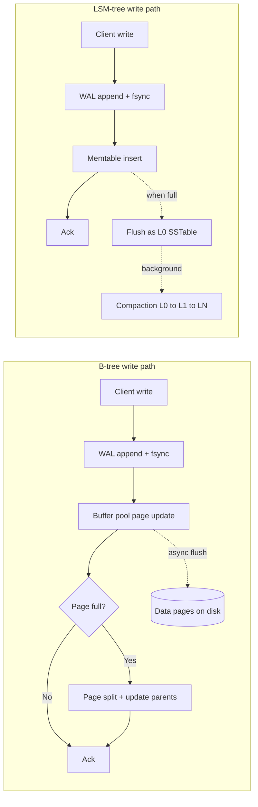
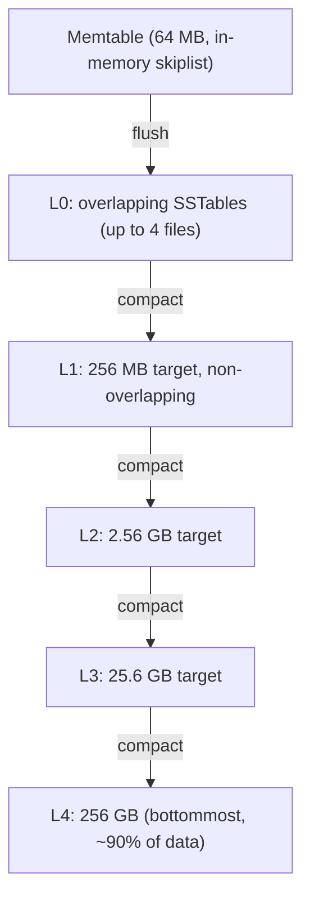
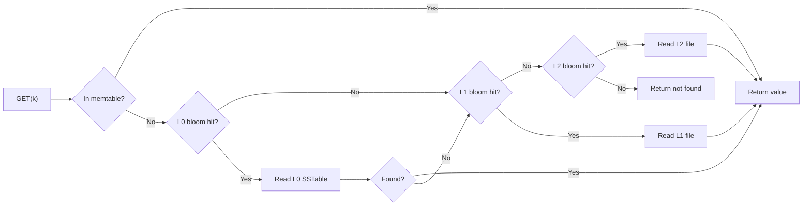
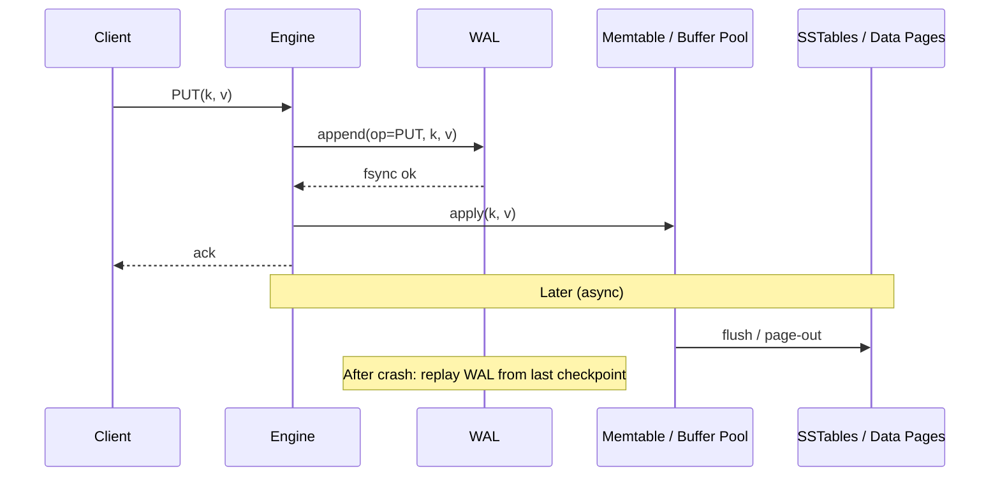

# Storage Engines: B-Trees, LSM-Trees, and Why Your Database Feels the Way It Does

> **TL;DR**: A storage engine decides how bytes become rows and how rows survive power loss. The two dominant families are B-trees (update-in-place, read-optimized) and LSM-trees (append-only, write-optimized). You cannot minimize write amplification, read amplification, and space amplification simultaneously[^1]. B-trees accept 16-256x write amplification to deliver single-seek reads. LSM-trees accept 10-30x write amplification from compaction to deliver sequential writes. Facebook halved storage by migrating from InnoDB to MyRocks (an LSM)[^2]. Discord cut p99 read latency from 125 ms to 15 ms by migrating between two LSM engines[^3]. The engine you pick cascades into your backup strategy, replication model, and on-call burden.

## Learning Objectives

After this module, you will be able to:

- [ ] Explain B-tree vs LSM-tree mechanics in terms of read, write, and space amplification
- [ ] Justify why OLTP databases mostly use B-trees and write-heavy stores mostly use LSM-trees
- [ ] Reason about WALs, checkpoints, bloom filters, and compaction strategies
- [ ] Pick a storage engine for a workload and defend the choice with numbers
- [ ] Diagnose performance cliffs caused by compaction, page splits, or vacuum

## Intuition

Think of two ways to organize a bookshelf.

**The librarian's shelf (B-tree).** Books are alphabetized. When a new book arrives, you find the right slot and slide everything over to make room. Finding any book is fast: you know exactly where to look. But inserting is expensive because you physically rearrange existing books. If the shelf is full, you split it into two shelves and update the directory card upstairs.

**The pile-and-merge shelf (LSM-tree).** New books go on a "recent arrivals" table. When the table fills up, you sort the pile and file it as a sealed box on the floor. Periodically, a helper merges several boxes into one larger sorted box. Finding a book means checking the table first, then each box in order. You can speed this up by taping a list of "books NOT in this box" on the outside (a bloom filter). Inserting is trivial: just drop the book on the table.

Both approaches keep books findable. The librarian's shelf rewards lookups and punishes inserts. The pile-and-merge shelf rewards inserts and punishes lookups. Neither is universally better. The right choice depends on whether your workload reads more than it writes.

This is the fundamental trade-off of storage engines. [Data Structures for Systems](../part-0-prerequisites/02-data-structures-for-systems.md) introduced B-trees and skiplists as abstract structures. This chapter shows how production databases build on them, and why the choice shapes everything from tail latency to disk bills.

## Theory

### What a storage engine is

A storage engine is the layer that persists rows to durable storage, indexes them, and recovers them after a crash. It sits below the query layer and exposes an ordered key-value API upward.

MySQL's pluggable engine architecture lets the same SQL frontend sit on InnoDB (B-tree, default), MyISAM (legacy B-tree), or MyRocks (LSM via RocksDB) with the same client protocol[^2]. PostgreSQL does not expose a public pluggable interface but still separates its heap storage, nbtree indexes, and the access method interface for GiST, GIN, BRIN, and hash.

Three primitives are universal across both families:

1. **Write-ahead log (WAL):** Every mutation is durably appended to a sequential log before being applied. A crash at any instant can be recovered by replaying committed records.
2. **MVCC:** Multiple row versions let readers proceed without blocking writers. PostgreSQL stores versions inline (xmin/xmax per tuple). InnoDB stores old versions in rollback segments.
3. **Background reclamation:** Page splits and VACUUM for B-trees. Compaction for LSMs. You always pay one of these taxes.

### B-tree mechanics

A B-tree engine stores data in fixed-size pages. InnoDB uses 16 KB pages[^4]. PostgreSQL uses 8 KB pages. Each internal page holds hundreds of keys and child pointers, giving a fanout so high that even billion-row tables have a tree depth of only 4-5 levels[^5].

**Writes are in-place.** To update a row, the engine finds the leaf page in the buffer pool, modifies it, and marks it dirty. The page is eventually flushed to its fixed location on disk. If the page overflows, it splits: half the keys move to a new page, and the parent pointer is updated. This can cascade upward.

**InnoDB clustered indexes** store the row data directly in the leaf pages of the primary-key B-tree. Secondary indexes store the primary key as their pointer, not a heap offset. This means a secondary-index lookup requires two tree traversals: one in the secondary index, then one in the primary to fetch the row.

**PostgreSQL's heap model** separates concerns differently. Row data lives in an unordered heap. B-tree indexes store (key, heap-tuple-ID) pairs. An UPDATE writes a new tuple in the heap and sets `xmax` on the old one. Dead tuples accumulate until VACUUM reclaims them. Under sustained write-heavy workloads without vacuum tuning, a 10 GB table can occupy 50 GB on disk[^6].

**Write amplification** for B-trees comes from rewriting entire pages for small changes. A 100-byte row update rewrites a 16 KB page: that is 160x amplification at the page level. In practice, the buffer pool batches multiple updates per page flush, so real-world WA is lower but still significant for random-write workloads.

*B-tree writes rewrite pages in place after WAL logging; LSM writes append to WAL and insert into an in-memory memtable, deferring all disk organization to background compaction.*

### LSM-tree mechanics

An LSM-tree engine buffers writes in an in-memory sorted structure (the memtable, typically a skiplist). When the memtable reaches a threshold (RocksDB default: 64 MB[^7]), it becomes immutable and is flushed as a sorted string table (SSTable) to disk.

SSTables are organized into levels. Level 0 (L0) is special: files may have overlapping key ranges because each is a direct memtable flush. When L0 accumulates enough files (RocksDB default: 4), they are compacted into L1. Each subsequent level is 10x larger than the previous[^8].

**All writes to persistent storage are sequential.** WAL appends, SSTable flushes, and compaction outputs are all sequential I/O. This is why LSM engines achieve higher sustained write throughput than B-trees on the same hardware.

**The cost is compaction.** Leveled compaction rewrites data multiple times as it moves through levels. With a fan-out of 10 and 5 levels, write amplification is commonly 10-30x[^1][^9]. Universal (tiered) compaction trades lower write amplification (~9x) for higher space amplification: a major compaction "temporarily doubles the amount of disk space used"[^14], so plan for ~100% transient overhead and keep disks under 50% full.

**Reads are more expensive.** A point read must check the memtable, then potentially every L0 file, then at most one file per non-zero level. Without bloom filters, this means multiple disk reads per query.

*RocksDB leveled compaction layout with dynamic-level-bytes. Each level is 10x larger than the previous; approximately 90% of data lives in the bottommost level.*

### Bloom filters and read optimization

A bloom filter is a probabilistic bit array that answers "is key k in this SSTable?" with no false negatives and a tunable false positive rate. With 10 bits per key, the false positive rate is approximately 1%. With 16 bits per key, it drops to 0.05%[^10].

RocksDB attaches a bloom filter to each SSTable. On a point read, the engine checks the filter before loading any data block. If the filter says "definitely not here," the engine skips that file entirely. This eliminates roughly 99% of wasted disk reads for missing keys.

The Monkey paper (SIGMOD 2017) proved that the optimal memory allocation assigns exponentially more bits per key to smaller (shallower) levels, because those levels are checked first and a false positive there is most expensive[^11].

Bloom filters do not help range scans. If your workload is range-scan-heavy, an LSM engine pays full read amplification on every query.

*LSM point-read path with bloom filters. Each level's filter is checked before loading data; a negative result skips the level entirely, keeping read amplification bounded.*

### Compaction strategies

The compaction strategy determines which SSTables merge and when. Three major strategies exist:

**Leveled (RocksDB default, Cassandra LCS).** Small fixed-size SSTables organized into levels, each 10x larger. Merging is aggressive: one SSTable from level N merges with all overlapping files in level N+1. Result: bounded read amplification (one file per non-zero level) and low space amplification (~10% worst case). Cost: write amplification of 10-30x.

**Size-tiered (Cassandra STCS).** Merge SSTables of similar size into one larger file. Simpler logic, lower write amplification (~9x typical). Cost: a major compaction temporarily doubles disk usage (~100% transient space overhead, because input and output files coexist until the merge finishes[^14]); operational rule of thumb is to keep STCS nodes under 50% disk utilization. Higher read amplification because multiple sorted runs may overlap.

**Time-window (Cassandra TWCS).** Group SSTables by insertion time window. Within a window, use size-tiered. At window close, produce one file per window. Ideal for time-series data with TTL where old windows are dropped wholesale. Breaks if late-arriving writes update old time windows.

### WAL and crash recovery

Every storage engine uses a write-ahead log. The rule is simple: log the mutation, fsync, then apply it in memory. If the process crashes, replay the log from the last checkpoint.

B-tree engines use ARIES-style recovery with three phases: analysis (rebuild dirty-page and transaction tables from the log), redo (replay all logged operations to bring the database to crash state), and undo (roll back uncommitted transactions using compensation log records)[^12].

LSM engines have simpler recovery. RocksDB appends each write batch to the WAL with a CRC32C checksum. On recovery, it replays from the last checkpoint. The default mode (`kPointInTimeRecovery`) stops at the first corrupted record, accepting that the last in-flight write may be lost.

The operational implication: every commit requires at least one fsync. This bounds write throughput to the device's synchronous-write rate. Group commit (batching multiple transactions into one fsync) is the standard mitigation.

*Every mutation is logged and fsynced before the in-memory apply is acknowledged. Recovery replays the log from the last checkpoint, guaranteeing no acknowledged write is lost.*

## Real-World Example

### Facebook's InnoDB-to-MyRocks migration

Facebook's User Database (UDB) stores the social graph. It ran on InnoDB (B-tree) with compression enabled. By 2016, the fleet was space-bound: CPU and I/O had headroom, but compressed InnoDB had plateaued on compression ratios. The team needed to halve storage cost without new hardware.

MyRocks packages RocksDB as a MySQL storage engine. It preserves InnoDB's clustered-index semantics (rows stored in primary-key order) and secondary-index behavior (secondary indexes store primary keys as values). Transactions use two-phase commit across the MySQL binlog and RocksDB's WAL, so replication and crash consistency are preserved[^2].

The migration strategy was conservative. MyRocks could replicate from InnoDB and vice versa, enabling gradual cutover per replica set with rollback. Shadow queries replayed production traffic on MyRocks replicas to flush concurrency bugs before promotion. File deletion was throttled to 128 MB/s to avoid TRIM stalls on Flash.

**Results:** Storage footprint cut in half versus compressed InnoDB. Instance size reduced by approximately 62% over subsequent years of optimization[^13]. The entire UDB fleet migrated over roughly one year.

**Discord's Cassandra-to-ScyllaDB migration** tells the complementary story: what happens when you pick the right engine family (LSM) but the wrong implementation. Discord's Cassandra cluster grew to 177 nodes storing trillions of messages. Compaction backlogs required a "gossip dance" (remove node, let it compact, re-add). Java GC pauses caused unpredictable latency spikes. Read p99 ranged from 40 to 125 ms[^3].

ScyllaDB uses the same LSM data model but with a shard-per-core C++ architecture that eliminates GC pauses. After migration: 72 nodes (down from 177), p99 reads at 15 ms (down from 125 ms), and the migration itself ran at 3.2 million messages per second via a Rust-based tool[^3].

The lesson: storage-engine choice is not just "B-tree vs LSM." Implementation details (GC, compaction scheduling, thread model) matter as much as the data structure family.

## Trade-offs

| Approach | Write amp | Read amp | Space amp | Best when | Our pick |
|----------|-----------|----------|-----------|-----------|----------|
| B-tree (InnoDB, PostgreSQL) | 16-256x at the page level for small random writes[^2]; amortized lower under buffer-pool batching | ~1 logical seek per point read (buffer pool usually caches inner nodes) | Near-1x after VACUUM; Postgres bloat can reach ~5x a 10 GB table to 50 GB without tuning[^6] | Mixed read/write OLTP with transactions and secondary indexes | **Default for general OLTP** |
| LSM leveled (RocksDB, Cassandra LCS) | 10-30x typical; RocksDB docs describe it as "often larger than 10"[^8] | One SSTable per non-zero level with a bloom-filter miss check; ~L0 files extra[^8] | ~1.1x with `level_compaction_dynamic_level_bytes=true` (~10% worst case)[^8] | Write-heavy or ingest-bound workloads where reads tolerate bloom-filter overhead | **Default for write-heavy stores** |
| LSM tiered/universal (Cassandra STCS, RocksDB universal) | ~9x in RocksDB's worked example with `max_size_amplification_percent=25`[^14] | Higher: one read per sorted run in the worst case, no per-level bound[^14] | Up to ~2x transiently during a major compaction (input and output files coexist); "temporarily double the amount of disk space used"[^14] | Write-amp-sensitive workloads with headroom for 100% transient space; time-series with TWCS | When write amp is the binding constraint |
| Key-value separation (WiscKey, RocksDB BlobDB, Titan) | Collapses toward ~1x for large values: compaction rewrites only keys + blob pointers | Extra indirection: an additional blob-file read on hot reads | Blob-file GC adds overhead; sensitive to value churn | Large values (>= 1 KB average), append-heavy ingestion | Niche but growing |

## Common Pitfalls

> [!WARNING]
> **Compaction stalls under burst writes.** When L0 files accumulate past the slowdown trigger (RocksDB default: 20 files), the engine throttles writes. Past the stop trigger (36 files), writes halt entirely. Monitor `rocksdb.num-files-at-level-0` and increase compaction parallelism before you hit the wall.

> [!WARNING]
> **PostgreSQL bloat from under-tuned autovacuum.** Every UPDATE leaves a dead tuple. If autovacuum cannot keep up, a 10 GB table grows to 50 GB on disk, indexes point at dead rows, and eventually transaction-ID wraparound triggers emergency vacuums that freeze the cluster. Tune `autovacuum_vacuum_scale_factor` down and monitor `n_dead_tup`.

> [!WARNING]
> **UUIDv4 primary keys causing page splits.** Random-order inserts spread across the entire B-tree key space, causing constant page splits. Each split rewrites half a page and updates parent pointers. Use ordered keys (auto-increment, ULID, UUIDv7) so inserts hit the right edge of the tree.

> [!WARNING]
> **Tombstones starving reads.** In LSM engines, deletes are tombstone markers, not physical removes. Tombstones persist until compaction drops them at the bottommost level. A sustained delete stream without aggressive compaction causes reads to scan through dead markers. Discord's final migration stalled because gigantic tombstone ranges had never been compacted away[^3].

> [!WARNING]
> **Bloom filter memory eviction.** If bloom filters are not pinned in the block cache, they get evicted under memory pressure. Every subsequent point read pays the I/O cost of reloading the filter. Set `cache_index_and_filter_blocks = true` and `pin_l0_filter_and_index_blocks_in_cache = true` in RocksDB.

## Exercise

You run a service ingesting 200,000 writes/sec of small event records (average 200 bytes each) with occasional point lookups by ID and rare range scans. Pick a storage engine, size the memtable and block cache, choose a compaction strategy, and defend your choice against a naive "just use Postgres" baseline.

Hint

Calculate the write bandwidth: 200,000 * 200 bytes = 40 MB/s of user data. Consider how write amplification multiplies this. Think about whether your reads are point lookups (bloom-filter-friendly) or range scans (not). Consider what happens to PostgreSQL's VACUUM under 200K updates/sec.

Solution

**Engine choice: RocksDB with leveled compaction.**

**Why not PostgreSQL?** At 200K writes/sec of 200-byte records, PostgreSQL would generate 200K dead tuples per second. Autovacuum would need to reclaim ~40 MB/s of dead space continuously. In practice, vacuum falls behind under sustained write pressure, causing table bloat, index bloat, and eventually transaction-ID wraparound emergencies. The B-tree page-split cost for random IDs adds further write amplification.

**Memtable sizing:** With 40 MB/s ingest, a 64 MB memtable flushes every ~1.6 seconds. This is frequent but manageable. Increasing to 128 MB reduces flush frequency and L0 file count, giving compaction more breathing room.

**Block cache:** Point lookups by ID are bloom-filter-friendly. Allocate 70% of available memory to the block cache and pin bloom filters. With 10 bits/key and 200K keys/sec, bloom filter memory grows at ~250 KB/sec, which is negligible.

**Compaction strategy:** Leveled compaction gives bounded read amplification (important for point lookups) and low space amplification (~10%). Write amplification of 10-30x means the device sees 400 MB/s to 1.2 GB/s. A modern NVMe SSD handles this comfortably.

**Why not tiered/universal?** Your reads are point lookups, not range scans. Leveled compaction's guarantee of one file per non-zero level means fewer files to check per read. The higher write amplification is acceptable because your ingest rate (40 MB/s) is well within device bandwidth even at 30x amplification.

**Trade-off accepted:** You give up PostgreSQL's rich query layer (joins, transactions, SQL) in exchange for 5-10x better write throughput and no vacuum pressure. If you need SQL, consider CockroachDB (which uses Pebble, an LSM, under the hood) or MyRocks.

## Key Takeaways

- A storage engine owns on-disk layout, indexing, durability, and recovery. It sits below the query layer and shapes every operational property you care about.
- B-trees optimize reads (one seek per point lookup) and pay for writes (page splits, random I/O, 16-256x page-level write amplification).
- LSM-trees optimize writes (sequential I/O, high throughput) and pay for reads (multi-level search) and background work (10-30x write amplification from compaction).
- You cannot minimize write, read, and space amplification simultaneously. Picking an engine is picking which amplification you spend.
- Bloom filters (10 bits/key for 1% FPR) make LSM point reads practical by eliminating 99% of wasted SSTable reads.
- Storage-engine choice cascades: Facebook halved storage with MyRocks; Discord cut p99 from 125 ms to 15 ms by switching LSM implementations.
- Compaction tuning, vacuum tuning, and bloom-filter memory management are where storage-engine operators earn their salary.

## Further Reading

- [The Log-Structured Merge-Tree (O'Neil et al., 1996)](https://www.cs.umb.edu/~poneil/lsmtree.pdf) - The foundational paper defining LSM-trees and their amplification costs; read Section 3 for the original cost model.
- [Designing Data-Intensive Applications, Ch. 3](https://dataintensive.net/) - Kleppmann's canonical pedagogical overview of B-trees vs LSMs; the best single chapter for building intuition.
- [RocksDB Wiki: Leveled Compaction](https://github.com/facebook/rocksdb/wiki/Leveled-Compaction) - Authoritative reference for the most common LSM compaction strategy, including dynamic-level-bytes.
- [How Discord Stores Trillions of Messages](https://discord.com/blog/how-discord-stores-trillions-of-messages) - The best contemporary LSM-migration case study; Cassandra to ScyllaDB with specific p99 numbers and operational lessons.
- [Migrating a Database from InnoDB to MyRocks (Meta, 2017)](https://engineering.fb.com/2017/09/25/core-infra/migrating-a-database-from-innodb-to-myrocks/) - Meta's B-tree to LSM migration on UDB with operational tips on replication, shadow queries, and TRIM throttling.
- [Monkey: Optimal Navigable Key-Value Store (SIGMOD 2017)](https://stratos.seas.harvard.edu/publications/monkey-optimal-navigable-key-value-store) - Proves optimal per-level bloom-filter bit allocation; essential if you are tuning read performance on an LSM.
- [Introducing Pebble (Cockroach Labs, 2020)](https://www.cockroachlabs.com/blog/pebble-rocksdb-kv-store) - Why CockroachDB replaced RocksDB with a Go-native LSM; covers the cgo boundary cost and metamorphic testing.
- [PostgreSQL B-Tree Indexes Documentation](https://www.postgresql.org/docs/current/btree.html) - Authoritative source on nbtree internals, page layout, and deduplication.

## Flashcards

**Q:** What are the three amplification factors that govern storage-engine trade-offs?
**A:** Write amplification (bytes written to device per byte of user data), read amplification (disk reads per logical read), and space amplification (on-disk footprint divided by live data size). You cannot minimize all three simultaneously.

**Q:** What is the default page size for InnoDB and PostgreSQL?
**A:** InnoDB uses 16 KB pages. PostgreSQL uses 8 KB pages. These are the atomic units of I/O and the reason small updates incur large write amplification.

**Q:** How does leveled compaction work in RocksDB?
**A:** Memtable flushes to L0 as an SSTable. When L0 has 4 files, they compact into L1. Each level is 10x larger than the previous. One SSTable from level N merges with all overlapping files in level N+1. This bounds read amplification to one file per non-zero level.

**Q:** What is the false positive rate of a bloom filter with 10 bits per key?
**A:** Approximately 1%. This means 99% of unnecessary SSTable reads are avoided for point lookups of missing keys.

**Q:** Why did Facebook migrate from InnoDB to MyRocks?
**A:** UDB was space-bound with excess CPU/IO headroom. Compressed InnoDB had plateaued on compression ratios. MyRocks (RocksDB as a MySQL engine) halved storage footprint because LSM compaction produces better compression ratios than B-tree page-level compression.

**Q:** What was Discord's core problem with Cassandra, and how did ScyllaDB fix it?
**A:** Cassandra's Java GC pauses and compaction backlogs caused unpredictable latency (p99 of 40-125 ms). ScyllaDB uses a shard-per-core C++ architecture with no GC, cutting p99 to 15 ms and cluster size from 177 to 72 nodes.

**Q:** What is write amplification for leveled compaction in practice?
**A:** Typically 10-30x. Each byte of user data is rewritten as it moves through levels during compaction. With a fan-out of 10 and 5 levels, the theoretical maximum is high, but dynamic-level-bytes and other optimizations keep it in the 10-30x range.

**Q:** Why does PostgreSQL suffer from table bloat under write-heavy workloads?
**A:** PostgreSQL's MVCC writes a new tuple for every UPDATE, leaving the old tuple as dead space. VACUUM must reclaim dead tuples. If the update rate exceeds vacuum's reclamation rate, dead tuples accumulate. A 10 GB table can grow to 50 GB on disk without tuning.

**Q:** What is the difference between leveled and size-tiered compaction?
**A:** Leveled: aggressive merging into non-overlapping levels, giving low read amp and space amp but high write amp (10-30x). Size-tiered: merge files of similar size, giving lower write amp (~9x) but higher space amp (up to 50% during compaction) and higher read amp.

**Q:** When should you pick a B-tree engine over an LSM-tree engine?
**A:** When your workload is read-heavy or mixed read/write with strong transaction requirements, secondary indexes, and predictable p99 latency needs. B-trees deliver single-seek point reads and do not suffer from compaction stalls.

**Q:** What happens when RocksDB's L0 file count exceeds the stop-writes trigger?
**A:** Writes halt entirely until compaction reduces L0 file count below the threshold. This is the "compaction stall" that causes write-latency spikes in production LSM systems.

**Q:** What three universal primitives do all storage engines share?
**A:** Write-ahead log (durability before acknowledgment), MVCC (readers do not block writers), and background reclamation (vacuum for B-trees, compaction for LSMs).

## References

[^1]: O'Neil, Cheng, Gawlick, O'Neil, "The Log-Structured Merge-Tree (LSM-Tree)", 1996. https://www.cs.umb.edu/~poneil/lsmtree.pdf
[^2]: Matsunobu, "Migrating a database from InnoDB to MyRocks", Meta Engineering, 2017. https://engineering.fb.com/2017/09/25/core-infra/migrating-a-database-from-innodb-to-myrocks/
[^3]: Ingram, "How Discord Stores Trillions of Messages", Discord Engineering, 2023. https://discord.com/blog/how-discord-stores-trillions-of-messages
[^4]: Oracle, "The Physical Structure of an InnoDB Index", MySQL 8.0 Reference Manual. https://docs.oracle.com/cd/E17952_01/mysql-8.0-en/innodb-physical-structure.html
[^5]: Bartunov, Postgres Professional, "Indexes in PostgreSQL - 4 (Btree)", 2019. https://habr.com/ru/companies/postgrespro/articles/443284/
[^6]: Tanaskovic, "PostgreSQL MVCC and Vacuum Internals". https://nemanjatanaskovic.com/blog/postgresql-mvcc-vacuum-internals
[^7]: RocksDB, `include/rocksdb/options.h` in facebook/rocksdb repository. https://github.com/facebook/rocksdb/blob/main/include/rocksdb/options.h
[^8]: RocksDB Wiki, "Leveled Compaction". https://github.com/facebook/rocksdb/wiki/Leveled-Compaction
[^9]: RocksDB Wiki, "RocksDB Tuning Guide", Level Style Compaction section. https://github.com/facebook/rocksdb/wiki/RocksDB-Tuning-Guide
[^10]: Wikipedia, "Bloom filter". https://en.wikipedia.org/wiki/Bloom_filter
[^11]: DASlab Harvard, "Monkey: Optimal Navigable Key-Value Store" project page. http://daslab.seas.harvard.edu/monkey
[^12]: Mohan et al., "ARIES: A Transaction Recovery Method Supporting Fine-Granularity Locking and Partial Rollbacks Using Write-Ahead Logging", ACM TODS, 1992. See also Sookocheff, "Write-ahead logging and the ARIES crash recovery algorithm", 2022. https://sookocheff.com/post/databases/write-ahead-logging/
[^13]: Matsunobu et al., "MyRocks: LSM-Tree Database Storage Engine Serving Facebook's Social Graph", VLDB 2020. https://www.vldb.org/pvldb/vol13/p3217-matsunobu.pdf
[^14]: RocksDB Wiki, "Universal Compaction". See "Double Size Issue" and "A major compaction can take a long time and temporarily double the amount of disk space used for the column family." https://github.com/facebook/rocksdb/wiki/Universal-Compaction
