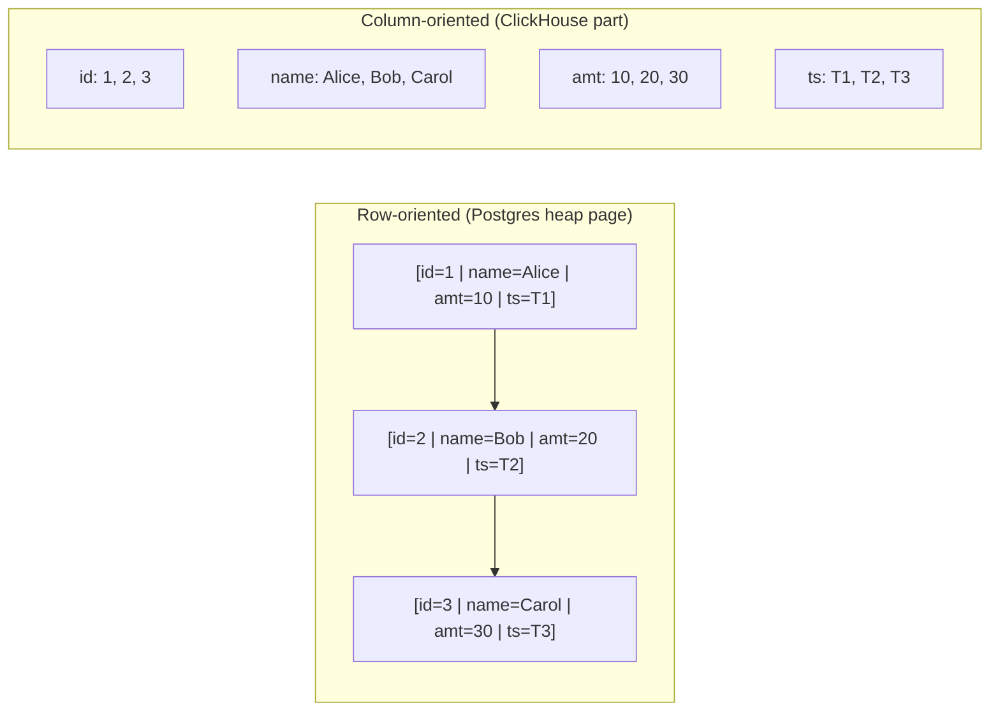
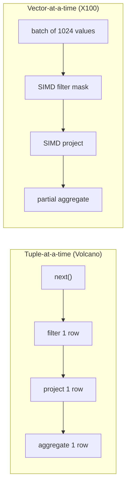
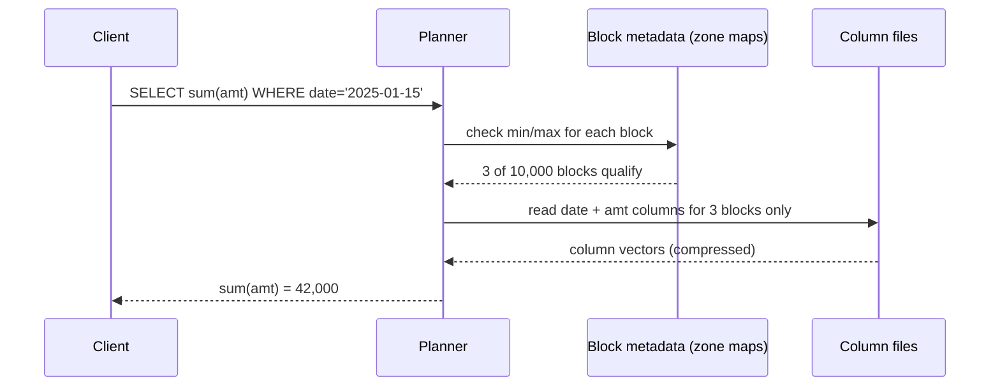
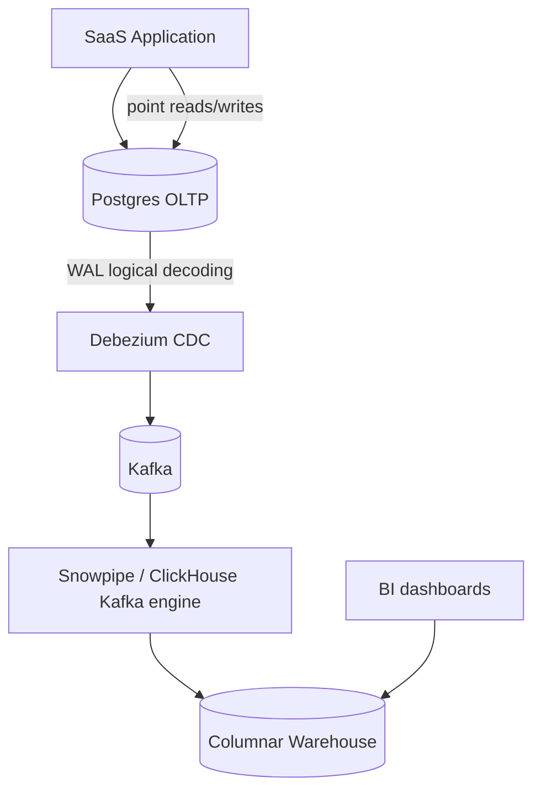

# OLTP vs OLAP: Row Stores, Column Stores, and Matching Shape to Workload

> **TL;DR**: OLTP workloads issue thousands of short transactions per second, each touching a handful of rows by key. OLAP workloads issue a few queries per minute, each scanning millions to billions of rows and aggregating them. Row-oriented storage (Postgres, MySQL) keeps full tuples contiguous for fast point access. Column-oriented storage (Redshift, BigQuery, ClickHouse, Snowflake) keeps each attribute contiguous, compresses 5 to 20x better[^1], and runs aggregates 10 to 100x faster[^2]. Matching storage layout to workload shape is the single highest-leverage data architecture decision you will make. Get it wrong and your dashboard queries take 30 seconds on Postgres; get it right and Cloudflare scans 1.61 quadrillion events in under 2 seconds on ClickHouse[^3].

## Learning Objectives

After this module, you will be able to:

- [ ] Distinguish OLTP and OLAP workloads by access pattern, not just name
- [ ] Explain why columnar storage wins at aggregations and loses at row lookups
- [ ] Recognize compression tricks: dictionary encoding, run-length, bit-packing, delta, frame-of-reference
- [ ] Describe vectorized execution and why it replaced tuple-at-a-time processing
- [ ] Choose between Postgres, Redshift, BigQuery, ClickHouse, and Snowflake for a given workload
- [ ] Design a system that routes transactional and analytical traffic to the right engine

## Intuition

Imagine a filing cabinet in an accounting office.

**Row-oriented storage** is like filing one complete invoice per folder. Each folder has the customer name, line items, total, and date stapled together. When a customer calls asking about invoice #4,827, you pull one folder and have everything. Fast. But when the CFO asks "what was total revenue last quarter?", you must open every single folder, find the total field, and add them up. Thousands of folders, one field each. Painfully slow.

**Column-oriented storage** is like keeping separate binders: one binder for all customer names, one for all totals, one for all dates. Now the CFO's question is trivial: grab the totals binder, flip through it, sum everything. One binder, sequential reading. But when that customer calls about invoice #4,827, you need to look up position 4,827 in every binder and stitch the fields back together. Slower for that one request.

Neither layout is better in absolute terms. The right choice depends on whether your workload looks like "find one invoice" (OLTP) or "sum all invoices" (OLAP). The rest of this chapter makes that intuition precise, shows you the compression and execution tricks that make columnar stores 10 to 100x faster for analytics, and gives you a decision framework for routing queries to the right engine.

[Storage Engines](./00-storage-engines.md) introduced B-trees and LSM-trees as the engine layer underneath. This chapter moves one level up: given that you have a storage engine, how does the physical arrangement of columns versus rows on disk determine what queries run fast?

## Theory

### Workload shapes

OLTP and OLAP are not database brands. They are workload shapes defined by access pattern.

| Dimension | OLTP | OLAP |
|-----------|------|------|
| Query type | Point reads, inserts, updates by key | Scans, joins, GROUP BY, aggregates |
| Rows per query | 1 to 100 | Millions to billions |
| Concurrency | Thousands of users | Tens of analysts |
| Latency target | 1-10 ms | Seconds to minutes |
| Write pattern | Single-row mutations inside transactions | Bulk append (ETL, streaming) |
| Example | "Charge card $42.50 for user 7" | "Revenue by country, last 90 days" |

The grey zone between them is HTAP (hybrid transactional/analytical processing). Systems like TiDB with TiFlash and SingleStore attempt both by maintaining two physical copies: a row store for transactions and a columnar replica for analytics, kept consistent via a replication log[^4]. In practice, HTAP works at small to medium scale. Above roughly 100 GB of warm analytical data, most serious stacks split into dedicated engines connected by change data capture.

### Row vs column layout

The difference is physical. Consider a table with four columns and three rows:

```text
id | name  | amount | timestamp
1  | Alice | 10     | T1
2  | Bob   | 20     | T2
3  | Carol | 30     | T3
```

A **row store** (Postgres, MySQL) writes bytes to disk as:

```text
[1|Alice|10|T1] [2|Bob|20|T2] [3|Carol|30|T3]
```

Each tuple is contiguous. Fetching row 2 requires one seek. Updating row 2 requires one page rewrite.

A **column store** (ClickHouse, Redshift, Parquet) writes bytes as:

```text
id:     [1, 2, 3]
name:   [Alice, Bob, Carol]
amount: [10, 20, 30]
ts:     [T1, T2, T3]
```

Each attribute is contiguous. A query `SELECT SUM(amount)` reads only the amount column: 12 bytes instead of the full 60+ bytes of all rows. On a wide fact table with 50 to 500 columns, a typical analytical query touches 3 to 6 columns. The column store reads roughly 10x fewer bytes than the row equivalent[^2].



*Figure 1: The same table stored row-major puts full tuples together for fast point access; column-major puts each attribute together for fast scans and compression.*

The compression benefit compounds the I/O savings. Columns of the same type contain long runs of similar values. A status column with three distinct values compresses to near-zero with dictionary encoding. Timestamp columns with monotonically increasing values compress with delta encoding. Row stores interleave heterogeneous types, defeating most compression schemes. Typical columnar compression ratios are 5 to 20x on warehouse data[^1].

### The column-store compression toolkit

Five lightweight encodings dominate, all applied per-column block:

1. **Dictionary encoding.** Map distinct values to small integers. Store the integers instead of the original strings. Works best on low-cardinality columns (country codes, status enums). Parquet defaults to dictionary encoding and falls back to plain when the dictionary grows too large (the parquet-mr implementation defaults to a 1 MB page-size threshold)[^5].

2. **Run-length encoding (RLE).** Store (value, count) pairs. A sorted column with 10,000 consecutive "US" entries becomes one pair: ("US", 10000). Works on sorted or near-sorted columns.

3. **Bit-packing.** Store integers using only enough bits to represent the observed range. If all values in a block fit in 5 bits, store 5 bits per value instead of 32.

4. **Delta encoding.** Store consecutive differences. A timestamp column [1000, 1001, 1002, 1003] becomes [1000, 1, 1, 1]. The deltas are tiny and compress further with bit-packing or LZ4.

5. **Frame-of-reference.** Subtract a per-block reference value before bit-packing. If a block's values range from 1,000,000 to 1,000,100, subtract 1,000,000 and bit-pack the residuals (0 to 100) in 7 bits each.

These techniques compose. Parquet's `DELTA_BINARY_PACKED` applies delta, then frame-of-reference per miniblock, then bit-packs with a per-miniblock bit width[^5]. ClickHouse's Delta codec subtracts consecutive values as a preprocessor, then feeds the result to LZ4 or ZSTD. The result: monotonically increasing columns (timestamps, auto-increment IDs) compress to near-zero overhead.

> [!TIP]
> Many operations (equality filters, range predicates) can execute directly on encoded data without decoding first. This is called "operating on compressed data" and was formalized by Abadi et al. in SIGMOD 2006[^6].

### Vectorized execution

Classic database engines use the Volcano iterator model: each operator calls `next()` and receives one tuple. The overhead of virtual function calls, branch mispredictions, and pointer chasing per tuple dwarfs the actual computation.

MonetDB/X100 (Boncz et al., CIDR 2005) replaced this with vectorized execution: operators process batches of 1,024 to 8,192 values at a time[^7]. Each batch fits in L1/L2 cache. The hot loop becomes a tight SIMD-friendly iteration over a dense array of decoded values. A single AVX-512 instruction processes 16 INT32 values simultaneously.

The result: 10 to 100x CPU reduction versus tuple-at-a-time on analytical queries[^7]. The 2024 CIDR Test of Time Award committee selected X100 as the foundation of almost every modern analytical engine. ClickHouse, DuckDB, Snowflake, Databricks Photon, and Meta's Velox all use vector-at-a-time execution[^8].



*Figure 2: Volcano iterators pay per-tuple interpretation overhead; vectorized engines batch 1,024+ values per call, turning the hot path into cache-friendly SIMD loops.*

Why vectorized over JIT-compiled execution (HyPer, Umbra)? Vectorized primitives remain readable C++ that is portable, debuggable, and does not require a compiler at runtime. Kersten et al. (VLDB 2018) showed that vectorized and compiled approaches converge in performance on modern hardware, but vectorized wins on engineering simplicity.

### Zone maps and data skipping

Every columnar engine slices data into blocks. Each block records per-column metadata: minimum value, maximum value, null count, and sometimes a bloom filter. At query time, the planner compares the `WHERE` predicate against block metadata and skips blocks that cannot contain matching rows.

- **Redshift:** 1 MB blocks with zone maps[^9].
- **Snowflake:** 50 to 500 MB micro-partitions with min/max per column[^10].
- **ClickHouse:** 8,192-row granules with a sparse primary index plus data-skipping indices (minmax, bloom_filter, set)[^11].
- **Parquet:** Row groups (128 MB default in Spark; spec recommends 512 MB-1 GB) with column statistics in the footer.

A query `WHERE event_date = '2025-01-15'` on a table sorted by date reads only the few blocks whose min/max bracket that date. On a well-clustered table, pruning ratios of 100 to 1,000x are common[^10].



*Figure 3: Zone-map pruning skips 99.97% of blocks before reading any column data, the core efficiency move of column stores on sorted data.*

The catch: pruning only works when data is clustered on the predicate column. Random inserts defeat it. Snowflake's Automatic Clustering and ClickHouse's `ORDER BY` on the MergeTree engine exist specifically to maintain sort order so zone maps stay effective.

## Real-World Example

### Cloudflare's migration from Postgres/Citus to ClickHouse

Cloudflare's HTTP analytics pipeline processes every HTTP request that flows through their network. By 2018, the system handled an average of 6 million requests per second (peaking at 8M/s), generating 11 million rows per second of total insert throughput across all pipelines into a 36-node ClickHouse cluster[^12].

**Before ClickHouse**, Cloudflare used PostgreSQL with Citus for sharding. Analytical queries over billions of log rows were slow. Storage costs were high because row-oriented Postgres stores each log entry as a full tuple.

**After ClickHouse**, each row occupies 36.74 bytes on average (with 3x replication factor) compared to 1,630 bytes in the original Cap'n Proto format. That is a 44x reduction. Annual storage cost for one year of logs dropped from $28M (raw) to $1.9M (ClickHouse compressed)[^12].

The architecture uses ClickHouse's MergeTree engine with:

- **Sparse primary index:** One entry per 8,192-row granule, so the index fits in RAM even for tables with hundreds of billions of rows[^11].
- **Data-skipping indices:** Bloom filters and minmax indices on high-cardinality columns let queries skip entire granule ranges.
- **Vectorized execution:** Columns processed in chunks of 1,024+ values, staying in L1/L2 cache with SIMD where available.
- **Immutable parts + background merges:** Inserts create new parts; a background process merges them like LSM compaction, sacrificing fine-grained updates for write throughput.

By 2025, Cloudflare demonstrated a single query scanning 1.61 quadrillion events in under 2 seconds[^3]. The lesson: columnar storage with vectorized execution and zone-map pruning turns "impossible" analytical queries into routine operations, but only when the workload is scan-heavy and append-mostly. Point updates remain expensive.

## Trade-offs

| Approach | Pros | Cons | Best when | Our Pick |
|----------|------|------|-----------|----------|
| Row store (Postgres, MySQL) | Fast single-row reads/writes, strong ACID, mature tooling | Slow wide scans, poor compression on wide tables | OLTP apps, operational databases | **Default for transactional workloads** |
| Columnar MPP (Redshift, Snowflake, BigQuery) | Fast aggregations, 5-20x compression, elastic compute | Expensive single-row lookups, slow updates | Data warehousing, BI, reporting | **Default for analytical workloads** |
| Columnar real-time (ClickHouse, Druid) | Sub-second analytics on fresh data, high ingest rate | Complex to operate, limited joins, fewer transactions | Dashboards, real-time analytics, observability | When freshness matters more than SQL richness |
| HTAP (TiDB, SingleStore) | One system for both workloads | Neither as good as specialists at scale | Small data, simple ops, strong freshness needs | Only below ~100 GB warm analytical data |
| Columnar embedded (DuckDB) | In-process, zero-copy with Arrow/Pandas, no servers | Single-node, not for multi-user concurrent writes | Data science, edge analytics, local exploration | When you need analytics without infrastructure |

## Common Pitfalls

> [!WARNING]
> **Running aggregates on your OLTP database.** A `SELECT COUNT(*) ... GROUP BY` on a 500M-row Postgres table drags the entire heap through buffer cache, takes 30+ seconds, and evicts hot OLTP pages. Move analytics off: use CDC into a columnar warehouse, or at minimum a dedicated read replica.

> [!WARNING]
> **Single-row updates in a column store.** An `UPDATE events SET status='ok' WHERE id=42` rewrites an entire micro-partition or 8,192-row granule, spiking write amplification. Column stores are append-only by design. Batch updates, or keep mutations in your OLTP system and replicate resolved state to the warehouse.

> [!WARNING]
> **Losing zone-map pruning to shuffled inserts.** If inserts arrive out of order, every micro-partition's date min/max spans weeks. The planner cannot prune and reverts to full scans. Define a clustering key or sort key on your primary predicate column and trigger periodic reclustering.

> [!WARNING]
> **High-cardinality dictionary blowout.** UUID or free-text columns blow past the dictionary size threshold on the first page, falling back to plain encoding. Compression doubles in size and query cost doubles. Hash high-cardinality identifiers into fixed-width columns, or use specialized encodings like DELTA_BYTE_ARRAY for sorted strings.

> [!WARNING]
> **Forgetting BigQuery's per-byte billing.** A `SELECT *` on a 50 TiB table costs ~$312 per run at $6.25/TiB on-demand[^13]. Project only needed columns, use partition and cluster filters, and set max-bytes-billed guardrails.

## Exercise

You run a SaaS product on Postgres that is now struggling with 30-second dashboard queries aggregating across 500M rows. Design a two-system architecture: decide what goes where, how data moves, what lag is acceptable, and which warehouse you pick given a $10k/month budget.

<details>
<summary>Hint</summary>

Think about what stays in Postgres (transactional writes, point lookups by user ID) versus what moves to a columnar engine (aggregations, GROUP BY, time-range scans). Consider CDC as the bridge. Estimate storage: 500M rows at ~200 bytes each is ~100 GB raw, which compresses to 20-30 GB in a column store.

</details>

<details>
<summary>Solution</summary>

**Architecture:**



*Figure 4: Postgres handles transactional traffic; CDC streams changes to a columnar warehouse where dashboards query without impacting OLTP performance.*

**What stays in Postgres:** All transactional writes, user-facing point reads, and anything requiring ACID transactions. Postgres remains the source of truth.

**What moves to the warehouse:** All analytical queries (aggregations, GROUP BY, time-range scans, dashboard queries). The 500M-row table that caused 30-second queries will run in 1-3 seconds on a column store.

**Data movement:** Debezium captures Postgres WAL changes and publishes to Kafka. The warehouse ingests from Kafka with sub-minute lag. For most dashboards, 30-60 second staleness is acceptable.

**Warehouse choice on $10k/month:**

- 100 GB raw compresses to ~20-30 GB in a column store.
- **ClickHouse Cloud:** ~$2-4k/month for this scale with sub-second queries. Best if you need real-time freshness.
- **Snowflake:** ~$3-5k/month with an XS warehouse running a few hours/day. Best if your team prefers managed SQL.
- **BigQuery:** ~$1-3k/month on-demand if queries are selective (partition pruning). Risky if analysts run `SELECT *`.

**Trade-off accepted:** You add operational complexity (Kafka, CDC, a second system) in exchange for 10-100x faster analytics and zero impact on transactional performance. The 30-60 second lag is invisible to dashboard users who previously waited 30 seconds for stale results anyway.

</details>

## Key Takeaways

- Access pattern, not data size, determines whether you need a row store or a column store. A 1 TB table with point lookups belongs in Postgres; a 10 GB table with GROUP BY queries belongs in a column store.
- Column stores read 10x fewer bytes by skipping unneeded columns, then compress the remaining bytes 5-20x with dictionary, RLE, delta, bit-packing, and frame-of-reference encodings.
- Vectorized execution (batches of 1,024+ values) replaced tuple-at-a-time processing in every modern analytical engine, delivering 10-100x CPU improvement.
- Zone maps and data skipping turn O(N) scans into O(matching-blocks) lookups, but only when data is sorted on the predicate column.
- HTAP systems are a compromise. Above ~100 GB of warm analytical data, split into dedicated OLTP and OLAP engines connected by CDC.
- Cloud warehouses bill per byte scanned (BigQuery) or per compute-second (Snowflake, Redshift). A careless `SELECT *` can cost hundreds of dollars.
- If you are writing `SELECT COUNT(*) ... GROUP BY ...` against your OLTP database and it takes more than a few seconds, move it to a column store.

## Further Reading

- [Column-Stores vs. Row-Stores: How Different Are They Really?](https://dl.acm.org/doi/10.1145/1376616.1376712) - Abadi et al., SIGMOD 2008. The definitive study isolating the effect of each column-store technique; read this to understand why "just add a column index to Postgres" does not work.
- [MonetDB/X100: Hyper-Pipelining Query Execution](https://cidrdb.org/cidr2005/papers/P19.pdf) - Boncz et al., CIDR 2005. The vectorized execution paper that every modern OLAP engine builds on; 2024 CIDR Test of Time Award winner.
- [HTTP Analytics for 6M requests per second using ClickHouse](https://blog.cloudflare.com/http-analytics-for-6m-requests-per-second-using-clickhouse/) - Cloudflare engineering, 2018. Concrete numbers on migrating from Postgres/Citus to ClickHouse with 44x storage reduction.
- [The Snowflake Elastic Data Warehouse](https://dl.acm.org/doi/10.1145/2882903.2903741) - Dageville et al., SIGMOD 2016. Micro-partitions, virtual warehouses, and compute-storage separation explained by the architects.
- [Dremel: Interactive Analysis of Web-Scale Datasets](https://research.google/pubs/dremel-interactive-analysis-of-web-scale-datasets/) - Melnik et al., VLDB 2010. The basis for BigQuery; introduces definition/repetition levels for nested columnar data that Parquet later adopted.
- [The Design and Implementation of Modern Column-Oriented Database Systems](https://www.cs.umd.edu/~abadi/papers/abadi-column-stores.pdf) - Abadi, Boncz, Harizopoulos, FTDB 2013. Book-length survey covering compression, execution, and system design for column stores.
- [DuckDB: an Embeddable Analytical Database](https://duckdb.org/pdf/SIGMOD2019-demo-duckdb.pdf) - Raasveldt and Muhleisen, SIGMOD 2019. The "SQLite for analytics" pitch; explains why embedded columnar matters for data science.
- [Apache Parquet Encodings Specification](https://parquet.apache.org/docs/file-format/data-pages/encodings/) - Exact bit-level detail on dictionary, RLE, delta, and frame-of-reference encodings used across the ecosystem.

## Flashcards

**Q:** What is the fundamental difference between OLTP and OLAP workloads?
**A:** OLTP issues thousands of short transactions per second, each touching a few rows by key (point access). OLAP issues a few queries per minute, each scanning millions to billions of rows with aggregation (wide scans). The access pattern, not the data size, defines the workload.

**Q:** Why does columnar storage make aggregations faster?
**A:** A column store reads only the columns touched by the query (typically 3-6 out of 50-500), reducing I/O by ~10x. The homogeneous column data also compresses 5-20x better and fits in CPU cache for SIMD processing.

**Q:** Name the five core compression techniques used in column stores.
**A:** Dictionary encoding (map values to small integers), run-length encoding (store value + count pairs), bit-packing (use minimum bits per value), delta encoding (store consecutive differences), and frame-of-reference (subtract a per-block reference before bit-packing).

**Q:** What is vectorized execution and why does it matter?
**A:** Vectorized execution processes batches of 1,024-8,192 values per operator call instead of one tuple at a time. This eliminates per-tuple virtual-call overhead, keeps data in L1/L2 cache, and enables SIMD instructions. It delivers 10-100x CPU improvement over Volcano-style iterators.

**Q:** What are zone maps and when do they fail?
**A:** Zone maps are per-block min/max metadata that let the query planner skip blocks whose value range does not match the WHERE predicate. They fail when data is not sorted on the predicate column, because every block's min/max spans the full value range and nothing can be pruned.

**Q:** When should you use HTAP instead of separate OLTP and OLAP systems?
**A:** Use HTAP (TiDB, SingleStore) only when analytical data is below ~100 GB warm, operations are simple, and you need sub-second freshness between writes and reads. Above that scale, dedicated systems connected by CDC outperform HTAP on both axes.

**Q:** What is the cost risk of BigQuery on-demand pricing?
**A:** BigQuery on-demand charges $6.25 per TiB scanned. A SELECT * on a 50 TiB table costs ~$312 per run. Mitigation: project only needed columns, use partition/cluster filters, and set max-bytes-billed guardrails.

**Q:** How did Cloudflare achieve 44x storage reduction with ClickHouse?
**A:** By moving from row-oriented storage (Cap'n Proto at 1,630 bytes/row) to ClickHouse's columnar MergeTree engine (36.74 bytes/row with 3x replication). Columnar layout plus dictionary, delta, and LZ4 compression eliminated redundancy across the homogeneous log columns.

**Q:** What is late materialization in column stores?
**A:** Late materialization keeps data in column-at-a-time format as long as possible during query execution, reconstructing full rows only for the final output projection. This lets filters and joins operate on compressed column vectors, avoiding the cost of stitching rows that will be filtered out.

**Q:** What is the standard architecture for separating OLTP and OLAP workloads?
**A:** OLTP database (Postgres/MySQL) handles transactions. CDC (Debezium) captures WAL changes into Kafka. A loader ingests into a columnar warehouse (Snowflake/BigQuery/ClickHouse). BI tools query the warehouse. Analytics never hits the transactional database.

**Q:** Why is a single-row UPDATE expensive in a column store?
**A:** Column stores use immutable blocks (micro-partitions or granules). An UPDATE must tombstone the old block and write a new one containing the modified row, rewriting thousands of co-located rows. This is why column stores are append-only by design and single-row mutations belong in a row store.

**Q:** What engines won the 2024 CIDR Test of Time Award and why?
**A:** MonetDB/X100 won for introducing vectorized query execution in 2005. The committee recognized it as the foundation of ClickHouse, DuckDB, Snowflake, Databricks Photon, and Meta's Velox, making it the most influential analytical execution model of the past two decades.

## References

[^1]: Abadi, Boncz, Harizopoulos, "The Design and Implementation of Modern Column-Oriented Database Systems", FTDB 2013. https://www.cs.umd.edu/~abadi/papers/abadi-column-stores.pdf
[^2]: Abadi, Madden, Hachem, "Column-Stores vs. Row-Stores: How Different Are They Really?", SIGMOD 2008. https://dl.acm.org/doi/10.1145/1376616.1376712
[^3]: ClickHouse, "How Cloudflare uses ClickHouse to scale analytics at quadrillion-row scale", 2026. https://clickhouse.com/blog/cloudflare
[^4]: Huang et al., "TiDB: A Raft-based HTAP Database", VLDB 2020. https://dl.acm.org/doi/10.14778/3415478.3415535
[^5]: Apache Parquet, "Encodings" specification. https://parquet.apache.org/docs/file-format/data-pages/encodings/
[^6]: Abadi, Madden, Ferreira, "Integrating Compression and Execution in Column-Oriented Database Systems", SIGMOD 2006. https://15721.courses.cs.cmu.edu/spring2016/papers/abadi-sigmod2006.pdf
[^7]: Boncz, Zukowski, Nes, "MonetDB/X100: Hyper-Pipelining Query Execution", CIDR 2005. https://cidrdb.org/cidr2005/papers/P19.pdf
[^8]: CWI, "Test of Time Award for paper on vectorized execution", CIDR 2024. https://www.cwi.nl/en/news/test-of-time-award-for-paper-on-vectorized-execution/
[^9]: AWS Documentation, "Columnar storage" (Amazon Redshift). https://docs.aws.amazon.com/redshift/latest/dg/c_columnar_storage_disk_mem_mgmnt.html
[^10]: Snowflake Documentation, "Micro-partitions & Data Clustering". https://docs.snowflake.com/en/user-guide/tables-clustering-micropartitions
[^11]: ClickHouse Documentation, "MergeTree" (primary index, granules, data-skipping indices). https://clickhouse.com/docs/engines/table-engines/mergetree-family/mergetree
[^12]: Bocharov, "HTTP Analytics for 6M requests per second using ClickHouse", Cloudflare Engineering blog, 2018. https://blog.cloudflare.com/http-analytics-for-6m-requests-per-second-using-clickhouse/
[^13]: Google Cloud, "BigQuery pricing: On-demand compute pricing". https://cloud.google.com/bigquery/pricing#on-demand-compute-pricing
