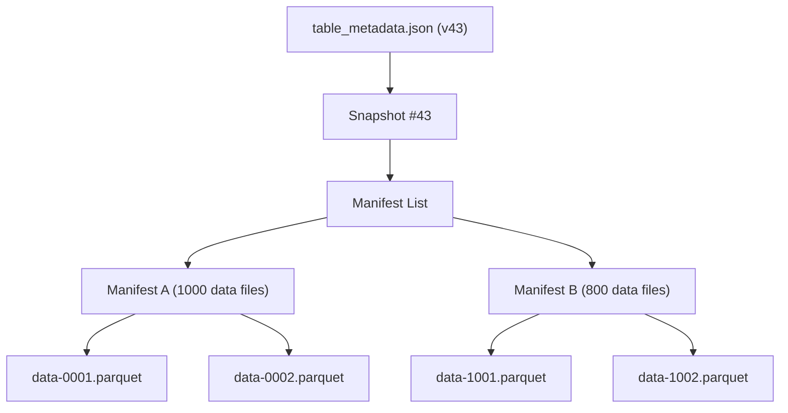
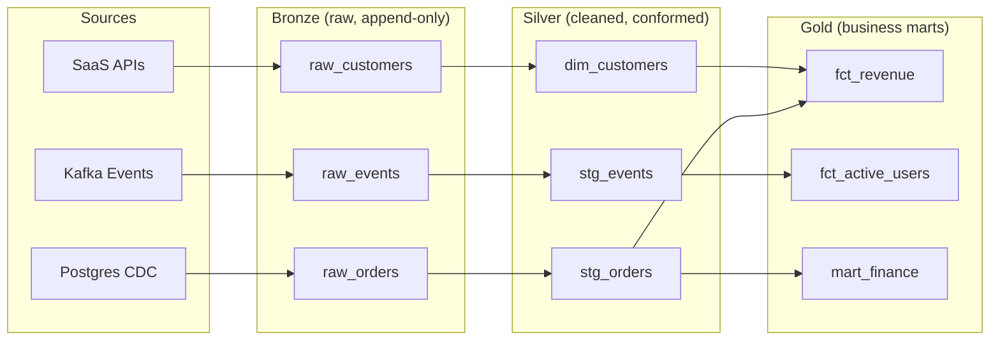
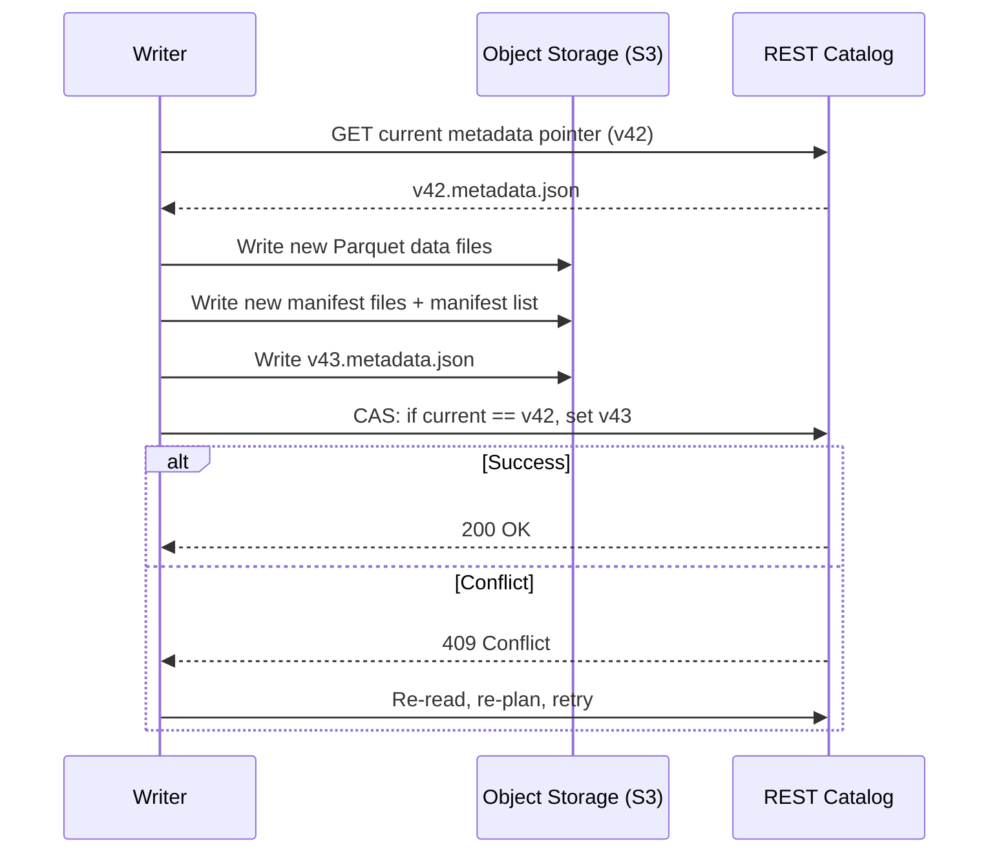
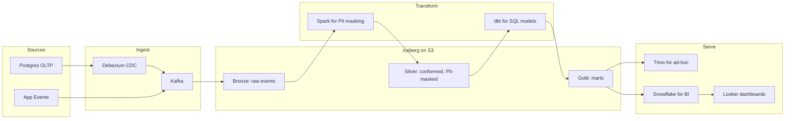

# Data Warehouses and Data Lakes: Structure, Schema, and the Lakehouse

> **TL;DR**: A data warehouse is a schema-first columnar database where the vendor owns the storage format. A data lake is raw Parquet on object storage at ~$0.023/GB-month[^1] where any engine can read the files. A lakehouse adds ACID transactions, time travel, and schema evolution to the lake via open table formats (Iceberg, Delta Lake, Hudi) without giving up multi-engine access or cheap storage. Netflix migrated over a million Hive tables to Iceberg[^2]; Uber runs 4,000+ Hudi tables across several petabytes[^3]. The lakehouse is not a marketing term. It is the architectural pattern that resolved the warehouse-vs-lake tension, and understanding its metadata layer is now table stakes for any data-intensive system design.

## Learning Objectives

After this module, you will be able to:

- [ ] Distinguish warehouses, lakes, and lakehouses by storage, compute, and schema model
- [ ] Choose between Redshift, BigQuery, and Snowflake based on workload and ops model
- [ ] Explain how Iceberg, Delta Lake, and Hudi add ACID to object storage
- [ ] Design a medallion (bronze, silver, gold) architecture with ingestion, transformation, and serving layers
- [ ] Estimate cost drivers: storage, compute, egress, and query units

## Intuition

You run a library.

**The warehouse approach** is like a traditional library with a strict cataloging system. Every book gets a Dewey Decimal number before it hits the shelf. Finding anything is fast because the librarian controls the format. But you can only use the library's own card catalog, you pay rent on a premium building, and if you want to lend books to the physics lab next door, you must photocopy them first.

**The data lake approach** is like dumping every book, pamphlet, and napkin sketch into a massive warehouse with cheap rent. Storage is nearly free. Anyone with a flashlight can walk in and read. But there is no catalog. Two people can shelve conflicting editions of the same book simultaneously, and nobody notices until a researcher cites the wrong one.

**The lakehouse approach** keeps the cheap warehouse but adds a librarian with a ledger. The ledger tracks exactly which books are on which shelf, which version is current, and who checked what out. The books stay in the same cheap building. Any researcher can still walk in. But now you have a single source of truth, atomic check-ins, and a history of every change.

That ledger is the open table format. The cheap building is object storage. The researchers are your query engines. The rest of this chapter makes that precise.

[OLTP vs OLAP](./01-oltp-vs-olap.md) established that analytical workloads need columnar storage and scan-heavy engines. This chapter answers the next question: where does that columnar data live in the cloud era, and who controls it?

## Theory

### Warehouse vs lake vs lakehouse first principles

A **data warehouse** bundles storage format, catalog, compute engine, and SQL interface behind one vendor. You define schemas before loading (schema-on-write). The system owns the physical format. Snowflake stores data in proprietary immutable micro-partitions; BigQuery uses Capacitor; Redshift uses its own columnar blocks. Only the vendor's engine reads them natively.[^4]

A **data lake** is the opposite: raw files (Parquet, ORC, Avro, JSON) sit in cheap object storage. Any engine, Spark, Trino, Flink, DuckDB, Python, can read them. Schema is a convention applied at read time (schema-on-read). Cheap and flexible, but with no ACID guarantees and a well-known cliff when concurrent writers or schema changes appear.

A **lakehouse** layers an open table format over the lake. Data stays as Parquet in S3 or GCS. A metadata tree (snapshots, manifests, transaction logs) tracks which files belong to which version of the table. Commits are atomic pointer swaps. The result: ACID transactions, time travel, and schema evolution on cheap object storage, readable by any engine that speaks the format.[^4]

```mermaid
flowchart TB
    subgraph Warehouse["Warehouse (Snowflake / BigQuery / Redshift)"]
        W1[SQL Clients] --> W2[Proprietary Query Engine]
        W2 --> W3[Proprietary Metadata + Catalog]
        W3 --> W4[Proprietary Storage Format]
        W4 --> W5[Object Storage]
    end
    subgraph Lake["Raw Lake (S3 + Parquet + Trino)"]
        L1[Any Engine] --> L2[Hive Metastore]
        L2 --> L3[Parquet / ORC Files]
        L3 --> L4[Object Storage]
    end
    subgraph Lakehouse["Lakehouse (Iceberg / Delta)"]
        H1[Any Engine] --> H2[Open REST Catalog]
        H2 --> H3[Open Table Format Metadata]
        H3 --> H4[Parquet Files]
        H4 --> H5[Object Storage]
    end
```

*The three stacks share object storage at the bottom but diverge on which layers are proprietary. The lakehouse opens everything except compute.*

The core tension: warehouses are lowest-ops and fastest for pure SQL at small-to-medium scale, but they lock data into proprietary formats and bill heavily for compute. Lakes are cheapest per terabyte and maximally open, but without discipline they rot into "data swamps." Lakehouses keep the open storage and add the warehouse's correctness guarantees, trading maturity for flexibility.

### The big three managed warehouses

**Redshift** (AWS, 2012) started as shared-nothing MPP with compute and storage coupled per node. The RA3 family decoupled them: compute nodes use local SSD for hot data while S3 stores everything durably. Redshift Spectrum extends queries into lake data without a separate engine. The catch: distribution key (`DISTKEY`) and sort key (`SORTKEY`) choices have dramatic performance impact. A bad distribution key on a fact-table join can add 30 to 60 seconds to every query that touches it.[^5]

**BigQuery** (GCP, 2011) is truly serverless. Dremel is the query engine, Colossus is storage, Jupiter provides the petabit-scale bisection-bandwidth network, and Borg allocates compute.[^6] Slot-based pricing decouples concurrency from capacity. You never provision nodes. The trade-off: the pricing model is opaque, hard to predict, and a careless `SELECT *` on a 50 TB table costs ~$312 at on-demand rates.

**Snowflake** (multi-cloud, 2014) separates storage (immutable micro-partitions of 50 to 500 MB uncompressed, ~16 MB compressed) from compute ("virtual warehouses" that spin up and down independently).[^7][^8] Key features: zero-copy clones (a metadata operation, no data duplication), time travel up to 90 days, automatic clustering, and per-second billing. The Snowflake architecture paper (Dageville et al., SIGMOD 2016) remains the canonical reference for this design.[^8]

All three now support reading open table formats (Iceberg, Delta) to varying degrees. The walls between warehouse and lakehouse are thinning.

### Table formats: Iceberg, Delta Lake, and Hudi

An open table format is a specification for tracking which files make up a logical table, plus metadata that enables ACID commits, time travel, schema evolution, and partition evolution, all on top of immutable Parquet files in object storage.

The three formats share the same core trick: table state is a pointer to a tree of metadata files, and a commit is an atomic swap of that pointer.

**Apache Iceberg** (Netflix, open-sourced 2018) uses a four-level metadata tree: `table_metadata.json` points to a snapshot, which points to a manifest list, which points to manifest files, which list data files. Each commit creates a new metadata root; an atomic compare-and-swap on the catalog pointer makes it current.[^9] Key innovations: hidden partitioning (partitions are derived transforms on source columns like `day(event_ts)`, so users never reference partition columns in SQL and partition-scheme changes do not break queries), O(1) scan planning via manifest lists, and full schema evolution without data rewrites.

**Delta Lake** (Databricks, open-sourced 2019, VLDB 2020 paper) uses a `_delta_log/` directory of numbered JSON log entries. Each commit appends a new file (`00000000000000000042.json`). Checkpoints (Parquet) compact log state into a single snapshot file; the protocol allows them at any committed version.[^10] The Spark reference implementation writes one every 10 commits by default (`delta.checkpointInterval`). Key innovations: Z-ordering for multi-column data skipping, optimistic concurrency via conflict detection on the log, and UniForm which now exposes Delta tables through the Iceberg REST API for cross-engine reads.

**Apache Hudi** (Uber, top-level Apache project 2020) was built for CDC ingestion. It supports two table types: Copy-on-Write (rewrites the file on each update, read-optimized) and Merge-on-Read (writes updates to delta logs merged at read time, write-optimized). Record-level indexing enables cheap upserts instead of whole-partition rewrites. Hudi manages over 4,000 tables and several petabytes at Uber, lowering ingestion latencies from several hours to under 30 minutes.[^3]

*Iceberg's metadata tree: each commit creates a new root pointer. Readers see a consistent snapshot; writers retry on conflict. Manifest files track per-file column statistics for pruning.*

**Which format to pick in 2026:** Iceberg has emerged as the de facto interoperability standard. Databricks acquired Tabular (the company founded by Iceberg's creators) in June 2024 and now invests in Delta UniForm as a bidirectional compatibility layer. Snowflake open-sourced Polaris Catalog the same week. Both major vendors now back Iceberg as the interoperability standard. The defensible recommendation: Databricks-native shop, use Delta (UniForm gives you Iceberg reads). Multi-engine or vendor-neutral, use Iceberg. CDC-heavy with record-level upserts, evaluate Hudi.

| Format | Origin | Commit mechanism | Best for | Catalog |
|--------|--------|-----------------|----------|---------|
| Iceberg | Netflix (2018) | Atomic metadata pointer swap via catalog | Multi-engine reads, partition evolution | REST Catalog (Polaris, Glue, Nessie) |
| Delta Lake | Databricks (2019) | Numbered JSON log in `_delta_log/` | Spark/Databricks ecosystem, Z-ordering | Unity Catalog, Glue |
| Hudi | Uber (2016) | Timeline of commit/compact/clean actions | CDC ingestion, record-level upserts | Hive Metastore, Glue |

### Medallion architecture and the modern analytics stack

The **medallion architecture** (Databricks-originated) organizes lakehouse tables into three quality tiers:

- **Bronze**: raw ingested data, append-only, matches source. Preserves replayability.
- **Silver**: cleansed, conformed, deduplicated, joined. Schema enforcement applied.
- **Gold**: business-ready aggregates, dimensional models, KPIs, ML feature tables.

Transformations between layers are typically written in **dbt** (SQL-native, version-controlled, with built-in tests and lineage) or Spark SQL, orchestrated by **Airflow**, Dagster, or Prefect. Ingestion from operational systems uses managed connectors (Fivetran, Airbyte) or [Change Data Capture](./04-change-data-capture.md) via Debezium into Kafka.

*Bronze preserves raw inputs for replayability; silver cleans and conforms; gold materializes business-facing marts. dbt models define each transformation as a versioned SQL SELECT.*

When does medallion beat Kimball star schemas? Medallion is a data-quality layering pattern; Kimball is a schema-design pattern. They compose: gold tables are often star schemas. Use medallion when you need replayability and incremental processing across multiple consumers. Use Kimball directly (skip bronze/silver) when your warehouse is small, your sources are stable, and you want the simplest possible BI layer.

Query engines for the lake tier include Trino (distributed SQL, formerly Presto), Athena (serverless Trino on AWS), Spark SQL, and DuckDB (embedded, single-node, excellent for local exploration). [Stream vs Batch Processing](./03-stream-vs-batch.md) covers how Flink and Spark Streaming feed data into these lakehouse patterns.

## Real-World Example

### Netflix's Iceberg migration

Netflix operates one of the largest analytical data lakes on earth: petabytes of Parquet and ORC files on S3.[^2] The problem was Hive at scale. Hive's partition model required S3 `LIST` operations to discover files. As tables grew to millions of partitions, planning a single query took minutes because listing is O(n) in partition count.

Ryan Blue and Dan Weeks built Iceberg to replace directory-based partition discovery with file-level manifests. The metadata tree tracks individual data files, not directories. Planning cost scales with matching files, not total partitions. By 2024, Netflix had migrated over a million Hive tables to Iceberg format.[^2]

Key engineering decisions:

- **Hidden partitioning** eliminates the "forgot to filter on partition_date" bug class. A table partitioned by `day(event_ts)` derives the partition predicate automatically from `WHERE event_ts > '2024-01-01'`.[^9]
- **Snapshot isolation** via atomic metadata swaps. Readers see a consistent view pinned to a snapshot. Writers retry on conflict. No distributed locks.
- **Multi-engine access.** The same Iceberg tables are read by Spark (batch), Trino (ad-hoc SQL), and Flink (streaming), all without data duplication.

*An Iceberg commit is an atomic compare-and-swap on the catalog pointer. No locks are held during data-file writes; conflicts are resolved optimistically on the metadata swap.*

The lesson: at petabyte scale, the metadata layer becomes the bottleneck, not the data layer. Iceberg's design insight was that tracking files (not directories) and committing atomically (not with locks) is what makes object-storage-based analytics viable. Airbnb independently reached the same conclusion, migrating from Hive to Iceberg to address Hive Metastore scalability bottlenecks, S3 consistency issues, and schema evolution challenges across multiple compute engines.[^11]

## Trade-offs

| Approach | Pros | Cons | Best when | Our Pick |
|----------|------|------|-----------|----------|
| Managed warehouse (Snowflake, BigQuery) | Turnkey, fast, low ops, strong SQL | Expensive at scale, vendor lock-in, limited ML workloads | Teams under ~100 data engineers, analytics-only | **Default for small-to-mid analytics teams** |
| Raw data lake (S3 + Parquet + Trino) | Cheapest (~$0.023/GB-month), open formats, any engine | No ACID, schema drift, small-file problem, governance burden | Very large scale (PB+), multi-engine, cost-sensitive | Only if you accept the ops burden |
| Lakehouse (Iceberg/Delta + Trino/Spark) | ACID on cheap storage, open catalogs, time travel, proven at PB scale | Still maturing tooling, compaction overhead, catalog fragmentation | Large orgs standardizing across engines, avoiding lock-in | **Default for data-intensive orgs at scale** |
| Hybrid (warehouse + lake) | Best of both: lake for raw/ML, warehouse for curated BI | Two systems, duplicated data, sync complexity | Most enterprises in practice; stepwise migration | Pragmatic starting point |

## Common Pitfalls

> [!WARNING]
> **Small file problem.** Streaming writes with short commit intervals (e.g. every 30 seconds) produce thousands of tiny files far below the optimal 256 to 512 MB range. Query planning dominates execution time. Fix: schedule compaction jobs (Iceberg's `rewrite_data_files`, Delta's `OPTIMIZE`, Hudi's async compaction) and increase commit intervals.

> [!WARNING]
> **Schema drift without a table format.** Raw Parquet in S3 has no schema-evolution contract. Hive applies types positionally; a new column added upstream is read as null or the wrong type. Downstream queries silently return wrong results. Fix: adopt a table format. Iceberg tracks columns by integer field IDs, making add, drop, rename, and widen safe without data rewrites.[^9]

> [!WARNING]
> **Aggressive VACUUM deleting live snapshots.** Running retention cleanup (Delta's `VACUUM`, Iceberg's `expire_snapshots`) with too-short retention deletes files still referenced by older snapshots. Long-running readers fail with "file not found." Fix: keep at least 7-day retention and coordinate with maximum expected job runtime.

> [!WARNING]
> **Distribution key mistakes in Redshift.** A poorly chosen `DISTKEY` on a large fact table forces terabytes of data redistribution on every join. The `EXPLAIN` plan shows `DS_BCAST_INNER` or `DS_DIST_BOTH` steps. Fix: set `DISTKEY` to the most common join column; use `DISTSTYLE ALL` for small dimensions.

> [!WARNING]
> **Over-partitioning on high-cardinality columns.** Partitioning by `user_id` produces millions of partitions with one tiny file each. Planning becomes slower than a full-table scan. Fix: partition by date truncations (day, month) and use Iceberg's `bucket[N]` transform for high-cardinality clustering.

## Exercise

Design the analytics platform for a fintech processing 500M events/day. Decide between Snowflake, BigQuery, and an Iceberg-on-S3 lakehouse. Specify ingestion path, transformation layer (dbt? Spark?), how you serve BI tools, and how you keep PII compliant.

Hint

Think about three axes: cost at 500M events/day (~50 GB/day raw, ~18 TB/year), multi-engine needs (ML team wants Spark, analysts want SQL), and PII requirements (column-level masking in silver, audit trail via time travel). Consider a hybrid: lakehouse for storage and heavy processing, warehouse for BI serving.

Solution

**Architecture:**

**Reasoning:**

- **Storage:** Iceberg on S3. At 50 GB/day compressed, yearly storage is ~18 TB at $0.023/GB-month = ~$5,000/year. A warehouse storing the same data costs 3-5x more.
- **Ingestion:** Debezium captures Postgres WAL into Kafka. App events land directly in Kafka. A Flink or Spark Streaming job writes bronze Iceberg tables with 5-minute commit intervals (avoids small-file problem).
- **Transformation:** Spark handles PII masking (tokenization, column-level encryption) at the bronze-to-silver boundary. dbt builds silver-to-gold models as SQL SELECTs, orchestrated by Airflow on a 15-minute schedule.
- **PII compliance:** Silver tables mask PII columns. Bronze retains raw data with restricted access (IAM + catalog-level row/column security). Iceberg time travel provides audit trail.
- **Serving:** Trino for ad-hoc analyst queries directly on Iceberg. Snowflake (XS warehouse, a few hours/day) for BI dashboards that need sub-second response on pre-aggregated gold tables. Total Snowflake cost: ~$2-3k/month.
- **ML access:** Data scientists read silver/gold Iceberg tables directly from Spark or Python (PyIceberg) without warehouse compute costs.

**Trade-off accepted:** Operational complexity (Kafka, Spark, Airflow, Trino, Snowflake) in exchange for ~60% lower storage costs, multi-engine flexibility, and no vendor lock-in on the data layer.

## Key Takeaways

- Warehouses buy convenience and speed; lakes buy flexibility and cost; lakehouses split the difference by adding ACID to cheap object storage via open table formats.
- Table formats (Iceberg, Delta, Hudi) are the quiet revolution in analytics infrastructure. They turn S3 into a transactional database without giving up multi-engine access.
- Iceberg has emerged as the de facto interoperability standard. Both Databricks and Snowflake now back it as the interoperability standard. Pick Delta for Databricks-native, Iceberg for multi-engine, Hudi for CDC-heavy upserts.
- Storage is cheap ($0.023/GB-month on S3). Compute is not. Every architectural choice is really a compute-cost choice.
- The small-file problem is the most common production failure in lakehouse deployments. Schedule compaction or your query performance will collapse.
- Schema-on-read works until it does not. Eventually you pay the schema tax; table formats let you pay it incrementally via evolution rather than upfront via rewrites.
- The medallion pattern (bronze/silver/gold) is a data-quality layering strategy, not a replacement for dimensional modeling. Gold tables are often Kimball star schemas.

## Further Reading

- [Lakehouse: A New Generation of Open Platforms](https://www.databricks.com/research/lakehouse-a-new-generation-of-open-platforms-that-unify-data-warehousing-and-advanced-analytics) - Armbrust et al., CIDR 2021. The foundational paper articulating the lakehouse thesis; required reading before any warehouse-vs-lake architecture decision.
- [The Snowflake Elastic Data Warehouse](https://dl.acm.org/doi/10.1145/2882903.2903741) - Dageville et al., SIGMOD 2016. The original architecture paper explaining micro-partitions, virtual warehouses, and compute-storage separation.
- [Apache Iceberg Table Spec](https://iceberg.apache.org/spec/) - The authoritative specification for snapshots, manifest lists, partition transforms, and schema evolution rules.
- [Delta Lake Transaction Log Protocol](https://github.com/delta-io/delta/blob/master/PROTOCOL.md) - The protocol spec explaining numbered JSON logs, checkpoints, and conflict resolution.
- [BigQuery under the hood](https://cloud.google.com/blog/products/bigquery/bigquery-under-the-hood) - Google's architectural overview of Dremel, Colossus, Borg, and Jupiter; explains why BigQuery can be truly serverless.
- [Setting Uber's Transactional Data Lake in Motion with Apache Hudi](https://www.uber.com/blog/ubers-lakehouse-architecture/) - Uber's public writeup of the COW vs MOR trade-off and why record-level indexing matters for CDC at scale.
- [Databricks + Tabular announcement](https://www.databricks.com/blog/databricks-tabular) - The June 2024 acquisition that signaled Iceberg as the shared standard; explains UniForm and the convergence thesis.
- [Introducing Polaris Catalog](https://www.snowflake.com/en/blog/introducing-polaris-catalog/) - Snowflake's open-source Iceberg REST catalog; explains the "no lock-in" positioning and multi-engine interoperability.

## Flashcards

**Q:** What is the fundamental difference between a data warehouse and a data lake?
**A:** A warehouse is schema-first with a proprietary storage format owned by one vendor's engine. A lake is schema-on-read with open files (Parquet/ORC) on object storage readable by any engine. The warehouse trades flexibility for convenience; the lake trades correctness guarantees for cost and openness.

**Q:** What problem does a lakehouse solve that neither warehouse nor lake solves alone?
**A:** A lakehouse adds ACID transactions, time travel, and schema evolution to cheap object storage without vendor lock-in. It eliminates the "two-tier" problem where data is duplicated between a lake (for ML/raw) and a warehouse (for BI), causing staleness and sync complexity.

**Q:** How does Iceberg achieve atomic commits on object storage?
**A:** Iceberg writes new data files and metadata to S3, then performs an atomic compare-and-swap on the catalog pointer (from v42.metadata.json to v43.metadata.json). If another writer committed first, the swap fails with a conflict and the writer retries. No distributed locks are held during writes.

**Q:** What is hidden partitioning in Iceberg?
**A:** Partitions are derived from source columns via transforms (e.g. `day(event_ts)`, `bucket(16, id)`) rather than being separate columns. Users query the source column normally; the engine derives partition predicates automatically. This eliminates the "forgot to filter on partition_date" bug class and allows partition-scheme changes without breaking queries.

**Q:** What are the three tiers of the medallion architecture?
**A:** Bronze (raw ingested data, append-only, matches source for replayability), Silver (cleansed, conformed, deduplicated, schema-enforced), and Gold (business-ready aggregates, dimensional models, KPIs). Each tier is a set of table-format tables with progressively higher data quality.

**Q:** When should you pick Delta Lake over Iceberg?
**A:** Pick Delta when you are a Databricks-native shop and want tight integration with Spark, Photon, and Unity Catalog. Delta's UniForm feature now exposes tables via the Iceberg REST API, so downstream engines can still read them. Pick Iceberg when you need true multi-engine access without a compatibility layer.

**Q:** What is the small-file problem in lakehouse deployments?
**A:** Streaming writes with short commit intervals produce thousands of tiny files (far below the optimal 256-512 MB). Query planning time grows with file count and dominates execution time. The fix is scheduled compaction (Iceberg's `rewrite_data_files`, Delta's `OPTIMIZE`) to merge small files into target-sized ones.

**Q:** How does Snowflake separate storage from compute?
**A:** Data is stored as immutable micro-partitions (50-500 MB uncompressed) in object storage (S3/GCS/Azure Blob). Compute runs in "virtual warehouses" that spin up and down independently, caching hot micro-partitions on local SSD. Multiple warehouses can read the same data concurrently without contention.

**Q:** What is the cost difference between lake storage and warehouse storage?
**A:** S3 Standard costs ~$0.023/GB-month. Warehouse storage (which includes proprietary indexing and metadata) typically costs 3-5x more. At petabyte scale, this difference compounds into millions of dollars annually, which is why Netflix, Uber, and Airbnb all chose lakehouse architectures.

**Q:** What is Hudi's Merge-on-Read (MOR) table type and when should you use it?
**A:** MOR writes updates to delta log files instead of rewriting the base Parquet file. Reads merge the base file with delta logs at query time. Use MOR for write-heavy CDC ingestion where low write latency matters more than read latency. Asynchronous compaction reconciles delta logs into base files in the background.

**Q:** Why did Netflix build Iceberg instead of using Hive?
**A:** Hive's partition model required S3 LIST operations to discover files. At Netflix's scale (millions of partitions), listing was O(n) in partition count and took minutes per query plan. Iceberg tracks individual files in manifest metadata, giving O(1) planning cost that scales with matching files, not total partitions.

**Q:** What is the role of a catalog in a lakehouse architecture?
**A:** The catalog maps table names to metadata-file pointers and mediates concurrent commits (providing the atomic compare-and-swap). It is the single coordination point. Options include AWS Glue, Snowflake's Polaris (open-source), Databricks' Unity Catalog, and any Iceberg REST Catalog implementation.

## References

[^1]: AWS, "S3 Pricing". https://aws.amazon.com/s3/pricing/
[^2]: Netflix, "Netflix's Apache Iceberg Data Lake Migration", AWS re:Invent 2024 (NFX306). https://aws.amazon.com/video/watch/3db41488539/
[^3]: Uber Engineering, "Uber Submits Hudi, an Open Source Big Data Library, to The Apache Software Foundation". https://www.uber.com/blog/apache-hudi/
[^4]: Armbrust et al., "Lakehouse: A New Generation of Open Platforms that Unify Data Warehousing and Advanced Analytics", CIDR 2021. https://www.databricks.com/research/lakehouse-a-new-generation-of-open-platforms-that-unify-data-warehousing-and-advanced-analytics
[^5]: AWS, "Choose the best distribution style", Amazon Redshift Database Developer Guide. https://docs.aws.amazon.com/redshift/latest/dg/c_best-practices-best-dist-key.html
[^6]: Google Cloud, "BigQuery under the hood", Tereshko and Tigani, Jan 2016. https://cloud.google.com/blog/products/bigquery/bigquery-under-the-hood
[^7]: Snowflake Documentation, "Micro-partitions & Clustering" (explains micro-partition design, 50-500 MB uncompressed, immutable). https://docs.snowflake.com/en/user-guide/tables-clustering-micropartitions
[^8]: Dageville et al., "The Snowflake Elastic Data Warehouse", SIGMOD 2016. https://dl.acm.org/doi/10.1145/2882903.2903741
[^9]: Apache Iceberg, "Iceberg Table Spec". https://iceberg.apache.org/spec/
[^10]: Delta Lake, "Delta Transaction Log Protocol", PROTOCOL.md. https://github.com/delta-io/delta/blob/master/PROTOCOL.md
[^11]: Airbnb Engineering, "Upgrading Data Warehouse Infrastructure at Airbnb". https://medium.com/airbnb-engineering/upgrading-data-warehouse-infrastructure-at-airbnb-a4e18f09b6d5
