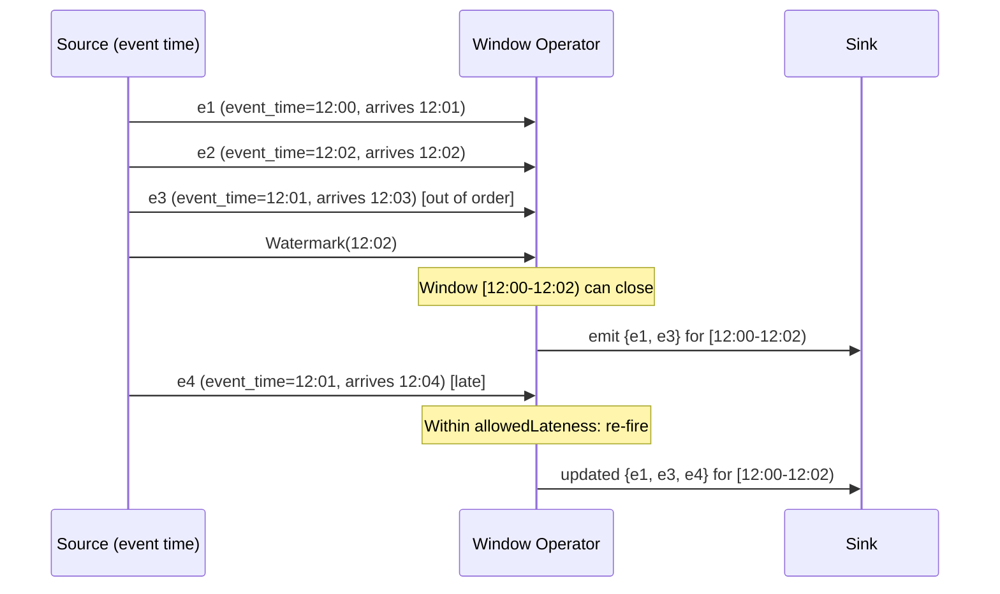
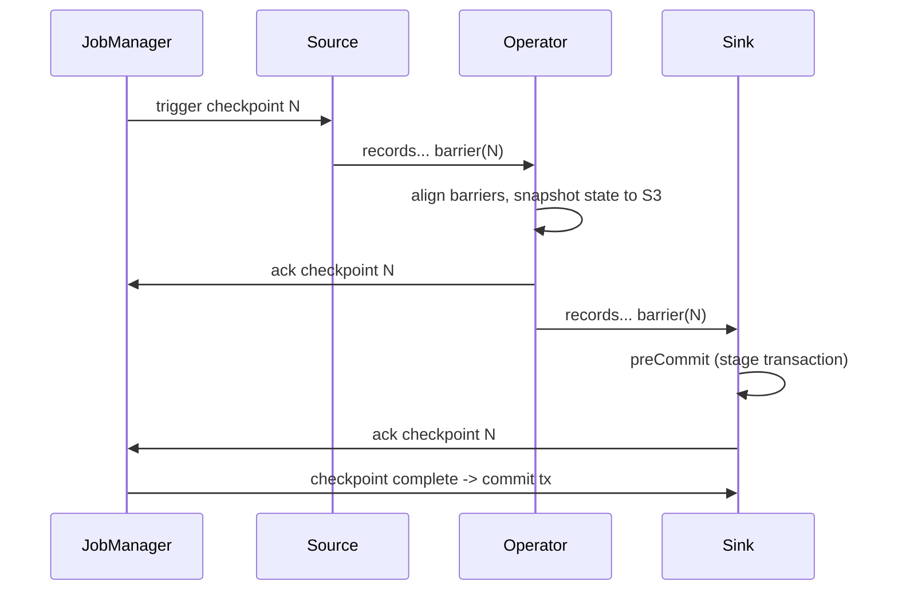
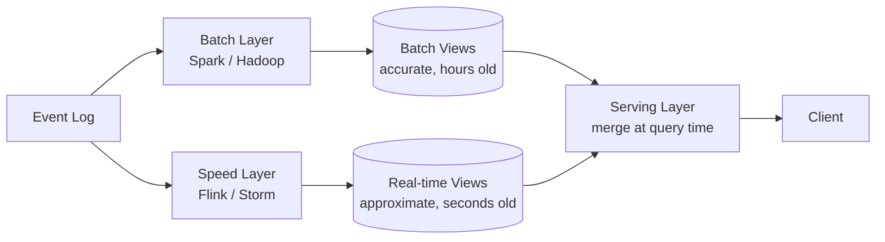
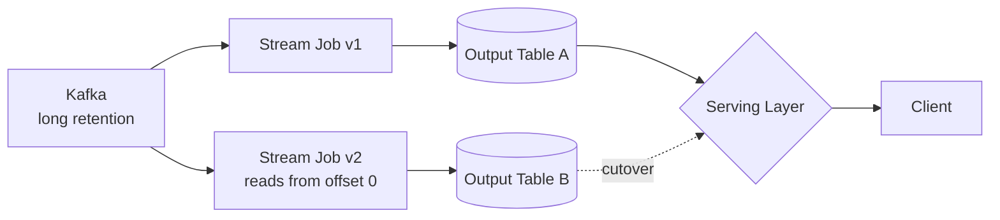

# Stream vs Batch Processing: Lambda, Kappa, and the End of That Debate

> **TL;DR**: The split between batch and streaming is not about latency. It is about whether your dataset has a known end. Batch processes bounded data at rest; streaming processes unbounded data in motion. For most of the 2010s, teams ran both in parallel (Lambda architecture) because neither was complete alone. The Dataflow Model paper (2015) formalized event-time semantics[^1], Flink shipped exactly-once via distributed snapshots[^2], and Kafka added transactions[^3]. Together these made the single-pipeline Kappa architecture practical. Today, Netflix processes trillions of events per day through Flink[^4]. Batch is not dead, but it is no longer the default.

## Learning Objectives

After this module, you will be able to:

- [ ] Explain event time vs processing time and why the difference ruins naive code
- [ ] Design windowed aggregations (tumbling, sliding, session) with correct watermarks
- [ ] Reason about exactly-once, at-least-once, and at-most-once delivery in streaming
- [ ] Choose between Kafka Streams, Flink, and Spark Streaming for a given workload
- [ ] Decide between Lambda and Kappa architectures for a realistic pipeline

## Intuition

You manage a chain of coffee shops. Every register prints a receipt with a timestamp when the customer pays. At the end of each day, a courier collects all receipts from all shops and drives them to headquarters. An accountant sorts them by date, totals revenue per shop, and files the report. That is batch processing: bounded input (today's receipts), a defined start and end, a complete answer once the job finishes.

Now imagine you want a live dashboard showing revenue per minute. You install a camera above each register that streams receipt images to HQ in real time. But cameras have lag. A receipt stamped 2:03 PM might arrive at 2:05 PM because the upload was slow. Another arrives at 2:07 PM but is stamped 2:02 PM because the shop's WiFi dropped for five minutes. If you group receipts by the minute they arrive (processing time), your dashboard is wrong. If you group by the timestamp printed on the receipt (event time), you get the right answer, but you must decide how long to wait for stragglers before declaring a minute "done."

That waiting decision is the watermark. The gap between the receipt's timestamp and its arrival is the event-time skew. The entire complexity of stream processing lives in this gap. Batch avoids the problem by waiting until all receipts are in. Streaming confronts it head-on.

[Message Queues and Streaming](../part-2-building-blocks/08-message-queues-streaming.md) introduced Kafka as the transport layer. [Data Warehouses and Data Lakes](./02-data-warehouses-lakes.md) showed where batch results land. This chapter covers what happens between ingestion and storage: the processing engines, the correctness model, and the architectural patterns that tie them together.

## Theory

### Batch foundations

Batch processing runs a finite computation over a bounded input. The job starts, reads everything, produces output, and exits.

**MapReduce** (Dean and Ghemawat, OSDI 2004) defined the model: write a `map` function and a `reduce` function; the framework handles partitioning, shuffling, fault tolerance, and parallelism across thousands of machines[^5]. Hadoop was the open-source implementation. **Spark** (NSDI 2012) replaced MapReduce's disk-heavy shuffle with Resilient Distributed Datasets (RDDs): read-only, lineage-tracked collections that could be rebuilt from their transformation graph after failure, enabling in-memory iterative computation that was up to 20x faster for iterative workloads in the original paper (up to 100x in later multi-pass analytics benchmarks)[^6]. Spark DataFrames and the Catalyst optimizer turned Spark from an RDD API into a SQL-first analytical engine.

Batch is still the right answer for complex analytical SQL, ML training that needs a full-dataset shuffle, periodic reconciliation, and anything where multi-hour latency is acceptable and operational simplicity matters. Orchestrators like Airflow, Dagster, and Prefect schedule these jobs as DAGs, handling retries, backfills, and lineage.

### Event time vs processing time

This is the core problem in stream processing. Get it wrong and every downstream number is subtly incorrect.

- **Event time**: when the event actually happened (timestamp embedded at the source).
- **Processing time**: when the stream operator sees the event.
- **Ingestion time**: when the event entered the system boundary.

A click at 14:03:12 on a phone may take seconds or minutes to traverse network queues, buffers, and retries. `groupBy(minute(now()))` assigns that click to whatever minute the operator happens to be running, so backfills, network delays, and out-of-order arrivals produce wrong answers. Event-time grouping produces deterministic results regardless of arrival order, at the cost of waiting for stragglers[^1].

The Dataflow paper (Akidau et al., VLDB 2015) argued that any correct streaming system must answer four questions[^1]:

1. **What** is being computed? (the transformation)
2. **Where** in event time? (the window)
3. **When** in processing time do results fire? (the trigger)
4. **How** do refinements relate? (accumulation mode: discard, accumulate, retract)

Flink, Beam, and Spark Structured Streaming all implement variants of this model.

*Event e3 arrives after e2 but belongs to an earlier window. The watermark declares "no more events before 12:02," closing the window. Late event e4 still gets absorbed within the allowed lateness period.*

### Windowing and watermarks

A window is a finite slice of an unbounded stream. Without windows, "count all events" over infinite time is not a number.

**Tumbling windows** are fixed-size, non-overlapping. Events belong to exactly one window. A 5-minute tumbling window over events at 12:01, 12:02, 12:06, 12:07 produces `[12:00-12:05) = {12:01, 12:02}` and `[12:05-12:10) = {12:06, 12:07}`.

**Sliding windows** are fixed-size but overlap by a slide interval. A 10-minute window sliding every 5 minutes means each event belongs to two windows. Useful for "rolling average over the last 10 minutes, updated every 5."

**Session windows** are defined by gaps of inactivity. No fixed length. Events at 12:01, 12:03, 12:20, 12:22 with a 5-minute gap produce two sessions: `{12:01, 12:03}` and `{12:20, 12:22}`. Session windows elegantly model user behavior (site sessions, ride sessions) where bounds are data-driven.

**Watermarks** are monotonic event-time markers declaring that (probabilistically) no more events older than the watermark will arrive. Flink generates them at sources, typically as `max(observed_event_time) - N seconds`. When a watermark reaches an operator, it advances the internal event-time clock and fires window timers. A watermark at an operator with multiple inputs advances to the minimum of all inputs, so a lagging partition holds the whole job back by design.

Perfect watermarks (provable no late events) are almost never achievable. Heuristic watermarks plus **allowed lateness** are the pragmatic answer: a window stays open for an additional duration after the watermark passes, absorbing late events and re-firing with updated output[^1].

### Delivery semantics and exactly-once

Three guarantees describe how many times a message affects downstream state under failure:

- **At-most-once**: no retries. On failure, the message is lost.
- **At-least-once**: retries on failure. Duplicates possible. Downstream must dedupe.
- **Exactly-once**: each message affects state exactly once. Requires coordination.

Kafka pre-0.11 offered at-least-once: retries on a timed-out ACK caused duplicate writes. Kafka 0.11 (2017) shipped two primitives[^3][^7]: an **idempotent producer** (each batch carries a producer ID + sequence number that brokers dedupe) and **transactions** (a producer atomically writes to multiple partitions and commits consumer offsets in the same transaction). Together these give exactly-once within Kafka's read-process-write loop, with only ~3% throughput overhead at 1 KB messages compared to at-least-once delivery with acks=all[^3].

Flink uses a distributed-snapshot approach based on Chandy-Lamport. The Carbone et al. 2015 paper describes Asynchronous Barrier Snapshotting (ABS): barriers are injected at sources, flow through operators, and when a barrier reaches an operator, that operator snapshots its state to durable storage[^2]. Checkpoints happen asynchronously so the job does not stall. End-to-end exactly-once requires a transactional sink: in Flink's current Sink V2 API, a sink implements the `SupportsCommitter` interface (the successor to the legacy `TwoPhaseCommittingSink` / `TwoPhaseCommitSinkFunction`) to pre-commit on each checkpoint and commit only after the JobManager confirms the global checkpoint has completed.

*Flink's Asynchronous Barrier Snapshot: barriers flow with records, each operator snapshots state when barriers align on all inputs, and transactional sinks commit only after the full checkpoint succeeds.*

> [!IMPORTANT]
> Exactly-once has scope limits. It means "every record's effect is reflected in managed state and outputs exactly once" within the framework. Calls to external services (HTTP APIs, email, SMS) are not covered unless those systems support idempotent operations keyed by a transaction ID. [Idempotency and Exactly-Once](../part-3-distributed-systems-theory/07-idempotency-exactly-once.md) covers the application-level fallback.

### Stream processor comparison

| Engine | Model | State | Exactly-Once | Latency | Best For |
|--------|-------|-------|--------------|---------|----------|
| Kafka Streams | Library (no cluster) | Embedded RocksDB + changelog topic | Kafka transactions | Low (record-at-a-time) | Service-embedded processing |
| Apache Flink | True streaming | RocksDB, TB-scale, incremental checkpoints to S3 | Chandy-Lamport + 2PC sinks | Low (ms) | Large stateful jobs, complex event-time logic |
| Spark Structured Streaming | Micro-batch (default) | Driver-managed | Idempotent writes | Medium (100ms+) | Teams already on Spark, throughput over latency |
| Apache Beam | Unified API (not an engine) | Runner-dependent | Runner-dependent | Runner-dependent | Portability across Flink/Spark/Dataflow |

**Kafka Streams** is a library you embed in your JVM service. State lives in an embedded RocksDB instance plus a compacted Kafka changelog topic for fault tolerance. On restart, state rebuilds by replaying the changelog. No separate cluster to operate, but parallelism is bounded by Kafka partition count.

**Apache Flink** is the industry choice for large stateful streaming. First-class event time, watermarks, keyed and broadcast state, and a RocksDB backend that supports TB-scale state with incremental checkpoints. Netflix, Uber, and Alibaba run Flink at scale.

**Spark Structured Streaming** is micro-batch by default: the engine wakes up every trigger interval, reads new data as a bounded batch, and runs standard Spark SQL. Familiar API for teams already on Spark. The experimental continuous-processing mode added in Spark 2.3 was deprecated and removed in Spark 4.0 (2024); modern deployments use sub-second micro-batch trigger intervals instead.

Newer options worth watching: **Materialize** and **RisingWave** (streaming SQL databases with PostgreSQL-compatible interfaces), and **Apache Flink SQL** (Confluent's recommended path after effectively sunsetting ksqlDB in 2024).

### Lambda vs Kappa architecture

**Lambda architecture** (Nathan Marz, 2011) runs two pipelines in parallel: a batch layer produces comprehensive, accurate views from full history; a speed layer produces approximate fresh views from recent data; a serving layer merges both at query time[^8].

*Lambda splits the same input into batch (accurate, slow) and speed (fresh, approximate) layers, merged at query time. The two pipelines implement the same logic twice.*

The fatal flaw: two codebases implementing the same logic in different frameworks. Jay Kreps wrote in 2014: "keeping code written in two different systems perfectly in sync was really, really hard"[^8].

**Kappa architecture** (Kreps, 2014) runs a single streaming pipeline. Reprocessing is done by replaying the input log from an earlier offset through a second instance of the same job, then cutting over[^8]:

1. Use Kafka with long retention (weeks or months).
2. To reprocess, start a second instance reading from offset 0, writing to a new output table.
3. When the second job catches up, switch reads to the new table.
4. Retire the old job and table.

*Kappa runs one streaming pipeline on a replayable log. Reprocessing is a second instance of the same job reading from an earlier offset; cutover happens when it catches up.*

Kappa became practical after Flink shipped exactly-once checkpoints, Kafka added transactions, and the Dataflow model formalized event-time semantics so replay produces the same answer as live processing.

**When Lambda still wins:** workloads that need a full-dataset shuffle (training a large ML model, running ALS recommender, periodic large joins) do not fit streaming even with replay. Many production stacks are honestly hybrid: Flink for the real-time path, nightly Spark SQL for analytical reporting. That is fine.

## Real-World Example

### Netflix Keystone

Netflix's Keystone platform processes trillions of events per day through thousands of streaming jobs[^4].

The architecture has two layers. The **Data Pipeline** (Kafka-based) ingests microservice events, filters and routes them to storage sinks (Elasticsearch, Hive, downstream Kafka topics). **Stream Processing as a Service (SPaaS)** gives internal teams managed Flink jobs, each deployed as an isolated Flink cluster on Netflix's Titus container runtime.

Key engineering decisions:

- **Job-level cluster isolation.** Every Flink job gets its own cluster, sharing only ZooKeeper and S3. This trades resource efficiency for failure blast-radius containment. A misbehaving job cannot take down its neighbors.
- **Declarative reconciliation.** Users declare intent (job configs stored in RDS); a control plane drives actual state to match. Self-healing handles ZooKeeper corruption, container loss, and network partitions.
- **TB-scale state.** Individual Flink jobs maintain tens of terabytes of local state using RocksDB with incremental checkpoints to S3. Savepoints enable zero-downtime upgrades.
- **Trade-offs exposed to users.** Teams choose between exactly-once vs at-least-once, latency vs duplicates, and savepoint restore vs fresh start, rather than hiding behind one-size-fits-all defaults.

The platform feeds both real-time dashboards and the data lake. [Change Data Capture](./04-change-data-capture.md) covers how operational databases feed into this same Kafka backbone.

## Trade-offs

| Approach | Pros | Cons | Best When | Our Pick |
|----------|------|------|-----------|----------|
| Batch (Spark, SQL on warehouse) | Simple, cheap, well-understood | Latency in hours, not minutes | Reporting, ML training, reconciliation | Use for analytics and ML |
| Streaming (Flink, Kafka Streams) | Low latency, fresh data | Complex, stateful, expensive to operate | Real-time alerts, fraud, personalization | Use for sub-second hot paths |
| Lambda (batch + stream) | Accuracy + freshness | Two codebases, drift, operational nightmare | Legacy migrations with high accuracy needs | Brownfield only, when batch pipelines predate streaming and cannot be rewritten in one cycle |
| Kappa (stream only, replay for backfill) | One codebase, simpler ops | Requires replayable log and mature streaming team | Greenfield stacks where streaming skills exist | Default for new real-time pipelines |

## Common Pitfalls

> [!WARNING]
> **Grouping by processing time when the business question is event time.** Your nightly reports and live dashboards will disagree. Backfills produce different answers than the original live run. Always extract event time at the source and use event-time windows.

> [!WARNING]
> **Idle partitions stalling watermarks.** Flink takes the minimum watermark across all inputs. One partition with no events freezes the entire job's event-time clock. Configure `WatermarkStrategy.withIdleness(Duration)` on every production source.

> [!WARNING]
> **Believing "exactly-once" is a framework checkbox.** Exactly-once in Kafka and Flink applies to managed state and Kafka-to-Kafka pipelines. Writes to external databases, HTTP calls, and triggered side effects still need idempotency keys at the application level.

> [!WARNING]
> **Unbounded state growth.** Stateful operators (sessionization, joins, dedup sets) accumulate keys indefinitely without TTL. A dedup set over "all events ever" is unbounded. Set `StateTtlConfig` in Flink or bound your dedup window and accept rare duplicates outside it.

> [!WARNING]
> **Checkpoint interval too long.** Checkpoints every 10 minutes means up to 10 minutes of input must be re-read on recovery. At 1M events/sec, that is 600M events to replay. Use incremental RocksDB checkpoints at seconds-scale intervals for fast recovery.

## Exercise

Design a fraud detection pipeline that scores card transactions within 200 ms, backfills three months of data after model retraining, and reconciles nightly against the warehouse. Pick the processing framework, specify state storage, and justify Lambda vs Kappa.

Hint

Think about which parts need sub-second latency (scoring) vs which can tolerate hours (reconciliation). Consider whether the scoring logic and the backfill logic are the same code or different code.

Solution

**Framework:** Apache Flink for the real-time scoring path. Flink's keyed state stores per-card features (rolling 1-hour spend, transaction count, geo-velocity) in RocksDB with incremental checkpoints to S3.

**Scoring path:** Kafka topic of raw transactions feeds a Flink job that enriches each transaction with features from keyed state, calls the ML model (embedded or via async I/O to a model server), and emits a risk score within 200 ms. Exactly-once via Flink checkpoints + idempotent writes to the downstream decisions topic.

**Backfill after retraining:** Kappa-style. Start a second instance of the same Flink job reading from Kafka's 90-day retention at offset 0, writing scores to a new output table. When it catches up, cut over. Same code, same logic, no separate batch pipeline.

**Nightly reconciliation:** A Spark SQL job in the warehouse compares the streaming scores against the source-of-truth ledger, flags discrepancies, and feeds corrections back. This is the one batch job in the stack, justified because reconciliation needs a full outer join across millions of rows.

**Architecture:** Kappa for scoring and backfill (one codebase), with a lightweight batch reconciliation job. Not pure Kappa, not Lambda. A pragmatic hybrid where batch handles only the workload that genuinely needs it.

**State storage:** RocksDB backend, incremental checkpoints every 30 seconds to S3. Per-card state TTL of 90 days to prevent unbounded growth.

## Key Takeaways

- Event time is the only time that matters for correctness. Processing time is for operational dashboards.
- Watermarks are heuristic, not perfect. Tune allowed lateness per use case: short for dashboards, long for billing.
- Exactly-once is a systems-level property requiring coordination between framework, source, and sink. External side effects still need idempotency keys.
- Kappa is the default for new real-time pipelines where the team has streaming maturity. Lambda persists where full-shuffle batch workloads (ML training, complex joins) cannot be expressed as streams.
- Flink is the industry standard for large stateful streaming (Netflix, Uber, Alibaba). Kafka Streams wins for service-embedded processing without a separate cluster. Spark Structured Streaming wins when the team is already on Spark and latency above 100 ms is acceptable.
- Batch is not obsolete. It is still the right answer for most analytical workloads, ML training, and reconciliation.
- State management (size, checkpointing, TTL, schema evolution) is the hardest operational concern in production streaming, not throughput.

## Further Reading

- [The Dataflow Model (Akidau et al., VLDB 2015)](https://research.google/pubs/the-dataflow-model-a-practical-approach-to-balancing-correctness-latency-and-cost-in-massive-scale-unbounded-out-of-order-data-processing/): the foundational paper on event time, windows, watermarks, and triggers; read this before designing any streaming pipeline.
- [Questioning the Lambda Architecture (Kreps, 2014)](https://www.oreilly.com/radar/questioning-the-lambda-architecture/): the Kappa manifesto; short, opinionated, and still essential reading for anyone choosing between architectures.
- [Lightweight Asynchronous Snapshots for Distributed Dataflows (Carbone et al., 2015)](https://arxiv.org/abs/1506.08603): Flink's checkpoint algorithm explained; essential for understanding exactly-once in stateful streaming.
- [Netflix Keystone Real-Time Stream Processing Platform](https://netflixtechblog.com/keystone-real-time-stream-processing-platform-a3ee651812a): trillion-events-per-day case study showing job isolation, declarative reconciliation, and TB-scale state.
- [Exactly-Once Semantics in Apache Kafka (Confluent, 2017)](https://www.confluent.io/blog/exactly-once-semantics-are-possible-heres-how-apache-kafka-does-it/): how idempotent producers and transactions work end-to-end.
- [Streaming Systems (Akidau, Chernyak, Lax, O'Reilly 2018)](https://www.oreilly.com/library/view/streaming-systems/9781491983867/): the book-length version of the Dataflow paper; the definitive reference on windowing and watermarks.
- [Designing a Production-Ready Kappa Architecture (Uber, 2020)](https://www.uber.com/en-DE/blog/kappa-architecture-data-stream-processing/): a real Kappa deployment at Uber scale with Flink and Spark coexisting.
- [Apache Flink: Timely Stream Processing](https://nightlies.apache.org/flink/flink-docs-stable/docs/concepts/time/): the reference documentation on event time, watermarks, and lateness in Flink.

## Flashcards

**Q:** What is the difference between event time and processing time?
**A:** Event time is when the event actually happened (timestamp at the source). Processing time is when the stream operator sees it. They diverge due to network delays, retries, and out-of-order delivery.

**Q:** Why does grouping by processing time produce wrong answers?
**A:** Because late-arriving events get assigned to the wrong time bucket. Backfills and replays produce different results than the original live run, making the pipeline non-deterministic.

**Q:** What is a watermark?
**A:** A monotonic event-time marker declaring that (probabilistically) no more events older than the watermark will arrive. It advances the operator's event-time clock and fires window timers.

**Q:** Name the three standard window types and when to use each.
**A:** Tumbling (fixed, non-overlapping) for periodic aggregates. Sliding (fixed, overlapping) for rolling averages. Session (gap-based) for user-activity analytics where bounds are data-driven.

**Q:** How does Flink achieve exactly-once stateful processing?
**A:** Asynchronous Barrier Snapshotting (Chandy-Lamport variant): barriers flow with records, operators snapshot state when barriers align on all inputs, and transactional sinks commit only after the full checkpoint succeeds.

**Q:** What is the overhead of Kafka's transactional exactly-once?
**A:** Approximately 3% throughput reduction for the idempotent producer at 1 KB messages. Kafka Streams with 100 ms commit intervals sees 15-30% overhead; at 30-second intervals with messages >= 1 KB, overhead drops to near zero.

**Q:** What is the Lambda architecture and its fatal flaw?
**A:** Lambda runs batch and speed layers in parallel, merging at a serving layer. The fatal flaw is maintaining two codebases implementing the same logic in different frameworks, which inevitably drift.

**Q:** What is the Kappa architecture's reprocessing strategy?
**A:** Start a second instance of the same streaming job reading from an earlier Kafka offset, writing to a new output table. When it catches up, cut over. Same code, no separate batch pipeline.

**Q:** When should you still use batch instead of streaming?
**A:** For workloads needing full-dataset shuffles (ML training, large joins), periodic reconciliation, complex analytical SQL, and anywhere multi-hour latency is acceptable and operational simplicity matters more than freshness.

**Q:** What causes unbounded state growth in streaming jobs?
**A:** Stateful operators (sessionization, joins, dedup sets) that accumulate keys indefinitely without TTL or cleanup. The fix is state TTL, bounded dedup windows, or tumbling windows instead of sessions where possible.

## References

[^1]: Akidau, T. et al. "The Dataflow Model: A Practical Approach to Balancing Correctness, Latency, and Cost in Massive-Scale, Unbounded, Out-of-Order Data Processing." VLDB 2015. https://research.google/pubs/the-dataflow-model-a-practical-approach-to-balancing-correctness-latency-and-cost-in-massive-scale-unbounded-out-of-order-data-processing/
[^2]: Carbone, P. et al. "Lightweight Asynchronous Snapshots for Distributed Dataflows." arXiv:1506.08603, 2015. https://arxiv.org/abs/1506.08603
[^3]: Narkhede, N. and Wang, G. "Exactly-Once Semantics Are Possible: Here's How Kafka Does It." Confluent Blog, June 2017. https://www.confluent.io/blog/exactly-once-semantics-are-possible-heres-how-apache-kafka-does-it/
[^4]: Xu, Z. "Keystone Real-time Stream Processing Platform." Netflix Tech Blog, September 2018. https://netflixtechblog.com/keystone-real-time-stream-processing-platform-a3ee651812a
[^5]: Dean, J. and Ghemawat, S. "MapReduce: Simplified Data Processing on Large Clusters." OSDI 2004. https://research.google/pubs/mapreduce-simplified-data-processing-on-large-clusters/
[^6]: Zaharia, M. et al. "Resilient Distributed Datasets: A Fault-Tolerant Abstraction for In-Memory Cluster Computing." NSDI 2012. https://www.usenix.org/conference/nsdi12/technical-sessions/presentation/zaharia
[^7]: Apache Kafka. "KIP-98: Exactly Once Delivery and Transactional Messaging." https://cwiki.apache.org/confluence/display/KAFKA/KIP-98+-+Exactly+Once+Delivery+and+Transactional+Messaging
[^8]: Kreps, J. "Questioning the Lambda Architecture." O'Reilly Radar, July 2014. https://www.oreilly.com/radar/questioning-the-lambda-architecture/
