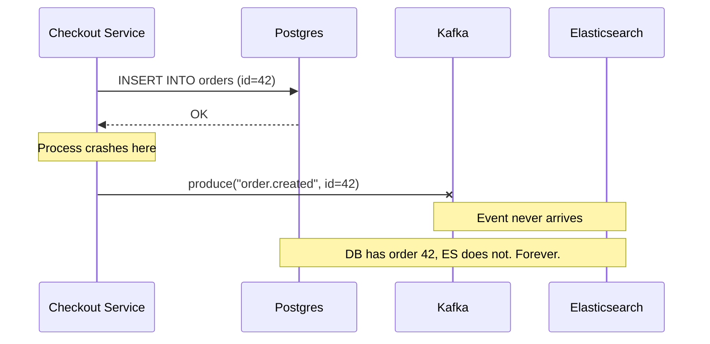
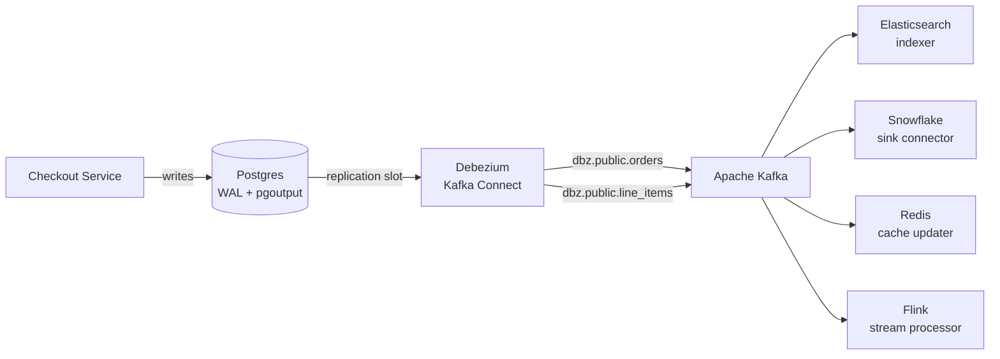
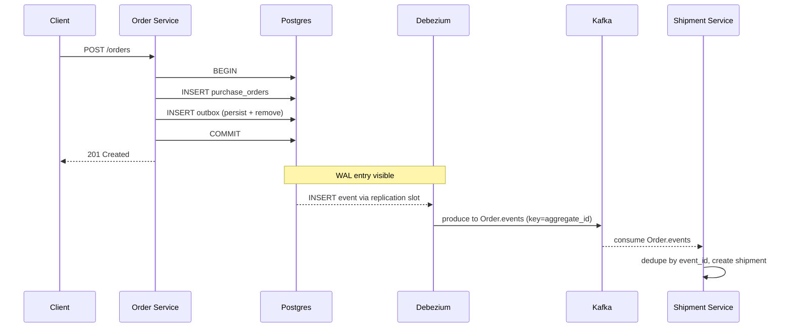
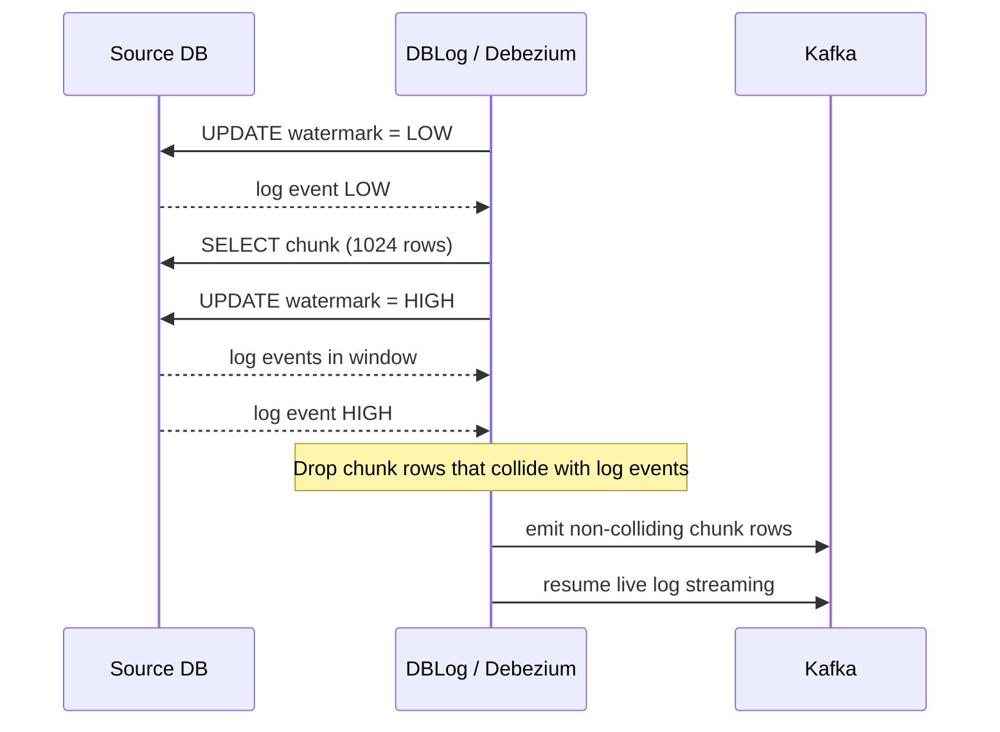

# Change Data Capture: Streaming the Database's Inner Monologue

> **TL;DR**: Every committed row change is already written to a durable log (Postgres WAL, MySQL binlog). Change Data Capture (CDC) exposes that log as a public event stream so downstream systems (warehouse, search, cache, audit) stay in sync without the application dual-writing to each of them. Log-based CDC via Debezium is the default for most teams. The transactional outbox pattern is the alternative when you control the application and want atomicity without connector infrastructure. Shopify processes tens of millions of Kafka messages per second at peak using outbox-driven CDC[^1]. Netflix's DBLog introduced watermark-based incremental snapshots that let you backfill new consumers without locking the source[^2]. Dual writes are the enemy; the database log is the cure.

## Learning Objectives

After this module, you will be able to:

- [ ] Explain log-based CDC and how Debezium reads Postgres WAL or MySQL binlog
- [ ] Compare log-based, trigger-based, and query-based CDC approaches
- [ ] Implement the transactional outbox pattern as an alternative to CDC
- [ ] Handle schema evolution, backfill, and ordering guarantees
- [ ] Design a CDC pipeline feeding a warehouse, cache, and search index

## Intuition

You keep a personal journal. Every night you write down what happened that day. Your spouse reads the journal to stay informed. Your accountant reads it to track expenses. Your therapist reads it to spot patterns.

None of these people ask you to repeat yourself. None of them need you to call them individually after every event. They all consume the same journal at their own pace. If your accountant goes on vacation for a week, they catch up by reading the entries they missed.

Your database already keeps this journal. Postgres calls it the write-ahead log (WAL). MySQL calls it the binary log (binlog). Every INSERT, UPDATE, and DELETE is recorded there for crash recovery and replication. Change Data Capture is the practice of opening that journal to the outside world so that search indexes, data warehouses, caches, and audit systems can all read it independently, at their own speed, without you writing to each of them separately.

The alternative is calling each consumer yourself after every database write. That is the dual-write problem, and it is the single most common source of silent data inconsistency in microservice architectures. This chapter shows you why dual writes break, how CDC fixes them, and when to use the outbox pattern instead.

## Theory

### The dual-write problem

Consider this pseudocode in a checkout service:

```python
def place_order(order):
    db.execute("INSERT INTO orders ...", order)
    kafka.produce("order.created", order)
```

Two writes. Two systems. No shared transaction. Three things can go wrong:

1. **Partial failure.** The INSERT commits, the process crashes before `kafka.produce`, and the event is silently lost. The warehouse never sees the order.
2. **Race condition.** Two concurrent requests write `status=shipped` and `status=cancelled` to the same order. The database and Kafka see the writes in different orders. They permanently disagree.[^3]
3. **No detection.** Both operations "succeed" from the application's perspective. No error is raised. The divergence is invisible until a customer complains.

Martin Kleppmann named this problem explicitly in 2015: dual writes produce permanent inconsistency, not eventual consistency.[^3] You cannot fix it with retries. You cannot fix it with distributed transactions (Kafka does not support XA). The only fix is to pick one source of truth and derive everything else from it.



*The dual-write failure: a crash between the database commit and the Kafka produce silently loses the event, leaving downstream systems permanently out of sync.*

CDC eliminates dual writes by making the database log the single source of truth. Downstream systems consume that log. The application writes to one place. Everything else is derived.

### Log-based CDC

A log-based CDC tool impersonates a database replica. It opens a replication slot (Postgres) or registers as a binlog client (MySQL), reads committed changes in commit order, enriches them with schema metadata, and publishes to Kafka.[^4]

**Postgres logical decoding.** Since Postgres 10, the `pgoutput` plugin decodes WAL entries into a logical stream of row changes. Debezium opens a replication slot, consumes the stream, and publishes one Kafka message per row change. The slot tracks the consumer's position (the `restart_lsn`), so Postgres retains WAL segments until the consumer acknowledges them.[^5]

**MySQL binlog.** MySQL's binary log in ROW format records the before and after images of every modified row. Debezium registers as a replication client with `REPLICATION SLAVE` privileges and reads the binlog in real time. Unlike Postgres, MySQL uses time-based retention (`binlog_expire_logs_seconds`) rather than consumer-driven retention.

**The Debezium envelope.** Every change event carries a standard envelope:

```json
{
  "before": null,
  "after": {"id": 1, "email": "anne@example.com"},
  "source": {"connector": "postgresql", "txId": 555, "lsn": 24023128},
  "op": "c",
  "ts_ms": 1559033904863
}
```

The `op` field encodes the operation: `c` (create), `u` (update), `d` (delete), `r` (snapshot read). For updates, `before` contains the prior row (if `REPLICA IDENTITY FULL` is set) and `after` contains the new row. For deletes, `before` is populated and `after` is null, followed by a tombstone for Kafka log compaction.[^4]



*Debezium reads the Postgres WAL via a replication slot and publishes per-table Kafka topics; independent consumers derive search indexes, warehouses, caches, and stream processors from the same event stream.*

### Trigger-based and query-based CDC

Not every database exposes a consumable log. Two older strategies fill the gap:

**Trigger-based CDC.** Database triggers on INSERT, UPDATE, and DELETE write a row to a shadow changelog table. A worker polls the changelog and publishes events. Uber's Schemaless Triggers uses exactly this pattern: each mutation fires a trigger that feeds trip processing, billing, and warehouse pipelines.[^6] The cost is real: every write pays extra latency in the commit path (trigger invocation plus shadow-table INSERT), adding significant write overhead.

**Query-based CDC (polling).** A worker issues `SELECT * FROM t WHERE updated_at > :checkpoint` on a timer, publishes results, and advances the checkpoint. LinkedIn's original Oracle data capture used SQL-based polling before moving to Oracle GoldenGate-based streaming.[^7] It requires zero infrastructure beyond a cron job and works against read replicas. But it cannot capture deletes (deleted rows do not match the WHERE clause), adds query load proportional to polling frequency, and races on the checkpoint timestamp.

| Strategy | Captures deletes? | Source impact | Infrastructure | Best for |
|----------|:-:|---|---|---|
| Log-based | Yes | Minimal (reads existing log) | Kafka Connect + Schema Registry | Most production use cases |
| Trigger-based | Yes | High (extra write per mutation) | Shadow table + poller | Legacy DBs without log access |
| Query-based | No | Medium (periodic queries) | Cron job | Small scale, infrequent sync |

Use log-based CDC when your database supports it. Use triggers only when it does not. Use polling only for prototypes or low-frequency batch sync.

### The transactional outbox pattern

The outbox pattern pushes coordination into the application. Within the same local ACID transaction as the business write, insert a row into an `outbox` table. A relay publishes outbox rows to Kafka asynchronously.[^8]

```sql
BEGIN;
INSERT INTO purchase_orders (id, customer_id, total) VALUES (...);
INSERT INTO outbox (aggregate_type, aggregate_id, type, payload)
  VALUES ('Order', '42', 'OrderCreated', '{"total": 99.95}');
COMMIT;
```

Since both rows commit atomically, the outbox row exists if and only if the business row does. No distributed transaction. No dual write.

The relay can be a simple poller or, more elegantly, Debezium itself reading the outbox table's WAL entries. Gunnar Morling's implementation uses a clever trick: the application `persist()`s the outbox row and immediately `remove()`s it in the same transaction. Debezium reads the INSERT from the WAL (publishing the full event) and ignores the DELETE (via the Outbox Event Router SMT filtering `op == 'd'`). The outbox table stays empty on disk, so no housekeeping cron is needed.[^8]



*The outbox pattern: business write and event write commit in one local transaction. Debezium relays the outbox INSERT from the WAL to Kafka, giving reliable downstream delivery without a distributed transaction.*

The `aggregate_id` field becomes the Kafka message key, so all events for one order hash to the same partition. This preserves per-aggregate ordering without global coordination.

### Ordering, partitioning, and schema evolution

**Ordering.** [Message Queues and Streaming](../part-2-building-blocks/08-message-queues-streaming.md) established that Kafka guarantees ordering within a partition but not across partitions. CDC tools use the primary key (or `aggregate_id` in the outbox case) as the message key. All events for the same row land on the same partition, giving per-entity total order with consumer parallelism across entities.[^4]

**Transaction boundaries.** Debezium optionally emits transaction metadata (BEGIN/END events with `txId:LSN` and per-table event counts) so consumers can reconstruct multi-table transactions when needed.

**Schema evolution.** Logical decoding does not replicate DDL.[^4] A migration that adds a NOT NULL column or drops a column can break downstream consumers. The defense is a Schema Registry with Avro serialization and `BACKWARD` compatibility mode: new consumers can read old data, so you may only add nullable fields with defaults or remove fields. Test every migration against the registry's compatibility rules before deploying.

**TOAST columns.** On Postgres with default `REPLICA IDENTITY`, update events omit unchanged TOASTed (large) columns. Debezium substitutes the placeholder `__debezium_unavailable_value`. If your consumers need full before-images, set `ALTER TABLE t REPLICA IDENTITY FULL` on the affected tables (expect a moderate CPU increase on the source; one benchmark showed peak CPU rising from 30% to 35%).[^5]

### Incremental snapshots and backfill

A new consumer (say, a fresh Elasticsearch index) needs the full dataset, not just future changes. The naive approach, a `SELECT *` dump, locks the table and stalls streaming for hours.

Netflix's DBLog solved this with watermark-based chunked snapshots.[^2] The algorithm:

1. Write a LOW watermark to a dedicated watermark table.
2. SELECT a chunk of rows (default 1,024 rows in Debezium's port).[^9]
3. Write a HIGH watermark.
4. Any log events between LOW and HIGH that collide with chunk rows win. Drop the stale chunk rows.
5. Emit non-colliding chunk rows, then resume live streaming.



*DBLog's watermark algorithm interleaves snapshot chunks with live log streaming. Log events always win over stale snapshot rows, so the stream is never inconsistent.*

This runs without table locks, is triggerable per-table or per-primary-key at any time, and was ported into Debezium 1.6+ as incremental snapshots via a signal table.[^9]

## Real-World Example

### Shopify: outbox-driven CDC at commerce scale

Shopify's modular-monolith Rails application uses the transactional outbox pattern to reliably emit domain events. The service writes the business row and an outbox row in the same transaction on its shop-sharded MySQL cluster. A relay (Kafka Connect with Debezium or a Shopify-internal reader) publishes outbox events to Kafka.[^1]

**Scale.** During Black Friday / Cyber Monday 2024, Shopify moved 57.3 PB of data, processed 10.5 trillion database queries and 1.17 trillion writes, and sustained 80 million requests per minute on application servers. Kafka handled tens of millions of messages per second at peak.[^1]

**Architecture.** Regional Kafka clusters mirror into a single aggregate cluster that feeds the data warehouse. Application-specific consumers (search index, analytics, inventory stream) subscribe to the aggregate topics. The Pods architecture shards stores across isolated pods, each with its own database cluster, so outbox scaling is horizontal by `shop_id`.

**Key decisions:**

- **Aggregate cluster pattern.** Regional clusters mirror to one aggregate so downstream warehouse and analytics have a single topic to consume, simplifying consumer fan-out.
- **StatefulSets on Kubernetes.** Brokers run on persistent volumes with inter-pod anti-affinity so they never share a node. Rack-awareness maps brokers across zones. Readiness probes gate rolling restarts so only one broker restarts at a time.
- **Own their Kafka image.** Shopify builds its own Kafka container image rather than depending on a third-party registry, because a changed upstream image in a payment-critical pipeline is unacceptable.

The lesson: the outbox pattern scales to trillion-write workloads when combined with horizontal sharding and a well-operated Kafka tier.

## Trade-offs

| Approach | Pros | Cons | Best when | Our Pick |
|----------|------|------|-----------|----------|
| Log-based CDC (Debezium) | Low source overhead, captures all changes including deletes, near real-time | Operational complexity (slots, schema registry, connector monitoring) | You need all changes from a DB you do not own | **Default for most teams** |
| Trigger-based CDC | Works on any DB with trigger support | Doubles write-path latency, fragile to DDL | Legacy systems without log access | Only when log-based is impossible |
| Query-based polling | Zero infrastructure, works on read replicas | Misses deletes, adds query load, timestamp races | Prototypes, low-frequency batch sync | Prototypes and small-scale batch sync only |
| Transactional outbox | Atomic with business write, events are a stable contract | Requires app changes, relay operational burden | You control the app and want event-schema decoupling | **When you own the service** |

## Common Pitfalls

> [!WARNING]
> **Postgres replication slot bloat.** An inactive or slow slot prevents Postgres from recycling WAL segments. The disk fills silently. Set `max_slot_wal_keep_size = 50GB` (Postgres 13+) so the server invalidates a runaway slot before it eats the disk. Enable heartbeats (`heartbeat.interval.ms = 60000`) so low-traffic database slots advance. Alert when a slot retains more than 10-20 GB or is inactive for more than 30 minutes.[^5]

> [!WARNING]
> **MySQL binlog retention expiry.** MySQL purges binlog by time, not by consumer acknowledgment. If your connector is offline longer than `binlog_expire_logs_seconds` (default 2,592,000 seconds = 30 days in MySQL 8.0), the needed files are gone and you must re-snapshot. Monitor `MilliSecondsBehindSource` and page on sustained growth.

> [!WARNING]
> **Large transactions stalling logical decoding.** A single `UPDATE ... WHERE created_at < '2020-01-01'` modifying millions of rows buffers in memory until commit, then streams as one giant batch. Increase `logical_decoding_work_mem` (default 64 MB) and chunk bulk operations in application code (1,000 rows per transaction, not 10 million).[^5]

> [!WARNING]
> **Consumers without idempotency.** CDC pipelines are at-least-once by default. After a connector restart, a few events replay. Naive consumers double-charge or double-apply. Propagate a stable event UUID and maintain a `MessageLog` keyed by that UUID on the consumer side. See [Idempotency and Exactly-Once](../part-3-distributed-systems-theory/07-idempotency-exactly-once.md) for the full pattern.[^8]

> [!WARNING]
> **TOAST columns producing phantom nulls.** With default `REPLICA IDENTITY` on Postgres, unchanged TOASTed columns appear as `__debezium_unavailable_value` in update events. Consumers that interpret this as null corrupt downstream data. Set `REPLICA IDENTITY FULL` on tables with large columns you need full before-images for.

## Exercise

You operate a Postgres cluster serving checkout at 5,000 writes/sec. Design a CDC pipeline that keeps Elasticsearch, a Snowflake warehouse, and a Redis cache in sync. Specify lag budgets, failure handling, and how you backfill a new consumer without impacting production.

<details>
<summary>Hint</summary>

Think about which sinks tolerate minutes of lag (warehouse) versus which need sub-second freshness (cache). Consider what happens when the Elasticsearch indexer falls behind: does it block the other consumers? Think about Debezium's incremental snapshot feature for the backfill case.

</details>

<details>
<summary>Solution</summary>

**Architecture:** Debezium Postgres connector reading the WAL via a replication slot, publishing to per-table Kafka topics. Three independent consumer groups: one for Redis, one for Elasticsearch, one for Snowflake (via Kafka Connect sink connector).

**Lag budgets:**

- Redis cache: p50 < 2s, p99 < 10s. Cache staleness beyond 10s is user-visible.
- Elasticsearch: p50 < 5s, p99 < 60s. Search results tolerate short delays.
- Snowflake: < 1 hour. Hourly micro-batch ingest is sufficient for analytics.

**Failure handling:**

- Each consumer group has its own committed offset. If Elasticsearch falls behind, Redis and Snowflake are unaffected.
- Set `max_slot_wal_keep_size = 50GB` to prevent a dead consumer from filling the disk.
- Monitor per-consumer-group lag in Prometheus. Alert at 2x the lag budget.
- Consumers are idempotent: Redis uses UPSERT by primary key, Elasticsearch uses document ID, Snowflake deduplicates on merge.

**Backfill strategy:**

- Use Debezium's incremental snapshot via the signal table: `INSERT INTO dbz_signal VALUES ('backfill-es', 'execute-snapshot', '{"data-collections": ["public.orders"], "type": "incremental"}')`.
- Throttle chunk size to 2,048 rows to keep primary CPU under 60%.
- Run during off-peak hours. The snapshot interleaves with live streaming, so no events are lost during backfill.
- Elasticsearch consumer processes snapshot events (`op = 'r'`) identically to creates (`op = 'c'`): upsert by document ID.

**Trade-off accepted:** We accept at-least-once delivery and push idempotency to consumers rather than paying for Kafka exactly-once semantics, which constrains consumer implementation.

</details>

## Key Takeaways

- Dual writes (DB + message bus without a shared transaction) produce permanent inconsistency, not eventual consistency. CDC eliminates them by making the database log the single source of truth.
- Log-based CDC reads the existing replication stream (WAL, binlog) with minimal source impact. Use it as the default.
- The transactional outbox pattern provides atomicity without connector infrastructure by writing business rows and event rows in one local transaction.
- Debezium's incremental snapshot (ported from Netflix DBLog) lets you backfill new consumers without table locks or stalling the live stream.
- Per-key partitioning (primary key or aggregate ID as Kafka message key) gives per-entity total order with consumer parallelism across entities.
- Schema evolution requires a Schema Registry with compatibility rules. Test migrations against the registry before deploying.
- Replication slot bloat on Postgres is the most common operational failure. Set `max_slot_wal_keep_size`, enable heartbeats, and alert on retained WAL size.

## Further Reading

- [Using logs to build a solid data infrastructure (or: why dual writes are a bad idea)](http://www.kleppmann.com/2015/05/27/logs-for-data-infrastructure.html) - Kleppmann's 2015 Craft Conference talk that names the dual-write problem and frames CDC as the solution; the intellectual foundation for this chapter.
- [DBLog: A Generic Change-Data-Capture Framework](https://netflixtechblog.com/dblog-a-generic-change-data-capture-framework-69351fb9099b) - Netflix's watermark-based snapshot algorithm explained with diagrams; read this to understand how incremental snapshots work without locks.
- [Reliable Microservices Data Exchange With the Outbox Pattern](https://debezium.io/blog/2019/02/19/reliable-microservices-data-exchange-with-the-outbox-pattern/) - Morling's implementation guide for the outbox pattern including the persist-then-remove trick and consumer deduplication.
- [Mastering Postgres Replication Slots](https://www.morling.dev/blog/mastering-postgres-replication-slots/) - The definitive guide to preventing WAL bloat, monitoring slot health, and configuring failover slots on Postgres 17+.
- [Debezium connector for PostgreSQL](https://debezium.io/documentation/reference/stable/connectors/postgresql.html) - The reference for envelope format, replica identity, topic naming, TOAST handling, and all connector properties.
- [Open sourcing Databus: LinkedIn's low latency CDC system](http://engineering.linkedin.com/data-replication/open-sourcing-databus-linkedins-low-latency-change-data-capture-system) - The original three-tier CDC architecture (relay, bootstrap, client) that influenced every subsequent system including DBLog.
- [Incremental Snapshots in Debezium](https://debezium.io/blog/2021/10/07/incremental-snapshots/) - How the DBLog watermark algorithm was ported into Debezium 1.6+ with signal-table triggers and chunk reconciliation.
- [Pattern: Transactional outbox](https://microservices.io/patterns/data/transactional-outbox.html) - Chris Richardson's concise pattern reference; useful as a quick refresher on the mechanics.

## Flashcards

**Q:** What is the dual-write problem?
**A:** Writing to a database and a message bus in application code without a shared transaction. If the process crashes between the two writes, or two clients race, the systems diverge permanently with no error raised.

**Q:** What are the three CDC extraction strategies?
**A:** Log-based (reads WAL/binlog), trigger-based (shadow table written by DB triggers), and query-based (polling with `WHERE updated_at > checkpoint`). Log-based is the default for production.

**Q:** How does Debezium read changes from Postgres?
**A:** It opens a logical replication slot using the `pgoutput` plugin, consumes the decoded WAL stream in commit order, enriches events with schema metadata, and publishes to per-table Kafka topics.

**Q:** What fields does a Debezium change event envelope contain?
**A:** `before` (prior row state), `after` (new row state), `op` (c/u/d/r), `source` (connector metadata including txId and LSN), and `ts_ms` (timestamp). For deletes, `after` is null; for creates, `before` is null.

**Q:** How does the transactional outbox pattern avoid dual writes?
**A:** The application writes the business row and an outbox event row in the same local ACID transaction. A relay (poller or Debezium reading the outbox table's WAL) publishes the event asynchronously. Atomicity is guaranteed by the local transaction.

**Q:** What is the persist-then-remove trick in the Debezium outbox implementation?
**A:** The application persists the outbox row and immediately removes it in the same transaction. Debezium reads the INSERT from the WAL and publishes it, but ignores the DELETE via the Outbox Event Router SMT. The outbox table stays empty on disk.

**Q:** How do incremental snapshots work without locking the source table?
**A:** The DBLog/Debezium algorithm writes LOW and HIGH watermarks to a dedicated table, selects a chunk of rows between them, and drops any chunk rows that collide with log events seen in the watermark window. Log events always win over stale snapshot rows.

**Q:** What is the most dangerous operational pitfall of Postgres CDC?
**A:** Replication slot bloat. An inactive slot prevents WAL recycling, and the disk fills. Mitigate with `max_slot_wal_keep_size` (Postgres 13+), heartbeat queries for low-traffic databases, and alerts on retained WAL size.

**Q:** Why does CDC use the primary key as the Kafka message key?
**A:** Kafka guarantees ordering within a partition. By hashing the primary key to a partition, all events for the same row land on the same partition, preserving per-entity causal order while allowing consumer parallelism across entities.

**Q:** What happens to TOAST columns in Postgres CDC with default REPLICA IDENTITY?
**A:** Unchanged TOASTed columns are omitted from update events. Debezium substitutes `__debezium_unavailable_value`. To get full before-images, set `REPLICA IDENTITY FULL` on the table (at the cost of a moderate CPU increase on the source).

**Q:** When should you choose the outbox pattern over log-based CDC?
**A:** When you control the application code, want events to be a stable contract decoupled from the internal table schema, and prefer explicit event design over raw row-change streams. Also when you want the source service to have read-your-own-writes semantics for the event.

**Q:** How does Shopify scale its outbox-driven CDC pipeline?
**A:** Shop-sharded MySQL clusters (each pod has its own DB), regional Kafka clusters mirroring to an aggregate cluster, and independent consumer groups per sink. This handled tens of millions of messages/sec and 1.17 trillion writes during BFCM 2024.

## References

[^1]: Shopify Engineering. "How we prepare Shopify for BFCM (2025)." https://www.shopify.engineering/bfcm-readiness-2025
[^2]: Andreakis, Andreas, and Ioannis Papapanagiotou. "DBLog: A Generic Change-Data-Capture Framework." Netflix TechBlog, 17 Dec 2019. https://netflixtechblog.com/dblog-a-generic-change-data-capture-framework-69351fb9099b
[^3]: Kleppmann, Martin. "Using logs to build a solid data infrastructure (or: why dual writes are a bad idea)." Craft Conference 2015. http://www.kleppmann.com/2015/05/27/logs-for-data-infrastructure.html
[^4]: Debezium Community. "Debezium connector for PostgreSQL (stable)." Debezium documentation. https://debezium.io/documentation/reference/stable/connectors/postgresql.html
[^5]: Morling, Gunnar. "Mastering Postgres Replication Slots: Preventing WAL Bloat and Other Production Issues." morling.dev, 8 Jul 2025. https://www.morling.dev/blog/mastering-postgres-replication-slots/
[^6]: Uber Engineering. "Using Triggers On Schemaless, Uber Engineering's Datastore Using MySQL." 2016. https://www.uber.com/en-MA/blog/schemaless-part-three-datastore-triggers/
[^7]: LinkedIn Engineering. "Incremental Data Capture for Oracle Databases at LinkedIn - then and now." 2017. https://engineering.linkedin.com/blog/2017/11/incremental-data-capture-for-oracle-databases-at-linkedin--then-
[^8]: Morling, Gunnar. "Reliable Microservices Data Exchange With the Outbox Pattern." Debezium blog, 19 Feb 2019. https://debezium.io/blog/2019/02/19/reliable-microservices-data-exchange-with-the-outbox-pattern/
[^9]: Pechanec, Jiri. "Incremental Snapshots in Debezium." Debezium blog, 7 Oct 2021. https://debezium.io/blog/2021/10/07/incremental-snapshots/
