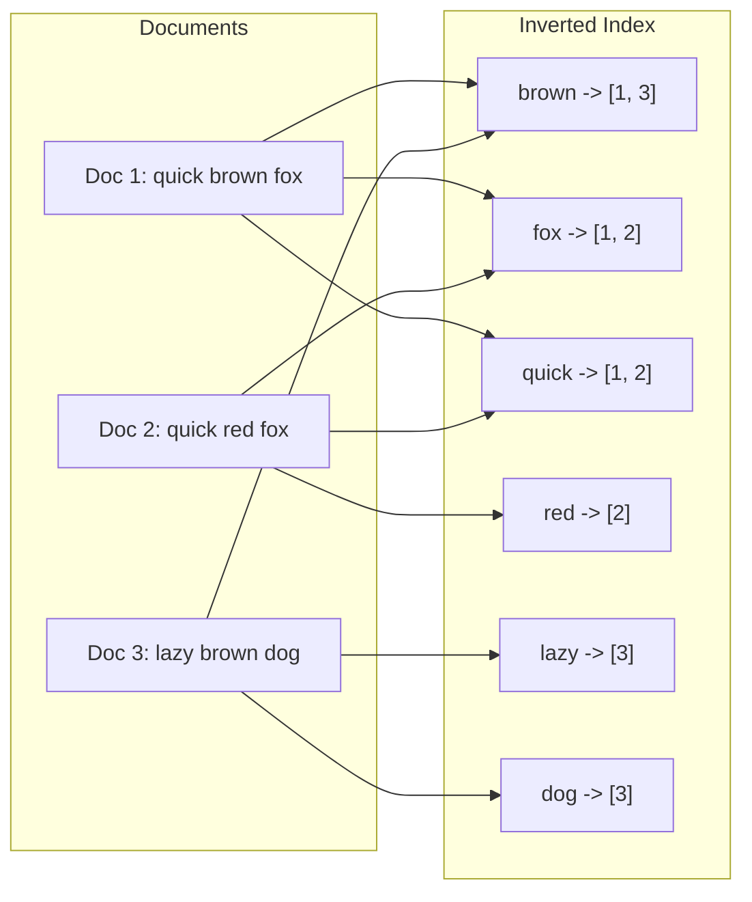
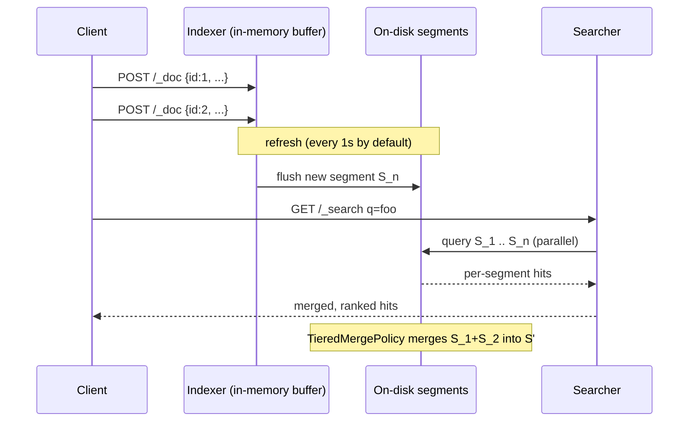
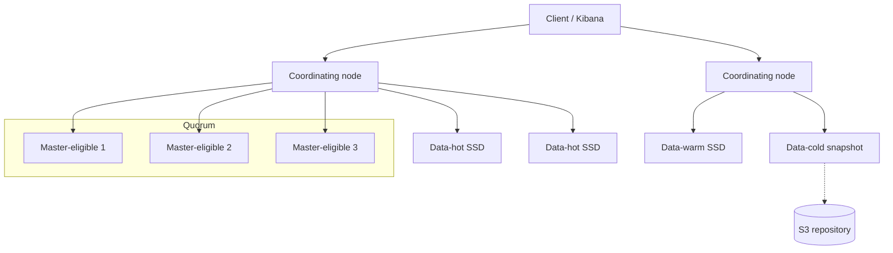
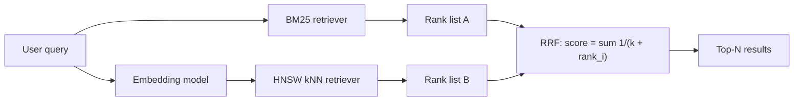

# Search Systems: Inverted Indexes, BM25, and Running Elasticsearch in Production

> **TL;DR**: A search engine is a specialized database whose primary index is inverted: terms point to documents, not the other way around. BM25 scores candidates by combining term rarity, frequency saturation, and document-length normalization with defaults (`k1=1.2`, `b=0.75`) that work surprisingly well out of the box[^1]. Apache Lucene provides the retrieval and scoring engine; Elasticsearch, OpenSearch, and Solr wrap it with sharding, REST APIs, and aggregations. The hardest production problems are not relevance tuning but operational: mapping explosions, heap pressure from fielddata, deep pagination, and shard hotspots[^2]. Start with Postgres full-text search under 10 million documents; graduate to a dedicated engine when you need BM25 ranking, faceted aggregations, or horizontal write scaling.

## Learning Objectives

After this module, you will be able to:

- [ ] Explain inverted indexes, posting lists, and why they differ from B-trees
- [ ] Reason about BM25 scoring and when to tune relevance vs accept defaults
- [ ] Design analyzers and tokenizers for multilingual or structured text
- [ ] Model faceted search with aggregations and doc values
- [ ] Operate Elasticsearch: shards, replicas, ILM tiers, and capacity planning

## Intuition

You own a cookbook collection of 10,000 books. A friend asks: "Which books mention both 'saffron' and 'risotto'?"

With a normal bookshelf (a B-tree), you would scan every book cover-to-cover looking for those words. That is a full table scan, and it takes all afternoon.

Instead, you build an index card system. One card per word. The "saffron" card lists every book and page where saffron appears: "Book 42 page 7, Book 891 page 3, Book 2044 page 12..." The "risotto" card has its own list. To answer your friend, you pull both cards and find the books that appear on both lists. Two card lookups, one intersection, done in seconds.

That card system is an inverted index. "Inverted" because a normal index maps books to words (a table of contents); this one maps words to books. The lists on each card are posting lists. The intersection is a sorted-list merge. And the reason search engines feel instantaneous on millions of documents is that this intersection is sub-millisecond when posting lists are delta-encoded and bit-packed[^3].

But finding matching books is only half the problem. Your friend does not want all 47 matches dumped in random order. She wants the best ones first. That is the ranking problem, and BM25 is the algorithm that solves it. The rest of this chapter builds both halves: retrieval (the inverted index) and ranking (BM25), then shows how Elasticsearch wraps them into a distributed system you can operate in production.

## Theory

### Inverted index fundamentals

An inverted index has two layers. The term dictionary maps every distinct token in the corpus to an entry. Each entry points to a posting list: a sorted sequence of document IDs where that token appears, optionally annotated with term frequency and position[^4].

[Data Structures for Systems](../part-0-prerequisites/02-data-structures-for-systems.md) introduced skip lists and finite-state transducers. Lucene uses a finite-state transducer (FST) for the term dictionary, giving O(|term|) lookup regardless of vocabulary size. Posting lists use delta encoding in blocks of 128 doc IDs: Lucene computes the maximum bits needed for deltas in a block and bit-packs the rest. This Frame-of-Reference (FOR) scheme compresses posting lists to a few bits per doc ID[^3]. Skip lists sit on top of posting lists so that conjunction queries (`A AND B`) can jump forward past non-matching blocks rather than scanning every ID.

The key insight: a B-tree is great for equality and range lookups on a single column. But "find all documents containing both `caching` and `strategy`" is not an equality lookup. It is a set intersection across two posting lists, and the inverted index is the only structure that makes this sub-millisecond at scale.



*Each term in the dictionary points to a posting list of document IDs; a query intersects posting lists rather than scanning documents.*

### Lucene segments, merges, and deletes

[Storage Engines](./00-storage-engines.md) showed how LSM-trees use immutable sorted files with background merges. Lucene's architecture is strikingly similar. An index is a collection of immutable segments. Each segment is a self-contained mini inverted index with its own term dictionary, posting lists, stored fields, and doc values.

New documents buffer in memory. At refresh (default: every 1 second), the buffer flushes to a new on-disk segment that becomes immediately searchable. Deletes do not remove data; they write a tombstone bit in a `.del` file. The `TieredMergePolicy` periodically merges small segments into larger ones, expunging tombstones in the process.

This design has consequences:

- **Near-real-time search is cheap.** A refresh creates a new segment without waiting for fsync. Documents are searchable within 1 second of indexing by default.
- **Deletes are expensive until merge.** A shard with many deleted documents wastes disk and degrades query performance because the searcher still visits tombstoned entries.
- **Merge storms consume resources.** Bulk-loading at the default 1-second refresh creates thousands of tiny segments that must merge. For bulk reindex, set `refresh_interval: -1` and restore it after the load.



*Writes buffer in memory, flush to a new immutable segment at refresh, and become searchable alongside existing segments until merge consolidates them.*

### BM25 scoring

BM25 (Best Matching 25) is the default scoring function in Lucene, Elasticsearch, OpenSearch, and Solr. For a query Q and document D, the score is:

```text
score(D, Q) = SUM over q_i in Q of:
  IDF(q_i) * [ f(q_i, D) * (k1 + 1) ] / [ f(q_i, D) + k1 * (1 - b + b * |D| / avgdl) ]
```

Where:

- `IDF(q_i) = log(1 + (N - n + 0.5) / (n + 0.5))` measures term rarity. N is total docs, n is docs containing the term.
- `f(q_i, D)` is the term frequency in document D.
- `|D|` is the document length in tokens; `avgdl` is the corpus average.
- `k1 = 1.2` controls term-frequency saturation. After a few occurrences, additional repeats barely raise the score. This prevents keyword-stuffed documents from dominating.
- `b = 0.75` controls length normalization. Longer documents are penalized because they naturally contain more tokens[^1].

**Why BM25 beats plain TF-IDF:** The simplest TF-IDF variant uses raw term frequency, which grows without bound, so a document repeating "caching" 50 times scores 50x higher than one mentioning it once. Sublinear variants (using 1 + log(tf)) partially address this, but BM25's saturation curve provides a more principled and tunable solution. BM25 also normalizes for document length, so a 10,000-word article does not automatically outrank a focused 500-word answer.

The defaults (`k1=1.2`, `b=0.75`) are strong on generic English prose. Most teams should invest in relevance evaluation (measuring click-through, NDCG, or MRR) before touching these knobs[^1].

> [!TIP]
> BM25 is a bag-of-words model. It cannot match "kubernetes" when the user types "k8s." This vocabulary mismatch is what hybrid BM25 + vector search (covered below) is designed to fix.

### Analyzers and tokenization

An analyzer is a three-stage pipeline applied at both index time and query time:

1. **Character filters** strip HTML, normalize Unicode, or map characters (e.g., `&` to `and`).
2. **Tokenizer** splits text into tokens. The `standard` tokenizer splits on whitespace and punctuation. Edge-n-gram tokenizers produce prefixes for autocomplete.
3. **Token filters** lowercase, remove stopwords, stem (Porter for English, Snowball for European languages), or apply synonyms.

Elasticsearch distinguishes `text` fields (analyzed, used for `match` queries) from `keyword` fields (not analyzed, used for `term` queries, aggregations, and sorting). The same source string is typically indexed into both as a multi-field mapping.

Language matters. CJK text has no whitespace between words, so standard tokenization fails completely. Kuromoji handles Japanese morphological analysis; SmartCN handles Chinese segmentation. GitHub's Blackbird code search explicitly disabled stemming and stopword removal because code tokens like `for`, `int`, and `var` are meaningful[^5].

**The critical constraint:** changing an analyzer on a live field requires a full reindex because existing postings encode the old analyzer's tokens. Choose your analyzer pipeline carefully before the first production document lands.

### Query DSL, filters, and aggregations

Elasticsearch's query DSL separates two contexts:

- **Query context** (scored): `match`, `multi_match`, `function_score`. Documents receive a BM25 relevance score.
- **Filter context** (cached, not scored): `term`, `range`, `bool.filter`. Results are cached as bitsets per segment and reused on subsequent queries for free.

The `bool` query composes clauses: `must` (scored AND), `should` (scored OR), `must_not` (exclusion), and `filter` (non-scoring AND). A common mistake is putting filters in `must` instead of `filter`, paying for scoring you discard.

**Aggregations** compute grouped statistics at query time. They read doc values, a per-field columnar side-store that Lucene writes alongside the postings. Doc values exist because the inverted index maps terms to docs, but aggregations need the transpose: docs to terms.

Key aggregation types:

- `terms` buckets documents by field value (faceted navigation).
- `date_histogram` groups by time interval (time-series dashboards).
- `cardinality` estimates distinct counts via HyperLogLog++ with typical error of 1-6% (depending on `precision_threshold`) at constant memory.

> [!IMPORTANT]
> Never enable `fielddata: true` on a `text` field. This loads the entire analyzed-token column into JVM heap and is the most common OOM trigger in Elasticsearch clusters. Use a `keyword` multi-field for sorting and aggregation instead.

### Sharding, replicas, and ILM

A shard is a Lucene index. An Elasticsearch index is a logical grouping of primary shards plus replicas. Current sizing guidance: aim for primary shards between 10 GB and 50 GB, below 200 million documents each[^2].

**Index Lifecycle Management (ILM)** moves indices through tiers as they age:

| Tier | Hardware | Use case |
|------|----------|----------|
| Hot | Fast NVMe SSDs | Active writes and frequent queries |
| Warm | Slower SSDs | Read-only, less frequent queries |
| Cold | Searchable snapshots on object storage | Rare queries, low cost |
| Frozen | Partially mounted snapshots | Archive, seconds-latency acceptable |
| Delete | N/A | TTL expired, purge |

Rolling indices (daily or monthly) let ILM run `rollover`, `shrink`, `force_merge`, and `delete` actions as each index ages. This pattern lets you change shard count per cycle without reindexing historical data.

**Operational rules of thumb:**

- Fewer than 3,000 indices per GB of master-node heap[^2].
- A shard is a single-threaded search unit (one thread per shard per query). Too many shards saturate the search thread pool.
- Shards below 1 GB waste cluster-state metadata. Consolidate small indices.



*A production cluster separates master, coordinating, and tiered data nodes; ILM moves shards from hot SSDs to cold searchable snapshots as indices age.*

### Elasticsearch vs OpenSearch vs Solr

All three are distributed wrappers around Lucene. The license history explains why three products exist where one might suffice:

- **2021:** Elastic moved Elasticsearch from Apache 2.0 to dual SSPL + Elastic License v2 (not OSI-approved).
- **2021:** AWS forked ES 7.10.2 to create OpenSearch under Apache 2.0.
- **2024:** Elastic added AGPL v3 as a third option, making Elasticsearch "open source" again under an OSI-approved license.

Code written against ES post-7.11 APIs does not run on OpenSearch unchanged; the drift is widening. Solr remains Apache 2.0 and was used at Slack as of 2020[^6], but its community velocity has slowed relative to Elasticsearch.

**Pick Elasticsearch** when you want feature velocity, Kibana, and managed Elastic Cloud. **Pick OpenSearch** when Apache 2.0 licensing is non-negotiable or you are on AWS. **Pick Solr** when you have existing Solr expertise and ZooKeeper infrastructure.

### Postgres full-text vs dedicated search

PostgreSQL ships `tsvector` and `tsquery` types plus GIN indexes. For workloads under roughly 10 million documents on a single node, GIN-indexed full-text search delivers sub-100 ms ranked results without additional infrastructure.

**When to stay with Postgres:**

- Simple matching needs (no facets, no complex boosting).
- ACID consistency between search and transactional data matters more than ranking quality.
- You cannot justify the ops burden of a separate cluster.

**When to graduate:**

- You need BM25-quality ranking with multi-field boosts.
- Faceted aggregations are a product requirement.
- Write throughput exceeds what a single-writer Postgres can handle.
- You need horizontal read scaling across shards.

The honest answer to "do we really need Elasticsearch?" is: not yet, until you do. The tell is when `ts_rank` stops satisfying users and you find yourself building a scoring pipeline in application code.

### Hybrid lexical + vector search

BM25 fails on vocabulary mismatch ("k8s" vs "kubernetes"). Dense vector embeddings fail on precise keyword matches ("error code E-4012"). Hybrid search runs both retrievers in parallel and fuses their rank lists.

Elasticsearch 8.x supports a `knn` clause alongside the standard `query` clause. The vector index uses Lucene's HNSW implementation. Results merge via Reciprocal Rank Fusion (RRF):

```text
RRF_score(doc) = sum over retrievers of 1 / (k + rank_i)
```

where `k` is a constant (default 60) that dampens the influence of low-ranked results. RRF requires no score normalization and is robust to score-scale differences between BM25 and cosine similarity.

[Vector Databases](./08-vector-databases.md) covers HNSW internals and dedicated vector stores. The bridge between that chapter and this one is hybrid retrieval: use BM25 for precision on known terms, vectors for recall on semantic matches, and RRF to merge.



*Hybrid search runs BM25 and kNN in parallel and fuses rank lists with Reciprocal Rank Fusion, picking up documents either retriever missed alone.*

## Real-World Example

### GitHub code search (Blackbird, 2023)

GitHub's previous search ran on Elasticsearch. It took months to index just 8 million repositories. Code search has requirements that break general-purpose text engines: punctuation is meaningful (`!=`, `->`, `::` are search tokens), stemming must be disabled (users search for `fmt` not `format`), and regex support is expected[^5].

In 2023, GitHub shipped Blackbird, a custom Rust search engine indexing 45 million repositories, 115 TB of source code, and 15.5 billion documents on a cluster of just 32 machines (64 cores each, 2,048 cores total)[^5].

**Key design decisions:**

- **Blob-SHA sharding.** Documents are sharded by Git blob SHA rather than by repository. This deduplicates across forks (a file identical in 1,000 forks is indexed once) and avoids hot shards from popular repos.
- **Sparse n-grams.** Pure trigrams are non-selective for common sequences like `for`. Blackbird uses a "sparse grams" algorithm that sizes n-grams based on bigram frequency weights, improving selectivity.
- **No stemming, no stopwords.** Code tokens like `int`, `for`, and `var` are meaningful. Disabling standard NLP preprocessing was essential.
- **Kafka-backed consistency.** Ingest events flow through Kafka. While you page through results, your view is pinned to a consistent commit-level snapshot.

**Results:** Ingest throughput of approximately 120,000 documents per second. Per-shard p99 latency around 100 ms. Per-host max throughput of roughly 640 QPS. The full 15.5 billion-document corpus reindexes in about 18 hours thanks to delta indexing that reduced crawl by more than 50%[^5].

The lesson: Elasticsearch is the right default for most search problems. But when your domain has unusual tokenization needs and your scale exceeds what a general engine can handle, building on Lucene (or Tantivy, the Rust equivalent) is a legitimate path. GitHub's previous "months to index 8M repos" was the failure that justified the rewrite.

## Trade-offs

| Approach | Pros | Cons | Best when | Our Pick |
|----------|------|------|-----------|----------|
| Postgres full-text (tsvector + GIN) | Zero extra infra, ACID with data, single backup | Limited ranking, no cheap facets, single-writer | Small catalogs, simple matching, under ~10M docs | **Start here** |
| Elasticsearch / OpenSearch | Powerful ranking, scalable, aggregations, rich ecosystem | Ops burden, JVM tuning, mapping explosion risk, cost | Most production search across GB-TB corpora | **Default for serious search** |
| Managed (Algolia, Typesense) | Turnkey, sub-100 ms p99 globally, no JVM | Per-query cost, vendor lock-in, limited custom analyzers | Small to mid teams without search expertise | When ops budget is zero |
| Custom (Lucene, Tantivy, Rust) | Maximum control, domain-specific features | Engineering cost, must reinvent sharding and coordination | Hyperscale or unusual requirements (GitHub Blackbird) | Only at GitHub/Google scale |

## Common Pitfalls

> [!WARNING]
> **Mapping explosion from dynamic mapping.** Dynamic mapping creates a new field for every JSON key it sees. A log pipeline with user IDs as object keys (instead of values) creates thousands of unique field paths, bloating cluster state until indexing is rejected at the default 1,000-field limit. Use explicit mappings or dynamic templates that cast new keys to `keyword` with `ignore_above`.

> [!WARNING]
> **Deep pagination with from + size.** Queries with `from` above 10,000 fail because each shard must load `from + size` top-N results and the coordinator must merge them all. Heap cost is linear in `from`. Use `search_after` with a unique sort tiebreaker for deep traversal; reserve `from + size` for the first few pages only.

> [!WARNING]
> **Heap pressure from text fielddata.** Sorting or aggregating on a `text` field loads the entire analyzed-token column into JVM heap, causing OOM and node ejection. This is disabled by default for good reason. Always use a `keyword` multi-field for sorting and aggregation.

> [!WARNING]
> **Refresh interval killing bulk throughput.** The default 1-second refresh creates a new segment per second per shard. During bulk loads, this produces thousands of tiny segments that trigger merge storms. Set `refresh_interval: -1` and `number_of_replicas: 0` during bulk reindex, then restore both after the load completes.

> [!WARNING]
> **Shard hotspotting under skewed routing.** Elasticsearch routes documents via `hash(routing_value) mod num_primary_shards`. If your routing values are not uniformly distributed (e.g., a default customer ID handles most traffic), one shard gets most writes while others idle. Use high-entropy document IDs or limit per-node shard allocation explicitly.

## Exercise

Design product search for an e-commerce site with 10 million SKUs, 50 query types, multi-tenant stores, typo tolerance, and faceted filtering. Decide between Elasticsearch, Algolia, and Typesense. Specify the indexing pipeline, acceptable update lag, and how you would A/B test relevance changes.

<details>
<summary>Hint</summary>

Consider: How many fields per product need analysis (title, description, brand, category)? How do you handle multi-tenancy (index-per-tenant vs filtered single index)? What is the write rate (product catalog updates are bursty but low-QPS compared to log ingestion)? For typo tolerance, think about edge-n-grams vs fuzzy queries. For A/B testing relevance, think about splitting traffic and measuring click-through rate and NDCG.

</details>

<details>
<summary>Solution</summary>

**Choice: Elasticsearch** (or OpenSearch). At 10M SKUs the corpus fits comfortably in a single index with 2-3 primary shards (each under 50 GB). Algolia's per-record pricing becomes expensive at 10M SKUs with frequent updates. Typesense is viable but lacks the aggregation depth needed for complex faceted navigation.

**Multi-tenancy:** Use a single index with a `tenant_id` keyword field and apply a `filter` clause on every query. This avoids the overhead of thousands of tiny indices (one per store) and lets ILM manage the single index lifecycle. If tenants have wildly different schemas, use index-per-tenant with index templates.

**Indexing pipeline:** Products flow from the catalog database via CDC (Debezium) into Kafka, then a consumer writes to Elasticsearch. Acceptable lag: under 30 seconds for price changes, under 5 minutes for new products. Set `refresh_interval: 5s` (not the default 1s) since shoppers tolerate a few seconds of staleness.

**Analyzer design:** Use a custom analyzer with `standard` tokenizer, `lowercase` filter, `synonym` filter (mapping brand abbreviations), and `edge_ngram` filter (min 2, max 10) on the `title.autocomplete` sub-field for typo-tolerant prefix matching. Keep a `title.exact` keyword field for aggregations.

**Faceted filtering:** Use `terms` aggregations on `brand`, `category`, `color`, and `price_range` keyword fields. Post-filter pattern: run the query without facet filters to compute global facet counts, then apply selected filters for the result set.

**A/B testing relevance:** Deploy two index aliases (`search-v1`, `search-v2`) pointing at the same index but with different `function_score` wrappers or boosting profiles. Route 10% of traffic to v2. Measure NDCG@10 and click-through rate over 7 days. Promote the winner.

**Trade-off accepted:** You give up Algolia's zero-ops experience and built-in typo tolerance in exchange for full control over analyzers, aggregations, and cost at 10M SKUs.

</details>

## Key Takeaways

- An inverted index maps terms to posting lists of document IDs. It is the only structure that makes multi-term intersection sub-millisecond at scale.
- Lucene segments are immutable; writes create new segments, deletes are tombstones, and merges consolidate. This is structurally similar to LSM-trees.
- BM25 defaults (`k1=1.2`, `b=0.75`) are strong on English prose. Invest in relevance evaluation before tuning parameters.
- Filter context is cached per segment and free on repeat queries. Always put non-scoring constraints in `filter`, not `must`.
- Shard sizing (10-50 GB, under 200M docs) and ILM tiering (hot/warm/cold/frozen) are the two levers that control cost and performance at scale.
- Postgres full-text search is the right starting point under 10M documents. Graduate to Elasticsearch when you need BM25 ranking, facets, or horizontal scaling.
- Hybrid BM25 + vector search with RRF fusion is where production search is heading. It fixes vocabulary mismatch without abandoning keyword precision.

## Further Reading

- [Practical BM25 Part 2: The BM25 Algorithm and its Variables](https://www.elastic.co/blog/practical-bm25-part-2-the-bm25-algorithm-and-its-variables) - The clearest applied explanation of k1 and b with runnable examples; read this before tuning relevance.
- [The technology behind GitHub's new code search](https://github.blog/engineering/the-technology-behind-githubs-new-code-search/) - The best public writeup of a custom search engine at hyperscale; essential reading for understanding when to leave Elasticsearch.
- [Elasticsearch: Size your shards](https://www.elastic.co/guide/en/elasticsearch/reference/current/size-your-shards.html) - Current Elastic sizing guidance with the 10-50 GB and 200M-doc rules; bookmark for capacity planning.
- [Introduction to Information Retrieval (Manning, Raghavan, Schutze)](https://nlp.stanford.edu/IR-book/) - The foundational textbook on inverted indexes, tokenization, and scoring; free online.
- [Frame of Reference and Roaring Bitmaps](https://www.elastic.co/blog/frame-of-reference-and-roaring-bitmaps) - How Lucene compresses posting lists to a few bits per doc ID; explains why search is fast at the byte level.
- [Search at Slack](https://slack.engineering/search-at-slack/) - Two-stage ranking with Solr plus learning-to-rank; a production case study of BM25 as first-stage retrieval.
- [Elasticsearch is open source, again](https://www.elastic.co/blog/elasticsearch-is-open-source-again) - The 2024 AGPL addition; essential context for the ES vs OpenSearch licensing decision.
- [PostgreSQL Full-Text Search documentation](https://www.postgresql.org/docs/current/textsearch-indexes.html) - The official guide on tsvector, tsquery, and GIN indexes; read before deciding you need a separate search cluster.

## Flashcards

**Q:** What is an inverted index and how does it differ from a B-tree index?
**A:** An inverted index maps terms to sorted lists of document IDs (posting lists). A B-tree maps keys to row locations for equality and range lookups. The inverted index enables multi-term intersection queries that B-trees cannot serve efficiently.

**Q:** What are the default BM25 parameters in Lucene/Elasticsearch, and what do they control?
**A:** `k1=1.2` controls term-frequency saturation (how quickly additional occurrences stop mattering). `b=0.75` controls document-length normalization (how much longer documents are penalized). These defaults work well on generic English prose.

**Q:** Why does BM25 beat plain TF-IDF?
**A:** BM25 saturates term frequency so keyword-stuffed documents cannot dominate, and it normalizes for document length so long documents do not win simply by containing more tokens. TF-IDF has unbounded term frequency and no length normalization.

**Q:** What is a Lucene segment, and why are segments immutable?
**A:** A segment is a self-contained mini inverted index (term dictionary, posting lists, doc values). Immutability enables lock-free concurrent reads, OS page-cache efficiency, and simple crash recovery. New data creates new segments; merges consolidate old ones.

**Q:** What is the recommended shard size for Elasticsearch?
**A:** Primary shards should be between 10 GB and 50 GB, with fewer than 200 million documents each. Shards below 1 GB waste cluster-state metadata; shards above 50 GB slow recovery and merge operations.

**Q:** What is the difference between query context and filter context in Elasticsearch?
**A:** Query context scores documents with BM25 (relevance ranking). Filter context produces a yes/no bitset without scoring, and results are cached per segment for free reuse. Always put non-scoring constraints in filter context.

**Q:** Why is enabling fielddata on a text field dangerous?
**A:** It loads the entire analyzed-token column into JVM heap for sorting or aggregation. This is typically orders of magnitude larger than the on-disk postings and is the most common cause of OOM in Elasticsearch clusters.

**Q:** What is Reciprocal Rank Fusion (RRF) and when do you use it?
**A:** RRF merges rank lists from multiple retrievers (e.g., BM25 and kNN vector) by scoring each document as the sum of `1/(k + rank_i)` across retrievers. It requires no score normalization and is used in hybrid lexical + vector search.

**Q:** When should you use Postgres full-text search instead of Elasticsearch?
**A:** Under approximately 10 million documents when you need simple matching, ACID consistency with transactional data, and cannot justify the operational burden of a separate search cluster. Graduate when you need BM25 ranking, faceted aggregations, or horizontal scaling.

**Q:** What did GitHub's Blackbird replace, and why?
**A:** Blackbird replaced an Elasticsearch-based code search that took months to index 8 million repositories. Code search requires punctuation-aware tokenization, no stemming, and regex support, which broke general-purpose text engine assumptions. Blackbird indexes 15.5 billion documents on 32 machines.

**Q:** What are the five ILM tiers in Elasticsearch?
**A:** Hot (active writes, fast SSDs), warm (read-only, slower SSDs), cold (searchable snapshots on object storage), frozen (partially mounted snapshots, seconds-latency), and delete (TTL expired, purge).

**Q:** How does deep pagination break in Elasticsearch, and what is the fix?
**A:** `from + size` requires each shard to load `from + size` top-N results; the coordinator merges them all, with heap cost linear in `from`. The default cap is 10,000. The fix is `search_after` with a unique sort tiebreaker for cursor-based pagination.

## References

[^1]: Elastic, "Practical BM25 Part 2: The BM25 Algorithm and its Variables", April 2018. https://www.elastic.co/blog/practical-bm25-part-2-the-bm25-algorithm-and-its-variables
[^2]: Elastic, "Size your shards". https://www.elastic.co/guide/en/elasticsearch/reference/current/size-your-shards.html
[^3]: Apache Lucene, "Lucene90PostingsFormat: PackedBlockSize is currently fixed as 128", Lucene 9.0 Javadoc. https://lucene.apache.org/core/9_0_0/core/org/apache/lucene/codecs/lucene90/Lucene90PostingsFormat.html
[^4]: Manning, Raghavan, Schutze, "Introduction to Information Retrieval", Cambridge University Press 2008. https://nlp.stanford.edu/IR-book/
[^5]: Timothy Clem, "The technology behind GitHub's new code search", GitHub Blog, February 2023. https://github.blog/engineering/the-technology-behind-githubs-new-code-search/
[^6]: Tromba, Gallagher, Liszka, "Search at Slack", Slack Engineering, February 2017 (updated June 2020). https://slack.engineering/search-at-slack/

