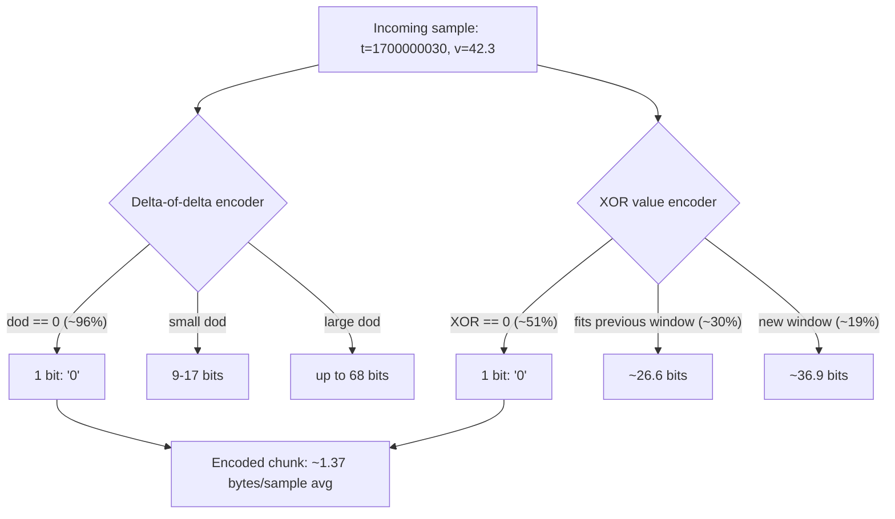
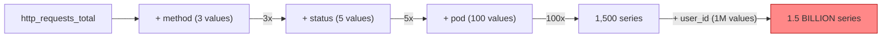
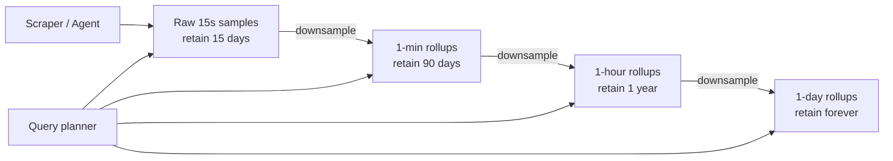
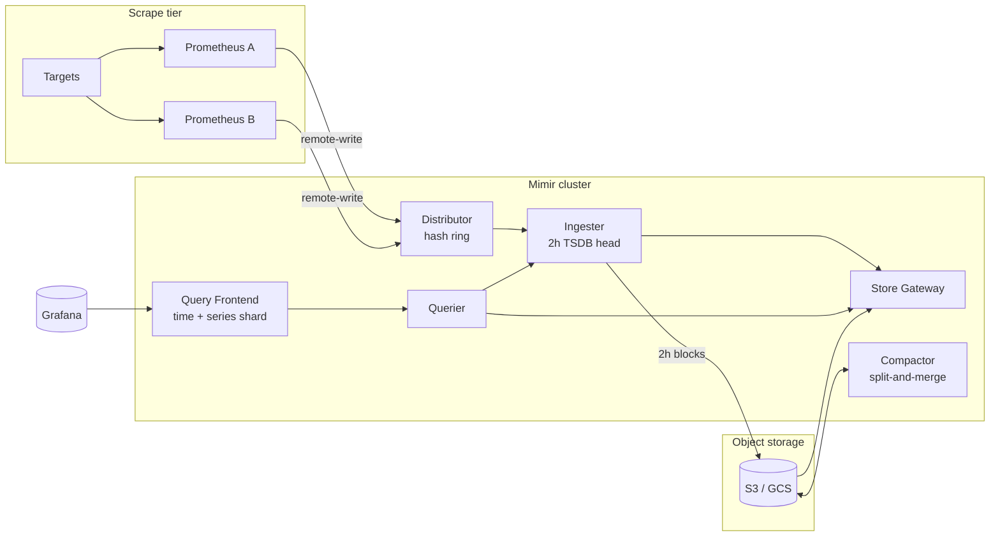

# Time-Series Databases: Metrics, Events, and Retention at Scale

> **TL;DR**: Time-series databases exploit the regularity of append-only, time-ordered data to compress 16-byte raw samples down to ~1.37 bytes using delta-of-delta timestamps and XOR float encoding[^1]. The hard scaling axis is not data volume but **cardinality**: the number of unique `(metric_name, label_set)` combinations. One unbounded label like `user_id` can multiply series count by a million overnight, consuming 850 MB of RAM per million series on VictoriaMetrics or 6.5 GB on Prometheus[^2]. Downsampling is not optional; it is the economic foundation that makes long-term retention affordable.

## Learning Objectives

After this module, you will be able to:

- [ ] Explain why time-series workloads benefit from specialized storage
- [ ] Design tag schemas that avoid cardinality explosions
- [ ] Configure downsampling, retention, and compaction policies
- [ ] Compare Prometheus, InfluxDB, TimescaleDB, and VictoriaMetrics for a given use case
- [ ] Estimate storage cost for a metrics workload

## Intuition

Imagine a weather station that records the temperature every 15 seconds. Each reading is a number with a timestamp. You never go back and change yesterday's temperature. You rarely look up a single reading. Instead, you ask questions like "what was the average temperature last Tuesday?" or "show me the hourly highs for the past month."

Now scale that to 10,000 weather stations, each reporting 500 different measurements (temperature, humidity, wind speed, pressure, UV index...). That is 5 million readings per second. Each reading is tiny (a timestamp and a number), but the sheer volume is enormous. And here is the key insight: yesterday's per-second data is almost useless. You only need per-minute averages after a week, per-hour averages after a month, and daily summaries after a year.

This is exactly how server monitoring works. Your fleet emits millions of metric samples per second. The data is append-only, time-ordered, queried by range, and decays in value with age. A generic database handles it, but a purpose-built time-series database (TSDB) exploits that regularity to deliver 10x to 100x better storage efficiency and query performance.

[Storage Engines](./00-storage-engines.md) introduced LSM-trees and WALs as the engine layer underneath. [OLTP vs OLAP](./01-oltp-vs-olap.md) showed how columnar storage wins at scan-heavy workloads. Time-series databases sit in a unique niche: they borrow LSM-style append-only writes, columnar-style compression, and add time-aware chunking and downsampling that neither OLTP nor OLAP engines provide natively.

## Theory

### What makes time-series data special

A time-series workload has four defining properties:

1. **Append-only.** Samples arrive and are never updated. You do not change last Tuesday's CPU reading.
2. **Time-ordered.** Timestamps are monotonically increasing (or nearly so). This regularity is exploitable for compression.
3. **Range-scan queries.** You almost never fetch a single point. Queries are "give me all values between T1 and T2, grouped by label, aggregated."
4. **Value decay.** Per-second data from six months ago is worthless. Per-hour summaries suffice.

These properties let a TSDB make assumptions that generic databases cannot. Because writes are append-only, there is no random-write amplification from B-tree page splits. Because timestamps are evenly spaced, they compress to near-zero overhead. Because data ages out, the engine can drop entire time-range blocks without running per-row deletes[^3].

The result: Prometheus stores an average of 1 to 2 bytes per sample[^3], compared to the 16 bytes a naive `(int64 timestamp, float64 value)` tuple would require. That is an 8x to 12x reduction before you even consider the label index.

### Storage techniques: Gorilla compression

The canonical TSDB storage layout has three layers: a write-ahead log for durability, an in-memory head block for recent writes, and immutable time-partitioned blocks on disk. Inside each block, two compression algorithms from the Gorilla paper (Pelkonen et al., VLDB 2015) do the heavy lifting[^1].

**Delta-of-delta for timestamps.** If your scrape interval is 15 seconds, consecutive timestamps differ by exactly 15,000 ms. The delta is constant. The delta-of-delta (the change in the change) is zero. A zero encodes as a single bit. On Facebook's production workload, approximately 96% of timestamp delta-of-deltas collapsed to one bit[^1].

**XOR encoding for float values.** Consecutive metric values tend to be similar (CPU at 42.3%, then 42.5%, then 42.1%). XOR the current float's bits with the previous float's bits. If the XOR is zero (identical values), store one bit. If the significant bits fit within the same bit window as the previous XOR, reuse that window. On Facebook's workload, 51% of values compressed to a single bit, 30% to about 26.6 bits, and the rest to about 36.9 bits, averaging 1.37 bytes per sample end-to-end[^1].



*Gorilla's two-stage compression exploits the regularity of evenly-spaced scrapes and slowly-changing float values to achieve 12x reduction over raw storage.*

Prometheus groups samples into 2-hour blocks. Each block is a directory containing chunk files (up to 512 MB segments), an index mapping labels to series, and metadata. The current block lives in memory and is protected by a WAL in 128 MB segments. Completed blocks compact in the background into larger blocks capped at 31 days or 10% of retention time[^3].

InfluxDB 1.x uses its TSM (Time Structured Merge) engine with the same basic shape. InfluxDB 3.0 (IOx) rewrote everything in Rust on top of Apache Arrow, DataFusion, and Parquet. TimescaleDB takes a different approach: it is a Postgres extension that auto-partitions tables into time-range "hypertable chunks," then applies columnar compression within each chunk for 90%+ storage reduction.

### Cardinality: the cost driver

Cardinality is the number of unique time series. Each unique combination of metric name plus label values counts as one series:

```text
http_requests_total{method="GET", status="200", route="/api/users"}  -> 1 series
http_requests_total{method="POST", status="500", route="/api/orders"} -> 1 series
```

Every active series requires an inverted-index entry, a chunk chain in memory, and entries in the label-value dictionary. The cost is linear in series count.



*One unbounded label multiplies series count by its unique-value count. Adding user_id as a label turns a manageable metric into a cardinality bomb.*

The per-system memory costs are stark (per VictoriaMetrics benchmarks, 2022)[^2]:

| System | RAM per 1M unique series |
|--------|--------------------------|
| VictoriaMetrics | ~850 MB |
| InfluxDB (1.x/2.x) | ~5 GB |
| Prometheus | ~6.5 GB (start), ~14 GB (steady) |

A single Prometheus instance is commonly reported to handle up to approximately 2 million active series on commodity hardware[^4]. VictoriaMetrics' single-node version handles up to 100 million active series[^4]. Scale to Grafana Mimir's 1 billion active series test and you need 1,500 replicas, 7,000 CPU cores, and 30 TiB of RAM[^5].

Common cardinality explosions come from unbounded labels: `user_id`, `request_id`, `trace_id`, raw URL paths, IP addresses, or free-form error messages. The fix: move high-cardinality identifiers to exemplars or logs, not metric labels. Set per-tenant cardinality limits. Use relabel rules to drop or hash offending labels before ingestion.

### Ingestion models: pull vs push

**Pull (Prometheus scrape model).** The server periodically HTTP-GETs `/metrics` endpoints on each target. The scrape interval is controlled centrally. A failed scrape becomes a natural `up == 0` health signal. Service discovery (Kubernetes, Consul, EC2) decides what to monitor. The cost: bidirectional network reachability. The Prometheus server must connect to every target.

**Push (InfluxDB line protocol, OTLP, StatsD).** Targets emit metrics through stateless agents. Firewalls are easier to traverse. Ephemeral workloads (batch jobs, serverless functions) can flush before exit. The cost: the server cannot distinguish "agent crashed" from "no data to send."

**Remote write as federation glue.** Prometheus or vmagent scrape locally, then push Snappy-compressed protobuf batches to a central cluster (Mimir, Cortex, Thanos, VictoriaMetrics). This hybrid model gives you pull's liveness detection at the edge and push's scalability at the center.

### The major systems

**Prometheus** is the operational monitoring standard. Local TSDB with 2-hour blocks, PromQL query language, 15-day default retention[^3]. Not clustered by design. Scaling requires federation or remote-write to a separate backend.

**InfluxDB** has three incompatible generations. 1.x introduced TSM with InfluxQL. 2.x added Flux (a functional query language). 3.0 (IOx) is a full Rust rewrite on Arrow + DataFusion + Parquet with a "no limits on cardinality" design goal and SQL support.

**TimescaleDB** is a Postgres extension. Hypertables auto-partition by time. Continuous aggregates refresh incrementally. Full SQL, ACID, JOINs, and secondary indexes come free from Postgres. Best for teams already running Postgres who want time-series without a new operational burden.

**VictoriaMetrics** was written from scratch in Go, borrowing ideas from ClickHouse for its storage layout[^4]. Single-node handles 100M active series at 2M samples/sec. Cluster mode splits into vminsert (stateless distributor), vmstorage (stateful ingesters), and vmselect (stateless query layer). Reports using 2 to 10x less CPU and RAM than Prometheus for equivalent workloads.

### Downsampling and retention

Raw samples are expensive and mostly useless after a few days. Every production TSDB solves this with tiered retention:



*Raw samples age into progressively coarser rollups. The query planner transparently selects the appropriate tier based on the requested time range.*

Each tier stores `avg`, `min`, `max`, and `count` per window. A 30-day dashboard query hits the 1-minute tier (2,880 points per series per day) instead of the raw tier (5,760 points per series per day at 15s intervals). The storage savings compound: 1M series at 15s intervals for 30 days is roughly 350 GB compressed. With 1-minute downsampling after 7 days, that drops to under 150 GB.

Downsampling is not a nice-to-have. It is the economic foundation of the product.

## Real-World Example

### Grafana Mimir: scaling Prometheus to 1 billion active series

Grafana Mimir (a fork of Cortex, announced March 2022) is the most publicly documented scale test of a Prometheus-compatible TSDB[^5].

**Architecture.** Mimir splits into stateless and stateful tiers connected by a consistent-hash ring:

- **Distributor:** Accepts remote-write from Prometheus instances, shards samples by series hash.
- **Ingester:** Owns a TSDB head per tenant, flushes 2-hour blocks to S3-compatible object storage.
- **Store Gateway:** Serves historical blocks from object storage.
- **Querier + Query Frontend:** Plans and parallelizes PromQL queries with time splitting and series sharding.
- **Compactor:** Merges and downsamples blocks. Mimir's split-and-merge compactor shards compaction jobs across many replicas to stay under the 4 GB TSDB index-section limit.



*Mimir at 1B active series: distributors hash-shard writes into ingesters, ingesters flush 2-hour blocks to object storage, the compactor shards compaction to stay under the 4 GB TSDB index-section limit, and queries fan out across ingesters and the store gateway.*

**Scale numbers.** Grafana tested Mimir at 1 billion active series on a single tenant[^5]:

- 1,500 replicas, 7,000 CPU cores, 30 TiB RAM
- ~50M samples/sec ingest rate (20s scrape interval)
- SLO: 99.9% of writes succeed under 10s, 99.9% of reads under 2s average

**Key engineering wins:**

- Query sharding delivered a 10x reduction in execution time on high-cardinality queries[^5].
- Asynchronous chunk writes reduced p99 write latency from 45 seconds to 3 seconds (previously, all chunks closed at the 2-hour block boundary simultaneously, causing a write storm)[^5].
- Memberlist CPU usage was consuming 1.6 to 1.9 cores per replica (2,500 cores cluster-wide) just to propagate ring changes. A series of dskit patches reduced this by 90%.

The lesson: Prometheus' local TSDB is elegant for single-node use, but horizontal scale requires a purpose-built distributed layer. Mimir, Thanos, and VictoriaMetrics cluster mode each solve this differently.

## Trade-offs

| Approach | Pros | Cons | Best when | Our Pick |
|----------|------|------|-----------|----------|
| Prometheus (single node) | Simple, huge ecosystem, battle-tested, standard format | Practical single-node ceiling in the low millions of active series (hardware-dependent), no clustering, 15-day default retention | Single cluster, ops metrics, teams wanting zero extra services | **Default for small-to-medium monitoring** |
| InfluxDB (1.x/2.x/3.x) | Push-friendly, IoT integrations, IOx has unlimited-cardinality design | Three incompatible versions, 5 GB RAM per 1M series in older engines, clustering is commercial | IoT, product analytics, teams willing to run IOx on object storage | When push ingestion and SQL matter more than ecosystem |
| TimescaleDB | Full SQL, ACID, JOINs, reuses Postgres ops knowledge, 90%+ compression | Lower compression than specialized engines, single-writer Postgres model | Teams already on Postgres, analytics mixing time-series with relational data | **When you refuse to add another database** |
| VictoriaMetrics | Claims 2-10x less RAM than Prometheus, simpler than Thanos/Cortex, one binary | Smaller ecosystem, MetricsQL quirks, single-node-first posture | Large metric volumes, cost-sensitive monitoring | **Best cost-per-series at scale** |
| Mimir / Thanos (distributed) | Horizontal scale to billions of series, multi-tenant, object-storage backing | Operational complexity (hash rings, WAL, compactor); up to 2-hour worst-case head-block loss if ingester replication also fails | Multi-tenant SaaS, federation across regions, past single-node capacity | When you outgrow single-node Prometheus |

## Common Pitfalls

> [!WARNING]
> **Cardinality explosion from unbounded labels.** A single label with unbounded values (`user_id`, `request_id`, raw URL path) multiplies series count by that label's cardinality. Your ingester OOMs overnight. Move high-cardinality identifiers to exemplars or logs. Set per-metric cardinality limits. Watch `prometheus_tsdb_head_series` like a hawk.

> [!WARNING]
> **Not using `rate()` on counters.** Counters only go up (modulo resets). Plotting `http_requests_total` directly shows a monotonically increasing line where a restart looks like traffic dropped to zero. Always wrap counters in `rate()` or `increase()`. Never apply `rate()` to gauges.

> [!WARNING]
> **Histogram buckets that miss your SLO.** Classic Prometheus histograms interpolate linearly within a bucket[^6]. If your p95 lives in a 200-300 ms bucket, the estimate is 295 ms even if the true value is 220 ms. Add bucket boundaries near your SLO thresholds, or switch to native exponential histograms (Prometheus 2.40+) which dynamically adjust bucket widths.

> [!WARNING]
> **Averaging summary quantiles across instances.** A `avg(http_duration{quantile="0.95"})` across three replicas is statistically meaningless[^6]. Summaries pre-compute quantiles on the client; only raw observations could be aggregated, and those are discarded. Use histograms instead: bucket counts are additive across instances.

> [!WARNING]
> **Forgotten retention filling the disk.** Prometheus defaults to 15 days but WAL plus head chunks count against total disk. A high-cardinality churn pattern grows the index faster than sample data. Set `--storage.tsdb.retention.size` to 80-85% of allocated disk. Monitor `prometheus_tsdb_storage_blocks_bytes` plus WAL directory size.

## Exercise

Design monitoring for a fleet of 10,000 servers, each emitting 500 metrics/sec with 20 labels. Pick a stack. Decide retention (raw, 5-min rollup, 1-hour rollup), alert on cardinality, and estimate storage cost at 90-day retention.

<details>
<summary>Hint</summary>

Start with the math: 10,000 servers x 500 metrics/sec = 5M samples/sec. With 20 labels, how many unique series could exist? At 2 bytes/sample compressed, what is the daily storage? Does a single Prometheus instance handle this, or do you need a distributed solution?

</details>

<details>
<summary>Solution</summary>

**Capacity estimation:**

- Ingest rate: 10,000 x 500 = 5,000,000 samples/sec
- Cardinality: depends on label uniqueness. If labels are bounded (method, status, region, service), expect 2-5M unique series. If any label is unbounded, it explodes.
- Storage per day (raw): 5M samples/sec x 86,400 sec x 2 bytes = ~864 GB/day
- 90-day raw retention: ~78 TB (unaffordable)

**Retention tiers:**

| Tier | Resolution | Retention | Daily storage |
|------|-----------|-----------|---------------|
| Raw | 15s | 7 days | ~864 GB |
| 5-min rollup | 5 min | 90 days | ~43 GB |
| 1-hour rollup | 1 hour | 1 year | ~3.6 GB |

Total 90-day cost: 7 days raw (~6 TB) + 83 days at 5-min (~3.6 TB) = ~9.6 TB compressed.

**Stack choice:** A single Prometheus instance caps at ~2M series. With 2-5M series, you need either:

- **VictoriaMetrics cluster:** vminsert shards across 3-5 vmstorage nodes. Handles 100M series single-node, so 5M is comfortable on one node. Cheapest option.
- **Prometheus + Mimir:** Multiple Prometheus instances scrape subsets of the fleet, remote-write to Mimir backed by S3. Better multi-tenant isolation but more operational complexity.

**Cardinality alerting:** Alert when `sum(scrape_series_added)` exceeds a threshold per job. Use VictoriaMetrics' cardinality explorer or Mimir's per-tenant limits to cap at 5M series.

**Decision:** VictoriaMetrics single-node for this scale. It handles 5M series in ~4.25 GB RAM, costs a fraction of a distributed deployment, and supports both pull and push ingestion. Add vmagent for scraping and stream aggregation at the edge.

</details>

## Key Takeaways

- Cardinality (unique series count), not sample volume, is what kills a TSDB. One bad label can 100x your memory usage overnight.
- Gorilla compression (delta-of-delta timestamps + XOR float values) achieves ~1.37 bytes per sample, a 12x reduction from raw 16-byte tuples.
- Downsampling is the economic foundation of long-term retention. Raw 15s data for 90 days is unaffordable; 5-minute rollups cut storage by 20x.
- Prometheus won operational metrics but caps at ~2M series per instance. Beyond that, choose VictoriaMetrics (cost), Mimir (multi-tenant scale), or Thanos (simplicity with object storage).
- Pull ingestion (Prometheus scrape) gives you free liveness detection. Push ingestion (OTLP, InfluxDB line protocol) traverses firewalls and handles ephemeral workloads. Use remote-write to bridge both.
- Always `rate()` your counters, never average pre-computed quantiles across instances, and add histogram bucket boundaries near your SLO thresholds.
- TimescaleDB is the right answer when your team already runs Postgres and refuses to add another database to the stack.

## Further Reading

- [Gorilla: A Fast, Scalable, In-Memory Time Series Database](http://www.vldb.org/pvldb/vol8/p1816-teller.pdf) - Pelkonen et al., VLDB 2015. The foundational paper behind every modern TSDB chunk format; read the delta-of-delta and XOR sections to understand why 1.37 bytes/sample is achievable.
- [Prometheus Storage documentation](https://prometheus.io/docs/prometheus/latest/storage/) - Canonical reference for 2-hour blocks, WAL segments, compaction, and retention configuration.
- [How we scaled Grafana Mimir to 1 billion active series](https://grafana.com/blog/2022/04/08/how-we-scaled-our-new-prometheus-tsdb-grafana-mimir-to-1-billion-active-series/) - Marco Pracucci, 2022. The best public deep dive into TSDB bottlenecks at extreme scale, including the 45s-to-3s p99 fix.
- [VictoriaMetrics FAQ](https://docs.victoriametrics.com/faq/) - Opinionated comparison against Cortex, Thanos, InfluxDB, and TimescaleDB with concrete RAM and CPU numbers.
- [Thanos Quick Tutorial](https://thanos.io/tip/thanos/quick-tutorial.md/) - Sidecar, Querier, Store Gateway, and Compactor explained in one page; the simplest path to long-term Prometheus storage.
- [Prometheus Histograms and Summaries](https://prometheus.io/docs/practices/histograms/) - Authoritative source on native histograms, quantile estimation errors, and why summaries cannot aggregate across instances.
- [Understanding InfluxDB IOx](https://www.influxdata.com/blog/understanding-influxdb-iox-commitment-open-source/) - The Rust + Arrow + DataFusion + Parquet architecture that powers InfluxDB 3.0; explains the "FDAP stack" and unlimited-cardinality design.
- [M3: Uber's Open Source, Large-scale Metrics Platform](https://www.uber.com/blog/m3/) - How Uber aggregates 500 million metrics per second and persists 20 million to storage globally across 6.6 billion time series using M3DB, M3Coordinator, and M3Query.

## Flashcards

**Q:** What is cardinality in a TSDB and why does it matter more than sample volume?
**A:** Cardinality is the number of unique time series, where each unique combination of metric name + label values is one series. Each series requires an inverted-index entry and a chunk chain in memory. A single unbounded label (user_id) can multiply series count by millions, OOMing the ingester, while raw sample volume is handled cheaply by compression.

**Q:** How does Gorilla's delta-of-delta encoding compress timestamps?
**A:** It stores the difference between consecutive timestamp deltas. On a fixed scrape interval (e.g., 15s), the delta is constant, so the delta-of-delta is zero, encoding as a single bit. About 96% of timestamps compress to 1 bit on regular scrape workloads.

**Q:** How does XOR encoding compress float values in a TSDB?
**A:** XOR the current float's bits with the previous float's bits. If the result is zero (identical values), store 1 bit. If the significant bits fit the previous XOR's bit window, reuse it (~26.6 bits). Otherwise store a new window header (~36.9 bits). Average: 1.37 bytes/sample.

**Q:** What is the practical series limit for a single Prometheus instance?
**A:** Approximately 2 million active series on commodity hardware. Beyond that, you need a distributed solution (Mimir, Thanos, VictoriaMetrics cluster, or M3).

**Q:** Why can you not average summary quantiles across multiple instances?
**A:** Summaries pre-compute quantiles on the client and discard the raw observations. Pre-computed quantiles are not additive. Use histograms instead: bucket counts are additive, so you can sum across instances and then compute histogram_quantile().

**Q:** What is the difference between pull and push ingestion in TSDBs?
**A:** Pull (Prometheus scrape): server HTTP-GETs /metrics from targets on a fixed interval. Gives central rate control and free liveness detection (failed scrape = target down). Push (InfluxDB, OTLP): targets send metrics to a collector. Traverses firewalls, handles ephemeral jobs, but loses the built-in health signal.

**Q:** Why is downsampling the "economic foundation" of time-series storage?
**A:** Raw 15s samples for 1M series over 30 days consume ~350 GB. Per-minute rollups reduce that by 4x, per-hour by 240x. Without downsampling, long-term retention is economically infeasible. Every production TSDB implements tiered retention.

**Q:** How does Prometheus handle retention and block deletion?
**A:** Prometheus groups samples into immutable 2-hour blocks. Retention is enforced by deleting entire blocks older than the configured time (default 15 days) or exceeding the configured size. No per-row DELETE is needed because blocks are time-partitioned.

**Q:** What problem did Grafana Mimir's async chunk writes solve?
**A:** Every 2 hours, all chunks closed at the block boundary simultaneously, causing a write storm that spiked p99 latency to 45 seconds. Moving chunk writes to an asynchronous queue reduced p99 to 3 seconds.

**Q:** How much RAM does VictoriaMetrics use per 1 million unique series compared to Prometheus?
**A:** VictoriaMetrics uses approximately 850 MB per 1M series. Prometheus uses 6.5 GB (start) to 14 GB (steady state) for the same workload, roughly 8-16x more.

**Q:** What are the three components of VictoriaMetrics cluster mode?
**A:** vminsert (stateless distributor accepting remote-write, OTLP, InfluxDB line protocol), vmstorage (stateful ingesters owning local data on block devices), and vmselect (stateless query layer serving MetricsQL/PromQL).

**Q:** When should you choose TimescaleDB over a dedicated TSDB?
**A:** When your team already runs Postgres, needs full SQL with JOINs and ACID transactions, wants to mix time-series queries with relational data, and prefers reusing existing operational knowledge over adding a new database to the stack.

## References

[^1]: T. Pelkonen et al., "Gorilla: A Fast, Scalable, In-Memory Time Series Database", Proceedings of the VLDB Endowment, vol. 8, no. 12, 2015. http://www.vldb.org/pvldb/vol8/p1816-teller.pdf
[^2]: Dmytro Kozlov, "Cardinality explorer", VictoriaMetrics blog, 2022-10-04. https://victoriametrics.com/blog/cardinality-explorer/
[^3]: Prometheus project, "Storage" documentation. https://prometheus.io/docs/prometheus/latest/storage/
[^4]: VictoriaMetrics FAQ. https://docs.victoriametrics.com/faq/
[^5]: Marco Pracucci, "How we scaled our new Prometheus TSDB Grafana Mimir to 1 billion active series", Grafana Labs, 2022-04-09. https://grafana.com/blog/2022/04/08/how-we-scaled-our-new-prometheus-tsdb-grafana-mimir-to-1-billion-active-series/
[^6]: Prometheus Documentation, "Histograms and summaries". https://prometheus.io/docs/practices/histograms/
