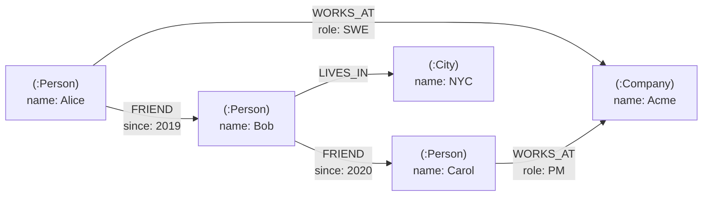
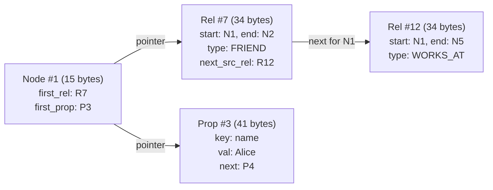
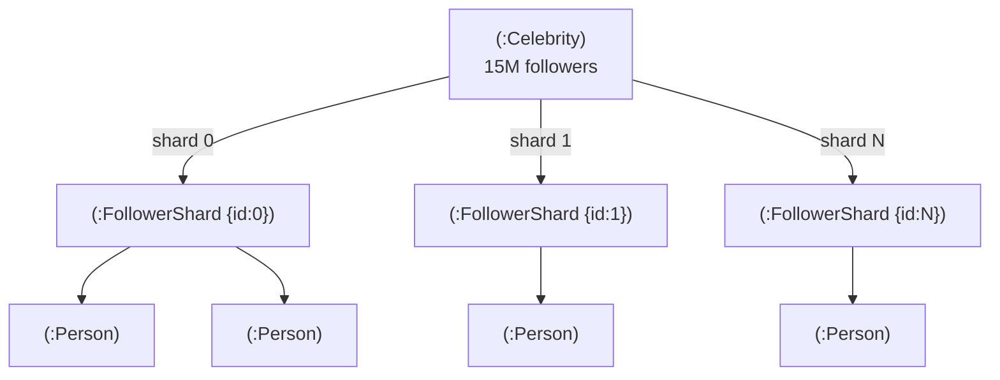
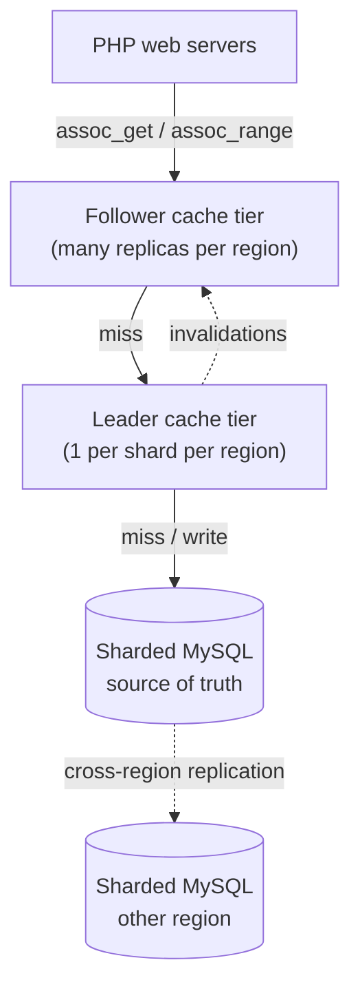

# Graph Databases: Property Graphs, Cypher, and When Joins Are the Problem

> **TL;DR**: A graph database treats relationships as first-class storage primitives. Nodes and edges carry properties; traversal follows pointers rather than computing joins. This makes multi-hop queries (friend-of-friend, permission chains, fraud rings) orders of magnitude faster than recursive SQL CTEs once you pass 3-4 hops. Neo4j's index-free adjacency gives O(degree) per hop instead of O(log N) per join[^1]. Meta TAO serves over 10 billion graph reads per second using a narrow graph API over sharded MySQL[^2]. Use a graph database when your queries traverse deep relationships. Use Postgres when depth is 2 or less.

## Learning Objectives

After this module, you will be able to:

- [ ] Model a domain as a property graph with labeled nodes, typed edges, and properties
- [ ] Write basic Cypher queries with pattern matching and variable-length paths
- [ ] Distinguish property graphs from RDF triple stores and choose between them
- [ ] Recognize workloads where a graph database beats a relational one
- [ ] Reason about scaling limits: supernodes, partitioning hardness, and horizontal strategies

## Intuition

Think about giving directions in a city. If someone asks "how do I get from the library to the bakery?", you do not consult a giant spreadsheet of every intersection in town. You start at the library, look at the streets leaving it, pick one, walk to the next intersection, look at the streets leaving that intersection, and repeat. Each step costs you one glance at the current intersection, regardless of how many intersections exist in the entire city.

A relational database answering "who are Alice's friends-of-friends?" works like the spreadsheet approach. It scans a `friendships` table (potentially billions of rows), joins it against itself, and filters. Each hop multiplies the intermediate result set. A four-hop query on a social graph with average degree 250 touches up to 250^4 candidate paths before filtering.

A graph database works like walking the city. It starts at Alice's node, follows her outgoing FRIEND pointers (a handful), then follows each friend's FRIEND pointers in turn. The cost at each hop is proportional to the number of neighbors at that node, not the size of the entire graph. This is the fundamental insight: when your question is "what connects to this thing?", pointer-chasing beats index-lookup.

The rest of this chapter makes that intuition precise: the data model, the query languages, the physical storage trick that makes it fast, and the scaling problems that make it hard.

## Theory

### The property graph model

A property graph is a directed, labeled multigraph where both nodes and edges carry key-value properties[^3]. Each node has zero or more labels (like `:Person`, `:Company`). Each edge has exactly one type (like `:FRIEND`, `:WORKS_AT`), a direction, and its own property map. Multiple edges of different types can connect the same pair of nodes.



*A property graph fragment: nodes carry labels and properties; edges carry types, direction, and their own properties.*

The alternative model is the **RDF triple store**: every fact is a (subject, predicate, object) triple governed by W3C standards. SPARQL is the query language. RDF excels at composing data from many sources via global URIs (Wikidata stores 16.6 billion triples this way[^4]) and supports formal inference via OWL/SHACL. The trade-off: edge properties require reification (a single property-graph edge with three attributes becomes 4-7 triples), and single-node RDF engines like Blazegraph become unstable at around 16 billion triples (Wikidata's 16.6B required splitting the graph into partitions)[^4].

**When to pick which:**

| Model | Choose when | Avoid when |
|-------|-------------|------------|
| Property graph | Domain modeling with rich edge attributes; developer-facing applications; Cypher/Gremlin ecosystem | You need formal inference, linked-data composition, or W3C interoperability |
| RDF triple store | Knowledge graphs, semantic web, multi-source data federation, inference-driven queries | High-volume transactional workloads; edges need many inline properties |

For the rest of this chapter, property graph is the default model.

### Index-free adjacency

The physical trick that makes graph traversal fast is **index-free adjacency**: each node record stores a direct pointer (file offset or memory address) to its first relationship record, and each relationship record links to the next relationship for the same node[^1].

In Neo4j's native store format, node records are 15 bytes, relationship records are 34 bytes, and property records are 41 bytes. These fixed-size records form linked lists on disk. To find all of Alice's friends, the engine reads Alice's node record, follows the pointer to her first relationship, then walks the linked list. No index lookup. No table scan. Cost: O(degree of Alice)[^1].



*Fixed-size records form linked lists; traversal follows pointers without consulting a global index.*

Compare this to a relational JOIN: the database must look up the `friendships` table's B-tree index for every hop. On a table with billions of rows, each B-tree lookup is O(log N). At four hops, you pay 4 * O(log N) per path, and the intermediate result set grows multiplicatively with fan-out.

LinkedIn's engineering team described this concretely: a typical member's second-degree network is 50,000+ entities, "too large to pre-materialize and store" yet the join to produce it "is daunting, particularly if you have to search a table of billions of edges stored in conventional sorted storage"[^5].

### Query languages: Cypher, Gremlin, SPARQL, and GQL

**Cypher** is declarative and reads like ASCII art. Nodes are parentheses, edges are square brackets, arrows give direction:

```cypher
-- Friends of Alice's friends who are not already Alice's friends
MATCH (alice:Person {name: 'Alice'})-[:FRIEND]->(f)-[:FRIEND]->(fof:Person)
WHERE NOT (alice)-[:FRIEND]->(fof) AND alice <> fof
RETURN DISTINCT fof.name
LIMIT 20
```

Variable-length paths make recursive queries trivial:

```cypher
-- Shortest path from Alice to Bob, up to 6 hops
MATCH p = shortestPath(
  (a:Person {name: 'Alice'})-[:FRIEND*..6]-(b:Person {name: 'Bob'})
)
RETURN [n IN nodes(p) | n.name] AS chain, length(p) AS hops
```

**Gremlin** is imperative. Each step in the pipeline transforms the traversal:

```groovy
g.V().has('Person','name','Alice')
  .out('FRIEND').out('FRIEND')
  .where(neq('alice'))
  .values('name').dedup().limit(20)
```

Gremlin runs on any TinkerPop-compliant store (JanusGraph, Neptune, ArangoDB). It is more flexible (Turing-complete with closures) but harder to optimize because the engine cannot easily reorder imperative steps[^6].

**SPARQL** targets RDF triples and supports federation across endpoints. It is the only choice for querying Wikidata, DBpedia, and other linked-data sources.

**GQL (ISO/IEC 39075:2024)** is the first new ISO database query language since SQL[^7]. It standardizes the pattern-matching core shared by Cypher, PGQL, and G-CORE. SQL/PGQ mirrors the same patterns inside SQL. For day-one decisions, Cypher is the practical choice; GQL matters for future-proofing.

### The major systems

| System | Model | Query language | Storage | Scaling story |
|--------|-------|---------------|---------|---------------|
| Neo4j | Property graph | Cypher | Native fixed-size records | Vertical first; Fabric/composite DBs for federation |
| Amazon Neptune | Property graph + RDF | Gremlin, openCypher, SPARQL | Managed distributed storage | Managed, auto-scaling reads |
| Dgraph | Property graph | DQL (GraphQL-like) | Badger (LSM-tree), predicate sharding | Raft per shard, horizontal writes |
| JanusGraph | Property graph | Gremlin | Pluggable (Cassandra, HBase, Bigtable) | Inherits backend's scale |
| NebulaGraph | Property graph | nGQL | RocksDB, vertex-hash sharding | Raft per shard |
| TigerGraph | Property graph | GSQL | Native C++ engine | MPP parallel, distributed |
| ArangoDB | Multi-model | AQL | RocksDB-based | Sharded clusters |

Neo4j's standard store format supports up to 34 billion nodes and 34 billion relationships[^8]. For larger graphs, distributed systems like Dgraph use **predicate-based sharding**: all instances of the `friend` predicate live on one Raft group, so an N-hop traversal along one predicate type requires only N network hops regardless of data size[^9].

### Graph algorithms and the bridge to ML

Graph databases are not just for CRUD queries. Common analytical algorithms include:

- **Shortest path / Dijkstra** - routing, social distance
- **PageRank** - influence scoring, search ranking
- **Community detection (Louvain)** - fraud ring identification, market segmentation
- **Node embeddings (node2vec, GraphSAGE)** - convert graph structure into feature vectors for downstream ML models

The bridge to ML is significant: node embeddings let you feed graph topology into recommendation engines, anomaly detectors, and classification models without hand-engineering features. Neo4j's Graph Data Science library, TigerGraph's in-database analytics, and standalone tools like PyTorch Geometric all operate in this space.

### Scaling: the hard problems

**The supernode problem.** Real graphs follow power-law degree distributions. A celebrity with 15 million followers has a single node with 15 million outgoing edges. Traversing that node's neighbors is no longer O(1); it is O(15M). The shard owning that node becomes a hot spot[^10].



*Supernode mitigation: split a high-degree node into a fanout tree of sub-shards, bounding per-node edge counts and enabling parallel traversal.*

Mitigations: (1) hash-partition the supernode's edges into meta-nodes (the "fanout pattern"), (2) vertex-centric indexes that seek within the edge list by property, (3) pre-computed caches of the most recent or popular subset (TAO caches a bounded number of edges per association list[^11]).

**Partitioning hardness.** Graphs resist partitioning because edges cross partition boundaries. Vertex-based sharding (NebulaGraph, JanusGraph on Cassandra) stores each vertex's edges locally, but a 4-hop traversal crossing shard boundaries takes 4 network round trips. Predicate-based sharding (Dgraph) avoids this for single-predicate paths but complicates cross-predicate queries.

**Neo4j Fabric** (now "composite databases") coordinates federated queries across constituent shards that hold disjoint portions of the graph. It is real but partial: you must manually decide how to partition, and cross-shard queries pay coordination overhead.

## Real-World Example

### Meta TAO: a graph serving layer at planetary scale

Meta's TAO (The Associations and Objects store) is the system behind Facebook's social graph. It is not a general graph database. It is a narrow-API graph serving layer over sharded MySQL, purpose-built for the workload shape of a social network: overwhelmingly read-dominant (500:1 read-to-write ratio)[^2].

**Scale:** TAO served 1 billion reads per second in 2013 with a 96.4% follower-tier cache hit rate[^11]. By 2021, it exceeded 10 billion reads per second[^2]. By 2022, Meta reported "more than one quadrillion" queries per day[^12].

**Data model:** Two primitives only. `Object(id, otype, fields)` for nodes. `Association(id1, atype, id2, time, fields)` for edges. Queries are limited to `assoc_get`, `assoc_count`, `assoc_range`, and mutations. No general pattern matching. No variable-length paths.

**Architecture:** A two-tier cache per region sits between PHP web servers and MySQL. Many follower tiers handle reads; one leader per shard per region coordinates writes. Inverse edges are maintained automatically so "who follows me?" is as fast as "who do I follow?". MySQL remains the source of truth because the operational tooling (backup, migration, monitoring) is mature and well-understood[^11].



*TAO's two-tier cache per region: follower tiers absorb the 99.8% read load at a 96.4% hit rate; the single leader per shard coordinates writes to MySQL, which remains the source of truth.*

**Key lesson:** The hyperscale social graphs (TAO, Twitter's FlockDB, LinkedIn's LIquid) are not general graph databases. They sacrifice query expressiveness for horizontal scale. If your workload fits a fixed set of query patterns, a narrow graph API over a proven storage engine (MySQL, Cassandra) will outscale any general-purpose graph database by orders of magnitude.

## Trade-offs

| Approach | Pros | Cons | Best when | Our Pick |
|----------|------|------|-----------|----------|
| Graph DB (Neo4j) | Fast deep traversal via index-free adjacency; expressive Cypher; mature tooling | Single-primary writes; vertical ceiling; smaller community than Postgres | Relationship-heavy queries at moderate scale (< 10B edges) | **Default for graph-shaped problems** |
| Relational with recursive CTEs | Familiar; one system; ACID; huge community | Planner degrades beyond 3-4 hops; verbose; no first-class path output | Shallow relationships (depth <= 2); existing SQL stack | **When depth is 2 or less** |
| Graph layer on KV (Dgraph, JanusGraph) | Horizontal scale; leverages proven KV infra | More moving parts; fewer features; harder to tune | Very large graphs (>> 100M edges); high ingest rate | When Neo4j's vertical ceiling is not enough |
| RDF triple store (Virtuoso, Neptune RDF) | W3C standards; linked-data composition; inference | Reification bloats edges; single-node engines become unstable at ~16B triples | Public knowledge graphs; semantic web; inference-driven queries | When you need formal ontology reasoning |
| Narrow graph API (TAO, FlockDB) | Billions of reads/sec; horizontal scale | No general pattern matching; fixed query set; bespoke tooling | Hyperscale social graph with known workload | When you are Meta-scale and can afford custom infra |

## Common Pitfalls

> [!WARNING]
> **Supernode hot spots.** A single vertex with millions of edges saturates its shard and makes traversal linear in degree. Monitor node-degree histograms. Apply the fanout pattern (hash-partition edges into meta-nodes) or vertex-centric indexes before you hit production.

> [!WARNING]
> **Recursive CTE as a substitute for a graph query.** SQL planners lack cost models for variable-depth recursion. A query that runs in 50 ms at 2 hops can run in 50 seconds at 5 hops. If your relationships go deeper than 2-3 levels, move to a graph database rather than fighting the planner.

> [!WARNING]
> **Treating the graph DB as a general OLTP store.** High-volume non-relationship writes (attribute updates, event logs, counters) overload per-edge overhead. If your hot queries have zero or one join equivalent, you are paying graph-engine tax for no benefit. Use Postgres or a KV store for flat data.

> [!WARNING]
> **Assuming horizontal scaling is solved.** Neo4j scales vertically first. Fabric/composite databases require manual partitioning decisions. Dgraph and JanusGraph scale horizontally but cross-shard traversals add network latency per hop. Plan capacity around a single well-provisioned instance until you prove you need more.

> [!WARNING]
> **Ignoring write amplification from inverse edges.** A single "Alice follows Bob" write creates two physical edges (forward and inverse), potentially on different shards. One logical write becomes two physical writes with cross-shard coordination. Accept non-atomic inverses with background repair, or design your schema to avoid bidirectional edges where possible.

## Exercise

Design a permission system for a B2B SaaS with organizations, teams, projects, roles, and resources. Users inherit permissions through nested group memberships up to 6 levels deep. Pick between Postgres, Neo4j, and a dedicated authz service (SpiceDB, OpenFGA). Justify with query patterns.

<details>
<summary>Hint</summary>

The core query is "does User X have Permission P on Resource R?" This requires traversing the membership and role-inheritance chain from user to resource. Count the hops. Consider the read/write ratio (permission checks are extremely read-heavy). Think about what happens when a group membership changes and thousands of derived permissions must be recomputed.

</details>

<details>
<summary>Solution</summary>

**Analysis:** The permission check traverses: User -> Team -> Parent Team -> ... -> Organization -> Role -> Permission -> Resource. At 6 levels of nesting, this is a 6-hop traversal. The workload is overwhelmingly reads (every API call checks permissions) with rare writes (role changes, team restructuring).

**Option 1: Postgres with recursive CTE.** Works at 2-3 levels. At 6 levels with thousands of groups, the recursive CTE degenerates. You would need a closure table (pre-materialized transitive closure) that must be rebuilt on every membership change. Feasible but operationally complex.

**Option 2: Neo4j.** Models the permission graph naturally. A Cypher query like `MATCH (u:User {id: $uid})-[:MEMBER_OF*1..6]->(:Group)-[:HAS_ROLE]->(:Role)-[:GRANTS]->(p:Permission {name: $perm})-[:ON]->(r:Resource {id: $rid}) RETURN count(p) > 0` answers the question in one traversal. Sub-millisecond for typical graphs. But Neo4j is a new operational dependency, and permission checks happen on every request (millions of QPS at scale).

**Option 3: SpiceDB/OpenFGA.** Purpose-built for exactly this problem. Implements Google's Zanzibar model: relationship tuples stored in a scalable backend, with a check API that traverses the graph internally. Handles caching, consistency (Zookies/snapshot tokens), and horizontal scaling out of the box.

**Our pick: SpiceDB/OpenFGA** for production permission systems at scale. The query pattern is fixed ("check" and "expand"), the read/write ratio is extreme, and the operational maturity of a purpose-built system beats running Neo4j for a single query shape. Use Neo4j if your permission model also needs ad-hoc graph analytics (e.g., "show me all resources accessible by anyone in Engineering"). Use Postgres with a closure table if you have fewer than 3 levels and want to avoid a new dependency.

</details>

## Key Takeaways

- Graph databases shine when queries traverse 3+ hops. At depth 1-2, Postgres with a JOIN is simpler and sufficient.
- Index-free adjacency makes neighbor access O(degree) per hop instead of O(log N) per join. This is the physical reason graphs win on deep traversals.
- Cypher (and the emerging GQL standard) is the most approachable graph query language. Gremlin is more powerful and less readable. SPARQL is for RDF only.
- The supernode problem is the #1 production pathology. Monitor degree distributions and apply the fanout pattern before a celebrity node melts your cluster.
- Scaling graph databases horizontally remains genuinely hard. Most production systems at hyperscale (TAO, FlockDB, LIquid) use narrow graph APIs over proven storage engines, not general-purpose graph databases.
- Property graphs are the right default for application development. RDF triple stores are the right choice for knowledge graphs that need inference, linked-data composition, or W3C interoperability.
- When your graph query pattern is fixed and your scale is extreme, build a specialized serving layer rather than deploying a general graph database.

## Further Reading

- [TAO: Facebook's Distributed Data Store for the Social Graph (Bronson et al., USENIX ATC 2013)](https://www.usenix.org/system/files/conference/atc13/atc13-bronson.pdf) - The reference paper for narrow-API graph serving at planetary scale; essential reading for understanding the gap between "graph database" and "graph serving layer."
- [Neo4j Graph Database Concepts](https://neo4j.com/docs/getting-started/appendix/graphdb-concepts/) - The canonical property-graph primer; start here if you have never modeled a graph.
- [Understanding Neo4j's data on disk](https://neo4j.com/developer/kb/understanding-data-on-disk/) - Fixed-size record internals that make index-free adjacency concrete; read this to understand why traversal is O(degree).
- [ISO/IEC 39075:2024 GQL Standard](https://www.iso.org/standard/76120.html) - The first new ISO database query language since SQL; defines the future of declarative graph querying.
- [Apache TinkerPop / Gremlin Documentation](https://tinkerpop.apache.org/docs/current/) - The portable traversal machine and its imperative query language; relevant if you use JanusGraph or Neptune.
- [Dgraph Architecture](https://docs.dgraph.io/v24.1/installation/dgraph-architecture) - Predicate sharding, Raft consensus per group, and Badger storage in one document; the clearest distributed-graph-database architecture reference.
- [LIquid: The Soul of a New Graph Database, Part 1 (LinkedIn Engineering, 2020)](https://engineering.linkedin.com/blog/2020/liquid-the-soul-of-a-new-graph-database-part-1) - Why LinkedIn built a custom graph engine with wait-free reads and log-structured storage for a 675M-member economic graph.
- [Wikidata Query Service graph database reload at home, 2025 edition](https://techblog.wikimedia.org/2025/04/08/wikidata-query-service-graph-database-reload-at-home-2025-edition/) - The clearest operational picture of RDF scaling pain in the wild; 16.6 billion triples on a single-node Blazegraph instance approaching its ceiling.

## Flashcards

**Q:** What is index-free adjacency?
**A:** A storage design where each node record stores a direct pointer to its first relationship record, and relationships link to the next relationship for the same node. Traversal follows pointers without consulting a global index, making neighbor access O(degree) per hop.

**Q:** What are the two dominant graph data models?
**A:** The labeled property graph (nodes and edges with labels/types and key-value properties, used by Neo4j, Dgraph, JanusGraph) and the RDF triple store (subject-predicate-object triples governed by W3C standards, queried with SPARQL).

**Q:** When does a graph database beat a relational database?
**A:** When queries traverse 3+ hops of relationships. At depth 1-2, a SQL JOIN is simpler. Beyond 3-4 hops, recursive CTEs degenerate because the planner lacks cost models for variable-depth recursion and intermediate result sets grow multiplicatively.

**Q:** What is the supernode problem?
**A:** A single vertex with millions of edges (e.g., a celebrity's followers) that makes traversal linear in degree, saturates the owning shard, and breaks assumptions about constant-time neighbor access. Mitigations include the fanout pattern, vertex-centric indexes, and edge-subset caching.

**Q:** What is Cypher's key syntactic feature?
**A:** ASCII-art pattern matching: nodes in parentheses `()`, edges in square brackets `[]`, arrows for direction. A two-hop friend query reads as `(a)-[:FRIEND]->(b)-[:FRIEND]->(c)`, which is both the query and a visual diagram of the pattern.

**Q:** How does Dgraph partition a graph for horizontal scaling?
**A:** Predicate-based sharding: all instances of one edge type (predicate) live on one Raft group. An N-hop traversal along one predicate type requires only N network hops regardless of total data size, because the traversal follows the predicate path rather than fanning out across vertex-based shards.

**Q:** What scale does Meta TAO operate at?
**A:** Over 10 billion reads per second (2021), more than one quadrillion queries per day (2022), with a 96.4% follower-tier cache hit rate. The data set spans many petabytes across hundreds of thousands of shards.

**Q:** What is GQL (ISO/IEC 39075:2024)?
**A:** The first new ISO database query language since SQL, published April 2024. It standardizes declarative graph pattern matching previously split across Cypher, PGQL, and G-CORE. SQL/PGQ mirrors the same pattern-matching core inside SQL.

**Q:** When should you NOT use a graph database?
**A:** When relationships are shallow (depth <= 2), when the workload is mostly non-relationship OLTP (attribute updates, counters, event logs), or when your hot queries touch single entities without traversal. In these cases, Postgres or a KV store is simpler and faster.

**Q:** What is the difference between Neo4j Fabric and Dgraph's sharding?
**A:** Neo4j Fabric (composite databases) federates queries across manually-partitioned disjoint sub-graphs with coordination overhead. Dgraph automatically shards by predicate (edge type) with Raft consensus per group, giving transparent horizontal writes but complicating cross-predicate queries.

**Q:** Name three common use cases for graph databases.
**A:** (1) Fraud detection: finding rings of accounts connected by shared attributes. (2) Permission/authorization: traversing group membership hierarchies. (3) Knowledge graphs: representing and querying interconnected facts with inference (e.g., Wikidata's 16.6 billion triples).

**Q:** What did LinkedIn's LIquid team identify as the core scaling problem with relational graph queries?
**A:** A typical second-degree network is 50,000+ entities, too large to pre-materialize, and the join to produce it requires searching a table of billions of edges in sorted storage (a terabyte-scale B-tree), making the cost prohibitive compared to pointer-chasing in a graph-native structure.

## References

[^1]: Rocha, J. "Understanding Neo4j's data on disk." Neo4j Knowledge Base. https://neo4j.com/developer/kb/understanding-data-on-disk/
[^2]: Cheng, A. et al. "RAMP-TAO: Layering Atomic Transactions on Facebook's Online TAO Data Store." PVLDB 14(12), 2021. https://www.vldb.org/pvldb/vol14/p3014-cheng.pdf
[^3]: Neo4j, "Graph database concepts." https://neo4j.com/docs/getting-started/appendix/graphdb-concepts/
[^4]: Baso, A. "Wikidata Query Service graph database reload at home, 2025 edition." Wikimedia Technology Blog, April 2025. https://techblog.wikimedia.org/2025/04/08/wikidata-query-service-graph-database-reload-at-home-2025-edition/
[^5]: Meyer, S., Carter, A., and Rodriguez, A. "LIquid: The soul of a new graph database, Part 1." LinkedIn Engineering, July 2020. https://engineering.linkedin.com/blog/2020/liquid-the-soul-of-a-new-graph-database-part-1
[^6]: Apache TinkerPop Documentation. https://tinkerpop.apache.org/docs/current/
[^7]: ISO, "ISO/IEC 39075:2024 Information technology - Database languages - GQL." April 2024. https://www.iso.org/standard/76120.html
[^8]: Neo4j, "Store Format Versions Reference Guide." https://neo4j.com/developer/kb/store-format-versions/
[^9]: Dgraph, "Architecture." https://docs.dgraph.io/v24.1/installation/dgraph-architecture
[^10]: Neo4j, "How to avoid costly traversals with join hints." https://www.neo4j.com/developer/kb/how-to-avoid-costly-traversals-with-join-hints/
[^11]: Bronson, N. et al. "TAO: Facebook's Distributed Data Store for the Social Graph." USENIX ATC 2013. https://www.usenix.org/system/files/conference/atc13/atc13-bronson.pdf
[^12]: Meta Engineering, "Cache made consistent: Meta's cache invalidation solution." June 2022. https://engineering.fb.com/2022/06/08/core-infra/cache-made-consistent/
