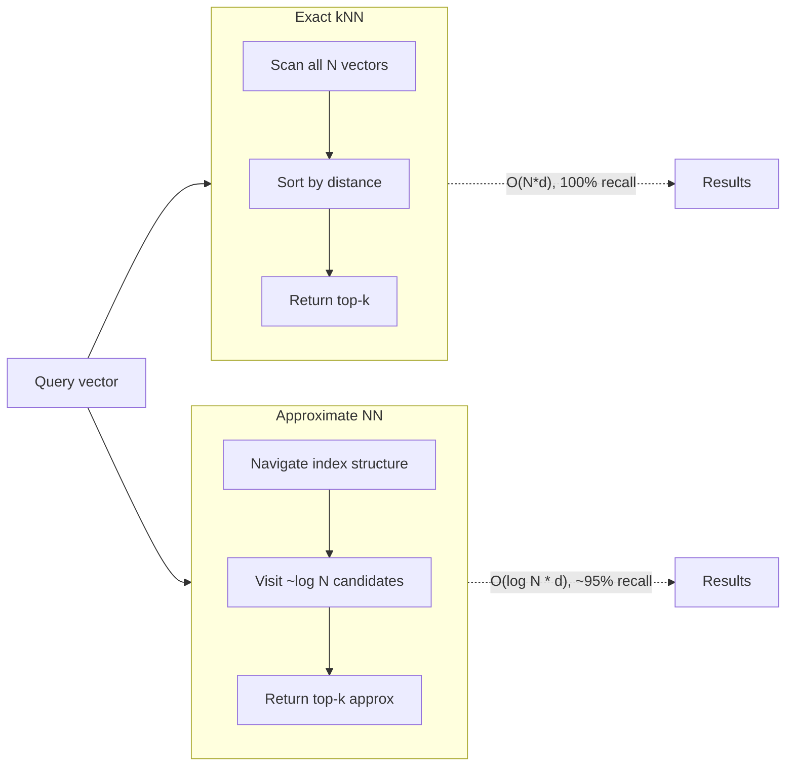
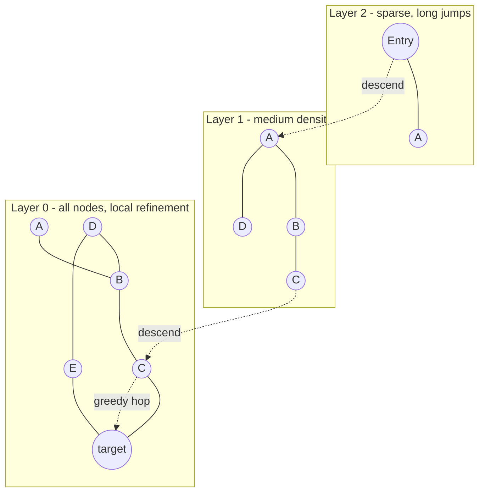
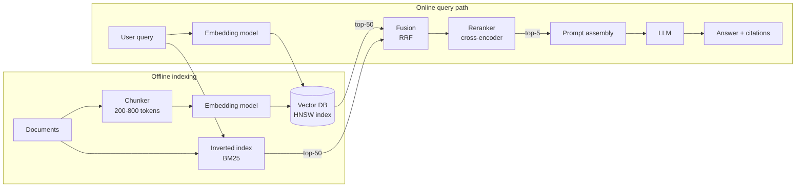

# Vector Databases: Embeddings, ANN Indexes, and the Retrieval Layer for AI

> **TL;DR**: Vector databases answer "which stored items are most similar to this query?" by indexing high-dimensional embeddings under approximate nearest-neighbor (ANN) algorithms. HNSW dominates for in-memory workloads (logarithmic search, 95%+ recall), IVF-PQ trades recall for 64x compression[^1], and DiskANN serves a billion vectors from a single node at under 3 ms mean latency[^2]. For most teams: use pgvector under 10M vectors, Pinecone for zero-ops, and Milvus or Qdrant at scale. Hybrid retrieval (BM25 + vector + reranking) is non-negotiable for production RAG.

## Learning Objectives

After this module, you will be able to:

- [ ] Explain what an embedding is and why cosine similarity is the default metric
- [ ] Describe HNSW and IVF indexes and their recall/latency trade-offs
- [ ] Design a retrieval pipeline combining BM25 and vector search
- [ ] Choose between Pinecone, pgvector, Weaviate, Milvus, and Qdrant
- [ ] Estimate memory, disk, and query cost for a vector workload

## Intuition

You walk into a library and ask the librarian for "books about staying healthy during the holidays." There is no shelf labeled with that exact phrase. A keyword catalog would find "healthy" and "holidays" separately but miss books titled "Wellness Tips for the Festive Season" because no words overlap.

Now imagine the librarian has a magical map where every book is a dot, and books about similar topics cluster together. Your question also becomes a dot on the same map. The librarian walks to your dot and grabs the five nearest books. One is "Festive Season Wellness," another is "Holiday Nutrition Guide." Neither shares your exact words, but they are close in meaning.

That map is an embedding space. Each dot is a vector of 768 or 1,536 floating-point numbers produced by a neural network. "Close" means small cosine distance. The librarian's walk is a nearest-neighbor search. And the reason the library needs a special index (not just a linear scan of every dot) is that with 50 million books, checking every single one takes too long.

This is the core problem vector databases solve: find the k nearest vectors to a query vector, fast, at scale, without scanning everything. The rest of this chapter explains how.

## Theory

### Embeddings and distance metrics

A transformer encoder converts text (or images, audio, code) into a fixed-length vector of d floating-point numbers. Semantically similar inputs land near each other in this d-dimensional space. OpenAI's text-embedding-3-large produces 3,072 dimensions and scores 64.6% on the MTEB benchmark; text-embedding-3-small uses 1,536 dimensions at 62.3%[^3]. Alternatives like Cohere embed-v3 (1,024d, commercial API) and the open-source BGE-M3 (1,024d) offer competitive quality without per-token API costs.

Three distance metrics dominate:

- **Cosine similarity** measures the angle between vectors, ignoring magnitude. It is the default for normalized embeddings.
- **Inner product (dot product)** is equivalent to cosine when vectors are unit-normalized, and is the fastest operator in pgvector for that case[^4].
- **Euclidean (L2)** measures straight-line distance. Airbnb chose L2 specifically because it produces more uniform IVF cluster sizes than dot product[^5].

> [!TIP]
> OpenAI embeddings are pre-normalized to unit length. If you use inner product on them, you get cosine rankings for free with less computation. Always check whether your encoder normalizes before choosing a metric.

### Why approximate, not exact

Exact nearest-neighbor search costs O(N * d) per query. At d=1,536 and N=10M, that is roughly 60 billion floating-point operations per query. Even with SIMD, a single core takes hundreds of milliseconds. This is the "curse of dimensionality": in high dimensions, distance ratios concentrate, and no partitioning scheme can prune efficiently without accepting some error.

ANN indexes accept a small recall loss (typically 95-99% of the true top-k) in exchange for 100x or greater speedup. The key insight: you do not need the exact nearest neighbor. You need results good enough that a downstream reranker or LLM cannot tell the difference.

*Exact search guarantees perfect recall but scales linearly; ANN indexes trade a few percent of recall for orders-of-magnitude speedup.*

### HNSW: hierarchical navigable small world

HNSW is the dominant ANN algorithm in production today. It builds a multi-layer proximity graph inspired by skip lists. [Data Structures for Distributed Systems](../part-0-prerequisites/02-data-structures-for-systems.md) introduced skip lists as a probabilistic alternative to balanced trees; HNSW applies the same layering idea to graph search.

**How it works:** Each vector is a node. On insert, the node draws a random layer from an exponential distribution. It is connected to its M nearest neighbors in each layer from 0 up to its drawn layer. The top layers are sparse (long-range jumps); the bottom layer contains all nodes (local refinement)[^6].

**Search:** Start at the entry point in the top layer. Greedily walk toward the query. Descend one layer. Repeat. At layer 0, expand the search beam to `ef_search` candidates and return the top-k.

**Key parameters (pgvector defaults):**

| Parameter | Default | Effect |
|-----------|---------|--------|
| M | 16 | Connections per node. Higher = better recall, more memory |
| ef_construction | 64 | Build-time beam width. Higher = slower build, better graph |
| ef_search | 40 | Query-time beam width. Higher = slower query, better recall |

**Memory cost:** HNSW stores each vector plus its adjacency list. In practice, indexes typically consume 1.5-2x the raw vector storage due to adjacency lists and graph metadata. For 1M vectors at 1,536 dimensions (6 GB raw float32), expect 9-12 GB resident memory.

*HNSW search descends from a sparse top layer (cheap long-range jumps) to a dense bottom layer (local refinement), achieving logarithmic query time in the number of vectors.*

### IVF and product quantization

**IVF (Inverted File Index)** clusters the corpus into `nlist` Voronoi cells via k-means. At query time, compute the `nprobe` nearest centroids and scan only vectors in those cells. This is cheaper in memory than HNSW but requires a training step and delivers lower recall at equal speed on standard benchmarks[^7].

**Product Quantization (PQ)** compresses vectors dramatically. Split each d-dimensional vector into m sub-vectors, run k-means on each sub-space with 256 centers, and store only the m codebook indices (1 byte each). For d=1,536 with m=96 sub-vectors: 96 bytes per vector instead of 6,144 raw bytes. That is a 64x compression[^1].

**IVF-PQ** combines both: cluster into cells, then PQ-compress vectors within each cell. This enables billion-scale search on a single machine. The trade-off is lossy distances: PQ collapses small differences between top candidates, so production systems re-rank a shortlist with exact distances.

**ScaNN** (Google, ICML 2020) improved PQ by penalizing quantization error parallel to the data vector more heavily than orthogonal error, achieving roughly 2x QPS at equal recall versus the next-best library on the glove-100-angular benchmark[^8].

### DiskANN: billion-scale on one node

Microsoft's DiskANN (NeurIPS 2019) keeps compressed (PQ) vectors in RAM for routing but stores full-precision vectors and graph adjacency lists on SSD. A careful graph layout minimizes random reads. The result on the billion-point SIFT1B dataset: over 5,000 queries per second at under 3 ms mean latency and 95%+ 1-recall@1, served from 64 GB RAM plus an SSD, where in-DRAM algorithms peak at 100-200M points for the same accuracy[^2].

One independent report documents replacing a 3 TB RAM sharded-HNSW cluster with a single 96 GB DiskANN node at 40x lower cost for the same workload[^9]. DiskANN is the right answer when your vector count exceeds what fits in RAM but you need single-digit millisecond latency.

### Hybrid retrieval and RAG pipelines

Pure vector search misses exact matches, proper nouns, product codes, and rare entities. Pure BM25 misses semantic similarity. Production systems combine both.

**Reciprocal Rank Fusion (RRF)** merges two ranked lists by scoring each document as `sum(1 / (k + rank_i))` across lists (k=60 is standard). It ignores raw scores and uses only ranks, making it robust across heterogeneous retrieval systems. Weaviate's relativeScoreFusion (normalize scores to [0,1] and take a weighted sum) showed a ~6% recall improvement over rankedFusion on the FIQA benchmark[^10].

A complete RAG pipeline has these stages:

*End-to-end RAG: offline indexing builds both vector and inverted indexes; online retrieval fuses results, reranks with a cross-encoder, and feeds context to the LLM.*

**Evaluation:** RAGAs defines four metrics scored 0-1: faithfulness (every claim grounded in context), answer relevance, context precision, and context recall[^11]. Measure these before deploying; low context recall means your chunking or retrieval is broken.

### Metadata filtering strategies

Real queries combine semantic similarity with hard filters: `tenant_id = 7 AND created > 2024-01-01 ORDER BY embedding <-> query LIMIT 10`. Three strategies exist:

| Strategy | How it works | Trade-off |
|----------|-------------|-----------|
| Post-filter | Run ANN, then discard non-matching results | Fast but returns fewer than k rows when filter is selective |
| Pre-filter | Build a bitmask of matching IDs, then ANN over that subset | Correct count but slower on large corpora |
| In-graph (filterable HNSW) | Build subgraphs per payload value, merge into full graph | Best recall under filters but higher memory and build cost |

pgvector's HNSW with post-filter and `ef_search=40` returns only ~4 rows on average when the filter matches 10% of data. Version 0.8.0 introduced `iterative_scan` to address this[^4]. Qdrant's filterable HNSW builds per-payload subgraphs that preserve graph connectivity under filters[^12]. Milvus uses pre-filter bitmasks before vector search[^13].

## Real-World Example

### Airbnb: embedding-based retrieval for search

Airbnb deployed a two-tower neural network for listing retrieval. The listing tower processes home features (amenities, capacity, historical engagement) offline in a daily batch, pre-computing all listing embeddings. The query tower processes search features (location, guests, dates) online per request[^5].

The key architectural decision: Airbnb chose IVF over HNSW. HNSW's memory grew too large under frequent listing updates (pricing and availability change constantly), and HNSW retrieval combined with mandatory geographic and availability filters produced poor latency. IVF cluster IDs are stored in the existing search index and treated as just another filter alongside price and availability, making integration "quite straightforward"[^5].

They chose Euclidean distance over dot product because dot product produced imbalanced clusters that "greatly reduce the discriminative power" of IVF retrieval. Training used hard negatives from actual user journeys (homes seen but not booked) rather than random negatives.

The result: an A/B test showed bookings lift "on par with some of the largest machine learning improvements to our search ranking in the past two years"[^5].

This is a critical counterexample to the "HNSW is always better" default. When your vectors update frequently and your queries always carry hard filters, IVF integrated into an existing search stack can outperform a standalone HNSW index.

## Trade-offs

| Approach | Pros | Cons | Best when | Our Pick |
|----------|------|------|-----------|----------|
| pgvector (HNSW) | Zero extra infra; ACID transactions span data + vectors; SQL joins | Single-node memory limits; builds slow past 10M | <10M vectors, already on Postgres | **Default for most teams** |
| Pinecone (serverless) | No ops; slab-based architecture; scales transparently | Vendor lock-in; expensive at high QPS; opaque internals | Fast prototype to production, no infra team | Best managed option |
| Milvus / Zilliz | Multiple index types (HNSW, IVF-PQ, DiskANN, GPU); K8s-native; billion-scale | Operational complexity; many knobs to tune | >100M vectors; need index-type flexibility | Self-hosted at scale |
| Qdrant | Rust performance; filterable HNSW preserves connectivity under filters | Smaller ecosystem than Milvus/Pinecone | Filter-heavy multi-tenant workloads | Best for rich metadata |
| Weaviate | Hybrid search built in (RRF + relativeScoreFusion); strong DX | Go runtime memory; per-tenant scaling needs care | Teams wanting batteries-included hybrid | Good all-rounder |
| Elasticsearch / OpenSearch kNN | Unified lexical + semantic in one engine; Lucene HNSW | Heavier than pure vector DB; historically weaker filtered kNN | Already running ES/OS for logs or search | Natural fit when ES/OS is already deployed; not worth standing up an ES cluster solely for vectors |

## Common Pitfalls

> [!WARNING]
> **HNSW filtering returns fewer than k results.** Post-filter with `ef_search=40` on a 10% selectivity filter yields ~4 surviving rows on average. Fix: raise ef_search to 200-500, enable pgvector's `iterative_scan`, or use pre-filter/filterable-HNSW approaches[^4].

> [!WARNING]
> **IVF index built on unrepresentative data.** IVF centroids are trained at `CREATE INDEX` time. If you built on 1,000 rows and the table grew to 1M, recall will be terrible regardless of probe count. Always build IVF after loading representative data, or prefer HNSW which has no training step[^4].

> [!WARNING]
> **Treating the vector DB as system of record.** When you re-embed with a better model, you need the original text to rebuild. Keep raw documents in Postgres, S3, or your content DB. Treat the vector index as a derived artifact. pgvector's advantage: vectors and source text live in the same ACID transaction.

> [!WARNING]
> **Forgetting embedding cost at scale.** OpenAI text-embedding-3-large is priced at $0.00013/1k tokens (~$0.13 per 1M tokens) and text-embedding-3-small at ~$0.02 per 1M tokens[^3]. At 50M documents averaging 500 tokens each, that is 25B tokens and $3,250 for a single embedding pass with 3-large. Every model upgrade or chunking change triggers a full re-embed. Budget for it or use open-source encoders. Verify current prices in the Embeddings guide since OpenAI's main pricing page now focuses on GPT-5.x models.

> [!WARNING]
> **Over-chunking a RAG corpus.** Fixed-token chunking cuts answers mid-sentence. The LLM says "I don't know" even though the answer exists in the corpus. Use overlapping chunks (512 tokens with 64-token overlap), chunk at semantic boundaries (paragraphs, sections), and measure RAGAs context recall before deploying[^11].

## Exercise

Design the retrieval layer for a RAG chatbot over 50M support documents. Pick an embedding model, choose an ANN index, size memory and storage, define the hybrid retrieval strategy, and specify how you handle document updates and deletions.

Hint

Start with the cost estimation: 50M docs at 500 tokens average. How much does embedding cost? How much storage for the vectors? Then pick an index that fits your memory budget. Think about what happens when a support article is updated or retired.

Solution

**Embedding model:** text-embedding-3-small (1,536d, $0.02/1M tokens). Cost: 50M docs * 500 tokens = 25B tokens * $0.02/1M = $500 for the initial pass. Quality is sufficient for support docs; upgrade to 3-large only if recall metrics demand it.

**Storage:** 50M vectors *1,536 dims* 4 bytes = 300 GB raw. With HNSW overhead (1.5-2x), that is 450-600 GB resident memory. This exceeds a single node.

**Index choice:** Milvus with HNSW, sharded across 8-12 nodes (each holding ~50 GB of index). Alternatively, DiskANN on 2-3 nodes with 128 GB RAM + NVMe SSDs for lower cost.

**Hybrid retrieval:** BM25 via Elasticsearch for exact matches (error codes, product names, ticket IDs) fused with vector search via RRF (k=60). Rerank top-50 to top-5 with a cross-encoder (Cohere Rerank or a self-hosted model).

**Updates and deletions:** Keep the canonical document in PostgreSQL with a content hash. On update, re-embed only changed chunks (compare hashes). On deletion, remove from both the vector index and the inverted index. Use soft deletes with a `deleted_at` timestamp so in-flight queries do not return stale results.

**Evaluation:** Deploy RAGAs on a held-out set of 500 question-answer pairs. Target context recall > 0.8 and faithfulness > 0.9 before production launch.

## Key Takeaways

- Vector search is approximate by design. Tune recall vs latency with ef_search (HNSW) or nprobe (IVF); do not expect exactness.
- HNSW is the default ANN algorithm today: logarithmic search, incremental inserts, tunable recall. But it costs 1.5-2x raw vector size in RAM.
- IVF-PQ compresses vectors 64x and wins when memory is scarce or vectors update frequently (Airbnb's choice).
- DiskANN serves billion-scale from SSD at under 3 ms mean latency, 40x cheaper than sharded HNSW in RAM.
- Hybrid retrieval (BM25 + vector + reranking) beats either approach alone on real benchmarks. It is non-negotiable for production RAG.
- pgvector is good enough for most teams under 10M vectors. Do not over-engineer with a separate vector database until you outgrow it.
- Embedding API cost, not storage cost, dominates at large scale. Budget $0.02-$0.13 per million tokens and plan for re-embedding on model upgrades.

## Further Reading

- [Efficient and robust approximate nearest neighbor search using HNSW (Malkov and Yashunin, 2018)](https://arxiv.org/abs/1603.09320) - The canonical HNSW paper; the only must-read if you read one thing on ANN graph indexes.
- [DiskANN: Fast Accurate Billion-point Nearest Neighbor Search on a Single Node (NeurIPS 2019)](https://www.microsoft.com/en-us/research/project/project-akupara-approximate-nearest-neighbor-search-for-large-scale-semantic-search/) - How to serve 1B vectors from 64 GB RAM plus SSD; the architecture behind Microsoft's billion-scale search.
- [Embedding-Based Retrieval for Airbnb Search](https://airbnb.tech/ai-ml/embedding-based-retrieval-for-airbnb-search/) - Why Airbnb chose IVF over HNSW; the best production trade-off story in the vector search space.
- [ANN-Benchmarks](https://ann-benchmarks.com/) - Standardized recall-vs-QPS plots across algorithms and datasets; check here before trusting any vendor's benchmark.
- [pgvector README](https://github.com/pgvector/pgvector) - The Postgres extension's full documentation: HNSW/IVF knobs, iterative scan, hybrid search patterns, and distance operators.
- [Weaviate Hybrid Search Fusion Algorithms](https://weaviate.io/blog/hybrid-search-fusion-algorithms) - Deep dive into rankedFusion vs relativeScoreFusion with worked examples and benchmark results.
- [New embedding models and API updates (OpenAI, 2024)](https://openai.com/index/new-embedding-models-and-api-updates/) - Benchmarks, pricing, and Matryoshka dimension reduction for text-embedding-3.
- [Search Systems](./05-search-systems.md) - The lexical counterpart; [Search Systems](./05-search-systems.md) covers inverted indexes and BM25, which form the other half of hybrid retrieval.

## Flashcards

**Q:** What is an embedding in the context of vector databases?
**A:** A fixed-length vector of floating-point numbers produced by a neural encoder, where semantically similar inputs map to nearby vectors under a distance metric like cosine similarity.

**Q:** Why do vector databases use approximate nearest neighbor (ANN) instead of exact search?
**A:** Exact search costs O(N*d) per query. At 10M vectors and 1,536 dimensions, this takes hundreds of milliseconds. ANN indexes trade ~5% recall for 100x+ speedup, which is acceptable because downstream rerankers recover most lost quality.

**Q:** What are the three key HNSW parameters and their defaults in pgvector?
**A:** M=16 (connections per node, controls memory and recall), ef_construction=64 (build-time beam width), ef_search=40 (query-time beam width, tunable without rebuild).

**Q:** How much memory does HNSW require for 1M vectors at 1,536 dimensions?
**A:** Raw storage is 6 GB (1M *1,536* 4 bytes). HNSW overhead adds 1.5-2x, so expect 9-12 GB total resident memory.

**Q:** What compression ratio does Product Quantization achieve on 1,536-dim vectors?
**A:** 64x. With m=96 sub-vectors and 8-bit codebooks, each vector compresses from 6,144 bytes to 96 bytes.

**Q:** What is Reciprocal Rank Fusion (RRF) and when do you use it?
**A:** RRF merges multiple ranked lists by scoring each document as sum(1/(k+rank_i)) across lists (k=60). Use it to fuse BM25 and vector search results in hybrid retrieval. It is robust because it ignores raw scores and uses only ranks.

**Q:** Why did Airbnb choose IVF over HNSW for listing retrieval?
**A:** HNSW memory grew too large under frequent listing updates, and HNSW combined with mandatory geographic/availability filters produced poor latency. IVF cluster IDs integrate naturally as filters in their existing search index.

**Q:** What is DiskANN's key innovation for billion-scale vector search?
**A:** It keeps PQ-compressed vectors in RAM for graph routing but stores full-precision vectors and adjacency lists on SSD. On the SIFT1B billion-point benchmark it serves >5,000 QPS at <3 ms mean latency and 95%+ 1-recall@1 from 64 GB RAM plus an SSD.

**Q:** What are the three metadata filtering strategies and their trade-offs?
**A:** Post-filter (fast but returns fewer than k rows), pre-filter (correct count but slower), and in-graph/filterable HNSW (best recall under filters but higher memory and build cost).

**Q:** When should you use pgvector vs a dedicated vector database?
**A:** pgvector for <10M vectors when you are already on Postgres (zero extra infra, ACID transactions span data and vectors). Switch to Milvus/Qdrant/Pinecone when you exceed single-node memory or need billion-scale, GPU indexes, or managed operations.

**Q:** What are the four RAGAs evaluation metrics?
**A:** Faithfulness (claims grounded in context), answer relevance (answer addresses the question), context precision (retrieved chunks are relevant), and context recall (all needed information was retrieved).

**Q:** How do you estimate embedding cost for 50M documents?
**A:** 50M docs * 500 avg tokens = 25B tokens. At $0.13/1M tokens (text-embedding-3-large) that is $3,250 per embedding pass. At $0.02/1M (3-small) it is $500. Every model or chunking change triggers a full re-embed.

## References

[^1]: Herve Jegou, Matthijs Douze, Cordelia Schmid, "Product Quantization for Nearest Neighbor Search", IEEE TPAMI 2011. https://dl.acm.org/doi/10.1109/TPAMI.2010.57
[^2]: Suhas Jayaram Subramanya et al., "DiskANN: Fast Accurate Billion-point Nearest Neighbor Search on a Single Node", NeurIPS 2019. https://www.microsoft.com/en-us/research/project/project-akupara-approximate-nearest-neighbor-search-for-large-scale-semantic-search/
[^3]: OpenAI, "New embedding models and API updates", 25 Jan 2024. https://openai.com/index/new-embedding-models-and-api-updates/
[^4]: pgvector GitHub README, v0.8.2. https://github.com/pgvector/pgvector
[^5]: Mustafa Abdool et al., "Embedding-Based Retrieval for Airbnb Search", Airbnb Engineering & Data Science blog. https://airbnb.tech/ai-ml/embedding-based-retrieval-for-airbnb-search/
[^6]: Yu. A. Malkov and D. A. Yashunin, "Efficient and robust approximate nearest neighbor search using Hierarchical Navigable Small World graphs", arXiv:1603.09320v4, IEEE TPAMI 2018. https://arxiv.org/abs/1603.09320v4
[^7]: ANN-Benchmarks, maintained by Aumueller, Bernhardsson, Faitfull. https://ann-benchmarks.com/
[^8]: Philip Sun, "Announcing ScaNN: Efficient Vector Similarity Search", Google Research Blog, 28 Jul 2020. https://research.google/blog/announcing-scann-efficient-vector-similarity-search/
[^9]: Wilson Lin, "Superseding billion vector HNSW with 40x cheaper DiskANN", 2025. https://blog.wilsonl.in/diskann
[^10]: Dirk Kulawiak and JP Hwang, "Unlocking the Power of Hybrid Search", Weaviate blog, 29 Aug 2023. https://weaviate.io/blog/hybrid-search-fusion-algorithms
[^11]: Shahul Es et al., "RAGAs: Automated Evaluation of Retrieval Augmented Generation", 2023; official documentation at https://docs.ragas.io/en/stable/
[^12]: Qdrant, "Combining Vector Search and Filtering" (filterable HNSW). https://qdrant.tech/course/essentials/day-2/filterable-hnsw/
[^13]: Yujian Tang, "An Introduction to Milvus Architecture", Zilliz blog, 2 Feb 2024. https://zilliz.com/blog/introduction-to-milvus-architecture
