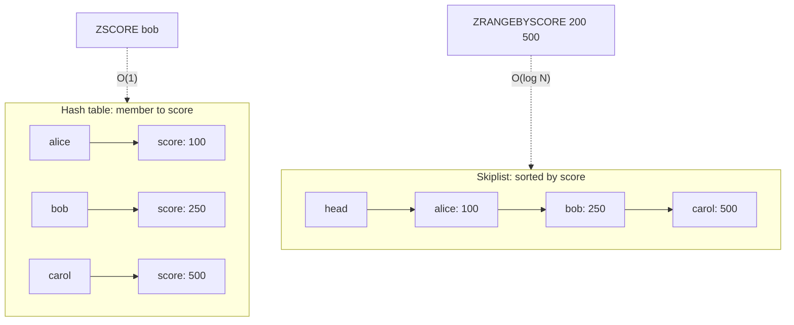
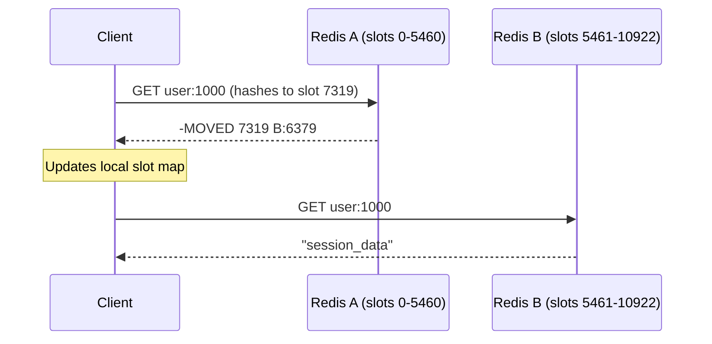
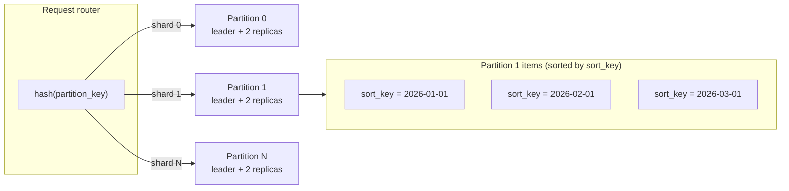
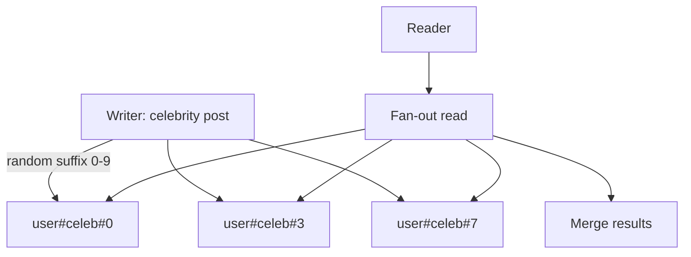

# Key-Value Stores: Redis, Memcached, DynamoDB, and Picking the Right Hash Table

> **TL;DR**: "Key-value store" is an API shape (`get`, `put`, `delete`), not a product category. Below that API, Redis gives you rich data structures in RAM with optional persistence, Memcached gives you a brutally simple multi-threaded cache, and DynamoDB gives you a fully managed durable store with sub-10 ms p99 at arbitrary scale [^1]. Most "Redis is slow" and "DynamoDB is throttling" tickets are hot-key tickets. Design your partition keys like your SLO depends on it, because it does.

## Learning Objectives

After this module, you will be able to:

- [ ] Distinguish Redis, Memcached, and DynamoDB by consistency, durability, and data model
- [ ] Model a workload with DynamoDB partition and sort keys
- [ ] Use Redis data structures (sorted sets, streams, HyperLogLog) beyond strings
- [ ] Reason about hot keys, cluster sharding, and failover
- [ ] Estimate cost for a managed KV store at a given QPS and data size

## Intuition

Think of a coat-check room at a concert venue. You hand over your coat, receive a numbered ticket, and later present that ticket to get your coat back. The attendant does not care what your coat looks like. They only care about the ticket number and the hook it maps to. That is a key-value store: a ticket (key) maps to a thing (value), and retrieval is O(1) because the attendant walks straight to the numbered hook.

Now imagine three venues. The first is a pop-up tent with no walls. Fast, cheap, but if it rains your coat is gone. That is Memcached: pure volatile memory, no durability, no frills. The second venue has a permanent building with labeled shelves, a sorting system for VIP coats, and a backup closet in the basement. That is Redis: rich organization, optional persistence, but still limited by the building's square footage (RAM). The third venue is a chain of warehouses across the country, managed by a logistics company. You never see the warehouse. You call a number, give your ticket, and the coat arrives. That is DynamoDB: fully managed, durable, elastic, but you pay per retrieval and you cannot rearrange the shelves after opening day.

The question is never "should I use a key-value store?" Almost every system already does. The question is which one, and the answer depends on whether you need durability, data types, or managed operations.

## Theory

### What "key-value store" spans

A key-value store is any system whose primary API is `get(key)`, `put(key, value)`, and `delete(key)`. That definition covers a spectrum:

- **Pure volatile caches** (Memcached): no persistence, no replication, no data types beyond bytes.
- **Structure-rich in-memory stores** (Redis/Valkey): sorted sets, streams, HyperLogLog, optional disk.
- **Managed durable stores** (DynamoDB): triple-replicated, Paxos-coordinated, elastic.
- **Wide-column stores** (Bigtable, Cassandra, ScyllaDB): row-key lookup plus range scans within a partition.
- **Embedded engines** (RocksDB, LevelDB, BoltDB): no network hop, linked into the process.

[Database Fundamentals](../part-0-prerequisites/03-database-fundamentals.md) introduced the relational model where queries plan across indexes. KV stores invert that: you give up the query planner in exchange for the fastest possible lookup at any scale [^1]. Secondary access patterns (range scans, joins, filtering) are weak or absent, forcing denormalization.

### Redis and Valkey

Redis executes commands in a single-threaded event loop per shard. One thread means no locks, no race conditions, and predictable latency. Since Redis 6.0, multi-threaded I/O handles socket reads and writes, but mutation remains serialized.

**Data structures.** Redis is not a string cache. It ships eight core types: strings, lists, hashes, sets, sorted sets, streams, HyperLogLog, and bitmaps. Sorted sets are the killer feature. They use a skiplist for O(log N) range queries plus a hash table for O(1) score lookup [^2]. A leaderboard is three commands: `ZADD` to insert scores, `ZREVRANGE` to fetch the top N, `ZRANK` to find a player's position.

*A sorted set maintains two structures over the same elements: a hash table for O(1) `ZSCORE` lookup and a skiplist for O(log N) range and rank queries. Small sorted sets are stored as a compact listpack until they exceed 128 entries or 64-byte values, then convert to this dual form[^2].*

**Persistence.** Two options: RDB snapshots via `fork()` and copy-on-write, or AOF (append-only file) that logs every write. Hybrid mode prepends an RDB snapshot to the AOF for fast restarts [^3]. Neither gives you synchronous durability by default. Redis is not a database unless you accept the durability trade-off.

**Clustering.** Redis Cluster shards by `CRC16(key) mod 16384` hash slots [^4]. Clients cache a slot-to-node map. When a client hits the wrong node, it receives a `MOVED` redirect, updates its map, and retries. Hash tags (`{user:1000}.followers`) force related keys to the same slot so multi-key commands work.

*A client with a stale slot map hits the wrong node, receives MOVED, updates its cache, and retries against the owning primary.*

**License situation (2024).** Redis Ltd. changed the license from BSD to RSALv2/SSPLv1 in March 2024 [^5]. The Linux Foundation forked Valkey under BSD-3 the same week. For new greenfield projects, Valkey is the safer bet on license risk. For existing Redis deployments, nothing breaks today, but plan for ecosystem fragmentation.

**The Redlock debate.** Redis's distributed lock algorithm (Redlock) assumes bounded network delay and bounded clock drift. Kleppmann argued it is neither efficient nor correct: a GC pause exceeding the lock TTL silently breaks mutual exclusion [^6]. The takeaway is not "Redlock is broken" but rather: for correctness-critical locks, use a consensus system (ZooKeeper, etcd) that produces a monotonic fencing token. For best-effort deduplication, a single-node `SETNX` with short TTL is simpler and sufficient.

### Memcached

Memcached is the opposite of Redis: no persistence, no replication, no clustering built in, no data types beyond byte strings. What it does have is a multi-threaded architecture that scales nearly linearly with CPU cores [^7].

The slab allocator partitions memory into fixed-size classes to avoid fragmentation. Items are LRU-evicted within a slab class. Multiple worker threads share a central hash table with fine-grained bucket-level locking. Clients distribute keys across nodes using consistent hashing (Ketama).

Facebook scaled Memcached to billions of requests per second across ~300 TB of RAM [^8]. A single node can handle on the order of 1 million ops/sec depending on hardware and item size. The paper introduced leases to prevent thundering herds and stale sets, gutter pools for failover absorption, and UDP for GETs to save socket overhead.

Why choose Memcached over Redis? When you need a pure read-through cache of serialized bytes at maximum QPS per node, and you do not need data types, persistence, or pub/sub. Netflix's EVCache wraps Memcached with replication and data chunking across approximately 22,000 server instances and 14 PB of cached data, handling 400M ops/sec at peak [^9].

### DynamoDB

DynamoDB is a fully managed, multi-tenant, horizontally partitioned store. It descends from the 2007 Dynamo paper but is architecturally distinct: modern DynamoDB uses Paxos-replicated write-ahead logs, not gossip plus vector clocks [^1].

**Data model.** Tables are partitioned by a hash of the partition key. Each partition is a three-node replication group across three AZs. Items are addressed by partition key alone (simple key) or partition key plus sort key (composite key). The sort key enables range queries within a partition.

*Partition-key hash selects the partition; sort-key orders items within it, enabling efficient range queries on the sort key.*

**Capacity and pricing.** Each partition caps at 3,000 RCU/s (read capacity units) and 1,000 WCU/s [^10]. On-demand mode in US East (N. Virginia) costs $0.625 per million write request units and $0.125 per million read request units (Standard table class, as of May 2026) [^11]. Strongly consistent reads consume 2x the RRUs of eventually consistent reads (1 RRU per 4 KB vs 0.5 RRU per 4 KB), so they cost 2x per read at the same item size. Provisioned mode is cheaper at steady state but requires capacity planning.

**Secondary indexes.** Global Secondary Indexes (GSI) are asynchronously maintained in their own partition space. Local Secondary Indexes (LSI) are co-located with the base partition. A GSI on a low-cardinality attribute (like `status`) creates hot partitions in the GSI, which back-pressures the base table.

**Single-table design.** Alex DeBrie's pattern overloads `PK` and `SK` with composite values (`PK=USER#123`, `SK=ORDER#2026-01-15`) so one table serves multiple access patterns. Powerful, but the schema is opaque and migrations are painful. Use it when you have 3+ access patterns on the same entity set.

### The hot-key problem

Every KV store assumes roughly uniform access. Real workloads are Zipfian: a celebrity's profile, the Black Friday deal page, the front page of Reddit. A partition sized for the average hits its cap when one key takes 30% of the traffic.

**Mitigation: suffix sharding.** Append a random suffix to the partition key on write (`user#celebrity#shard-3` for shards 0-9). Fan out reads across all suffixes and merge. This spreads one logical key across N physical partitions.

*Suffix sharding spreads a hot key across N physical partitions; readers fan out and merge, trading one extra round-trip for 10x throughput headroom.*

Other mitigations: cache the hot key at DAX or a client-side LRU, use DynamoDB's adaptive capacity (which splits hot partitions automatically after a delay), or promote the hot key to a dedicated Redis instance.

### Rate limiting with Redis

Redis's atomic Lua scripting makes it a natural home for rate limiters. Three common algorithms:

- **Fixed window:** `INCR key` with `EXPIRE`. Simple but allows 2x burst at window boundaries.
- **Sliding log:** Store each request timestamp in a sorted set. `ZRANGEBYSCORE` to count requests in the window. Accurate but memory-heavy.
- **Token bucket:** A Lua script reads remaining tokens and last-refill timestamp from a hash, computes refill, deducts the cost, and writes back atomically. Stripe's production rate limiter uses this pattern [^12].

Use token bucket as your default. It handles bursts gracefully, uses constant memory per key, and the Lua script makes the read-modify-write atomic.

### Scaling patterns

Three patterns move you past one machine:

- **Client-side consistent hashing** (Memcached default): the client library hashes keys to nodes. No extra hop, but every client needs pool membership and ring rebalancing is manual.
- **Server-side slot routing** (Redis Cluster): 16,384 hash slots with gossip-based membership. Clients receive redirects during resharding. Built-in failover via replicas.
- **Managed elastic partitioning** (DynamoDB): a request router caches partition-to-node maps. Adding capacity is invisible to the client. The trade-off is vendor lock-in and per-request pricing.

[Caching](../part-2-building-blocks/03-caching.md) covered distributed cache architectures in detail. The same consistent-hashing and proxy-routing patterns apply here.

## Real-World Example

### Facebook Memcached at scale (NSDI 2013)

Facebook operates one of the largest cache deployments ever documented: billions of requests per second across trillions of items, with ~300 TB of RAM in the Memcached fleet [^8]. The system uses vanilla memcached as a building block, wrapped with a custom client library and server-side extensions.

**Architecture.** Each user-facing request fans out to many memcached shards via mcrouter. The client uses UDP for GETs (small payloads, loss-tolerant) and TCP for SETs/DELETEs (reliability matters). Pools are replicated across regions with one master region and followers.

**The lease mechanism.** On a cache miss, the client receives a 64-bit lease token. Only the token holder may SET the key. If a concurrent writer invalidates the key mid-flight, the lease is revoked and the stale SET is rejected. Leases are granted only once per 10 ms per key, which hard-caps recomputation QPS and prevents thundering herds [^8].

**Failure handling.** Cross-region traffic shifts produced cold-cache storms because the follower region's memcached lacked the working set. The fix: warm the follower asynchronously by replicating SETs for hot keys. A small "gutter" pool absorbs overflow when a primary shard is unreachable.

**The lesson:** at Facebook's scale, naive cache-aside breaks. Leases, stale-value serving, and regional warming are requirements, not optimizations. The paper remains the single best case study for understanding KV stores under extreme load.

## Trade-offs

| Approach | Pros | Cons | Best when | Our Pick |
|---|---|---|---|---|
| Redis / Valkey | Rich data types, sub-ms latency, pub/sub, streams | Memory-bound cost, fork stalls, license ambiguity | Cache, queues, leaderboards, sessions, rate limiters | Default for structured in-memory workloads |
| Memcached | Multi-threaded, dead simple, tiny overhead, predictable | No persistence, no data types, no cluster mode | Pure read-through cache of bytes at max QPS | When you need nothing beyond get/set |
| DynamoDB | Managed, durable, elastic, global tables, triple-AZ replication | Cost, partition-key rigidity, vendor lock-in | Serverless stacks, unpredictable scale, cannot-lose-data | When you need durability without ops |
| Cassandra / ScyllaDB | Open source, wide-column, multi-region, linear scaling | Ops burden, compaction tuning, wide-row anti-patterns | Write-heavy, time-series, multi-region self-hosted | When you own your infra and need global writes |
| Embedded (RocksDB) | No network hop, sub-microsecond, ships with app | Per-process state, no sharing, compaction spikes | Storage engine inside larger systems (CockroachDB, TiKV) | When the KV store IS the app |

## Common Pitfalls

> [!WARNING]
> **BGSAVE fork stalls (Redis).** `BGSAVE` calls `fork()`, which copies the parent's page tables. On a multi-GB instance, this blocks the main loop for hundreds of milliseconds. Transparent Huge Pages make it worse. Fix: disable THP, keep instances under 10 GB per shard, snapshot on replicas instead of primaries [^13].

> [!WARNING]
> **DynamoDB hot partition throttling.** A table with plenty of aggregate headroom returns `ProvisionedThroughputExceededException` on a subset of keys. Each partition caps at 3,000 RCU/s and 1,000 WCU/s regardless of table-level provisioning [^10]. Fix: suffix-shard the hot key, cache at DAX, or avoid time-based partition keys like `yyyy-mm-dd`.

> [!WARNING]
> **Memcached cold start.** Memcached has no persistence. A process restart equals total data loss. At Netflix scale, a region failover means hours of cold-cache misses if not pre-warmed [^9]. Fix: rolling restarts with warm-up phases, cache-warming from EBS snapshots, or use Redis with AOF for warm restarts.

> [!WARNING]
> **GSI hot partition amplification (DynamoDB).** A GSI on a low-cardinality attribute (e.g., `status`) throttles writes on the base table even when the base table is healthy. Every base-table write propagates to every GSI. Fix: never use low-cardinality fields as GSI partition keys; compose with a shard suffix.

> [!WARNING]
> **Treating Redis as a primary database.** Redis with `appendfsync everysec` can lose up to one second of writes on crash. With `appendfsync always`, write latency jumps 10x. If you cannot tolerate any data loss, Redis is not your primary store. Use it as a cache or queue with a durable backing store.

## Exercise

> **Design Challenge:** Design the session store for a consumer app with 20 million daily active users, 100 ms p99 read budget, and graceful survival of a single-AZ outage. Pick between Redis Cluster (self-managed), ElastiCache for Redis (managed), and DynamoDB. Justify based on cost, consistency, and failure behavior.

Hint

Calculate the QPS: 20M DAU with ~10 session reads per user per day is ~2,300 reads/sec average, ~7,000 peak. That is well within a single Redis node's capacity. The interesting question is AZ survival: Redis Cluster with Multi-AZ replicas vs. DynamoDB's built-in triple-AZ replication. Compare the monthly cost of each at this scale.

Solution

**Option A: ElastiCache for Redis (Multi-AZ).**

A single `cache.r6g.large` node (13 GB RAM) handles 7,000 ops/sec trivially. Enable Multi-AZ with automatic failover. Sessions are hashes (`HSET session:{id} user_id 123 expires_at ...`). TTL of 24 hours with sliding expiry on access. Cost: ~$200/month for a primary + replica pair.

**Option B: DynamoDB on-demand.**

Partition key = `session_id`. No sort key needed. On-demand pricing in US East: 20M DAU x 10 session reads/day = 200M reads/month; strongly consistent reads on a sub-1 KB session item cost 1 RRU each, so 200M RRU at $0.125 per million = $25/month for reads. Writes (roughly 1 new session per DAU plus sliding updates, say 40M WRU/month) at $0.625 per million = $25/month. Storage for ~20M active sessions at 1 KB each (~20 GB) is roughly $5/month. Total: ~$55-75/month at this scale [^11]. Built-in triple-AZ replication, no failover configuration, no capacity planning.

**Recommendation: either works; choose on durability requirements.** At this scale, both options land in the low hundreds of dollars per month, so cost is not decisive. ElastiCache gives sub-millisecond p99 (trivially beats the 100 ms budget) but has a brief failover window (tens of seconds) and `appendfsync everysec` can lose up to one second of writes. DynamoDB gives zero-downtime AZ failure handling and durable writes at single-digit-millisecond p99, at comparable cost for sessions this small. Choose DynamoDB if you cannot tolerate any session loss (financial, auth) or want zero ops overhead; choose ElastiCache if you value the lowest possible latency and already run Redis.

**Trade-offs accepted:** Redis is faster but has a brief failover window and a one-second loss budget. DynamoDB offers zero-downtime AZ failure handling and per-request durability. At 20M DAU the cost gap is small; at 200M DAU, DynamoDB on-demand scales linearly with traffic, so provisioned mode with auto-scaling (or aggressive client-side caching in front) becomes the cost-efficient path.

## Key Takeaways

- "Key-value store" is three products with almost nothing in common beyond the `get`/`put` API shape. Know what you are buying: volatile cache, structured in-memory store, or managed durable store.
- Redis sorted sets, streams, and HyperLogLog make it far more than a cache. Use native data structures instead of serializing everything into strings.
- Memcached wins on raw multi-threaded throughput for pure byte caching. Facebook serves billions of requests per second on it [^8].
- DynamoDB's partition-key design is a one-way door. A bad key shape causes throttling that no amount of provisioned capacity fixes.
- Hot keys ruin every KV store. Suffix sharding, client-side caching, and adaptive capacity are your mitigations.
- Redis is not a database unless you accept its durability model. `appendfsync everysec` loses up to one second on crash.
- For distributed locks, use a consensus system with fencing tokens. Redlock's safety depends on timing assumptions that production violates [^6].

## Further Reading

- [Scaling Memcache at Facebook (Nishtala et al., NSDI 2013)](https://www.usenix.org/conference/nsdi13/technical-sessions/presentation/nishtala) - The canonical production-scale KV paper; leases, gutter pools, and regional invalidation at billions of QPS.
- [Amazon DynamoDB: A Scalable, Predictably Performant, and Fully Managed NoSQL Database Service (Elhemali et al., ATC 2022)](https://www.usenix.org/conference/atc22/presentation/elhemali) - The modern DynamoDB architecture paper; Paxos replication, MemDS, and split-for-heat.
- [Redis Cluster Specification](https://redis.io/docs/latest/operate/oss_and_stack/reference/cluster-spec/) - The authoritative source on 16,384 hash slots, MOVED/ASK redirects, and gossip protocol.
- [How to do distributed locking (Kleppmann, 2016)](http://martin.kleppmann.com/2016/02/08/how-to-do-distributed-locking.html) - The Redlock critique; pair with [Is Redlock safe? (antirez)](http://antirez.com/news/101) for the full debate.
- [Scaling your API with rate limiters (Stripe, 2017)](https://stripe.com/blog/rate-limiters) - Production token-bucket-on-Redis with Lua scripts; the reference implementation for API rate limiting.
- [The DynamoDB Book (Alex DeBrie)](https://www.dynamodbbook.com/) - The single-table design reference; essential before modeling complex access patterns.
- [Best practices for partition keys (AWS)](https://docs.aws.amazon.com/amazondynamodb/latest/developerguide/bp-partition-key-design.html) - The best single page on hot-partition mitigation, write sharding, and adaptive capacity.
- [Linux Foundation: Valkey announcement](https://www.linuxfoundation.org/press/linux-foundation-launches-open-source-valkey-community) - The BSD-licensed Redis fork; context for the 2024 license change.

## Flashcards

**Q:** What are the 16,384 hash slots in Redis Cluster?
**A:** Redis Cluster assigns every key to one of 16,384 slots via `CRC16(key) mod 16384`. Each slot is owned by exactly one primary node. Clients cache the slot-to-node map and receive MOVED redirects when it changes.

**Q:** How does a Redis sorted set achieve both O(1) score lookup and O(log N) range queries?
**A:** It maintains two data structures over the same elements: a hash table mapping member to score (O(1) lookup) and a skiplist sorted by score (O(log N) range queries and rank operations).

**Q:** What is the per-partition throughput cap in DynamoDB?
**A:** Each partition caps at 3,000 RCU/s for reads and 1,000 WCU/s for writes. Exceeding this on a single partition causes throttling regardless of table-level capacity.

**Q:** Why does Memcached scale better per-node than Redis for pure cache workloads?
**A:** Memcached uses multiple worker threads with fine-grained bucket-level locking on a shared hash table. Redis serializes all mutations through a single-threaded event loop per shard, requiring more shards to use more cores.

**Q:** What is suffix sharding for hot keys?
**A:** Append a random suffix (e.g., 0-9) to the partition key on write, spreading one logical key across N physical partitions. Readers fan out across all suffixes and merge results, trading one extra round-trip for N-times throughput headroom.

**Q:** Why is `fork()` problematic for Redis BGSAVE on large instances?
**A:** `fork()` copies the parent's page tables, which blocks the single-threaded event loop. On multi-GB instances this takes hundreds of milliseconds. Subsequent copy-on-write page faults during writes add further latency spikes.

**Q:** What is the difference between the 2007 Dynamo paper and modern DynamoDB?
**A:** The 2007 paper used gossip, vector clocks, and sloppy quorums. Modern DynamoDB uses Paxos-replicated write-ahead logs, a request router with cached partition maps, and deterministic leader election. They share the name and the partition-key concept but differ architecturally.

**Q:** When should you choose DynamoDB over Redis for a session store?
**A:** When you need zero data loss (Redis can lose up to 1 second on crash), zero-downtime AZ failover without manual configuration, or unpredictable scale where auto-scaling matters more than per-request cost.

**Q:** What problem do Facebook's leases solve in Memcached?
**A:** Leases prevent two failure modes: (1) thundering herd, where many clients miss the same key and stampede the database, and (2) stale sets, where a concurrent invalidation races with a cache refill. Only the lease-token holder may SET, and leases are granted once per key per 10 ms.

**Q:** Name three rate-limiting algorithms implementable on Redis.
**A:** (1) Fixed window: INCR + EXPIRE, simple but allows 2x burst at boundaries. (2) Sliding log: sorted set of timestamps, accurate but memory-heavy. (3) Token bucket: Lua script with atomic read-modify-write, handles bursts gracefully with constant memory.

**Q:** What does "addicted to the cache" mean for a KV-backed service?
**A:** The service cannot operate with a cold cache. If Redis or Memcached restarts and all requests hit the origin simultaneously, the database collapses. Fix: design for graceful degradation with cache warming, origin capacity headroom, and soft-TTL/hard-TTL patterns.

**Q:** What is DynamoDB's consistency model for reads?
**A:** Eventually consistent reads (default) may return stale data from any replica. Strongly consistent reads go to the Paxos leader and cost 2x the RCU. [Consistency Models](../part-1-core-fundamentals/03-consistency-models.md) covers the broader spectrum.

## References

[^1]: Perianayagam and Vig, "Lessons learned from 10 years of DynamoDB", Amazon Science, October 2022. https://www.amazon.science/blog/lessons-learned-from-10-years-of-dynamodb
[^2]: Redis source, `src/t_zset.c`. Sorted set implementation: hash table + skiplist, derived from Pugh 1990. https://github.com/redis/redis/blob/unstable/src/t_zset.c
[^3]: Redis documentation, "Redis persistence" (RDB, AOF, hybrid). https://redis.io/docs/latest/operate/oss_and_stack/management/persistence/
[^4]: Redis Cluster specification. https://redis.io/docs/latest/operate/oss_and_stack/reference/cluster-spec/
[^5]: Linux Foundation, "Linux Foundation Launches Open Source Valkey Community", March 28, 2024. https://www.linuxfoundation.org/press/linux-foundation-launches-open-source-valkey-community
[^6]: Kleppmann, "How to do distributed locking", February 8, 2016. http://martin.kleppmann.com/2016/02/08/how-to-do-distributed-locking.html
[^7]: memcached source, `doc/threads.txt`. Threading model, locking hierarchy. https://github.com/memcached/memcached/blob/master/doc/threads.txt
[^8]: Nishtala et al., "Scaling Memcache at Facebook", NSDI 2013. https://www.usenix.org/conference/nsdi13/technical-sessions/presentation/nishtala
[^9]: Netflix Tech Blog, "Cache warming: Leveraging EBS for moving petabytes of data", 2021. https://web.archive.org/web/20231227201120/https://netflixtechblog.medium.com/cache-warming-leveraging-ebs-for-moving-petabytes-of-data-adcf7a4a78c3
[^10]: AWS, "Best practices for designing and using partition keys effectively in DynamoDB". https://docs.aws.amazon.com/amazondynamodb/latest/developerguide/bp-partition-key-design.html
[^11]: AWS, "Amazon DynamoDB pricing (on-demand capacity)". https://aws.amazon.com/dynamodb/pricing/on-demand/
[^12]: Tarjan, "Scaling your API with rate limiters", Stripe Engineering, March 30, 2017. https://stripe.com/blog/rate-limiters
[^13]: antirez, "Redis latency spikes and the Linux kernel: a few more details". https://antirez.com/news/84
