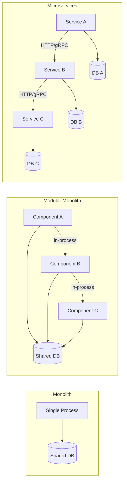
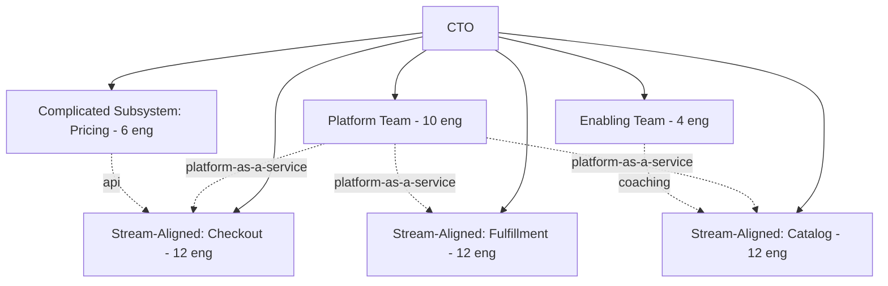
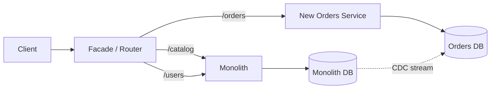
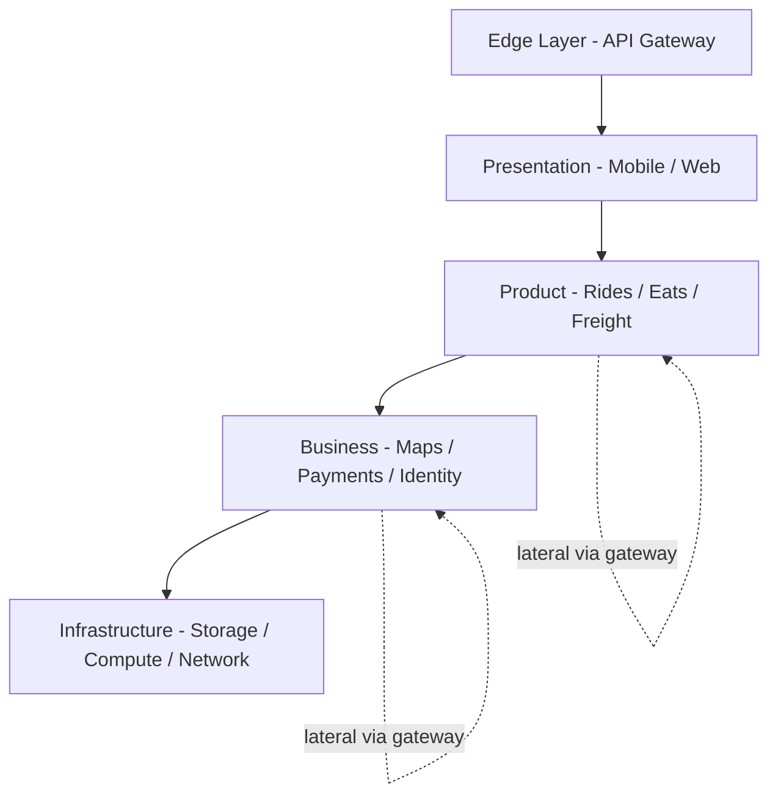

# Monolith vs Microservices: Team Topology, Conway's Law, and the Distributed System Tax

> **TL;DR**: Microservices are an organizational pattern dressed up as a technical one. The decision to decompose is dominated by team size, deployment frequency, and cognitive load, not by request volume. The distributed system tax (network failures, versioning, observability, sagas) can consume 30-50% of engineering capacity once you cross the process boundary. Uber grew from 2 monolithic services to 2,200+ critical microservices and then spent two years imposing domain structure on top because unconstrained decomposition produced a dependency graph no single engineer could reason about[^1]. The modular monolith, a single deployable with enforced internal boundaries, is the pragmatic default for teams under 100 engineers. Extract services to solve scaling or team problems, never to feel modern.

## Learning Objectives

After this module, you will be able to:

- [ ] Apply Conway's Law when evaluating a decomposition proposal
- [ ] List the distributed system tax items and cost each one
- [ ] Identify bounded contexts that are actually ready to extract
- [ ] Decide between a monolith, modular monolith, and microservices for a given team size and workload
- [ ] Plan an incremental extraction without a big-bang rewrite

## Intuition

Imagine you run a restaurant kitchen. When you have five cooks, everyone works at one long counter. They share knives, cutting boards, and the same walk-in fridge. Communication is instant: "Behind you!" works because everyone is in earshot. This is a monolith.

Now imagine the restaurant grows to fifty cooks. The counter is chaos. People bump into each other, grab the wrong knife, and wait in line for the single oven. You partition the kitchen into stations: grill, pastry, sushi, prep. Each station has its own tools and its own mini-fridge. Cooks at one station call orders to another via a ticket window. This is a modular monolith: same building, separate workspaces, shared utilities.

Eventually you open a food hall. Each cuisine gets its own kitchen in a separate building. They communicate by delivery runner. Now a single customer order might require runners between three kitchens. If one kitchen's runner gets lost, the customer waits. If a kitchen changes its menu format, every other kitchen that sends tickets there must adapt. You have gained independence but paid a coordination tax. This is microservices.

The question is never "which is best?" It is "how many cooks do you have, and are they bumping into each other?" [Scalability: Growing a System Without Breaking It](../part-1-core-fundamentals/00-scalability.md) introduced the mechanics of growing a system. This chapter asks the harder question: whether to grow it as one system or many.

## Theory

### Definitions with teeth

Four terms dominate this space. Most teams use them loosely. Precision matters because each carries different operational costs.

**Monolith.** A single deployable unit, single process type, shared database. All modules compile and ship together. A Rails application serving HTTP, background jobs, and admin from one codebase against one PostgreSQL instance. Works well up to roughly 30 engineers.

**Modular monolith.** A single deployable, but the codebase is partitioned into components with enforced internal boundaries: public APIs, dependency rules, separate test suites. Shopify's core monolith is the reference implementation: 2.8 million lines of Ruby, 37 internal components, dependency graph validated on every pull request by Packwerk[^2].

**Microservices.** Multiple independently deployable services, each owning its data, communicating over the network. The canonical size anchor is Amazon's two-pizza team: typically 6-10 people (the whole team fed by two pizzas), owning a service end to end[^3].

**Distributed monolith (anti-pattern).** Services are split on paper but must deploy together, share a database, or form synchronous call chains deeper than two hops. All of the distributed tax, none of the independence benefits. Smells: a library bump requires redeploying every service; a single feature touches five repos in one PR; test environments need the entire fleet running.

*Figure 1: All three share a request path; the difference is what crosses a process boundary. In-process calls (dotted) are free; network calls (solid) carry the full distributed tax.*

### The distributed system tax

The moment you cross a process boundary, you pay a tax on every item below. This is not a one-time cost; it compounds with every service added.

- **Network as a failure mode.** In-process calls become RPC. Every call needs timeouts, retries, circuit breakers, and idempotency. At Uber's scale, if each of 100 dependencies responds slowly 1% of the time, the probability of at least one slow response per request is 1 - 0.99^100 = 63%[^4].
- **Versioning contracts.** Once a service has more than one consumer, every schema change is a rollout-order problem. You need backward-compatible evolution, Tolerant Reader patterns, and version negotiation.
- **Cross-service transactions.** ACID guarantees within a database become sagas or outbox patterns across services. What was a single-line database transaction becomes a multi-step choreography with compensating actions.
- **Observability across boundaries.** A single user action that touched three modules in the monolith now crosses a dozen services. Uber built Jaeger specifically because production traces routinely contained tens of thousands of spans[^4].
- **On-call burden multiplied.** Segment's operational overhead scaled linearly with services added. A small team was consumed keeping 140+ services alive[^5].
- **Service mesh and infrastructure.** You need service discovery, load balancing, mTLS, health checks, and deployment orchestration per service. This is why platform teams exist.

**Aggregate cost:** Segment's small team consumed by operational overhead, Uber's two-year DOMA project on top of existing services. The "30-50% of engineering capacity" figure is an estimate consistent with these qualitative reports.

### Conway's Law and the Inverse Conway Maneuver

Melvin Conway's 1968 paper states: "Organizations which design systems are constrained to produce designs which are copies of the communication structures of these organizations"[^6]. He illustrated it with a contract-research example: an 8-person team split 5-3 between a COBOL and an ALGOL compiler produced a 5-phase COBOL compiler and a 3-phase ALGOL compiler.

This is not a suggestion. It is a constraint. If you have a frontend team, a backend team, and a DBA team, you will produce a three-tier architecture regardless of what the whiteboard says. Fowler and Lewis explicitly cite Conway in the original 2014 microservices essay as the reason to organize teams around business capabilities rather than technology layers[^3].

The **Inverse Conway Maneuver** is the deliberate inversion: shape teams first, so they produce the architecture you want. If you want a checkout service, create a checkout team that owns the full stack from API to database.

**Team Topologies** (Skelton and Pais, 2019) turns this into an actionable framework[^7]:

- **Stream-aligned teams** (the default): own a business domain end to end
- **Platform teams**: reduce cognitive load by providing self-service internal products
- **Enabling teams**: time-bounded coaching to unblock stream-aligned teams
- **Complicated-subsystem teams**: specialists on components needing deep expertise

The explicit design principle is sustainable cognitive load per team.

*Figure 2: Team Topologies applied to a 56-engineer org. Stream-aligned teams own business domains; the platform team provides infrastructure as a self-service product; interaction modes (dotted) are explicit.*

**The Spotify cautionary tale.** The Spotify "squad model" (2012) became the default copy-paste template for agile scaling. In 2020, Jeremiah Lee, a Spotify employee, documented that it was "only ever aspirational and never fully implemented." Joakim Sunden, Spotify agile coach 2011-2017, confirmed: "Even at the time we wrote it, we weren't doing it. It was part ambition, part approximation"[^8]. Do not adopt a branded model whose creators publicly caution against copying it.

### When each architecture wins

The headcount heuristic is a starting point, not a rule:

| Signal | Stay monolith | Modularize | Extract services |
|--------|---------------|------------|------------------|
| Team size | <30 engineers | 30-150 engineers | 150+ with platform team |
| Deploy bottleneck | No | Shared build getting slow | Deploy queue dominates |
| Bounded contexts | Not yet stable | Emerging, named | Stable and team-owned |
| Divergent scaling | No | Some | Yes (read/write asymmetry, different runtimes) |
| Regulatory isolation | No | No | Yes (PCI, SOC2 scope reduction) |

Fowler's "MonolithFirst" argument: you need to learn your bounded contexts before drawing hard service lines. Refactoring across process boundaries is strictly harder than across classes[^9]. DHH's "Majestic Monolith" is the opinionated version: most web applications should start life as a monolith, and most will be well served by that pattern for their entire lifespan[^10].

The modular monolith wins for teams of 30-150 with a single bounded product. Shopify runs 2.8M lines of Ruby with hundreds of developers, 37 internal components with enforced boundaries, and only extracts services for concrete reasons: divergent scaling profile (storefront rendering) or regulatory isolation (credit-card vaulting)[^2].

Microservices win when the organization can support a platform team, has several clear bounded contexts, and faces team autonomy pressure, divergent workload characteristics, or regulatory isolation requirements.

### Extraction strategies

When you do extract, the playbook is incremental, never big-bang.

**Strangler Fig** (Fowler, 2004)[^11]. Route incoming traffic through a facade; for each capability, route a slice to the new service while the monolith serves the rest. Over time the new system grows until the monolith can be retired. [Strangler Fig: Incremental Migration Without a Big Bang](./06-strangler-fig.md) covers this pattern in depth.

**Branch by Abstraction.** Insert an abstraction layer inside the monolith around the functionality you want to replace, build the new implementation behind the abstraction, flip the flag, remove the old implementation. Keeps the system releasable at every step.

**Data migration via CDC.** The hardest part of extraction is rarely the code; it is the data. Change data capture streams the monolith's database writes into the new service's store without requiring monolith code changes once the pipeline is wired.

*Figure 3: Strangler Fig extraction in progress. The facade routes each capability to either the monolith or the new service; CDC keeps data flowing without coupling the codebases.*

## Real-World Example

### Uber: from 2 services to 4,000+ to DOMA

Uber's architecture evolution is the industry's sharpest case study because it shows all three phases: monolith, unconstrained decomposition, and structured recovery.

**Phase 1 (circa 2012-2013): The monolith.** Two services: a Python API monolith and a Node.js dispatch service sharing PostgreSQL. By the end of this phase (late 2013), roughly 100 engineers and 65 cities[^1].

**Phase 2 (2013-2018): Aggressive decomposition.** By mid-2016, Uber had 1,000+ production services (crossing that mark in early March 2016), 8,000+ git repos, and 2,000 engineers[^4]. Matt Ranney, Chief Systems Architect, described the resulting dependency graph as a "death star" at QCon New York 2016. His blunt assessment: "The time when Uber is most reliable is on the weekends because that is when the Uber engineers aren't making changes"[^4].

**Phase 3 (2018-2020): DOMA.** Uber imposed Domain-Oriented Microservice Architecture on top of the existing fleet. 2,200 critical services were grouped into 70 domains. Each domain exposes a single gateway as its external interface. Five layers (Edge, Presentation, Product, Business, Infrastructure) enforce that calls flow only downward or laterally through gateways[^1].

*Figure 4: Uber's DOMA layered architecture. Dependencies flow only downward; lateral calls within a layer go through the target domain's gateway; upward calls are prohibited.*

**Key lessons:**

- Services had a 1.5-year half-life, so Uber added structure at the domain level rather than trying to reduce service count[^1].
- Gateways absorbed two major platform rewrites without forcing upstream migrations.
- By September 2023, Uber ran 100,000+ deployments per week across 4,500 services and 4,000 engineers[^12].

The complementary story is **Segment's retreat**. Segment grew to 140+ microservices (one per analytics destination), found a small team consumed keeping the fleet alive, and consolidated back to a single service in 2018. Shared-library improvements: 32 during the microservice era versus 46 in the first year after consolidation[^5].

The lesson from both: microservices are not a destination. They are a tool you reach for when team coordination costs exceed distribution costs, and you put back when the reverse is true.

## Trade-offs

| Approach | Pros | Cons | Best when | Our Pick |
|----------|------|------|-----------|----------|
| Monolith | Simple, fast, one debugger, zero network tax | Scaling teams hurts; deploy queue grows | Startup to ~30 engineers | **Default for early-stage products** |
| Modular monolith | Team ownership without distribution tax; option to extract later | Requires enforcement tooling (Packwerk, ArchUnit) | 30 to 150 engineers, single product | **Default for growing teams** |
| Microservices | Team autonomy, independent scaling, polyglot runtimes | Full distributed tax (30-50% capacity) | 150+ engineers with platform team | When coordination cost exceeds distribution cost |
| Serverless / functions | Per-function autonomy, zero idle cost | Cold starts, debugging, tooling gaps | Event-driven, bursty workloads | Targeted use for webhooks, ETL, image transforms |

[Trade-off Thinking](../part-1-core-fundamentals/06-trade-off-thinking.md) introduced the framework for articulating these decisions. The key insight here: the "Our Pick" column depends on your team size, not your traffic volume.

## Common Pitfalls

> [!WARNING]
> **The distributed monolith.** You split services but they deploy together, share a database, or form synchronous chains five hops deep. You now have all of the distributed tax and none of the independence. Detection: count services that deploy together in a typical release. If the answer is "most of them," consolidate back.

> [!WARNING]
> **Copying someone else's org chart.** Adopting the Spotify squad model verbatim and discovering a year later that autonomy without alignment produces inconsistent processes. The model was aspirational, never fully implemented, and its creators publicly caution against copying it[^8]. Use Team Topologies or plain business-unit vocabulary instead.

> [!WARNING]
> **Extracting the wrong boundary first.** The extracted capability needs a constant synchronous call chain back into the monolith; latency doubles; both systems deploy in lockstep. Extract capabilities with low coupling, high cohesion, and self-contained data. Shopify's two extractions (storefront rendering, credit-card vaulting) were chosen for divergent scaling and regulatory isolation, not because they were "microservice-shaped."

> [!WARNING]
> **Premature platform investment.** A 40-engineer team builds service mesh, internal PaaS, and custom observability before it needs them. Six months of capacity goes into infrastructure serving eight services. Adopt off-the-shelf platforms (managed Kubernetes, Datadog, Honeycomb) until demonstrably insufficient.

> [!WARNING]
> **Nano-services.** Decomposing so aggressively that each service is a single function. Every inter-service call adds latency, every schema is a versioning problem, and the cognitive overhead of navigating 200 repos dwarfs the coordination cost of a shared codebase. Uber's DOMA response was to add structure on top, not to merge services back.

## Exercise

You run a Rails monolith with 80 engineers, deploy pipeline takes 90 minutes, and three teams block each other daily. Propose a decomposition plan: which contexts extract first, which stay monolithic, how you handle shared database, and how you avoid becoming a distributed monolith.

Hint

The deploy pipeline and team blocking are the symptoms. Ask: is the problem the runtime (one process) or the codebase (one repo, one test suite, one deploy queue)? You can fix the latter without splitting the former. Think about what Shopify did with Packwerk before extracting anything.

Solution

**Step 1: Modularize the monolith first.**

Do not jump to microservices. With 80 engineers you are in modular-monolith territory. Introduce internal component boundaries using a tool like Packwerk (Ruby) or ArchUnit (Java). Assign each of the three teams a component with a public API. Enforce dependency rules in CI so new cross-boundary violations fail the build.

**Step 2: Split the deploy pipeline, not the runtime.**

The 90-minute pipeline is likely dominated by a monolithic test suite. Split tests by component ownership. Run only affected-component tests on each PR. Keep a full integration suite on merge to main, but parallelize it across component boundaries. This alone may reduce deploy time to 15-20 minutes per team.

**Step 3: Identify the first extraction candidate.**

Look for the component with the most divergent scaling profile or the strongest regulatory isolation need. Common candidates: payment processing (PCI scope reduction), media processing (CPU-bound, different scaling curve), or a high-read-QPS storefront (cacheable, independently scalable).

**Step 4: Extract with Strangler Fig.**

Place a routing layer in front of the monolith. Route the extracted capability's traffic to the new service. Use CDC (not dual-write) to migrate data ownership. Keep the monolith's copy read-only as a fallback during the transition.

**Step 5: Avoid the distributed monolith.**

The extracted service must be independently deployable and independently testable. If it needs synchronous calls back into the monolith for every request, the boundary is wrong. Prefer async events (outbox pattern) for cross-boundary communication. If the service cannot function when the monolith is down, it is not independent.

**Trade-off accepted:** You defer the full microservices architecture. You accept that some teams still share a deploy pipeline for the monolith portion. But you eliminate the daily blocking immediately (via component ownership) and reduce deploy time (via test splitting) without paying the distributed tax.

## Key Takeaways

- Microservices are the right answer for organizations, not for applications. The decision is dominated by team size, not traffic volume.
- The distributed system tax is real: network failures, versioning, observability, sagas, and on-call burden consume 30-50% of engineering capacity.
- Conway's Law is a constraint, not a suggestion. Your architecture will mirror your org chart whether you plan for it or not.
- The modular monolith (single deployable, enforced internal boundaries) is the correct default for teams of 30-150 engineers.
- Extract services to solve a named problem (scaling divergence, regulatory isolation, team autonomy at 150+ engineers), never to "feel modern."
- Segment's reverse migration and Uber's DOMA retrofit are required reading. Both show that unconstrained decomposition produces operational overhead that eventually forces structural correction.
- The Inverse Conway Maneuver works: shape teams first, architecture follows.

## Further Reading

- [Microservices](https://martinfowler.com/articles/microservices.html) by Martin Fowler and James Lewis - The 2014 essay that defined the term and explicitly invoked Conway's Law; required context for everything that followed.
- [MonolithFirst](https://martinfowler.com/bliki/MonolithFirst.html) by Martin Fowler - The one-page contrarian default; read this before proposing any decomposition.
- [Goodbye Microservices](https://www.twilio.com/en-us/blog/developers/best-practices/goodbye-microservices) by Alexandra Noonan, Segment - The canonical reverse-migration case study with specific numbers on operational cost.
- [Under Deconstruction: The State of Shopify's Monolith](https://shopify.engineering/shopify-monolith) by Philip Muller - The modular monolith at 2.8M LOC; honest about what did not work in the first attempt.
- [Introducing Domain-Oriented Microservice Architecture](https://www.uber.com/blog/microservice-architecture/) by Adam Gluck, Uber - What 2,200 microservices plus structure looks like; the DOMA paper.
- [Team Topologies](https://teamtopologies.com/book) by Matthew Skelton and Manuel Pais - The organizational framework that replaced cargo-culted squad models; read for cognitive-load-first team design.
- [Spotify's Failed #SquadGoals](https://www.jeremiahlee.com/posts/failed-squad-goals/) by Jeremiah Lee - Why not to copy the Spotify model, documented by a Spotify employee.
- [The Majestic Monolith can become The Citadel](https://www.signalvnoise.com/svn3/the-majestic-monolith-can-become-the-citadel/) by DHH - Basecamp's opinionated alternative: monolith at center, targeted outposts for divergent workloads.

## Flashcards

**Q:** What is Conway's Law?
**A:** Organizations which design systems are constrained to produce designs which are copies of the communication structures of those organizations. Your architecture will mirror your org chart whether you plan for it or not.

**Q:** What is the Inverse Conway Maneuver?
**A:** Deliberately shaping team structure first so that the resulting architecture matches your desired system design. If you want a checkout service, create a checkout team that owns the full stack.

**Q:** What are the four team types in Team Topologies?
**A:** Stream-aligned (owns a business domain end to end), platform (provides self-service internal products), enabling (time-bounded coaching), and complicated-subsystem (deep expertise on specific components).

**Q:** What is a distributed monolith?
**A:** Services that are split on paper but must deploy together, share a database, or form deep synchronous call chains. You pay the full distributed tax but gain none of the independence benefits.

**Q:** What headcount heuristic guides the monolith-to-microservices decision?
**A:** Under 30 engineers: monolith. 30-150 engineers: modular monolith. Over 150 with a platform team: microservices. These are starting points, not rules; the binding constraint is coordination cost versus distribution cost.

**Q:** Why did Segment retreat from microservices back to a monolith?
**A:** 140+ microservices consumed a small team just keeping the fleet alive. Operational overhead scaled linearly with services added. After consolidation, shared-library improvements jumped from 32 (microservice era) to 46 (first year post-consolidation).

**Q:** What is Uber's DOMA and why was it needed?
**A:** Domain-Oriented Microservice Architecture grouped 2,200 services into 70 domains with gateways and layered dependency rules. It was needed because unconstrained decomposition produced a "death star" dependency graph where incident investigation required navigating 50+ services across 12 teams.

**Q:** What is the distributed system tax?
**A:** The aggregate cost of crossing process boundaries: network failures requiring retries and idempotency, API versioning, cross-service transactions (sagas), distributed tracing, multiplied on-call burden, and service mesh infrastructure. Estimated at 30-50% of engineering capacity.

**Q:** When should you extract a service from a monolith?
**A:** When you have a concrete, named reason: divergent scaling profile (a component needs a different runtime or 10x more instances), regulatory isolation (PCI scope reduction), or team autonomy pressure (150+ engineers needing to deploy without coordination). Never extract to "feel modern."

**Q:** What was wrong with the Spotify squad model?
**A:** It was aspirational, never fully implemented even at Spotify. Autonomy without alignment produced inconsistent processes. Its co-authors and insiders publicly retracted it by 2020, cautioning against copying it as a framework.

**Q:** What is the Strangler Fig pattern for service extraction?
**A:** Route traffic through a facade. For each capability, route a slice to the new service while the monolith serves the rest. Over time the new system grows until the monolith portion can be retired. Always incremental, never big-bang.

**Q:** Why is the modular monolith the correct default for most teams?
**A:** It gives you team ownership and change locality without paying the distributed system tax. You defer the cost of network failures, versioning, and observability while keeping the option to extract later when a concrete pressure forces the issue.

## References

[^1]: Adam Gluck, "Introducing Domain-Oriented Microservice Architecture", Uber Engineering Blog, July 2020. https://www.uber.com/blog/microservice-architecture/
[^2]: Philip Muller, "Under Deconstruction: The State of Shopify's Monolith", Shopify Engineering, 16 Sep 2020. https://shopify.engineering/shopify-monolith
[^3]: James Lewis and Martin Fowler, "Microservices", martinfowler.com, 25 March 2014. https://martinfowler.com/articles/microservices.html
[^4]: Matt Ranney, "Scaling Uber to 1,000 Services", QCon New York 2016 (recorded), InfoQ. https://www.infoq.com/presentations/uber-scalability-services/. Summarised in "Lessons Learned from Scaling Uber to 2000 Engineers, 1000 Services, and 8000 Git Repositories", HighScalability, October 2016. https://highscalability.com/lessons-learned-from-scaling-uber-to-2000-engineers-1000-ser/
[^5]: Alexandra Noonan, "Goodbye Microservices: From 100s of problem children to 1 superstar", Twilio Segment blog, 10 July 2018. https://www.twilio.com/en-us/blog/developers/best-practices/goodbye-microservices
[^6]: Melvin E. Conway, "How Do Committees Invent?", Datamation, April 1968. http://www.melconway.com/Home/Committees_Paper.html
[^7]: Matthew Skelton and Manuel Pais, "Team Topologies", teamtopologies.com. https://teamtopologies.com/book
[^8]: Jeremiah Lee, "Spotify's Failed #SquadGoals", jeremiahlee.com, 19 April 2020. https://www.jeremiahlee.com/posts/failed-squad-goals/
[^9]: Martin Fowler, "MonolithFirst", martinfowler.com, 3 June 2015. https://martinfowler.com/bliki/MonolithFirst.html
[^10]: David Heinemeier Hansson, "The Majestic Monolith can become The Citadel", Signal v. Noise, 8 April 2020. https://www.signalvnoise.com/svn3/the-majestic-monolith-can-become-the-citadel/
[^11]: Martin Fowler, "Strangler Fig", martinfowler.com, originally published 29 June 2004, updated 22 August 2024. https://martinfowler.com/bliki/StranglerFigApplication.html
[^12]: Mathias Schwarz and Andrew Neverov, "Up: Portable Microservices Ready for the Cloud", Uber Engineering Blog, 7 September 2023. https://www.uber.com/blog/up-portable-microservices-ready-for-the-cloud/
