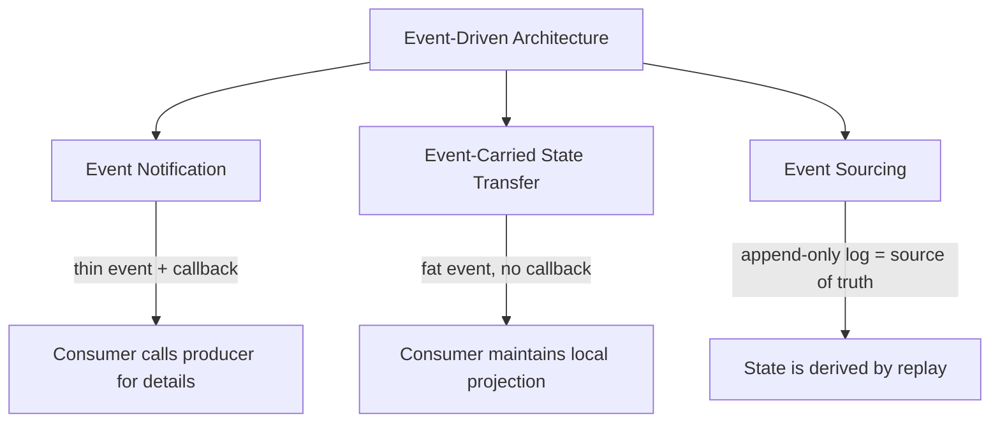
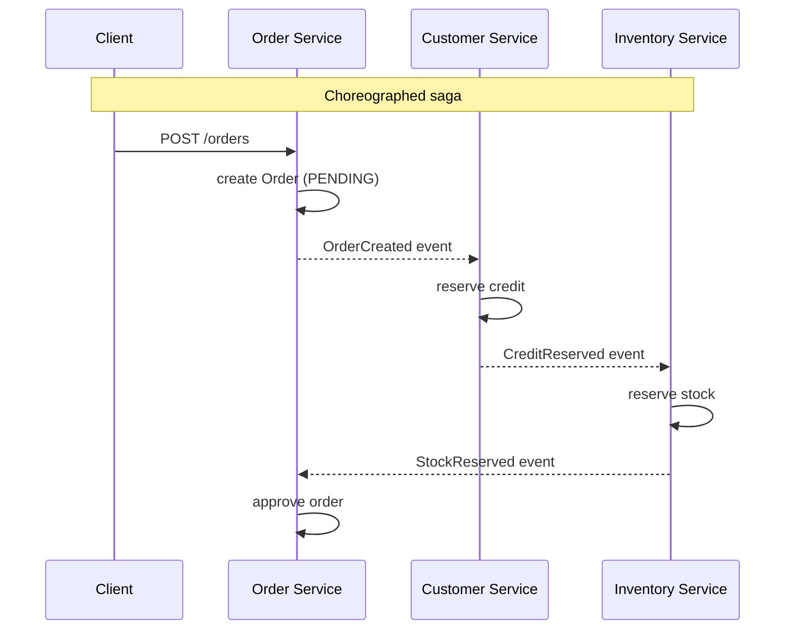
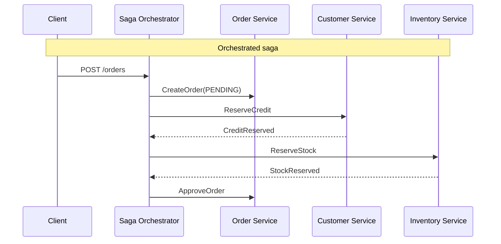
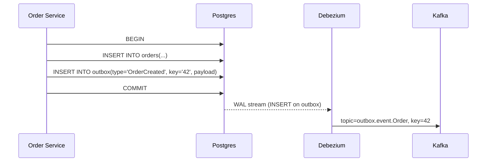

# Event-Driven Architecture: Notifications, State Transfer, and Choreography

> **TL;DR**: "Event-driven" hides three distinct patterns that people routinely conflate: event notification (thin signal, consumer calls back), event-carried state transfer (fat event, consumer is self-sufficient), and event sourcing (events are the database). Picking the wrong one changes your coupling, storage, and failure story. Coordination splits into choreography (services react to events, no central brain) and orchestration (a workflow engine drives steps). LinkedIn processes 7 trillion messages per day through Kafka[^1]; Netflix routes its studio and finance event traffic through a multi-stage producer-enricher-consumer Kafka pipeline[^2]. The architecture's quiet superpower is replay. Its quiet killer is the dual-write bug, which the transactional outbox pattern eliminates.

## Learning Objectives

After this module, you will be able to:

- [ ] Distinguish event notification, event-carried state transfer, and event sourcing
- [ ] Design schemas for events that are stable, evolvable, and self-describing
- [ ] Choose between choreography and orchestration for a multi-step flow
- [ ] Reason about eventual consistency, replay, and idempotency in event-driven systems
- [ ] Select between Kafka, EventBridge, SNS/SQS, and NATS for a given workload

## Intuition

You work at a newspaper. Three departments need to know when a story breaks: the print desk, the website team, and the social media team.

**Option A (notification):** The editor shouts "Story 4217 is ready!" across the newsroom. Each department walks to the editor's desk, picks up the manuscript, and photocopies the parts they need. The editor gets interrupted three times. If the editor is at lunch, nobody can work.

**Option B (state transfer):** The editor drops a full copy of the manuscript into each department's inbox. They work independently. If the editor goes home sick, the departments still have everything they need. But now three copies of the manuscript exist, and if the editor makes a correction, the copies are stale until the next drop.

**Option C (event sourcing):** The editor does not write a finished manuscript at all. Instead, every edit, every paragraph addition, every deletion is recorded in sequence on a shared timeline. Each department reconstructs the current story by replaying the timeline from the beginning. If someone asks "what did the story look like at 3pm?", you just replay to that point.

These three options map directly to the three patterns Martin Fowler identified in his 2017 taxonomy[^3]: event notification, event-carried state transfer (ECST), and event sourcing. The first skill in event-driven design is saying which one you mean, because each changes who depends on whom, how much data flows, and what happens when something fails.

[Message Queues and Streaming](../part-2-building-blocks/08-message-queues-streaming.md) introduced the transport primitives (topics, partitions, consumer groups, retention). This chapter builds on that foundation to show how you compose those primitives into architectural patterns.

## Theory

### The Fowler taxonomy

Fowler's 2017 article, written after a Thoughtworks workshop and summit on the topic, identified that "event-driven" conflates at least three patterns with different trade-offs[^3]. Getting this taxonomy into your vocabulary is the single biggest teaching win in this chapter.



*The three flavors of event-driven architecture differ in payload size, coupling direction, and where the source of truth lives.*

**Event notification.** A small message announces "X happened, with id Y." Consumers subscribe, learn something changed, and issue a synchronous query to the producer to fetch the current state. Fowler describes this as "just some id information and a link back to the sender."[^3] The upside is trivial schemas and loose coupling. The downside is an N+1 callback storm: one event fans out to N consumers, each hitting the producer's API. You have traded synchronous coupling for hidden coupling.

**Event-carried state transfer (ECST).** The event carries the relevant entity state so consumers can act without calling back. Each consumer maintains its own local projection of the data it cares about. The canonical Kafka implementation is a log-compacted topic keyed by entity id: new consumers bootstrap by reading from offset 0 and get the latest state for every entity[^4]. The upside is that consumers function when the producer is down. The downside is schema pressure, stale projections, and GDPR headaches because sensitive data is now replicated across many services.

**Event sourcing.** The append-only log of events is the source of truth. Current state is a derived projection you can throw away and rebuild. Fowler's analogy is git: the commit log is primary, the working tree is derived[^3]. This is not the same as ECST. ECST uses events for transport; event sourcing uses events as the database. Confusing the two is the single most common reason teams blame the wrong pattern when things go wrong.

> [!IMPORTANT]
> Do not conflate event sourcing with ECST. In ECST, the producer's database is still the source of truth and events are a replication mechanism. In event sourcing, there is no separate database; the event log IS the truth. Mixing these up leads to architectures that are complex without being correct.

### Events as contracts

An event is a public API. Treat breaking changes like an API v2 release.

**Transport envelope: CloudEvents.** The CNCF CloudEvents spec defines required attributes (`id`, `source`, `specversion`, `type`) and optional ones (`subject`, `time`, `dataschema`) so routers, filters, and tracing tools can work without decoding the payload[^5]. The producer must guarantee `source + id` is unique per distinct event so consumers can deduplicate.

```json
{
  "specversion": "1.0",
  "type": "com.acme.order.placed",
  "source": "/orders/service",
  "id": "A234-1234-1234",
  "time": "2026-05-03T14:31:00Z",
  "datacontenttype": "application/json",
  "data": { "order_id": "42", "total_cents": 9999 }
}
```

**Payload schema: Avro + Schema Registry.** Confluent Schema Registry defaults to `BACKWARD` compatibility, meaning consumers using the new schema can read data produced with the new schema or the immediately preceding one[^6]. Note `BACKWARD` is non-transitive: it only guarantees compatibility with the last schema, not every historical version. If you need to rewind consumers safely across all past versions of a topic, use `BACKWARD_TRANSITIVE`. In either mode, upgrade consumers before producers. For additive-only changes, use `FULL` mode so rollout order becomes independent.

**Data contracts ownership.** Three models exist: producer-owned (producer publishes a versioned schema, consumers adapt), consumer-driven (consumers declare what they need, producer must satisfy all contracts), and platform-team-mediated (a central team enforces compatibility in CI/CD). Producer-owned with CI enforcement is the pragmatic default for most organizations.

### Choreography vs orchestration

[Monolith vs Microservices](./00-monolith-vs-microservices.md) introduced the distributed system tax. Choreography and orchestration are two ways to coordinate multi-step workflows across services without distributed transactions.

**Choreography:** Each service reacts to events with no central coordinator. `OrderService` emits `OrderCreated`; `CustomerService` consumes it, reserves credit, emits `CreditReserved`; `OrderService` reacts by approving the order[^7]. New steps attach by adding a consumer. No central bottleneck. But no single code path describes the end-to-end flow either. Fowler warns: "it can be hard to see such a flow as it's not explicit in any program text."[^3]

**Orchestration:** A single workflow engine (Temporal, AWS Step Functions, Camunda) explicitly drives each step: send `ReserveCredit` command, await reply, send `ReserveInventory`, await reply, approve or compensate[^7]. The workflow is code you can read, test, debug, and version. Temporal frames this as "the saga pattern basically functions as a state machine storing program progress, preventing multiple credit card charges, reverting if necessary, and knowing exactly how to safely resume in a consistent state in the event of power loss."[^8]



*In choreography, each service pushes the next step via events. No single service knows the full workflow.*



*In orchestration, a single workflow drives all steps and handles compensation on failure.*

**The saga pattern.** Garcia-Molina and Salem's 1987 SIGMOD paper proposed breaking long-lived transactions into local transactions, each with a compensating action that undoes it if a later step fails[^9]. Modern sagas come in both flavors above. The critical constraint: compensation is not always possible. You cannot un-send an email. You cannot un-charge a credit card without a refund flow. Design sagas so irreversible steps execute last.

> [!WARNING]
> **Compensation failure.** What happens when the compensation itself fails? You need a retry loop on compensations with exponential backoff, a dead-letter mechanism for permanently-failed compensations, and human-in-the-loop escalation. Sagas without a compensation-failure strategy are incomplete.

**When to pick which:** Choreography scales team autonomy (each team owns its consumer, no central workflow to coordinate). Orchestration scales workflow complexity (10-step flows with branching, timeouts, and human approval gates). For flows under 4 steps with independent teams, choreography wins. For flows over 4 steps or with strict ordering and audit needs, orchestration wins.

### The transport layer

[Message Queues and Streaming](../part-2-building-blocks/08-message-queues-streaming.md) covered Kafka internals. Here is the architectural view: Kafka as the backbone of an EDA.

**Kafka for ECST.** Log compaction retains at least the latest value per key. A null-payload message (tombstone) marks a key as deleted. Tombstones are cleaned after `delete.retention.ms` (default 24 hours)[^4]. This is exactly what ECST needs: new consumers bootstrap by reading from offset 0 and get the latest state for every entity without hitting the producer.

**Partition-by-key for ordering.** All events for the same aggregate (same order, same user) go to the same partition, guaranteeing ordering within that aggregate. Cross-partition ordering is not guaranteed. This is the fundamental trade-off: ordering vs parallelism. More partitions means more consumer parallelism but weaker global ordering.

**Consumer groups for scaling.** Each partition is consumed by exactly one consumer in a group. Adding consumers (up to the partition count) scales throughput linearly. Beyond that, consumers sit idle.

| Platform | Best for | Ordering | Retention | Managed option |
|----------|----------|----------|-----------|----------------|
| Kafka | High-throughput ordered streams, ECST, replay | Per-partition | Days to forever | Confluent Cloud, MSK |
| EventBridge | AWS-native fan-out with content filtering | Best-effort | None (router); archive optional | Fully managed |
| SNS + SQS | Fan-out to queues, per-consumer retry | Per-queue (FIFO) | 4-14 days (SQS) | Fully managed |
| NATS JetStream | Low-latency, lightweight, edge | Per-stream | Configurable | Synadia Cloud |
| Google Pub/Sub | GCP-native, exactly-once within window | Per-subscription ordering key | 7-31 days | Fully managed |
| RabbitMQ | Complex routing, priority queues, low-scale | Per-queue | Until consumed | CloudAMQP |

Use Kafka when you need ordered partitioned streams, replay, and ECST. Use SNS+SQS when you need simple fan-out with per-consumer retry in AWS. Use NATS when latency matters more than durability.

### Reliable publishing: the outbox pattern

The instant a service must update its database AND emit an event, it has a dual-write problem. The database can commit while the broker is down, or the broker can accept the event while the transaction rolls back. There is no 2PC between Postgres and Kafka, and you should not try to introduce one.

The fix: the **transactional outbox**. Write the event row to an `outbox` table in the same transaction as the business write. A separate relay (Debezium CDC, or a polling worker) reads the outbox and publishes to Kafka.



*The outbox pattern collapses two writes into one transaction. Debezium turns the WAL into a reliable Kafka publication, closing the dual-write gap.*

[Change Data Capture](../part-4-data-systems/04-change-data-capture.md) covers this mechanism in depth: Debezium configuration, WAL vs binlog, snapshot strategies, and schema evolution for outbox tables. The short version: the service only ever writes to its own database, and the broker publication is a downstream consequence of the WAL, not a separate I/O the service has to coordinate.

## Real-World Example

### LinkedIn: 7 trillion messages per day

LinkedIn's Kafka deployment is the industry's canonical reference for EDA at planet scale. The growth trajectory tells the story: from billions of messages per day in its early years to 7 trillion messages per day by 2019 across 100+ clusters, 4,000+ brokers, 100,000+ topics, and 7 million partitions[^1].

The architecture places Kafka at the center of an ecosystem: a REST proxy for non-Java clients, Schema Registry for Avro contracts, Brooklin for cross-cluster mirroring, Cruise Control for self-healing rebalancing, and Bean Counter for audit and usage tracking[^1].

Key engineering decisions that matter for your designs:

- **Separated controller from data plane.** Controller failures were cascading under load on 140+ broker clusters because the controller shared connections with data-plane traffic. LinkedIn contributed KIP-291 upstream to isolate controller connections[^1].
- **Maintenance mode for brokers.** SREs can drain replicas cleanly before decommissioning, preventing under-replicated partitions during rolling upgrades[^1].
- **Cross-cluster replication via Brooklin.** 7 trillion messages per day mirrored between clusters for disaster recovery, not just within a single cluster[^1].

The lesson: Kafka scales to planet-level throughput, but only with operational investment in controller isolation, replication tooling, and schema governance. The broker itself is the easy part. The ecosystem around it (schema registry, audit, cross-cluster mirroring, consumer lag monitoring) is where production EDA lives or dies.

## Trade-offs

### Event flavors

| Flavor | Pros | Cons | Best when | Our Pick |
|--------|------|------|-----------|----------|
| Event notification | Small events, loose coupling, trivial schema | N+1 callback storm; hidden coupling to producer API | High-volume fan-out where consumers need different slices | Start here for simple use cases |
| Event-carried state transfer | Consumers self-sufficient; producer load flat; projections rebuildable via log compaction | Bigger events; schema/PII pressure; stale projections | Many read-model consumers that must survive producer downtime | **Default for most microservice EDA** |
| Event sourcing | Full audit trail, replay, time travel, "what-if" analysis | Complex; external side-effects hard to replay; schema evolution spans all history | Finance, ledger, audit-heavy domains where history is the product | Only when audit/replay is a hard requirement |

### Coordination styles

Choreography and orchestration are not alternatives to the flavors above. They answer a different question (who drives the workflow, not what the event carries).

- **Choreography.** Each service reacts to events with no central coordinator. Best when flows are short (<4 steps), teams are independent, and workflow visibility matters less than team autonomy. Pros: no central bottleneck, new steps attach freely. Cons: the end-to-end flow is not explicit in any single program text[^3], cyclic dependencies are easy to introduce, tracing is hard.
- **Orchestration.** A single workflow engine (Temporal, AWS Step Functions, Camunda) explicitly drives each step with built-in compensation[^7][^8]. Best for complex sagas (>4 steps), strict ordering, human-approval gates, or strict audit. Pros: the workflow is code you can read, test, and debug. Cons: the orchestrator is a central dependency and can drift into a god-object if all domain logic moves inside it.

**Default:** choreography for simple event fan-outs where team autonomy is the priority; orchestration for anything over four steps or involving irreversible actions. The 4-step threshold is a common industry heuristic[^8], not a hard boundary. Measure workflow observability pain before changing tools.

## Common Pitfalls

> [!WARNING]
> **Events as disguised RPC.** Team emits `ChargeCustomer` as an "event" but expects exactly one consumer to act on it and return a result. This is a command, not an event. Use a command bus, Temporal, or direct RPC. Save "event" for facts with unknown or many consumers.

> [!WARNING]
> **Poison pills blocking partitions.** A single malformed message blocks an entire Kafka partition because the consumer cannot deserialize it and retries forever at the same offset. Implement Uber's tiered-retry pattern: on failure, re-publish to a retry topic with backoff; after N attempts, move to a dead-letter queue and advance the offset[^10].

> [!WARNING]
> **Dual writes without outbox.** Writing to the database and then publishing to Kafka in separate operations. The process crashes between the two, and downstream systems permanently diverge. Always use the transactional outbox or CDC. See [Change Data Capture](../part-4-data-systems/04-change-data-capture.md) for the full pattern.

> [!WARNING]
> **Event broadcast spaghetti (chains >3 hops).** 30+ services all listen to 30+ topics, each producing more topics. No one can answer "who depends on OrderPlaced?" without grep. Enforce explicit data contracts: producer-owned, versioned, enforced in CI/CD. Separate public contract topics from internal CDC topics via ACLs.

> [!WARNING]
> **Ignoring eventual consistency UX.** A user updates their profile, refreshes, and sees stale data because the downstream projection has not caught up. Mitigations: return the freshly-written state from the write API (read-your-writes), show staleness indicators, and always use idempotency keys so retries do not duplicate. See [Idempotency and Exactly-Once](../part-3-distributed-systems-theory/07-idempotency-exactly-once.md) for the full treatment.

## Exercise

Design the fulfillment flow for an e-commerce platform: order placed, payment, inventory, warehouse, shipping, notification. Decide between choreography (event bus) and orchestration (Temporal). Specify event schemas, retry strategy, and how you handle partial failures.

<details>
<summary>Hint</summary>

Count the steps. Consider which steps are irreversible (charging a credit card, sending a notification). Think about what happens when inventory reservation succeeds but payment fails. Which coordination style makes compensation easier to reason about?

</details>

<details>
<summary>Solution</summary>

**Decision: Orchestration via Temporal.**

Six steps with strict ordering, irreversible actions (payment charge, shipping label), and complex compensation logic. This exceeds the 4-step threshold where choreography becomes hard to trace.

**Workflow pseudocode:**

```python
@workflow.defn
class FulfillmentWorkflow:
    @workflow.run
    async def run(self, order_id: str):
        # Step 1: Reserve inventory (compensatable)
        await workflow.execute_activity(reserve_inventory, order_id)

        # Step 2: Charge payment (partially irreversible)
        payment_id = await workflow.execute_activity(charge_payment, order_id)

        # Step 3: Assign warehouse (compensatable)
        await workflow.execute_activity(assign_warehouse, order_id)

        # Step 4: Create shipment (irreversible after label printed)
        await workflow.execute_activity(create_shipment, order_id)

        # Step 5: Send notification (irreversible)
        await workflow.execute_activity(notify_customer, order_id)
```

**Compensation strategy:** If payment fails, release inventory reservation. If warehouse assignment fails, refund payment and release inventory. Notification is last because it is irreversible.

**Retry strategy:** Each activity has a retry policy with exponential backoff (initial 1s, max 60s, max attempts 5). After exhausting retries, the workflow enters a compensation path that reverses completed steps in reverse order.

**Event schema (CloudEvents envelope):**

```json
{
  "specversion": "1.0",
  "type": "com.acme.fulfillment.inventory_reserved",
  "source": "/fulfillment/orchestrator",
  "id": "uuid-here",
  "data": { "order_id": "42", "warehouse": "SEA-1", "sku_count": 3 }
}
```

**Partial failure handling:** The orchestrator persists workflow state (Temporal does this automatically). If the orchestrator crashes mid-workflow, it recovers from the last checkpoint and resumes. No step executes twice because each activity is idempotent (keyed by order_id + step).

**Trade-off accepted:** Central orchestrator is a dependency. Mitigated by Temporal's built-in replication and multi-cluster failover. The alternative (choreography) would require each service to know about compensation for upstream failures, distributing the complexity across six teams instead of centralizing it in one workflow.

</details>

## Key Takeaways

- "Event-driven" means three different things. Always say which: notification, ECST, or event sourcing.
- ECST with log-compacted Kafka topics is the pragmatic default for microservice communication. Consumers are self-sufficient and can rebuild from offset 0.
- Choreography scales team autonomy; orchestration scales workflow complexity. Use orchestration for flows over 4 steps.
- The dual-write bug is the silent killer of EDA. The transactional outbox pattern (write event to outbox table in the same transaction, relay via CDC) is the cure.
- Schemas are contracts. Use Avro + Schema Registry; BACKWARD is the default but non-transitive, so reach for BACKWARD_TRANSITIVE if you need to replay a topic across many historical schema versions. Upgrade consumers before producers.
- Eventual consistency is a UX problem. Return freshly-written state from write APIs, show staleness indicators, and always use idempotency keys.
- Replay-ability of the event log is the quiet superpower: new consumers bootstrap from offset 0, projections are rebuildable, and time-travel debugging becomes possible.

## Further Reading

- [What do you mean by Event-Driven?](https://martinfowler.com/articles/201701-event-driven.html) by Martin Fowler - The 2017 taxonomy that resolves the most arguments on this topic; read this first to stop conflating the three patterns.
- [How LinkedIn customizes Apache Kafka for 7 trillion messages per day](https://engineering.linkedin.com/blog/2019/apache-kafka-trillion-messages) - The canonical "Kafka at planet scale" reference; covers controller isolation, maintenance mode, and operational tooling.
- [Building Reliable Reprocessing and Dead Letter Queues with Apache Kafka](https://www.uber.com/us/en/blog/reliable-reprocessing/) - Uber's tiered-retry + DLQ pattern; the industry reference for poison-pill handling.
- [Featuring Apache Kafka in the Netflix Studio and Finance World](https://www.confluent.io/blog/how-kafka-is-used-by-netflix/) - Netflix's producer, enricher, consumer pattern with delayed materialization and Flink; shows hybrid notification + ECST in practice.
- [Pattern: Saga](https://microservices.io/patterns/data/saga) by Chris Richardson - The canonical definition of choreographed and orchestrated sagas with compensation examples.
- [SAGAS (1987)](https://www.cs.cornell.edu/andru/cs711/2002fa/reading/sagas.pdf) by Garcia-Molina and Salem - The original SIGMOD paper; short, readable, and still the theoretical foundation for every modern saga implementation.
- [Schema Evolution and Compatibility](https://docs.confluent.io/platform/current/schema-registry/fundamentals/schema-evolution.html) - The rules for BACKWARD/FORWARD/FULL compatibility modes and why BACKWARD is the default.
- [CloudEvents Specification](https://github.com/cloudevents/spec/blob/main/cloudevents/spec.md) - The CNCF envelope spec for cross-vendor event interoperability; use this as your event envelope standard.

## Flashcards

**Q:** What are the three patterns hidden under "event-driven architecture"?
**A:** Event notification (thin event, consumer calls back for details), event-carried state transfer (fat event, consumer is self-sufficient), and event sourcing (append-only event log is the source of truth, state is derived by replay).

**Q:** What is the key difference between ECST and event sourcing?
**A:** In ECST, the producer's database is still the source of truth and events are a replication mechanism. In event sourcing, there is no separate database; the event log itself is the source of truth.

**Q:** When should you choose orchestration over choreography?
**A:** When the workflow has more than 4 steps, requires strict ordering, involves irreversible actions needing compensation, or needs audit trails and human-approval gates. Orchestration makes the workflow explicit, testable, and observable.

**Q:** What is the dual-write problem and how do you fix it?
**A:** When a service writes to its database and publishes to a broker in separate operations, a crash between the two causes permanent divergence. Fix it with the transactional outbox pattern: write the event to an outbox table in the same database transaction, then relay it to the broker via CDC.

**Q:** What does BACKWARD compatibility mean in Confluent Schema Registry?
**A:** Consumers using the new schema can read data produced with the new schema or the immediately preceding one. It is non-transitive, so it does not guarantee compatibility with all older versions; for that, use BACKWARD_TRANSITIVE. Upgrade consumers before producers. BACKWARD is the default because it lets you rewind consumers safely.

**Q:** What is a poison pill in Kafka and how do you handle it?
**A:** A malformed message that a consumer cannot deserialize, blocking the entire partition because the offset cannot advance. Handle it with Uber's tiered-retry pattern: re-publish to a retry topic with backoff, and after N attempts move to a dead-letter queue so the main partition advances.

**Q:** Why is log compaction important for ECST?
**A:** Log compaction retains at least the latest value per key, so new consumers can bootstrap their local projection by reading from offset 0 without needing to call back to the producer. It turns a Kafka topic into a rebuildable state store.

**Q:** What is the saga pattern?
**A:** A long-running business transaction implemented as a sequence of local transactions, each with a compensating transaction that undoes it if a later step fails. Proposed by Garcia-Molina and Salem in 1987. Can be coordinated via choreography (events) or orchestration (workflow engine).

**Q:** What is the N+1 callback storm in event notification?
**A:** When a thin event fans out to N consumers and each consumer issues a synchronous query back to the producer to fetch the full state. One event produces N follow-up calls, multiplying read load on the source and creating hidden coupling to the producer's API availability.

**Q:** How does Netflix solve out-of-order events in their ECST pipeline?
**A:** Delayed materialization. Producers send only the entity id. An enricher microservice fetches the current state from the source system via gRPC/GraphQL, guaranteeing the last enriched event reflects the latest truth regardless of arrival order.

**Q:** What makes an event schema a "contract"?
**A:** It is a public API between producer and consumer teams. Breaking changes (removing fields, changing types) must be treated like API v2 releases with deprecation windows. Schema Registry enforces compatibility at producer deploy time, not consumer runtime.

**Q:** When should you use Kafka vs SNS+SQS?
**A:** Use Kafka when you need ordered partitioned streams, long retention, replay from offset 0, and ECST with log compaction. Use SNS+SQS when you need simple fan-out with per-consumer retry, no ordering guarantees, and want fully managed AWS-native infrastructure without operational overhead.

## References

[^1]: Jon Lee and Wesley Wu, "How LinkedIn customizes Apache Kafka for 7 trillion messages per day", LinkedIn Engineering Blog, October 2019. https://engineering.linkedin.com/blog/2019/apache-kafka-trillion-messages
[^2]: Nitin Sharma, "Featuring Apache Kafka in the Netflix Studio and Finance World", Confluent Blog, January 2020. https://www.confluent.io/blog/how-kafka-is-used-by-netflix/
[^3]: Martin Fowler, "What do you mean by 'Event-Driven'?", February 2017. https://www.martinfowler.com/articles/201701-event-driven.html
[^4]: Confluent Platform Documentation, "Kafka Log Compaction". https://docs.confluent.io/kafka/design/log_compaction.html
[^5]: CNCF CloudEvents Specification v1.0.3-wip. https://github.com/cloudevents/spec/blob/main/cloudevents/spec.md
[^6]: Confluent Platform Documentation, "Schema Evolution and Compatibility for Schema Registry". https://docs.confluent.io/platform/current/schema-registry/fundamentals/schema-evolution.html
[^7]: Chris Richardson, "Pattern: Saga" (microservices.io). https://microservices.io/patterns/data/saga
[^8]: Temporal, "Saga Design Pattern Explained for Distributed Systems", May 2023. https://temporal.io/blog/saga-pattern-made-easy
[^9]: Hector Garcia-Molina and Kenneth Salem, "SAGAS", Proceedings of the 1987 ACM SIGMOD, 1987. https://www.cs.cornell.edu/andru/cs711/2002fa/reading/sagas.pdf
[^10]: Uber Engineering, "Building Reliable Reprocessing and Dead Letter Queues with Apache Kafka", February 2018. https://www.uber.com/us/en/blog/reliable-reprocessing/
