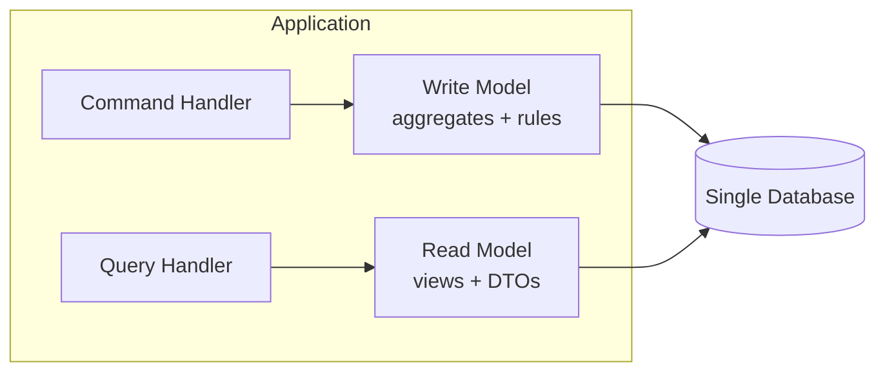
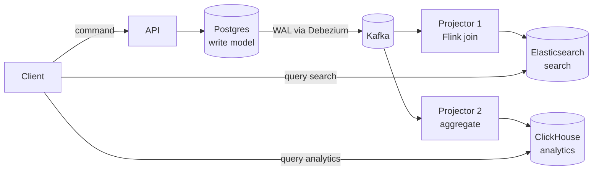
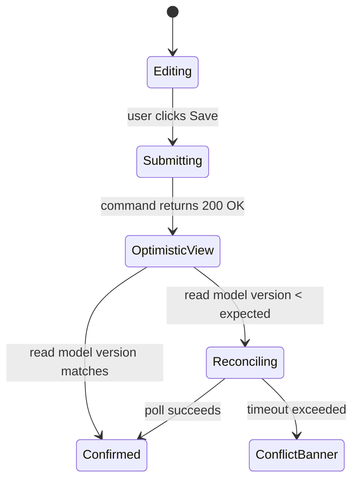
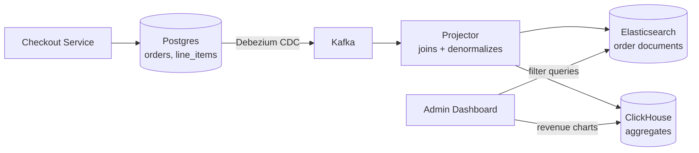

# CQRS: Separating Reads from Writes Without Losing Your Mind

> **TL;DR**: CQRS means using a different model to update data than the model you use to read it[^1]. In its mild form, you split command and query code paths against the same database. In its strong form, writes land in an OLTP store and one or more read stores (Elasticsearch, Redis, ClickHouse) are kept in sync asynchronously via CDC or events. GitHub serves 5.5 million queries per second across 1,200+ MySQL hosts by partitioning reads from writes at the schema-domain level[^2]. The pattern earns its complexity only when read and write shapes genuinely diverge. Greg Young is explicit: "CQRS is not an architecture" but "an architectural pattern" that "describe[s] something inside a single system or component" - apply it inside a bounded context, not across a whole system[^3].

## Learning Objectives

After this module, you will be able to:

- [ ] Explain CQRS beyond the buzzword and distinguish mild from strong forms
- [ ] Decide when the cost of two models is worth the benefit
- [ ] Design projection pipelines from writes to read stores
- [ ] Handle eventual consistency in the UI (read-your-writes, stale indicators)
- [ ] Avoid common CQRS anti-patterns

## Intuition

You run a restaurant. The kitchen has a ticket rail where cooks read orders. The dining room has a menu board where guests browse what is available tonight.

The ticket rail is optimized for speed and correctness: each ticket names one table, lists dishes in prep order, and tracks modifications ("no onions, extra sauce"). It is ugly, abbreviated, and only cooks can read it.

The menu board is optimized for browsing: dishes grouped by course, photos, allergen icons, wine pairings. It is beautiful, denormalized, and updated once per evening. Nobody would hand a guest a kitchen ticket. Nobody would ask a cook to plate food from the menu board.

That is CQRS. The write model (kitchen tickets) is shaped for enforcing business rules: "this table ordered the prix fixe, so they cannot add a la carte mains." The read model (menu board) is shaped for the consumer's query: "show me all gluten-free entrees under $30." Forcing both jobs into one schema is like printing the menu on kitchen tickets. It works when the restaurant is small. It collapses when you have 200 covers and a 15-page wine list.

[Event-Driven Architecture](./01-event-driven-architecture.md) introduced the transport primitives that connect producers to consumers asynchronously. This chapter builds on that foundation to show how you split the models those events connect.

## Theory

### The core idea: commands, queries, two models

A **command** expresses intent to change state: `PlaceOrder`, `CancelReservation`, `RateProduct`. It is handled by a write model that validates business rules against a rich domain aggregate[^4]. A **query** returns a DTO shaped for the caller and never mutates state: `GetOrderSummary`, `SearchProducts`, `ListRecentActivity`[^4].

The insight is that these two jobs want different data shapes. The write model needs normalization, foreign keys, and constraints to enforce invariants. The read model needs denormalization, pre-joined documents, and indexes tuned for the access pattern. Forcing both through one schema creates lock contention, complex joins on OLTP, and security concerns when one entity handles both sides[^4].

CQRS pushes Meyer's method-level Command Query Separation (CQS) outward to whole models and sometimes whole stores[^1]. The two sides can share a database, use different ORMs against the same database, or live in completely separate stores synchronized by events.

### Mild CQRS: one store, two models

In mild CQRS, commands and queries share the same database but use different code paths, DTOs, and repositories. No asynchronous pipeline is required.

The write side loads an aggregate, applies business logic, and persists through a repository. The read side uses separate query objects mapped to SQL views or denormalized projections in the same database, bypassing the domain model entirely[^4].

*Mild CQRS splits code paths but shares the database. No eventual consistency, no broker, no projector.*

**When mild CQRS is enough:**

- Complex domain logic where query shapes differ from write shapes
- Task-based UIs with intent-named commands (`BookRoom`, not `SetStatus`)
- Teams that want cleaner separation of concerns without infrastructure overhead

The trade-off: you still share database I/O, buffer pool, and connection budget across reads and writes. If read load is crushing the primary, mild CQRS alone will not save you.

### Strong CQRS: separate stores, asynchronous projection

In strong CQRS, the write model persists to one store (Postgres, DynamoDB) and one or more read stores (Elasticsearch, Redis, ClickHouse) are kept up to date asynchronously through events or change data capture.

*Strong CQRS: writes land in Postgres; CDC streams changes through Kafka; two projectors build a search index and an analytics store with independent lag budgets.*

The write side publishes events after commit. A projector (Flink, Kafka Streams, a custom consumer) materializes each read store. [Change Data Capture](../part-4-data-systems/04-change-data-capture.md) covers the mechanics of Debezium, WAL streaming, and the transactional outbox pattern that avoids dual-write hazards.

**Key operational concerns:**

- You cannot enlist a message broker and a database into a single distributed transaction. Use the transactional outbox or CDC to avoid dual writes[^4].
- Each projector must persist its offset atomically with the read-model update, or use idempotent writes keyed on event ID.
- Full rebuilds require the event log to be retained long enough (or snapshotted) that starting from offset zero is feasible.

### CQRS and event sourcing: orthogonal patterns

CQRS separates read and write models. Event sourcing stores state as an immutable append-only log of events. They are orthogonal patterns that are frequently combined but neither requires the other[^1][^3].

**CQRS without event sourcing** looks like: write to Postgres, CDC-stream changes via Debezium to Kafka, project to Elasticsearch for search. No event store, no aggregates reconstructed from event history. This is widely considered the most common production deployment of CQRS.

**Event sourcing without CQRS** looks like: append events to an event store, reconstruct aggregates by folding events at read time, serve reads from the same aggregates. This works until query-by-non-key becomes expensive, which is why the combination is so common.

**CQRS + event sourcing** gives you full history, replayable projections, and the ability to build new read models retroactively by replaying the log. But it is maximum complexity. [Event Sourcing](./03-event-sourcing.md) covers this combination in depth.

> [!IMPORTANT]
> Do not adopt event sourcing just because you adopted CQRS. Most teams that benefit from CQRS use a traditional relational write store and CDC. Event sourcing adds value only when full audit history or retroactive projections are hard requirements.

### Eventual consistency as a UX problem

With separate stores, reads can lag writes by milliseconds to seconds. The system must either mask the lag or surface it honestly.

The classic failure: user submits a form, the command succeeds, the read model has not caught up, the user's next page load shows old data, and the user re-submits. This is not a theoretical concern. It is a frequent source of CQRS bug reports in production.

*The UI walks through submitting, optimistic-rendered, and confirmed states so users never see a "my change disappeared" window.*

**Practical mitigations:**

- **Read-your-writes for the acting user.** Route the writer's immediate next read back to the write side, or cache the command response client-side.
- **Optimistic UI.** Render the expected state immediately on the client. Reconcile when the read model catches up.
- **Version numbers.** Return a version with the write response. The client polls the read model until it sees that version (or times out).
- **Lag-aware routing.** Vitess routes replica reads only to replicas below a configured lag threshold so applications do not see wildly stale data[^5].
- **Honest indicators.** For dashboards that refresh every 10 seconds, users do not notice sub-second lag. Show "last updated 3s ago" and move on.

## Real-World Example

### GitHub: 5.5 million QPS across 1,200+ MySQL hosts

GitHub's architecture is a textbook example of mild-to-moderate CQRS applied pragmatically. The platform grew from a single `mysql1` cluster handling 950,000 QPS in 2019 to 1,200+ MySQL hosts across 50+ clusters serving 5.5 million QPS by 2023[^2].

The CQRS-like separation works at two levels:

**Read/write split via ProxySQL and freno.** ProxySQL routes reads to replicas and writes to primaries. `freno`, a cooperative throttling service (HA via Raft), polls replica lag continuously and returns 200/throttle decisions to bulk write jobs so replicas never fall behind user-visible thresholds. Roughly 30% of read traffic is rerouted from the primary to replicas[^2].

**Schema domains as bounded contexts.** Instead of hash sharding, GitHub groups tables by logical domain (repositories, issues, users) and moves each domain to its own cluster once SQL linters prove no cross-domain joins or transactions remain[^2]. This is mild CQRS at the infrastructure level: each domain's write path is isolated, and read-heavy domains get dedicated replica capacity without pressuring the write primary.

**Key engineering decisions:**

- Invested in tooling (gh-ost for triggerless migrations, orchestrator for 10-13 second Raft-backed failover) for five years before partitioning, so migrations were low-risk.
- Partitioned by logical domain rather than by load, preserving transactional consistency within domains.
- Chose not to migrate off MySQL. The economics of rewriting Rails query patterns were worse than investing in MySQL tooling.

The lesson: you do not need a broker, projectors, and Elasticsearch to get CQRS benefits. Separating read and write paths at the database routing layer, with domain-aligned clusters, delivers most of the scaling wins with a fraction of the operational complexity.

## Trade-offs

| Approach | Pros | Cons | Best when | Our Pick |
|----------|------|------|-----------|----------|
| No CQRS (traditional CRUD) | Simple, strong consistency, one schema | Reads and writes compete for same buffer pool | Most CRUD apps, simple domains | Start here; leave when it hurts |
| Mild CQRS (same DB, two models) | Cleaner code, no async pipeline, no eventual-consistency surprises | Still shares DB I/O and connection budget | Complex domain logic, task-based UIs | **Default first step** when shapes diverge |
| Strong CQRS (separate stores, CDC) | Independent scaling, per-store engine choice, multiple read formats | Eventual consistency, broker + projector + monitoring overhead | Heavy read asymmetry (100:1+), search/reporting pressure on OLTP | When read replicas are not enough |
| CQRS + Event Sourcing | Full audit log, replayable history, new projections by replay | Maximum complexity; schema evolution through upcasters | Audit-heavy, financial, regulated domains | Only when replay/audit is a hard requirement |

## Common Pitfalls

> [!WARNING]
> **Applying CQRS globally instead of per bounded context.** Teams split commands and queries across the entire application without discipline, then discover the system is twice as much code with no scaling benefit. Greg Young warns that architectural patterns like CQRS "are not good to apply everywhere" and that CQRS "describe[s] something inside a single system or component"[^3]. Apply it only where read and write shapes genuinely diverge.

> [!WARNING]
> **Querying the write model from the UI.** UI code reads directly from the transactional write store, bypassing the projection. The read store goes out of sync, bugs are blamed on the projection, and the read store's query shape is never validated. Enforce architectural boundaries so the write-side database is not reachable from the read API.

> [!WARNING]
> **Dual writes instead of CDC.** Application writes to Postgres, then also writes to Elasticsearch directly. The second write fails, the read model is inconsistent, and there is no rollback. Capture changes from the transaction log via CDC or use the transactional outbox pattern. See [Change Data Capture](../part-4-data-systems/04-change-data-capture.md) for the full treatment.

> [!WARNING]
> **Too many projections on day one.** Each team adds a new read model because projections look cheap to add. Maintaining, backfilling, and rebuilding all of them becomes a full-time job. Start with one read model. Add the second when you have evidence the first cannot serve both use cases.

> [!WARNING]
> **Ignoring projector failure recovery.** A projector crashes. On restart, it either skips events (data loss) or re-processes from the beginning (duplicates). Persist offsets atomically with the read-model update, or use idempotent writes keyed on event ID. Replay from last stored offset is the canonical recovery path.

## Exercise

Design the read side of an e-commerce admin dashboard that queries 50M orders with 20 filter combinations, while the OLTP side handles checkout at 5,000 writes/sec. Decide between read replicas, a projected Elasticsearch index, and a ClickHouse warehouse. Specify lag tolerance and consistency UX.

Hint

Consider the query shapes: are admin dashboard queries (date ranges, status filters, aggregations) compatible with the OLTP schema optimized for single-order checkout? Think about whether read replicas can handle 20 filter combinations across 50M rows without full table scans. What lag can an admin tolerate that a checkout customer cannot?

Solution

**Decision: Strong CQRS with Elasticsearch as the primary read store, ClickHouse for aggregations.**

**Why not read replicas alone?** The OLTP schema is normalized for checkout (orders, line_items, payments as separate tables). Admin queries need 20 filter combinations across denormalized order documents. Joining three tables with arbitrary WHERE clauses across 50M rows causes full scans on replicas, degrading replication lag and impacting checkout reads that share those replicas.

**Architecture:**

**Lag tolerance:** Admin users tolerate 5-10 seconds of lag. Show "Data as of 3s ago" in the dashboard header. For the rare case where an admin needs to see an order they just modified, route that single-order lookup to Postgres directly (read-your-writes exception).

**Projection design:** The projector consumes CDC events from `orders`, `line_items`, and `payments` topics, joins them by `order_id`, and upserts a denormalized document into Elasticsearch. A second projection aggregates daily revenue into ClickHouse for time-series charts.

**Trade-off accepted:** Two additional stores (Elasticsearch + ClickHouse) plus a projector to maintain. Justified because the alternative (forcing 20-filter queries onto the OLTP primary or its replicas) would require expensive composite indexes that slow checkout writes.

## Key Takeaways

- CQRS means different models for reads and writes. It is a spectrum from mild (same DB, split code) to strong (separate stores, async projection).
- Most teams should start with mild CQRS or stay with CRUD. Strong CQRS earns its complexity only when read/write shapes genuinely diverge and read replicas cannot keep up.
- Eventual consistency is a UX problem, not just a theoretical one. Solve it with optimistic UI, version polling, and read-your-writes for the acting user.
- CQRS does not require event sourcing. The most common production deployment is CQRS with a relational write store and CDC-fed projections.
- Projections are cheap to add and hard to remove. Start with one. Budget ownership and retirement.
- Apply CQRS per bounded context, not globally. If you cannot articulate why your read and write patterns differ for a specific subsystem, you do not need it there.
- The dual-write bug is the silent killer. Always use CDC or the transactional outbox to feed read stores.

## Further Reading

- [CQRS](https://martinfowler.com/bliki/CQRS.html) by Martin Fowler - The definitional essay; short, opinionated, and honest about when CQRS makes things worse. Read this first.
- [Greg Young's CQRS Documents (2010 PDF)](https://cqrs.files.wordpress.com/2010/11/cqrs_documents.pdf) - The originating technical write-up that formalized the pattern and distinguished it from CQS.
- [Clarified CQRS](http://udidahan.com/2009/12/09/clarified-cqrs/) by Udi Dahan - The 2009 essay that separates CQRS from event sourcing and from SOA; essential for avoiding conflation.
- [CQRS Pattern - Azure Architecture Center](https://learn.microsoft.com/en-us/azure/architecture/patterns/cqrs) - Microsoft's reference guide with example code, trade-off tables, and implementation guidance for both mild and strong forms.
- [CQRS and Stream Processing](https://streamkap.com/resources-and-guides/cqrs-stream-processing/) by Streamkap - Concrete pipeline patterns with CDC and Flink; shows how to build projections with streaming SQL.
- [GitHub: Scaling MySQL from One Database to 1,200+ Hosts](https://sujeet.pro/articles/github-mysql-migration) - Deep dive into GitHub's schema-domain partitioning, freno throttling, and read/write separation at scale.
- [Scaling Event Sourcing for Netflix Downloads, Episode 2](https://netflixtechblog.com/scaling-event-sourcing-for-netflix-downloads-episode-2-ce1b54d46eec) - Netflix's production CQRS + ES system for downloads licensing; shows the pattern in a regulated domain.
- [An introduction to Monzo's data stack](https://monzo.com/blog/2021/10/14/an-introduction-to-monzos-data-stack) - Monzo's event-firehose to BigQuery projection pipeline; strong CQRS at organizational scale with centralized data management via Kafka, NSQ, and dbt.

## Flashcards

**Q:** What is the core claim of CQRS?
**A:** The model used to update data should be different from the model used to read it. Commands change state through a write model; queries return DTOs from a read model. The two can share a database or live in separate stores.

**Q:** What distinguishes mild CQRS from strong CQRS?
**A:** Mild CQRS splits command and query code paths against the same database (no eventual consistency). Strong CQRS uses separate read stores (Elasticsearch, Redis, ClickHouse) synchronized asynchronously via events or CDC, introducing eventual consistency.

**Q:** Does CQRS require event sourcing?
**A:** No. They are orthogonal patterns frequently combined but neither requires the other. The most common CQRS deployment uses a relational write store with CDC-fed projections, no event store involved.

**Q:** What is the most common production failure mode of strong CQRS?
**A:** Eventual consistency bugs in the UI. User submits a form, command succeeds, read model has not caught up, next page load shows old data, user re-submits. Fix with optimistic UI, version polling, or read-your-writes routing.

**Q:** When is CQRS overkill?
**A:** Simple CRUD apps where read and write shapes are identical, small teams without platform engineering capacity for brokers and projectors, and domains where strict read-after-write is required everywhere.

**Q:** What is the dual-write problem in the context of CQRS projections?
**A:** Writing to the primary database and then separately writing to the read store. If the process crashes between the two, the read model permanently diverges. Fix with CDC from the transaction log or the transactional outbox pattern.

**Q:** How do you handle projector crash recovery?
**A:** Persist the consumer offset atomically with the read-model update (or use idempotent writes keyed on event ID). On restart, replay from the last stored offset. For full rebuilds, retain the event log long enough to replay from offset zero.

**Q:** What did Greg Young mean by "CQRS is not an architecture"?
**A:** CQRS is an architectural pattern that describes something inside a single system or component, not a system-wide architectural style. Apply it only to subsystems where read and write shapes genuinely diverge. Keep CRUD everywhere else.

**Q:** How does GitHub achieve CQRS-like benefits without a broker or projectors?
**A:** Schema-domain partitioning groups tables by logical domain (repositories, issues, users) into separate MySQL clusters. ProxySQL routes reads to replicas and writes to primaries. freno throttles bulk writes to keep replica lag below user-visible thresholds.

**Q:** What is a projection pipeline in strong CQRS?
**A:** A dedicated process (projector) that consumes events from a broker (Kafka), transforms them (joins, denormalizes, aggregates), and writes the result into a read store (Elasticsearch, ClickHouse). Each projector tracks its own offset and can be rebuilt by replaying from offset zero.

**Q:** Name three mitigations for eventual consistency in the UI.
**A:** (1) Read-your-writes: route the acting user's next read to the write side or a cached response. (2) Optimistic UI: render the expected state immediately, reconcile when the read model catches up. (3) Version polling: return a version number with the write, poll the read model until it matches.

## References

[^1]: Martin Fowler, "CQRS", July 14 2011. https://martinfowler.com/bliki/CQRS.html
[^2]: Sujeet Jaiswal, "GitHub: Scaling MySQL from One Database to 1,200+ Hosts", sujeet.pro, April 21 2026. https://sujeet.pro/articles/github-mysql-migration
[^3]: Greg Young, "CQRS is not an Architecture", September 9 2012. https://gregfyoung.wordpress.com/2012/09/09/cqrs-is-not-an-architecture/
[^4]: Microsoft, "CQRS Pattern - Azure Architecture Center", updated February 2025. https://learn.microsoft.com/en-us/azure/architecture/patterns/cqrs
[^5]: Vitess docs, "Read Query Load Balancing". https://vitess.io/docs/user-guides/configuration-advanced/query-load-balancing/
