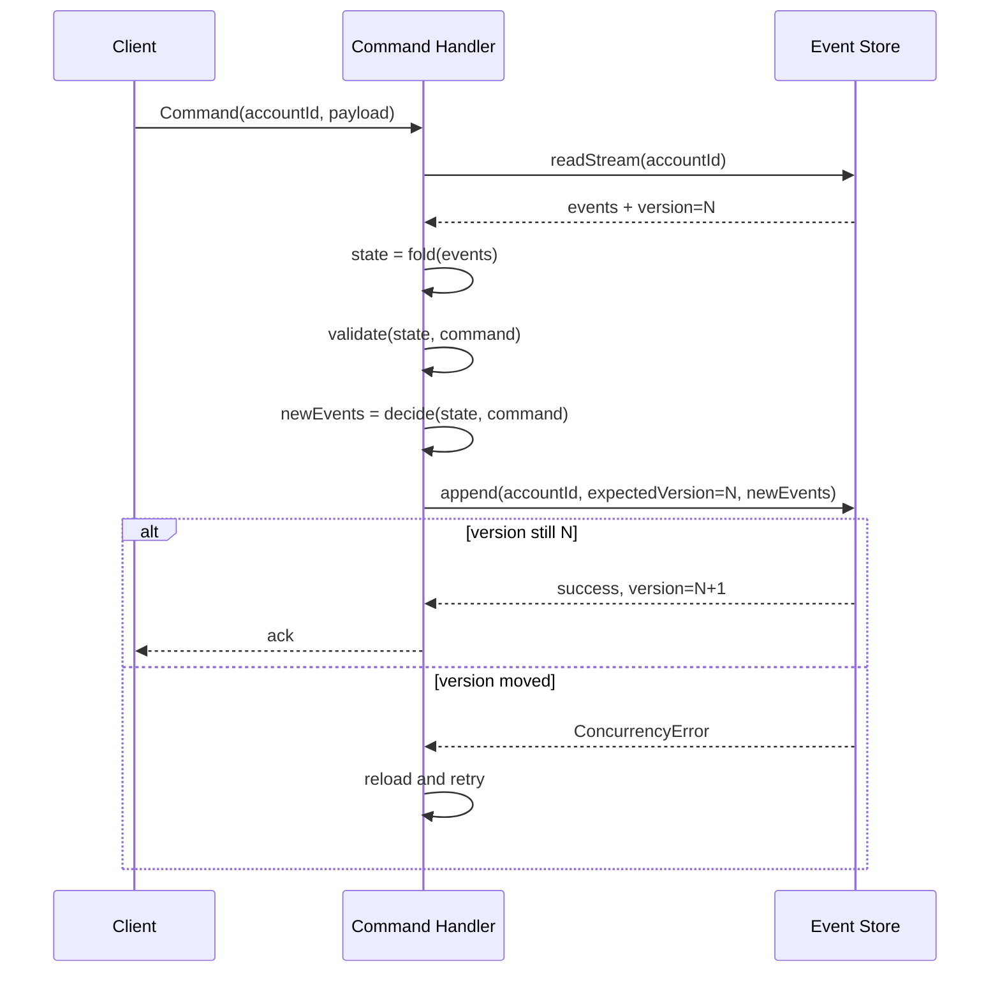
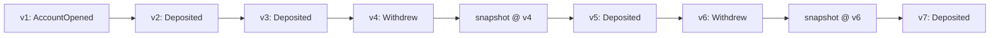
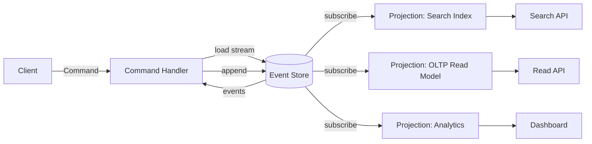
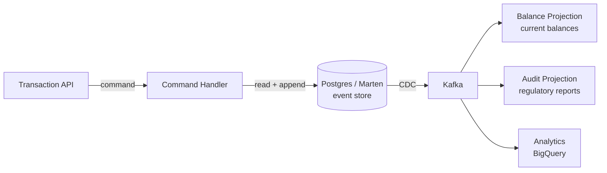

# Event Sourcing: Events as the Source of Truth

> **TL;DR**: Event sourcing stores every change to application state as an immutable, time-ordered event in an append-only log. Current state is not a row in a table but the left fold over that entity's event stream[^1]. You gain a perfect audit trail, time travel, and the ability to add new read models retroactively by replaying history. You pay with schema-evolution discipline, replay costs at scale, and a learning curve that has sunk ambitious teams. Microsoft's Azure Architecture Center warns that event sourcing is "a complex pattern that introduces significant trade-offs... costly to migrate to or from"[^2]. Use it when audit, temporal queries, and analytical flexibility justify the commitment. For everything else, keep your relational database.

## Learning Objectives

After this module, you will be able to:

- [ ] Model a domain as events rather than state mutations
- [ ] Design aggregates, event streams, and projections
- [ ] Use snapshots to keep replay time bounded
- [ ] Evolve event schemas without breaking replay
- [ ] Decide when event sourcing is worth the complexity

## Intuition

You work at a bank. The bank has a ledger. Every time money moves, a clerk writes a line: "March 3, deposited $500 into account 4421." The clerk never erases a line. If a mistake happens, the clerk writes a new line: "March 4, reversed deposit of $500 from account 4421." The balance is not stored anywhere. It is computed by reading the ledger from top to bottom and summing.

Now a regulator walks in and asks: "What was the balance of account 4421 at 14:02 on March 3rd?" With a traditional database that stores only the current balance, you cannot answer. The old value was overwritten. With the ledger, you replay entries up to that timestamp and compute the answer.

That is event sourcing. Your database is the ledger. Each line is an event. The "current balance" is a derived view, computed by folding events. You never mutate history. You never lose information.

The cost is real. The ledger grows forever. Reading it from the top every time a customer checks their balance is slow. You need periodic summaries (snapshots). When the format of a ledger entry changes, every old entry must still be readable. And when a customer invokes their right to be forgotten, you face a tension: the ledger is immutable, but the law says delete.

[Event-Driven Architecture](./01-event-driven-architecture.md) introduced events as a communication mechanism between services. [CQRS](./02-cqrs.md) showed how to separate read and write models. This chapter takes the next step: events become the database itself.

## Theory

### The core model: events as facts, state as fold

An event is an immutable record of something that happened in the past, named in past tense: `AccountOpened`, `FundsDeposited`, `OrderShipped`. It is not a command ("please deposit") and not a diff ("balance changed from 100 to 600"). It captures business intent[^2].

The state of an entity is computed by a pure function:

```text
state = fold(evolve, initial, events)
```

Where `evolve(state, event)` applies one event to produce the next state, and `initial` is the empty starting value. This is a left fold. The fold function is deterministic: given the same events in the same order, you always get the same state.

Three invariants hold across all credible implementations:

1. **Events are immutable.** Once appended, they are never modified or deleted.
2. **Writes are append-only** with optimistic concurrency on the stream's expected version.
3. **State is always reconstructible by replay.** Snapshots are an optimization, never the source of truth[^2].

### Aggregates and optimistic concurrency

An aggregate is a cluster of domain objects treated as a single unit for consistency. In event sourcing, each aggregate instance owns one event stream, typically keyed by aggregate ID[^2].

The command-handling flow:

1. Load the aggregate's stream from the event store.
2. Fold events to rebuild current state.
3. Validate the incoming command against that state.
4. Emit new events (the decision).
5. Append new events with `expectedVersion = lastSeenVersion`.

If a concurrent writer appended first, the store rejects the write with a concurrency error. The handler reloads and retries. This is standard optimistic concurrency control, and it is the entire consistency mechanism[^3].



*Expected-version on append turns concurrent writers into retryable conflicts rather than silent corruption.*

Per-aggregate consistency means you never need distributed locks for single-aggregate operations. Streams naturally partition by aggregate ID for horizontal scaling. The trade-off: cross-aggregate invariants require sagas or process managers, which are significantly harder. See [Distributed Transactions](../part-3-distributed-systems-theory/06-distributed-transactions.md) for the saga pattern.

### The event store interface

A minimum event-store API exposes three operations[^2]:

```typescript
interface EventStore {
  appendToStream(streamId: string, expectedVersion: number, events: Event[]): void;
  readStream(streamId: string, fromVersion: number, maxCount: number): Event[];
  subscribe(fromPosition: number): AsyncIterator<Event>;
}
```

**Purpose-built stores** (EventStoreDB/Kurrent, Axon Server, Marten on Postgres) ship these primitives with optimistic concurrency built in. Marten layers the semantics over Postgres using a `UNIQUE (stream_id, version)` constraint and `jsonb` payloads[^3]. Equinox supports EventStoreDB, CosmosDB, DynamoDB, Postgres (MessageDB), and SqlStreamStore behind a single programming model, with its CosmosStore satisfying typical loads with a single 1.0-RU point read[^4].

**Kafka as event store** is a common trap. Kafka lacks per-aggregate query and expected-version append. Two services reading version 5 for the same aggregate can both write version 6, and both succeed, because Kafka has no optimistic concurrency control[^5]. Kafka works well as a downstream distribution layer for events after they are committed to a proper event store. It is not a substitute for one.

> [!WARNING]
> **Kafka is not an event store.** If you need per-aggregate concurrency control, use a purpose-built event store or a relational database with a `UNIQUE (stream_id, version)` constraint. Route all commands for an aggregate through a single writer, or add an external version check. Kafka's append-only log looks similar but lacks the critical `expectedVersion` guarantee.

### Snapshots

Replaying an aggregate's entire event stream on every command becomes expensive as streams grow. A snapshot is a serialized representation of an aggregate's state at a specific stream position[^6].

On load, the handler reads the most recent snapshot, hydrates state from it, then applies only the events after that position. Axon Framework lets you compose snapshot triggers: fire after N events applied, or when sourcing time exceeds a threshold (for example, 500 ms), whichever comes first[^6].



*Snapshots mark state checkpoints so aggregate load only replays events after the latest snapshot, bounding command latency.*

Key rules for snapshots:

- **They are always an optimization, never the source of truth.** If a snapshot is incompatible or corrupted, the system falls back to full event replay[^6].
- **Invalidate on schema change.** A snapshot that encodes stale business rules becomes a silent bug when the domain model evolves.
- **Tune frequency by measurement.** Too frequent wastes storage; too rare means slow loads. Axon's documentation shows composing policies such as triggering after 5 events or when sourcing time exceeds 500 ms[^6].

### Schema evolution

Because events live forever, any change in event payload or semantics must remain readable by the fold function decades later. This is the hardest operational challenge in event sourcing.

Greg Young's *Versioning in an Event Sourced System* catalogues the strategies[^7]. The main techniques:

1. **Tolerant deserialization.** Consumers ignore unknown fields and default missing ones. Works for additive changes only.
2. **Upcasting.** A middleware between deserialization and domain logic lifts `EventV1` to `EventV2` on load, so the domain only sees the newest shape[^2]. Upcasters localize compatibility code in one place.
3. **New event type.** Introduce `OrderPlacedV2` and keep the old handler forever. Adam Warski notes: code to handle old event types "needs to remain forever" unless streams are rewritten[^3].
4. **Copy-and-transform.** Migrate events to a new stream in the new shape, preserving the original as archive. This is a last resort because it breaks stream identity.

Strong schema registries (Avro or Protobuf with Confluent Schema Registry) enforce compatibility at ingest time. Weak JSON payloads defer the check to runtime. Oskar Dudycz's practical advice: "the best option for versioning the event schema is to prevent conditions in which versioning is needed" by keeping aggregates short-lived so old shapes retire naturally[^8].

> [!TIP]
> Design events with evolution in mind from day one. Use optional fields, avoid enums that cannot grow, and name events with business verbs (`SeatsReserved`) rather than CRUD labels (`SeatsUpdated`). The more semantic your events, the less often you need to version them.

### Projections and read models

A projection is a denormalized view of one or more event streams, computed by a projector that subscribes to the event feed and folds events into whatever shape a query needs[^2].

Projectors pair naturally with CQRS: the write side owns events, the read side owns projections optimized for queries. Multiple projections can coexist over the same stream, each for a different access pattern (search index, OLTP table, dashboard aggregate).



*The write path captures commands as events; projections are eventually-consistent read models derived from the event stream.*

**Rebuilding a projection is a first-class operation:** drop the output, reset the offset to zero, replay every event idempotently. This is how you add new read models retroactively, answering questions nobody thought to ask when the events were written.

The catch: projection handlers must be idempotent. At-least-once delivery is inherent in almost every event-delivery stack. [Idempotency and Exactly-Once](../part-3-distributed-systems-theory/07-idempotency-exactly-once.md) covers the mechanics of deduplication and idempotent writes.

For billions of events, a full projection rebuild can take hours to days. Mitigations include sharded projectors (parallel consumers keyed by stream ID), pre-warmed projection fleets, and treating rebuilds as planned operational events rather than emergencies.

### Operational reality: growth and erasure

An append-only log grows forever. Disk growth is managed by tiered storage: old events move to cheaper media (S3, Glacier) while projections keep serving queries.

The harder problem is regulatory erasure. GDPR's "right to be forgotten" conflicts directly with immutability. Three approaches exist:

- **Keep PII out of events.** Reference personal data by opaque ID from a separate, deletable store.
- **Crypto-shredding.** Encrypt sensitive attributes with a per-subject key. When erasure is required, delete the key. The events remain but are unreadable[^9].
- **Tombstone events.** Signal logical deletion without rewriting history.

Mathias Verraes describes crypto-shredding as the pragmatic production technique, but flags a legal complication: under GDPR, encrypted personal data is still personal data. Crypto-shredding may not satisfy every regulator on its own[^9]. The safest path is storing PII outside the event store entirely, referenced by an opaque identifier that can be deleted independently.

## Real-World Example

### Monzo: the double-entry event-sourced ledger

Monzo, the UK digital bank, runs its core ledger as a double-entry event-sourced system inside a microservices estate that had grown to over 2,800 services by 2024[^10]. Every money movement writes an equal and opposite pair of entries, called an `EntrySet`, into `service.ledger`[^11].

Each entry lives at an address (namespace + name + legal entity + currency + account ID) and carries two timestamps: `committed` (when stored) and `reporting` (when it has accounting impact). Balances are computed by summing entries for a given address and time axis. "Customer-facing balance" and "interest chargeable balance" are separate named balance definitions that project over the same entry log[^11].

**Key engineering decisions:**

- Double-entry invariants are enforced at the `EntrySet` level inside one microservice, keeping the ledger as a single consistency boundary.
- Named balance definitions are hard-coded, versioned config. Calling `/balances` with a name returns a consistent answer across backend and data warehouse.
- Upstream, as of 2021, most data flows as events through Kafka and NSQ into BigQuery. Data teams build dbt models on top, treating the event stream as the source of truth for analytics[^12].

This architecture answers the regulator's question ("what was this balance at 14:02 on March 3rd?") by replaying entries up to that timestamp. No separate audit system is needed because the ledger is the audit trail.

## Trade-offs

| Approach | Pros | Cons | Best when | Our Pick |
|----------|------|------|-----------|----------|
| Classical state storage (CRUD) | Simple, fast, familiar; SQL works out of the box | No audit trail, no time travel, lossy updates | Most systems; the default | Start here unless you have a hard audit requirement |
| Full event sourcing | Perfect history, flexible projections, temporal queries | Complex, eventual consistency, schema-evolution pain, replay costs | Audit-heavy domains where analytical flexibility justifies complexity | **Banking, healthcare, trading** |
| Event sourcing + CQRS | Max flexibility; read and write scale independently | Max complexity; two models to evolve | Financial, regulated, or process-heavy domains | When you need both full history and multiple read shapes |

## Common Pitfalls

> [!WARNING]
> **Kafka used as the authoritative event store.** Kafka has no `expectedVersion` check on append, no per-aggregate query API, and log compaction retains only the latest value per key, which is catastrophic for event sourcing. Two writers at version 5 can both commit version 6 without conflict, and `retention.ms` defaults silently drop historical events. Conduktor documents all three failure modes verbatim[^5]. Use Kafka as the downstream distribution layer; put the authoritative log behind a proper event store (EventStoreDB, Marten on Postgres, or a `UNIQUE (stream_id, version)` constraint on a relational table).

> [!WARNING]
> **Events that describe CRUD diffs.** Events like `UserUpdated` with a before/after diff reduce the event log to a slow change log without business meaning. Name events with business verbs in past tense (`CustomerMovedHome`, `OrderShipped`). Microsoft's guidance: "an event that records two seats were reserved is more valuable than an event that records remaining seats changed to 42"[^2].

> [!WARNING]
> **Using the event store as an application database.** Developers run ad-hoc queries against the event store instead of projections, coupling themselves to internal event shapes. Treat the event store as write-only and replay-source. Projections are the query surface.

> [!WARNING]
> **Ignoring idempotency in projection handlers.** A duplicate event increments a counter twice or sends two notifications. At-least-once delivery is inherent in almost every stack. Track last-processed event sequence per consumer and skip duplicates, or design mutations to be naturally idempotent.

> [!WARNING]
> **Cross-aggregate invariants without sagas.** You need a rule to hold across two aggregates, but each has its own stream. Recurring distributed locks or "temporary" cross-aggregate reads that quietly became load-bearing are the symptom. Re-draw aggregate boundaries, or use a process manager with compensating events.

> [!WARNING]
> **Projections treated as denormalized copies of the entire database.** Teams copy every field into every projection "just in case." Rebuild times balloon to days. One projection per query pattern. Delete unused projections. Periodically test replay from zero as a drill.

## Exercise

Design the account ledger for a fintech. Requirements: full audit of every balance change, the ability to compute historical balances at any point, and supporting 10k transactions/sec. Choose an event store, design the aggregate boundary, and specify snapshot frequency.

<details>
<summary>Hint</summary>

Consider the write volume per aggregate. At 10k tx/sec across millions of accounts, each individual account stream grows slowly (a few events per day for most users). The hot path is the append, not the replay. Think about which store gives you the `expectedVersion` guarantee at that throughput, and whether you even need frequent snapshots given short per-account streams.

</details>

<details>
<summary>Solution</summary>

**Aggregate boundary:** One stream per account. Each account accumulates events like `FundsDeposited`, `FundsWithdrawn`, `FeeCharged`. The aggregate enforces the invariant: balance must not go negative (or must not exceed overdraft limit).

**Event store choice: Marten on PostgreSQL.**

- At 10k tx/sec globally, individual account streams grow at single-digit events per day for most accounts. The hot accounts (merchants) might see hundreds per day. This is well within Postgres's write capacity with partitioned tables.
- Marten provides `UNIQUE (stream_id, version)` for optimistic concurrency, `jsonb` payloads for flexible event shapes, and built-in snapshot support.
- Alternative: DynamoDB with conditional writes (Equinox's DynamoStore). Better if you need multi-region active-active, but adds operational complexity and a 400 KB item size limit.
- EventStoreDB/Kurrent is purpose-built but introduces a new operational dependency. Justified for larger teams with dedicated platform engineers.

**Snapshot frequency:** Every 50 events per account. Most accounts will never hit this threshold in a year. Hot merchant accounts snapshot roughly daily. The fold function (summing entries) is cheap, so even without snapshots, replaying 50 events takes microseconds.

**Historical balance queries:** Replay the account stream up to the requested timestamp. With short streams and snapshots, this is sub-millisecond for most accounts. For the rare account with thousands of events, the snapshot bounds replay to at most 50 events.

**Architecture:**



**Trade-off accepted:** Postgres is a single-region primary. For multi-region, you would need to shard by account ID or move to DynamoDB global tables. At 10k tx/sec with a single region, Postgres handles this comfortably.

</details>

## Key Takeaways

- Event sourcing stores every state change as an immutable event. Current state is derived by replay, never stored as the source of truth.
- One event stream per aggregate instance. Optimistic concurrency via `expectedVersion` is the entire consistency mechanism.
- Snapshots bound replay time but are never authoritative. If a snapshot is stale or corrupted, fall back to full replay.
- Schema evolution is the hardest operational challenge. Plan for it from day one with tolerant deserialization, upcasters, or versioned event types.
- Projections give you multiple read models from one event stream. Rebuilding a projection by replaying from zero is a first-class operation.
- Kafka is a distribution layer, not an event store. It lacks per-aggregate query and expected-version guarantees.
- GDPR and immutability conflict. Crypto-shredding or storing PII outside the event store are the production workarounds, but neither is legally settled.

## Further Reading

- [Event Sourcing](https://martinfowler.com/eaaDev/EventSourcing.html) by Martin Fowler - The 2005 definition that started it all; still the clearest short explanation of events-as-state.
- [Versioning in an Event Sourced System](https://leanpub.com/esversioning) by Greg Young - The schema-evolution reference; read this before your first production deployment.
- [Event Sourcing pattern - Azure Architecture Center](https://learn.microsoft.com/en-us/azure/architecture/patterns/event-sourcing) - Microsoft's best short reference on trade-offs, versioning, and GDPR handling.
- [Implementing event sourcing using a relational database](https://softwaremill.com/implementing-event-sourcing-using-a-relational-database/) by Adam Warski - Practical Postgres-backed event store with code; proves you do not need a specialized database.
- [Event sourcing with Kafka: patterns and pitfalls](https://conduktor.io/blog/event-sourcing-kafka-patterns-pitfalls) by Conduktor - Why Kafka as an event store bites, with concrete failure scenarios.
- [Eventsourcing Patterns: Crypto-Shredding](https://verraes.net/2019/05/eventsourcing-patterns-throw-away-the-key/) by Mathias Verraes - The GDPR-compatible erasure pattern, including its legal limitations.
- [How we calculate balances](https://monzo.com/blog/2022/02/18/how-we-calculate-balances) by Monzo Engineering - A concrete double-entry event-sourced ledger at scale; shows the pattern in production banking.
- [Jet/Equinox](https://github.com/jet/equinox) - A mature F# library across EventStoreDB, Cosmos, Dynamo, and Postgres with careful RU-cost documentation.

## Flashcards

**Q:** What is the fundamental data model of event sourcing?
**A:** State is not stored directly. Instead, every change is recorded as an immutable event in an append-only log. Current state is computed by folding (replaying) all events for an entity from the beginning.

**Q:** What are the three invariants of event sourcing?
**A:** (1) Events are immutable facts in past tense. (2) Writes are append-only with optimistic concurrency on expected version. (3) State is always reconstructible by replay; snapshots are an optimization, never the source of truth.

**Q:** How does optimistic concurrency work in an event store?
**A:** The command handler reads the stream and notes the current version N. After deciding new events, it appends with `expectedVersion=N`. If another writer incremented the version first, the store rejects the write with a concurrency error. The handler reloads and retries.

**Q:** Why is Kafka not a suitable event store?
**A:** Kafka lacks per-aggregate query (you cannot efficiently read one entity's stream) and has no `expectedVersion` guarantee on append. Two concurrent writers can both succeed writing conflicting events for the same aggregate. Use Kafka as a distribution layer downstream of a proper event store.

**Q:** What is a snapshot in event sourcing and when do you use one?
**A:** A snapshot is a serialized representation of an aggregate's state at a specific stream position. On load, the handler reads the snapshot and replays only events after that position. Use snapshots when streams grow long enough that full replay adds unacceptable latency to command handling.

**Q:** Name three strategies for event schema evolution.
**A:** (1) Tolerant deserialization: ignore unknown fields, default missing ones. (2) Upcasting: a middleware lifts old event shapes to the current version on load. (3) New event type: introduce `OrderPlacedV2` and keep the old handler forever.

**Q:** How do you handle GDPR erasure in an event-sourced system?
**A:** Three approaches: (1) Keep PII out of events entirely, referencing it by opaque ID from a deletable store. (2) Crypto-shredding: encrypt PII with a per-subject key and delete the key when erasure is required. (3) Tombstone events signaling logical deletion. Note: crypto-shredding's legal status under GDPR is not fully settled.

**Q:** What is a projection in event sourcing?
**A:** A projection is a denormalized read model built by a projector that subscribes to the event stream and folds events into a query-optimized shape. Multiple projections can coexist over the same stream. Rebuilding a projection means dropping the output, resetting the offset to zero, and replaying all events idempotently.

**Q:** When should you NOT use event sourcing?
**A:** Simple CRUD domains with no audit requirements, teams new to DDD, fast-iterating domains where schema changes are frequent, systems with strict erasure requirements, and any system where the complexity cost exceeds the audit/temporal-query benefit.

**Q:** What is the relationship between event sourcing and CQRS?
**A:** They are orthogonal patterns frequently combined but neither requires the other. Event sourcing defines how you persist (append-only events). CQRS defines how you separate reads from writes (different models). Combined, events are the write model and projections are the read models.

**Q:** What is the "CRUD events" anti-pattern?
**A:** Naming events like `UserUpdated` with generic before/after diffs instead of business-intent verbs like `CustomerMovedHome`. CRUD-style events lose semantic meaning, making projections harder to build and the event log no more useful than a slow change log.

## References

[^1]: Martin Fowler, "Event Sourcing", December 2005. https://martinfowler.com/eaaDev/EventSourcing.html
[^2]: Microsoft Azure Architecture Center, "Event Sourcing pattern", updated 2026-03-28. https://learn.microsoft.com/en-us/azure/architecture/patterns/event-sourcing
[^3]: Adam Warski, "Implementing event sourcing using a relational database", Softwaremill, 2021. https://softwaremill.com/implementing-event-sourcing-using-a-relational-database/
[^4]: Jet/Equinox README on GitHub. https://github.com/jet/equinox
[^5]: Stéphane Derosiaux, "Event sourcing with Kafka: patterns and pitfalls", Conduktor, 2024-07-03. https://conduktor.io/blog/event-sourcing-kafka-patterns-pitfalls
[^6]: Axon Framework Reference, "Snapshots", AxonIQ. https://docs.axoniq.io/axon-framework-reference/development/tuning/snapshotting/
[^7]: Greg Young, "Versioning in an Event Sourced System", Leanpub. https://leanpub.com/esversioning
[^8]: Oskar Dudycz, "How to (not) do the events versioning?", event-driven.io, 2020. https://event-driven.io/en/how_to_do_event_versioning/
[^9]: Mathias Verraes, "Eventsourcing Patterns: Crypto-Shredding", 13 May 2019. https://verraes.net/2019/05/eventsourcing-patterns-throw-away-the-key/
[^10]: Will Sewell, "How we run migrations across 2,800 microservices", Monzo Engineering, 26 August 2024. https://monzo.com/blog/how-we-run-migrations-across-2800-microservices
[^11]: Basma Taha, "How we calculate balances", Monzo Engineering, 2022-02-18. https://monzo.com/blog/2022/02/18/how-we-calculate-balances
[^12]: Monzo Engineering, "An introduction to Monzo's data stack", 2021-10-14. https://monzo.com/blog/2021/10/14/an-introduction-to-monzos-data-stack
