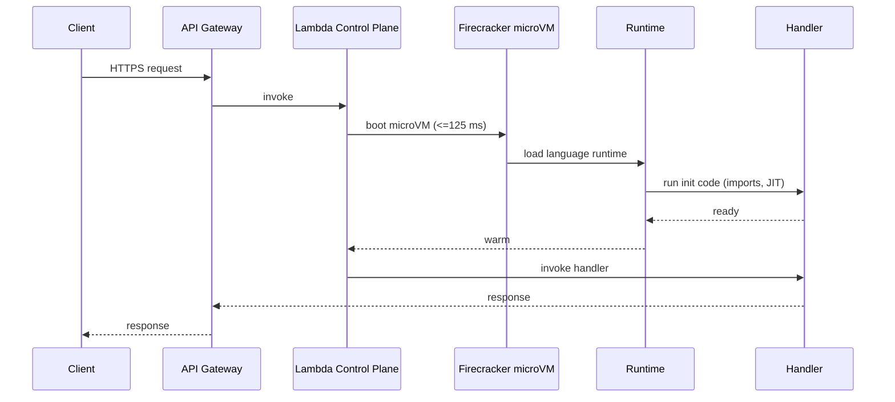
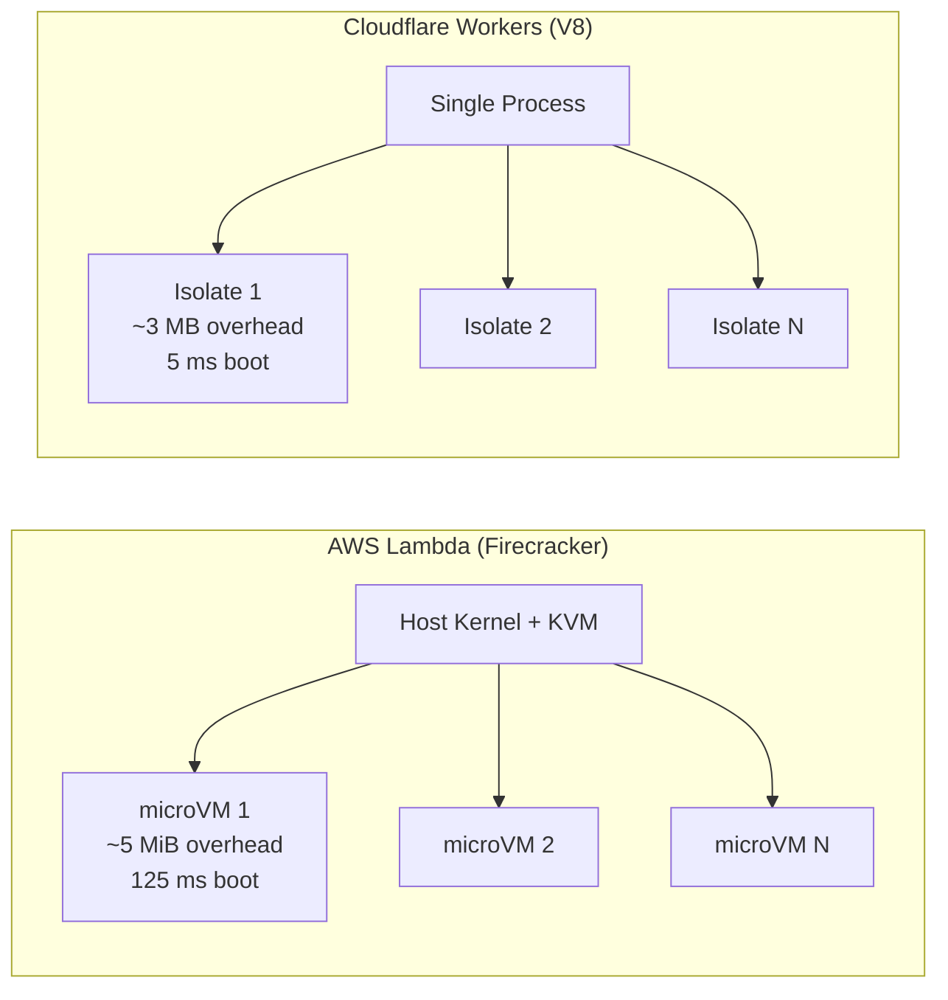
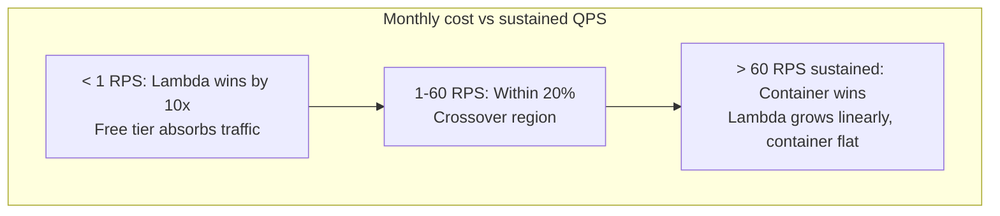
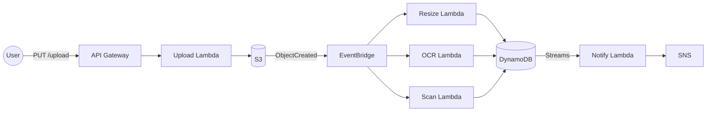

# Serverless: Functions, Cold Starts, and When FaaS Actually Saves Money

> **TL;DR**: Serverless is a billing model, not an absence of servers. You pay per request and per GB-second of execution, nothing when idle. AWS Lambda charges $0.20 per million invocations plus $0.0000166667 per GB-second with 1 ms granularity[^1]. That makes FaaS unbeatable for bursty, event-driven workloads and a quiet money pit above roughly 60 RPS sustained. Cold starts (125 ms for Firecracker microVMs[^2], 5 ms for Cloudflare Workers V8 isolates[^3]) are the latency tax you pay for scale-to-zero. Understand the isolation mechanism, model the economics, and you will know exactly when to reach for Lambda and when to reach for a container.

## Learning Objectives

After this module, you will be able to:

- [ ] Explain cold starts, warm pools, and provisioned concurrency
- [ ] Model the per-request cost of a Lambda function vs a container
- [ ] Design event-driven architectures using Lambda, EventBridge, SQS, and Step Functions
- [ ] Recognize workloads where serverless is a false economy
- [ ] Compare AWS Lambda, Google Cloud Functions, Azure Functions, and Cloudflare Workers

## Intuition

You own a food truck. When a customer walks up, you fire the grill, cook the order, and hand it over. Between customers you turn the grill off. Your gas bill is proportional to orders served. On a slow Tuesday you pay almost nothing. On a festival Saturday you cook non-stop and pay a lot, but you never pay for an empty kitchen.

Now compare that to leasing a restaurant. The rent is due whether you serve 10 meals or 10,000. You get a permanent kitchen (no startup delay), but you pay for every idle hour.

FaaS is the food truck. A container fleet is the restaurant. The food truck wins when demand is spiky and unpredictable. The restaurant wins when you are packed every night. The cold start is the time it takes to fire the grill before the first burger of the day. Provisioned concurrency is paying to keep the grill warm even when no one is ordering.

[Monolith vs Microservices](./00-monolith-vs-microservices.md) introduced the decomposition spectrum. Serverless sits at the far end: each function is a nano-service with zero operational overhead, but the provider's execution model constrains what you can build.

## Theory

### The FaaS execution model

A FaaS platform invokes short-lived, stateless functions in response to events. The provider maintains a pool of pre-initialized execution environments. When an event arrives, the platform routes it to a warm environment if one exists; otherwise it creates a new one (a cold start). State cannot live in the function between invocations because any instance may be recycled at any time. State belongs in managed services like DynamoDB, S3, or Redis.

AWS Lambda defines the shape every competitor followed: memory from 128 MB to 10,240 MB (CPU scales proportionally, 1 vCPU at 1,769 MB), maximum duration of 15 minutes, synchronous payload limit of 6 MB, and a default concurrency ceiling of 1,000 per region[^4]. Google Cloud Functions gen 2 pushes the ceiling to 16 GB RAM, 4 vCPU, 60-minute HTTP timeout, and up to 1,000 concurrent requests per instance[^5]. Azure Functions offers Consumption (scale-to-zero), Premium (pre-warmed instances with VNet integration), and Dedicated plans.

The key constraint: you hand your runtime to the provider. You accept their duration limits, their payload caps, their concurrency model, and their cold-start behavior. In exchange, you get zero capacity planning and zero idle cost.

### Cold starts and warm starts

A cold start is the first-request latency penalty paid when the platform creates a new execution environment. On Lambda, four phases run in series:

*A synchronous API invocation on a cold instance pays four serial costs: microVM boot, runtime init, code init, and handler execution.*

Typical cold-start times vary by language: Node.js 200-400 ms, Python 300-500 ms, Go 100-200 ms, Java 1-3 s (JIT compilation dominates), .NET 1-5 s. AWS's own benchmark shows Java p99.9 cold start of 5,114 ms on demand versus 488 ms with SnapStart[^6].

**Mitigations:**

- **Provisioned Concurrency** keeps N environments pre-initialized at $0.0000041667 per GB-second continuously[^1]. Predictable p99, but you lose scale-to-zero.
- **SnapStart** (Java, re:Invent 2022) snapshots the initialized JVM and resumes from it, cutting Java cold starts by 10x without ongoing cost.
- **Smaller runtimes.** Go and Rust custom runtimes start in under 200 ms because there is no JIT or framework bootstrap.

> [!IMPORTANT]
> Cold starts matter for synchronous APIs with tight p99 SLAs. For async event processing (SQS, Kinesis, S3 triggers), cold starts are usually invisible because the queue absorbs the latency. Size the problem before solving it.

### Isolation: Firecracker microVMs vs V8 isolates

The isolation mechanism determines cold-start floor, memory overhead, and multi-tenant density.

*Firecracker gives each tenant a hardware-isolated VM; V8 isolates share a process but sandbox via the JavaScript engine. The trade-off is security boundary strength versus startup speed.*

**Firecracker** is a minimalist Rust VMM built by AWS: roughly 50,000 lines of Rust versus 1.4 million for QEMU[^2]. It boots a microVM to user-space `/sbin/init` in under 125 ms with VMM memory overhead under 5 MiB. A single host creates up to 150 microVMs per second and runs thousands concurrently. The 125 ms budget is CI-enforced on every Firecracker PR.

**Cloudflare Workers** runs customer code as V8 isolates (the same sandbox that isolates browser tabs). Cold start is around 5 ms (per Cloudflare's 2018 announcement) with around 3 MB memory overhead per isolate[^3]. The trade-off: Workers can only run JavaScript, TypeScript, or WebAssembly-compiled languages. No arbitrary binaries. The Workers Paid plan gives 128 MB memory, 5 min CPU time, and 10,000 subrequests per invocation. Average Worker uses around 2.2 ms CPU per request.

Workers deploys globally to every Cloudflare data center (hundreds of cities across 100+ countries) by default. There is no "home region." This makes it ideal for latency-critical edge logic: A/B routing, auth token validation, request transformation.

### The honest economics

FaaS billing is a fixed per-request fee plus a compute-time fee proportional to allocated memory and duration. There is no idle charge.

**Lambda pricing (us-east-1, x86, 2024):**

- $0.20 per million requests
- $0.0000166667 per GB-second (Arm/Graviton2 is 20% cheaper)
- Duration rounded to nearest 1 ms (changed from 100 ms rounding in December 2020)

**Worked break-even: 1M requests/day at 200 ms, 512 MB**

Lambda: 30M requests/month. Compute = 30M *0.2 s* 0.5 GB = 3,000,000 GB-s. Monthly cost = $6.00 (requests) + $50.00 (compute) = **$56/month**[^1].

Fargate (0.25 vCPU, 512 MB, 24/7): $0.04048/vCPU-hour + $0.004445/GB-hour = roughly $8.89/month per task[^7]. At 11.6 RPS (1M/day), you need multiple tasks to handle the load, landing around **$50-90/month**.

At this traffic level, Lambda and Fargate are within striking distance. The crossover tips above about 5M requests/day sustained (around 60 RPS): Fargate wins because its cost is flat regardless of request count. Below 100,000 requests/day, Lambda wins by 10x because the free tier (1M requests + 400,000 GB-s/month) absorbs most of the bill.

*Lambda cost grows linearly with requests; a container fleet has a step-function cost that is cheaper once utilization exceeds the crossover point.*

### Event triggers and common patterns

The canonical serverless architecture is a pipeline of managed services connected by events:

*An S3 upload fans out to parallel Lambdas via EventBridge and writes to DynamoDB; every arrow is managed, at-least-once delivery.*

Key event sources: API Gateway (synchronous HTTP), SQS (queue-based), S3 (object events), Kinesis (streaming), DynamoDB Streams (change capture), EventBridge (event bus), and scheduled rules (cron). Step Functions orchestrates multi-step workflows with Standard mode ($25/M state transitions, up to 1-year duration) or Express mode (per-execution pricing, 5-minute max).

[Key-Value Stores](../part-4-data-systems/09-key-value-stores.md) covers DynamoDB's data model. The Lambda-DynamoDB pairing is the most common serverless stack because both scale horizontally, both bill per-request, and neither requires capacity planning.

## Real-World Example

### Liberty Mutual: serverless-first at Fortune 100 scale

Liberty Mutual, a Fortune 100 insurer (ranked 77th), adopted a serverless-first posture for its cloud migration. More than 50% of workloads moved to AWS, with Lambda + API Gateway + DynamoDB as the default compute stack[^8].

Matt Coulter, a technical architect at Liberty IT and creator of CDK Patterns, has demonstrated how serverless pipelines are deployed via AWS CDK (Cloud Development Kit). The architecture follows the pattern above: API Gateway receives requests, Lambda functions process business logic, DynamoDB stores state, and S3 holds documents. Infrastructure is defined in TypeScript CDK constructs that teams share as reusable patterns.

The key insight from Liberty Mutual's adoption is organizational, not technical. A regulated insurance company chose FaaS as the default, not the exception. Their reasoning:

- **Day-one deployment.** New projects ship code on the first day because there is no infrastructure to provision.
- **FinOps transparency.** Per-request billing makes cost attribution trivial. Each team sees exactly what their functions cost.
- **Blast radius.** Individual functions fail independently. A bug in document OCR does not take down policy quoting.

The constraint they accepted: vendor lock-in to AWS. Lambda + DynamoDB + Step Functions is the tightest AWS coupling in the catalog. Liberty Mutual priced that risk explicitly and decided the operational savings justified it. Containers remain the escape hatch for workloads that outgrow FaaS economics.

## Trade-offs

| Approach | Pros | Cons | Best when | Our Pick |
|----------|------|------|-----------|----------|
| FaaS (Lambda, Cloud Functions, Azure Functions) | Zero ops; scales to zero; per-request billing; 1 ms granularity | Cold starts; 15-min cap; vendor lock-in | Bursty, event-driven, glue code, infrequent jobs | **Default for event-driven workloads** |
| Containers (ECS Fargate, Cloud Run) | Flexible runtime; predictable latency; no cold starts after warmup | You own capacity planning; pay while idle | Sustained traffic above 60 RPS, stateful, long-running | **Default for steady-state APIs** |
| Edge functions (Cloudflare Workers) | 5 ms cold start; global POPs; CPU-only billing | JS/Wasm only; 128 MB memory; constrained APIs | Latency-critical logic, A/B routing, auth at edge | **Default for edge compute** |
| Traditional VMs / bare metal | Maximum control; any OS; any binary | Maximum ops; patching; capacity planning | Legacy, specialized hardware (GPUs, FPGAs) | Only when nothing else fits |

## Common Pitfalls

> [!WARNING]
> **Cold starts on the synchronous critical path.** Sporadic p99 latencies of 1-10 s on an otherwise 50 ms API. Every new microVM runs your init code. On JVM or .NET, this dominates the critical path. Fix: Provisioned Concurrency for known spikes, SnapStart for Java, or rewrite the hot function in Go/Rust. Do not "keep warm" with scheduled pings; it fights the platform and caps at one warm instance.

> [!WARNING]
> **The "Lambdalith."** Teams port an Express or Spring app unchanged behind a single Lambda with an API Gateway catch-all route. Deploy blast radius is the whole API; one slow endpoint starves every endpoint's concurrency; cold start grows with bundle size. Fix: split into function-per-bounded-context. Extract shared logic to a Lambda Layer rather than packaging it into each function.

> [!WARNING]
> **Recursion through Lambda.** A function writes to an S3 bucket or SQS queue whose events re-invoke the same function. The loop runs until concurrency caps or billing alarms fire. AWS added recursive invocation protection in 2023, but design with idempotency keys and distinct source/sink resources regardless.

> [!WARNING]
> **NAT Gateway as the invisible bill.** Lambda compute costs $15/month; NAT Gateway plus cross-AZ egress costs $400/month. Every byte of egress from a VPC Lambda to the public internet passes through a NAT Gateway at $0.045/GB. Fix: use VPC Gateway Endpoints (free) for S3 and DynamoDB; avoid VPC attachment for Lambdas that only talk to AWS APIs.

> [!WARNING]
> **Sustained load above 60 RPS on Lambda.** The monthly bill quietly eclipses what an equivalent Fargate service would cost. FaaS billing is linear in invocations; containers bill for wall-clock time regardless of load. At high utilization (above 60%), time-based pricing wins. Migrate the hot path to Fargate; keep Lambda for glue, fan-out, and spiky endpoints.

## Exercise

Design an image processing pipeline: users upload photos, you resize to 5 formats, run object detection, and store results. Traffic spikes 100x during product launches. Decide between Lambda, ECS Fargate, and a Kubernetes-based approach. Model the cost at 1M images/month and 50M images/month.

Hint

At 1M images/month, compute is bursty and idle most of the time. At 50M images/month, you are processing roughly 19 images/second sustained. Consider: what is the average duration of a resize operation? An object detection inference? How does that map to GB-seconds on Lambda versus vCPU-hours on Fargate?

Solution

**At 1M images/month (bursty, product-launch spikes):**

Lambda wins decisively. Assume each image triggers 5 resize functions (200 ms each, 512 MB) and 1 detection function (2 s, 3 GB).

- Resize: 5M invocations *0.2 s* 0.5 GB = 500,000 GB-s. Cost = $1.00 (requests) + $8.33 (compute) = $9.33/month.
- Detection: 1M invocations *2 s* 3 GB = 6,000,000 GB-s. Cost = $0.20 + $100.00 = $100.20/month.
- Total Lambda: roughly $110/month with zero idle cost during non-launch periods.

Fargate equivalent: you need enough capacity for the 100x spike. Either you over-provision (expensive idle) or you rely on auto-scaling (minutes of lag during spikes). Lambda handles the spike instantly because each invocation is independent.

**At 50M images/month (sustained 19 images/sec):**

- Lambda resize: $467/month. Lambda detection: $5,010/month. Total: roughly $5,500/month.
- Fargate with GPU-backed detection containers running 24/7: roughly $2,000-3,000/month at high utilization.

At this scale, Fargate wins for the detection workload (sustained, predictable). Lambda still wins for the resize fan-out (short, parallel, bursty during launches).

**Recommended hybrid:** Lambda for resize (always bursty, short-lived), Fargate for object detection (sustained, benefits from GPU, predictable throughput). S3 events trigger both paths via EventBridge. This gives you scale-to-zero on the cheap path and cost-efficient sustained compute on the expensive path.

## Key Takeaways

- Serverless is a billing and operational model: you pay per request, not per hour, and the provider owns the runtime.
- Cold starts are real but context-dependent. They matter for synchronous APIs with tight p99 SLAs; they are invisible for async event processing.
- Firecracker boots a hardware-isolated microVM in under 125 ms; Cloudflare Workers boots a V8 isolate in 5 ms. The trade-off is isolation strength versus startup speed.
- FaaS is a false economy above roughly 60 RPS sustained. Model the break-even before committing.
- The canonical serverless stack (API Gateway, Lambda, DynamoDB, S3, EventBridge) is the tightest AWS coupling in the catalog. Containers are the escape hatch.
- Vendor lock-in is higher with serverless than with containers. Price that risk honestly.
- "Scales to zero" is the killer feature for long-tail workloads. If your function runs once an hour, no container fleet can compete on cost.

## Further Reading

- [Firecracker: Lightweight Virtualization for Serverless Applications (Agache et al., NSDI 2020)](https://www.usenix.org/conference/nsdi20/presentation/agache) - The canonical paper on Lambda's isolation layer; explains the 50 KLOC Rust VMM and the 125 ms boot budget.
- [Cloud Computing without Containers (Cloudflare, 2018)](https://blog.cloudflare.com/cloud-computing-without-containers/) - Zack Bloom explains the V8-isolate bet and why containers are not the only path to multi-tenancy.
- [AWS Lambda Pricing](https://aws.amazon.com/lambda/pricing/) - Authoritative source for per-request and GB-second rates; check here before modeling costs.
- [Reducing Java cold starts with SnapStart (AWS Compute Blog, 2022)](https://aws.amazon.com/blogs/compute/reducing-java-cold-starts-on-aws-lambda-functions-with-snapstart/) - The 10x Java cold-start reduction with CRaC checkpoint-restore.
- [Serverless Architectures (Mike Roberts, martinfowler.com)](https://martinfowler.com/articles/serverless.html) - The long-form canonical framing of FaaS and BaaS; still the best conceptual overview.
- [Introducing the next generation of Cloud Functions (Google Cloud, 2022)](https://cloud.google.com/blog/products/serverless/introducing-the-next-generation-of-cloud-functions) - Gen 2 announcement with 1,000-concurrency, 16 GB, 60-min numbers.
- [Azure Functions Premium plan (Microsoft Learn)](https://learn.microsoft.com/en-us/azure/azure-functions/functions-premium-plan) - Always-ready vs prewarmed instances; the Azure approach to cold-start elimination.
- [Cloudflare Workers Limits](https://developers.cloudflare.com/workers/platform/limits/) - The definitive resource ceiling table for the V8 isolate model.

## Flashcards

**Q:** What is a cold start in FaaS?
**A:** The first-request latency penalty paid when the platform creates a new execution environment. On Lambda, it includes microVM boot (125 ms), runtime init, code init, and handler execution. Typical total: 200 ms (Go) to 5 s (Java without SnapStart).

**Q:** How does Lambda pricing work?
**A:** $0.20 per million requests plus $0.0000166667 per GB-second (x86, us-east-1). Duration is rounded to the nearest 1 ms. You pay nothing when idle.

**Q:** What is Firecracker and why does AWS use it?
**A:** A minimalist Rust-based VMM (~50,000 LOC vs 1.4M for QEMU) that boots a hardware-isolated microVM in under 125 ms with under 5 MiB overhead. It gives Lambda full hardware isolation per tenant without the weight of a traditional hypervisor.

**Q:** How do Cloudflare Workers achieve 5 ms cold starts?
**A:** They run customer code as V8 isolates (the same sandbox that isolates browser tabs) within a single process. V8 pays the JavaScript runtime cost once per process and launches each isolate in around 5 ms with around 3 MB overhead. The trade-off: only JS, TS, or WebAssembly code can run.

**Q:** At what sustained QPS does Lambda become more expensive than containers?
**A:** Roughly 60 RPS sustained (at 200 ms, 512 MB). Below that, Lambda's scale-to-zero and free tier win. Above that, Fargate's flat time-based billing beats Lambda's linear per-request cost.

**Q:** What is Provisioned Concurrency?
**A:** A Lambda feature that keeps a configurable number of execution environments pre-initialized and ready to serve requests with no cold start. It costs $0.0000041667 per GB-second continuously, removing the scale-to-zero benefit but guaranteeing predictable p99 latency.

**Q:** What is SnapStart?
**A:** A Lambda feature (Java, re:Invent 2022) that takes an encrypted snapshot of the initialized JVM and resumes from it on cold start. It cuts Java p99.9 cold starts from around 5 s to around 500 ms without ongoing cost.

**Q:** What is the "Lambdalith" anti-pattern?
**A:** Porting an entire Express or Spring application unchanged behind a single Lambda with a catch-all API Gateway route. The deploy blast radius is the whole API, one slow endpoint starves concurrency for all endpoints, and cold starts grow with bundle size.

**Q:** When should you NOT use serverless?
**A:** Sustained traffic above 60 RPS (containers are cheaper), cold-start-sensitive synchronous APIs without budget for Provisioned Concurrency, workloads exceeding 15 minutes, high-egress workloads (NAT Gateway costs dominate), and when vendor lock-in is unacceptable.

**Q:** What is the canonical serverless event pipeline on AWS?
**A:** API Gateway receives HTTP requests, Lambda processes business logic, DynamoDB stores state, S3 holds objects, EventBridge routes events between services, and Step Functions orchestrates multi-step workflows. Every component scales independently and bills per-use.

**Q:** Why do cold starts matter less for async workloads?
**A:** When Lambda processes events from SQS, Kinesis, or S3, the queue absorbs the cold-start latency. The user is not waiting synchronously for a response. A 3-second cold start on an SQS consumer adds 3 seconds to processing time but is invisible to the end user.

## References

[^1]: AWS, "AWS Lambda Pricing" (Lambda product page). https://aws.amazon.com/lambda/pricing/
[^2]: Agache, Brooker, Florescu, Iordache, Liguori, Neugebauer, Piwonka, and Popa, "Firecracker: Lightweight Virtualization for Serverless Applications," NSDI 2020. https://www.usenix.org/conference/nsdi20/presentation/agache
[^3]: Zack Bloom, "Cloud Computing without Containers," Cloudflare blog, 9 November 2018. https://blog.cloudflare.com/cloud-computing-without-containers/
[^4]: AWS, "Lambda quotas" (Lambda Developer Guide). https://docs.aws.amazon.com/lambda/latest/dg/gettingstarted-limits.html
[^5]: Vinod Ramachandran and Jaisen Mathai, "Supercharge your event-driven architecture with new Cloud Functions (2nd gen)," Google Cloud blog, 15 February 2022. https://cloud.google.com/blog/products/serverless/introducing-the-next-generation-of-cloud-functions
[^6]: Mark Sailes, "Reducing Java cold starts on AWS Lambda functions with SnapStart," AWS Compute Blog, 29 November 2022. https://aws.amazon.com/blogs/compute/reducing-java-cold-starts-on-aws-lambda-functions-with-snapstart/
[^7]: AWS, "AWS Fargate Pricing" (Linux on x86 per-vCPU-hour and per-GB-hour). https://aws.amazon.com/fargate/pricing/
[^8]: AWS, "Liberty Mutual Insurance Case Study" and AWS Architecture Blog, "Liberty IT Adopts Serverless Best Practices Using AWS Cloud Development Kit," July 2020. https://aws.amazon.com/solutions/case-studies/liberty-mutual-case-study/
