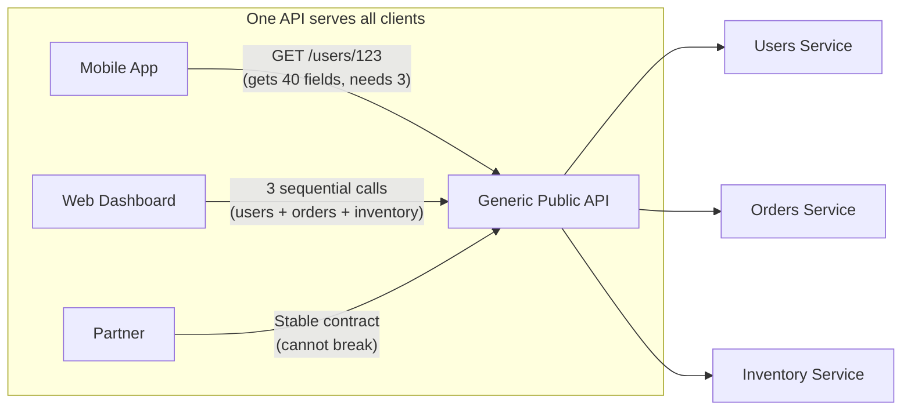
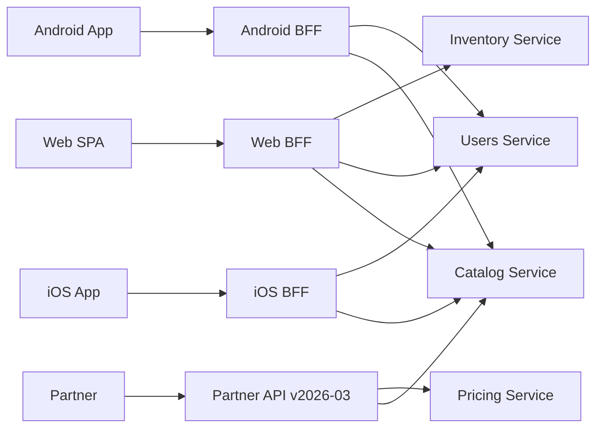
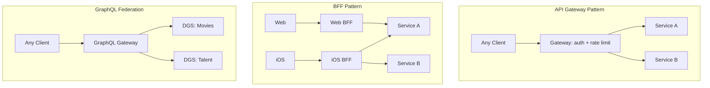
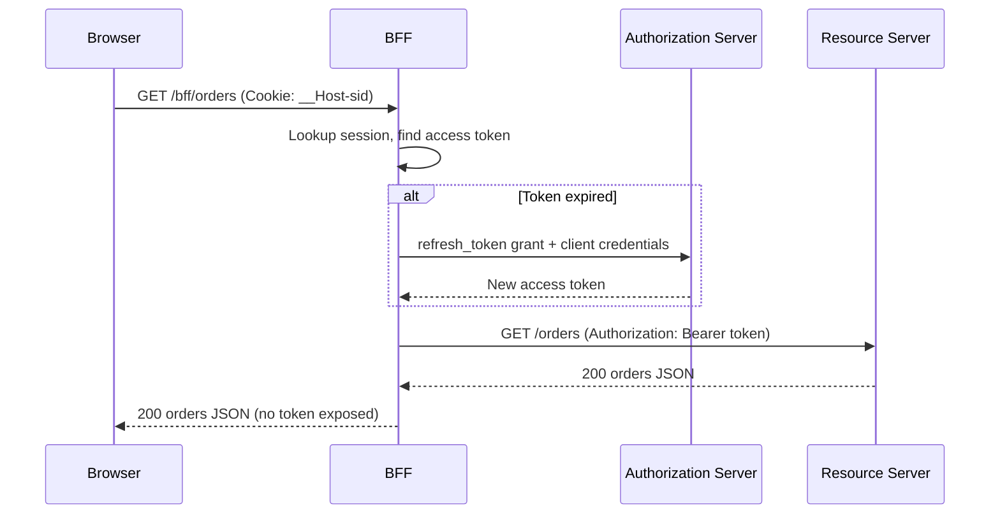

# Backend for Frontend: Per-Client API Aggregation Done Right

> **TL;DR**: A Backend for Frontend (BFF) is a thin server-side aggregation service owned by one client team, serving one UI. It calls downstream microservices, reshapes their responses for that specific client, and handles perimeter concerns like auth and rate limiting. The pattern was discovered at SoundCloud during their 2011-2013 monolith decomposition and formalized in 2015 by Phil Calcado[^1] and Sam Newman[^2]. The single rule that determines success or failure: the team that ships the client owns the BFF. If a platform team owns it, you have rebuilt the bottleneck the pattern was meant to eliminate.

## Learning Objectives

After this module, you will be able to:

- [ ] Explain why a single public API often underserves diverse clients
- [ ] Design a BFF that aggregates microservice calls for one client type
- [ ] Compare BFF vs API gateway vs GraphQL federation and pick deliberately
- [ ] Avoid the common BFF anti-patterns (shared BFFs, business logic leakage)
- [ ] Decide team ownership: the client team owns the BFF, or it is not a BFF

## Intuition

You run a travel agency. Three types of customers walk in: backpackers who want the cheapest flights and hostels on one page, business travelers who need lounge access and expense-report-friendly receipts, and corporate accounts that want a stable monthly invoice with zero surprises.

Your back office has specialists: one desk handles flights, another handles hotels, a third handles billing. If you force all three customer types to walk desk to desk collecting their own information, backpackers waste time at the lounge desk, business travelers get hostel recommendations they will never use, and corporate accounts get overwhelmed by options they cannot expense.

The fix is obvious: assign one concierge per customer type. The backpacker concierge visits the flights desk and the hostels desk, assembles a single sheet with the cheapest options, and hands it over. The business concierge visits flights, lounges, and billing, assembles an expense-ready packet. The corporate concierge visits billing and flights on a fixed monthly schedule.

Each concierge knows exactly what their customer type needs. They never ask the back-office desks to change their processes. They just visit the right desks, collect the right data, and reshape it for their customer.

That concierge is a BFF. The back-office desks are your microservices. The customer types are your clients: mobile app, web SPA, partner integration. [API Design Basics](../part-0-prerequisites/04-api-design-basics.md) introduced the primitives of REST and GraphQL. [Monolith vs Microservices](./00-monolith-vs-microservices.md) explained why you decompose into services. This chapter shows what sits between those services and the clients that consume them.

## Theory

### The problem: one API cannot serve everyone

A generic public API must be stable (partners depend on it), fine-grained (flexibility for unknown use cases), and unopinionated (no assumptions about UI layout). These constraints directly conflict with what a mobile app needs: minimal payloads, aggregated responses, and fast iteration without cross-team negotiation.

The result is two daily pains:

- **Over-fetching.** The mobile app calls `/users/123` and receives 40 fields when it needs 3. Multiply by every endpoint on the home screen, and you are shipping kilobytes of unused JSON over a cellular connection.
- **Under-fetching.** The web dashboard needs data from users, orders, and inventory to render one page. Three sequential round trips, each adding network latency. At PayPal, every client-to-server round trip cost at least 700 ms at p99[^3]. Three round trips meant 2+ seconds before the UI could render.

*A single generic API forces every client to accept the same payload shape, causing over-fetching for mobile and under-fetching for web.*

The temptation is to add mobile-specific endpoints to the public API. But now every mobile UI change requires cross-team negotiation with the API team, and the public API accumulates client-specific cruft that confuses partners.

### The BFF pattern: one backend per experience

A BFF is a thin server-side service with three jobs:

1. **Aggregate.** Fan out to downstream microservices in parallel, collect responses.
2. **Reshape.** Transform and prune the combined data into exactly what the client needs.
3. **Enforce perimeter concerns.** Authentication, rate limiting, header sanitization, CORS.

A BFF does NOT:

- Contain business logic (pricing rules, entitlements, authorization decisions)
- Hold state beyond a request-scoped cache
- Serve multiple client types

Phil Calcado's key insight: "The BFF is part of the application"[^1]. It is not an API the client calls from the outside. It is the server half of the client, sharing the same team, the same release cadence, and the same on-call rotation.

*Each client talks to its own BFF. The BFFs aggregate the same shared microservices but shape responses differently. The partner API is a separate stable contract, not a BFF.*

**Ownership is the single most important variable.** Newman and Calcado converge on this: the BFF must be owned by the team that ships the corresponding UI[^1][^2]. If a platform team owns the BFF, every UI change needs cross-team coordination, which reintroduces the exact bottleneck the pattern eliminates. Stewart Gleadow's heuristic: "one experience, one BFF"[^2].

### BFF vs API gateway vs GraphQL federation

These three patterns overlap but solve different problems. [Reverse Proxies and API Gateways](../part-2-building-blocks/01-reverse-proxies-api-gateways.md) covered the gateway in depth. Here is how they compare:

| Approach | What it does | Who owns it | Client-specific? | Best when |
|----------|-------------|-------------|-------------------|-----------|
| API Gateway | Generic routing, auth, rate limiting, TLS termination | Platform team | No | Cross-cutting concerns for all clients |
| BFF | Per-client aggregation, reshaping, view-specific caching | Client team | Yes | Multiple distinct client types with different needs |
| GraphQL Federation | Unified schema across subgraphs, client picks fields | Domain teams own subgraphs, platform owns gateway | Partially (client selects fields) | Large org, many services, shared entity model |

Key distinctions:

- An API gateway sits in front of BFFs (or in front of services directly). It handles policy; it does not reshape payloads.
- GraphQL can be implemented as a BFF (PayPal did this[^3]) or as a shared schema (which Calcado warns reproduces the "Enterprise Data Model" failure if not scoped carefully).
- Netflix's Studio API evolved through multiple architectural phases before landing on GraphQL Federation with 70 Domain Graph Services and ~10 ms worst-case query planning overhead[^4].

*Three overlapping patterns: the gateway is a shared policy layer, the BFF is a per-client aggregator owned by the client team, and federation is a unified graph with decentralized resolvers.*

### The OAuth BFF pattern

The IETF's "OAuth 2.0 for Browser-Based Applications" (draft-ietf-oauth-browser-based-apps-26, December 2025) names the BFF as the most secure architecture for SPAs handling OAuth[^5]. The security model is simple: the browser never sees an access token.

The BFF is a confidential OAuth client. It obtains tokens via Authorization Code + PKCE, binds them to a cookie-backed session, and proxies every API call by stripping the cookie and attaching the correct access token. Cookies MUST be `Secure` and `HttpOnly`, SHOULD use `SameSite=Strict`, and SHOULD use the `__Host-` prefix.

*The browser holds only an HttpOnly session cookie. The BFF translates it to the correct access token on each proxied request, so tokens never reach client JavaScript.*

This mitigates token theft, silent-frame token acquisition, and persistent refresh-token exfiltration. The IETF draft presents the BFF as the most secure architecture pattern for browser-based OAuth applications, listing it first among three patterns in "decreasing order of security"[^5].

### Modern alternatives: when the BFF dissolves into the framework

For single-origin apps (one team, one client, one server), modern frameworks collapse the BFF into the framework itself:

- **Remix loaders** act as per-route BFF endpoints: hide bearer tokens, prune responses, move HTML escaping server-side.
- **Next.js Server Actions** let React components call server functions directly without an explicit API layer.
- **tRPC** provides end-to-end type-safe RPC for TypeScript monorepos with zero codegen.

These are not replacements for the BFF pattern. They are the BFF pattern dissolved into the framework for single-origin apps. For multi-client products (mobile + web + partner), you still need explicit per-client BFFs because a Remix loader cannot serve your iOS app.

## Real-World Example

### SoundCloud: where the BFF was born

SoundCloud's architecture transition from a Rails monolith to microservices began in 2011. The public API, used by web, mobile, and third-party developers, became a bottleneck: every new feature had to be added without breaking any client[^1].

The fix was to give each client team its own thin edge service. By 2015, SoundCloud ran approximately 5 BFFs in production: a shared iOS/Android listener BFF, web, embed/partners, the creator app Pulse, and the public-api-strangler[^1][^2]. Each BFF was a Finagle-based service that accepted HTTP from one client class and fanned out to internal microservices.

**The numbers tell the story.** Before BFFs, rendering a user profile page required hundreds of fine-grained API calls. After introducing the BFF's Presentation Model endpoints, that dropped to about a dozen[^7].

SoundCloud's Core Engineering team built a shared BFF framework handling alerting, monitoring, telemetry, authentication, rate limiting, and header sanitization. This framework updated on a weekly release cadence[^6]. The rule for duplication: extract shared logic to a library or service only when the same code appears in 3+ BFFs (rule of three).

A special BFF called the `public-api-strangler` sat in front of the old Rails monolith, proxying calls and progressively reimplementing them against new microservices. This was the mechanism for incrementally strangling the monolith without a big-bang rewrite[^6].

**The retrospective lesson:** SoundCloud initially shared one BFF between iOS and Android listener apps. The apps' API needs diverged more than expected, and the team later said they would split by platform if redoing it[^6]. A shared BFF is an anti-pattern even when the clients seem similar.

## Trade-offs

| Approach | Pros | Cons | Best when | Our Pick |
|----------|------|------|-----------|----------|
| BFF per client | Client-optimized payloads, team owns its API, easy strangler migrations | N deployments, duplicated aggregation, frontend teams need backend skills | Multiple distinct client types with per-client teams | **Default for multi-client products** |
| GraphQL (per client) | Client selects fields, single round trip, strong introspection | GraphQL ops complexity (caching, N+1, depth limits), Presentation Model moves to client | Flexible client needs, strong client teams | When client teams can own query complexity |
| GraphQL Federation | Unified graph, distributed ownership, avoids central API bottleneck | Schema composition tooling, ~10 ms planning overhead, high operational bar | Large org (70+ services), shared entity model | Netflix/enterprise scale only |
| Monolithic public API | Simple, one version, low ops overhead | Over/under-fetching for every client, change requires cross-team negotiation | Single client type, early-stage product | **Default for single-client startups** |
| Stable partner API | Long deprecation windows, SLA-backed stability | Cannot evolve per-partner, compatibility layer forever | Third-party integrators you do not control | When clients are external developers |

## Common Pitfalls

> [!WARNING]
> **Shared BFF across client types.** A BFF serving both iOS and Android accumulates concerns from both, grows fat, and reverts to a general-purpose API. SoundCloud learned this the hard way: their combined mobile BFF diverged enough that they recommended splitting it[^6]. Strict rule: one experience, one BFF. Tolerate duplication.

> [!WARNING]
> **Business logic leakage.** Pricing rules, entitlements, and authorization decisions creep into the BFF because it is the easiest place to add "just one more check." Now a rule change requires coordinated deploys across all BFFs. Keep business logic in domain services. The BFF owns the Presentation Model, nothing else[^1].

> [!WARNING]
> **Latency chaining.** A BFF that fans out to N downstream services and awaits them sequentially has tail latency equal to the slowest dependency. Run independent calls in parallel (RxJava, Finagle futures, Promise.all). Set short per-call timeouts. Return partial responses when non-critical services fail rather than returning a 500.

> [!WARNING]
> **Deployment drift from client.** The BFF deploys on a 5-minute cadence; the mobile app ships through App Store review every 2 weeks. A BFF change that the old client cannot parse breaks users who have not upgraded. BFF changes must be backward-compatible with all supported client versions. Feature-flag new fields; enable only when the client version header supports them.

> [!WARNING]
> **Leaking downstream contracts.** Passing through raw downstream JSON means any upstream service rename breaks every client. Map every downstream response into an explicit BFF-owned type. Use consumer-driven contract tests (Pact) between client and BFF to catch accidental schema drift in CI.

## Exercise

Your company has a React web app, iOS and Android apps, and a public partner API. You currently expose one REST API to all four. Design the BFF layout: who owns what, how backend services change, what you move to GraphQL (if anything), and how you migrate without a big bang.

Hint

Start by identifying which clients have divergent needs. The partner API needs stability (not a BFF). The mobile apps may share enough that one BFF works initially, but consider whether iOS and Android teams ship independently. The web app has the richest data needs. Think about the Strangler Fig pattern for migration.

Solution

**Step 1: Identify client types and teams.**

- Web SPA: owned by the web team, needs rich dashboards with 10+ data sources per page.
- iOS and Android: owned by separate mobile teams (or one mobile team with platform-specific engineers). Needs minimal payloads, offline-first patterns.
- Partner API: owned by the platform/developer-experience team. Needs stability, versioning, long deprecation windows.

**Step 2: Design the BFF layout.**

- **Web BFF** (owned by web team): aggregates user, orders, inventory, analytics. Returns pre-composed view models for each page. Consider GraphQL here if the web team is strong enough to own queries.
- **iOS BFF** and **Android BFF** (owned by respective mobile teams): if the teams are separate and ship independently, separate BFFs. If one mobile team owns both, start with one mobile BFF but plan to split when needs diverge.
- **Partner API** (not a BFF): stable REST with date-based versioning. Owned by developer experience team. Does not reshape per-partner.

**Step 3: Migration via Strangler Fig.**

Place a routing layer (API gateway) in front of the existing monolithic API. Route `/web/*` to the new Web BFF, `/mobile/*` to the Mobile BFF, and `/v2/*` to the partner API. The old API continues serving traffic for un-migrated endpoints. Migrate endpoint by endpoint, not all at once.

**Step 4: Backend services stay unchanged.**

BFFs call the same internal services the old API called. No backend refactoring needed. The BFF is a new aggregation layer, not a rewrite of business logic.

**Trade-off accepted:** You now run 3-4 edge services instead of 1. Operational overhead increases. The payoff is team autonomy: the web team ships daily without waiting for mobile review, and the partner API stays stable without blocking anyone.

## Key Takeaways

- A BFF is a thin aggregation service owned by one client team, serving one UI. It aggregates, reshapes, and enforces perimeter concerns. Nothing else.
- The team that ships the client owns the BFF. If a platform team owns it, you have rebuilt the bottleneck the pattern was meant to eliminate.
- A shared BFF is just another monolithic API. Tolerate duplication across BFFs; extract to a shared service only at the rule-of-three threshold.
- BFF, API gateway, and GraphQL federation solve different problems. Use a gateway for cross-cutting policy, a BFF for per-client shaping, and federation when 70+ services need a unified graph.
- The OAuth BFF pattern (IETF BCP draft-26) is the most secure SPA architecture: the browser never sees tokens.
- Modern frameworks (Remix, Next.js, tRPC) dissolve the BFF into the framework for single-origin apps. For multi-client products, explicit BFFs still win.
- Keep business logic out of BFFs. The BFF owns the Presentation Model, not the domain model.

## Further Reading

- [The Back-end for Front-end Pattern (BFF)](http://philcalcado.com/2015/09/18/the_back_end_for_front_end_pattern_bff.html) by Phil Calcado - The origin essay from SoundCloud; the definitive narrative of how BFFs emerged from monolith decomposition pain.
- [Pattern: Backends For Frontends](http://samnewman.io/patterns/architectural/bff/) by Sam Newman - The canonical formalization; covers team ownership, per-client vs per-user-type boundaries, and perimeter concerns.
- [BFF @ SoundCloud](https://www.thoughtworks.com/insights/blog/bff-soundcloud) by Lukasz Plotnicki - ThoughtWorks writeup with SoundCloud engineers; focuses on the strangler BFF and shared framework trade-offs.
- [Some thoughts on GraphQL vs BFF](https://philcalcado.com/2019/07/12/some_thoughts_graphql_bff.html) by Phil Calcado - The 2019 follow-up distinguishing BFF (ownership pattern) from GraphQL (wire protocol); essential for the comparison table.
- [How Netflix Scales its API with GraphQL Federation](https://netflixtechblog.com/how-netflix-scales-its-api-with-graphql-federation-part-1-ae3557c187e2) - Netflix Studio Edge: the BFF-to-federation journey with 70 Domain Graph Services.
- [GraphQL: A Success Story for PayPal Checkout](https://softwareengineeringdaily.com/2018/11/15/graphql-a-success-story-for-paypal-checkout/) - Mark Stuart's case study; the 700 ms round-trip number and the REST-to-Batch-to-GraphQL journey.
- [OAuth 2.0 for Browser-Based Applications (draft-26)](https://www.ietf.org/archive/id/draft-ietf-oauth-browser-based-apps-26.html) - The IETF BCP naming BFF as the most secure SPA OAuth pattern; read Section 6.1 for cookie requirements.
- [Pact: Consumer-Driven Contract Testing](https://docs.pact.io/) - The standard tool for catching client-BFF contract drift without shared staging environments.

## Flashcards

**Q:** What is a Backend for Frontend (BFF)?
**A:** A thin server-side aggregation service owned by one client team, serving one UI. It calls downstream microservices, reshapes responses for that specific client, and handles perimeter concerns like auth and rate limiting. It contains no business logic.

**Q:** Who should own the BFF?
**A:** The team that ships the corresponding client UI. If a platform team or shared API team owns the BFF, every UI change requires cross-team coordination, which reintroduces the bottleneck the pattern was meant to eliminate.

**Q:** What is the difference between a BFF and an API gateway?
**A:** An API gateway handles generic cross-cutting concerns (auth, rate limiting, TLS termination) for all clients. A BFF is client-specific: it aggregates and reshapes data for one UI type. A gateway often sits in front of BFFs.

**Q:** Why is a shared BFF an anti-pattern?
**A:** A BFF serving multiple client types accumulates concerns from all of them, grows fat, and reverts to a general-purpose API with the same bottlenecks. SoundCloud learned this when their combined iOS/Android BFF diverged more than expected.

**Q:** What three jobs does a BFF perform?
**A:** (1) Aggregate: fan out to downstream microservices in parallel. (2) Reshape: transform and prune combined data into exactly what the client needs. (3) Enforce perimeter concerns: authentication, rate limiting, header sanitization.

**Q:** How does the OAuth BFF pattern protect browser-based apps?
**A:** The BFF is a confidential OAuth client. The browser holds only an HttpOnly session cookie and never sees access or refresh tokens. The BFF translates the cookie to the correct access token on each proxied request, preventing token theft via XSS.

**Q:** When should you use GraphQL Federation instead of BFFs?
**A:** When you have a large organization with 70+ services needing a unified schema, multiple client teams sharing an entity model, and the operational capacity to run schema composition, query planning, and federated resolvers. Netflix Studio Edge is the reference implementation.

**Q:** What is latency chaining in a BFF, and how do you fix it?
**A:** A BFF that awaits N downstream services sequentially has tail latency equal to the slowest dependency. Fix by running independent calls in parallel, setting short per-call timeouts, and returning partial responses when non-critical services fail.

**Q:** How do modern frameworks like Remix and Next.js relate to the BFF pattern?
**A:** They dissolve the BFF into the framework: Remix loaders and Next.js Server Actions act as per-route BFF endpoints. This works for single-origin apps but does not replace explicit BFFs for multi-client products where iOS, Android, and web need separate aggregation.

**Q:** What testing approach catches client-BFF contract drift?
**A:** Consumer-driven contract tests using Pact. The client declares expected request/response shapes as a contract; the BFF's CI verifies it can fulfill the contract. Each side tests in isolation without running the other's stack.

**Q:** Where did the BFF pattern originate?
**A:** At SoundCloud during their 2011-2013 migration from a Rails monolith to microservices. The term was coined by Nick Fisher (Tech Lead for web) and documented publicly in 2015 by Phil Calcado and Sam Newman in near-simultaneous essays.

**Q:** What was PayPal's motivation for adopting GraphQL as a BFF?
**A:** Every client-to-server round trip cost at least 700 ms at p99. Multiple atomic REST endpoints meant multi-second page loads. GraphQL let clients define the size and shape of responses in a single round trip, and within a year over 30 apps/teams were building or consuming GraphQL APIs at PayPal[^3].

## References

[^1]: Phil Calcado, "The Back-end for Front-end Pattern (BFF)", 18 September 2015. http://philcalcado.com/2015/09/18/the_back_end_for_front_end_pattern_bff.html
[^2]: Sam Newman, "Pattern: Backends For Frontends", 18 November 2015. http://samnewman.io/patterns/architectural/bff/
[^3]: Mark Stuart, "GraphQL: A Success Story for PayPal Checkout", Software Engineering Daily, 15 November 2018. https://softwareengineeringdaily.com/2018/11/15/graphql-a-success-story-for-paypal-checkout/
[^4]: Tejas Shikhare et al., "How Netflix Scales its API with GraphQL Federation (Part 1)", Netflix Tech Blog, 9 November 2020. https://netflixtechblog.com/how-netflix-scales-its-api-with-graphql-federation-part-1-ae3557c187e2
[^5]: Aaron Parecki, Philippe De Ryck, David Waite, "OAuth 2.0 for Browser-Based Applications", draft-ietf-oauth-browser-based-apps-26, IETF, 4 December 2025. https://www.ietf.org/archive/id/draft-ietf-oauth-browser-based-apps-26.html
[^6]: Lukasz Plotnicki, "BFF @ SoundCloud", ThoughtWorks Insights, 9 December 2015. https://www.thoughtworks.com/insights/blog/bff-soundcloud
[^7]: Phil Calcado, "Some thoughts on GraphQL vs. BFF", 12 July 2019. https://philcalcado.com/2019/07/12/some_thoughts_graphql_bff.html
