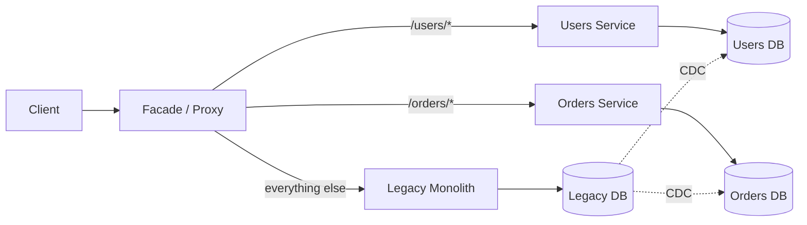
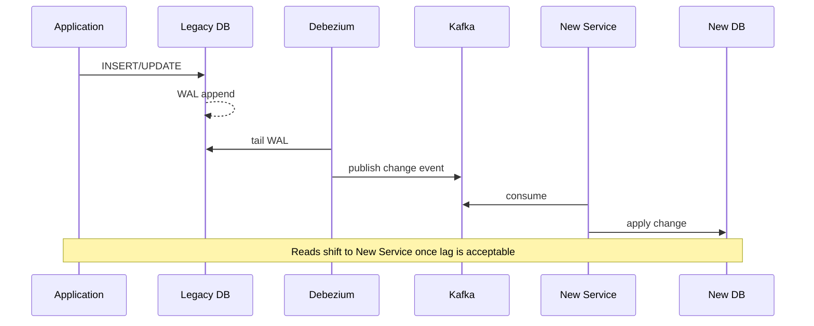
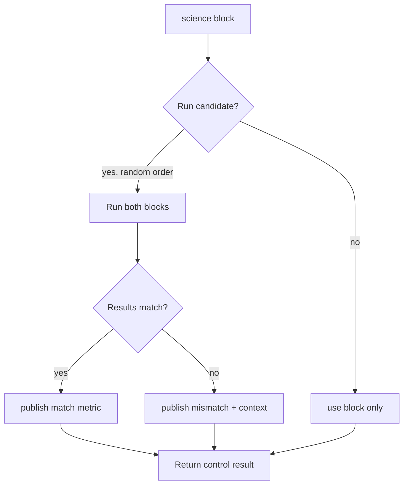
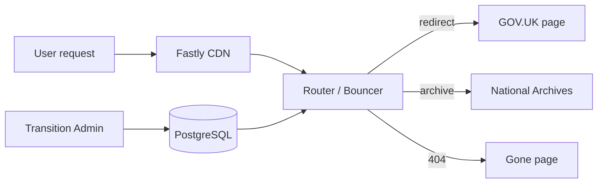

# Strangler Fig: Incremental Migration Without a Big Bang

> **TL;DR**: Big-bang rewrites fail because the business moves while you rewrite, and you deliver zero value until cutover. The strangler fig pattern grows a new system around the old one: a facade routes traffic per-request, you extract one capability at a time, and the legacy footprint shrinks until it can be retired. Data migration (not code) is the hard part; use CDC from the legacy database rather than fragile dual-writes. GOV.UK migrated 312 government agencies onto a single platform in 15 months using exactly this approach, configuring over 1.8 million URL redirects through a purpose-built facade[^1]. The pattern is not fast, but it ships value continuously and keeps the lights on.

## Learning Objectives

After this module, you will be able to:

- [ ] Explain the strangler fig pattern and why it beats big-bang rewrites
- [ ] Design the facade layer that routes between legacy and new systems
- [ ] Handle the dual-write and data-sync problem during migration
- [ ] Sequence extraction by business value and technical risk
- [ ] Track progress and know when to declare the legacy system dead

## Intuition

You live in an old house. The wiring is knob-and-tube from 1920, the plumbing is galvanized steel, and the kitchen layout makes no sense. You have two options.

Option A: tear the house down, live in a hotel for two years, and build a new one on the same lot. During those two years you have no kitchen, no yard, and a mortgage on a pile of rubble. If you run out of money halfway through, you have half a house and no place to live.

Option B: rewire one room at a time. Move into the guest bedroom while the master gets new wiring. Replumb the upstairs bathroom while the downstairs one still works. Replace the kitchen last because it is the most disruptive, and by then you have practiced on three easier rooms. At every point you have a livable house. Each room is better the day after the electrician leaves.

Option B is the strangler fig. A facade (the breaker panel, the main shutoff valve) decides which rooms run on old infrastructure and which run on new. You migrate one room at a time. The old wiring shrinks until the last knob-and-tube circuit is disconnected and pulled.

The name comes from biology. Martin Fowler observed strangler figs in the Queensland rain forest in 2001: a vine germinates in the canopy of a host tree, grows roots down to the soil, and gradually envelops the host until the original tree is gone and only the fig remains[^2]. He published the metaphor in 2004 and renamed it "Strangler Fig Application" in 2019 to anchor it to its botanical origin[^3].

The rest of this chapter is about how to be the vine.

## Theory

### Why big-bang rewrites fail

Joel Spolsky's 2000 essay "Things You Should Never Do, Part I" calls throwing away a working codebase "the single worst strategic mistake that any software company can make."[^4] He wrote it the year Netscape finally shipped its from-scratch rewrite as Netscape 6.0. Netscape Communicator 4.0 shipped in mid-1997; the Mozilla engineers decided in late October 1998 to scrap the Communicator code and restart on the Gecko engine; Netscape 6.0 did not ship until November 2000[^5]. During that roughly three-year shipping gap, no major Netscape release reached users while Internet Explorer took the market.

Big-bang rewrites fail for four reinforcing reasons:

1. **The target moves.** Every feature added to the legacy system during the rewrite is a feature the replacement must also implement before launch. The spec is never frozen.
2. **Zero value until cutover.** Budget and political pressure build with no visible progress to show stakeholders.
3. **Legacy behavior is undocumented.** "Do what the old system does" sounds simple, but years of bug fixes have become load-bearing. Reimplementing them is waste; not reimplementing them breaks users.
4. **Scope creep is guaranteed.** Stakeholders treat the rewrite as their chance to add everything that was ever deferred.

The strangler fig is the opposite bet: take the working system seriously, wrap it, and replace it in increments that each ship value before the whole is complete[^3].

### The facade and routing strategies

The load-bearing piece of any strangler migration is the facade. All client traffic hits the facade first. The facade decides, per request, whether to route to the legacy system or to a new service. Clients never know anything changed.



*The facade routes each request to either the legacy system or one of the extracted services; over time, more routes move to new services until legacy can be retired.*

Concretely, the facade can be an Nginx reverse proxy, an Envoy sidecar, an API gateway, or a purpose-built app. The minimum viable facade is a single Nginx location block:

```nginx
location /v2/users/ {
    proxy_pass http://new-users-svc;
}
location / {
    proxy_pass http://legacy-monolith;
}
```

Routing granularity increases with confidence:

| Strategy | Mechanism | Complexity | Best for |
|----------|-----------|------------|----------|
| URL-path routing | `/v2/*` goes to new service | Low | First extraction |
| Header routing | `X-Route: new-checkout` | Medium | Internal dogfooding |
| Feature-flag routing | LaunchDarkly / Unleash per-user | High | Gradual rollout |
| Percentage rollout | 1% to 5% to 25% to 100% | High | Near-zero-downtime cutover |
| User-bucket routing | Enterprise tenants first | Medium | B2B migrations |

Percentage rollouts are the most powerful: start the new path at 1% of traffic, watch error rates and latency, ramp to 5%, 25%, 50%, 100%. Stripe uses rolling dated API versions (for example `2017-05-24`) paired with an internal version-change framework for near-zero-friction API evolution; as of 2017 they reported "almost a hundred backwards-incompatible upgrades over the past six years" without forcing anyone to migrate[^6].

[Reverse Proxies and API Gateways: The Smart Edge](../part-2-building-blocks/01-reverse-proxies-api-gateways.md) covers the infrastructure primitives that typically host the facade.

### Data migration patterns

Data migration is usually harder than code migration. Four patterns dominate, each with different consistency and downtime characteristics:

| Data strategy | Consistency | Downtime | Best when |
|---------------|-------------|----------|-----------|
| Dual-write | Fragile (no 2PC) | None | Low-stakes transitional period only |
| CDC + outbox | Strong eventual via log replay | None | Most migrations (new system is derived replica) |
| Shadow writes with comparison | Strong (validated before cutover) | None | Safety-critical data (payments, permissions) |
| Big-bang weekend | Trivial | Hours | Small systems with maintenance windows |

**Dual-write** has the application write to both old and new stores on every write path. Simple to reason about, but fragile: any network blip or process crash between the two writes leaves the stores inconsistent. The industry answer is the transactional outbox pattern, where the application writes to its own database plus an outbox table in a single transaction, and a relay process publishes outbox rows to Kafka for asynchronous consumption[^7].

**CDC-based replication** treats the new system as a read replica of the legacy. Debezium tails the legacy database's write-ahead log and publishes change events to Kafka; the new service consumes those events and populates its own store. Once the new system is caught up, reads can shift; once writes shift, the direction can reverse for a safety period.



*CDC-based data migration: the legacy database remains the system of record while Debezium streams changes to the new service, which stays in sync without any application-layer dual-write.*

[Change Data Capture: Streaming the Database's Inner Monologue](../part-4-data-systems/04-change-data-capture.md) covers the mechanics of WAL-tailing, Debezium configuration, and the outbox pattern in depth.

### Extraction sequence and branch by abstraction

Not all pieces are equally safe to extract. Three sequencing strategies dominate:

- **By business value:** extract a high-value, low-coupling piece first to prove the pattern and earn credibility for the rest of the project. Fowler argues that "valuable functionality to the business gives the team the credibility to go further."[^2]
- **By technical risk:** extract boring, low-risk pieces first so you build organizational muscle before tackling anything dangerous.
- **By bounded context:** identify seams along DDD-style bounded contexts and extract each whole context. Shopify's modular monolith carves 37 components out of a 2.8 million-line Rails codebase as of 2020, with each component mapping to a subdomain of commerce; Packwerk enforces boundaries on about a third of them[^8].

The one universally agreed-upon rule: never start with the hardest, most-coupled piece. Its extraction will take longer than your patience lasts.

**Branch by abstraction** is the in-codebase cousin of strangler fig. Jez Humble distinguishes them: strangler fig replaces a whole system across a process boundary; branch by abstraction changes a component inside one codebase[^9]. The technique: introduce an abstraction layer in front of the thing you want to replace, migrate all callers to the abstraction, build a new implementation behind it, and switch. Humble's team used it to swap iBatis for Hibernate and Velocity for JRuby on Rails inside the Go CD product, shipping to production continuously for over a year. The key discipline: new calls may never use the old implementation. "You have to take that hit and do it in Hibernate. That is the only way you can make sure you are progressing."[^9]

### Parallel run, shadow traffic, and feature flags

Before cutting over, you want proof that the new system behaves identically to the old. Parallel run gives you that proof without risk.

GitHub open-sourced [Scientist](https://github.com/github/scientist) in 2016 for exactly this purpose. A "science" block wraps a code path; both the control (old) and candidate (new) execute in random order, results are compared, and the control's result is always returned to the caller[^10]. GitHub used it to rewrite the permissions code that gates every repository, team, and organization access check.

```ruby
require "scientist"

class MyWidget
  include Scientist

  def allows?(user)
    science "widget-permissions" do |experiment|
      experiment.use { model.check_user(user).valid? } # old way
      experiment.try { user.can?(:read, model) }       # new way
    end # returns the control value
  end
end
```

Twitter's Diffy (2015) is the service-level analog: a proxy multicasts every request to three instances (primary, secondary, candidate) and reports regressions while cancelling noise by comparing primary versus secondary[^11].



*Parallel-run flow: both old and new code execute, results are compared, mismatches are logged, but the caller always gets the control's result. Zero user-facing risk.*

**Feature flags** do three jobs during a strangler migration: hide incomplete work, gate cutover, and provide a kill switch. Pete Hodgson's canonical 2017 taxonomy splits them into Release Toggles (short-lived, gate cutover), Ops Toggles (long-lived, kill switches), Experiment Toggles, and Permissioning Toggles[^12]. Cutover flags should be transient; kill switches should be long-lived with a clear owner and a runbook.

The Knight Capital incident on 1 August 2012 is the warning label. Knight reused an 8-year-old dead-code flag called "Power Peg" for new functionality. A deployment missed one of eight servers. The stale flag on that server reactivated the dead code, and the resulting runaway order loop cost Knight USD 460 million in 45 minutes[^13]. The lessons: never reuse old flags, delete flags once they reach steady state, and add expiration dates with time-bomb tests that fail once a flag outlives its spec.

## Real-World Example

### GOV.UK: 312 agencies to one platform in 15 months

Over 15 months ending in December 2014, the UK Government Digital Service migrated 312 government agencies onto a single publishing platform, closing 685 website domains and configuring more than 1.8 million redirects from old URLs into GOV.UK or the National Archives[^1].

The strangler facade is a Ruby/Rack application called Bouncer. Every request for a legacy government URL hits Bouncer, which looks up the path in a PostgreSQL database of URL mappings and returns either a redirect to the corresponding GOV.UK page, an archived page, or a 404. Transition managers edit mappings through a separate Rails admin app called Transition.

The architecture enforces separation of concerns:

- **Bouncer** (the hot path) reads from a PostgreSQL replica only, so Transition outages cannot take down redirects[^14].
- **Fastly CDN** sits in front, absorbing roughly 70% of origin traffic[^14].
- **Jenkins** regenerates Fastly configuration from Transition's hosts API whenever mappings change.



*GOV.UK's strangler architecture: Bouncer is the facade that routes every legacy government URL to its new home, backed by a PostgreSQL mapping table that Transition managers edit through an admin UI.*

The results were measurable. The Intellectual Property Office, a late migrant (October 2014), saw call-centre volume drop 19%, emails drop 17%, and customer visits drop 42% in the four weeks after cutover[^1].

Key lessons from GOV.UK:

- The facade must be simpler than either system behind it. Bouncer is a stateless Rack app with one job.
- URL-level granularity (1.8 million rows) gives you per-page control over the migration.
- A CDN in front of the facade absorbs traffic spikes without touching the routing logic.
- Ceremony matters: 685 domains were formally decommissioned, not left dangling.

## Trade-offs

Strangler fig is the default for replacing a working system. Two related techniques are worth distinguishing from it:

- **Strangler fig.** Facade routes traffic between a legacy system and one or more extracted new services. Ships value continuously, keeps the lights on, and scales to nation-state migrations (GOV.UK, 312 agencies, 15 months[^1]). Costs: long timeline, dual-run infrastructure, facade complexity. **Default for production systems.**
- **Branch by abstraction.** The in-codebase cousin of strangler fig: insert an abstraction layer inside one codebase, build a new implementation behind it, and switch callers. Use when the change is internal (ORM swap, framework upgrade, template engine replacement) and no new process boundary is introduced[^9]. Requires strict discipline: new calls may never touch the old implementation, or you never finish.
- **Parallel run (Scientist, Diffy).** A verification technique used *inside* a strangler or branch-by-abstraction migration, not an alternative to one. Runs old and new code paths on real traffic, compares outputs, and always returns the control's result. Use it for safety-critical paths (permissions, pricing, fraud); the old system remains authoritative until the mismatch rate reaches zero[^10][^11].

Big-bang rewrites (scrap the old system, build a replacement, cut over on flag day) are covered as a pitfall below, not as a peer alternative. Three decades of post-mortems (Netscape 6, Joel Spolsky's 2000 essay) place this in the "things you should never do" bucket for any system with live users.

## Common Pitfalls

> [!WARNING]
> **Big-bang rewrite of a system with live users.** Throwing away a working codebase to rebuild it from scratch is, in Joel Spolsky's words, "the single worst strategic mistake that any software company can make"[^4]. Netscape's 1998 decision to scrap Communicator 4.0 and restart on Gecko shipped no major release for roughly three years while Internet Explorer took the market[^5]. Fowler reaches the same conclusion from a different direction: replacements that "seem easy to specify" tend to "go down in flames most of the time"[^3]. Failure modes: the business keeps changing during the rewrite (moving target), zero value ships until cutover (political pressure builds), legacy behavior is undocumented (reimplementation waste), and scope creep is guaranteed (stakeholders pile on deferred features). Use strangler fig instead: ship value continuously and retire legacy in increments.

> [!WARNING]
> **Migration stalls forever (two systems in perpetuity).** The team extracts the exciting parts, then loses funding or attention. Five years later both systems run side by side with no plan to finish. Commit to a cutover date with an executive sponsor before you start. Track percent of traffic on the new system weekly; if it plateaus below 100% for more than a quarter, escalate.

> [!WARNING]
> **Dual-write data inconsistency.** The application writes to legacy DB and new DB. One write fails; stores diverge silently. There is no transaction across two systems without 2PC, and nobody wants 2PC. Use the outbox pattern plus CDC so the only authoritative write is to the legacy DB; the new DB is a derived read replica until cutover. See [Idempotency and Exactly-Once: The Honest Truth About Delivery Guarantees](../part-3-distributed-systems-theory/07-idempotency-exactly-once.md) for the retry semantics.

> [!WARNING]
> **Reused feature flags.** Knight Capital repurposed an 8-year-old "Power Peg" flag for new functionality. One missed server reactivated dead code and cost USD 460 million in 45 minutes[^13]. Never reuse flags. Delete them once they reach steady state. Add expiration dates and time-bomb tests.

> [!WARNING]
> **New system inherits legacy design flaws.** The team copies the legacy data model into the new code because "the old behavior is the spec." Parallel-run tooling rewards behavioral equivalence, which can be the wrong target for structural problems. Treat the migration as a chance to redesign, not just re-implement. Use ignore blocks in Scientist to skip known-desirable differences.

> [!WARNING]
> **Facade becomes a single point of failure.** All traffic flows through the facade; the facade has a bug; both old and new systems are unreachable. The facade must be simpler than either system behind it. GOV.UK runs Bouncer on its own machines in its own virtual data center with its own database replica so that admin outages cannot take down redirects.

## Exercise

You have a 10-year-old Python 2 monolith serving a fintech product. Regulatory deadlines make rewriting mandatory within 2 years. Design the strangler fig plan: sequence of extractions, facade strategy, data migration approach, and how you keep shipping features during the migration.

<details>
<summary>Hint</summary>

Start with the facade. What sits in front of the monolith today? Can you insert a proxy there? Then think about extraction sequence: which bounded context has the highest business value and lowest coupling? For data, ask whether you can afford dual-write inconsistency in a fintech product, or whether CDC is mandatory.

</details>

<details>
<summary>Solution</summary>

**Step 1: Insert the facade.**

Place an Nginx or Envoy reverse proxy in front of the monolith. Initially it routes 100% of traffic to the monolith unchanged. This is a no-op deployment that proves the proxy works under production load.

**Step 2: Sequence extractions.**

Map bounded contexts: authentication, KYC/onboarding, payments, reporting, notifications. Start with notifications: high business value (regulatory audit trail), low coupling (consumes events, does not produce state other services depend on), and low risk (a bug sends a duplicate email, not a duplicate payment).

**Step 3: Data migration via CDC.**

Fintech cannot tolerate dual-write inconsistency. Use Debezium to tail the monolith's PostgreSQL WAL and stream changes to Kafka. The new notifications service consumes from Kafka and builds its own read model. The monolith remains the system of record until the notifications service is proven correct via parallel run.

**Step 4: Parallel run for payments.**

Payments is the highest-risk extraction. Before cutover, run both old and new payment paths using a Scientist-style comparison. Log every mismatch. Only cut over when mismatch rate is zero for two weeks.

**Step 5: Feature flags for cutover.**

Gate each extraction behind a Release Toggle. Roll out to internal users first (champagne brunch), then 1% of external traffic, then ramp. Keep an Ops Toggle kill switch that routes back to the monolith instantly.

**Step 6: Keep shipping features.**

New features go into the new service if their bounded context has already been extracted. Features in not-yet-extracted contexts go into the monolith with the understanding that they will migrate later. Never freeze the monolith; that is the big-bang trap.

**Step 7: Declare legacy dead.**

When the last endpoint flips and the monolith receives zero traffic for 30 days, hold the legacy funeral. Delete the code, decommission the servers, revoke the database credentials. Ceremony prevents accidental resurrection.

**Trade-off accepted:** This plan takes 18-24 months and requires maintaining two systems in parallel. The alternative (big-bang rewrite) has a higher probability of missing the regulatory deadline entirely.

</details>

## Key Takeaways

- Never attempt a big-bang rewrite of a system that is still being actively used. Netscape lost the browser war during a multi-year rewrite that shipped no major release between Communicator 4.0 (1997) and Netscape 6.0 (November 2000)[^4][^5].
- The facade is the load-bearing piece. Build it first, deploy it as a no-op, then start routing.
- Data migration is harder than code migration. Use CDC from the legacy database; avoid dual-writes in anything beyond a low-stakes transitional period.
- Extract by business value and bounded context, not by perceived ease. Never start with the hardest piece.
- Parallel run (Scientist, Diffy) gives you proof of correctness before cutover. Use it for safety-critical paths.
- Feature flags gate cutover and provide kill switches. Never reuse old flags; delete them once steady state is reached.
- Declare victory when the last endpoint flips and legacy receives zero traffic. Hold a ceremony. Otherwise the corpse lingers.

## Further Reading

- [Strangler Fig Application (2024 revision)](https://martinfowler.com/bliki/StranglerFigApplication.html) - Fowler's canonical definition with the four-activity framework for incremental modernization; start here.
- [Things You Should Never Do, Part I](https://www.joelonsoftware.com/2000/04/06/things-you-should-never-do-part-i/) - Joel Spolsky's 2000 essay on why rewrites fail, with the Netscape cautionary tale; read for motivation.
- [Make Large Scale Changes Incrementally with Branch By Abstraction](http://continuousdelivery.com/2011/05/make-large-scale-changes-incrementally-with-branch-by-abstraction/) - Jez Humble's detailed example from the Go CD product showing how to swap an ORM while shipping continuously.
- [Feature Toggles (aka Feature Flags)](https://martinfowler.com/articles/feature-toggles.html) - Pete Hodgson's taxonomy of toggle categories; essential reading before implementing cutover flags.
- [Scientist: Measure Twice, Cut Once](https://github.blog/developer-skills/application-development/scientist/) - Jesse Toth on GitHub's parallel-run library for verifying code rewrites without user-facing risk.
- [Under Deconstruction: The State of Shopify's Monolith](https://shopify.engineering/shopify-monolith) - The canonical long-running modular-monolith case study showing strangler fig that ends in components, not microservices.
- [Architectural deep-dive of GOV.UK](https://docs.publishing.service.gov.uk/manual/architecture-deep-dive.html) - How a nation-state's publishing strangler works in production, including Bouncer, Router, and Fastly configuration.
- [Knightmare: A DevOps Cautionary Tale](https://dougseven.com/2014/04/17/knightmare-a-devops-cautionary-tale/) - The canonical flag-reuse disaster; read before implementing any feature-flag strategy.

## Flashcards

**Q:** What is the strangler fig pattern?
**A:** A migration strategy where a facade routes traffic between a legacy system and a new system. You extract one capability at a time, shifting routes until the legacy system receives zero traffic and can be retired. Named after a vine that grows around a host tree and eventually replaces it.

**Q:** Why do big-bang rewrites fail?
**A:** Four reinforcing reasons: the business keeps changing during the rewrite (moving target), zero value ships until cutover (political pressure), legacy behavior is undocumented (reimplementation waste), and scope creep is guaranteed (stakeholders pile on deferred features).

**Q:** What is the role of the facade in a strangler migration?
**A:** The facade sits in front of both systems and decides per-request whether to route to legacy or new. It decouples clients from the migration; they never know anything changed. It can be an Nginx proxy, an API gateway, or a purpose-built routing app.

**Q:** Why is dual-write dangerous during data migration?
**A:** There is no transaction across two systems without 2PC. Any network blip or process crash between the two writes leaves the stores inconsistent. The safer alternative is CDC: write to the legacy DB only, tail its WAL, and stream changes to the new system.

**Q:** What is branch by abstraction and how does it differ from strangler fig?
**A:** Branch by abstraction changes a component inside one codebase by inserting an abstraction layer, building a new implementation behind it, and switching. Strangler fig replaces a whole system across a process boundary using a facade. They are complementary: use branch by abstraction for internal swaps (ORM, template engine), strangler fig for system-level migrations.

**Q:** What is a parallel run (Scientist pattern)?
**A:** Both old and new code execute on real traffic in random order. Results are compared and mismatches are logged, but the caller always gets the old code's result. This gives proof of correctness without user-facing risk. GitHub used it to rewrite their permissions system.

**Q:** What happened at Knight Capital due to a reused feature flag?
**A:** Knight reused an 8-year-old dead-code flag called "Power Peg" for new functionality. A deployment missed one of eight servers. The stale flag reactivated dead code, causing a runaway order loop that cost USD 460 million in 45 minutes and bankrupted the company.

**Q:** How do you know when a strangler migration is done?
**A:** When the legacy system receives zero traffic and the last endpoint has been flipped. Track percent of traffic on new, percent of endpoints migrated, and lines of code in legacy. Hold a formal decommissioning ceremony to prevent accidental resurrection.

**Q:** What extraction sequence should you follow?
**A:** Start with a high-value, low-coupling bounded context to prove the pattern and earn credibility. Never start with the hardest, most-coupled piece. Common strategies: sequence by business value, by technical risk (easy pieces first to build muscle), or by DDD bounded context.

**Q:** What are the four data migration strategies for strangler fig?
**A:** Dual-write (fragile, transitional only), CDC plus outbox (strong eventual, no downtime, most common), shadow writes with comparison (safety-critical), and big-bang weekend migration (small systems with maintenance windows).

**Q:** When does the strangler fig pattern NOT work?
**A:** When the legacy system has no clean request boundaries to intercept (deeply tangled batch processes), when the team lacks organizational patience for a multi-year effort, or when budget will run out before enough value is extracted to justify continuing.

**Q:** How did GOV.UK implement the strangler pattern?
**A:** A Rack app called Bouncer receives every request for a legacy government URL and returns a redirect, archive page, or 404 by looking up the path in a PostgreSQL mapping table. Transition managers edit mappings through a Rails admin UI. Fastly CDN absorbs 70% of traffic. They migrated 312 agencies and 685 domains in 15 months.

## References

[^1]: Mark Hazelby, "300+ websites to just 1 in 15 months", Inside GOV.UK blog, 19 December 2014. https://insidegovuk.blog.gov.uk/2014/12/19/300-websites-to-just-1-in-15-months/
[^2]: Martin Fowler, "Original Strangler Fig Application", 29 June 2004 (renamed April 2019). https://martinfowler.com/bliki/OriginalStranglerFigApplication.html
[^3]: Martin Fowler, "Strangler Fig", 22 August 2024. https://martinfowler.com/bliki/StranglerFigApplication.html
[^4]: Joel Spolsky, "Things You Should Never Do, Part I", 6 April 2000. https://www.joelonsoftware.com/2000/04/06/things-you-should-never-do-part-i/
[^5]: Wikipedia, "Netscape 6". https://en.wikipedia.org/wiki/Netscape_6 (accessed 2026-05-08). "The Mozilla engineers decided in late October 1998 to scrap the Communicator code and start over from scratch using the standards-compliant Gecko rendering engine...Netscape 6.0 shipped in November 2000."
[^6]: Brandur Leach, "APIs as infrastructure: future-proofing Stripe with versioning", Stripe blog, 5 August 2017. https://stripe.com/blog/api-versioning
[^7]: Red Hat Developer, "Avoid dual writes in event-driven applications". https://developers.redhat.com/articles/2021/07/30/avoiding-dual-writes-event-driven-applications
[^8]: Philip Muller, "Under Deconstruction: The State of Shopify's Monolith", Shopify Engineering, 16 September 2020. https://shopify.engineering/shopify-monolith
[^9]: Jez Humble, "Make Large Scale Changes Incrementally with Branch By Abstraction", continuousdelivery.com, 5 May 2011. http://continuousdelivery.com/2011/05/make-large-scale-changes-incrementally-with-branch-by-abstraction/
[^10]: Jesse Toth, "Scientist: Measure Twice, Cut Once", GitHub blog, 3 February 2016 (updated 3 December 2020). https://github.blog/developer-skills/application-development/scientist/
[^11]: Puneet Khanduri, "Diffy: Testing services without writing tests", Twitter engineering blog, 3 September 2015. https://web.archive.org/web/20240226074204/https://blog.twitter.com/engineering/en_us/a/2015/diffy-testing-services-without-writing-tests
[^12]: Pete Hodgson, "Feature Toggles (aka Feature Flags)", martinfowler.com, 9 October 2017. https://martinfowler.com/articles/feature-toggles.html
[^13]: Doug Seven, "Knightmare: A DevOps Cautionary Tale", 17 April 2014. https://dougseven.com/2014/04/17/knightmare-a-devops-cautionary-tale/
[^14]: GOV.UK Developer Docs, "Architectural deep-dive of GOV.UK". https://docs.publishing.service.gov.uk/manual/architecture-deep-dive.html
