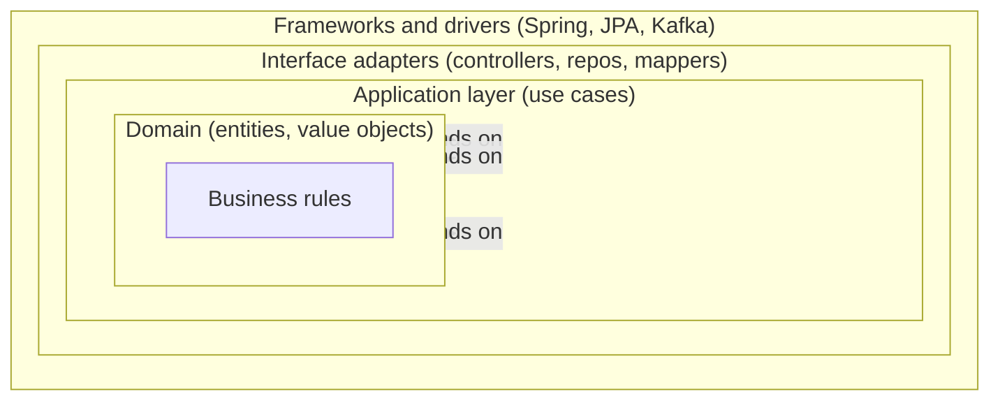
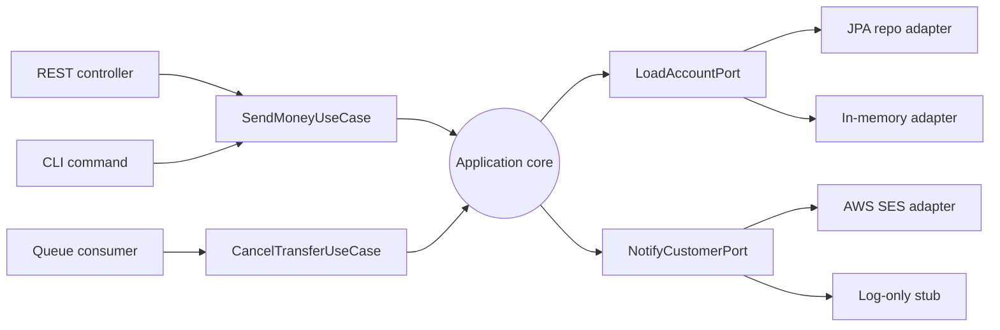
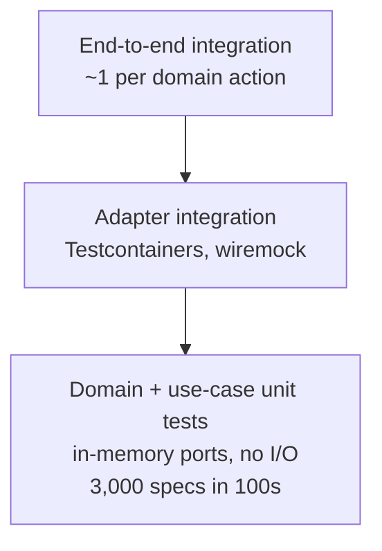

# Hexagonal and Clean Architecture: Keeping Business Logic Independent

> **TL;DR**: Hexagonal architecture, clean architecture, and onion architecture are three names for one structural discipline: put business logic in the center, infrastructure at the edge, and allow source code dependencies to point only inward. The load-bearing idea is the Dependency Rule: "source code dependencies can only point inwards"[^1]. The payoff is a domain that compiles without a web framework, ORM, or message broker on the classpath, and tests that run in seconds instead of minutes. Netflix's Studio team swapped a JSON API data source for GraphQL in two hours because no persistence specifics had leaked into business logic[^2]. The cost is real: 2-3x more files than a transaction script, slower onboarding, and analysis paralysis for simple CRUD. Use hexagonal when the domain is complex and long-lived. Use a simpler structure when it is not.

## Learning Objectives

After this module, you will be able to:

- [ ] Explain ports, adapters, and the dependency rule
- [ ] Design a module with domain, application, and infrastructure layers
- [ ] Write unit tests that exercise domain logic without spinning up a database
- [ ] Recognize when hexagonal is overkill vs when it pays off
- [ ] Map hexagonal concepts to DDD and layered architecture

## Intuition

You own a coffee shop. The espresso machine, the grinder, and the milk steamer are your business logic: they produce coffee regardless of who ordered it or how payment was collected.

Now imagine you hardwire the cash register directly into the espresso machine. Every time you upgrade the register, you have to rewire the machine. Want to accept mobile payments? Rewire again. Want to sell at a farmers market with a different register? Impossible without dragging the entire counter along.

A sane coffee shop uses a standard interface: the barista reads an order ticket. The ticket is the same whether it came from a cashier, a mobile app, or a voice assistant. On the output side, the barista places the finished drink on a pickup counter. Whether the customer picks it up, a delivery driver takes it, or a robot arm grabs it is irrelevant to the barista.

The order ticket is an **inbound port**. The pickup counter is an **outbound port**. The cashier, mobile app, and voice assistant are **inbound adapters**. The customer, delivery driver, and robot are **outbound adapters**. The barista (your domain logic) never changes when you swap any of them.

This is hexagonal architecture. The domain defines the shape of its inputs and outputs. The outside world conforms to those shapes. When the outside world changes, you write a new adapter. The domain stays untouched.

## Theory

### The dependency rule

Robert C. Martin stated the rule that unifies all three variants: "Source code dependencies can only point inwards. Nothing in an inner circle can know anything at all about something in an outer circle"[^1].

In practice this means your domain code never imports infrastructure types. No `@Entity`, no `HttpClient`, no `KafkaProducer`. When the flow of control needs to cross outward (a use case triggering a database write), the inner layer defines an interface (the port) and the outer layer implements it (the adapter). This is SOLID's Dependency Inversion Principle applied at the architectural level.



*All source code dependencies point inward. The domain knows nothing about the layers that surround it.*

The mechanism is simple: when a use case needs to persist an entity, it calls a `SaveOrderPort` interface that lives in the application layer. A `PostgresOrderRepository` class in the infrastructure layer implements that interface. At compile time, the dependency arrow points inward (infrastructure depends on application). At runtime, the call flows outward (use case calls repository). Dependency inversion reverses the compile-time arrow so the runtime call can go outward while the import graph still points inward.

### The three names and their origins

Three authors independently described the same structural discipline:

- **Hexagonal / Ports and Adapters** (Alistair Cockburn, 2005). Cockburn drew a hexagon "not because the number six is important" but to give the diagram room for multiple ports without being constrained by a one-dimensional layered drawing[^3]. He named the technical pattern "ports and adapters" and introduced the primary/secondary asymmetry.

- **Onion Architecture** (Jeffrey Palermo, July 29, 2008). Palermo drew concentric rings where "all coupling is toward the center" and the database is external, not central[^4]. His key contribution: making explicit that the traditional three-tier architecture puts the database at the bottom (implying everything depends on it), while the onion puts it at the edge.

- **Clean Architecture** (Robert C. Martin, August 13, 2012; book 2017). Martin unified hexagonal, onion, DCI, and BCE into a single diagram with four default rings (Entities, Use Cases, Interface Adapters, Frameworks and Drivers) and coined the Dependency Rule[^1].

The overlap creates terminology confusion. Three Dots Labs documents the trap: "We accidentally picked the same names for different things. Our ports are Hexagonal Architecture's Primary Adapters. Our adapters are Hexagonal Architecture's Secondary Adapters"[^5]. Do not get lost in naming debates. The load-bearing idea is identical across all three: dependencies point inward.

### Inbound vs outbound ports and adapters

Cockburn's asymmetric refinement distinguishes two directions:

**Inbound (primary, driving) ports** are use-case interfaces called by the outside world. A REST controller, CLI command, or queue consumer calls an inbound port to trigger a domain action. Example: `SendMoneyUseCase` is an inbound port; the controller depends on it.

**Outbound (secondary, driven) ports** are repository or external-service interfaces called by use cases. The domain defines what it needs; the infrastructure provides it. Example: `LoadAccountPort` and `UpdateAccountStatePort` are outbound ports; the service depends on them.



*Primary (driving) adapters on the left call inbound ports. Secondary (driven) adapters on the right implement outbound ports. The application core knows only port interfaces, never concrete adapters.*

This asymmetry makes "what drives what" explicit in code review. New engineers can answer: "Is this called by the framework or by my use case?" Clear naming conventions (`port.in/` vs `port.out/` packages) allow static linters to enforce direction.

### Typical layer layout

Four layers by convention:

| Layer | Contains | Depends on | Example packages |
|-------|----------|------------|-----------------|
| Domain | Entities, value objects, domain services, domain events | Nothing | `domain.model`, `domain.service` |
| Application | Use cases, inbound/outbound port interfaces, transaction boundaries | Domain | `application.port.in`, `application.port.out` |
| Infrastructure | Adapter implementations (Postgres repo, Kafka consumer, REST client) | Application, Domain | `adapter.out.persistence`, `adapter.out.messaging` |
| Presentation | Controllers, CLI handlers, queue listeners (thin inbound adapters) | Application | `adapter.in.web`, `adapter.in.cli` |

Tom Hombergs' reference project `buckpal` uses this layout in a single Gradle module with ArchUnit enforcing the dependency rules in CI[^6]. Three Dots Labs' Go layout uses top-level `domain/`, `app/`, `adapters/`, `ports/` directories per microservice[^5]. Netflix uses three core types: Entities (no storage knowledge), Repositories (domain-defined interfaces), Interactors (use-case orchestrators)[^2].

The key insight: the application layer is where transactions begin. `@Transactional` (or its equivalent) sits on the use-case service, not on the controller or the repository. The domain stays framework-free.

### Testing benefits

Because domain and application layers import no framework types, unit tests run without a database, HTTP server, or message broker.

The test strategy splits into three tiers:

1. **Domain and use-case unit tests** (most numerous). Replace outbound ports with in-memory fakes. Netflix runs 3,000 specs in 100 seconds on a single process using this approach[^2].
2. **Adapter integration tests** (fewer). Test the real adapter implementation against real infrastructure (Postgres via Testcontainers, wiremock for HTTP).
3. **Full-stack integration tests** (fewest). One success path and one failure path per domain action. Verifies wiring correctness.



*Fast domain unit tests form the base of the pyramid. Adapter integration tests verify infrastructure. Full-stack tests verify wiring.*

In-memory repository implementations double as rapid prototyping tools during early development. You can build and validate the entire domain before choosing a database. Hombergs and Three Dots Labs both prefer real in-memory implementations over mocks for repositories because mocks make tests brittle[^5][^6].

### Hexagonal vs DDD

Hexagonal and Domain-Driven Design are independent but complementary. Hexagonal provides the physical code structure (where does this class live?). DDD provides what fills the domain layer (aggregates, entities, value objects, domain events, ubiquitous language).

The jMolecules Java library makes this explicit by shipping separate annotation sets: one for DDD building blocks (`@Entity`, `@ValueObject`, `@AggregateRoot`, `@Repository`) and one for hexagonal architectural style (`@Application`, `@PrimaryPort`, `@SecondaryPort`, `@PrimaryAdapter`, `@SecondaryAdapter`)[^7]. They are orthogonal.

A team can adopt hexagonal structure with simple CRUD entities, then deepen to DDD later without moving files. Conversely, a team doing full DDD can use any code structure. Do not conflate the two. Hexagonal does not require DDD, and DDD does not require hexagonal.

The trap: without DDD or an equivalent discipline, the domain layer can become an "anemic domain model" where entities are getters and setters only, and all logic lives in application services. Martin Fowler coined the term in 2003 and it remains the most common anti-pattern in "clean architecture" codebases[^8].

## Real-World Example

### Netflix Studio Engineering: hexagonal in production

Netflix's Studio Workflows team (Damir Svrtan and Sergii Makagon, 2020) built an application crossing multiple domains: script acquisition, deals, scheduling, vendor management. The predecessor monolith had grown to 300+ database tables with 30+ developers working in parallel[^2].

The new system consumed data from many upstream services using gRPC, JSON API, GraphQL, and Elasticsearch. The team expected the upstream monolith to be decomposed mid-project, meaning data sources would change. They adopted hexagonal explicitly so that "business logic should not depend on whether we expose a REST or a GraphQL API, and it should not depend on where we get data from"[^2].

**Architecture:** Three core types. Entities hold domain state with no storage knowledge. Repositories are domain-defined interfaces. Interactors orchestrate use cases. Data sources (SQL, GraphQL client, REST, Elasticsearch) implement repository interfaces. Transport layer (HTTP controllers) triggers interactors.

**The payoff:** When a bulk API did not exist upstream, the adapter issued concurrent single-resource calls. The interactor never learned it was a workaround. When the team needed to swap from a JSON API to a GraphQL data source, the change took two hours end-to-end because no persistence specifics had leaked into business logic[^2].

**Test strategy:** Mock-backed interactor unit tests (most numerous), data source integration tests (few), full-stack integration specs (one success + one failure per domain action). The suite ran 3,000 specs in 100 seconds on a single process[^2].

**Configuration-switchable data sources:** The team could decide which data source to use through configuration, enabling safer rollouts and A/B testing of new backends without touching domain code.

This is the pattern's strongest public case study. The ceremony tax (more interfaces, more files) paid for itself the first time an upstream service changed its API contract and the domain layer required zero modifications.

## Trade-offs

| Approach | Pros | Cons | Best when | Our Pick |
|----------|------|------|-----------|----------|
| Hexagonal / clean / onion | Testable domain without I/O; framework-independent; swappable infra (Netflix: 2-hour swap) | 2-3x more files; indirection; slower onboarding | Long-lived systems, complex domain, multiple teams | **Default for complex domains with 10+ year lifespan** |
| Layered (traditional 3-tier) | Simpler, universally familiar; one file per endpoint | Framework leaks into domain; transitive coupling; rewrites every 3 years | CRUD apps with simple domain, short-lived projects | Default for simple CRUD |
| Transaction script | Fewest files; minimal ceremony; easy for one developer | Hard to test without DB; logic duplicated across scripts | Simple scripts, one-off batch jobs, prototypes | Prototypes and throwaway code |
| Active record (Rails-style) | Highly productive; opinionated framework handles wiring | Couples domain and DB schema; anemic model trap; slow tests | Startups, simple CRUD, framework-centric teams | When framework productivity outweighs flexibility |

[Monolith vs Microservices](./00-monolith-vs-microservices.md) showed that architecture decisions are dominated by team size and coordination cost. The same principle applies here: hexagonal pays off when the domain is complex enough to justify the ceremony. For a two-endpoint CRUD service, it is architectural cosplay.

## Common Pitfalls

> [!WARNING]
> **Anemic domain model.** Every domain class is getters and setters only; all logic lives in application services. The domain layer exists but adds no value. Move invariants into the entity: `Account.withdraw()` should enforce non-negative balance, not a service method. Fowler coined this anti-pattern in 2003 and it remains the most common failure mode[^8].

> [!WARNING]
> **Leaky domain (framework annotations bleeding inward).** `@Entity`, `@Table`, `@Column`, or `@JsonProperty` appear on domain classes. The domain can no longer compile without the framework. Keep two classes: a pure domain `Account` and a persistence-layer `AccountJpaEntity`, with a mapper between them. Ban framework imports in the domain package via ArchUnit or equivalent linter.

> [!WARNING]
> **Architectural cosplay (ports for things that never vary).** The codebase has `EmailPort`, `LoggerPort`, `ClockPort`, `UuidGeneratorPort` each with a single implementation that has never been swapped. Cockburn's original examples used only a small number of ports per application[^3]. Introduce a port when the second adapter arrives, when the infrastructure is volatile, or when testability genuinely needs it.

> [!WARNING]
> **Inverted dependency direction by accident.** The interface lives in the adapter package and the domain imports it. Compiles fine, but the dependency rule is silently violated. Put the port (interface) in the domain or application package. The adapter implements it. Enforce with a static linter (`go-cleanarch`, ArchUnit) in CI because code review misses this reliably.

> [!WARNING]
> **Over-engineered hexagon for a CRUD service.** A "manage user preferences" service with one table and two endpoints has domain, application, ports-in, ports-out, and adapter packages. Each feature requires editing five files to add one field. Palermo is explicit: "This architecture is not appropriate for small websites"[^4]. Three Dots Labs left their `users` microservice out of their Clean Architecture refactor: "there's no application logic there, and overall it's tiny"[^5].

## Exercise

Design the module structure for an order service in a hexagonal style. Specify: domain entities, ports (repositories, external APIs), adapters (Postgres, Stripe, SES), and how a "place order" use case flows. Write the signature of one unit test that requires no database.

<details>
<summary>Hint</summary>

Start from the use case. What does "place order" need to do? It needs to load inventory, charge payment, persist the order, and notify the customer. Each of those is an outbound port. The use case itself is an inbound port. The unit test replaces every outbound port with an in-memory fake.

</details>

<details>
<summary>Solution</summary>

**Module structure:**

```text
order-service/
  domain/
    Order.java          (entity with behavior: addItem, calculateTotal)
    OrderItem.java      (value object)
    Money.java          (value object)
  application/
    port/in/
      PlaceOrderUseCase.java       (inbound port interface)
      PlaceOrderCommand.java       (input DTO)
    port/out/
      OrderRepository.java         (outbound port: save/load orders)
      PaymentGateway.java          (outbound port: charge customer)
      CustomerNotifier.java        (outbound port: send confirmation)
    service/
      PlaceOrderService.java       (implements PlaceOrderUseCase)
  adapter/
    in/web/
      OrderController.java         (REST, calls PlaceOrderUseCase)
    out/persistence/
      PostgresOrderRepository.java (implements OrderRepository)
    out/payment/
      StripePaymentAdapter.java    (implements PaymentGateway)
    out/notification/
      SesNotificationAdapter.java  (implements CustomerNotifier)
```

**Use case flow:**

1. `OrderController` receives `POST /orders`, builds a `PlaceOrderCommand`, calls `PlaceOrderUseCase`.
2. `PlaceOrderService` creates an `Order` domain object, calls `Order.calculateTotal()`.
3. Service calls `PaymentGateway.charge(total)`.
4. On success, calls `OrderRepository.save(order)`.
5. Calls `CustomerNotifier.sendConfirmation(order)`.
6. Returns the order ID.

**Unit test signature (no database):**

```java
@Test
void placeOrder_chargesPaymentAndPersists() {
    // Given
    var fakeRepo = new InMemoryOrderRepository();
    var fakePayment = new AlwaysApprovesPaymentGateway();
    var fakeNotifier = new NoOpCustomerNotifier();
    var service = new PlaceOrderService(fakeRepo, fakePayment, fakeNotifier);

    // When
    var command = new PlaceOrderCommand(customerId, List.of(item1, item2));
    var orderId = service.placeOrder(command);

    // Then
    assertThat(fakeRepo.findById(orderId)).isPresent();
    assertThat(fakePayment.chargedAmount()).isEqualTo(Money.of(42, "USD"));
}
```

The test runs in milliseconds. No Spring context, no Testcontainers, no network calls. The domain logic (order creation, total calculation) and the orchestration logic (charge then persist) are both verified without I/O.

</details>

## Key Takeaways

- The Dependency Rule is the load-bearing idea. Everything else (hexagon shape, ring count, layer names) is preference.
- Ports are interfaces defined by the domain. Adapters are implementations that plug into ports. Keep that straight.
- The pattern's real payoff is test speed and framework independence. Netflix runs 3,000 specs in 100 seconds; a DB-backed suite would take minutes.
- Hexagonal works inside both a monolith and each microservice. It is orthogonal to the deployment topology.
- For simple CRUD apps, hexagonal is usually overkill. Do not apologize for a simpler structure.
- Hexagonal does not give you a good domain model. You still have to think. Without behavioral entities, you get an anemic domain wrapped in ceremony.
- The anemic domain model is the single most common failure mode. If your domain classes are all getters and setters, the hexagon is not carrying its weight.

## Further Reading

- [Hexagonal Architecture](https://web.archive.org/web/2024/https://alistair.cockburn.us/hexagonal-architecture/) by Alistair Cockburn - The 2005 original with the primary/secondary actor asymmetry that later variants dropped; read this before any secondary source. (Original URL offline as of 2024; archived snapshot linked. See also the 2025 book *Hexagonal Architecture Explained* by Cockburn and Garrido de Paz.)
- [The Clean Architecture](https://blog.cleancoder.com/uncle-bob/2012/08/13/the-clean-architecture.html) by Robert C. Martin - The 2012 blog post that unified hexagonal, onion, DCI, and BCE under "the Dependency Rule"; short and canonical.
- [The Onion Architecture: part 1](https://jeffreypalermo.com/2008/07/the-onion-architecture-part-1/) by Jeffrey Palermo - Contains the most useful warning: "not appropriate for small websites."
- [Ready for changes with Hexagonal Architecture](https://netflixtechblog.com/ready-for-changes-with-hexagonal-architecture-b315ec967749) by Svrtan and Makagon, Netflix Tech Blog - The best public production case study with real numbers on test speed and data source swaps.
- [Get Your Hands Dirty on Clean Architecture, 2nd ed.](https://reflectoring.io/book/) by Tom Hombergs - The reference Spring Boot implementation (buckpal repo) including chapters on shortcuts and enforcement.
- [Introducing Clean Architecture by refactoring a Go project](https://threedots.tech/post/introducing-clean-architecture/) by Three Dots Labs - The clearest Go-idiomatic treatment, including what they renamed and why.
- [AnemicDomainModel](https://martinfowler.com/bliki/AnemicDomainModel.html) by Martin Fowler - The 2003 coinage; still the canonical reference 20+ years later for the most common anti-pattern.
- [DDD, Hexagonal, Onion, Clean, CQRS, ...](https://herbertograca.com/2017/11/16/explicit-architecture-01-ddd-hexagonal-onion-clean-cqrs-how-i-put-it-all-together/) by Herberto Graca - The classic "how do all these fit together" synthesis for teams adopting multiple patterns simultaneously.

## Flashcards

**Q:** What is the Dependency Rule in clean architecture?
**A:** Source code dependencies can only point inward. Nothing in an inner circle can know anything about something in an outer circle. The domain never imports infrastructure types.

**Q:** What is a port in hexagonal architecture?
**A:** An interface defined by the domain or application layer that describes what the application needs from the outside world (outbound) or what the outside world can ask of the application (inbound).

**Q:** What is an adapter in hexagonal architecture?
**A:** A concrete implementation of a port that connects the application to a specific technology (Postgres, Stripe, REST, in-memory fake). Adapters live in the infrastructure layer.

**Q:** What is the difference between an inbound and outbound port?
**A:** An inbound (primary, driving) port is a use-case interface called by the outside world (controllers, CLI). An outbound (secondary, driven) port is a repository or external-service interface called by the use case.

**Q:** How does hexagonal architecture improve test speed?
**A:** Domain and use-case unit tests replace outbound ports with in-memory fakes, eliminating I/O. Netflix runs 3,000 specs in 100 seconds this way. No database, HTTP server, or message broker needed.

**Q:** What is the anemic domain model anti-pattern?
**A:** Domain classes contain only getters and setters; all business logic lives in application services. The domain layer exists but adds no value. Fix by moving invariants into entities (e.g., `Account.withdraw()` enforces non-negative balance).

**Q:** When is hexagonal architecture overkill?
**A:** For simple CRUD services, prototypes, one-developer projects, or framework-heavy apps (Rails, Django) where the domain has no rules to protect. Palermo explicitly says it is "not appropriate for small websites."

**Q:** How do hexagonal architecture and DDD relate?
**A:** They are independent but complementary. Hexagonal provides the physical code structure (where classes live). DDD provides what fills the domain layer (aggregates, value objects, domain events). You can use either without the other.

**Q:** What is "architectural cosplay" in the context of hexagonal?
**A:** Creating ports for every dependency (logger, clock, UUID generator) when none will ever be swapped. The ceremony adds navigation overhead without delivering testability or flexibility benefits.

**Q:** Where should transaction boundaries live in a hexagonal architecture?
**A:** In the application layer, on the use-case service. Not on the controller (too early) and not on the repository (too late). The use case orchestrates multiple ports and defines the unit of work.

**Q:** What did Netflix's 2-hour data source swap demonstrate?
**A:** That hexagonal architecture's port abstraction pays off when infrastructure changes. Because no persistence specifics leaked into business logic, swapping from a JSON API to GraphQL required only writing a new adapter, not touching any domain or use-case code.

**Q:** Name three static analysis tools that enforce the dependency rule in CI.
**A:** ArchUnit (Java/Kotlin), go-cleanarch (Go), and jMolecules with jQAssistant (Java). All verify that inner layers do not import outer-layer types.

## References

[^1]: Robert C. Martin, "The Clean Architecture", The Clean Code Blog, 13 August 2012. https://blog.cleancoder.com/uncle-bob/2012/08/13/the-clean-architecture.html
[^2]: Damir Svrtan and Sergii Makagon, "Ready for changes with Hexagonal Architecture", Netflix TechBlog, 10 March 2020. https://netflixtechblog.com/ready-for-changes-with-hexagonal-architecture-b315ec967749 (requires Medium account; see also Svrtan's conference talks on the same material).
[^3]: Alistair Cockburn, "Hexagonal architecture", 2005. Archived: https://web.archive.org/web/2024/https://alistair.cockburn.us/hexagonal-architecture/ (original URL offline as of 2024; see also Alistair Cockburn and Juan Manuel Garrido de Paz, *Hexagonal Architecture Explained*, independently published, 2025).
[^4]: Jeffrey Palermo, "The Onion Architecture: part 1", 29 July 2008. https://jeffreypalermo.com/2008/07/the-onion-architecture-part-1/
[^5]: Milosz Smolka, "How to implement Clean Architecture in Go (Golang)", Three Dots Labs, 2020. https://threedots.tech/post/introducing-clean-architecture/
[^6]: Tom Hombergs, *Get Your Hands Dirty on Clean Architecture*, 2nd ed., Packt Publishing, 2023. https://reflectoring.io/book/
[^7]: jMolecules project, xmolecules/jmolecules. https://github.com/xmolecules/jmolecules
[^8]: Martin Fowler, "AnemicDomainModel", 25 November 2003. https://martinfowler.com/bliki/AnemicDomainModel.html
