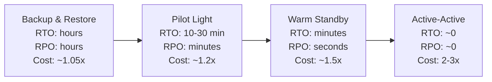
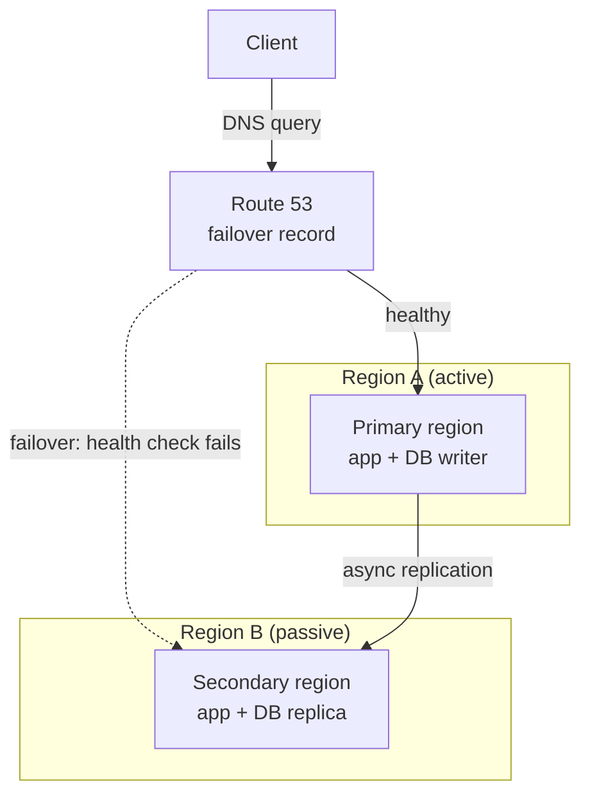
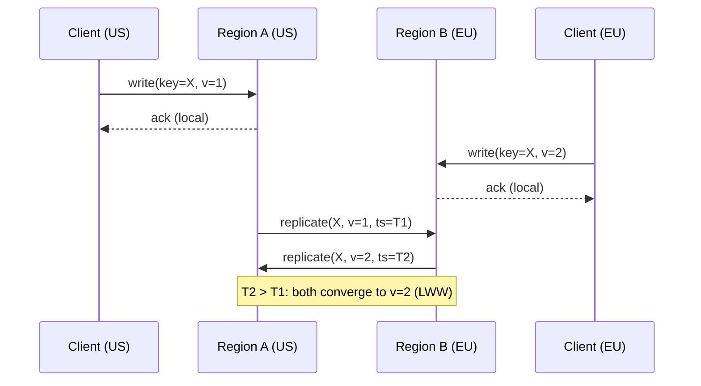
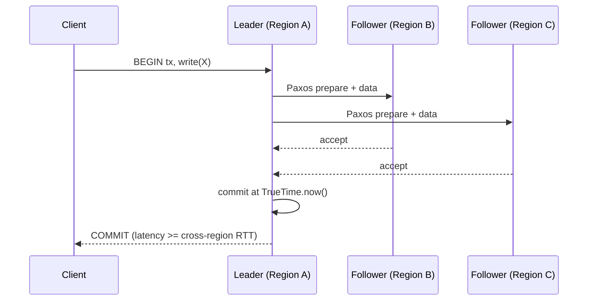

# Multi-Region Architecture: Active-Passive, Active-Active, and CRDTs

> **TL;DR**: A cloud region is a failure domain that eventually goes dark. On 7 December 2021, AWS `us-east-1` lost EC2, ELB, and Route 53 control planes for seven hours[^1]. Multi-region architecture exists to survive these events, but it comes in tiers: active-passive gives you disaster recovery at modest cost; active-active gives you local-latency reads and writes everywhere at 2-3x cost plus the conflict-resolution tax. The central design question is whether you need strong consistency across regions (pay 80-200 ms per write) or can tolerate eventual consistency with last-write-wins, CRDTs, or home-region routing.

## Learning Objectives

After this module, you will be able to:

- [ ] Distinguish active-passive, active-active, and pilot-light DR models
- [ ] Calculate RTO and RPO for each approach and map them to cost tiers
- [ ] Design DNS and anycast routing for regional failover
- [ ] Reason about conflict resolution: last-write-wins, vector clocks, CRDTs, global consensus
- [ ] Choose among DynamoDB Global Tables, Aurora Global, Spanner, CockroachDB, and Cosmos DB for multi-region data
- [ ] Articulate the cost and complexity tax of active-active deployments

## Intuition

You run a chain of coffee shops in three cities. Each shop keeps its own cash register and inventory ledger. When a customer buys a bag of beans in Seattle, the Seattle ledger updates immediately. At the end of the day, each shop faxes its sales to headquarters, which reconciles the books overnight.

This is active-passive with batch reconciliation. Seattle is the "primary" for its own transactions. If the Seattle shop burns down, you still have yesterday's fax at HQ and can redirect customers to Portland. You lose today's sales (your RPO is one day), and it takes a few hours to set up the redirect (your RTO).

Now imagine all three shops share a single real-time inventory system. A customer in Seattle buys the last bag of a limited-edition roast at the same moment a customer in Portland buys the same bag. Both registers say "sold." You have a conflict. You can resolve it by timestamp (last-write-wins, one customer gets an apology email), by merging (CRDTs: the counter goes to -1 and you backorder), or by locking (consensus: one register waits for the other to confirm before completing the sale, adding 80 ms of cross-city delay).

That is the multi-region design space. The rest of this chapter makes it precise.

## Theory

### Why multi-region: failures, latency, and law

Availability zones fail routinely. Region failures are rarer but catastrophic. On 28 February 2017, an operator mistyped a capacity-removal command and took down the S3 index subsystem in `us-east-1` for four hours[^2]. On 25 November 2020, a thread-limit regression cascaded through Kinesis into a 17-hour outage affecting Cognito, CloudWatch, and Lambda[^3]. On 7 December 2021, an automated scaling action caused internal network congestion that impaired EC2, ELB, Route 53, and STS for seven hours[^1]. Google Cloud lost YouTube and Gmail for approximately four hours in June 2019[^4]. Azure Active Directory failed globally for approximately 14 hours in March 2021[^5].

Beyond availability, regulation forces multi-region. The GDPR restricts transfers of EU personal data outside the EEA. India's Digital Personal Data Protection Act 2023 gives the government authority to restrict cross-border transfers. Once you have regulated users in multiple jurisdictions, data residency becomes a legal invariant, not a performance optimization.

Finally, physics. Light takes 40 ms to cross the US round-trip, 80 ms to cross the Atlantic, and 180-200 ms to reach Singapore from Virginia. Serving users from a nearby region cuts tail latency dramatically.

[CAP and PACELC](../part-3-distributed-systems-theory/03-cap-and-pacelc.md) established that under a network partition you must choose between consistency and availability. Cross-region links are the most partition-prone paths in your infrastructure. [Database Replication](../part-2-building-blocks/07-database-replication.md) introduced the replication mechanics that underpin every DR strategy below. This chapter applies both to the multi-region problem.

### RTO, RPO, and the disaster-recovery spectrum

Recovery Time Objective (RTO) is how long it takes to restore service. Recovery Point Objective (RPO) is how much data you lose, measured in time. The AWS Well-Architected DR whitepaper defines four tiers[^6]:

*As RTO and RPO shrink toward zero, infrastructure cost multiplies: backup-and-restore is cheap with hours of recovery; active-active is expensive with near-zero recovery.*

**Backup and restore** stores snapshots in a DR region. On failure, you redeploy infrastructure from scratch. Cheapest, but RTO is hours.

**Pilot light** keeps data replicated continuously (databases, object stores) but leaves compute off. On failover, you launch instances and promote replicas. RTO is tens of minutes.

**Warm standby** runs a scaled-down but live replica. It can absorb initial traffic immediately and auto-scale to full capacity. RTO is minutes.

**Active-active** runs full capacity in every region. Traffic concentrates in surviving regions on failure. RTO is near zero.

The critical insight: failover that depends on control-plane operations (launching EC2, changing DNS records, promoting replicas) is itself vulnerable to the outage. During the December 2021 AWS event, the EC2 launch API and Route 53 record changes were impaired for hours[^1]. Your DR plan must use data-plane operations (already-provisioned capacity, pre-configured routing) whenever possible.

### DNS and anycast for regional failover

DNS-based failover uses Route 53 health checks (running every 10 or 30 seconds) to detect a dead region and swing traffic to a healthy one. Changes propagate to Route 53 edge locations within 60 seconds, but end-user resolvers cache answers for the TTL. Real-world DNS failover takes 1-5 minutes, not seconds.

Anycast is faster. Cloudflare and AWS Global Accelerator announce the same IP from every PoP via BGP. If a PoP disappears, BGP withdraws its route and traffic steers elsewhere in seconds, without waiting on DNS TTL. Cloudflare announces its IP space from 330+ cities[^7]. The trade-off: anycast requires running the same stack at every PoP.

> [!TIP]
> Keep DNS TTLs at 60 seconds for failover records. Accept the resolver-caching tail. For sub-second failover, use anycast or Global Accelerator instead of DNS record swaps.

### Active-passive mechanics

One region (primary) serves all reads and writes. A secondary region runs an async replica and enough infrastructure to take over on failover.

*DNS health checks detect primary failure and swing traffic to the secondary; the secondary promotes its async replica to primary on cutover.*

RPO equals replication lag at the moment of failure. Aurora Global Database replicates with typical lag under one second and can promote a secondary in under one minute[^8]. Shopify runs paired data centers per pod; their Pod Mover tool relocates a pod in about one minute without dropping requests[^9].

The operational risk: a secondary that is never exercised will not work when you need it. Treat failover as a first-class production operation. Run it on a schedule, not only during incidents.

### Active-active: all regions serve writes

Every region accepts reads and writes. Data replicates between regions asynchronously or via consensus. Conflicts are either prevented by routing or resolved after the fact.

*Both regions accept writes locally and replicate asynchronously; a conflicting update is resolved by last-write-wins on arrival.*

The benefit: no user-visible failover. Traffic concentrates in surviving regions automatically. Read latency is always local.

The cost: conflict resolution is unavoidable for any data written in two regions simultaneously. And the infrastructure bill roughly doubles. AWS inter-region data transfer costs approximately $0.02 per GB[^10]. A service replicating 5 TB/month between `us-east-1` and `eu-west-1` pays $100/direction just for replication, before application-level chatter.

### Conflict resolution: the spectrum

When two regions accept a write to the same item within the replication window, the system must converge. Four strategies exist, ordered by complexity:

**Last-write-wins (LWW).** DynamoDB Global Tables (MREC mode) stores a hidden timestamp per item. On replication, the later timestamp wins. The earlier write is silently discarded, not logged to CloudTrail or CloudWatch[^11]. Simple and predictable for user-scoped data. A data-loss footgun for shared state.

**Vector clocks.** Record which replica has seen which updates. Flag true concurrent writes for application-level merging. The original Dynamo 2007 design used this approach. More correct than LWW but pushes complexity to the application.

**CRDTs.** Data structures whose merge operation is commutative, associative, and idempotent. Replicas converge regardless of delivery order. [CRDTs: Conflict-Free Replicated Data Types](../part-3-distributed-systems-theory/05-crdts.md) covers the theory in depth. CRDTs work for counters, sets, registers, and some text structures. They do not work for uniqueness constraints or cross-entity invariants.

**Global consensus.** Paxos or Raft serializes writes through a quorum, forcing each write to wait for at least one cross-region round trip. No conflicts, but 80-200 ms added to every write. [Consensus Protocols: How Distributed Systems Agree](../part-3-distributed-systems-theory/00-consensus-protocols.md) covers the mechanics.

### Global strong-consistency databases

Some databases pay the cross-region coordination tax so application code stays simple:

**Google Spanner** runs 2PC over Paxos-replicated shards and uses TrueTime, an atomic-clock and GPS-backed API that exposes bounded clock uncertainty, to order transactions globally without coordinating on every read[^12]. The trick is not Paxos (many systems do Paxos). It is using hardware clocks to make reads wait only for the uncertainty interval rather than a full round trip.

**CockroachDB** replaces atomic clocks with a Hybrid Logical Clock (physical NTP time plus a logical counter) and Raft per range. It is open-source, Spanner-inspired SQL[^13]. The trade-off: NTP clock skew can cause transaction restarts that TrueTime avoids.

**YugabyteDB** takes a similar Raft-per-tablet approach with PostgreSQL wire compatibility.

**DynamoDB Global Tables MRSC** (multi-region strong consistency, GA June 2025) replicates writes synchronously to at least one other region before acknowledging. Limited to exactly three regions from one region set. Write latency equals the nearest-replica round-trip[^11].

**Aurora Global Database** replicates asynchronously with lag typically under one second. It is a DR and local-read feature, not a globally consistent database[^8].

**Azure Cosmos DB** exposes five configurable consistency levels. Strong consistency costs roughly 2x the round-trip between the two farthest regions on every write and is blocked by default for accounts whose regions are more than about 8,000 km apart.

*A strongly consistent write pays at least one cross-region round trip for Paxos quorum before acknowledging the client; Spanner uses TrueTime to avoid coordinating on reads.*

### The Cloudflare model: anycast plus per-object singletons

Cloudflare takes a different approach. Every PoP runs the full software stack. BGP anycast routes each client to the nearest location. For state, Cloudflare offers two primitives at opposite ends of the consistency spectrum:

**Workers KV** is eventually consistent with last-writer-wins. Good for rarely-changing configuration and static assets.

**Durable Objects** are globally unique per identifier. Each object exists in exactly one location, is single-threaded, and can be transparently migrated closer to where it is used. This sidesteps CRDTs entirely: instead of replicating state and merging conflicts, you route requests to the single authoritative coordinator for that object.

The Durable Objects blog explicitly argues that CRDTs are often "overly complex and not worth the effort" and that a single-point-of-truth per logical unit of state is the pragmatic alternative. The trade-off: each object's throughput is bounded by a single machine.

This pattern works well for chat rooms, documents, shopping carts, rate limiters, and IoT devices, anywhere the state has a natural "owner" that serializes access.

### Cell-based architecture and blast radius

Shopify's pod architecture demonstrates a powerful pattern: shard your state so that cross-region failover becomes per-shard, not per-service. Each pod is a fully isolated set of datastores (MySQL, Redis, Memcached) containing a subset of shops. A component called Sorting Hat in the load balancer routes each request to the correct pod. No cross-pod writes exist, which eliminates the conflict-resolution problem entirely[^9].

Pod-level DR means evacuating a data center is just evacuating each pod one at a time. The data center is never the unit of recovery. This limits blast radius: a bad deploy or data corruption affects one pod, not the entire fleet.

Cell-based architecture generalizes this idea. Each cell is a self-contained unit of deployment with its own data, compute, and failure boundary. See [Graceful Degradation](../part-6-reliability-and-operations/03-graceful-degradation.md) for related patterns on limiting blast radius.

## Real-World Example

Netflix built full active-active across `us-east-1` and `us-west-2` for the North American user-call path[^14]. The architecture:

- **Stateless services** deploy identically in both regions.
- **User-session data** lives in Apache Cassandra with asynchronous multi-region replication. Netflix tested writing 1,000,000 records in one region and reading them in the other after 500 ms under production load, all records present[^14].
- **EVCache** (memcached-based) fronts hot state with remote cache invalidation over SQS. Rather than replicating the cache itself, a write in Region A invalidates the corresponding key in Region B's cache. On the next read, Region B falls through to Cassandra.
- **Zuul** at the edge enforces geo-directional routing, handles mis-routed requests, and sheds load under thundering-herd conditions.
- **DNS** is driven through Denominator against both UltraDNS (directional routing) and Route 53 (fast CNAME swings).

All user-facing reads and writes use Cassandra's `LOCAL_QUORUM`, so each region is independent of cross-region RTT for consistency. This is the key design decision: by accepting eventual consistency for user data (profiles, viewing history, recommendations), Netflix avoids the cross-region write-latency tax entirely.

Netflix credits Chaos Kong exercises, full-region evacuation drills run every few weeks with a target of under 10 minutes, with insulating them from real AWS events. A prior real failover was triggered by a degraded internal service; Netflix swung traffic to the healthy region within minutes, restored quality of service, then diagnosed the issue before shifting back[^14].

The lesson: active-active is not just an architecture. It is an operational discipline. Without regular drills, the failover path rots.

## Trade-offs

| Approach | Pros | Cons | Best when | Our Pick |
|---|---|---|---|---|
| Single region | Simple, cheap, no conflicts | Region = SPoF, cannot satisfy multi-jurisdiction residency | Early stage, non-critical workloads | Start here, plan your exit |
| Warm standby (active-passive) | Minutes RTO, seconds RPO, operationally simple | Idle capacity, failover drill needed, replica lag at cutover | Clear DR requirement, predictable failover cadence | Default for most production systems |
| Active-active async (LWW) | Local reads and writes, no visible failover | Eventual consistency, silent write loss on conflict | User-scoped data, tolerant of conflict or partitioned by user | When data has a natural home region |
| Active-active with CRDTs | Math-guaranteed convergence under partition | Narrow data-shape fit, complex debugging | Counters, sets, presence, carts | Only for CRDT-shaped data |
| Active-active sync (Spanner-style) | Globally consistent, RPO zero | 80-200 ms write latency, expensive, region-set constraints | Financial transactions, ticketing, uniqueness invariants | When correctness trumps latency |

## Common Pitfalls

> [!WARNING]
> **Silent data loss with LWW.** DynamoDB Global Tables MREC discards the "losing" write without logging it to CloudTrail or CloudWatch[^11]. If two regions write the same item within the replication window, one update vanishes silently. Mitigate by routing each user's writes to a single home region, or use MRSC where concurrent conflicts return an explicit error.

> [!WARNING]
> **Failover that has never been rehearsed.** DR drills slip. Control-plane APIs (IAM, EC2 launch, DNS changes) are assumed to work during failure but are themselves impaired. The December 2021 AWS event is the reference case: the Service Health Dashboard itself could not fail over[^1]. Treat failover as a production operation. Run it on a schedule.

> [!WARNING]
> **DNS TTL as a latency floor.** Even Route 53's 60-second minimum TTL plus resolver caching gives 1-5 minutes of tail failover time. For sub-second failover, use anycast (Global Accelerator, Cloudflare) instead of DNS record swaps.

> [!WARNING]
> **Cross-region egress cost explosion.** AWS inter-region transfer is $0.02/GB[^10]. Chatty microservices spanning regions compound this fast. Co-locate communicating services inside a region; use CDN caches for static assets; trace cross-region request paths and eliminate unnecessary ones.

> [!WARNING]
> **The write-latency tax surprise.** A design that looked fast in a single region becomes unusable globally when every write includes an 80-200 ms cross-region round trip. Load-test write latency from every region before going live. Use strong consistency only for transactions that truly need it; keep everything else at session or eventual.

## Exercise

Design multi-region for a fintech that must survive a region outage with less than 5-minute RTO, data loss under 1 second, and regulatory data residency in EU and US. Pick database and replication model, design failover, and estimate cost delta vs single-region.

Hint

The data-residency constraint means EU user data must stay in an EU region and US user data in a US region. This is not a single global database problem. Think about which data needs strong consistency (account balances, transactions) versus which can be eventually consistent (notifications, analytics). Consider the Shopify pod pattern: shard by jurisdiction.

Solution

**Architecture:** Two primary regions: `eu-west-1` (EU users) and `us-east-1` (US users). Each region is authoritative for its jurisdiction's data. Use CockroachDB or Spanner with region-pinned partitions: EU user rows live in EU replicas, US user rows in US replicas. Transactions touching only local data pay no cross-region latency.

**Failover:** Within each jurisdiction, run warm standby in a second region (`eu-central-1`, `us-west-2`). Aurora Global Database or CockroachDB multi-region with survival goals set to "region" gives sub-second RPO and sub-minute RTO for intra-jurisdiction failover. Route 53 health checks with 60-second TTL trigger DNS failover.

**Cross-jurisdiction reads:** A US compliance officer querying EU data routes through an API gateway in the EU region. Data never leaves the EU; only the query result crosses the boundary, satisfying GDPR.

**Cost estimate:** Warm standby in a second region per jurisdiction adds roughly 1.5x compute cost (scaled-down replicas, always-on databases). Cross-region replication bandwidth for a fintech with 10 TB of transaction data and 1 GB/day of new writes is negligible ($0.60/day). Total: approximately 1.6-1.8x single-region cost, well below the 2-3x of full active-active.

**RTO/RPO achieved:** RPO under 1 second (synchronous replication within jurisdiction). RTO under 5 minutes (warm standby with pre-provisioned capacity, no control-plane dependency for failover).

## Key Takeaways

- Active-passive is a DR strategy; active-active is a latency and resilience strategy. Different goals, different costs, different complexity.
- The DR tier ladder (backup, pilot light, warm standby, active-active) maps directly to cost multipliers from 1.05x to 3x.
- Failover that depends on control-plane operations fails when the control plane is the thing that is down.
- LWW conflict resolution silently loses data. Route writes to a home region or use strong consistency if you cannot tolerate silent loss.
- CRDTs guarantee convergence but only for data shapes that admit a commutative merge. Most business domains need consensus somewhere.
- Global strong consistency (Spanner, CockroachDB, DynamoDB MRSC) costs 80-200 ms per write. Design UX accordingly.
- Cell-based architecture (Shopify pods) limits blast radius by making the shard, not the region, the unit of recovery.

## Further Reading

- [Spanner: Google's Globally-Distributed Database (Corbett et al., OSDI 2012)](https://www.usenix.org/conference/osdi12/technical-sessions/presentation/corbett) - The TrueTime paper; the canonical reference for global strong consistency and why atomic clocks matter.
- [Netflix: Active-Active for Multi-Regional Resiliency](https://netflixtechblog.com/active-active-for-multi-regional-resiliency-c47719f6685b) - End-to-end narrative of moving a streaming service active-active with Cassandra, EVCache, and Zuul.
- [AWS Summary of the Service Event in us-east-1 (Dec 7 2021)](https://aws.amazon.com/message/12721/) - The reference post-mortem for why control-plane-dependent DR fails; even Amazon's own dashboard could not fail over.
- [Disaster Recovery Options in the Cloud (AWS Well-Architected)](https://docs.aws.amazon.com/whitepapers/latest/disaster-recovery-workloads-on-aws/disaster-recovery-options-in-the-cloud.html) - The authoritative four-tier DR taxonomy with cost and RTO/RPO guidance.
- [Cloudflare: A New Approach to Stateful Serverless (Durable Objects)](https://blog.cloudflare.com/introducing-workers-durable-objects/) - The single-coordinator alternative to CRDTs for edge state; read for the opinionated argument against CRDT complexity.
- [A Pods Architecture To Allow Shopify To Scale](https://shopify.engineering/a-pods-architecture-to-allow-shopify-to-scale) - Shard-level DR that decouples blast radius from data-center boundary; the under-appreciated answer to multi-region complexity.
- [Azure Cosmos DB Consistency Levels](https://learn.microsoft.com/en-us/azure/cosmos-db/consistency-levels) - The clearest public exposition of the five-level consistency spectrum from strong to eventual.
- [Verifying Strong Eventual Consistency in Distributed Systems (Kleppmann et al., OOPSLA 2017)](https://arxiv.org/abs/1707.01747) - Formal framework for CRDT correctness; ground truth for what CRDTs can and cannot guarantee.

## Flashcards

**Q:** What is the difference between RTO and RPO?
**A:** RTO (Recovery Time Objective) is how long it takes to restore service after failure. RPO (Recovery Point Objective) is how much data you lose, measured in time. A system with RPO of 1 second loses at most 1 second of writes on failure.

**Q:** Name the four DR tiers in order of increasing cost and decreasing RTO.
**A:** Backup-and-restore (hours RTO, ~1.05x cost), pilot light (tens of minutes, ~1.2x), warm standby (minutes, ~1.5x), active-active (near-zero, 2-3x cost).

**Q:** Why is DNS-based failover slower than anycast-based failover?
**A:** DNS answers are cached by intermediate resolvers for the TTL duration. Even with a 60-second TTL, real-world DNS failover takes 1-5 minutes. Anycast uses BGP route withdrawal, which steers traffic in seconds without waiting on cached DNS entries.

**Q:** What is the silent data-loss risk with DynamoDB Global Tables MREC?
**A:** MREC uses last-write-wins based on a hidden timestamp. If two regions write the same item within the replication window, the earlier write is silently discarded without logging to CloudTrail or CloudWatch.

**Q:** How does Spanner achieve global strong consistency without coordinating on every read?
**A:** Spanner uses TrueTime (atomic clocks + GPS) to bound clock uncertainty. A read at timestamp T waits only for the uncertainty interval to pass, then reads locally without cross-region coordination. Writes still require cross-region Paxos quorum.

**Q:** What is the cross-region write-latency tax for strong consistency?
**A:** 80-200 ms per write, depending on region distance. US-to-Europe is approximately 80 ms round-trip; US-to-Singapore is 180-200 ms. Every strongly consistent write pays at least one such round trip.

**Q:** How does Cloudflare's Durable Objects avoid CRDT complexity?
**A:** Each Durable Object has a globally unique ID and exists in exactly one location. All requests for that object route to its single coordinator, which is single-threaded. This eliminates conflicts by construction rather than resolving them after the fact.

**Q:** What is cell-based architecture and how does it help multi-region DR?
**A:** Cell-based architecture (e.g., Shopify pods) shards state into isolated units, each with its own data and compute. Failover becomes per-cell rather than per-region, limiting blast radius and eliminating cross-cell conflicts.

**Q:** Why did the December 2021 AWS us-east-1 outage demonstrate the danger of control-plane-dependent DR?
**A:** The outage impaired EC2 launch, ELB provisioning, and Route 53 record changes for hours. Any DR plan that required launching new instances or changing DNS records during the outage could not execute. Only pre-provisioned data-plane capacity survived.

**Q:** When should you choose active-active sync (Spanner-style) over active-active async (LWW)?
**A:** Choose sync when correctness trumps latency: financial transactions, ticket inventory, uniqueness constraints. Choose async when data is user-scoped, conflicts are rare or tolerable, and local write latency matters more than global consistency.

## References

[^1]: "Summary of the AWS Service Event in the Northern Virginia (US-EAST-1) Region," AWS, 10 December 2021. https://aws.amazon.com/message/12721/
[^2]: "Summary of the Amazon S3 Service Disruption in the Northern Virginia (US-EAST-1) Region," AWS, 28 February 2017. https://aws.amazon.com/message/41926/
[^3]: "Summary of the Amazon Kinesis Event in the Northern Virginia (US-EAST-1) Region," AWS, 25 November 2020. https://aws.amazon.com/message/11201/
[^4]: "Google Cloud Networking Incident #19009," Google Cloud Status Dashboard, 2 June 2019. https://status.cloud.google.com/incident/cloud-networking/19009
[^5]: Sergiu Gatlan, "Microsoft explains the cause of yesterday's massive service outage" (quoting Microsoft's official RCA for the 15 March 2021 Azure AD outage), BleepingComputer, 16 March 2021. https://www.bleepingcomputer.com/news/microsoft/microsoft-explains-the-cause-of-yesterdays-massive-service-outage/
[^6]: "Disaster recovery options in the cloud," AWS Well-Architected, Disaster Recovery of Workloads on AWS. https://docs.aws.amazon.com/whitepapers/latest/disaster-recovery-workloads-on-aws/disaster-recovery-options-in-the-cloud.html
[^7]: "Cloudflare Global Network," Cloudflare. https://www.cloudflare.com/network/
[^8]: "Using Amazon Aurora Global Database," AWS. https://docs.aws.amazon.com/AmazonRDS/latest/AuroraUserGuide/aurora-global-database.html
[^9]: Xavier Denis, "A Pods Architecture To Allow Shopify To Scale," Shopify Engineering, 2 March 2018. https://shopify.engineering/a-pods-architecture-to-allow-shopify-to-scale
[^10]: "Amazon EC2 On-Demand Pricing: Data Transfer," AWS. https://aws.amazon.com/ec2/pricing/on-demand/#Data_Transfer
[^11]: "Using DynamoDB global tables," AWS. https://docs.aws.amazon.com/amazondynamodb/latest/developerguide/bp-global-table-design.html
[^12]: Corbett et al., "Spanner: Google's Globally-Distributed Database," OSDI 2012. https://www.usenix.org/conference/osdi12/technical-sessions/presentation/corbett
[^13]: "CockroachDB: The Resilient Geo-Distributed SQL Database," SIGMOD 2020. https://www.cockroachlabs.com/guides/cockroachdb-the-resilient-geo-distributed-sql-database-sigmod-2020/
[^14]: Ruslan Meshenberg, Naresh Gopalani, Luke Kosewski, "Active-Active for Multi-Regional Resiliency," Netflix TechBlog, 2 December 2013. https://netflixtechblog.com/active-active-for-multi-regional-resiliency-c47719f6685b
