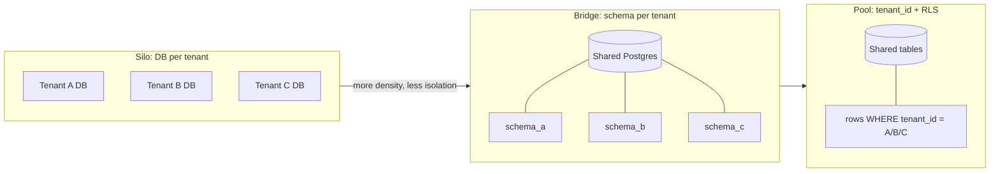
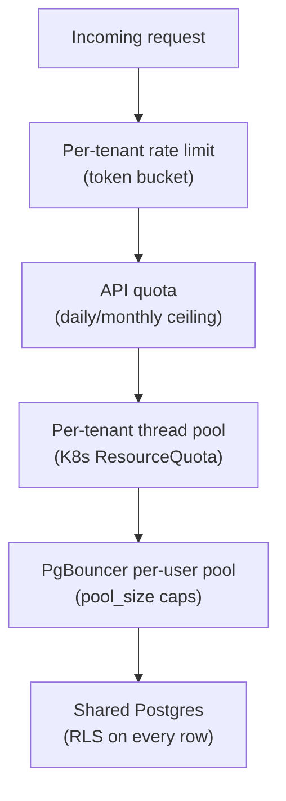
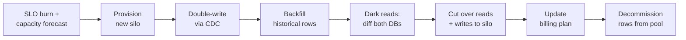
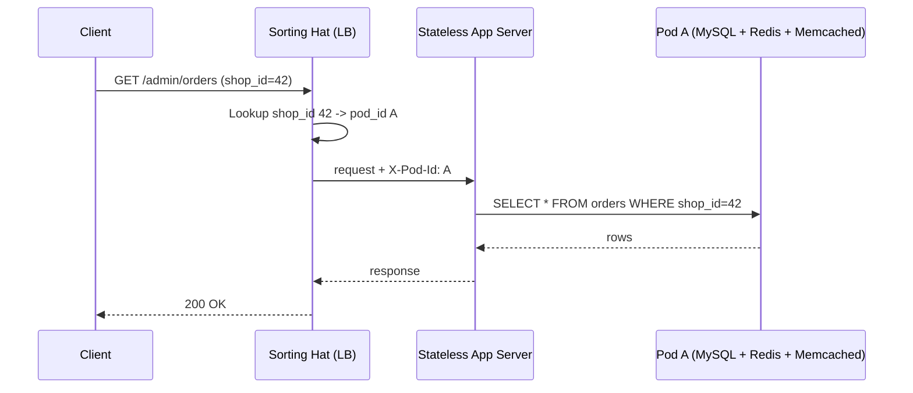

# Multi-Tenancy: Silo, Pool, and the SaaS Isolation Spectrum

> **TL;DR**: Multi-tenancy is the practice of hosting many customer organizations on shared infrastructure, with isolation enforced by software rather than by physically separate stacks. The choice lives on a spectrum: silo (dedicated resources per tenant) costs 10 to 100x more but gives clean compliance and zero blast radius; pool (shared tables with a `tenant_id` column) maximizes density but one missing `WHERE tenant_id = ?` becomes a cross-tenant data leak[^1]. Most production systems sit in the middle. Shopify packs shops into pods of shared datastores, handling 284 million edge requests per minute at BFCM 2024 peak[^2]. Salesforce pools thousands of orgs onto shared Oracle instances with governor limits as the noisy-neighbor shield[^3]. Design for the spectrum, not the binary.

## Learning Objectives

After this module, you will be able to:

- [ ] Place a workload on the silo-to-pool spectrum with justification
- [ ] Design noisy-neighbor defenses at rate-limit, quota, and scheduler layers
- [ ] Build per-tenant metering and cost-attribution pipelines
- [ ] Implement Postgres RLS as defense-in-depth for row-level tenant isolation
- [ ] Define SLA triggers that promote a tenant from pool to silo

## Intuition

You manage an apartment building. Every tenant shares the same plumbing, electrical grid, and elevator. This is pool multi-tenancy: cheap per unit, but one tenant running a washing machine at 2 AM shakes the pipes for everyone. If a tenant's water heater explodes, the whole floor floods.

Now imagine a gated community of detached houses. Each house has its own plumbing, its own breaker box, its own driveway. This is silo: expensive to build, but one house's burst pipe stays contained. The homeowner can renovate without a building permit from the HOA.

Most real developments are townhouses: shared walls and a common foundation, but separate utility meters and individual circuit breakers. One unit's electrical overload trips their breaker, not the building's main. This is the bridge model, and it is where most SaaS platforms land.

The engineering question maps directly: how much infrastructure do you share between customers, and what fences prevent one customer's behavior from degrading another's experience? [Database Partitioning and Sharding](../part-2-building-blocks/06-database-partitioning-sharding.md) introduced the mechanics of splitting data across nodes. This chapter asks the harder question: what you shard on (tenant_id), how isolated the shards are, and what happens when one tenant outgrows the shared infrastructure.

## Theory

### The three isolation levels

The AWS Well-Architected SaaS Lens defines three canonical models[^4]:

**Silo** gives each tenant dedicated infrastructure: their own database instance, their own compute, their own backup chain. Data isolation is physical. A cross-tenant breach is architecturally impossible. GDPR deletion is `DROP DATABASE`. The cost: 10 to 100x per tenant, and operational overhead that scales linearly with tenant count[^1].

**Pool** packs all tenants into shared tables. Every row carries a `tenant_id` column. Every query filters on it. Isolation is enforced by application logic and, ideally, by database-level Row-Level Security. Maximum density, minimum per-tenant cost, but one runaway query or one missed filter affects everyone[^1].

**Bridge** (also called "pod" or "schema-per-tenant") sits between them. Tenants share a database instance but each gets a dedicated schema or logical database. Per-tenant migrations are possible. `pg_dump -n tenantschema` gives easy backup. But Postgres catalog bloat becomes a hard limit: with 10,000 tenants and 50 tables each, you have 500,000 tables in `pg_class`, and every query plan pays the lookup cost[^5].



*Isolation is a continuum; cost-per-tenant and blast-radius move in opposite directions.*

The choice is not per-platform. It is per-tier, per-service, sometimes per-table. A startup pools everything. An enterprise customer on a $500K/year contract gets a silo. The 80% in between share a bridge. Schema-per-tenant breaks somewhere between 1,000 and 10,000 tenants depending on table count; Atlassian hit this wall with ~750+ Postgres clusters for its Forge plugin platform and migrated to ~16 TiDB clusters that still preserve one logical database per tenant[^5].

### Row-level security as defense-in-depth

The most common multi-tenant vulnerability is not an exotic exploit. It is a developer writing `SELECT * FROM orders WHERE order_id = ?` without a `tenant_id` clause. If `order_id` collides across tenants, you leak data.

Postgres Row-Level Security (RLS) makes this class of bug impossible at the database layer. You define a policy:

```sql
ALTER TABLE orders ENABLE ROW LEVEL SECURITY;

CREATE POLICY tenant_isolation ON orders
USING (tenant_id = current_setting('app.current_tenant')::UUID);
```

The application sets `app.current_tenant` at connection-acquire time. Every query, including admin scripts, ORM lazy loads, and background jobs, is automatically filtered. A missed `WHERE tenant_id = ?` returns zero rows instead of leaking data[^6].

AWS Prescriptive Guidance recommends the runtime-variable form over per-tenant Postgres roles because the latter forces one database user per tenant[^6]. RLS is defense-in-depth: the application still filters by `tenant_id` for performance (index usage), but the database guarantees correctness even when the application fails.

> [!IMPORTANT]
> **PgBouncer transaction-mode trap.** If you use PgBouncer in transaction mode, `SET app.current_tenant = 'A'` leaks to the next transaction's connection. Use `SET LOCAL` (scoped to the current transaction) or session-mode pooling for RLS-protected queries.

### Noisy-neighbor defenses

In a pool, one misbehaving tenant (a runaway integration, an infinite retry loop, a bulk export) can saturate shared resources and degrade every other tenant. Defense is layered:



*Defense-in-depth: each layer is independently effective and collectively sufficient.*

**Layer 1: Per-tenant rate limits.** Token buckets keyed on `tenant_id` at the API gateway. [Rate Limiting](../part-2-building-blocks/11-rate-limiting.md) covers the algorithms; the multi-tenant twist is that global rate limits are insufficient. A single tenant can consume the entire global budget.

**Layer 2: Resource quotas.** Salesforce's governor limits are the canonical example: max 100 SOQL queries, 150 DML operations, 10,000 ms CPU time, 6 MB heap, and 50,000 records per transaction[^7]. These are hard ceilings that throw exceptions, not soft warnings.

**Layer 3: Compute isolation.** Kubernetes `ResourceQuota` caps aggregate CPU and memory per tenant namespace. `LimitRange` caps per-pod defaults. Together they prevent one tenant's pods from starving others.

**Layer 4: Connection-pool allocation.** Postgres defaults to `max_connections = 100`. PgBouncer multiplexes thousands of client connections onto tens of backend connections, but without per-user `pool_size` limits, one tenant can monopolize the pool[^8].

### Whale graduation from pool to silo

The 80/20 rule applies to SaaS: a small fraction of tenants (often 1 to 10%) drive most of the load. When one tenant threatens shared-infra SLOs, you graduate it from pool to silo.

Detection signals: per-tenant CPU percentage, connection count, data volume growth rate, and error-budget burn on per-tenant SLOs.

The graduation is a migration runbook, not a single command:



*Graduating a whale from pool to silo is a seven-step migration; each step can fail and retry independently.*

Shopify's Pod Mover can failover a pod to its recovery data center in a minute without dropping requests[^9], and its shard-balancing tooling moves shops between shards with zero consumer-facing downtime[^10]. Notion used a similar pattern during their 2021 sharding migration: double-write via an audit log, backfill historical data, run dark reads comparing both databases, and cut over only after verification passed[^11].

The key insight: design the graduation path before the first whale arrives. Ad-hoc promotion under pressure is where cross-tenant bugs hide.

### Per-tenant metering as a product feature

Metering is not an afterthought. The AWS SaaS Lens treats expenditure awareness as a core best practice within its Cost Optimization pillar[^12]. Without cost-per-tenant, you cannot price, cannot identify bad-margin tenants, and cannot justify whale-tier pricing.

The pattern: instrument every billable action to emit an event tagged with `tenant_id`, `meter_name`, `value`, and `timestamp`. Common usage types:

- **API calls** (count per endpoint per tenant)
- **Storage** (GB-months of data retained)
- **Compute** (CPU-seconds or GPU-seconds consumed)
- **Bandwidth** (GB transferred)

Stripe's Meter Events API expects `event_name`, `customer_id` (maps to tenant), a numerical value, and an optional idempotency identifier[^13]. Real-time streaming wins for usage gates (stop-the-line at prepaid limit); batch daily aggregation wins for cost attribution reporting.

The litmus test: "What is the unit cost of serving tenant X this month?" If the answer takes more than a day, metering is not a first-class feature.

### Data residency and crypto-shredding

GDPR Article 17 grants the right to erasure, and Article 12(3) requires the controller to act on such requests without undue delay and in any event within one month of receipt (extendable by two further months for complex cases); non-compliance carries fines up to 20 million euros or 4% of total worldwide annual turnover of the preceding financial year, whichever is higher, under Article 83(5)[^14]. CNIL (France's regulator) levied 55.2 million euros across 87 sanctions in 2024[^15].

For pool databases with backups, logs, and data-warehouse copies, physically finding and deleting every tenant row is hard. Crypto-shredding is the idiomatic fix[^16]: encrypt all of a tenant's data with a tenant-specific key in a KMS. On erasure request, delete the key. The data becomes unreadable across every copy, backup, and log, without a distributed delete.

Architecture implications:

- **Per-region data planes.** A French healthcare tenant's data stays in eu-west-1. Slack offers workspace-level data residency tied to specific regions[^17].
- **Tenant-specific encryption keys.** Each tenant gets a KMS key. Rotation, access logging, and deletion are per-tenant operations.
- **Backup granularity.** In silo, per-tenant PITR is native (restore one instance). In pool, you must either extract per-tenant rows during every backup (operational overhead linear in tenant count) or restore the entire multi-tenant snapshot to a temp database and extract from there[^18].

## Real-World Example

### Shopify Pods: the bridge model at mega-scale

Shopify's pod architecture emerged in 2016 after database sharding (2015) fixed scale but broke resilience: any single shard outage took down platform-wide operations[^9]. The solution was full isolation per pod.

A pod is a set of shops that live on a fully isolated set of datastores: its own MySQL shard, Redis cluster, Memcached pool, and cron scheduler. Stateless app servers are shared but pinned to one pod per request via the "Sorting Hat" load balancer, which looks up `shop_id` to `pod_id` and adds a header that the app uses to select the right datastores[^9].

At BFCM 2024, Shopify handled 284 million edge requests per minute, 80 million app-server requests per minute, 10.5 trillion database queries, and 1.17 trillion database writes across the event[^2].



*Every request is pinned to exactly one pod; the pod owns the full datastore slice for that shop.*

Key engineering decisions:

- **No cross-pod runtime dependencies.** A pod failure cannot spiral to a platform outage.
- **Sharding key is `shop_id`.** Data co-locates per merchant for cheap intra-tenant queries.
- **Pod Mover solves whale graduation.** A growing merchant moves to a less-loaded pod with zero consumer-facing downtime[^10].
- **Modular monolith over microservices.** Operational simplicity within each pod. [Monolith vs Microservices](./00-monolith-vs-microservices.md) explains why this trade-off works at Shopify's scale.

## Trade-offs

| Isolation Level | Pros | Cons | Best When | Our Pick |
|---|---|---|---|---|
| Silo (per-tenant infra) | Strong isolation, regulatory clean, simple blame | 10 to 100x cost, ops overhead per instance | Enterprise compliance, <200 tenants | Whale tier and regulated verticals |
| Pool, shared schema (`tenant_id`) | Max density, simple deploys | Noisy-neighbor risk, RLS complexity | Startups, uniform tenant size | **Default for self-serve tier** |
| Pool, schema-per-tenant | Per-tenant migrations, clean catalog views, `pg_dump -n` backup | Postgres catalog bloat above ~1K tenants, migration fanout, DDL cost scales linearly | Mid-stage SaaS with contractual per-tenant schema customization (ISV platforms, regulated verticals with per-customer audit schemas) | Narrow fit. Stay below ~1K tenants, or plan a TiDB/Citus migration path (see pitfall on catalog bloat) |
| Bridge/Pod (shards of silos) | Scale-out by pod, stable mapping | Rebalancing complexity | High scale, 10K+ tenants | **Default for growth-stage SaaS** |

## Common Pitfalls

> [!WARNING]
> **The forgotten tenant_id filter.** A `SELECT * FROM orders WHERE order_id = ?` with no tenant_id clause returns other tenants' rows if IDs collide. This is how most multi-tenant SaaS breaches actually happen. Mitigation: Postgres RLS turns a missed filter into an empty result set, not a data leak. Pair with ORM scoping plugins that panic on unscoped queries in test mode.

> [!WARNING]
> **No per-tenant rate limits.** Global rate limits cap total QPS but let a single tenant consume all of it. One noisy tenant saturates the connection pool (Postgres default `max_connections = 100`) and every other tenant's latency spikes. Fix: token bucket per `tenant_id` at the gateway, plus PgBouncer per-user `pool_size`.

> [!WARNING]
> **Metering added as an afterthought.** Pricing changes require code deploys in 20 microservices; cost-per-tenant is a quarterly spreadsheet exercise. Emit `tenant_id`-tagged usage events from day one, even if unused. The AWS SaaS Lens treats this as a core best practice.

> [!WARNING]
> **Catalog bloat in schema-per-tenant.** With 10,000 tenants and 50 tables each, you have 500,000 entries in `pg_class`. Every query plan pays the catalog lookup cost. Atlassian reported "metadata explosion (hundreds of millions of objects)" as a hard limit before migrating to TiDB[^5]. Do not schema-per-tenant above ~1,000 tenants without distributed SQL.

> [!WARNING]
> **Backup is not tenant-scoped.** A tenant asks for PITR to yesterday; in a pool DB, you either restore everyone (unacceptable) or restore to a temp DB and extract (slow). Design crypto-shredding and per-tenant extraction tooling before the first deletion request arrives.

## Exercise

Design the tenant-isolation strategy for a multi-tenant analytics platform with 50K tenants where 10 tenants drive 40% of load. Justify pool-vs-silo per tier, define the whale-promotion SLA trigger, and sketch the migration runbook (data copy, cutover, DNS, billing split).

<details>
<summary>Hint</summary>

The 10 whale tenants need isolation from the 49,990 others. But do all 49,990 need the same treatment? Think about three tiers: whale (silo), mid-tier (bridge/pod), and self-serve (pool). The SLA trigger should be measurable without human judgment: a metric crossing a threshold, not "it feels slow."

</details>

<details>
<summary>Solution</summary>

**Tier design:**

- **Self-serve (49,900 tenants):** Pool with shared schema, `tenant_id` column, Postgres RLS. Per-tenant rate limits at 100 QPS. K8s ResourceQuota per namespace. Cost: ~$0.50/tenant/month infrastructure.
- **Mid-tier (90 tenants):** Bridge model with schema-per-tenant on a dedicated Postgres cluster. Per-tenant PgBouncer pool_size. Allows per-tenant migrations and `pg_dump` backup. Cost: ~$50/tenant/month.
- **Whale (10 tenants):** Silo with dedicated RDS instances, dedicated Redis, dedicated compute namespace. Full PITR, tenant-specific KMS keys, custom SLAs. Cost: ~$5,000/tenant/month.

**Whale-promotion SLA trigger:**

Promote when any two of: (1) tenant's p99 latency exceeds 500 ms for 3 consecutive days, (2) tenant consumes >5% of shared cluster CPU averaged over 24 hours, (3) tenant's data volume exceeds 100 GB (approaching per-shard limits).

**Migration runbook:**

1. Provision new RDS instance in the whale's preferred region.
2. Enable CDC (logical replication) from pool shard to new instance, filtering on `tenant_id`.
3. Backfill historical rows via `pg_dump` with `WHERE tenant_id = X`.
4. Run dark reads for 48 hours: query both databases, compare results, log discrepancies.
5. Cut over: update Sorting Hat routing to point tenant to new instance. Reads and writes now hit silo.
6. Update billing system to whale-tier pricing.
7. After 7-day bake period, delete tenant rows from pool and reclaim space with `VACUUM`.

**Trade-off accepted:** The 90 mid-tier tenants share a bridge cluster that could still experience noisy-neighbor effects between each other. This is acceptable because their individual load is 10x smaller than the whales, and per-tenant rate limits cap the blast radius.

</details>

## Key Takeaways

- Isolation is a spectrum, not a binary. Pick per-tier, per-service, sometimes per-table.
- The `tenant_id` column is the multi-tenant shard key. Postgres RLS makes a missed filter return empty rows instead of leaking data.
- Noisy-neighbor defense is a stack: rate limit, quota, scheduler, connection pool. Each layer is independently effective.
- Schema-per-tenant breaks between 1,000 and 10,000 tenants due to Postgres catalog bloat. Use pool-with-RLS or distributed SQL beyond that.
- Metering is a product feature, not an ops afterthought. Without cost-per-tenant, you cannot price.
- Whales are inevitable. Design the graduation path (double-write, dark-read, cutover) before the first one capsizes the pool.
- Crypto-shredding (delete the tenant's KMS key) is the only practical way to honor GDPR erasure across backups, logs, and warehouse copies.

## Further Reading

- [AWS SaaS Lens (Well-Architected)](https://docs.aws.amazon.com/wellarchitected/latest/saas-lens/saas-lens.html) - The canonical silo/pool/bridge framework with explicit pillars for tenant isolation, metering, and operations.
- [Shopify: A Pods Architecture To Allow Shopify To Scale](https://shopify.engineering/a-pods-architecture-to-allow-shopify-to-scale) - Primary source for the bridge/pod model at scale; covers Sorting Hat, Pod Mover, and DR pairs.
- [Notion: Herding elephants, sharding Postgres at Notion](https://www.notion.so/blog/sharding-postgres-at-notion) - The zero-downtime migration playbook (double-write, catch-up, dark reads) that maps directly to whale graduation.
- [Salesforce Platform Multitenant Architecture](https://architect.salesforce.com/fundamentals/platform-multitenant-architecture) - The metadata-driven pool model with governor limits and pivot tables; the extreme end of shared-schema density.
- [AWS: Multi-tenant data isolation with PostgreSQL RLS](https://aws.amazon.com/blogs/database/multi-tenant-data-isolation-with-postgresql-row-level-security/) - Reference implementation with CloudFormation and Spring Boot sample code.
- [AWS Database Blog: Backup and recovery in a multi-tenant SaaS application](https://aws.amazon.com/blogs/database/managed-database-backup-and-recovery-in-a-multi-tenant-saas-application/) - Per-tenant PITR patterns by isolation model; the hard case of pool-model restore.
- [Stripe: Usage-based billing meter events](https://docs.stripe.com/billing/subscriptions/usage-based/meters/configure) - The API for tenant-tagged usage events; the integration point for metering pipelines.
- [How Atlassian Scaled to 3M+ Tables: Multi-Tenancy with TiDB](https://www.pingcap.com/blog/how-atlassian-scaled-three-million-tables-multi-tenancy-tidb) - Real numbers on Postgres schema-per-tenant limits and the migration to distributed SQL.

## Flashcards

**Q:** What are the three canonical multi-tenancy isolation models?
**A:** Silo (dedicated infrastructure per tenant), pool (shared tables with tenant_id filtering), and bridge (shared instance, per-tenant schema or logical database). Most real systems use a hybrid across tiers.

**Q:** What is the primary risk of pool multi-tenancy with shared schema?
**A:** A missing `WHERE tenant_id = ?` clause in any query can leak data across tenants. This is the most common multi-tenant vulnerability in practice.

**Q:** How does Postgres Row-Level Security (RLS) defend against cross-tenant leaks?
**A:** RLS enforces a `tenant_id = current_setting('app.current_tenant')` predicate on every SELECT/INSERT/UPDATE/DELETE before the application sees rows. A missed filter returns zero rows instead of leaking data.

**Q:** Why does schema-per-tenant break at scale?
**A:** Postgres system catalogs (pg_class, pg_attribute) grow linearly with table count. At 10,000 tenants with 50 tables each, you have 500,000 catalog entries, causing query-planner stress and slow DDL operations.

**Q:** What is the noisy-neighbor defense stack for multi-tenant systems?
**A:** Four layers: (1) per-tenant rate limits at the API gateway, (2) resource quotas (CPU, memory, IOPS ceilings), (3) compute isolation via K8s ResourceQuota per namespace, (4) connection-pool allocation with per-user pool_size in PgBouncer.

**Q:** What signals trigger whale-tenant graduation from pool to silo?
**A:** Per-tenant CPU percentage exceeding threshold, connection count growth, data volume approaching shard limits, and error-budget burn on per-tenant SLOs. Promote when the tenant threatens shared-infra SLOs for others.

**Q:** What is crypto-shredding and why is it used for GDPR compliance?
**A:** Encrypt all of a tenant's data with a tenant-specific KMS key. On erasure request, delete the key. The data becomes unreadable across every copy (database, backups, logs, warehouse) without requiring a distributed delete operation.

**Q:** How does Shopify's Sorting Hat route requests to the correct pod?
**A:** The load balancer looks up shop_id to pod_id in a routing table, adds an X-Pod-Id header, and the stateless app server uses that header to connect to the correct pod's MySQL, Redis, and Memcached instances.

**Q:** What is the correct order for graduating a whale tenant from pool to silo?
**A:** Provision silo, enable double-write via CDC, backfill historical data, run dark reads comparing both databases, cut over reads and writes to silo, update billing, decommission tenant rows from pool.

**Q:** Why should metering be instrumented from day one in a multi-tenant system?
**A:** Without tenant-attributed usage events, you cannot calculate cost-per-tenant, cannot price usage-based plans, cannot identify bad-margin tenants, and cannot enforce prepaid usage gates. Retrofitting metering across many services is far more expensive than instrumenting upfront.

**Q:** What is the PgBouncer transaction-mode trap with RLS?
**A:** In transaction-mode pooling, `SET app.current_tenant = 'A'` persists on the backend connection after the transaction ends. The next transaction (for tenant B) inherits tenant A's context, causing a cross-tenant read. Fix: use `SET LOCAL` which is scoped to the current transaction.

**Q:** How does Salesforce prevent noisy neighbors in its pure-pool architecture?
**A:** Governor limits enforce hard per-transaction ceilings: max 100 SOQL queries, 150 DML operations, 10,000 ms CPU time, 6 MB heap, and 50,000 records retrieved per transaction. Exceeding any limit throws an exception, protecting the shared instance.

## References

[^1]: AWS Prescriptive Guidance, "Multi-tenant SaaS partitioning models for PostgreSQL". https://docs.aws.amazon.com/prescriptive-guidance/latest/saas-multitenant-managed-postgresql/partitioning-models.html
[^2]: Kyle Petroski and Matthew Frail, Shopify Engineering, "How we prepare Shopify for BFCM" (Nov 2025). https://shopify.engineering/bfcm-readiness-2025
[^3]: Salesforce Architects, "Platform Multitenant Architecture". https://architect.salesforce.com/fundamentals/platform-multitenant-architecture
[^4]: AWS Well-Architected SaaS Lens, "Silo, Pool, and Bridge Models". https://docs.aws.amazon.com/wellarchitected/latest/saas-lens/silo-pool-and-bridge-models.html
[^5]: Brian Foster, PingCAP Blog, "How Atlassian Scaled to 3M+ Tables: Multi-Tenant Control with TiDB" (Dec 2025). https://www.pingcap.com/blog/how-atlassian-scaled-three-million-tables-multi-tenancy-tidb
[^6]: AWS Prescriptive Guidance, "Row-level security recommendations". https://docs.aws.amazon.com/prescriptive-guidance/latest/saas-multitenant-managed-postgresql/rls.html
[^7]: Salesforce Developers, "Execution Governors and Limits" (Apex Developer Guide). https://developer.salesforce.com/docs/atlas.en-us.apexcode.meta/apexcode/apex_gov_limits.htm
[^8]: PlanetScale, "Scaling Postgres connections with PgBouncer". https://planetscale.com/blog/scaling-postgres-connections-with-pgbouncer
[^9]: Xavier Denis, Shopify Engineering, "A Pods Architecture To Allow Shopify To Scale" (Mar 2018). https://shopify.engineering/a-pods-architecture-to-allow-shopify-to-scale
[^10]: Shopify Engineering, "Shard Balancing: Moving Shops Confidently with Zero-Downtime at Terabyte-scale". https://shopify.engineering/mysql-database-shard-balancing-terabyte-scale
[^11]: Garrett Fidalgo, Notion Blog, "Herding elephants: Lessons learned from sharding Postgres at Notion" (Oct 2021). https://www.notion.so/blog/sharding-postgres-at-notion
[^12]: AWS Well-Architected SaaS Lens, "Expenditure awareness". https://docs.aws.amazon.com/wellarchitected/latest/saas-lens/expenditure-awareness.html
[^13]: Stripe Docs, "Create and configure a meter". https://docs.stripe.com/billing/subscriptions/usage-based/meters/configure
[^14]: GDPR, "Art. 83 - General conditions for imposing administrative fines". https://gdpr-info.eu/art-83-gdpr/
[^15]: CNIL, "Sanctions and corrective measures: CNIL's actions in 2024". https://cnil.fr/en/sanctions-and-corrective-measures-cnils-actions-2024
[^16]: Conduktor Blog, "Crypto Shredding in Kafka: GDPR Compliance Without Deletion" (Mar 2025). https://conduktor.io/blog/crypto-shredding-in-kafka-a-cost-effective-way-to-ensure-compliance
[^17]: Slack Help Center, "Data residency for Slack". https://slack.com/help/articles/360035633934-Data-residency-for-Slack
[^18]: AWS Database Blog, "Managed database backup and recovery in a multi-tenant SaaS application" (Dec 2022). https://aws.amazon.com/blogs/database/managed-database-backup-and-recovery-in-a-multi-tenant-saas-application/
